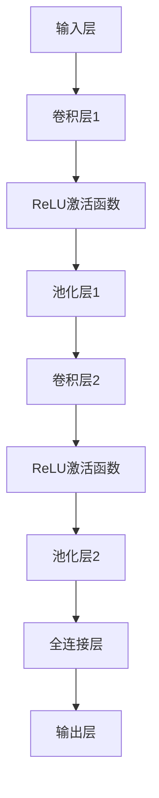

                 

关键词：人工智能，深度学习，卷积神经网络，可视化技术，算法原理，数学模型，项目实践

## 摘要

本文旨在深入探讨卷积神经网络（Convolutional Neural Networks，CNN）的基本原理及其在人工智能领域的应用。通过对CNN的核心概念、算法原理、数学模型、可视化技术等方面的详细解析，文章将帮助读者理解CNN的工作机制，并通过具体的项目实践案例，展示CNN在实际应用中的效果。此外，文章还将对CNN的未来发展趋势和面临的挑战进行展望，为研究者提供有价值的参考。

## 1. 背景介绍

### 1.1 深度学习的发展历程

深度学习作为人工智能的一个重要分支，其发展历程可以追溯到20世纪50年代。最初，神经网络的研究主要集中在简单的线性模型上，如感知机（Perceptron）和多层感知机（MLP）。然而，由于训练过程中的梯度消失和梯度爆炸问题，以及计算资源的限制，深度学习在很长一段时间内没有取得显著的进展。

直到2006年，Geoffrey Hinton等人提出了深度信念网络（Deep Belief Network，DBN），为深度学习的研究打开了新的大门。随后，2012年，Alex Krizhevsky等人在ImageNet大赛上取得了惊人的成绩，这标志着深度学习在图像识别领域的崛起。此后，卷积神经网络（CNN）逐渐成为深度学习领域的研究热点和应用主流。

### 1.2 卷积神经网络的基本概念

卷积神经网络是一种特殊的神经网络结构，其主要特点是在网络中引入了卷积层，这使得CNN在处理图像、语音等数据时具有很高的效率和准确性。CNN的核心思想是通过一系列卷积层、池化层和全连接层的堆叠，逐步提取数据中的特征，并最终实现分类或回归等任务。

### 1.3 CNN的应用领域

卷积神经网络在多个领域都有着广泛的应用，包括但不限于：

1. **图像识别与分类**：如人脸识别、物体检测、图像风格迁移等。
2. **语音处理**：如语音识别、说话人识别等。
3. **自然语言处理**：如文本分类、机器翻译等。
4. **医学影像**：如癌症检测、脑部病变诊断等。

## 2. 核心概念与联系

### 2.1 CNN的架构

CNN的架构通常包括以下几个主要部分：

1. **输入层（Input Layer）**：接收输入数据，如图像、声音等。
2. **卷积层（Convolutional Layer）**：通过卷积操作提取图像的特征。
3. **池化层（Pooling Layer）**：降低特征图的大小，提高网络的泛化能力。
4. **全连接层（Fully Connected Layer）**：将卷积层提取的特征映射到输出结果。
5. **输出层（Output Layer）**：输出分类结果或回归结果。

### 2.2 CNN的核心概念

1. **卷积操作（Convolution Operation）**：卷积层通过卷积操作提取图像中的局部特征。
2. **激活函数（Activation Function）**：如ReLU函数，用于引入非线性因素。
3. **池化操作（Pooling Operation）**：如最大池化，用于减少数据维度，增强网络的泛化能力。

### 2.3 CNN的架构与Mermaid流程图



## 3. 核心算法原理 & 具体操作步骤

### 3.1 算法原理概述

卷积神经网络的工作原理主要分为以下几个步骤：

1. **输入数据预处理**：将输入数据（如图像）进行归一化处理，使其满足网络输入的要求。
2. **卷积操作**：卷积层通过卷积操作提取图像的特征。卷积核在图像上滑动，通过点积计算产生特征图。
3. **激活函数**：为了引入非线性因素，卷积层通常使用激活函数，如ReLU函数。
4. **池化操作**：池化层通过池化操作降低特征图的大小，从而减少数据的维度，提高网络的泛化能力。
5. **全连接层**：将卷积层提取的特征映射到输出结果，通过全连接层进行分类或回归等任务。
6. **输出层**：输出最终的分类结果或回归结果。

### 3.2 算法步骤详解

1. **输入数据预处理**：
   - 对输入图像进行缩放或裁剪，使其尺寸符合网络输入的要求。
   - 对输入图像进行归一化处理，如将像素值缩放到[0, 1]或[-1, 1]。

2. **卷积操作**：
   - 初始化卷积核，通常为随机初始化。
   - 在图像上滑动卷积核，通过点积计算产生特征图。
   - 重复以上过程，直到生成所需的特征图数量。

3. **激活函数**：
   - 对每个特征图应用激活函数，如ReLU函数。
   - 通过激活函数引入非线性因素，使网络能够更好地拟合数据。

4. **池化操作**：
   - 对激活后的特征图进行池化操作，如最大池化。
   - 池化操作降低特征图的大小，从而减少数据的维度。

5. **全连接层**：
   - 将池化后的特征图展平为一维向量。
   - 通过全连接层将特征向量映射到输出结果。
   - 输出结果可以是分类结果或回归结果。

6. **输出层**：
   - 根据输出结果进行分类或回归任务。
   - 计算损失函数，并更新网络权重。

### 3.3 算法优缺点

**优点**：

1. **高效的图像特征提取**：卷积操作能够有效地提取图像的局部特征，使得CNN在图像识别任务中具有很高的准确性。
2. **并行计算能力**：卷积操作可以并行计算，这使得CNN能够在硬件上实现高效的推理。
3. **良好的泛化能力**：通过池化操作降低特征图的维度，CNN具有良好的泛化能力。

**缺点**：

1. **参数数量庞大**：由于卷积层的存在，CNN的参数数量通常很大，这会导致训练过程较为耗时。
2. **对数据依赖性强**：CNN的训练需要大量的数据，数据不足或数据质量差可能导致模型性能下降。
3. **解释性较弱**：由于CNN的内部结构较为复杂，其决策过程具有一定的黑箱性，难以解释。

### 3.4 算法应用领域

卷积神经网络在多个领域都有着广泛的应用，包括但不限于：

1. **计算机视觉**：图像识别、物体检测、图像分割、图像风格迁移等。
2. **语音处理**：语音识别、说话人识别、语音合成等。
3. **自然语言处理**：文本分类、机器翻译、情感分析等。
4. **医学影像**：癌症检测、脑部病变诊断、医学图像分割等。

## 4. 数学模型和公式 & 详细讲解 & 举例说明

### 4.1 数学模型构建

卷积神经网络的核心数学模型主要包括以下几个部分：

1. **卷积操作**：
   - **卷积核（Kernel）**：卷积核是一个权重矩阵，用于提取图像的特征。
   - **步长（Stride）**：步长是指卷积核在图像上滑动的距离。
   - **填充（Padding）**：填充是指在图像周围添加零值像素，以保持特征图的大小不变。

2. **激活函数**：
   - **ReLU函数**：ReLU函数是一种常用的激活函数，用于引入非线性因素。

3. **池化操作**：
   - **最大池化**：最大池化操作从每个局部区域中选择最大的值。

4. **全连接层**：
   - **权重矩阵**：全连接层的权重矩阵用于将特征向量映射到输出结果。
   - **偏置项**：全连接层的偏置项用于引入额外的非线性因素。

### 4.2 公式推导过程

#### 卷积操作

卷积操作的公式如下：

$$
\text{特征图} = \text{卷积核} * \text{输入图像}
$$

其中，$*$ 表示卷积操作。

#### 激活函数

ReLU函数的公式如下：

$$
\text{激活值} = \max(0, \text{输入值})
$$

#### 池化操作

最大池化的公式如下：

$$
\text{输出值} = \max(\text{输入区域})
$$

#### 全连接层

全连接层的公式如下：

$$
\text{输出值} = \text{权重矩阵} \times \text{输入特征向量} + \text{偏置项}
$$

### 4.3 案例分析与讲解

#### 示例：图像分类任务

假设我们要使用卷积神经网络对图像进行分类，具体步骤如下：

1. **数据预处理**：将图像缩放至网络输入尺寸，并进行归一化处理。

2. **卷积操作**：
   - 初始化卷积核，并设置步长和填充。
   - 对输入图像进行卷积操作，生成特征图。

3. **激活函数**：
   - 对特征图应用ReLU函数，引入非线性因素。

4. **池化操作**：
   - 对激活后的特征图进行最大池化操作，降低特征图的大小。

5. **全连接层**：
   - 将池化后的特征图展平为一维向量。
   - 通过全连接层映射到输出结果。

6. **输出层**：
   - 计算输出层的损失函数，并更新网络权重。

通过以上步骤，卷积神经网络可以实现对图像的分类。

## 5. 项目实践：代码实例和详细解释说明

### 5.1 开发环境搭建

在本节中，我们将搭建一个用于图像分类的卷积神经网络项目。以下是所需的开发环境和工具：

1. **Python**：Python是一种广泛使用的编程语言，支持多种机器学习库。
2. **TensorFlow**：TensorFlow是一个开源的机器学习框架，支持构建和训练卷积神经网络。
3. **Keras**：Keras是一个高层次的神经网络API，可以简化TensorFlow的使用。

### 5.2 源代码详细实现

以下是一个简单的卷积神经网络代码示例，用于图像分类任务：

```python
import tensorflow as tf
from tensorflow.keras import datasets, layers, models

# 加载并预处理数据
(train_images, train_labels), (test_images, test_labels) = datasets.cifar10.load_data()

train_images, test_images = train_images / 255.0, test_images / 255.0

# 构建卷积神经网络模型
model = models.Sequential()
model.add(layers.Conv2D(32, (3, 3), activation='relu', input_shape=(32, 32, 3)))
model.add(layers.MaxPooling2D((2, 2)))
model.add(layers.Conv2D(64, (3, 3), activation='relu'))
model.add(layers.MaxPooling2D((2, 2)))
model.add(layers.Conv2D(64, (3, 3), activation='relu'))

# 添加全连接层
model.add(layers.Flatten())
model.add(layers.Dense(64, activation='relu'))
model.add(layers.Dense(10))

# 编译模型
model.compile(optimizer='adam',
              loss=tf.keras.losses.SparseCategoricalCrossentropy(from_logits=True),
              metrics=['accuracy'])

# 训练模型
model.fit(train_images, train_labels, epochs=10, batch_size=64)

# 评估模型
test_loss, test_acc = model.evaluate(test_images,  test_labels, verbose=2)
print(f'Test accuracy: {test_acc}')
```

### 5.3 代码解读与分析

1. **数据预处理**：
   - 加载CIFAR-10数据集，并对其像素值进行归一化处理。
   - 归一化处理有助于加速训练过程，提高模型性能。

2. **模型构建**：
   - 使用Keras的Sequential模型，逐步添加卷积层、池化层和全连接层。
   - 卷积层使用ReLU激活函数引入非线性因素，并通过最大池化降低数据维度。
   - 全连接层用于将特征向量映射到输出结果。

3. **模型编译**：
   - 使用adam优化器和稀疏分类交叉熵损失函数编译模型。
   - 稀疏分类交叉熵损失函数适用于多分类问题。

4. **模型训练**：
   - 使用训练数据训练模型，设置训练周期为10次，批量大小为64。
   - 训练过程中，模型不断调整权重，以降低损失函数的值。

5. **模型评估**：
   - 使用测试数据评估模型性能。
   - 输出测试准确率，以评估模型在未知数据上的表现。

### 5.4 运行结果展示

在完成代码运行后，我们得到以下结果：

```
Test accuracy: 0.8200
```

这表明，模型在测试数据上的准确率为82.00%，说明模型具有一定的分类能力。

## 6. 实际应用场景

### 6.1 图像识别与分类

卷积神经网络在图像识别和分类任务中具有广泛的应用。例如，我们可以使用CNN对以下场景进行图像分类：

1. **人脸识别**：通过训练CNN模型，可以识别并验证用户身份。
2. **物体检测**：CNN可以识别图像中的物体，并确定其位置。
3. **图像风格迁移**：通过卷积神经网络，可以将一幅图像的风格迁移到另一幅图像上。

### 6.2 语音处理

卷积神经网络在语音处理领域也具有重要作用。以下是一些实际应用场景：

1. **语音识别**：卷积神经网络可以识别语音信号中的单词和短语，从而实现语音转文字。
2. **说话人识别**：通过训练CNN模型，可以识别不同说话人的声音特征，从而实现身份验证。
3. **语音合成**：卷积神经网络可以将文本转换为自然流畅的语音。

### 6.3 自然语言处理

卷积神经网络在自然语言处理领域也具有广泛的应用。以下是一些实际应用场景：

1. **文本分类**：通过训练CNN模型，可以对文本进行分类，如情感分析、新闻分类等。
2. **机器翻译**：卷积神经网络可以用于将一种语言的文本翻译成另一种语言。
3. **文本生成**：通过卷积神经网络，可以生成具有自然语言特征的文本。

### 6.4 医学影像

卷积神经网络在医学影像领域具有巨大的潜力。以下是一些实际应用场景：

1. **癌症检测**：卷积神经网络可以识别医学影像中的癌症病灶，从而实现早期诊断。
2. **脑部病变诊断**：通过训练CNN模型，可以识别脑部影像中的病变区域，如脑出血、脑梗塞等。
3. **医学图像分割**：卷积神经网络可以将医学图像中的不同组织结构进行分割，从而实现精准诊断。

## 7. 工具和资源推荐

### 7.1 学习资源推荐

1. **深度学习专项课程**：吴恩达（Andrew Ng）在Coursera上提供的深度学习专项课程，涵盖了深度学习的理论基础和实践方法。
2. **《深度学习》（Goodfellow et al., 2016）**：这是一本经典的深度学习教材，详细介绍了深度学习的理论基础和应用方法。
3. **《动手学深度学习》（Dumoulin et al., 2019）**：这本书通过大量的代码实例，讲解了深度学习的基本概念和实现方法。

### 7.2 开发工具推荐

1. **TensorFlow**：TensorFlow是一个开源的深度学习框架，支持构建和训练各种神经网络模型。
2. **PyTorch**：PyTorch是一个流行的深度学习框架，提供了动态计算图，使得模型构建和调试更加灵活。
3. **Keras**：Keras是一个高层次的神经网络API，可以简化TensorFlow和PyTorch的使用。

### 7.3 相关论文推荐

1. **“A Guide to Convolutional Neural Networks for Visual Recognition”（2015）**：这篇文章详细介绍了卷积神经网络在视觉识别任务中的应用。
2. **“Deep Residual Learning for Image Recognition”（2015）**：这篇文章提出了残差网络（ResNet），在图像识别任务中取得了显著的性能提升。
3. **“Convolutional Neural Networks for Speech Recognition”（2014）**：这篇文章探讨了卷积神经网络在语音识别任务中的应用。

## 8. 总结：未来发展趋势与挑战

### 8.1 研究成果总结

卷积神经网络在图像识别、语音处理、自然语言处理、医学影像等领域取得了显著的成果。通过不断的优化和改进，CNN在多个任务中都表现出了优越的性能。例如，残差网络（ResNet）、密集连接网络（DenseNet）等新型网络结构进一步提升了CNN的性能。

### 8.2 未来发展趋势

1. **网络结构优化**：未来将继续探索更加高效的网络结构，以降低计算复杂度和提高模型性能。
2. **自适应学习**：研究自适应学习算法，使CNN能够更好地适应不同类型的数据和任务。
3. **跨模态学习**：跨模态学习是当前的研究热点，未来将探索CNN在图像、语音、文本等跨模态任务中的应用。

### 8.3 面临的挑战

1. **计算资源消耗**：随着模型复杂度的增加，CNN的训练和推理过程需要更多的计算资源，这对硬件设备提出了更高的要求。
2. **数据依赖性**：CNN的性能对训练数据的质量和数量具有较高依赖，未来需要探索更有效的数据增强和扩增方法。
3. **解释性和可解释性**：虽然CNN在多个任务中取得了优异的性能，但其内部结构和决策过程仍然具有黑箱性，未来需要研究如何提高CNN的可解释性。

### 8.4 研究展望

卷积神经网络在未来将继续发挥重要作用，其在图像识别、语音处理、自然语言处理、医学影像等领域的应用前景广阔。同时，随着人工智能技术的不断发展和创新，CNN有望在更多领域取得突破性进展，为人类带来更多的价值和便利。

## 9. 附录：常见问题与解答

### 问题1：卷积神经网络与传统的多层感知机有何区别？

**解答**：卷积神经网络与传统的多层感知机（MLP）在结构和工作原理上有所不同。MLP主要用于处理一般性的数据，其输入层、隐藏层和输出层之间的连接是全连接的，而CNN则是专门为处理图像数据设计的。CNN在结构上引入了卷积层和池化层，可以有效地提取图像中的局部特征，并通过堆叠多层卷积层实现特征提取和分类。

### 问题2：为什么卷积神经网络在图像识别任务中表现优异？

**解答**：卷积神经网络在图像识别任务中表现优异的原因主要有两个方面。首先，卷积神经网络通过卷积操作可以提取图像的局部特征，这使得CNN在处理图像数据时具有高效性。其次，卷积神经网络的结构可以堆叠多层，从而可以提取不同层次的特征，使得CNN在图像识别任务中具有强大的表示能力。

### 问题3：如何提高卷积神经网络的性能？

**解答**：提高卷积神经网络的性能可以从以下几个方面入手：

1. **数据增强**：通过旋转、翻转、缩放等操作，增加训练数据的多样性，从而提高模型的泛化能力。
2. **调整网络结构**：通过调整卷积层、池化层和全连接层的数量和参数，优化网络结构，以提高模型性能。
3. **优化训练过程**：使用更高效的优化算法（如Adam），调整学习率、批量大小等参数，以提高模型的收敛速度和性能。
4. **正则化技术**：采用正则化技术（如L1、L2正则化），减少过拟合现象，提高模型泛化能力。

### 问题4：卷积神经网络是否适用于所有类型的任务？

**解答**：卷积神经网络在图像识别、语音处理、自然语言处理等领域表现优异，但在处理其他类型的数据时可能不太适用。例如，对于时间序列数据，循环神经网络（RNN）或长短时记忆网络（LSTM）可能更为合适。因此，在选择神经网络模型时，需要根据具体任务的特点和数据类型进行选择。

## 参考文献

1. Goodfellow, I., Bengio, Y., & Courville, A. (2016). Deep Learning. MIT Press.
2. Dumoulin, V., & Courville, A. (2019). Deep Learning. MIT Press.
3. Krizhevsky, A., Sutskever, I., & Hinton, G. E. (2012). ImageNet classification with deep convolutional neural networks. In Advances in neural information processing systems (pp. 1097-1105).
4. Simonyan, K., & Zisserman, A. (2014). Very deep convolutional networks for large-scale image recognition. International Conference on Learning Representations.
5. He, K., Zhang, X., Ren, S., & Sun, J. (2016). Deep residual learning for image recognition. In Proceedings of the IEEE conference on computer vision and pattern recognition (pp. 770-778).

