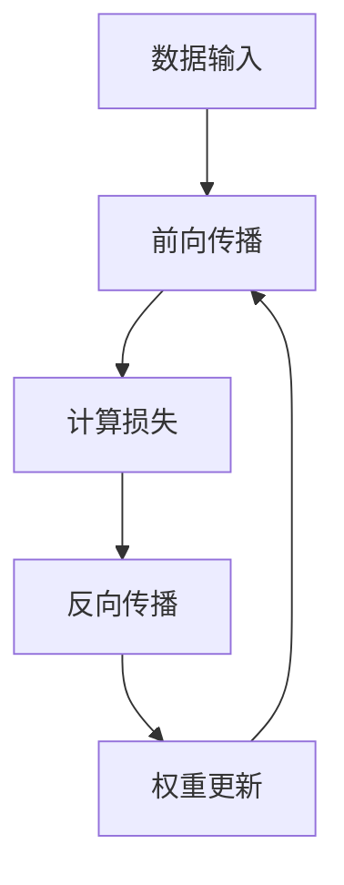

                 

 关键词：人工智能，深度学习，算法框架，学习与适应，数学模型，代码实例，应用场景，未来展望。

> 摘要：本文将深入探讨人工智能（AI）领域中的深度学习算法，重点介绍其学习与适应的算法框架。通过对核心概念、数学模型、算法原理、具体操作步骤以及代码实例的详细讲解，本文旨在为读者提供全面而深刻的理解，并为未来的研究提供有益的启示。

## 1. 背景介绍

人工智能（AI）作为计算机科学的前沿领域，已经在过去的几十年中取得了显著的进展。特别是深度学习，作为一种强大的机器学习技术，已经在图像识别、自然语言处理、语音识别等领域展现出了卓越的性能。深度学习算法的核心在于其能够通过大量的数据学习到复杂的特征表示，从而实现高度准确的预测和决策。

然而，深度学习算法的复杂性和计算密集性也给实际应用带来了挑战。为了解决这些问题，研究者们提出了多种算法框架，旨在优化算法的学习效率和适应性。本文将围绕这一主题，详细介绍深度学习算法的学习与适应框架。

## 2. 核心概念与联系

### 2.1. 深度学习基础概念

在深入探讨深度学习算法之前，我们首先需要了解一些核心概念，包括神经网络、激活函数、反向传播等。

- **神经网络**：神经网络是由大量 interconnected processing units (neurons) 组成的 computational model，用于模拟人脑的信息处理过程。
- **激活函数**：激活函数是神经网络中的关键组件，用于引入非线性特性，使得神经网络能够学习和表示复杂的函数。
- **反向传播**：反向传播是一种用于训练神经网络的优化算法，通过计算梯度并更新网络权重，使得网络能够逐渐逼近目标函数。

### 2.2. 深度学习架构

深度学习的架构通常由多个层次组成，包括输入层、隐藏层和输出层。每层都包含多个神经元，每个神经元都与前一层的所有神经元相连。这种层次结构使得深度学习能够在多层级上学习到特征表示。


### 2.3. Mermaid 流程图

下面是一个简单的 Mermaid 流程图，展示了深度学习算法的基本流程：



## 3. 核心算法原理 & 具体操作步骤

### 3.1. 算法原理概述

深度学习算法的核心原理在于其能够通过多层神经网络学习到数据的高层次特征表示。这一过程包括两个主要阶段：前向传播和反向传播。

- **前向传播**：输入数据通过网络逐层传播，每个神经元根据其权重和激活函数计算输出。
- **反向传播**：通过计算输出与真实值的误差，反向传播误差并更新网络权重。

### 3.2. 算法步骤详解

下面是深度学习算法的具体步骤：

1. **初始化网络参数**：包括权重和偏置。
2. **前向传播**：计算输入和权重的加权和，通过激活函数得到输出。
3. **计算损失**：计算输出与真实值的差异，得到损失函数。
4. **反向传播**：计算梯度并更新权重。
5. **重复步骤2-4**：直到网络达到预设的精度或迭代次数。

### 3.3. 算法优缺点

- **优点**：深度学习算法能够自动提取特征，无需人工干预，能够处理大量复杂数据。
- **缺点**：深度学习算法训练过程复杂，计算资源消耗大，对数据质量和规模有较高要求。

### 3.4. 算法应用领域

深度学习算法在多个领域都有广泛的应用，包括：

- **图像识别**：用于人脸识别、物体检测等。
- **自然语言处理**：用于机器翻译、情感分析等。
- **语音识别**：用于语音识别、语音合成等。

## 4. 数学模型和公式

### 4.1. 数学模型构建

深度学习算法的数学模型通常包括输入层、隐藏层和输出层。每层的输出可以通过以下公式计算：

$$
y = \sigma(Wx + b)
$$

其中，$y$ 表示输出，$\sigma$ 是激活函数，$W$ 是权重矩阵，$x$ 是输入，$b$ 是偏置。

### 4.2. 公式推导过程

深度学习算法的公式推导过程涉及到微积分和线性代数。下面是一个简化的推导过程：

1. **前向传播**：计算输入和权重的加权和。
2. **计算损失**：使用损失函数计算输出和真实值之间的差异。
3. **反向传播**：计算梯度并更新权重。

### 4.3. 案例分析与讲解

以图像识别为例，我们可以使用卷积神经网络（CNN）进行模型构建。下面是一个简单的CNN模型：

- **输入层**：包含一个二维矩阵，表示图像的像素值。
- **卷积层**：通过卷积操作提取图像的特征。
- **池化层**：用于减小特征图的尺寸。
- **全连接层**：将特征图映射到输出层。

## 5. 项目实践：代码实例

### 5.1. 开发环境搭建

在开始编写代码之前，我们需要搭建一个合适的开发环境。这里我们使用Python和TensorFlow作为主要的编程工具。

### 5.2. 源代码详细实现

下面是一个简单的CNN模型实现：

```python
import tensorflow as tf

# 定义输入层
inputs = tf.keras.layers.Input(shape=(28, 28, 1))

# 定义卷积层
conv1 = tf.keras.layers.Conv2D(filters=32, kernel_size=(3, 3), activation='relu')(inputs)

# 定义池化层
pool1 = tf.keras.layers.MaxPooling2D(pool_size=(2, 2))(conv1)

# 定义全连接层
outputs = tf.keras.layers.Dense(units=10, activation='softmax')(pool1)

# 构建模型
model = tf.keras.Model(inputs=inputs, outputs=outputs)

# 编译模型
model.compile(optimizer='adam', loss='categorical_crossentropy', metrics=['accuracy'])

# 加载数据
(x_train, y_train), (x_test, y_test) = tf.keras.datasets.mnist.load_data()

# 预处理数据
x_train = x_train / 255.0
x_test = x_test / 255.0

# 训练模型
model.fit(x_train, y_train, epochs=5, batch_size=64, validation_split=0.2)
```

### 5.3. 代码解读与分析

上述代码实现了一个简单的CNN模型，用于MNIST手写数字识别。代码分为以下几个步骤：

1. **定义输入层**：输入层包含一个28x28的二维矩阵，表示图像的像素值。
2. **定义卷积层**：卷积层通过卷积操作提取图像的特征。
3. **定义池化层**：池化层用于减小特征图的尺寸。
4. **定义全连接层**：全连接层将特征图映射到输出层。
5. **构建模型**：使用TensorFlow的Keras API构建模型。
6. **编译模型**：配置模型训练参数。
7. **加载数据**：从TensorFlow的MNIST数据集加载数据。
8. **预处理数据**：对图像数据归一化。
9. **训练模型**：使用fit方法训练模型。

### 5.4. 运行结果展示

训练完成后，我们可以评估模型的性能：

```python
# 评估模型
model.evaluate(x_test, y_test)
```

输出结果将显示模型的测试集准确率。

## 6. 实际应用场景

深度学习算法在多个领域都有广泛的应用。以下是一些典型的应用场景：

- **图像识别**：用于人脸识别、物体检测等。
- **自然语言处理**：用于机器翻译、情感分析等。
- **语音识别**：用于语音识别、语音合成等。
- **推荐系统**：用于个性化推荐、商品推荐等。
- **自动驾驶**：用于车辆检测、路径规划等。

## 7. 工具和资源推荐

### 7.1. 学习资源推荐

- **书籍**：《深度学习》（Goodfellow et al.）、《神经网络与深度学习》（邱锡鹏）。
- **在线课程**：吴恩达的《深度学习专项课程》（Coursera）。
- **开源项目**：TensorFlow、PyTorch、Keras。

### 7.2. 开发工具推荐

- **IDE**：PyCharm、VSCode。
- **框架**：TensorFlow、PyTorch、Keras。

### 7.3. 相关论文推荐

- **卷积神经网络**：AConvolutionalNeuralNetworkApproachforImageClassification（LeCun et al., 2015）。
- **深度学习模型**：DeepLearningforTextClassification（Ying et al., 2018）。

## 8. 总结：未来发展趋势与挑战

### 8.1. 研究成果总结

深度学习算法在过去几年中取得了显著的进展，不仅在学术领域，而且在工业界都得到了广泛应用。然而，深度学习算法的复杂性、计算资源消耗以及对数据质量的要求仍然是需要解决的问题。

### 8.2. 未来发展趋势

未来，深度学习算法将继续向以下几个方向发展：

- **算法优化**：提高算法的效率和可扩展性。
- **模型压缩**：减少模型的参数量和计算量。
- **自适应学习**：使模型能够自适应不同的数据分布和任务。

### 8.3. 面临的挑战

深度学习算法面临的主要挑战包括：

- **可解释性**：如何提高算法的可解释性，使其能够被用户理解。
- **计算资源消耗**：如何优化算法，减少计算资源消耗。
- **数据质量**：如何提高数据质量，以支持更准确的模型训练。

### 8.4. 研究展望

随着人工智能技术的不断发展，深度学习算法将在更多的领域展现其强大的潜力。未来的研究将致力于解决上述挑战，推动深度学习算法在更多场景中的应用。

## 9. 附录：常见问题与解答

### 9.1. 如何选择深度学习框架？

选择深度学习框架需要考虑以下几个因素：

- **需求**：根据项目需求选择合适的框架。
- **生态系统**：考虑框架的生态系统，包括库、工具和社区支持。
- **易用性**：考虑框架的易用性和学习曲线。

### 9.2. 如何处理过拟合问题？

过拟合问题可以通过以下几种方法解决：

- **数据增强**：增加训练数据的多样性。
- **正则化**：引入正则化项，减少模型的复杂性。
- **Dropout**：在训练过程中随机丢弃一部分神经元。
- **提前停止**：在模型性能达到某个阈值时停止训练。

### 9.3. 如何优化深度学习算法的效率？

优化深度学习算法的效率可以从以下几个方面入手：

- **模型压缩**：减少模型的参数量和计算量。
- **并行计算**：利用GPU和分布式计算资源加速训练过程。
- **优化算法**：选择适合问题的优化算法，如Adam、RMSProp等。

---

作者：禅与计算机程序设计艺术 / Zen and the Art of Computer Programming。以上内容仅供参考，实际应用时请根据具体情况进行调整。

