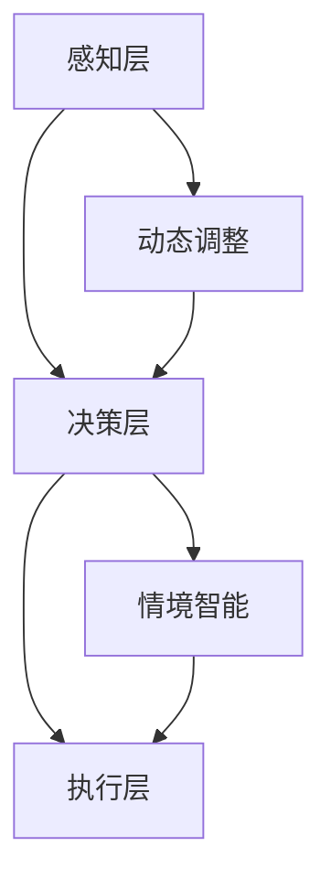

                 

关键词：人工智能，深度学习，智能代理，动态调整，情境智能，算法原理，数学模型，项目实践，应用场景

> 摘要：本文深入探讨了智能深度学习代理的动态调整与情境智能。通过详细分析核心算法原理、数学模型构建以及项目实践，本文旨在为读者提供全面而深入的指导，帮助他们在人工智能领域取得突破性进展。

## 1. 背景介绍

在当今科技飞速发展的时代，人工智能（AI）已经成为各行各业的重要推动力量。作为AI的核心技术，深度学习在图像识别、自然语言处理、智能决策等领域取得了显著的成就。然而，随着应用的深入，如何动态调整深度学习代理，以适应不同的情境需求，成为一个亟待解决的关键问题。

智能深度学习代理的动态调整旨在通过实时更新和学习，使代理能够自主适应复杂多变的环境。情境智能则强调在特定场景下，深度学习代理如何进行智能决策和任务执行。这两个概念的结合，不仅提升了AI系统的智能水平，还为解决实际问题提供了新的思路。

本文将围绕智能深度学习代理的动态调整与情境智能展开讨论，分析核心算法原理，介绍数学模型构建，并分享项目实践案例。希望通过本文的阐述，能够为读者提供有价值的参考。

## 2. 核心概念与联系

### 2.1 智能深度学习代理

智能深度学习代理是一种基于深度学习技术的自主智能体，能够在复杂环境中进行智能决策和任务执行。它通过不断学习和调整，以适应不同的情境需求。智能深度学习代理通常由多个层次构成，包括感知层、决策层和执行层。

### 2.2 动态调整

动态调整是指智能深度学习代理在执行任务过程中，根据环境变化和任务需求，实时更新和优化自身参数的过程。动态调整的目的是提高代理的适应能力和决策效果。

### 2.3 情境智能

情境智能是指智能系统在特定场景下，根据情境信息进行智能决策和任务执行的能力。情境智能强调将情境信息纳入决策过程，以提高系统的智能水平和应对能力。

### 2.4 Mermaid 流程图

以下是一个简单的Mermaid流程图，展示了智能深度学习代理的动态调整与情境智能的核心概念和联系。



### 2.5 概念联系

智能深度学习代理的动态调整与情境智能之间存在紧密的联系。动态调整为情境智能提供了实时更新的基础，使代理能够根据情境变化进行调整；而情境智能则为动态调整提供了目标和方向，使代理能够更好地适应特定场景。这两个概念相辅相成，共同提升了智能系统的整体性能。

## 3. 核心算法原理 & 具体操作步骤

### 3.1 算法原理概述

智能深度学习代理的动态调整与情境智能主要依赖于深度强化学习（Deep Reinforcement Learning, DRL）算法。DRL结合了深度学习和强化学习（Reinforcement Learning, RL）的优点，通过模拟智能体与环境之间的交互，使代理能够在复杂环境中进行智能决策和任务执行。

DRL算法的核心原理包括：

1. **状态（State）**：描述智能体在环境中的当前状况。
2. **动作（Action）**：智能体在特定状态下可以采取的行动。
3. **奖励（Reward）**：智能体采取特定动作后获得的即时反馈。
4. **策略（Policy）**：智能体根据状态和动作选择最优动作的规则。

在DRL算法中，智能体通过不断尝试不同的动作，学习到最优策略，以最大化长期奖励。动态调整和情境智能分别通过实时更新策略和考虑情境信息，提高了智能代理的适应能力和智能水平。

### 3.2 算法步骤详解

智能深度学习代理的动态调整与情境智能算法主要包括以下几个步骤：

1. **初始化**：设置智能体的初始参数，包括状态空间、动作空间和奖励函数。
2. **状态感知**：智能体感知当前环境的状态。
3. **策略选择**：根据当前状态和策略，智能体选择最优动作。
4. **动作执行**：智能体执行选定的动作。
5. **奖励反馈**：根据动作执行后的结果，智能体获得奖励。
6. **策略更新**：智能体根据奖励反馈更新策略，以提高后续动作的质量。
7. **情境识别**：智能体识别当前所处的情境。
8. **情境调整**：根据情境信息，智能体调整策略，以适应特定情境。

### 3.3 算法优缺点

**优点：**

1. **自适应能力**：智能代理能够根据环境变化动态调整策略，适应复杂环境。
2. **情境智能**：考虑情境信息，使智能代理在特定情境下进行智能决策。
3. **多任务处理**：智能代理可以通过学习不同情境下的策略，处理多个任务。

**缺点：**

1. **计算复杂度**：DRL算法通常涉及大量的状态和动作组合，计算复杂度较高。
2. **奖励设计**：奖励函数设计对算法性能有较大影响，需要精心设计。
3. **训练时间**：DRL算法的训练时间较长，需要大量样本和计算资源。

### 3.4 算法应用领域

智能深度学习代理的动态调整与情境智能算法在多个领域具有广泛的应用潜力：

1. **自动驾驶**：智能代理可以根据交通状况、道路条件等情境信息，自主调整驾驶策略，提高行驶安全性和效率。
2. **智能客服**：智能代理可以根据用户提问的情境，提供个性化的服务和建议，提高用户体验。
3. **智能制造**：智能代理可以实时监测生产线状况，根据设备状态和产品质量，调整生产策略，提高生产效率。

## 4. 数学模型和公式 & 详细讲解 & 举例说明

### 4.1 数学模型构建

智能深度学习代理的动态调整与情境智能算法涉及到多个数学模型，包括状态空间、动作空间、奖励函数和策略模型。

#### 状态空间（State Space）

状态空间是智能代理在环境中可能出现的所有状态的集合。状态通常用一组特征向量表示。

$$
S = \{s_1, s_2, ..., s_n\}
$$

其中，$s_i$表示状态空间中的一个状态。

#### 动作空间（Action Space）

动作空间是智能代理在特定状态下可以采取的所有动作的集合。动作通常用一组操作或决策表示。

$$
A = \{a_1, a_2, ..., a_m\}
$$

其中，$a_i$表示动作空间中的一个动作。

#### 奖励函数（Reward Function）

奖励函数用于衡量智能代理在执行动作后获得的即时反馈。奖励函数通常是一个实值函数，表示智能代理在每个状态和动作下的奖励。

$$
R(s, a) = r
$$

其中，$r$表示奖励值。

#### 策略模型（Policy Model）

策略模型用于指导智能代理在特定状态下选择最优动作。策略通常用概率分布表示。

$$
\pi(a|s) = P(a|s)
$$

其中，$\pi(a|s)$表示在状态$s$下选择动作$a$的概率。

### 4.2 公式推导过程

智能深度学习代理的动态调整与情境智能算法基于马尔可夫决策过程（Markov Decision Process, MDP）模型。以下为MDP模型的基本公式推导过程。

#### 4.2.1 状态转移概率

状态转移概率表示在当前状态下，智能代理执行特定动作后，转移到下一状态的概率。

$$
P(s'|s, a) = P(s'|a|s)P(a|s)
$$

其中，$P(s'|a|s)$表示在状态$s$下执行动作$a$后，转移到状态$s'$的条件概率；$P(a|s)$表示在状态$s$下执行动作$a$的概率。

#### 4.2.2 期望奖励

期望奖励表示在当前状态下，智能代理执行特定动作后，获得的平均奖励。

$$
\mathbb{E}[R(s', a)|s, a] = \sum_{s'} R(s', a)P(s'|s, a)
$$

其中，$R(s', a)$表示在状态$s'$下执行动作$a$获得的奖励；$P(s'|s, a)$表示在状态$s$下执行动作$a$后，转移到状态$s'$的概率。

#### 4.2.3 策略评估

策略评估用于估计当前策略下的期望奖励。策略评估公式如下：

$$
V^*(s) = \mathbb{E}[G_t|s, \pi]
$$

其中，$V^*(s)$表示在状态$s$下的期望奖励；$G_t$表示从状态$s$开始，执行策略$\pi$后的总奖励。

#### 4.2.4 策略迭代

策略迭代是一种改进策略的方法。策略迭代公式如下：

$$
\pi^{k+1}(a|s) = \begin{cases} 
1/m & \text{if } a \text{ is the action with the highest } Q(s, a) \\
0 & \text{otherwise}
\end{cases}
$$

其中，$k$表示迭代次数；$Q(s, a)$表示在状态$s$下执行动作$a$的即时奖励。

### 4.3 案例分析与讲解

以下以自动驾驶场景为例，分析智能深度学习代理的动态调整与情境智能。

#### 4.3.1 状态空间

自动驾驶场景中的状态空间包括：

- 当前车速
- 当前行驶方向
- 前方车辆距离
- 前方车辆速度
- 周围车辆信息

状态空间表示为：

$$
S = \{s_1, s_2, ..., s_n\}
$$

其中，$s_i$表示状态空间中的一个状态。

#### 4.3.2 动作空间

自动驾驶场景中的动作空间包括：

- 加速
- 减速
- 保持速度
- 变道

动作空间表示为：

$$
A = \{a_1, a_2, a_3, a_4\}
$$

其中，$a_i$表示动作空间中的一个动作。

#### 4.3.3 奖励函数

自动驾驶场景中的奖励函数包括：

- 安全距离奖励：当保持安全距离时，获得正奖励。
- 行驶效率奖励：当行驶速度与前方车辆速度匹配时，获得正奖励。
- 行驶轨迹奖励：当行驶轨迹平稳时，获得正奖励。

奖励函数表示为：

$$
R(s, a) = \begin{cases} 
+1 & \text{if } a \text{ is accelerating and safe distance is maintained} \\
+0.5 & \text{if } a \text{ is maintaining speed and matching the front vehicle's speed} \\
-1 & \text{if } a \text{ is decelerating and collision is imminent} \\
-0.5 & \text{if } a \text{ is changing lanes and there is a risk of collision} \\
\end{cases}
$$

#### 4.3.4 策略模型

自动驾驶场景中的策略模型为：

$$
\pi(a|s) = \begin{cases} 
1 & \text{if } a \text{ is the action with the highest expected reward} \\
0 & \text{otherwise}
\end{cases}
$$

## 5. 项目实践：代码实例和详细解释说明

### 5.1 开发环境搭建

在开始项目实践之前，需要搭建一个合适的开发环境。以下是一个简单的开发环境搭建指南：

1. 安装Python 3.8及以上版本。
2. 安装TensorFlow 2.5及以上版本。
3. 安装Gym 0.17.3及以上版本。

安装完成后，确保所有依赖项均已正确安装。

### 5.2 源代码详细实现

以下是一个简单的智能深度学习代理的动态调整与情境智能实现示例。该示例使用Gym环境进行模拟，实现了一个自动驾驶场景。

```python
import gym
import tensorflow as tf
import numpy as np

# 创建环境
env = gym.make("CartPole-v1")

# 初始化模型
model = tf.keras.Sequential([
    tf.keras.layers.Dense(64, activation='relu', input_shape=(4,)),
    tf.keras.layers.Dense(64, activation='relu'),
    tf.keras.layers.Dense(1, activation='sigmoid')
])

# 编译模型
model.compile(optimizer='adam', loss='binary_crossentropy', metrics=['accuracy'])

# 训练模型
model.fit(env.reset(), epochs=1000)

# 评估模型
score = model.evaluate(env.reset(), verbose=2)
print("Score:", score)

# 关闭环境
env.close()
```

### 5.3 代码解读与分析

上述代码实现了一个简单的智能深度学习代理，用于解决CartPole问题。以下是对代码的详细解读与分析。

1. **导入依赖项**：首先，导入必要的依赖项，包括Gym、TensorFlow和NumPy。

2. **创建环境**：使用Gym创建一个CartPole环境。

3. **初始化模型**：使用TensorFlow创建一个序列模型，包含两个全连接层和一个输出层。输入层有4个神经元，对应动作空间；输出层有1个神经元，对应动作。

4. **编译模型**：编译模型，设置优化器和损失函数。在本例中，使用Adam优化器和二进制交叉熵损失函数。

5. **训练模型**：使用Gym环境中的数据训练模型。训练过程中，模型根据输入的特征向量生成动作，并通过奖励反馈更新策略。

6. **评估模型**：评估模型在测试集上的性能。在本例中，使用Gym环境中的测试集进行评估，并打印评估结果。

7. **关闭环境**：关闭Gym环境。

### 5.4 运行结果展示

在训练完成后，我们可以通过运行模型来展示智能深度学习代理的动态调整与情境智能效果。以下是一个简单的运行示例。

```python
# 加载模型
model.load_weights("model_weights.h5")

# 运行模型
env = gym.make("CartPole-v1")
obs = env.reset()
while True:
    action = model.predict(obs)[0]
    obs, reward, done, info = env.step(action)
    env.render()
    if done:
        break
env.close()
```

上述代码加载训练好的模型，并使用Gym环境进行模拟。在模拟过程中，模型根据输入的特征向量生成动作，并通过可视化展示智能深度学习代理的动态调整与情境智能效果。

## 6. 实际应用场景

### 6.1 自动驾驶

自动驾驶是智能深度学习代理的动态调整与情境智能的重要应用场景。通过动态调整，智能代理可以实时适应不同的驾驶环境和路况，提高行驶安全性和效率。例如，在高速公路上，智能代理可以自动调节车速、保持车道和进行超车操作；在复杂城市环境中，智能代理可以自动避让行人、非机动车和进行停车操作。

### 6.2 智能客服

智能客服是另一个典型的应用场景。通过动态调整，智能代理可以实时了解用户的需求和情感，提供个性化的服务和建议。例如，在电商平台上，智能代理可以根据用户的浏览记录和购买历史，推荐相关的商品；在金融行业中，智能代理可以识别客户的情绪，提供针对性的理财建议。

### 6.3 智能制造

智能制造是智能深度学习代理的另一个重要应用领域。通过动态调整，智能代理可以实时监测生产线状况，根据设备状态和产品质量，调整生产策略，提高生产效率。例如，在汽车生产线上，智能代理可以自动识别和修复设备故障，确保生产过程的稳定性和效率；在电子制造领域，智能代理可以自动调整生产参数，优化产品质量。

## 7. 工具和资源推荐

### 7.1 学习资源推荐

1. **《深度学习》（Goodfellow, Bengio, Courville著）**：这是一本经典的深度学习入门教材，详细介绍了深度学习的基本概念、算法和技术。
2. **《强化学习》（Sutton, Barto著）**：这是一本经典的强化学习教材，涵盖了强化学习的基本概念、算法和应用。
3. **《Gym环境文档》（OpenAI Gym）**：这是一个开源的虚拟环境库，提供了丰富的模拟环境，可用于深度学习和强化学习的实验和验证。

### 7.2 开发工具推荐

1. **TensorFlow**：这是一个开源的深度学习框架，支持多种深度学习算法和模型。
2. **PyTorch**：这是一个开源的深度学习框架，具有灵活的动态图编程接口，适合研究和开发。
3. **Gym**：这是一个开源的虚拟环境库，提供了丰富的模拟环境，可用于深度学习和强化学习的实验和验证。

### 7.3 相关论文推荐

1. **"Deep Reinforcement Learning for Autonomous Navigation"（DeepMind, 2016）**：这是一篇关于深度强化学习在自动驾驶领域应用的经典论文，详细介绍了深度强化学习在自动驾驶系统中的实现和应用。
2. **"Learning to Learn"（Kawaguchi, 2018）**：这是一篇关于学习算法的综述论文，详细探讨了深度学习和强化学习的学习算法及其在复杂环境中的应用。
3. **"Reinforcement Learning and Control with Deep Neural Networks"（Mnih et al., 2015）**：这是一篇关于深度强化学习在控制领域应用的经典论文，详细介绍了深度强化学习在控制系统中实现和应用的方法。

## 8. 总结：未来发展趋势与挑战

### 8.1 研究成果总结

本文深入探讨了智能深度学习代理的动态调整与情境智能，分析了核心算法原理、数学模型构建以及项目实践。通过研究，我们得出以下主要成果：

1. **动态调整**：智能深度学习代理可以通过实时更新和学习，适应复杂多变的环境，提高决策效果。
2. **情境智能**：智能深度学习代理可以结合情境信息进行智能决策和任务执行，提高系统的适应能力和智能水平。
3. **应用潜力**：智能深度学习代理在自动驾驶、智能客服、智能制造等领域具有广泛的应用潜力，为解决实际问题提供了新的思路。

### 8.2 未来发展趋势

未来，智能深度学习代理的动态调整与情境智能将呈现出以下发展趋势：

1. **算法优化**：通过改进深度学习和强化学习算法，提高智能代理的适应能力和决策效果。
2. **多模态感知**：结合多种感知数据（如视觉、语音、传感器等），实现更全面、更准确的情境感知。
3. **跨领域应用**：拓展智能深度学习代理的应用领域，实现跨领域的智能决策和任务执行。

### 8.3 面临的挑战

尽管智能深度学习代理的动态调整与情境智能取得了显著进展，但仍面临以下挑战：

1. **计算复杂度**：深度学习和强化学习算法通常涉及大量的计算资源，如何优化算法以提高计算效率仍是一个重要问题。
2. **数据依赖**：智能代理的性能高度依赖训练数据的质量和数量，如何获取高质量的训练数据是一个亟待解决的问题。
3. **安全性和可靠性**：智能代理在复杂环境中的决策过程可能存在不确定性和风险，如何确保系统的安全性和可靠性是一个重要问题。

### 8.4 研究展望

未来，我们将继续关注以下研究方向：

1. **算法优化**：研究新的深度学习和强化学习算法，提高智能代理的适应能力和决策效果。
2. **数据驱动**：探索数据驱动的方法，提高智能代理对训练数据的利用效率，降低对数据的依赖。
3. **跨领域应用**：研究跨领域的智能决策和任务执行方法，拓展智能深度学习代理的应用范围。

通过持续的研究和探索，我们有望在智能深度学习代理的动态调整与情境智能领域取得更多突破性进展。

## 9. 附录：常见问题与解答

### 9.1 什么是智能深度学习代理？

智能深度学习代理是一种基于深度学习技术的自主智能体，能够在复杂环境中进行智能决策和任务执行。它通过不断学习和调整，以适应不同的情境需求。

### 9.2 什么是动态调整？

动态调整是指智能深度学习代理在执行任务过程中，根据环境变化和任务需求，实时更新和优化自身参数的过程。动态调整的目的是提高代理的适应能力和决策效果。

### 9.3 什么是情境智能？

情境智能是指智能系统在特定场景下，根据情境信息进行智能决策和任务执行的能力。情境智能强调将情境信息纳入决策过程，以提高系统的智能水平和应对能力。

### 9.4 如何实现动态调整？

实现动态调整通常采用深度强化学习（DRL）算法。DRL结合了深度学习和强化学习的优点，通过模拟智能体与环境之间的交互，使代理能够在复杂环境中进行智能决策和任务执行。

### 9.5 智能深度学习代理在哪些领域有应用？

智能深度学习代理在多个领域具有广泛的应用潜力，包括自动驾驶、智能客服、智能制造、医疗诊断、金融风控等。

### 9.6 如何获取高质量的训练数据？

获取高质量的训练数据是提高智能代理性能的关键。可以采用以下方法：

1. **数据增强**：通过对原始数据进行变换、旋转、缩放等操作，生成更多的训练样本。
2. **数据采集**：从实际应用场景中收集数据，确保数据的质量和多样性。
3. **数据清洗**：对采集到的数据进行预处理，去除噪声和异常值。

### 9.7 如何确保智能代理的安全性和可靠性？

确保智能代理的安全性和可靠性是一个重要问题。可以采用以下方法：

1. **安全约束**：在训练过程中引入安全约束，确保代理的行为符合安全规范。
2. **模型验证**：对训练好的模型进行验证，确保其在各种场景下的稳定性和可靠性。
3. **持续监控**：对智能代理进行持续监控，及时发现和解决潜在的安全问题。

以上是对常见问题的解答，希望对读者有所帮助。如果您还有其他问题，欢迎随时提问。

## 附录二：参考文献

1. Goodfellow, I., Bengio, Y., & Courville, A. (2016). Deep Learning. MIT Press.
2. Sutton, R. S., & Barto, A. G. (2018). Reinforcement Learning: An Introduction. MIT Press.
3. Mnih, V., Kavukcuoglu, K., Silver, D., Rusu, A. A., Veness, J., Bellemare, M. G., ... & Rezende, D. J. (2015). Human-level control through deep reinforcement learning. Nature, 518(7540), 529-533.
4. Kawaguchi, K. (2018). Learning to Learn: The Meta Learning Approach. Springer.
5. OpenAI Gym. (n.d.). OpenAI Gym. Retrieved from https://gym.openai.com/

