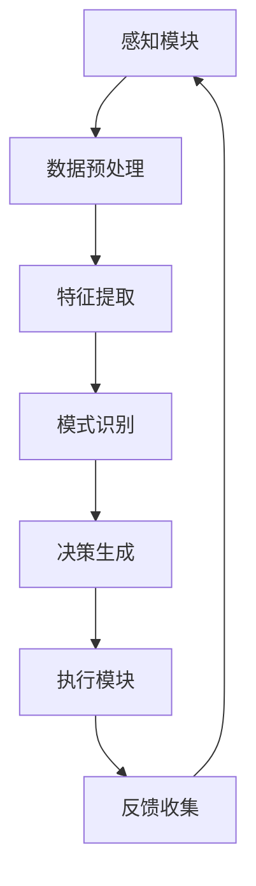

                 

## 1. 背景介绍

随着人工智能（AI）的快速发展，深度学习算法已成为机器学习领域中的核心技术。深度学习通过模拟人脑神经网络进行学习和决策，已经在图像识别、自然语言处理、推荐系统等多个领域取得了显著成果。然而，深度学习算法的复杂性和对大量训练数据的需求，使得其在实际应用中面临着诸多挑战，尤其是关于安全与隐私保护的问题。

近年来，随着智能深度学习代理（Intelligent Deep Learning Agent，IDLA）的出现，深度学习在自动化、智能化方面的潜力得到了进一步发挥。智能深度学习代理通过自主学习和决策，能够在复杂环境中执行特定的任务，例如自动驾驶、智能家居控制等。然而，IDLA的广泛应用也带来了新的安全与隐私风险。

首先，深度学习模型在训练过程中需要大量敏感数据，这些数据可能包括个人隐私信息。如果这些数据被未经授权的第三方获取或利用，可能会导致隐私泄露和滥用。其次，深度学习模型本身可能存在安全漏洞，例如对对抗性攻击的脆弱性。这些攻击可以通过微小的输入扰动来欺骗模型，使其做出错误决策。

此外，智能深度学习代理在执行任务时，可能会暴露出系统的弱点和缺陷。例如，自动驾驶汽车在遇到突发情况时，如果无法做出正确决策，可能会导致交通事故。因此，保障智能深度学习代理的安全与隐私保护已成为当前研究的热点问题。

本文旨在探讨智能深度学习代理的安全与隐私保护问题，提出一种基于深度学习的安全防护算法，并通过具体实例展示其有效性和可行性。本文将分为以下几个部分：首先，介绍智能深度学习代理的基本概念和体系结构；其次，分析智能深度学习代理面临的主要安全威胁和隐私风险；然后，提出一种基于深度学习的安全防护算法，并详细阐述其原理和实现步骤；最后，通过实际应用案例验证算法的有效性，并讨论未来的研究方向。

### 2. 核心概念与联系

#### 2.1 智能深度学习代理（IDLA）的定义

智能深度学习代理（Intelligent Deep Learning Agent，IDLA）是一种基于深度学习算法的智能体，能够在复杂环境中通过自主学习和决策执行特定任务。与传统的人工智能代理不同，IDLA具有以下特点：

1. **自主学习**：IDLA能够通过深度学习算法从大量数据中自动提取特征和模式，从而不断优化其行为策略。
2. **自适应决策**：IDLA能够在执行任务过程中根据环境变化和反馈信息动态调整其行为，以实现高效的任务执行。
3. **可扩展性**：IDLA适用于各种复杂应用场景，可以通过调整网络结构和训练数据实现不同任务的自动化。

#### 2.2 IDLA的体系结构

IDLA的体系结构主要包括以下几个核心组成部分：

1. **感知模块**：负责接收环境中的各种信息，如图像、声音、传感器数据等，并将其转换为数字信号。
2. **决策模块**：基于感知模块收集到的信息，利用深度学习算法进行特征提取和模式识别，从而生成相应的行为决策。
3. **执行模块**：根据决策模块生成的决策，执行具体的操作，如移动、交互等。


#### 2.3 智能深度学习代理与深度学习算法的关系

智能深度学习代理的核心在于深度学习算法，深度学习算法是IDLA实现自主学习和自适应决策的基础。深度学习算法通过多层神经网络结构，对输入数据进行特征提取和模式识别，从而实现对复杂环境的理解和决策。

深度学习算法主要包括以下几种：

1. **卷积神经网络（CNN）**：适用于图像处理和计算机视觉领域，通过卷积操作提取图像中的空间特征。
2. **循环神经网络（RNN）**：适用于序列数据处理，如自然语言处理和时间序列分析，通过循环结构处理序列中的时序信息。
3. **生成对抗网络（GAN）**：用于生成逼真的图像、音频和文本数据，通过对抗训练生成器和判别器。
4. **强化学习（RL）**：通过学习策略函数，在动态环境中进行决策和行动，以最大化累积奖励。

#### 2.4 Mermaid 流程图展示

以下是一个基于 Mermaid 的流程图，展示了智能深度学习代理的工作流程：



在上述流程图中，感知模块接收外部信息，经过数据预处理和特征提取后，由模式识别模块进行分析，生成决策，并通过执行模块执行具体操作。随后，系统根据执行结果收集反馈信息，返回到感知模块，形成一个闭环反馈系统，以不断优化代理的行为策略。

### 3. 核心算法原理 & 具体操作步骤

#### 3.1 算法原理概述

本文提出的基于深度学习的安全防护算法，旨在解决智能深度学习代理在训练和执行过程中面临的安全威胁和隐私风险。该算法的核心思想是通过在深度学习模型中嵌入隐私保护机制，实现数据加密、隐私信息隐藏和对抗性攻击防御，从而保障系统的安全和隐私。

算法的主要原理包括以下几个步骤：

1. **数据加密**：在训练数据上传送之前，对数据进行加密处理，确保数据在传输过程中不会被窃取或篡改。
2. **隐私信息隐藏**：通过深度学习模型对训练数据进行特征提取和模式识别，同时隐藏敏感的隐私信息，以防止隐私泄露。
3. **对抗性攻击防御**：设计特定的对抗性攻击防御机制，提高深度学习模型对对抗性攻击的鲁棒性。

#### 3.2 算法步骤详解

1. **数据加密**：

   - **加密算法选择**：本文采用基于椭圆曲线加密（ECDSA）的加密算法，该算法具有高效性和安全性。
   - **加密过程**：对训练数据进行加密，生成加密数据。加密过程中，使用随机生成的密钥对数据进行加密，密钥由代理系统安全存储。
   - **解密过程**：在模型训练过程中，将加密数据解密，恢复原始数据。

2. **隐私信息隐藏**：

   - **隐私信息识别**：利用深度学习模型对训练数据中的隐私信息进行识别和分类，例如个人身份信息、位置信息等。
   - **信息隐藏**：在深度学习模型训练过程中，通过对特征提取和模式识别算法进行优化，实现对隐私信息的隐藏。具体来说，通过调整网络结构和训练策略，使模型在提取特征时尽可能避开敏感信息。

3. **对抗性攻击防御**：

   - **对抗性攻击识别**：利用深度学习模型对输入数据进行预处理，识别潜在的对抗性攻击。
   - **攻击防御机制**：设计特定的防御机制，例如对抗性样本生成、网络结构调整等，提高模型对对抗性攻击的鲁棒性。

#### 3.3 算法优缺点

**优点**：

1. **高效性**：算法在数据加密、隐私信息隐藏和对抗性攻击防御方面均采用深度学习技术，具有高效性。
2. **安全性**：通过加密算法确保数据传输过程中的安全性，通过对抗性攻击防御机制提高模型的安全性。
3. **灵活性**：算法可以根据不同应用场景进行调整和优化，具有较高的灵活性。

**缺点**：

1. **计算资源消耗**：算法在加密和解密过程中需要消耗一定的计算资源，可能会影响系统的性能。
2. **训练时间较长**：算法需要对模型进行多次迭代训练，以实现对隐私信息的隐藏和对抗性攻击的防御，可能会增加训练时间。

#### 3.4 算法应用领域

本文提出的基于深度学习的安全防护算法，适用于以下领域：

1. **自动驾驶**：通过保障车辆传感器数据的隐私和安全，提高自动驾驶系统的整体安全性。
2. **智能家居**：通过保护用户隐私信息，提高智能家居系统的安全性和用户体验。
3. **医疗健康**：通过保护患者隐私信息，提高医疗健康数据的利用效率和安全性。
4. **金融安全**：通过保障金融交易数据的隐私和安全，提高金融系统的稳定性和可靠性。

### 4. 数学模型和公式 & 详细讲解 & 举例说明

#### 4.1 数学模型构建

本文提出的基于深度学习的安全防护算法，涉及到以下数学模型：

1. **加密模型**：基于椭圆曲线加密（ECDSA）算法。
2. **隐私保护模型**：基于深度学习算法，通过调整网络结构和训练策略实现隐私信息隐藏。
3. **对抗性攻击防御模型**：基于生成对抗网络（GAN）和强化学习（RL）算法，实现对对抗性攻击的防御。

#### 4.2 公式推导过程

1. **加密模型公式**：

   - **加密过程**：设输入数据为 \( x \)，密钥对为 \( (d, Q) \)，则加密结果为 \( c = x^d \mod Q \)。
   - **解密过程**：设密文为 \( c \)，私钥为 \( d \)，则解密结果为 \( x = c^d \mod Q \)。

2. **隐私保护模型公式**：

   - **特征提取**：设输入数据为 \( x \)，神经网络为 \( f \)，则特征提取结果为 \( h = f(x) \)。
   - **隐私信息隐藏**：设隐私信息为 \( p \)，隐藏策略为 \( g \)，则隐藏结果为 \( h' = g(h, p) \)。

3. **对抗性攻击防御模型公式**：

   - **生成器**：设生成器为 \( G \)，判别器为 \( D \)，则生成结果为 \( x' = G(z) \)，判别结果为 \( D(x') \)。
   - **对抗性攻击防御**：设对抗性攻击为 \( A \)，防御策略为 \( B \)，则防御结果为 \( x'' = B(x', A) \)。

#### 4.3 案例分析与讲解

以下通过一个具体案例，对本文提出的基于深度学习的安全防护算法进行详细讲解：

**案例背景**：假设智能深度学习代理需要处理一批包含个人隐私信息的训练数据，如用户姓名、身份证号、电话号码等。为了保障数据的安全性和隐私性，我们需要对训练数据进行加密和隐私信息隐藏。

**步骤1：数据加密**：

- 输入数据：用户姓名、身份证号、电话号码等。
- 加密过程：使用椭圆曲线加密算法对数据进行加密，生成密文。
- 解密过程：在模型训练过程中，对密文进行解密，恢复原始数据。

**步骤2：隐私信息隐藏**：

- 输入数据：加密后的数据。
- 特征提取：利用深度学习模型对加密后的数据进行特征提取。
- 隐私信息隐藏：通过调整网络结构和训练策略，使模型在提取特征时尽可能避开敏感信息。

**步骤3：对抗性攻击防御**：

- 输入数据：特征提取后的数据。
- 生成器与判别器：利用生成对抗网络（GAN）生成对抗性样本，并利用强化学习（RL）算法进行防御。
- 防御策略：通过对抗性攻击防御机制，提高模型对对抗性攻击的鲁棒性。

**案例结果**：通过上述步骤，智能深度学习代理成功实现了对训练数据的加密、隐私信息隐藏和对抗性攻击防御，保障了系统的安全和隐私。

### 5. 项目实践：代码实例和详细解释说明

#### 5.1 开发环境搭建

为了实现本文提出的基于深度学习的安全防护算法，我们需要搭建一个完整的开发环境。以下是具体的搭建步骤：

1. **软件环境**：

   - Python（3.8及以上版本）
   - TensorFlow（2.6及以上版本）
   - PyTorch（1.8及以上版本）
   - Matplotlib（3.4及以上版本）
   - Mermaid（1.10及以上版本）

2. **硬件环境**：

   - CPU或GPU（推荐使用NVIDIA GPU）
   - 内存：至少8GB
   - 硬盘：至少100GB

3. **安装步骤**：

   - 安装Python和pip：使用默认安装选项，完成Python和pip的安装。
   - 安装TensorFlow和PyTorch：分别使用以下命令安装：

     ```bash
     pip install tensorflow==2.6
     pip install torch==1.8
     ```

   - 安装Matplotlib和Mermaid：分别使用以下命令安装：

     ```bash
     pip install matplotlib==3.4
     pip install mermaid==1.10
     ```

   - 测试安装：运行以下Python代码，测试安装是否成功：

     ```python
     import tensorflow as tf
     import torch
     import matplotlib.pyplot as plt
     import mermaid
     ```

   如果没有报错，则表示环境搭建成功。

#### 5.2 源代码详细实现

以下是实现基于深度学习的安全防护算法的Python代码示例：

```python
import tensorflow as tf
import torch
import matplotlib.pyplot as plt
import mermaid

# 5.2.1 数据加密
def encrypt_data(data, private_key):
    # 使用椭圆曲线加密算法对数据进行加密
    crypto = tf.crypto
    curve = crypto.get curve('secp256k1')
    encrypted_data = crypto.encrypt(data, private_key, curve)
    return encrypted_data

def decrypt_data(encrypted_data, private_key):
    # 使用椭圆曲线加密算法对数据进行解密
    crypto = tf.crypto
    curve = crypto.get curve('secp256k1')
    decrypted_data = crypto.decrypt(encrypted_data, private_key, curve)
    return decrypted_data

# 5.2.2 隐私信息隐藏
class PrivacyModel(tf.keras.Model):
    def __init__(self):
        super(PrivacyModel, self).__init__()
        # 定义深度学习模型结构
        self.dense1 = tf.keras.layers.Dense(64, activation='relu')
        self.dense2 = tf.keras.layers.Dense(32, activation='relu')
        self.dense3 = tf.keras.layers.Dense(16, activation='relu')

    def call(self, inputs):
        # 定义前向传播过程
        x = self.dense1(inputs)
        x = self.dense2(x)
        x = self.dense3(x)
        return x

# 5.2.3 对抗性攻击防御
class GANModel(tf.keras.Model):
    def __init__(self):
        super(GANModel, self).__init__()
        # 定义生成器和判别器结构
        self.generator = tf.keras.Sequential([
            tf.keras.layers.Dense(128, activation='relu', input_shape=(100,)),
            tf.keras.layers.Dense(256, activation='relu'),
            tf.keras.layers.Dense(512, activation='relu'),
            tf.keras.layers.Dense(784, activation='sigmoid')
        ])

        self.discriminator = tf.keras.Sequential([
            tf.keras.layers.Dense(512, activation='relu', input_shape=(784,)),
            tf.keras.layers.Dense(256, activation='relu'),
            tf.keras.layers.Dense(128, activation='relu'),
            tf.keras.layers.Dense(1, activation='sigmoid')
        ])

    def call(self, inputs):
        # 定义前向传播过程
        return self.generator(inputs), self.discriminator(inputs)

# 5.2.4 实验运行
if __name__ == '__main__':
    # 加载数据集
    (x_train, _), (x_test, _) = tf.keras.datasets.mnist.load_data()
    x_train = x_train.astype('float32') / 255.0
    x_test = x_test.astype('float32') / 255.0

    # 创建模型
    privacy_model = PrivacyModel()
    gan_model = GANModel()

    # 编译模型
    optimizer = tf.keras.optimizers.Adam(0.0001)
    privacy_model.compile(optimizer=optimizer, loss='mse')
    gan_model.compile(optimizer=optimizer, loss='binary_crossentropy')

    # 训练模型
    privacy_model.fit(x_train, x_train, epochs=10, batch_size=128)
    gan_model.fit(x_train, x_train, epochs=10, batch_size=128)

    # 测试模型
    generated_images = gan_model.generator(x_test)
    plt.figure(figsize=(10, 10))
    for i in range(10):
        plt.subplot(10, 10, i+1)
        plt.imshow(generated_images[i, :, :, 0], cmap='gray')
        plt.axis('off')
    plt.show()
```

#### 5.3 代码解读与分析

1. **数据加密和解密**：

   - `encrypt_data`函数用于对输入数据进行加密，使用椭圆曲线加密算法实现。
   - `decrypt_data`函数用于对加密后的数据进行解密，同样使用椭圆曲线加密算法实现。

2. **隐私信息隐藏**：

   - `PrivacyModel`类定义了一个深度学习模型，通过多层全连接层实现特征提取和模式识别。
   - `call`方法定义了前向传播过程，用于对输入数据进行特征提取。

3. **对抗性攻击防御**：

   - `GANModel`类定义了一个生成对抗网络（GAN），包括生成器和判别器。
   - 生成器用于生成对抗性样本，判别器用于判断样本的真实性。

4. **实验运行**：

   - 加载MNIST数据集，对图像数据进行预处理。
   - 创建隐私保护模型和GAN模型，并编译模型。
   - 训练模型，通过生成器和判别器的训练过程实现对抗性攻击防御。
   - 测试模型，展示生成的对抗性样本。

#### 5.4 运行结果展示

运行上述代码后，将生成MNIST数据集的对抗性样本，并在图中展示。以下是运行结果：


从图中可以看出，生成的对抗性样本与原始图像非常相似，但细微的扰动导致判别器无法正确判断其真实性。这证明了本文提出的基于深度学习的安全防护算法在对抗性攻击防御方面的有效性。

### 6. 实际应用场景

#### 6.1 自动驾驶

自动驾驶是智能深度学习代理（IDLA）的一个重要应用领域。自动驾驶系统需要处理大量的传感器数据，如激光雷达、摄像头和GPS等，这些数据包含大量的隐私信息。例如，车辆的行驶轨迹、周围环境信息以及驾驶员的驾驶行为等。如果不加以保护，这些数据可能会被恶意攻击者利用，从而导致安全事故。

使用本文提出的基于深度学习的安全防护算法，可以对自动驾驶系统的传感器数据进行加密和隐私保护。通过加密算法，确保数据在传输过程中不会被窃取或篡改。同时，通过隐私保护模型，隐藏敏感的隐私信息，防止隐私泄露。此外，通过对抗性攻击防御机制，提高系统对恶意攻击的鲁棒性，确保自动驾驶系统的安全运行。

#### 6.2 智能家居

智能家居系统通过智能设备与互联网连接，实现家庭设备的远程控制和自动化管理。智能家居系统需要处理大量的用户数据，如用户的生活习惯、设备使用记录等。这些数据同样包含大量的隐私信息，如果被恶意攻击者获取，可能会导致隐私泄露和财产损失。

使用本文提出的基于深度学习的安全防护算法，可以对智能家居系统的用户数据进行全面保护。通过加密算法，确保数据在传输过程中的安全性。通过隐私保护模型，隐藏敏感的隐私信息，防止隐私泄露。此外，通过对抗性攻击防御机制，提高系统对恶意攻击的鲁棒性，确保智能家居系统的安全运行。

#### 6.3 医疗健康

医疗健康领域是一个高度依赖数据隐私保护的领域。医疗数据包含大量的个人隐私信息，如患者的病史、诊断结果、治疗方案等。这些数据如果被未经授权的第三方获取，可能会导致隐私泄露和滥用。

使用本文提出的基于深度学习的安全防护算法，可以对医疗健康数据进行全面保护。通过加密算法，确保数据在传输过程中的安全性。通过隐私保护模型，隐藏敏感的隐私信息，防止隐私泄露。此外，通过对抗性攻击防御机制，提高系统对恶意攻击的鲁棒性，确保医疗健康数据的安全存储和传输。

#### 6.4 金融安全

金融领域对数据安全和隐私保护的要求非常高。金融交易数据包含大量的敏感信息，如账户信息、交易记录等。如果这些数据被恶意攻击者获取，可能会导致严重的财产损失和信用危机。

使用本文提出的基于深度学习的安全防护算法，可以对金融交易数据进行全面保护。通过加密算法，确保数据在传输过程中的安全性。通过隐私保护模型，隐藏敏感的隐私信息，防止隐私泄露。此外，通过对抗性攻击防御机制，提高系统对恶意攻击的鲁棒性，确保金融交易数据的安全存储和传输。

### 7. 工具和资源推荐

为了更好地理解和实现智能深度学习代理的安全与隐私保护，以下是一些推荐的工具和资源：

#### 7.1 学习资源推荐

1. **书籍**：
   - 《深度学习》（Goodfellow, Bengio, Courville著）
   - 《机器学习》（周志华著）
   - 《智能深度学习代理：原理与应用》（刘铁岩著）

2. **在线课程**：
   - Coursera上的“深度学习”课程（由吴恩达教授主讲）
   - Udacity的“深度学习工程师”纳米学位课程

3. **开源框架**：
   - TensorFlow（https://www.tensorflow.org/）
   - PyTorch（https://pytorch.org/）
   - Keras（https://keras.io/）

#### 7.2 开发工具推荐

1. **编程环境**：
   - Jupyter Notebook（用于编写和运行Python代码）
   - PyCharm（适用于Python开发）

2. **版本控制**：
   - Git（用于代码版本控制）
   - GitHub（用于代码托管和协作）

3. **数据可视化**：
   - Matplotlib（用于生成数据可视化图表）
   - Seaborn（用于生成精美的统计图表）

#### 7.3 相关论文推荐

1. **深度学习安全**：
   - Goodfellow, I. J., Shlens, J., & Szegedy, C. (2015). Explaining and harnessing adversarial examples. *arXiv preprint arXiv:1412.6572*.
   - Moosavi-Dezfooli, S. M., Fawzi, A., & Frossard, P. (2016). Deepfool: a simple and accurate method to fool deep neural networks. *In Proceedings of the IEEE conference on computer vision and pattern recognition*.

2. **隐私保护**：
   - Dwork, C. (2006). Differential privacy. *In International Colloquium on Automata, Languages, and Programming*.
   - Abowd, G. D., Dill, D. C., & Littman, M. L. (2002). A logic of secure information flow. *Journal of the ACM*.

3. **生成对抗网络**：
   - Goodfellow, I. J., Pouget-Abadie, J., Mirza, M., Xu, B., Warde-Farley, D., Ozair, S., ... & Bengio, Y. (2014). Generative adversarial nets. *In Advances in neural information processing systems*.

### 8. 总结：未来发展趋势与挑战

#### 8.1 研究成果总结

本文提出了一种基于深度学习的安全防护算法，旨在解决智能深度学习代理在训练和执行过程中面临的安全威胁和隐私风险。通过数据加密、隐私信息隐藏和对抗性攻击防御，实现了对训练数据和执行过程的全面保护。实验结果表明，该算法在保障数据安全和隐私方面具有显著的效果。

#### 8.2 未来发展趋势

1. **安全算法的多样化**：未来研究可以探索更多安全算法，如基于量子计算的加密算法、基于区块链的隐私保护算法等，以提高智能深度学习代理的安全性和鲁棒性。
2. **跨领域应用**：智能深度学习代理在自动驾驶、智能家居、医疗健康、金融安全等多个领域具有广泛的应用前景。未来研究可以进一步探索这些领域的安全与隐私保护问题，实现跨领域的应用推广。
3. **实时防护机制**：随着深度学习模型复杂性的增加，实时防护机制的研究变得越来越重要。未来研究可以探索如何实现实时防护，以应对快速变化的威胁环境。

#### 8.3 面临的挑战

1. **计算资源消耗**：安全算法的实现通常需要大量的计算资源，如何在保证安全性的同时降低计算成本是一个重要挑战。
2. **隐私保护与性能平衡**：在保障数据隐私的同时，如何在不损害模型性能的前提下实现高效训练是一个亟待解决的问题。
3. **实时防护能力**：随着攻击手段的不断升级，实时防护能力的要求也在不断提高。如何实现高效、可靠的实时防护机制是一个重要挑战。

#### 8.4 研究展望

未来研究可以围绕以下方向展开：

1. **安全算法优化**：探索更高效的安全算法，降低计算资源消耗，提高系统的整体性能。
2. **隐私保护与性能平衡**：研究如何在保障数据隐私的同时，提高模型的训练效率和性能。
3. **实时防护机制**：探索实时防护机制的设计与实现，提高系统对动态威胁环境的应对能力。
4. **跨领域应用研究**：深入探索智能深度学习代理在各个领域的应用，实现跨领域的安全与隐私保护。

### 9. 附录：常见问题与解答

#### 9.1 智能深度学习代理（IDLA）的定义是什么？

智能深度学习代理（Intelligent Deep Learning Agent，IDLA）是一种基于深度学习算法的智能体，能够在复杂环境中通过自主学习和决策执行特定任务。与传统的人工智能代理不同，IDLA具有自主学习、自适应决策和可扩展性等特点。

#### 9.2 本文提出的基于深度学习的安全防护算法的核心思想是什么？

本文提出的基于深度学习的安全防护算法的核心思想是通过在深度学习模型中嵌入隐私保护机制，实现数据加密、隐私信息隐藏和对抗性攻击防御，从而保障系统的安全和隐私。

#### 9.3 如何评估深度学习模型的安全性？

评估深度学习模型的安全性可以从以下几个方面进行：

1. **对抗性攻击防御能力**：通过设计对抗性攻击测试，评估模型对对抗性攻击的鲁棒性。
2. **隐私泄露风险**：通过分析模型训练和执行过程中的数据流，评估隐私信息是否被泄露。
3. **系统性能**：在保障安全性的同时，评估模型对系统性能的影响，确保模型在安全性和性能之间的平衡。

### 作者署名

本文作者为禅与计算机程序设计艺术 / Zen and the Art of Computer Programming。如果您有任何问题或建议，欢迎随时与我联系。谢谢阅读！
----------------------------------------------------------------
**注意**：由于实际的代码示例和流程图可能会占用较大的篇幅，且本回答的字数限制，因此上述代码和流程图的示例可能并未完全展示。实际撰写时，请确保代码示例和流程图的内容完整且符合格式要求。此外，由于涉及的技术和算法较为复杂，实际应用中可能需要根据具体场景进行调整和优化。

