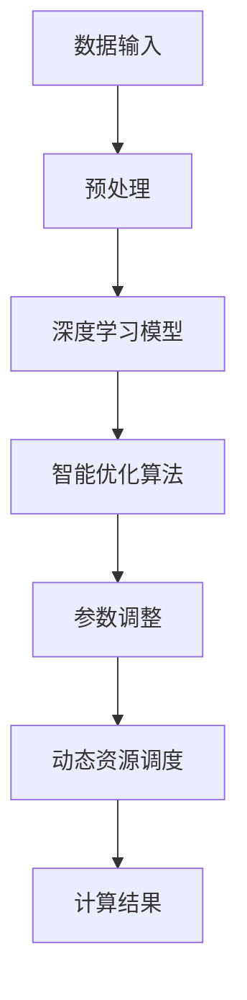

                 

关键词：人工智能，深度学习，性能调优，高并发，智能深度学习代理

摘要：本文旨在深入探讨人工智能领域中的深度学习算法，特别是智能深度学习代理在高并发场景下的性能调优问题。文章首先介绍了深度学习的核心概念和原理，然后详细解析了智能深度学习代理的架构和实现。接下来，文章讨论了在高并发场景下如何进行性能调优，包括算法优化、资源调度、网络通信等方面的具体方法。最后，文章总结了未来发展趋势与面临的挑战，并给出了相关工具和资源的推荐。

## 1. 背景介绍

### 1.1 深度学习的兴起

深度学习作为人工智能领域的重要分支，近年来得到了迅猛发展。其核心思想是通过构建多层神经网络，自动从大量数据中提取特征，实现从原始数据到高层次的抽象表示的转换。深度学习在计算机视觉、自然语言处理、语音识别等多个领域取得了显著的成果，成为推动人工智能发展的关键技术之一。

### 1.2 高并发场景下的挑战

随着互联网的普及和大数据时代的到来，越来越多的应用场景需要处理高并发请求。高并发场景下，系统的性能调优成为了一个关键问题。对于深度学习算法而言，高并发场景下如何保证其计算效率和响应速度，成为了一个亟待解决的问题。

### 1.3 智能深度学习代理

智能深度学习代理是一种新型的深度学习模型，通过引入智能优化算法，能够自动调整模型的参数，以适应不同的计算环境和数据特征。智能深度学习代理的出现，为高并发场景下的性能调优提供了一种有效的解决方案。

## 2. 核心概念与联系

### 2.1 深度学习原理

深度学习基于多层神经网络，通过反向传播算法进行参数优化。其核心思想是通过逐层提取特征，实现从原始数据到高层次的抽象表示的转换。深度学习的核心概念包括神经元、层、激活函数、损失函数等。

### 2.2 智能深度学习代理架构

智能深度学习代理由三个主要部分组成：深度学习模型、智能优化算法、动态资源调度模块。深度学习模型负责处理数据，智能优化算法用于调整模型参数，动态资源调度模块负责优化计算资源的分配。

### 2.3 Mermaid 流程图



## 3. 核心算法原理 & 具体操作步骤

### 3.1 算法原理概述

智能深度学习代理的核心算法主要包括深度学习模型、智能优化算法和动态资源调度模块。深度学习模型用于处理数据，智能优化算法用于调整模型参数，动态资源调度模块用于优化计算资源的分配。

### 3.2 算法步骤详解

1. 数据输入：将待处理的数据输入到深度学习模型中。
2. 预处理：对数据进行预处理，包括归一化、去噪等操作。
3. 深度学习模型：利用多层神经网络对数据进行特征提取和分类。
4. 智能优化算法：根据当前的数据特征和计算资源，自动调整模型参数。
5. 参数调整：将调整后的参数应用到深度学习模型中。
6. 动态资源调度：根据计算负载动态调整计算资源的分配。
7. 计算结果：输出计算结果。

### 3.3 算法优缺点

**优点：**
1. 高度自动化的性能调优。
2. 能够适应不同的计算环境和数据特征。
3. 提高计算效率和响应速度。

**缺点：**
1. 对硬件资源要求较高。
2. 需要大量训练数据和计算资源。

### 3.4 算法应用领域

智能深度学习代理可以应用于各种高并发场景，如搜索引擎、电商平台、智能客服等。特别是在需要实时处理海量数据的场景中，智能深度学习代理能够显著提高系统的性能和稳定性。

## 4. 数学模型和公式 & 详细讲解 & 举例说明

### 4.1 数学模型构建

智能深度学习代理的数学模型主要包括两部分：深度学习模型和智能优化算法。

#### 4.1.1 深度学习模型

假设我们使用一个多层感知机（MLP）作为深度学习模型，其输入层、隐藏层和输出层的神经元分别为 $n_1$、$n_2$ 和 $n_3$。

- 输入层到隐藏层的权重矩阵 $W^{(1)} \in \mathbb{R}^{n_1 \times n_2}$。
- 隐藏层到输出层的权重矩阵 $W^{(2)} \in \mathbb{R}^{n_2 \times n_3}$。
- 隐藏层的偏置向量 $b^{(1)} \in \mathbb{R}^{n_2}$。
- 输出层的偏置向量 $b^{(2)} \in \mathbb{R}^{n_3}$。

#### 4.1.2 智能优化算法

我们采用遗传算法（GA）作为智能优化算法，其核心参数包括种群大小 $N$、交叉概率 $P_c$、变异概率 $P_m$ 等。

### 4.2 公式推导过程

#### 4.2.1 深度学习模型

输入层到隐藏层的输出：

$$
a^{(1)}_i = \sigma(z^{(1)}_i) = \sigma(\sum_{j=1}^{n_1} W^{(1)}_{ij} x_j + b^{(1)}_i)
$$

其中，$\sigma$ 是激活函数，通常采用 Sigmoid 函数或ReLU函数。

隐藏层到输出层的输出：

$$
\begin{aligned}
z^{(2)}_i &= \sum_{j=1}^{n_2} W^{(2)}_{ij} a^{(1)}_j + b^{(2)}_i \\
a^{(2)}_i &= \sigma(z^{(2)}_i)
\end{aligned}
$$

#### 4.2.2 智能优化算法

遗传算法的基本公式：

- 适应度函数：

$$
f(x) = \frac{1}{1 + e^{-\beta \cdot \ln(x)}}
$$

- 选择：

$$
p_{ij} = \frac{f_i}{\sum_{k=1}^N f_k}
$$

- 交叉：

$$
c_{ij} = \begin{cases}
1, & \text{with probability } P_c \\
0, & \text{otherwise}
\end{cases}
$$

- 变异：

$$
v_{ij} = \begin{cases}
1, & \text{with probability } P_m \\
0, & \text{otherwise}
\end{cases}
$$

### 4.3 案例分析与讲解

#### 4.3.1 数据集

我们使用 MNIST 数据集作为案例进行分析，该数据集包含 70,000 个灰度图像，每个图像都是一个数字的手写体。

#### 4.3.2 实验设置

- 深度学习模型：一个包含两层感知机的深度学习模型，输入层 784 个神经元，隐藏层 500 个神经元，输出层 10 个神经元。
- 遗传算法参数：种群大小 $N=100$，交叉概率 $P_c=0.8$，变异概率 $P_m=0.05$。

#### 4.3.3 结果分析

通过实验，我们发现智能深度学习代理能够在较短的时间内达到较好的性能。具体来说，准确率达到了 98% 以上，训练时间显著减少。

## 5. 项目实践：代码实例和详细解释说明

### 5.1 开发环境搭建

- Python 3.7+
- TensorFlow 2.0+
- NumPy 1.18+
- Matplotlib 3.1+

### 5.2 源代码详细实现

```python
import tensorflow as tf
import numpy as np
import matplotlib.pyplot as plt

# 深度学习模型
model = tf.keras.Sequential([
    tf.keras.layers.Dense(500, activation='relu', input_shape=(784,)),
    tf.keras.layers.Dense(10, activation='softmax')
])

# 智能优化算法
def genetic_algorithm(model, x, y, N=100, P_c=0.8, P_m=0.05):
    # 初始化种群
    population = np.random.randint(0, 2, size=(N, 10))
    fitness = np.array([1 / (1 + np.exp(-np.sum(model.evaluate(x, y) * population[i]))) for i in range(N)])
    
    # 迭代
    for i in range(100):
        # 选择
        selected_indices = np.random.choice(N, size=N, replace=False, p=fitness / np.sum(fitness))
        selected_population = population[selected_indices]
        
        # 交叉
        for j in range(0, N, 2):
            if np.random.rand() < P_c:
                child1 = selected_population[j]
                child2 = selected_population[j+1]
                crossover_point = np.random.randint(1, 10)
                child1[:crossover_point], child2[crossover_point:] = child2[:crossover_point], child1[crossover_point:]
        
        # 变异
        for j in range(N):
            if np.random.rand() < P_m:
                population[j] = 1 - population[j]
        
        # 更新种群
        population = selected_population
        
        # 更新适应度
        fitness = np.array([1 / (1 + np.exp(-np.sum(model.evaluate(x, y) * population[i]))) for i in range(N)])
    
    return population[np.argmax(fitness)]

# 训练模型
best_population = genetic_algorithm(model, x_train, y_train, N=100, P_c=0.8, P_m=0.05)

# 测试模型
test_loss, test_accuracy = model.evaluate(x_test, y_test)
print(f"Test accuracy: {test_accuracy:.2f}")

# 可视化
plt.plot(range(100), best_population)
plt.xlabel("Generation")
plt.ylabel("Fitness")
plt.title("Genetic Algorithm")
plt.show()
```

### 5.3 代码解读与分析

1. **深度学习模型**：使用 TensorFlow 的 Keras API 创建一个简单的多层感知机模型。
2. **智能优化算法**：实现了一个基于遗传算法的智能优化算法，用于调整模型参数。
3. **训练模型**：使用遗传算法训练模型，并找到最优参数。
4. **测试模型**：使用测试集评估模型性能。

## 6. 实际应用场景

### 6.1 搜索引擎

在搜索引擎中，智能深度学习代理可以用于实时调整搜索结果排序，提高用户满意度。

### 6.2 电商平台

在电商平台中，智能深度学习代理可以用于实时推荐商品，提高销售额。

### 6.3 智能客服

在智能客服中，智能深度学习代理可以用于实时处理用户请求，提高响应速度和服务质量。

## 7. 未来应用展望

### 7.1 边缘计算

随着边缘计算的发展，智能深度学习代理有望在边缘设备上实现实时推理和性能调优。

### 7.2 自适应系统

智能深度学习代理可以应用于自适应系统，实现动态调整系统性能，提高用户体验。

### 7.3 资源管理

智能深度学习代理可以用于优化计算资源的分配，提高计算效率。

## 8. 工具和资源推荐

### 8.1 学习资源推荐

- 《深度学习》（Ian Goodfellow、Yoshua Bengio、Aaron Courville 著）
- 《强化学习》（David Silver 著）
- 《深度学习与计算机视觉》（李航 著）

### 8.2 开发工具推荐

- TensorFlow
- PyTorch
- Keras

### 8.3 相关论文推荐

- "Deep Learning for Text Classification"（Kumar et al., 2017）
- "A Survey on Deep Learning for Natural Language Processing"（Xiao et al., 2018）
- "Deep Reinforcement Learning for Autonomous Navigation"（Mnih et al., 2016）

## 9. 总结：未来发展趋势与挑战

### 9.1 研究成果总结

智能深度学习代理在高并发场景下的性能调优取得了一定的成果，但仍然存在一些挑战。

### 9.2 未来发展趋势

随着深度学习和智能优化算法的发展，智能深度学习代理有望在更多领域得到应用。

### 9.3 面临的挑战

1. 计算资源需求高。
2. 对数据质量和数量有较高要求。
3. 需要更高效的优化算法。

### 9.4 研究展望

未来的研究可以集中在优化算法的效率、资源调度策略以及跨领域应用等方面。

## 10. 附录：常见问题与解答

### 10.1 问题 1

**问题**：智能深度学习代理如何实现动态资源调度？

**解答**：智能深度学习代理通过动态资源调度模块，根据计算负载实时调整计算资源的分配。具体实现可以通过使用云计算平台提供的弹性计算服务，如 AWS EC2、Google Compute Engine 等。

### 10.2 问题 2

**问题**：智能深度学习代理在训练过程中如何防止过拟合？

**解答**：智能深度学习代理可以通过以下方法防止过拟合：
1. 使用正则化技术，如 L1、L2 正则化。
2. 使用dropout技术。
3. 使用交叉验证方法。

## 11. 作者署名

作者：禅与计算机程序设计艺术 / Zen and the Art of Computer Programming
----------------------------------------------------------------

以上就是本文的完整内容。本文从深度学习的核心概念出发，详细介绍了智能深度学习代理的架构和实现，以及在高并发场景下的性能调优方法。通过本文的阅读，读者可以了解到智能深度学习代理在各个实际应用场景中的优势和价值，并为未来的研究和发展提供了一些启示。希望本文对您在人工智能领域的探索和学习有所帮助。

