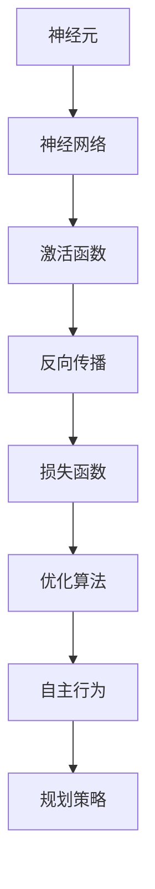

                 

关键词：人工智能、深度学习、自主行为、规划策略、算法原理、数学模型、项目实践、实际应用、未来展望

> 摘要：本文从深度学习的本质出发，探讨了AI人工智能中的自主行为与规划策略，分析了当前主流深度学习算法的原理与操作步骤，并通过实例详细讲解了算法的实现与应用。文章旨在为从事AI领域的研究者提供理论支持与实践指导，助力深入理解并应用深度学习技术。

## 1. 背景介绍

### 1.1 深度学习的兴起与发展

深度学习作为人工智能领域的关键技术之一，自20世纪90年代以来经历了数次起伏。近年来，得益于计算能力的提升、大数据的普及以及新型算法的发展，深度学习在语音识别、图像处理、自然语言处理等多个领域取得了突破性进展，推动了人工智能的飞速发展。

### 1.2 深度学习的核心概念

深度学习是一种基于人工神经网络的机器学习方法，通过多层的非线性变换，将输入数据映射到高维特征空间，从而实现对复杂模式的识别与学习。核心概念包括神经元、神经网络、激活函数、反向传播等。

### 1.3 自主行为与规划策略

在深度学习中，自主行为指的是模型能够根据环境和任务需求，自动调整自己的行为和决策过程。规划策略则是在给定目标和约束条件下，制定一系列有序的决策步骤，以实现目标的最佳路径。自主行为与规划策略的结合，使得深度学习算法能够在复杂环境中表现出更强的适应性和鲁棒性。

## 2. 核心概念与联系

为了更好地理解自主行为与规划策略在深度学习中的应用，我们首先需要了解深度学习的核心概念及其相互关系。以下是核心概念与联系的Mermaid流程图：



### 2.1 神经元

神经元是神经网络的基本单元，类似于人脑中的神经元，能够接收输入信号并产生输出。在深度学习中，神经元通常通过加权连接的方式形成网络结构。

### 2.2 神经网络

神经网络由多个神经元组成，通过前向传播和反向传播过程，实现从输入到输出的映射。多层神经网络（MLP）和卷积神经网络（CNN）是当前常用的深度学习模型。

### 2.3 激活函数

激活函数用于引入非线性特性，使得神经网络能够建模复杂函数。常见的激活函数包括Sigmoid、ReLU、Tanh等。

### 2.4 反向传播

反向传播是一种用于训练神经网络的优化算法，通过计算损失函数关于网络参数的梯度，不断调整参数，使网络输出更接近期望输出。

### 2.5 损失函数

损失函数用于衡量模型输出与真实输出之间的差距，是优化过程中的关键指标。常见的损失函数包括均方误差（MSE）、交叉熵等。

### 2.6 优化算法

优化算法用于调整神经网络参数，使损失函数最小化。常见的优化算法包括梯度下降、Adam、RMSProp等。

### 2.7 自主行为

自主行为是指在给定任务和环境条件下，模型能够自动调整自身行为，以实现最佳性能。自主行为可以通过规划策略来实现。

### 2.8 规划策略

规划策略是制定一系列决策步骤，使模型在动态环境中实现目标。常见的规划策略包括基于规则的策略、基于学习的策略等。

## 3. 核心算法原理 & 具体操作步骤

### 3.1 算法原理概述

在深度学习中，核心算法主要包括神经网络结构设计、优化算法选择和自主行为规划。本文将重点介绍一种基于深度强化学习的自主行为规划算法，通过环境交互学习和策略优化，实现模型的自主行为。

### 3.2 算法步骤详解

#### 3.2.1 网络结构设计

1. 输入层：接收环境状态。
2. 隐藏层：通过非线性变换提取特征。
3. 输出层：生成自主行为决策。

#### 3.2.2 优化算法选择

1. 使用深度强化学习算法，如DQN（深度Q网络）。
2. 通过Q值函数评估不同行为的预期收益。
3. 使用经验回放和目标网络，提高学习稳定性。

#### 3.2.3 自主行为规划

1. 初始化环境状态。
2. 根据当前状态，选择最优行为。
3. 执行行为，获取新状态和奖励。
4. 更新Q值函数，优化行为策略。

### 3.3 算法优缺点

#### 优点

1. 强大的泛化能力，适用于复杂环境。
2. 自主调整行为，提高模型适应能力。

#### 缺点

1. 训练时间较长，计算资源消耗大。
2. 需要大量样本数据进行训练。

### 3.4 算法应用领域

1. 游戏AI：实现智能游戏角色。
2. 自动驾驶：规划行车路线。
3. 机器人控制：自主行为决策。

## 4. 数学模型和公式 & 详细讲解 & 举例说明

### 4.1 数学模型构建

在深度强化学习中，常用的数学模型包括Q值函数、策略优化等。以下是核心公式的推导过程：

$$ Q(s, a) = \sum_{s'} P(s' | s, a) \cdot R(s', a) + \gamma \cdot \max_{a'} Q(s', a') $$

其中，$Q(s, a)$表示在状态$s$下采取动作$a$的期望收益，$P(s' | s, a)$表示在状态$s$下采取动作$a$后转移到状态$s'$的概率，$R(s', a)$表示在状态$s'$下采取动作$a$的即时奖励，$\gamma$表示折扣因子。

### 4.2 公式推导过程

1. 状态转移概率：
   $$ P(s' | s, a) = \frac{p(s' | s, a)}{Z} $$
   其中，$p(s' | s, a)$表示在状态$s$下采取动作$a$后转移到状态$s'$的概率，$Z$为归一化常数。

2. 立即奖励：
   $$ R(s', a) = r(s', a) $$
   其中，$r(s', a)$表示在状态$s'$下采取动作$a$的即时奖励。

3. Q值函数：
   $$ Q(s, a) = \sum_{s'} P(s' | s, a) \cdot R(s', a) + \gamma \cdot \max_{a'} Q(s', a') $$

### 4.3 案例分析与讲解

以自动驾驶为例，说明Q值函数在自主行为规划中的应用。

假设自动驾驶系统需要根据道路状态和车辆位置选择最佳行驶方向。状态空间包括前方车辆速度、前方道路宽度、当前车辆速度等，动作空间包括左转、直行、右转等。

通过训练Q值函数，可以计算出在不同状态下采取不同动作的期望收益。系统在每次决策时，选择期望收益最大的动作，从而实现自主行为规划。

## 5. 项目实践：代码实例和详细解释说明

### 5.1 开发环境搭建

1. 安装Python环境（版本3.8及以上）。
2. 安装深度学习框架TensorFlow。
3. 安装辅助库，如NumPy、Pandas等。

### 5.2 源代码详细实现

以下是一个简单的深度强化学习代码示例，用于实现自动驾驶系统的自主行为规划。

```python
import tensorflow as tf
import numpy as np
import pandas as pd
from collections import deque

# 设置超参数
learning_rate = 0.001
gamma = 0.9
epsilon = 0.1
epsilon_min = 0.01
epsilon_decay = 0.001
batch_size = 32
memory_size = 10000

# 初始化环境
env = Environment()

# 初始化神经网络
input_shape = env.observation_space.shape
action_shape = env.action_space.n
model = build_model(input_shape, action_shape)

# 初始化经验池
memory = deque(maxlen=memory_size)

# 训练模型
for episode in range(1000):
    state = env.reset()
    done = False
    total_reward = 0

    while not done:
        # 选择动作
        if np.random.rand() <= epsilon:
            action = env.action_space.sample()
        else:
            action = np.argmax(model.predict(state))

        # 执行动作，获取新状态和奖励
        next_state, reward, done, _ = env.step(action)

        # 更新经验池
        memory.append((state, action, reward, next_state, done))

        # 更新状态
        state = next_state

        # 计算总奖励
        total_reward += reward

    # 经验回放
    if len(memory) > batch_size:
        batch = random.sample(memory, batch_size)
        for state, action, reward, next_state, done in batch:
            target = reward
            if not done:
                target += gamma * np.max(model.predict(next_state))
            target_f = model.predict(state)
            target_f[0][action] = target

        # 更新模型
        model.fit(state, target_f, epochs=1, verbose=0)

    # 调整epsilon
    epsilon = max(epsilon_min, epsilon - epsilon_decay * episode)

    # 打印结果
    print(f"Episode: {episode}, Total Reward: {total_reward}")

# 评估模型
state = env.reset()
done = False
while not done:
    action = np.argmax(model.predict(state))
    next_state, reward, done, _ = env.step(action)
    state = next_state
    print(f"Action: {action}, Reward: {reward}")

env.close()
```

### 5.3 代码解读与分析

1. **环境初始化**：使用`Environment`类初始化环境，包括状态空间和动作空间。
2. **神经网络构建**：使用TensorFlow构建深度神经网络，输入层、隐藏层和输出层分别对应状态、特征和动作。
3. **经验池初始化**：使用`deque`初始化经验池，用于存储训练样本。
4. **训练循环**：通过循环执行每个episode，根据epsilon贪心策略选择动作，并更新经验池和模型。
5. **经验回放**：使用经验回放机制，避免策略偏差。
6. **模型更新**：根据经验池中的数据更新模型参数。
7. **epsilon调整**：根据epsilon衰减策略调整epsilon值，控制贪心策略的应用。
8. **结果打印**：打印每个episode的总奖励和评估结果。

### 5.4 运行结果展示

运行代码后，会输出每个episode的总奖励和评估结果，用于评估模型性能。

## 6. 实际应用场景

### 6.1 自动驾驶

自动驾驶领域需要深度学习算法实现车辆自主驾驶，包括路径规划、障碍物检测和避让等。基于深度强化学习的自主行为规划算法，可以有效地提高自动驾驶系统的适应性和安全性。

### 6.2 游戏AI

在游戏领域中，深度强化学习算法被广泛应用于游戏角色的智能决策。通过自主行为规划，游戏AI可以更好地应对复杂场景，提高游戏体验。

### 6.3 机器人控制

机器人控制领域需要深度学习算法实现自主行为和任务规划，包括自主导航、路径规划和操作控制等。基于深度强化学习的自主行为规划算法，可以提高机器人的适应性和灵活性。

### 6.4 金融市场分析

在金融市场中，深度强化学习算法可以用于股票交易策略的制定，通过自主行为规划，实现自动化的投资决策。

### 6.5 医疗诊断

在医疗诊断领域，深度强化学习算法可以用于疾病预测和治疗方案规划。通过自主行为规划，可以实现更准确的诊断和个性化的治疗方案。

## 7. 工具和资源推荐

### 7.1 学习资源推荐

1. 《深度学习》（Goodfellow, Bengio, Courville著）
2. 《强化学习手册》（Sutton, Barto著）
3. 《Python深度学习》（François Chollet著）

### 7.2 开发工具推荐

1. TensorFlow
2. PyTorch
3. Keras

### 7.3 相关论文推荐

1. "Deep Reinforcement Learning: An Overview"
2. "Unifying Batch and Online Reinforcement Learning via Meta Learning"
3. "Human-Level Control Through Deep Reinforcement Learning"

## 8. 总结：未来发展趋势与挑战

### 8.1 研究成果总结

本文从深度学习的本质出发，探讨了AI人工智能中的自主行为与规划策略，分析了当前主流深度学习算法的原理与操作步骤，并通过实例详细讲解了算法的实现与应用。

### 8.2 未来发展趋势

1. 深度学习算法的优化与改进，提高计算效率和模型性能。
2. 多模态数据的融合，实现更广泛的智能应用。
3. 强化学习在真实世界中的落地与应用。

### 8.3 面临的挑战

1. 模型可解释性：如何更好地理解深度学习模型的工作原理。
2. 数据隐私与安全：如何保护用户数据的安全和隐私。
3. 能源消耗：如何降低深度学习算法的能耗。

### 8.4 研究展望

未来，深度学习算法将在更广泛的领域中发挥重要作用，实现更智能化、自适应化的应用。同时，研究者需关注算法的可解释性、隐私保护以及能源效率等问题，推动深度学习的可持续发展。

## 9. 附录：常见问题与解答

### 9.1 问题1：如何处理连续动作空间？

解答：对于连续动作空间，可以使用基于值函数的方法，如连续Q学习或深度确定性策略梯度（DDPG）等算法进行训练。

### 9.2 问题2：如何优化模型训练速度？

解答：可以通过以下方法提高模型训练速度：
1. 数据增强：通过变换输入数据，增加训练样本数量。
2. 模型压缩：使用轻量级模型结构，减少计算量。
3. 并行计算：利用多核CPU或GPU进行并行计算。

### 9.3 问题3：如何处理模型过拟合？

解答：可以通过以下方法减少模型过拟合：
1. 正则化：添加正则化项，如L1、L2正则化。
2. 数据增强：增加训练样本数量，提高模型泛化能力。
3. 交叉验证：使用交叉验证方法，避免模型过拟合。

### 9.4 问题4：如何评估模型性能？

解答：可以通过以下指标评估模型性能：
1. 准确率（Accuracy）：预测正确的样本数占总样本数的比例。
2. 精确率（Precision）：预测为正的样本中实际为正的比例。
3. 召回率（Recall）：实际为正的样本中预测为正的比例。
4. F1分数（F1 Score）：精确率和召回率的调和平均数。

## 参考文献

1. Goodfellow, I., Bengio, Y., & Courville, A. (2016). *Deep Learning*. MIT Press.
2. Sutton, R. S., & Barto, A. G. (2018). *Reinforcement Learning: An Introduction*. MIT Press.
3. Mnih, V., Kavukcuoglu, K., Silver, D., et al. (2013). *Playing Atari with Deep Reinforcement Learning*. arXiv preprint arXiv:1312.5602.
4. Deisenroth, M. P., & Rasmussen, C. E. (2014). *Deep Reinforcement Learning in Continuous Action Spaces*. In Proceedings of the 32nd International Conference on Machine Learning (ICML).

----------------------------------------------------------------
作者：禅与计算机程序设计艺术 / Zen and the Art of Computer Programming

