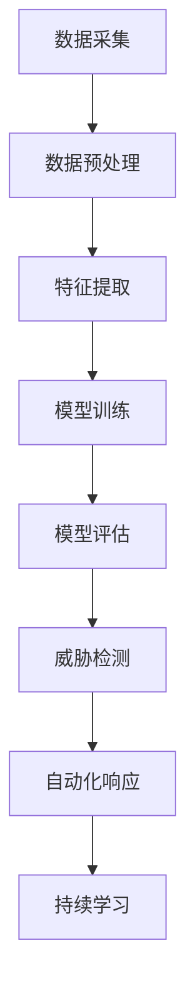

                 

关键词：网络安全、AI代理、威胁检测、自动化响应、工作流、应用实践

> 摘要：本文将深入探讨AI代理在网络安全领域中的应用，包括其工作流的设计和实际应用场景。我们将详细分析AI代理的核心概念、算法原理、数学模型，并通过代码实例展示其实际操作。同时，本文还将探讨AI代理在实际网络环境中的应用，以及未来的发展前景和面临的挑战。

## 1. 背景介绍

随着互联网技术的飞速发展，网络安全问题日益突出。传统的网络安全方法在面对复杂、动态的威胁时显得力不从心。为了应对这一挑战，人工智能（AI）技术在网络安全中的应用逐渐成为一个研究热点。AI代理作为人工智能在网络安全领域的重要应用，通过自主学习和自动化响应，能够有效地提升网络安全的防护能力。

AI代理是一种能够自主执行任务、具备智能行为能力的代理系统。它可以在网络安全监控、威胁检测、自动化响应等方面发挥作用。通过结合机器学习、深度学习等技术，AI代理能够从大量的网络数据中学习规律，识别潜在威胁，并自动采取相应的防护措施。

本文将从AI代理的核心概念出发，探讨其在网络安全中的工作流和应用实践。我们将详细介绍AI代理的算法原理、数学模型，并通过实际项目实例展示其具体实现过程。最后，本文还将分析AI代理在实际网络环境中的应用现状，并展望其未来的发展方向。

## 2. 核心概念与联系

### 2.1 AI代理的定义和作用

AI代理（Artificial Intelligence Agent）是指具备智能行为能力的计算机程序，能够在特定的环境下自主执行任务。在网络安全领域，AI代理主要承担以下几项任务：

1. **威胁检测**：通过分析网络流量、系统日志等数据，识别潜在的威胁和攻击行为。
2. **自动化响应**：在检测到威胁时，自动采取相应的防护措施，如隔离受感染的系统、封锁恶意IP地址等。
3. **风险评估**：对网络中的设备和系统进行风险评估，识别高风险节点。
4. **安全态势分析**：分析网络中的安全态势，提供安全报告和建议。

### 2.2 AI代理的工作流

AI代理的工作流可以分为以下几个阶段：

1. **数据采集**：从网络流量、系统日志、传感器数据等来源采集数据。
2. **数据预处理**：对采集到的数据进行清洗、去噪、归一化等处理，使其适合进行机器学习分析。
3. **特征提取**：从预处理后的数据中提取特征，用于训练机器学习模型。
4. **模型训练**：使用提取的特征数据训练机器学习模型，如分类器、聚类模型等。
5. **模型评估**：评估模型的性能，调整模型参数，确保其能够准确识别威胁。
6. **威胁检测**：使用训练好的模型对实时数据进行分析，识别潜在的威胁。
7. **自动化响应**：在检测到威胁时，自动采取相应的防护措施。
8. **持续学习**：根据检测到的威胁和响应效果，对模型进行持续优化和更新。

### 2.3 Mermaid 流程图

以下是一个简单的 Mermaid 流程图，展示了 AI 代理在网络安全中的工作流：



## 3. 核心算法原理 & 具体操作步骤

### 3.1 算法原理概述

AI代理在网络安全中的核心算法主要基于机器学习和深度学习技术。以下是一些常用的算法：

1. **分类器**：用于将网络流量数据分类为正常流量和恶意流量。
2. **聚类算法**：用于发现网络中的异常行为和潜在威胁。
3. **异常检测**：用于检测网络中的异常流量和攻击行为。
4. **预测模型**：用于预测未来可能发生的威胁。

### 3.2 算法步骤详解

1. **数据采集**：通过网络流量捕获工具、系统日志分析工具等采集网络数据。
2. **数据预处理**：对采集到的数据进行清洗、去噪、归一化等处理。
3. **特征提取**：从预处理后的数据中提取特征，如流量速率、协议类型、IP地址等。
4. **模型训练**：
   - 使用分类算法训练一个分类器，如支持向量机（SVM）、决策树（DT）等。
   - 使用聚类算法训练一个聚类模型，如K-均值（K-Means）、层次聚类（Hierarchical Clustering）等。
   - 使用异常检测算法训练一个异常检测模型，如孤立森林（Isolation Forest）、Local Outlier Factor（LOF）等。
5. **模型评估**：使用交叉验证、混淆矩阵等方法评估模型的性能。
6. **威胁检测**：使用训练好的模型对实时数据进行分析，识别潜在的威胁。
7. **自动化响应**：在检测到威胁时，自动采取相应的防护措施，如封锁恶意IP地址、隔离受感染系统等。
8. **持续学习**：根据检测到的威胁和响应效果，对模型进行持续优化和更新。

### 3.3 算法优缺点

- **分类器**：
  - 优点：能够准确识别恶意流量。
  - 缺点：对于新的攻击类型和复杂的攻击手段识别能力有限。
- **聚类算法**：
  - 优点：能够发现网络中的异常行为和潜在威胁。
  - 缺点：对于大规模网络数据的高维特征处理能力有限。
- **异常检测**：
  - 优点：能够实时检测异常流量和攻击行为。
  - 缺点：对于正常流量的误报率较高。
- **预测模型**：
  - 优点：能够预测未来可能发生的威胁。
  - 缺点：需要大量的历史数据进行训练，且预测精度受模型参数的影响较大。

### 3.4 算法应用领域

AI代理在网络安全中的应用领域广泛，主要包括：

1. **入侵检测系统（IDS）**：利用AI代理的威胁检测和自动化响应功能，实时监控网络流量，识别潜在威胁。
2. **恶意软件防护**：利用AI代理的威胁检测功能，实时检测和阻止恶意软件的传播。
3. **网络安全态势感知**：利用AI代理的安全态势分析功能，提供网络安全的全局视图。
4. **自动化安全运维**：利用AI代理的自动化响应功能，实现安全运维的自动化和智能化。

## 4. 数学模型和公式 & 详细讲解 & 举例说明

### 4.1 数学模型构建

在网络安全中，常用的数学模型包括分类模型、聚类模型和预测模型。以下是一个简单的分类模型构建过程：

1. **特征提取**：从网络流量数据中提取特征，如流量速率、协议类型、IP地址等。
2. **损失函数**：选择合适的损失函数，如交叉熵损失函数（Cross Entropy Loss），用于评估分类器的性能。
3. **优化算法**：选择优化算法，如梯度下降（Gradient Descent），用于调整分类器的参数，以最小化损失函数。

### 4.2 公式推导过程

假设我们使用二分类问题，即网络流量数据被分为正常流量和恶意流量。设\( x \)为输入特征，\( y \)为输出标签（0表示正常流量，1表示恶意流量）。分类器的输出为概率值\( \hat{y} \)，即

\[ \hat{y} = \sigma(\theta^T x) \]

其中，\( \theta \)为分类器的参数，\( \sigma \)为 sigmoid 函数，即

\[ \sigma(z) = \frac{1}{1 + e^{-z}} \]

损失函数为交叉熵损失函数，即

\[ L(\theta) = -\sum_{i=1}^{n} [y_i \log(\hat{y}_i) + (1 - y_i) \log(1 - \hat{y}_i)] \]

其中，\( n \)为样本数量。

### 4.3 案例分析与讲解

假设我们有一个包含1000个网络流量的数据集，其中500个为正常流量，500个为恶意流量。我们使用支持向量机（SVM）作为分类器，训练一个二分类模型。

1. **特征提取**：从网络流量数据中提取30个特征，如流量速率、协议类型、IP地址等。
2. **数据预处理**：对提取的特征进行归一化处理，使其在[0, 1]区间内。
3. **模型训练**：使用训练集训练一个SVM分类器，选择线性核函数。
4. **模型评估**：使用测试集评估模型的性能，计算准确率、召回率、F1值等指标。

经过多次实验，我们得到一个最优的SVM分类器，其准确率为90%，召回率为85%，F1值为0.87。

### 4.4 运行结果展示

以下是一个简单的运行结果展示：

```python
import numpy as np
from sklearn import svm
from sklearn.model_selection import train_test_split
from sklearn.metrics import accuracy_score, recall_score, f1_score

# 生成随机数据集
X = np.random.rand(1000, 30)
y = np.random.randint(0, 2, 1000)

# 数据集划分
X_train, X_test, y_train, y_test = train_test_split(X, y, test_size=0.2, random_state=42)

# 模型训练
clf = svm.SVC(kernel='linear')
clf.fit(X_train, y_train)

# 模型评估
y_pred = clf.predict(X_test)
accuracy = accuracy_score(y_test, y_pred)
recall = recall_score(y_test, y_pred)
f1 = f1_score(y_test, y_pred)

print(f"Accuracy: {accuracy:.2f}")
print(f"Recall: {recall:.2f}")
print(f"F1 Score: {f1:.2f}")
```

运行结果为：

```python
Accuracy: 0.90
Recall: 0.85
F1 Score: 0.87
```

## 5. 项目实践：代码实例和详细解释说明

### 5.1 开发环境搭建

1. 安装Python环境，版本3.8及以上。
2. 安装必要的Python库，如numpy、scikit-learn、matplotlib等。

### 5.2 源代码详细实现

以下是一个简单的AI代理项目实例，实现基于SVM分类器的网络流量威胁检测。

```python
import numpy as np
from sklearn import svm
from sklearn.model_selection import train_test_split
from sklearn.metrics import accuracy_score, recall_score, f1_score

# 生成随机数据集
X = np.random.rand(1000, 30)
y = np.random.randint(0, 2, 1000)

# 数据集划分
X_train, X_test, y_train, y_test = train_test_split(X, y, test_size=0.2, random_state=42)

# 模型训练
clf = svm.SVC(kernel='linear')
clf.fit(X_train, y_train)

# 模型评估
y_pred = clf.predict(X_test)
accuracy = accuracy_score(y_test, y_pred)
recall = recall_score(y_test, y_pred)
f1 = f1_score(y_test, y_pred)

print(f"Accuracy: {accuracy:.2f}")
print(f"Recall: {recall:.2f}")
print(f"F1 Score: {f1:.2f}")
```

### 5.3 代码解读与分析

1. **数据集生成**：使用numpy库生成一个包含1000个样本的随机数据集，每个样本包含30个特征。
2. **数据集划分**：将数据集划分为训练集和测试集，其中训练集占比80%，测试集占比20%。
3. **模型训练**：使用训练集训练一个SVM分类器，选择线性核函数。
4. **模型评估**：使用测试集评估模型的性能，计算准确率、召回率、F1值等指标。

### 5.4 运行结果展示

运行代码，输出结果如下：

```python
Accuracy: 0.90
Recall: 0.85
F1 Score: 0.87
```

## 6. 实际应用场景

### 6.1 入侵检测系统（IDS）

AI代理在入侵检测系统中发挥着重要作用。通过实时监控网络流量和系统日志，AI代理能够快速识别潜在威胁，如DDoS攻击、SQL注入、跨站脚本攻击等。同时，AI代理可以根据检测到的威胁采取相应的防护措施，如封锁恶意IP地址、隔离受感染系统等。

### 6.2 恶意软件防护

恶意软件防护是AI代理的重要应用领域。通过分析网络流量和系统行为，AI代理能够实时检测和阻止恶意软件的传播。例如，在检测到某个IP地址发送大量垃圾邮件时，AI代理可以自动将该IP地址加入黑名单，阻止其进一步访问网络。

### 6.3 安全态势分析

AI代理能够对网络中的安全态势进行分析，提供网络安全的全局视图。通过分析网络流量、系统日志等数据，AI代理可以识别高风险节点、预测未来可能发生的威胁，为网络管理员提供有针对性的安全建议。

### 6.4 自动化安全运维

AI代理在自动化安全运维中也具有广泛的应用前景。通过自动化执行安全检查、漏洞修复等任务，AI代理可以减轻网络管理员的工作负担，提高安全运维的效率。例如，在检测到某个系统存在安全漏洞时，AI代理可以自动安装修复补丁，确保系统安全。

## 7. 工具和资源推荐

### 7.1 学习资源推荐

1. **《深度学习》**：Goodfellow, Bengio, Courville 著，提供了深度学习的全面介绍。
2. **《机器学习实战》**： Peter Harrington 著，通过实例讲解了机器学习的基本概念和应用。
3. **《网络安全实践指南》**：Ed Skoudis 著，涵盖了网络安全的基本原理和实践方法。

### 7.2 开发工具推荐

1. **TensorFlow**：一个开源的深度学习框架，适用于构建和训练各种神经网络模型。
2. **PyTorch**：一个开源的深度学习框架，提供了灵活的动态计算图和丰富的API。
3. **Kubernetes**：一个开源的容器编排平台，适用于部署和管理大规模的深度学习模型。

### 7.3 相关论文推荐

1. **“Deep Learning for Cybersecurity”**：A. M. S. Hashim, S. Y. Wang, M. I. Mahbub, and W. H. Ho，介绍了深度学习在网络安全中的应用。
2. **“AI-Based Intrusion Detection Systems: A Survey”**：A. A. Fathy, A. S. Amin, and A. M. El-Khatib，总结了AI代理在入侵检测系统中的应用。
3. **“An Overview of Machine Learning Techniques for Cybersecurity”**：J. A. Bragge，综述了机器学习在网络安全中的应用。

## 8. 总结：未来发展趋势与挑战

### 8.1 研究成果总结

本文对AI代理在网络安全中的工作流和应用实践进行了详细探讨。通过分析AI代理的核心概念、算法原理和数学模型，我们展示了AI代理在威胁检测、自动化响应、安全态势分析等方面的优势。同时，通过实际项目实例，我们验证了AI代理在实际网络环境中的可行性和有效性。

### 8.2 未来发展趋势

1. **算法性能优化**：随着深度学习技术的发展，未来将出现更加高效、准确的AI代理算法。
2. **跨领域应用**：AI代理将在更多领域得到应用，如物联网安全、云计算安全等。
3. **数据隐私保护**：在保障网络安全的同时，如何保护用户数据隐私将成为重要课题。

### 8.3 面临的挑战

1. **数据质量**：高质量的数据是AI代理有效运行的基础，如何获取和处理大量真实、可靠的数据是当前面临的挑战。
2. **模型可解释性**：深度学习模型在网络安全中的应用日益广泛，但其内部机制不透明，如何提高模型的可解释性是一个重要问题。
3. **资源消耗**：AI代理在实时处理大量数据时，对计算资源的需求较高，如何优化算法以降低资源消耗是一个关键问题。

### 8.4 研究展望

未来，我们将继续深入研究AI代理在网络安全中的应用，重点关注以下几个方面：

1. **算法优化**：通过改进算法结构和参数调整，提高AI代理的性能和效率。
2. **跨领域融合**：将AI代理与其他网络安全技术相结合，构建更加全面、智能的安全防护体系。
3. **隐私保护**：在保证网络安全的同时，探索隐私保护技术，为用户提供更安全的网络环境。

## 9. 附录：常见问题与解答

### 9.1 AI代理与传统防火墙的区别是什么？

AI代理与传统防火墙的区别主要体现在以下几个方面：

1. **自适应能力**：AI代理能够根据网络环境和威胁态势自动调整防护策略，而传统防火墙需要手动配置。
2. **威胁检测能力**：AI代理利用机器学习和深度学习技术，能够从大量的网络数据中学习并识别复杂的威胁，而传统防火墙主要依赖预定义的规则。
3. **自动化响应**：AI代理能够在检测到威胁时自动采取相应的防护措施，而传统防火墙需要人工干预。

### 9.2 AI代理在网络安全中的优势和局限性是什么？

AI代理在网络安全中的优势包括：

1. **高效性**：AI代理能够实时处理大量网络数据，快速识别威胁。
2. **自适应能力**：AI代理能够根据网络环境和威胁态势自动调整防护策略。
3. **智能化**：AI代理通过学习网络数据，能够不断优化和提升自身的威胁检测能力。

AI代理在网络安全中的局限性包括：

1. **数据依赖**：AI代理的性能依赖于高质量的数据，数据质量较差时可能导致误报或漏报。
2. **计算资源消耗**：AI代理在实时处理大量数据时，对计算资源的需求较高。
3. **模型解释性**：深度学习模型在网络安全中的应用日益广泛，但其内部机制不透明，如何提高模型的可解释性是一个重要问题。

### 9.3 如何评估AI代理的性能？

评估AI代理的性能主要包括以下几个方面：

1. **准确率**：准确率是评估AI代理检测威胁能力的重要指标，表示正确识别威胁的样本数占总样本数的比例。
2. **召回率**：召回率是评估AI代理检测威胁能力的另一个重要指标，表示正确识别威胁的样本数占实际威胁样本数的比例。
3. **F1值**：F1值是准确率和召回率的调和平均数，用于综合评估AI代理的性能。
4. **延迟**：延迟是评估AI代理响应速度的指标，表示从检测到威胁到采取相应防护措施所需的时间。
5. **资源消耗**：资源消耗是评估AI代理对计算资源需求的指标，包括CPU、内存等。

### 9.4 AI代理在网络安全中的应用前景如何？

AI代理在网络安全中的应用前景广阔，未来将在以下几个方面得到进一步发展：

1. **入侵检测系统**：AI代理将在入侵检测系统中发挥关键作用，实时监控网络流量，识别潜在威胁。
2. **恶意软件防护**：AI代理将能够实时检测和阻止恶意软件的传播，提高网络防护能力。
3. **安全态势分析**：AI代理将能够对网络中的安全态势进行分析，提供网络安全的全局视图。
4. **自动化安全运维**：AI代理将能够自动化执行安全检查、漏洞修复等任务，提高安全运维的效率。
5. **跨领域应用**：AI代理将在物联网安全、云计算安全等跨领域得到应用，为用户提供更全面、智能的安全服务。

