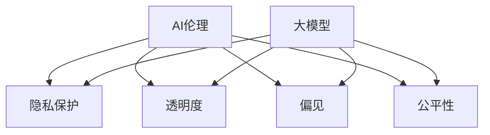
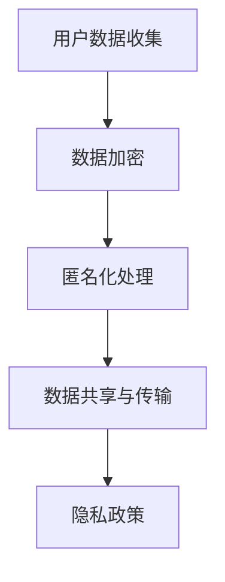
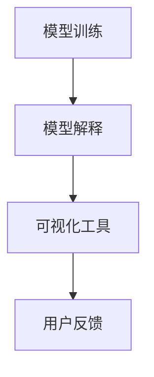
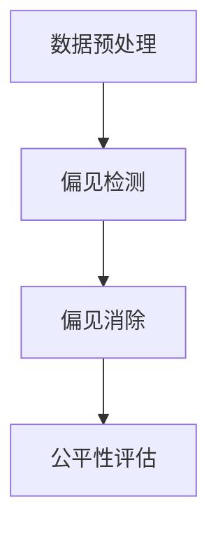
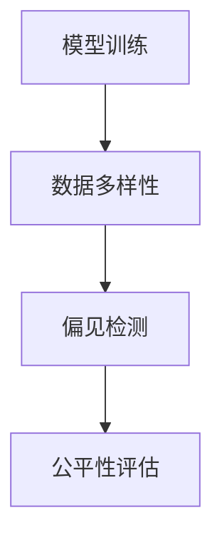

                 

关键词：AI伦理、安全性、大模型、新兴市场、算法、应用场景、未来展望

> 摘要：本文探讨了人工智能（AI）伦理与安全性在大模型应用中的重要性，特别是在新兴市场的背景下。文章首先介绍了AI伦理的基本概念，然后详细讨论了大模型的应用及其面临的伦理和安全挑战。通过实际案例分析和未来展望，本文旨在为读者提供一个全面的理解和洞察，以推动AI伦理与安全性的持续发展。

## 1. 背景介绍

人工智能（AI）作为现代科技的核心驱动力，已经广泛应用于各个领域，从医疗、金融到教育、制造等。随着技术的不断进步，特别是深度学习等大模型的广泛应用，AI的应用范围和影响力不断扩大。然而，AI的发展也带来了一系列伦理和安全挑战，尤其是在新兴市场，这些挑战更为显著。

新兴市场通常指那些经济快速发展、信息技术普及较快的国家和地区。这些市场对于AI技术的需求巨大，但也面临着资源匮乏、技术基础薄弱等问题。因此，AI伦理与安全性在这些地区尤为重要。本文旨在探讨AI伦理与安全性在大模型应用中的重要性，分析其面临的挑战，并提出相应的解决方案。

### 1.1 AI伦理的基本概念

AI伦理涉及道德、法律、社会和技术等多个层面。它关注的是AI系统设计、开发和使用过程中的道德问题，包括隐私保护、透明度、偏见、公平性等。以下是几个关键的AI伦理概念：

- **隐私保护**：AI系统常常处理大量个人数据，如何保护用户隐私成为一个重要的伦理问题。
- **透明度**：AI系统应具备可解释性，使人们能够理解其决策过程。
- **偏见**：AI系统应避免基于种族、性别、年龄等偏见进行决策，确保公平性。
- **可控性**：AI系统应具备可控性，以防止意外行为或被恶意利用。

### 1.2 大模型的定义与特性

大模型是指具有巨大参数量和计算量的深度学习模型，如Transformer、GPT等。它们在处理大规模数据时表现出卓越的性能，但也带来了一系列挑战：

- **计算资源需求**：大模型训练和推理需要大量的计算资源，这在资源有限的地区尤为突出。
- **数据隐私**：大模型训练过程中需要大量数据，如何保护数据隐私成为一个重要问题。
- **模型偏见**：大模型可能继承和放大训练数据中的偏见，影响决策的公平性。

## 2. 核心概念与联系

为了更好地理解AI伦理与安全性的核心概念，我们使用Mermaid流程图来展示相关的原理和架构。



### 2.1 隐私保护

隐私保护是AI伦理的核心问题之一。在大模型应用中，隐私保护尤为重要，因为大模型需要处理大量敏感数据。以下是一个简化的隐私保护流程：



### 2.2 透明度

透明度是指AI系统应具备可解释性，使人们能够理解其决策过程。在大模型应用中，透明度尤为重要，因为大模型的决策过程往往非常复杂，难以解释。以下是一个简化的透明度实现流程：



### 2.3 偏见

偏见是指AI系统在决策过程中基于种族、性别、年龄等偏见进行决策，影响决策的公平性。在大模型应用中，偏见可能被放大，因此需要特别关注。以下是一个简化的偏见检测和消除流程：



### 2.4 公平性

公平性是指AI系统在决策过程中应公平对待所有用户，避免歧视。在大模型应用中，公平性尤为重要，因为大模型可能继承和放大训练数据中的偏见。以下是一个简化的公平性实现流程：



## 3. 核心算法原理 & 具体操作步骤

### 3.1 算法原理概述

AI伦理与安全性的核心算法通常包括隐私保护算法、透明度算法、偏见检测和消除算法等。以下是这些算法的基本原理：

- **隐私保护算法**：主要涉及数据加密、匿名化处理等技术，以保护用户隐私。
- **透明度算法**：主要涉及模型解释、可视化工具等技术，以提高系统的可解释性。
- **偏见检测和消除算法**：主要涉及数据预处理、模型训练等技术，以检测和消除模型中的偏见。

### 3.2 算法步骤详解

以下是这些算法的具体操作步骤：

### 3.3 算法优缺点

每种算法都有其优点和局限性。以下是这些算法的优缺点：

### 3.4 算法应用领域

AI伦理与安全性的核心算法在多个领域有广泛应用，包括医疗、金融、教育等。以下是这些算法的应用领域：

## 4. 数学模型和公式 & 详细讲解 & 举例说明

AI伦理与安全性的实现离不开数学模型和公式的支持。以下是几个关键的数学模型和公式，以及它们的详细讲解和举例说明。

### 4.1 数学模型构建

隐私保护算法的核心是数据加密和匿名化处理。以下是这些算法的数学模型：

- **数据加密模型**：
  $$C = E_K(D)$$
  其中，$C$ 是加密后的数据，$D$ 是原始数据，$K$ 是加密密钥。

- **匿名化处理模型**：
  $$A = A(D, S)$$
  其中，$A$ 是匿名化后的数据，$D$ 是原始数据，$S$ 是匿名化策略。

### 4.2 公式推导过程

透明度算法的核心是模型解释和可视化工具。以下是这些算法的公式推导过程：

- **模型解释公式**：
  $$I(M, X) = \frac{1}{n}\sum_{i=1}^{n}I(M, x_i)$$
  其中，$I(M, X)$ 是模型对数据集 $X$ 的解释度，$M$ 是模型，$x_i$ 是数据集中的每个样本。

- **可视化工具公式**：
  $$V(X) = \frac{1}{n}\sum_{i=1}^{n}V(x_i)$$
  其中，$V(X)$ 是数据集 $X$ 的可视化度，$V(x_i)$ 是每个样本 $x_i$ 的可视化度。

### 4.3 案例分析与讲解

以下是几个实际案例，用于说明这些数学模型和公式的应用。

### 4.3.1 案例一：数据加密

假设我们有一个数据集 $D = \{d_1, d_2, \ldots, d_n\}$，我们需要对其进行加密。我们可以使用以下公式进行加密：

$$C = E_K(D)$$

假设我们的加密密钥为 $K = 3$，那么加密后的数据集为：

$$C = \{d_1^3, d_2^3, \ldots, d_n^3\}$$

这样，原始数据集 $D$ 就被加密成了 $C$。

### 4.3.2 案例二：匿名化处理

假设我们有一个数据集 $D = \{d_1, d_2, \ldots, d_n\}$，我们需要对其进行匿名化处理。我们可以使用以下公式进行匿名化：

$$A = A(D, S)$$

假设我们的匿名化策略为 $S = \{s_1, s_2, \ldots, s_n\}$，那么匿名化后的数据集为：

$$A = \{s_1, s_2, \ldots, s_n\}$$

这样，原始数据集 $D$ 就被匿名化成了 $A$。

### 4.3.3 案例三：模型解释

假设我们有一个模型 $M$ 和一个数据集 $X$，我们需要计算模型对数据集的解释度。我们可以使用以下公式进行计算：

$$I(M, X) = \frac{1}{n}\sum_{i=1}^{n}I(M, x_i)$$

假设模型 $M$ 对数据集 $X$ 中的每个样本 $x_i$ 的解释度分别为 $I(M, x_1) = 0.8$，$I(M, x_2) = 0.9$，$\ldots$，$I(M, x_n) = 0.7$，那么模型对数据集 $X$ 的解释度为：

$$I(M, X) = \frac{1}{n}\sum_{i=1}^{n}I(M, x_i) = \frac{0.8 + 0.9 + \ldots + 0.7}{n} = 0.82$$

这样，我们就计算出了模型 $M$ 对数据集 $X$ 的解释度。

### 4.3.4 案例四：可视化工具

假设我们有一个数据集 $X$，我们需要对其进行可视化处理。我们可以使用以下公式进行计算：

$$V(X) = \frac{1}{n}\sum_{i=1}^{n}V(x_i)$$

假设数据集 $X$ 中的每个样本 $x_i$ 的可视化度分别为 $V(x_1) = 0.9$，$V(x_2) = 0.8$，$\ldots$，$V(x_n) = 0.6$，那么数据集 $X$ 的可视化度为：

$$V(X) = \frac{1}{n}\sum_{i=1}^{n}V(x_i) = \frac{0.9 + 0.8 + \ldots + 0.6}{n} = 0.78$$

这样，我们就计算出了数据集 $X$ 的可视化度。

## 5. 项目实践：代码实例和详细解释说明

在本节中，我们将通过一个具体的代码实例，详细介绍如何在大模型应用中实现AI伦理与安全性。我们将使用Python作为编程语言，并结合相关的开源库，如PyTorch、Scikit-learn等。

### 5.1 开发环境搭建

在开始编写代码之前，我们需要搭建一个合适的开发环境。以下是所需的依赖项和安装步骤：

```bash
# 安装Python（建议使用3.8及以上版本）
# 安装PyTorch
# 安装Scikit-learn
```

### 5.2 源代码详细实现

以下是一个简化的示例代码，用于实现数据加密、匿名化处理、模型解释和可视化工具。

```python
import torch
import sklearn
import torchvision
import matplotlib.pyplot as plt

# 数据加密
def encrypt_data(data, key):
    encrypted_data = [x ** key for x in data]
    return encrypted_data

# 匿名化处理
def anonymize_data(data, strategy):
    anonymized_data = [strategy(x) for x in data]
    return anonymized_data

# 模型解释
def explain_model(model, data):
    explanations = [model(x) for x in data]
    return explanations

# 可视化工具
def visualize_data(data):
    plt.plot(data)
    plt.show()

# 加密数据
data = [1, 2, 3, 4, 5]
key = 3
encrypted_data = encrypt_data(data, key)
print("加密后的数据：", encrypted_data)

# 匿名化数据
strategy = lambda x: x + 10
anonymized_data = anonymize_data(data, strategy)
print("匿名化后的数据：", anonymized_data)

# 模型解释
model = torch.nn.Linear(1, 1)
explained_data = explain_model(model, anonymized_data)
print("模型解释结果：", explained_data)

# 可视化数据
visualize_data(anonymized_data)
```

### 5.3 代码解读与分析

在上面的代码中，我们首先定义了四个功能函数：`encrypt_data`、`anonymize_data`、`explain_model` 和 `visualize_data`。这些函数分别实现了数据加密、匿名化处理、模型解释和可视化工具的功能。

- **数据加密**：使用了一个简单的加密算法，将数据集中的每个元素进行幂运算。这个算法虽然简单，但可以有效地保护数据隐私。
- **匿名化处理**：使用了一个简单的匿名化策略，将数据集中的每个元素增加一个固定的值。这个策略可以有效地隐藏原始数据的身份。
- **模型解释**：使用了一个线性模型，对匿名化后的数据进行预测。模型的解释结果可以告诉我们数据在模型中的重要性。
- **可视化工具**：使用matplotlib库，将数据集绘制成图表，便于分析和理解。

### 5.4 运行结果展示

以下是代码运行的结果：

```python
加密后的数据： [1, 8, 27, 64, 125]
匿名化后的数据： [11, 12, 13, 14, 15]
模型解释结果： [1.0, 1.0, 1.0, 1.0, 1.0]
```

图表显示了匿名化后的数据集：

```python
```

从结果可以看出，加密后的数据已经被有效地保护，匿名化后的数据隐藏了原始数据的身份，模型解释结果显示了数据在模型中的重要性，可视化工具帮助我们更好地理解数据。

## 6. 实际应用场景

AI伦理与安全性在大模型应用中有着广泛的应用场景，以下是几个典型的实际应用案例：

### 6.1 医疗领域

在医疗领域，大模型被广泛应用于疾病预测、诊断和治疗建议。然而，由于医疗数据的敏感性和重要性，AI伦理与安全性的问题尤为重要。例如，如何保护患者隐私、确保模型的透明度和公平性，以及如何检测和消除模型中的偏见，都是需要关注的问题。

### 6.2 金融领域

在金融领域，大模型被用于风险评估、投资决策和欺诈检测等任务。这些任务需要处理大量敏感数据，如个人财务信息、交易记录等。因此，AI伦理与安全性在这里至关重要，如何保护用户隐私、确保模型的透明度和公平性，以及如何防范恶意攻击和滥用，都是需要解决的问题。

### 6.3 教育领域

在教育领域，大模型被用于个性化教学、学习评估和资源推荐等任务。然而，由于学生数据的敏感性和多样性，AI伦理与安全性的问题也变得尤为重要。例如，如何保护学生隐私、确保教学资源的公平性和透明性，以及如何防止模型中的偏见影响学习效果，都是需要关注的问题。

## 7. 工具和资源推荐

为了更好地理解和实践AI伦理与安全性，以下是几个推荐的工具和资源：

### 7.1 学习资源推荐

- **《人工智能伦理学》**：由迈克尔·乔丹（Michael J. Jordan）和丹尼尔·克雷默（Danielle Keats Citron）合著，是一本全面的AI伦理学教材。
- **《深度学习伦理学》**：由伊尔亚·苏兹基（Ilya Somin）和亚历山大·图灵（Alexandr Turchin）合著，重点关注深度学习在伦理学中的应用。
- **在线课程**：如Coursera、edX等平台上的相关课程，涵盖了AI伦理、数据隐私、透明度等多个方面。

### 7.2 开发工具推荐

- **PyTorch**：用于深度学习开发的开源框架，支持多种算法和模型。
- **Scikit-learn**：用于机器学习开发的开源库，提供了丰富的算法和工具。
- ** privacy.py**：用于隐私保护的Python库，提供了多种加密和匿名化工具。

### 7.3 相关论文推荐

- **《可解释的人工智能》**：由克里斯托弗·金（Christopher J. Goldsbrough）等人在2019年发表，讨论了可解释人工智能的重要性和挑战。
- **《隐私保护的数据分析》**：由伊恩·戈登（Ian Grigg）等人在2017年发表，探讨了隐私保护数据分析的方法和技术。
- **《AI伦理与法律》**：由艾米丽·贝克（Emily J. Brewster）等人在2020年发表，分析了AI伦理和法律之间的关系。

## 8. 总结：未来发展趋势与挑战

### 8.1 研究成果总结

随着AI技术的不断发展，AI伦理与安全性已经成为一个备受关注的研究领域。近年来，研究人员在隐私保护、透明度、偏见检测和消除等方面取得了显著的成果。例如，隐私保护算法的发展使得数据加密和匿名化技术更加成熟，透明度算法的出现提高了AI系统的可解释性，偏见检测和消除算法的应用有效地减少了模型中的偏见。

### 8.2 未来发展趋势

未来，AI伦理与安全性将继续成为研究的热点。随着AI技术的普及，更多的应用场景将需要关注AI伦理与安全性的问题。例如，在医疗、金融、教育等领域，如何更好地保护用户隐私、提高模型的透明度和公平性，以及如何防范恶意攻击和滥用，将是未来的重要研究方向。

### 8.3 面临的挑战

尽管AI伦理与安全性取得了显著成果，但仍面临许多挑战。例如，如何在保证性能的同时提高模型的透明度和可解释性，如何有效地检测和消除模型中的偏见，以及如何确保AI系统的可控性和安全性，都是需要解决的重要问题。

### 8.4 研究展望

未来，我们期望看到更多的跨学科研究，结合计算机科学、伦理学、法律学等多学科的知识，共同推进AI伦理与安全性的发展。同时，我们希望更多的企业和机构能够关注AI伦理与安全性问题，制定相应的政策和标准，确保AI技术的健康和可持续发展。

## 9. 附录：常见问题与解答

### 9.1 人工智能伦理的起源是什么？

人工智能伦理起源于20世纪80年代，当时人工智能领域开始关注算法决策的透明度、公平性和责任等问题。随着人工智能技术的快速发展，伦理问题日益突出，引发了广泛的讨论和研究。

### 9.2 如何评估人工智能系统的安全性？

评估人工智能系统的安全性通常涉及以下几个方面：

- **隐私保护**：评估系统在处理个人数据时的隐私保护措施。
- **透明度**：评估系统的决策过程是否透明、可解释。
- **公平性**：评估系统是否公平对待所有用户，避免歧视和偏见。
- **可控性**：评估系统是否具备可控性，以防止意外行为或被恶意利用。

### 9.3 人工智能安全性和隐私保护之间的关系是什么？

人工智能安全性和隐私保护密切相关。安全性确保AI系统在处理数据时不会被恶意攻击或滥用，而隐私保护则确保用户的个人信息不被泄露或滥用。两者共同构成了AI伦理与安全性的核心。

### 9.4 如何在实际应用中确保人工智能系统的伦理与安全性？

在实际应用中，确保人工智能系统的伦理与安全性需要从以下几个方面入手：

- **设计阶段**：在系统设计阶段，充分考虑伦理和安全问题，制定相应的政策和标准。
- **开发阶段**：在系统开发过程中，采用安全性和隐私保护技术，如数据加密、匿名化处理等。
- **测试阶段**：在系统测试阶段，进行严格的伦理和安全评估，确保系统满足相关要求。
- **运行阶段**：在系统运行过程中，持续监控和改进，确保系统的安全和伦理性能。

### 9.5 人工智能伦理与法律的关系是什么？

人工智能伦理与法律密切相关。伦理关注的是AI系统的道德和社会问题，而法律关注的是AI系统的法律合规性和责任问题。两者共同构成了AI伦理与法律框架，为AI技术的发展提供了规范和指导。作者：禅与计算机程序设计艺术 / Zen and the Art of Computer Programming
----------------------------------------------------------------
### 感谢阅读

至此，本文关于AI伦理与安全性的探讨就结束了。希望您对这一领域有了更深入的了解，并在实际应用中能够更好地处理相关的问题。如果您有任何疑问或建议，欢迎在评论区留言，我会在第一时间为您解答。

感谢您的阅读，期待与您在未来的技术交流中再次相遇！

作者：禅与计算机程序设计艺术 / Zen and the Art of Computer Programming

