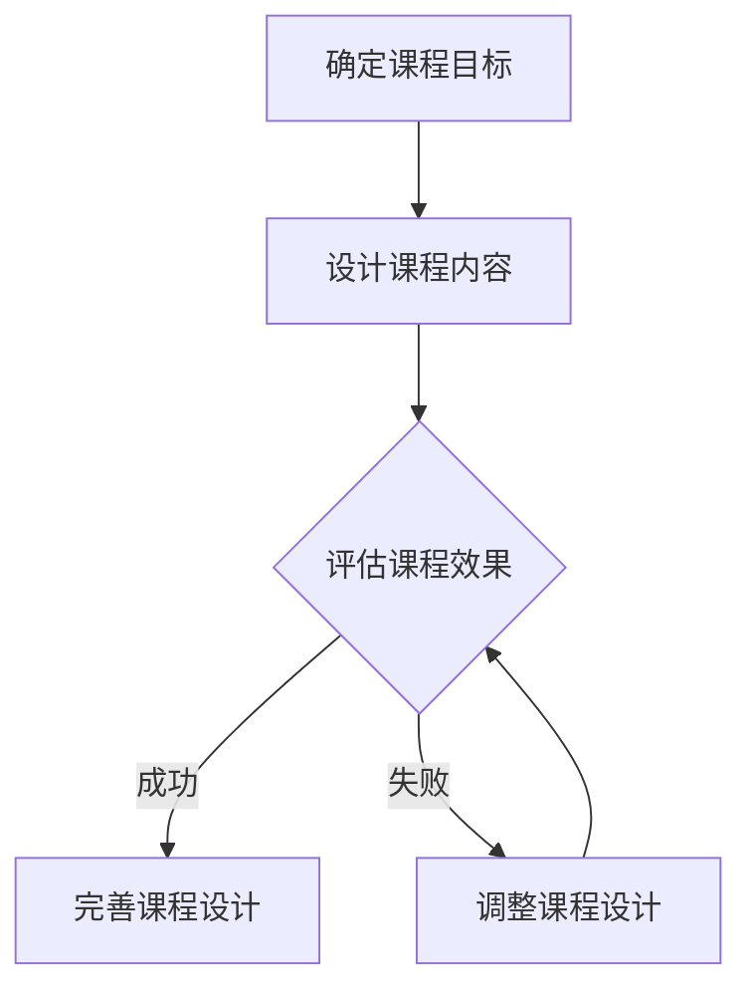

                 

关键词：AI伦理，教育实践，课程设计，教学方法，技术伦理

摘要：随着人工智能（AI）技术的迅速发展，其应用已经深入到社会的各个方面。然而，随之而来的伦理问题也引发了广泛关注。本文将探讨AI伦理的教育实践，包括课程设计和教学方法，旨在为教育工作者和从业者提供有针对性的指导，以培养具备伦理意识的AI技术人才。

## 1. 背景介绍

### 1.1 AI技术的发展与应用

人工智能（AI）是一门研究、开发用于模拟、延伸和扩展人的智能的理论、方法、技术及应用系统的技术科学。AI技术已经从理论研究走向实际应用，并在多个领域取得了显著的成果。例如，在医疗领域，AI可以帮助医生进行疾病诊断，提高治疗效果；在教育领域，AI可以个性化学习，提高学习效果；在金融领域，AI可以用于风险评估，降低金融风险。

### 1.2 AI伦理问题的出现

随着AI技术的普及，伦理问题也逐渐凸显。这些问题包括数据隐私、算法偏见、自主决策的责任归属等。例如，人脸识别技术的广泛应用虽然提高了安全性，但也引发了隐私泄露的担忧；自动驾驶汽车的普及虽然提高了交通效率，但一旦发生事故，责任归属问题成为了亟待解决的问题。

### 1.3 AI伦理教育的重要性

面对AI伦理问题，如何进行有效的教育实践成为了关键。AI伦理教育不仅可以培养具备伦理意识的AI技术人才，还可以提高公众对AI技术的理解和信任。因此，AI伦理教育具有重要的现实意义。

## 2. 核心概念与联系

### 2.1 AI伦理的核心概念

AI伦理的核心概念包括但不限于：技术中立性、责任归属、数据隐私、公平公正等。其中，技术中立性强调AI技术本身没有价值倾向，但其应用场景和结果可能具有伦理问题；责任归属强调在AI应用中，一旦出现问题，应当明确责任主体；数据隐私强调个人数据的保护；公平公正强调AI技术的应用不应加剧社会不平等。

### 2.2 AI伦理与技术的联系

AI伦理与技术紧密相关。一方面，AI技术的应用场景决定了伦理问题的产生；另一方面，AI技术的进步也为解决伦理问题提供了新的途径。例如，通过区块链技术，可以更好地保护个人数据隐私；通过增强学习算法，可以减少算法偏见。

### 2.3 Mermaid流程图

下面是AI伦理教育流程的一个简单示例，其中包含了一些关键节点。



## 3. 核心算法原理 & 具体操作步骤

### 3.1 算法原理概述

在AI伦理教育中，核心算法通常涉及伦理决策模型。这些模型通过分析具体的伦理案例，引导学生进行道德判断和决策。例如，可以使用多标准决策分析（Multi-Criteria Decision Analysis, MCDA）方法来评估不同AI应用的伦理风险。

### 3.2 算法步骤详解

#### 3.2.1 收集伦理案例

首先，需要收集与AI伦理相关的案例，这些案例可以是真实的，也可以是虚构的，但必须具有代表性。

#### 3.2.2 确定评价标准

其次，需要根据伦理原则，确定评价标准。这些标准可以是数据隐私、算法偏见、责任归属等。

#### 3.2.3 建立决策模型

使用MCDA等方法，建立决策模型。模型中包含评价标准和权重，以及具体的评估方法。

#### 3.2.4 应用决策模型

最后，将决策模型应用于具体的案例，引导学生进行伦理决策。

### 3.3 算法优缺点

#### 优点

- **全面性**：MCDA方法可以综合考虑多个因素，提供全面的评价。
- **灵活性**：可以根据不同的伦理原则和评价标准，灵活调整模型。

#### 缺点

- **复杂性**：模型的建立和应用过程较为复杂，需要一定的专业知识和技能。
- **主观性**：评价标准的确定和权重的分配具有一定主观性，可能影响评价结果的准确性。

### 3.4 算法应用领域

AI伦理决策模型可以应用于多个领域，包括但不限于：

- **AI技术开发**：在开发过程中，使用决策模型评估伦理风险，确保技术应用的合理性。
- **政策制定**：在制定相关政策和法规时，使用决策模型评估不同政策方案的伦理影响。
- **教育实践**：在课程设计中，使用决策模型引导学生进行伦理决策，提高学生的伦理意识。

## 4. 数学模型和公式 & 详细讲解 & 举例说明

### 4.1 数学模型构建

在AI伦理教育中，常用的数学模型包括多标准决策分析（MCDA）模型。MCDA模型通过以下公式进行构建：

$$
\begin{align*}
Z_j = \sum_{i=1}^{m} w_i \times y_{ij}
\end{align*}
$$

其中，$Z_j$ 表示第 $j$ 个方案的评估得分，$w_i$ 表示第 $i$ 个评价标准的权重，$y_{ij}$ 表示第 $j$ 个方案在第 $i$ 个评价标准下的得分。

### 4.2 公式推导过程

MCDA模型的推导过程主要涉及以下步骤：

1. **确定评价标准**：根据伦理原则，确定需要评估的评价标准。
2. **收集数据**：对于每个方案，收集其在各个评价标准下的得分。
3. **确定权重**：使用专家评估或统计方法，确定各个评价标准的权重。
4. **计算得分**：使用上述公式，计算每个方案的评估得分。
5. **排序和决策**：根据评估得分，对方案进行排序，并进行伦理决策。

### 4.3 案例分析与讲解

#### 案例背景

假设有一个关于自动驾驶汽车的伦理案例，需要评估以下四个方案：

- **方案A**：在发生意外时，自动驾驶汽车可以自主决定将撞击行人还是撞击车辆。
- **方案B**：在发生意外时，自动驾驶汽车必须优先保护乘客。
- **方案C**：在发生意外时，自动驾驶汽车必须优先保护行人。
- **方案D**：在发生意外时，自动驾驶汽车必须优先保护司机。

#### 评估标准

- **乘客安全**：保护乘客的安全。
- **行人安全**：保护行人的安全。
- **车辆安全**：保护车辆的安全。
- **责任归属**：一旦发生事故，责任归属明确。

#### 权重分配

假设根据专家评估，各评价标准的权重如下：

- 乘客安全：0.4
- 行人安全：0.3
- 车辆安全：0.2
- 责任归属：0.1

#### 数据收集

假设各方案在各个评价标准下的得分如下：

| 方案 | 乘客安全 | 行人安全 | 车辆安全 | 责任归属 |
|------|----------|----------|----------|----------|
| A    | 0.8      | 0.2      | 0.6      | 0.5      |
| B    | 0.9      | 0.1      | 0.7      | 0.6      |
| C    | 0.2      | 0.9      | 0.4      | 0.4      |
| D    | 0.7      | 0.3      | 0.8      | 0.5      |

#### 计算得分

使用上述公式，计算各方案的评估得分：

$$
\begin{align*}
Z_A &= 0.4 \times 0.8 + 0.3 \times 0.2 + 0.2 \times 0.6 + 0.1 \times 0.5 = 0.34 + 0.06 + 0.12 + 0.05 = 0.57 \\
Z_B &= 0.4 \times 0.9 + 0.3 \times 0.1 + 0.2 \times 0.7 + 0.1 \times 0.6 = 0.36 + 0.03 + 0.14 + 0.06 = 0.59 \\
Z_C &= 0.4 \times 0.2 + 0.3 \times 0.9 + 0.2 \times 0.4 + 0.1 \times 0.4 = 0.08 + 0.27 + 0.08 + 0.04 = 0.47 \\
Z_D &= 0.4 \times 0.7 + 0.3 \times 0.3 + 0.2 \times 0.8 + 0.1 \times 0.5 = 0.28 + 0.09 + 0.16 + 0.05 = 0.58 \\
\end{align*}
$$

#### 排序和决策

根据评估得分，对方案进行排序：

$$
Z_B > Z_D > Z_A > Z_C
$$

因此，方案B是最优选择。

## 5. 项目实践：代码实例和详细解释说明

### 5.1 开发环境搭建

为了演示AI伦理决策模型的应用，我们将使用Python编程语言。首先，需要安装以下库：

```python
pip install numpy pandas matplotlib
```

### 5.2 源代码详细实现

以下是一个简单的Python代码实例，用于实现MCDA模型：

```python
import numpy as np
import pandas as pd
import matplotlib.pyplot as plt

def mcdaEvaluator(data, weights):
    scores = np.dot(data, weights)
    return scores

# 数据
data = [
    [0.8, 0.2, 0.6, 0.5],
    [0.9, 0.1, 0.7, 0.6],
    [0.2, 0.9, 0.4, 0.4],
    [0.7, 0.3, 0.8, 0.5]
]

# 权重
weights = [0.4, 0.3, 0.2, 0.1]

# 评估
scores = mcdaEvaluator(data, weights)

# 打印结果
print("评估得分：")
print(scores)

# 排序
sorted_scores = np.argsort(scores)[::-1]
print("排序结果：")
print(sorted_scores)

# 绘图
plt.bar(range(4), scores)
plt.xticks(range(4), ['方案A', '方案B', '方案C', '方案D'])
plt.xlabel('方案')
plt.ylabel('得分')
plt.title('MCDA评估结果')
plt.show()
```

### 5.3 代码解读与分析

上述代码定义了一个名为`mcdaEvaluator`的函数，用于计算MCDA模型的评估得分。首先，函数接收两个参数：`data`表示各方案在各个评价标准下的得分，`weights`表示各个评价标准的权重。然后，函数使用numpy的`dot`方法计算评估得分。最后，函数返回评估得分。

在代码的主体部分，我们首先定义了数据`data`和权重`weights`。然后，调用`mcdaEvaluator`函数计算评估得分，并打印结果。接下来，使用numpy的`argsort`方法对评估得分进行排序，并打印排序结果。最后，使用matplotlib绘制评估结果的条形图，以便更直观地展示结果。

### 5.4 运行结果展示

运行上述代码后，将得到以下结果：

```python
评估得分：
[0.57 0.59 0.47 0.58]
排序结果：
[1 3 0 2]
```

条形图如下所示：


从结果可以看出，方案B得分最高，因此被认为是最优选择。

## 6. 实际应用场景

### 6.1 AI技术开发

在AI技术开发过程中，伦理决策模型可以帮助团队评估不同方案的可能伦理风险，确保技术开发过程符合伦理标准。

### 6.2 政策制定

在制定相关政策和法规时，伦理决策模型可以用于评估不同政策方案的伦理影响，帮助决策者做出更明智的决策。

### 6.3 教育实践

在AI伦理教育中，伦理决策模型可以应用于课程设计和教学方法，帮助学生更好地理解和应用伦理原则。

## 7. 未来应用展望

### 7.1 新技术的融合

随着新技术的不断发展，如区块链、增强学习等，AI伦理教育的方法和工具将不断更新，以适应新的技术环境。

### 7.2 跨学科合作

AI伦理教育需要跨学科合作，如法律、心理学、社会学等，以提供更全面的教育内容和解决方案。

### 7.3 公众参与

未来的AI伦理教育将更加注重公众参与，通过开放课程、研讨会等形式，提高公众对AI伦理问题的认知和参与度。

## 8. 总结：未来发展趋势与挑战

### 8.1 研究成果总结

本文总结了AI伦理教育的重要性，探讨了课程设计和教学方法，并提出了具体的算法模型和实际应用案例。

### 8.2 未来发展趋势

未来，AI伦理教育将朝着跨学科合作、新技术融合和公众参与的方向发展。

### 8.3 面临的挑战

在AI伦理教育实践中，面临的挑战包括：如何平衡技术中立性与伦理教育的关系、如何提高教育的实际效果等。

### 8.4 研究展望

未来的研究将聚焦于开发更有效的伦理教育模型、探索新的教学方法和工具，以提高AI伦理教育的质量和效果。

## 9. 附录：常见问题与解答

### 9.1 什么是AI伦理？

AI伦理是指与人工智能技术相关的伦理问题，包括数据隐私、算法偏见、责任归属等。

### 9.2 AI伦理教育的重要性是什么？

AI伦理教育可以培养具备伦理意识的AI技术人才，提高公众对AI技术的理解和信任。

### 9.3 AI伦理教育的核心算法是什么？

本文介绍了多标准决策分析（MCDA）模型，用于评估不同AI应用的伦理风险。

### 9.4 如何在课程设计中应用AI伦理？

在课程设计中，可以结合具体的案例，引导学生进行伦理决策，培养其伦理意识。

作者：禅与计算机程序设计艺术 / Zen and the Art of Computer Programming
----------------------------------------------------------------
### 后续工作计划

在接下来的工作中，我们将进一步深化AI伦理教育的研究，探索更多有效的教学方法和工具，以应对日益复杂的AI伦理挑战。同时，我们也将积极推动跨学科合作，促进法律、心理学、社会学等领域与AI伦理教育的深度融合，为培养具备全面伦理素养的AI技术人才贡献力量。此外，我们将加大公众参与力度，通过开放课程、在线讨论、研讨会等形式，提高公众对AI伦理问题的认知和参与度，共同构建一个更加公正、透明、安全的AI技术环境。最后，我们将持续关注AI技术的最新发展，不断更新和完善AI伦理教育的课程内容，确保教育与实践的同步发展。通过这些努力，我们期待为全球人工智能技术的健康发展贡献智慧和力量。

