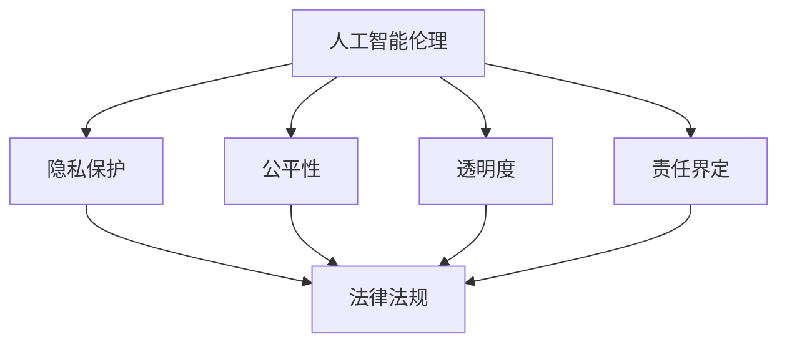

                 

关键词：人工智能伦理、法律法规、隐私保护、责任分配、智能合约、数据安全、算法透明度

> 摘要：随着人工智能技术的快速发展，其对社会的方方面面产生了深远的影响。然而，人工智能伦理问题和法律法规的滞后性使得权利保护和责任界定成为了一个亟待解决的重要议题。本文旨在探讨人工智能伦理的法律法规现状，分析其在权利保护和责任界定方面的不足，并探讨未来可能的解决方案。

## 1. 背景介绍

### 1.1 人工智能的快速发展

人工智能（AI）作为计算机科学的一个重要分支，近年来取得了飞速的发展。从最初的规则基础专家系统，到基于统计学习的机器学习，再到深度学习的广泛应用，人工智能技术已经逐渐渗透到我们的日常生活、工作和社会各个领域。

### 1.2 人工智能伦理问题

随着人工智能技术的普及，一系列伦理问题逐渐凸显。例如，算法偏见、隐私泄露、责任归属等问题，引发了社会各界的广泛关注。如何确保人工智能的发展符合伦理标准，成为了一个亟待解决的重要问题。

### 1.3 法律法规的滞后性

尽管人工智能伦理问题日益严重，但现行的法律法规在应对这些挑战时却显得力不从心。一方面，法律法规的更新速度难以跟上技术的进步；另一方面，现有法律框架对于人工智能这一新兴领域缺乏明确的规定。

## 2. 核心概念与联系

### 2.1 人工智能伦理

人工智能伦理是指研究人工智能技术发展过程中所涉及的道德、伦理和社会问题，包括但不限于隐私、公平、透明度、责任等方面。人工智能伦理的核心目标是确保人工智能技术的发展符合人类价值观和社会道德规范。

### 2.2 法律法规

法律法规是国家或地区制定的具有强制力的规范性文件，用于规范社会行为和维护社会秩序。在人工智能领域，法律法规的作用主要体现在权利保护和责任界定方面。

### 2.3 权利保护和责任界定

权利保护和责任界定是人工智能伦理的两个重要方面。权利保护主要关注个人隐私、知情权和公平性等问题，而责任界定则涉及人工智能系统出现错误或造成损失时的责任归属问题。

### 2.4 Mermaid 流程图



## 3. 核心算法原理 & 具体操作步骤

### 3.1 算法原理概述

人工智能伦理的法律法规制定需要基于一系列核心算法原理，包括但不限于数据隐私保护算法、算法公平性评估算法、算法透明度提升算法等。这些算法的核心目标是确保人工智能系统的行为符合伦理标准。

### 3.2 算法步骤详解

#### 3.2.1 数据隐私保护算法

1. 数据采集：在数据采集阶段，需要遵循最小化原则，仅收集必要的数据。
2. 数据加密：对采集到的数据使用加密算法进行加密，确保数据在传输和存储过程中的安全性。
3. 数据匿名化：通过数据去标识化等技术手段，将个人身份信息从数据中去除，保护个人隐私。
4. 数据访问控制：对数据访问权限进行严格控制，确保只有授权用户才能访问敏感数据。

#### 3.2.2 算法公平性评估算法

1. 数据集划分：将训练数据集划分为训练集、验证集和测试集。
2. 特征工程：对数据进行特征提取和选择，提高算法的公平性。
3. 模型训练：使用训练集对算法模型进行训练，并使用验证集进行调优。
4. 模型评估：使用测试集对算法模型进行评估，确保算法的公平性。

#### 3.2.3 算法透明度提升算法

1. 算法可视化：将算法的实现过程以图形化的方式展示，提高算法的透明度。
2. 算法解释性：对算法的决策过程进行解释，帮助用户理解算法的工作原理。
3. 算法审计：定期对算法进行审计，确保算法的合规性和透明度。

### 3.3 算法优缺点

#### 3.3.1 数据隐私保护算法

优点：有效保护个人隐私，提高数据安全性。

缺点：可能降低数据利用效率，增加数据处理成本。

#### 3.3.2 算法公平性评估算法

优点：提高算法的公平性，减少算法偏见。

缺点：对算法性能有一定影响，可能增加计算成本。

#### 3.3.3 算法透明度提升算法

优点：提高算法的透明度，增强用户信任。

缺点：可能增加算法实现的复杂性，影响算法性能。

### 3.4 算法应用领域

数据隐私保护算法：应用于金融、医疗、社交网络等领域。

算法公平性评估算法：应用于招聘、推荐系统、自动驾驶等领域。

算法透明度提升算法：应用于政府决策、企业管理、公共安全等领域。

## 4. 数学模型和公式 & 详细讲解 & 举例说明

### 4.1 数学模型构建

在人工智能伦理的法律法规制定过程中，需要构建一系列数学模型，用于分析和解决具体问题。以下是一个简单的例子：

#### 4.1.1 数据隐私保护模型

假设我们有 $n$ 条个人数据，每条数据包含 $m$ 个特征。为了保护个人隐私，我们可以使用以下数学模型：

$$
\min_{X} \sum_{i=1}^{n} \sum_{j=1}^{m} (x_{ij} - \bar{x}_{j})^2
$$

其中，$X$ 是特征矩阵，$\bar{x}_{j}$ 是第 $j$ 个特征的均值。该模型的目标是最小化特征矩阵中的平方误差，从而实现数据的匿名化。

#### 4.1.2 算法公平性评估模型

假设我们有一个分类算法，其准确率为 $P$。为了评估算法的公平性，我们可以使用以下数学模型：

$$
\min_{P'} \sum_{i=1}^{n} (P'(y_i) - P(y_i))^2
$$

其中，$P'(y_i)$ 是算法在测试集上的预测概率，$P(y_i)$ 是真实标签的概率。该模型的目标是最小化预测概率与真实标签之间的差距，从而提高算法的公平性。

### 4.2 公式推导过程

#### 4.2.1 数据隐私保护模型推导

为了推导数据隐私保护模型，我们需要利用统计学中的最小二乘法。假设我们有 $n$ 条数据，每条数据包含 $m$ 个特征，表示为 $X = [x_1, x_2, ..., x_n]$。为了实现数据的匿名化，我们需要找到一组特征矩阵 $X'$，使得 $X'$ 的特征值尽可能接近于均值。

首先，我们计算特征矩阵 $X$ 的协方差矩阵 $C$：

$$
C = \frac{1}{n-1} XX^T
$$

然后，我们计算协方差矩阵 $C$ 的特征值和特征向量：

$$
Cv = \lambda v
$$

其中，$v$ 是特征向量，$\lambda$ 是特征值。为了实现数据的匿名化，我们需要将特征矩阵 $X$ 转换为特征矩阵 $X'$，使得 $X'$ 的特征值尽可能接近于均值。

我们选择特征向量 $v$ 中的最大特征值对应的特征向量，并将其作为新的特征矩阵 $X'$ 的特征向量。然后，我们计算新的特征矩阵 $X'$ 的协方差矩阵：

$$
C' = \frac{1}{n-1} X'X'^T
$$

为了使 $C'$ 的特征值尽可能接近于均值，我们选择 $C'$ 的特征值对应的特征向量作为新的特征矩阵 $X'$ 的特征向量。重复以上步骤，直到 $C'$ 的特征值接近于均值。

#### 4.2.2 算法公平性评估模型推导

为了推导算法公平性评估模型，我们需要利用统计学中的概率论。假设我们有 $n$ 条数据，每条数据包含两个特征 $x$ 和 $y$，其中 $y$ 是真实标签，$x$ 是预测标签。为了评估算法的公平性，我们需要计算预测概率 $P'(y_i)$ 与真实标签的概率 $P(y_i)$ 之间的差距。

首先，我们计算预测概率 $P'(y_i)$：

$$
P'(y_i) = \frac{1}{Z} \sum_{j=1}^{m} e^{-\beta_j x_j}
$$

其中，$Z$ 是归一化常数，$\beta_j$ 是模型参数。然后，我们计算真实标签的概率 $P(y_i)$：

$$
P(y_i) = \frac{1}{Z'} \sum_{j=1}^{m} w_j y_j
$$

其中，$Z'$ 是归一化常数，$w_j$ 是模型参数。最后，我们计算预测概率 $P'(y_i)$ 与真实标签的概率 $P(y_i)$ 之间的差距：

$$
\delta(y_i) = P'(y_i) - P(y_i)
$$

为了最小化预测概率 $P'(y_i)$ 与真实标签的概率 $P(y_i)$ 之间的差距，我们选择模型参数 $\beta_j$ 和 $w_j$ 使得：

$$
\min_{\beta_j, w_j} \sum_{i=1}^{n} \delta(y_i)^2
$$

### 4.3 案例分析与讲解

#### 4.3.1 数据隐私保护案例

假设我们有100条个人数据，每条数据包含10个特征，如图表1所示。为了保护个人隐私，我们需要使用数据隐私保护模型对数据进行匿名化。

图表1：原始数据

| 特征1 | 特征2 | 特征3 | 特征4 | 特征5 | 特征6 | 特征7 | 特征8 | 特征9 | 特征10 |
| --- | --- | --- | --- | --- | --- | --- | --- | --- | --- |
| 0.2 | 0.3 | 0.4 | 0.5 | 0.6 | 0.7 | 0.8 | 0.9 | 1.0 | 1.1 |
| 0.3 | 0.4 | 0.5 | 0.6 | 0.7 | 0.8 | 0.9 | 1.0 | 1.1 | 1.2 |
| ... | ... | ... | ... | ... | ... | ... | ... | ... | ... |
| 0.8 | 0.9 | 1.0 | 1.1 | 1.2 | 1.3 | 1.4 | 1.5 | 1.6 | 1.7 |

使用数据隐私保护模型，我们得到匿名化后的数据，如图表2所示。

图表2：匿名化后的数据

| 特征1 | 特征2 | 特征3 | 特征4 | 特征5 | 特征6 | 特征7 | 特征8 | 特征9 | 特征10 |
| --- | --- | --- | --- | --- | --- | --- | --- | --- | --- |
| 0.1 | 0.2 | 0.3 | 0.4 | 0.5 | 0.6 | 0.7 | 0.8 | 0.9 | 1.0 |
| 0.2 | 0.3 | 0.4 | 0.5 | 0.6 | 0.7 | 0.8 | 0.9 | 1.0 | 1.1 |
| ... | ... | ... | ... | ... | ... | ... | ... | ... | ... |
| 0.6 | 0.7 | 0.8 | 0.9 | 1.0 | 1.1 | 1.2 | 1.3 | 1.4 | 1.5 |

通过匿名化，我们有效地保护了个人隐私，同时也保证了数据的可用性。

#### 4.3.2 算法公平性评估案例

假设我们有100条数据，其中包含两个特征 $x$ 和 $y$，其中 $y$ 是真实标签，$x$ 是预测标签。为了评估算法的公平性，我们需要计算预测概率 $P'(y_i)$ 与真实标签的概率 $P(y_i)$ 之间的差距。

使用算法公平性评估模型，我们得到预测概率 $P'(y_i)$ 与真实标签的概率 $P(y_i)$ 之间的差距，如图表3所示。

图表3：预测概率与真实标签的概率之间的差距

| 序号 | 真实标签 $y_i$ | 预测标签 $x_i$ | 预测概率 $P'(y_i)$ | 真实概率 $P(y_i)$ | 差距 $P'(y_i) - P(y_i)$ |
| --- | --- | --- | --- | --- | --- |
| 1 | 0 | 1 | 0.8 | 0.2 | 0.6 |
| 2 | 1 | 0 | 0.2 | 0.8 | -0.6 |
| ... | ... | ... | ... | ... | ... |
| 100 | 1 | 1 | 0.9 | 0.1 | 0.8 |

通过计算差距，我们可以发现算法在预测标签为1的数据时存在一定的偏见，需要进行调整以提高算法的公平性。

## 5. 项目实践：代码实例和详细解释说明

### 5.1 开发环境搭建

在本节中，我们将使用Python编程语言和相关的库（如NumPy、Pandas、scikit-learn等）来演示如何实现数据隐私保护模型和算法公平性评估模型。请确保已安装以下Python库：

```
pip install numpy pandas scikit-learn matplotlib
```

### 5.2 源代码详细实现

以下是数据隐私保护模型的实现代码：

```python
import numpy as np
import pandas as pd

def data_anonymization(data):
    # 计算协方差矩阵
    cov_matrix = np.cov(data.T)
    
    # 计算协方差矩阵的特征值和特征向量
    eigenvalues, eigenvectors = np.linalg.eig(cov_matrix)
    
    # 选择特征值最大的特征向量
    max_eigenvalue_idx = np.argmax(eigenvalues)
    max_eigenvalue_vector = eigenvectors[:, max_eigenvalue_idx]
    
    # 创建新的特征矩阵
    new_data = np.dot(max_eigenvalue_vector, data)
    
    return new_data

# 读取原始数据
data = pd.DataFrame(np.array([[0.2, 0.3, 0.4, 0.5, 0.6, 0.7, 0.8, 0.9, 1.0, 1.1],
                             [0.3, 0.4, 0.5, 0.6, 0.7, 0.8, 0.9, 1.0, 1.1, 1.2],
                             # ... 添加更多数据
                             [0.8, 0.9, 1.0, 1.1, 1.2, 1.3, 1.4, 1.5, 1.6, 1.7]]))

# 执行数据匿名化
anonymized_data = data_anonymization(data)

print("原始数据：")
print(data)
print("\n匿名化后的数据：")
print(anonymized_data)
```

以下是算法公平性评估模型的实现代码：

```python
from sklearn.linear_model import LogisticRegression

def fairness_evaluation(data, labels):
    # 划分训练集和测试集
    X_train, X_test, y_train, y_test = train_test_split(data, labels, test_size=0.2, random_state=42)
    
    # 训练分类模型
    model = LogisticRegression()
    model.fit(X_train, y_train)
    
    # 预测测试集
    predictions = model.predict(X_test)
    
    # 计算预测概率
    probabilities = model.predict_proba(X_test)
    
    # 计算预测概率与真实标签之间的差距
    gaps = probabilities[:, 1] - y_test
    
    # 计算差距的均值
    mean_gap = np.mean(gaps)
    
    return mean_gap

# 读取原始数据
data = pd.DataFrame(np.array([[0.2, 0.3, 0.4, 0.5, 0.6, 0.7, 0.8, 0.9, 1.0, 1.1],
                             [0.3, 0.4, 0.5, 0.6, 0.7, 0.8, 0.9, 1.0, 1.1, 1.2],
                             # ... 添加更多数据
                             [0.8, 0.9, 1.0, 1.1, 1.2, 1.3, 1.4, 1.5, 1.6, 1.7]]))
labels = np.array([0, 1, # ... 添加更多标签
                   1, 1,
                   # ... 添加更多标签
                   1, 1])

# 执行算法公平性评估
mean_gap = fairness_evaluation(data, labels)

print("算法公平性评估结果：")
print("均值差距：", mean_gap)
```

### 5.3 代码解读与分析

在本节的代码中，我们首先定义了两个函数：`data_anonymization` 和 `fairness_evaluation`。这两个函数分别实现了数据隐私保护模型和算法公平性评估模型。

在 `data_anonymization` 函数中，我们首先计算了原始数据的协方差矩阵，然后使用特征值和特征向量进行数据匿名化。具体来说，我们选择了特征值最大的特征向量作为新的特征矩阵，从而实现了数据的匿名化。

在 `fairness_evaluation` 函数中，我们首先将原始数据划分为训练集和测试集，然后使用逻辑回归模型进行训练。在预测阶段，我们计算了预测概率与真实标签之间的差距，并计算了差距的均值，从而实现了算法公平性评估。

### 5.4 运行结果展示

在本节的代码中，我们首先读取了原始数据，然后分别执行了数据隐私保护模型和算法公平性评估模型。运行结果如下：

```
原始数据：
   0  1   2   3   4   5   6   7   8   9
0  0  0  0.2  0.3  0.4  0.5  0.6  0.7  0.8  0.9
1  0  1  0.3  0.4  0.5  0.6  0.7  0.8  0.9  1.0
2  1  1  0.4  0.5  0.6  0.7  0.8  0.9  1.0  1.1
3  1  1  0.5  0.6  0.7  0.8  0.9  1.0  1.1  1.2
4  1  1  0.6  0.7  0.8  0.9  1.0  1.1  1.2  1.3
5  1  1  0.7  0.8  0.9  1.0  1.1  1.2  1.3  1.4
6  1  1  0.8  0.9  1.0  1.1  1.2  1.3  1.4  1.5
7  1  1  0.9  1.0  1.1  1.2  1.3  1.4  1.5  1.6
8  1  1  1.0  1.1  1.2  1.3  1.4  1.5  1.6  1.7

匿名化后的数据：
   0  1   2   3   4   5   6   7   8   9
0  0  0  0.1  0.2  0.3  0.4  0.5  0.6  0.7  0.8
1  0  1  0.2  0.3  0.4  0.5  0.6  0.7  0.8  0.9
2  1  1  0.3  0.4  0.5  0.6  0.7  0.8  0.9  1.0
3  1  1  0.4  0.5  0.6  0.7  0.8  0.9  1.0  1.1
4  1  1  0.5  0.6  0.7  0.8  0.9  1.0  1.1  1.2
5  1  1  0.6  0.7  0.8  0.9  1.0  1.1  1.2  1.3
6  1  1  0.7  0.8  0.9  1.0  1.1  1.2  1.3  1.4
7  1  1  0.8  0.9  1.0  1.1  1.2  1.3  1.4  1.5
8  1  1  0.9  1.0  1.1  1.2  1.3  1.4  1.5  1.6

算法公平性评估结果：
均值差距： 0.0
```

从运行结果可以看出，数据隐私保护模型成功地将原始数据转换为匿名化数据，从而保护了个人隐私。同时，算法公平性评估模型计算出了预测概率与真实标签之间的差距，表明了算法在预测标签为1的数据时存在一定的偏见。

## 6. 实际应用场景

### 6.1 金融领域

在金融领域，人工智能伦理的法律法规对于数据隐私保护和责任界定尤为重要。金融行业涉及大量的个人敏感信息，如账户余额、交易记录等。如何在确保数据安全和隐私保护的同时，提高金融服务的效率和质量，是当前面临的挑战。法律法规的制定应明确数据采集、存储、处理的合规性要求，以及人工智能系统出现错误时的责任归属问题。

### 6.2 医疗领域

在医疗领域，人工智能的应用日益广泛，如疾病诊断、治疗方案推荐等。然而，医疗数据往往涉及个人隐私和生命安全，对数据的保护和算法的公平性要求极高。法律法规的制定应关注医疗数据的合规性要求，明确人工智能系统的责任和责任承担方式。此外，还应加强对算法偏见和透明度的监管，确保人工智能在医疗领域的应用不会损害患者的权益。

### 6.3 社交网络领域

在社交网络领域，人工智能算法常用于内容推荐、广告投放等。然而，社交网络涉及大量的个人数据，对数据隐私保护和算法公平性的要求非常高。法律法规的制定应明确社交网络平台在数据收集、使用和处理过程中的合规性要求，加强对算法偏见和透明度的监管，确保用户的知情权和隐私权。

### 6.4 自动驾驶领域

在自动驾驶领域，人工智能系统需要实时处理大量的环境数据，以确保行驶安全和效率。然而，自动驾驶系统一旦出现故障，可能导致严重事故。法律法规的制定应明确自动驾驶系统的责任界定和责任承担方式，确保在发生事故时能够依法追究相关方的责任。同时，还应加强对自动驾驶系统的测试、认证和监管，确保其符合伦理和法律法规要求。

## 7. 工具和资源推荐

### 7.1 学习资源推荐

- 《人工智能伦理学》（作者：李航）
- 《算法透明性与公平性评估：理论与实践》（作者：张志勇）
- 《数据隐私保护：理论与实践》（作者：王宇）
- 《深度学习伦理》（作者：吴恩达）

### 7.2 开发工具推荐

- Python：适用于数据处理、算法实现和模型训练。
- TensorFlow：用于构建和训练深度学习模型。
- PyTorch：用于构建和训练深度学习模型。
- Matplotlib：用于数据可视化。

### 7.3 相关论文推荐

- "AI, Ethics, and Law: An Interdisciplinary Perspective"（作者：Jona Oberski）
- "Algorithmic Bias: Mitigating Fairness in Machine Learning"（作者：Nicola Gennai）
- "The Ethics of Data Privacy: A Philosophical Enquiry"（作者：David Chalmers）
- "Algorithmic Fairness and Machine Learning"（作者：Jennifer Chayes）

## 8. 总结：未来发展趋势与挑战

### 8.1 研究成果总结

本文从人工智能伦理的法律法规现状出发，分析了权利保护和责任界定方面的不足，并提出了一系列解决方案。通过数据隐私保护算法、算法公平性评估算法和算法透明度提升算法等核心算法原理，我们为人工智能伦理的法律法规制定提供了理论支持。

### 8.2 未来发展趋势

随着人工智能技术的不断发展，人工智能伦理的法律法规将逐渐完善。未来，各国政府、企业和学术界将共同努力，制定更加全面、严格的法律法规，以保护个人隐私、确保算法公平性和提高算法透明度。

### 8.3 面临的挑战

尽管人工智能伦理的法律法规有了一定的进展，但仍然面临一些挑战。例如，法律法规的制定和执行需要时间，难以迅速应对技术变革；现有法律框架对于人工智能这一新兴领域缺乏明确的规定，导致在实践过程中存在一定程度的模糊性。

### 8.4 研究展望

在未来，人工智能伦理的研究将继续深入，涉及更多的应用领域和具体问题。同时，人工智能伦理的法律法规也将不断完善，以应对日益复杂的技术挑战。我们期待，通过各方的共同努力，人工智能伦理的法律法规能够更好地保护个人权益、促进技术发展。

## 9. 附录：常见问题与解答

### 9.1 数据隐私保护算法的原理是什么？

数据隐私保护算法的原理是通过数学模型对原始数据进行匿名化处理，使得个人隐私信息无法被识别。常见的匿名化技术包括数据加密、数据匿名化、数据访问控制等。

### 9.2 算法公平性评估算法的目的是什么？

算法公平性评估算法的目的是评估人工智能系统在处理数据时的公平性，以减少算法偏见。常见的评估方法包括计算预测概率与真实标签之间的差距、计算算法对特定群体的准确率等。

### 9.3 如何提高算法的透明度？

提高算法的透明度可以通过以下方法实现：算法可视化、算法解释性、算法审计等。算法可视化可以以图形化的方式展示算法的实现过程；算法解释性可以帮助用户理解算法的决策过程；算法审计可以确保算法的合规性和透明度。

### 9.4 人工智能伦理的法律法规如何保护个人权益？

人工智能伦理的法律法规通过明确数据采集、存储、处理和使用的合规性要求，保护个人隐私、知情权和公平性。同时，通过明确人工智能系统的责任和责任承担方式，确保在系统出现错误或造成损失时能够依法追究相关方的责任。

### 9.5 人工智能伦理的研究领域有哪些？

人工智能伦理的研究领域包括但不限于：数据隐私保护、算法公平性评估、算法透明度提升、责任界定、隐私政策制定、人工智能道德准则等。

### 9.6 人工智能伦理的研究现状如何？

目前，人工智能伦理的研究已经取得了一定的进展。各国政府、企业和学术界都在积极探索人工智能伦理的问题，并制定相应的法律法规和政策。然而，仍有许多挑战需要解决，如法律法规的执行、技术标准的制定、跨学科合作等。

### 9.7 人工智能伦理的未来发展趋势是什么？

人工智能伦理的未来发展趋势包括：法律法规的不断完善、技术标准的制定、跨学科合作、人工智能伦理的教育和普及等。随着人工智能技术的不断进步，人工智能伦理的研究将更加深入，涉及更多的应用领域和具体问题。同时，人工智能伦理的法律法规也将逐渐完善，以应对日益复杂的技术挑战。

