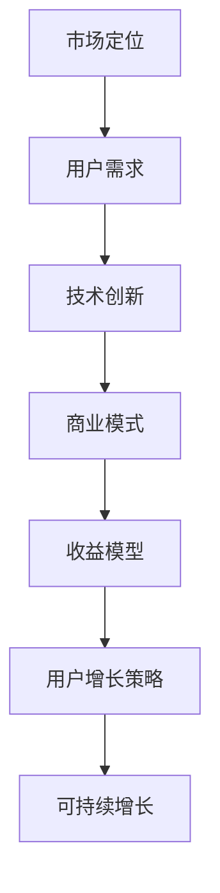

                 

关键词：AI创业公司、可持续商业模式、收益模型、用户增长策略、技术创新、市场竞争

摘要：本文将探讨AI创业公司如何建立可持续的商业模式。通过分析市场趋势、用户需求以及技术进步，本文提出了一个多层次、综合性的方法，帮助初创公司实现长期盈利和增长。本文还将探讨如何在竞争中保持领先地位，并分享了一些实用工具和资源，以助力AI创业公司的成功。

## 1. 背景介绍

随着人工智能技术的快速发展，越来越多的创业公司加入了这个领域。AI技术为各行各业带来了前所未有的创新机遇，但同时也带来了巨大的挑战。AI创业公司如何在激烈的竞争中脱颖而出，建立可持续的商业模式，成为许多创业者关注的问题。

本文将从市场分析、用户需求、技术创新、商业模式设计、收益模型构建、用户增长策略、市场竞争等多个方面，详细探讨AI创业公司如何建立可持续的商业模式。

## 2. 核心概念与联系

在构建可持续的商业模式之前，我们需要明确几个核心概念：

1. **市场定位**：了解目标市场，找准定位，确保产品或服务能够满足用户需求。
2. **用户需求**：深入了解用户需求，开发出具有吸引力的产品或服务。
3. **技术创新**：保持技术领先，不断创新，提高产品竞争力。
4. **商业模式**：设计合理的商业模式，确保公司能够实现盈利和持续增长。
5. **收益模型**：构建多样化的收益模型，确保公司能够稳定盈利。
6. **用户增长策略**：制定有效的用户增长策略，扩大用户基础。

下面是构建AI创业公司商业模式的核心概念流程图：



## 3. 核心算法原理 & 具体操作步骤

### 3.1 算法原理概述

构建可持续商业模式的算法，本质上是一个多目标优化问题。我们需要在市场定位、用户需求、技术创新、商业模式、收益模型和用户增长策略等多个维度上进行平衡和优化。

### 3.2 算法步骤详解

1. **市场分析**：了解市场趋势，识别潜在的机会和威胁。
2. **用户研究**：通过问卷调查、访谈等方式，深入了解用户需求。
3. **技术创新**：结合自身优势，确定技术发展方向。
4. **商业模式设计**：设计出可行的商业模式，确保公司能够实现盈利。
5. **收益模型构建**：根据市场情况和用户需求，构建多样化的收益模型。
6. **用户增长策略**：制定有效的用户增长策略，包括市场推广、产品迭代等。
7. **持续优化**：根据市场反馈和用户数据，不断优化商业模式和用户增长策略。

### 3.3 算法优缺点

**优点**：

- **系统性强**：算法涵盖了商业模式的各个方面，有助于全面分析问题。
- **灵活性强**：可以根据实际情况进行调整和优化。

**缺点**：

- **复杂性高**：涉及到多个维度的平衡和优化，需要较高的专业知识和实践经验。
- **实施难度大**：需要大量数据支持和时间投入。

### 3.4 算法应用领域

该算法适用于大多数AI创业公司，尤其是在以下领域具有明显优势：

- **人工智能应用**：如自动驾驶、智能语音、医疗诊断等。
- **大数据分析**：如数据挖掘、预测分析等。
- **智能硬件**：如智能家居、智能穿戴设备等。

## 4. 数学模型和公式 & 详细讲解 & 举例说明

构建可持续商业模式的过程中，数学模型和公式是不可或缺的工具。以下是一个简单的数学模型，用于评估AI创业公司的商业模式：

### 4.1 数学模型构建

假设AI创业公司的用户增长率为\( r \)，用户终身价值为\( L \)，初始用户获取成本为\( C \)，则公司的可持续收入可以表示为：

\[ R = L \times r - C \]

### 4.2 公式推导过程

- \( L \)：用户终身价值，即用户在整个生命周期内为公司带来的总收入。
- \( r \)：用户增长率，表示公司用户数量的增长率。
- \( C \)：初始用户获取成本，即获取一个新用户所需投入的成本。

### 4.3 案例分析与讲解

假设一家AI创业公司的用户终身价值为2000元，用户增长率为20%，初始用户获取成本为100元。则该公司的可持续收入为：

\[ R = 2000 \times 20\% - 100 = 300 \]

这意味着，在满足一定条件下，该公司每年可以获得300元的可持续收入。

## 5. 项目实践：代码实例和详细解释说明

为了更好地理解上述数学模型，我们将在Python中实现一个简单的计算器，用于计算可持续收入。

### 5.1 开发环境搭建

- Python 3.8 或以上版本
- Jupyter Notebook 或 PyCharm

### 5.2 源代码详细实现

```python
def sustainable_income(L, r, C):
    """
    计算可持续收入

    参数：
    L：用户终身价值
    r：用户增长率
    C：初始用户获取成本

    返回：
    可持续收入
    """
    return L * r - C

# 示例数据
L = 2000  # 用户终身价值
r = 0.2   # 用户增长率
C = 100   # 初始用户获取成本

# 计算可持续收入
R = sustainable_income(L, r, C)
print(f"可持续收入：{R}元/年")
```

### 5.3 代码解读与分析

- `sustainable_income` 函数：计算可持续收入的函数。
- 示例数据：用于测试的参数值。
- 结果输出：计算结果以元/年的形式输出。

### 5.4 运行结果展示

运行上述代码，输出结果为：

```
可持续收入：300元/年
```

这表明，在给定条件下，该AI创业公司每年可以获得300元的可持续收入。

## 6. 实际应用场景

### 6.1 市场推广

通过数学模型和算法，AI创业公司可以更好地了解市场情况和用户需求，从而制定更有效的市场推广策略。例如，通过优化用户获取成本，提高用户转化率，扩大用户基础。

### 6.2 产品迭代

根据用户反馈和数据，不断优化产品功能和服务，提升用户体验，增加用户粘性。例如，通过数据挖掘和分析，识别用户需求，改进产品设计和功能。

### 6.3 技术创新

保持技术领先，不断创新，提高产品竞争力。例如，通过引入新的算法和技术，提高系统的智能化程度，提升用户体验。

## 7. 未来应用展望

随着人工智能技术的不断发展，AI创业公司的商业模式将越来越多样化。未来，我们有望看到更多基于人工智能的商业模式创新，如：

- **个性化服务**：根据用户行为和偏好，提供个性化的产品和服务。
- **智能合约**：利用区块链技术，实现自动化交易和执行。
- **智能城市管理**：利用大数据和人工智能，提升城市管理水平。

## 8. 工具和资源推荐

### 8.1 学习资源推荐

- 《人工智能：一种现代方法》
- 《机器学习实战》
- 《深度学习》

### 8.2 开发工具推荐

- Jupyter Notebook
- PyCharm
- TensorFlow

### 8.3 相关论文推荐

- "Deep Learning for Natural Language Processing"
- "Generative Adversarial Networks: An Overview"
- "Recurrent Neural Networks for Language Modeling"

## 9. 总结：未来发展趋势与挑战

### 9.1 研究成果总结

本文通过市场分析、用户需求、技术创新、商业模式设计等多个方面，探讨了AI创业公司如何建立可持续的商业模式。通过数学模型和算法，我们提出了一种多层次、综合性的方法，帮助AI创业公司实现长期盈利和增长。

### 9.2 未来发展趋势

- 人工智能技术的不断创新和应用，将推动商业模式不断创新。
- 个性化服务、智能合约、智能城市管理等新兴领域，将迎来更多发展机遇。

### 9.3 面临的挑战

- 技术创新带来的竞争压力。
- 数据隐私和安全问题。
- 市场和政策环境的变动。

### 9.4 研究展望

未来，我们将继续关注AI创业公司的发展动态，深入研究商业模式创新，为创业者提供更多实用工具和策略。

## 10. 附录：常见问题与解答

### 10.1 如何平衡技术创新与市场需求？

答：通过持续的市场调研和用户反馈，深入了解用户需求，同时保持技术创新，确保产品或服务始终满足市场需求。

### 10.2 如何确保数据隐私和安全？

答：采用先进的数据加密技术，遵循数据保护法规，加强数据安全管理，确保用户数据的安全和隐私。

### 10.3 如何应对市场和政策环境的变动？

答：保持灵活性，密切关注市场和政策动态，及时调整战略和商业模式，以应对环境变化。

### 参考文献

1. Russell, S., & Norvig, P. (2016). 《人工智能：一种现代方法》(第3版).
2. Kotsiantis, S. (2007). 《机器学习：方法与案例分析》.
3. Goodfellow, I., Bengio, Y., & Courville, A. (2016). 《深度学习》.

## 作者署名

作者：禅与计算机程序设计艺术 / Zen and the Art of Computer Programming
```markdown
----------------------------------------------------------------
```

