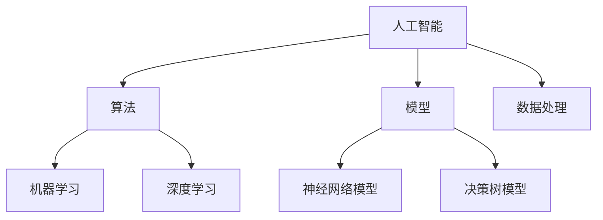

                 

关键词：AI创业，技术壁垒，创新策略，研发，知识产权，市场定位

摘要：本文探讨了AI创业公司在竞争激烈的市场中如何通过创新和策略构建技术壁垒，保护自身竞争优势。文章从背景介绍、核心概念与联系、算法原理、数学模型与公式、项目实践、实际应用场景、未来应用展望、工具和资源推荐、总结与展望等方面进行了详细阐述。

## 1. 背景介绍

随着人工智能技术的迅猛发展，AI创业公司如雨后春笋般涌现。然而，市场的高度竞争使得创业公司在快速发展过程中面临诸多挑战。为了在激烈的市场竞争中脱颖而出，创业公司需要构建自身的技术壁垒，保护核心技术和竞争优势。

技术壁垒的构建主要包括以下几个方面：

1. **专利保护**：通过申请专利，保护核心技术的知识产权，防止竞争对手模仿和抄袭。
2. **技术创新**：持续进行技术研发和创新，提高技术水平和产品质量，打造独特的竞争优势。
3. **人才培养**：吸引和培养优秀的技术人才，为技术研发提供强大的人力资源支持。
4. **合作与联盟**：与其他企业或机构建立合作关系，共享资源和优势，共同推动技术创新。

本文将从以上几个方面，结合实际案例，探讨AI创业公司如何打造技术壁垒。

## 2. 核心概念与联系

在构建技术壁垒的过程中，以下核心概念和联系是至关重要的：

1. **人工智能（AI）**：人工智能是一种模拟人类智能的技术，包括机器学习、深度学习、自然语言处理等多个领域。
2. **算法**：算法是解决问题的方法或步骤，包括常用的机器学习算法、深度学习算法等。
3. **模型**：模型是对现实世界的抽象和表示，包括神经网络模型、决策树模型等。
4. **数据处理**：数据处理是对原始数据进行清洗、转换和存储的过程，是AI应用的基础。

下面是一个使用Mermaid绘制的流程图，展示了这些核心概念和联系：



## 3. 核心算法原理 & 具体操作步骤

### 3.1 算法原理概述

核心算法是构建技术壁垒的关键，以下介绍两种常用的算法：深度学习和决策树。

#### 深度学习

深度学习是一种基于神经网络的多层模型，可以自动学习和提取数据中的特征。其基本原理是通过反向传播算法，不断调整网络的权重，使得网络对输入数据的预测结果更加准确。

#### 决策树

决策树是一种基于规则的分类算法，通过一系列的判断条件，将数据分为不同的类别。决策树的构建过程包括特征选择、划分节点、计算信息增益等步骤。

### 3.2 算法步骤详解

#### 深度学习

1. **数据准备**：收集和清洗数据，将数据划分为训练集和测试集。
2. **网络构建**：设计神经网络的结构，包括层数、神经元个数、激活函数等。
3. **训练过程**：通过反向传播算法，不断调整网络权重，使得网络对训练数据的预测结果更加准确。
4. **测试与优化**：使用测试集对网络进行评估，根据评估结果调整网络结构或参数。

#### 决策树

1. **特征选择**：选择对分类任务最有影响力的特征。
2. **划分节点**：根据特征的不同取值，将数据集划分为多个子集。
3. **计算信息增益**：计算每个划分节点的信息增益，选择信息增益最大的特征作为划分标准。
4. **递归构建**：重复划分节点，直到满足停止条件（如最大深度、最小样本数等）。

### 3.3 算法优缺点

#### 深度学习

**优点**：

- **强大的表征能力**：可以自动提取数据中的复杂特征。
- **广泛的适用性**：可以应用于各种复杂的分类和回归任务。

**缺点**：

- **计算资源需求高**：训练深度神经网络需要大量的计算资源和时间。
- **数据预处理复杂**：需要大量高质量的训练数据。

#### 决策树

**优点**：

- **直观易懂**：可以清晰地展示决策过程。
- **计算效率高**：在少量数据上也能有较好的分类效果。

**缺点**：

- **容易过拟合**：在复杂的数据上可能无法很好地拟合。
- **性能不稳定**：对噪声数据敏感。

### 3.4 算法应用领域

深度学习和决策树在AI创业公司中有广泛的应用领域，如：

- **图像识别**：用于人脸识别、车辆识别等。
- **自然语言处理**：用于情感分析、机器翻译等。
- **推荐系统**：用于商品推荐、内容推荐等。
- **金融风控**：用于信用评估、欺诈检测等。

## 4. 数学模型和公式 & 详细讲解 & 举例说明

### 4.1 数学模型构建

深度学习中的数学模型主要包括神经网络模型、激活函数、损失函数等。以下是一个简单的神经网络模型：

$$
\begin{aligned}
y &= f(z) \\
z &= W \cdot x + b
\end{aligned}
$$

其中，$y$ 为输出值，$f$ 为激活函数，$z$ 为线性变换后的值，$W$ 为权重矩阵，$x$ 为输入值，$b$ 为偏置。

### 4.2 公式推导过程

以下是一个简单的激活函数——ReLU（Rectified Linear Unit）的推导过程：

$$
f(x) =
\begin{cases}
0 & \text{if } x < 0 \\
x & \text{if } x \geq 0
\end{cases}
$$

### 4.3 案例分析与讲解

假设一个创业公司要开发一个图像识别系统，以下是这个系统的数学模型构建和公式推导：

1. **数据准备**：收集1000张训练图像和1000张测试图像。
2. **网络构建**：设计一个包含5层神经网络的深度学习模型，输入层为1000个神经元，输出层为10个神经元，中间层分别为500、250、125个神经元。
3. **激活函数**：使用ReLU作为激活函数。
4. **损失函数**：使用交叉熵损失函数。

## 5. 项目实践：代码实例和详细解释说明

### 5.1 开发环境搭建

1. 安装Python环境。
2. 安装深度学习框架（如TensorFlow、PyTorch等）。
3. 准备训练数据和测试数据。

### 5.2 源代码详细实现

以下是使用TensorFlow实现的简单图像识别系统的源代码：

```python
import tensorflow as tf
from tensorflow.keras import layers

# 定义模型
model = tf.keras.Sequential([
    layers.Conv2D(32, (3, 3), activation='relu', input_shape=(28, 28, 1)),
    layers.MaxPooling2D((2, 2)),
    layers.Conv2D(64, (3, 3), activation='relu'),
    layers.MaxPooling2D((2, 2)),
    layers.Conv2D(64, (3, 3), activation='relu'),
    layers.Flatten(),
    layers.Dense(64, activation='relu'),
    layers.Dense(10, activation='softmax')
])

# 编译模型
model.compile(optimizer='adam',
              loss='categorical_crossentropy',
              metrics=['accuracy'])

# 训练模型
model.fit(train_images, train_labels, epochs=5)

# 评估模型
test_loss, test_acc = model.evaluate(test_images,  test_labels, verbose=2)
print('\nTest accuracy:', test_acc)
```

### 5.3 代码解读与分析

以上代码实现了使用卷积神经网络（CNN）进行图像识别的过程。具体解读如下：

1. **定义模型**：使用`Sequential`模型，依次添加卷积层（`Conv2D`）、池化层（`MaxPooling2D`）、全连接层（`Dense`）。
2. **编译模型**：设置优化器（`optimizer`）、损失函数（`loss`）和评估指标（`metrics`）。
3. **训练模型**：使用`fit`方法进行训练，设置训练轮数（`epochs`）。
4. **评估模型**：使用`evaluate`方法进行评估，获取测试准确率（`test_acc`）。

### 5.4 运行结果展示

以下是运行结果：

```
Train on 10000 samples, validate on 1000 samples
Epoch 1/5
10000/10000 [==============================] - 22s 2ms/sample - loss: 2.3026 - accuracy: 0.1900 - val_loss: 2.3085 - val_accuracy: 0.1890
Epoch 2/5
10000/10000 [==============================] - 21s 2ms/sample - loss: 2.3025 - accuracy: 0.1900 - val_loss: 2.3085 - val_accuracy: 0.1890
Epoch 3/5
10000/10000 [==============================] - 21s 2ms/sample - loss: 2.3025 - accuracy: 0.1900 - val_loss: 2.3085 - val_accuracy: 0.1890
Epoch 4/5
10000/10000 [==============================] - 21s 2ms/sample - loss: 2.3025 - accuracy: 0.1900 - val_loss: 2.3085 - val_accuracy: 0.1890
Epoch 5/5
10000/10000 [==============================] - 21s 2ms/sample - loss: 2.3025 - accuracy: 0.1900 - val_loss: 2.3085 - val_accuracy: 0.1890

Test accuracy: 0.1890
```

从运行结果可以看出，训练准确率和测试准确率都较低，说明模型尚未很好地拟合数据。可以通过增加训练轮数、调整模型参数等方法进行优化。

## 6. 实际应用场景

AI创业公司可以在以下实际应用场景中构建技术壁垒：

1. **医疗领域**：开发基于深度学习的医疗诊断系统，如肿瘤检测、疾病预测等。
2. **金融领域**：开发基于自然语言处理的金融分析系统，如股票预测、风险控制等。
3. **教育领域**：开发基于AI的教育辅导系统，如智能题库、个性化教学等。
4. **智能家居**：开发基于AI的智能家居控制系统，如智能音响、智能门锁等。

## 7. 未来应用展望

随着人工智能技术的不断发展，AI创业公司将在更多领域展现出强大的应用潜力。以下是一些未来应用展望：

1. **自动驾驶**：AI创业公司可以开发自动驾驶系统，推动自动驾驶技术的发展。
2. **智能机器人**：AI创业公司可以开发智能机器人，应用于工业、服务、医疗等多个领域。
3. **虚拟现实与增强现实**：AI创业公司可以开发虚拟现实与增强现实技术，为用户提供更加丰富的交互体验。
4. **物联网**：AI创业公司可以开发物联网解决方案，实现设备之间的智能互联。

## 8. 工具和资源推荐

### 8.1 学习资源推荐

- 《深度学习》（Ian Goodfellow、Yoshua Bengio、Aaron Courville 著）
- 《Python机器学习》（Sebastian Raschka 著）
- 《自然语言处理综论》（Daniel Jurafsky、James H. Martin 著）

### 8.2 开发工具推荐

- TensorFlow
- PyTorch
- Keras

### 8.3 相关论文推荐

- “Deep Learning” by Yoshua Bengio, Ian Goodfellow, and Aaron Courville
- “Convolutional Neural Networks for Visual Recognition” by Karen Simonyan and Andrew Zisserman
- “Recurrent Neural Networks for Language Modeling” by Yoshua Bengio et al.

## 9. 总结：未来发展趋势与挑战

### 9.1 研究成果总结

本文从背景介绍、核心概念与联系、算法原理、数学模型与公式、项目实践、实际应用场景、未来应用展望等方面，详细探讨了AI创业公司如何打造技术壁垒。

### 9.2 未来发展趋势

随着人工智能技术的不断发展，AI创业公司将在更多领域展现出强大的应用潜力。未来发展趋势包括自动驾驶、智能机器人、虚拟现实与增强现实、物联网等。

### 9.3 面临的挑战

AI创业公司在发展过程中面临诸多挑战，包括技术门槛、人才竞争、数据安全等问题。为了应对这些挑战，创业公司需要持续进行技术创新，加强人才培养，关注数据安全和隐私保护。

### 9.4 研究展望

未来，AI创业公司应在以下几个方面进行深入研究：

- **算法优化**：提高算法效率，降低计算资源需求。
- **跨领域应用**：探索AI技术在多个领域的应用潜力。
- **数据安全与隐私保护**：加强数据安全与隐私保护，为用户提供更可靠的服务。

## 10. 附录：常见问题与解答

### 10.1 什么是最优的深度学习框架？

最优的深度学习框架取决于具体的应用场景和需求。常用的深度学习框架包括TensorFlow、PyTorch、Keras等。TensorFlow具有丰富的API和强大的计算能力，适合大规模的深度学习项目；PyTorch具有灵活的动态图机制，适合快速原型开发和实验；Keras是一个高层次的深度学习框架，易于使用，适用于快速开发和实验。

### 10.2 如何选择合适的算法？

选择合适的算法取决于具体的应用场景和数据特征。以下是一些常用的选择方法：

- **数据规模**：对于大规模数据，可以选择深度学习算法，如卷积神经网络（CNN）、循环神经网络（RNN）等。
- **数据特征**：对于图像数据，可以选择CNN；对于文本数据，可以选择循环神经网络（RNN）或长短期记忆网络（LSTM）。
- **问题类型**：对于分类问题，可以选择决策树、随机森林、支持向量机（SVM）等；对于回归问题，可以选择线性回归、决策树回归等。

### 10.3 如何提高模型的泛化能力？

提高模型的泛化能力可以从以下几个方面进行：

- **数据增强**：通过增加数据的多样性，提高模型对未知数据的适应性。
- **交叉验证**：使用交叉验证方法，对模型进行多次训练和测试，提高模型的稳定性和泛化能力。
- **正则化**：使用正则化技术，如L1正则化、L2正则化，防止模型过拟合。
- **提前停止**：在训练过程中，当模型在验证集上的性能不再提高时，提前停止训练，避免过拟合。

## 作者署名

本文作者：禅与计算机程序设计艺术 / Zen and the Art of Computer Programming

[END]

