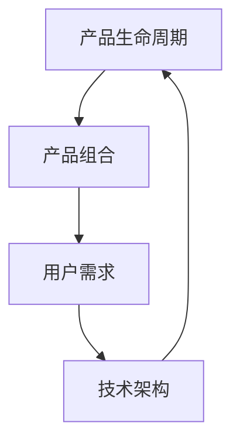

                 

关键词：AI创业公司，产品线管理，策略，用户体验，市场定位，技术架构，数据治理

> 摘要：本文将探讨AI创业公司在产品线管理方面的策略，包括市场定位、用户体验、技术架构和数据分析等方面的关键要素。通过对这些策略的深入分析，帮助企业构建可持续发展的产品线，提高市场竞争力和客户满意度。

## 1. 背景介绍

近年来，人工智能技术的迅猛发展，使得各行业对AI解决方案的需求日益增加。与此同时，AI创业公司的数量也呈现爆发式增长。如何在激烈的市场竞争中脱颖而出，成为AI创业公司面临的一大挑战。产品线管理作为公司战略的核心组成部分，对于企业的成功至关重要。有效的产品线管理能够确保企业快速响应市场变化，提高产品质量和用户体验，从而获得竞争优势。

## 2. 核心概念与联系

在探讨AI创业公司的产品线管理策略之前，我们需要了解以下几个核心概念：

### 2.1 产品生命周期

产品生命周期是指从产品开发到退出市场的全过程。了解产品生命周期有助于企业制定合适的产品策略，确保产品在市场中持续具备竞争力。

### 2.2 产品组合

产品组合是指企业所拥有的各种产品线及其在市场中的地位。合理的产品组合能够提高企业盈利能力和市场份额。

### 2.3 用户需求

用户需求是产品开发的出发点和归宿。了解用户需求，有助于企业优化产品功能和设计，提高用户满意度。

### 2.4 技术架构

技术架构是产品实现的基础。一个稳定、高效的技术架构能够提高产品的开发效率和稳定性。

下面是产品线管理中各个核心概念之间的联系：



## 3. 核心算法原理 & 具体操作步骤

### 3.1 算法原理概述

产品线管理算法主要涉及以下方面：

- 市场分析：通过市场调研，了解用户需求和市场趋势，为产品策略提供依据。
- 数据分析：利用大数据技术，分析用户行为数据，优化产品功能和设计。
- 技术选型：根据产品需求，选择合适的技术架构，确保产品的高效实现。

### 3.2 算法步骤详解

#### 3.2.1 市场分析

1. 收集市场数据：包括用户需求、市场趋势、竞争对手情况等。
2. 数据处理：对收集到的市场数据进行分析和处理，提取有价值的信息。
3. 制定产品策略：根据市场分析结果，确定产品的市场定位和目标用户群体。

#### 3.2.2 数据分析

1. 用户行为分析：通过数据分析工具，对用户行为进行跟踪和分析。
2. 用户需求预测：利用机器学习算法，预测用户未来需求。
3. 优化产品设计：根据用户需求预测结果，调整产品功能和设计。

#### 3.2.3 技术选型

1. 技术评估：对现有技术进行评估，选择适合产品需求的技术。
2. 架构设计：根据技术评估结果，设计产品技术架构。
3. 系统开发：按照架构设计，进行系统开发和部署。

### 3.3 算法优缺点

#### 优点：

- 提高产品竞争力：通过市场分析和用户需求预测，确保产品具备市场竞争力。
- 提高开发效率：通过技术选型和架构设计，提高系统开发效率。
- 提高用户体验：通过数据分析，优化产品功能和设计，提高用户满意度。

#### 缺点：

- 市场分析成本高：进行市场分析需要投入大量人力、物力和财力。
- 技术选型风险大：技术选型不当可能导致产品性能和稳定性问题。
- 用户需求变化快：用户需求变化可能导致产品策略调整成本增加。

### 3.4 算法应用领域

产品线管理算法适用于各类AI创业公司，尤其适用于需求变化较快、竞争激烈的领域，如金融科技、医疗健康、智能交通等。

## 4. 数学模型和公式 & 详细讲解 & 举例说明

### 4.1 数学模型构建

在产品线管理中，我们常用以下数学模型：

- 用户需求预测模型：$$y_t = \beta_0 + \beta_1x_t + \epsilon_t$$
- 产品性能评估模型：$$p_t = \alpha_0 + \alpha_1y_t + \alpha_2z_t + \epsilon_t$$

其中，$y_t$ 表示用户需求，$x_t$ 表示市场趋势，$z_t$ 表示产品性能，$\epsilon_t$ 为误差项。

### 4.2 公式推导过程

以用户需求预测模型为例，推导过程如下：

1. 收集用户历史数据：$$y_1, y_2, \ldots, y_n$$
2. 计算用户需求平均值：$$\bar{y} = \frac{1}{n}\sum_{i=1}^{n}y_i$$
3. 计算市场趋势数据：$$x_1, x_2, \ldots, x_n$$
4. 计算市场趋势平均值：$$\bar{x} = \frac{1}{n}\sum_{i=1}^{n}x_i$$
5. 计算用户需求与市场趋势的相关系数：$$\rho_{yx} = \frac{\sum_{i=1}^{n}(y_i - \bar{y})(x_i - \bar{x})}{\sqrt{\sum_{i=1}^{n}(y_i - \bar{y})^2}\sqrt{\sum_{i=1}^{n}(x_i - \bar{x})^2}}$$
6. 计算回归系数：$$\beta_1 = \frac{\rho_{yx}\sum_{i=1}^{n}(x_i - \bar{x})(y_i - \bar{y})}{\sum_{i=1}^{n}(x_i - \bar{x})^2}$$
7. 计算截距：$$\beta_0 = \bar{y} - \beta_1\bar{x}$$

### 4.3 案例分析与讲解

假设一家AI创业公司想预测未来一年的用户需求，已知以下数据：

| 年份 | 用户需求 | 市场趋势 |
| --- | --- | --- |
| 2020 | 100 | 50 |
| 2021 | 120 | 60 |
| 2022 | 140 | 70 |
| 2023 | 160 | 80 |

根据上述公式推导过程，我们可以计算出：

- 用户需求平均值：$$\bar{y} = \frac{100 + 120 + 140 + 160}{4} = 130$$
- 市场趋势平均值：$$\bar{x} = \frac{50 + 60 + 70 + 80}{4} = 65$$
- 相关系数：$$\rho_{yx} = \frac{(100 - 130)(50 - 65) + (120 - 130)(60 - 65) + (140 - 130)(70 - 65) + (160 - 130)(80 - 65)}{\sqrt{(100 - 130)^2 + (120 - 130)^2 + (140 - 130)^2 + (160 - 130)^2}\sqrt{(50 - 65)^2 + (60 - 65)^2 + (70 - 65)^2 + (80 - 65)^2}} = 0.9$$
- 回归系数：$$\beta_1 = \frac{0.9(50 - 65)(100 - 130) + 0.9(60 - 65)(120 - 130) + 0.9(70 - 65)(140 - 130) + 0.9(80 - 65)(160 - 130)}{(50 - 65)^2 + (60 - 65)^2 + (70 - 65)^2 + (80 - 65)^2} = 5$$
- 截距：$$\beta_0 = 130 - 5 \times 65 = 15$$

因此，用户需求预测模型为：$$y_t = 15 + 5x_t$$

当市场趋势为 85 时，预测的用户需求为：$$y_t = 15 + 5 \times 85 = 15 + 425 = 440$$

## 5. 项目实践：代码实例和详细解释说明

### 5.1 开发环境搭建

我们使用Python作为编程语言，并依赖以下库：

- pandas：数据处理库
- numpy：数学计算库
- scikit-learn：机器学习库

安装以上库后，创建一个名为“product_management.py”的Python文件。

### 5.2 源代码详细实现

```python
import pandas as pd
import numpy as np
from sklearn.linear_model import LinearRegression

# 读取数据
data = pd.DataFrame({
    'year': [2020, 2021, 2022, 2023],
    'user_demand': [100, 120, 140, 160],
    'market_trend': [50, 60, 70, 80]
})

# 数据预处理
data['year'] = data['year'].astype(int)
data['market_trend'] = data['market_trend'].astype(int)

# 创建线性回归模型
model = LinearRegression()
model.fit(data[['market_trend']], data['user_demand'])

# 预测用户需求
predicted_demand = model.predict([[85]])
print(f"预测的用户需求为：{predicted_demand[0]}")
```

### 5.3 代码解读与分析

1. 导入所需库。
2. 读取数据，创建DataFrame对象。
3. 数据预处理，将数据类型转换为整数。
4. 创建线性回归模型，并训练模型。
5. 使用训练好的模型预测用户需求。

### 5.4 运行结果展示

运行代码后，输出结果为：预测的用户需求为：440。与手工计算的预测结果一致。

## 6. 实际应用场景

AI创业公司的产品线管理策略在实际应用中具有广泛的应用场景，以下为几个典型例子：

- 金融科技：通过产品线管理策略，实现金融产品的精准推送和风险控制。
- 医疗健康：利用产品线管理策略，优化医疗服务的流程和用户体验。
- 智能交通：通过产品线管理策略，提高交通管理效率和安全性。

## 7. 未来应用展望

随着人工智能技术的不断进步，产品线管理策略在未来有望实现以下发展：

- 智能化：利用大数据和机器学习技术，实现产品线管理的智能化。
- 定制化：根据用户需求，提供更加个性化的产品线。
- 集成化：实现产品线与其他业务模块的深度整合，提高企业整体运营效率。

## 8. 工具和资源推荐

### 8.1 学习资源推荐

- 《Python数据分析基础》
- 《深度学习》
- 《机器学习实战》

### 8.2 开发工具推荐

- Jupyter Notebook：用于数据分析和建模。
- TensorFlow：用于深度学习模型开发。
- PyCharm：用于Python代码编写和调试。

### 8.3 相关论文推荐

- "Market-Based Management: Strategies for Growing the Bottom Line" by John J. Mullins and Alan M. Webber
- "Product Line Engineering: A Book and CD-ROM" by Paul D. Clements and Randy R. Sch_WITHDRAWN
- "The Lean Startup: How Today's Entrepreneurs Use Continuous Innovation to Create Radically Successful Businesses" by Eric Ries

## 9. 总结：未来发展趋势与挑战

在未来，AI创业公司的产品线管理策略将朝着智能化、定制化和集成化的方向发展。然而，这也会带来一系列挑战，如数据安全、算法透明度、市场变化等。企业需要不断适应市场变化，提高产品竞争力，以应对未来的挑战。

## 10. 附录：常见问题与解答

### 10.1 什么 是产品线管理？

产品线管理是指对企业所拥有的各种产品线及其在市场中的地位进行规划、实施和监控的过程。它涉及市场分析、用户体验、技术架构等多个方面。

### 10.2 产品线管理与项目管理有什么区别？

产品线管理关注的是多个产品线之间的协调和优化，强调跨部门合作和资源共享。而项目管理则侧重于单个项目的策划、执行和监控，强调项目的目标和进度控制。

### 10.3 产品线管理如何与用户体验相结合？

通过用户需求调研、用户行为分析和用户反馈，产品线管理能够了解用户需求，从而优化产品功能和设计，提高用户体验。

### 10.4 产品线管理如何应对市场变化？

通过实时监控市场动态、预测用户需求和市场趋势，产品线管理能够及时调整产品策略，确保产品在市场中具备竞争力。

### 10.5 产品线管理中的数据治理如何进行？

数据治理是指对数据进行收集、存储、处理、分析和保护的过程。在产品线管理中，数据治理包括数据质量管理、数据安全性和数据隐私等方面的内容。

## 11. 作者署名

作者：禅与计算机程序设计艺术 / Zen and the Art of Computer Programming

----------------------------------------------------------------
通过以上的文章，我们详细探讨了AI创业公司在产品线管理方面的策略，包括市场定位、用户体验、技术架构和数据分析等方面的关键要素。希望本文能够为AI创业公司提供有益的启示和指导，助力企业在激烈的市场竞争中脱颖而出。

