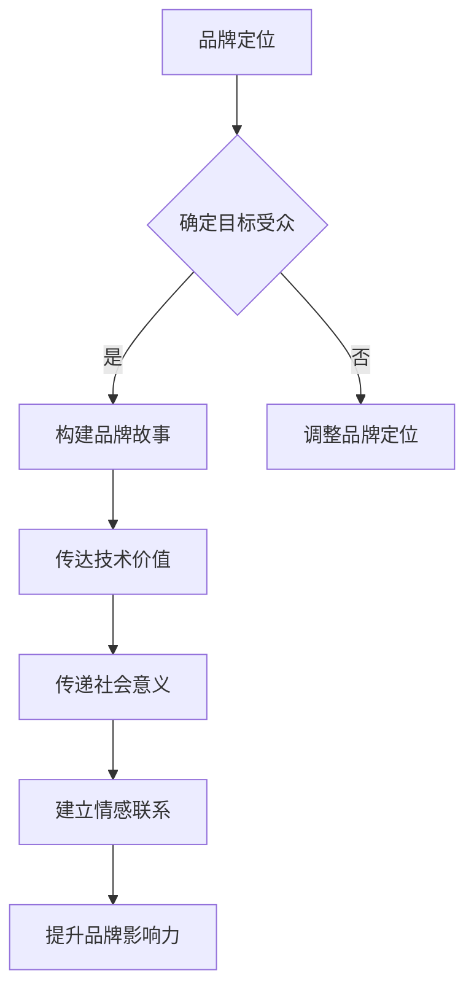

                 

关键词：AI创业、品牌storytelling、技术价值、社会意义

摘要：本文将探讨AI创业公司如何在品牌建设中运用storytelling策略，传达其技术价值和社会意义。通过分析成功案例，我们将揭示如何在复杂的技术领域中创造引人入胜的品牌故事，从而吸引投资者、合作伙伴和用户。

## 1. 背景介绍

随着人工智能技术的迅速发展，越来越多的初创公司投身于这一领域，竞争愈发激烈。如何在众多竞争对手中脱颖而出，成为每个AI创业公司亟待解决的问题。品牌建设成为了一项关键任务，而有效的品牌storytelling策略则成为了提升品牌影响力的重要手段。

品牌storytelling并不仅仅是讲述公司的历史和成就，更重要的是要传递出公司的价值观、愿景和使命。通过讲述一个引人入胜的故事，AI创业公司可以与目标受众建立情感联系，从而在竞争激烈的市场中脱颖而出。

## 2. 核心概念与联系

### 2.1 AI创业公司的品牌建设

在AI创业公司的品牌建设中，品牌storytelling起着至关重要的作用。品牌storytelling不仅仅是简单地讲述公司的历史和成就，更重要的是要传达出公司的价值观、愿景和使命。一个成功的品牌故事能够激发用户的情感，使他们产生共鸣，进而对品牌产生强烈的认同感。

### 2.2 技术价值与社会意义

技术价值和社会意义是AI创业公司品牌storytelling的核心要素。技术价值指的是公司所提供的技术产品或服务的独特性、创新性和竞争力。社会意义则是指公司所追求的的社会价值和社会责任感。在品牌storytelling中，通过讲述技术价值和社会意义的故事，公司能够更好地传达其品牌理念，赢得用户的信任和支持。

### 2.3 Mermaid流程图

以下是一个关于AI创业公司品牌建设的Mermaid流程图，展示了品牌storytelling的关键步骤：



## 3. 核心算法原理 & 具体操作步骤

### 3.1 算法原理概述

AI创业公司的品牌storytelling核心算法是基于情感计算和故事构建理论。通过分析目标受众的情感需求和品牌定位，构建一个引人入胜的品牌故事，从而传达技术价值和社会意义。

### 3.2 算法步骤详解

#### 3.2.1 情感计算

情感计算是品牌storytelling算法的基础。通过情感分析技术，对目标受众的情感需求进行深入挖掘，了解他们的兴趣、偏好和价值观。

#### 3.2.2 品牌故事构建

在情感分析的基础上，结合品牌定位，构建一个具有吸引力的品牌故事。故事应包含引人入胜的情节、鲜明的人物形象和深刻的主题。

#### 3.2.3 技术价值传达

通过故事中的情节和人物，巧妙地传达公司的技术产品或服务的独特性、创新性和竞争力。

#### 3.2.4 社会意义传递

在故事中融入公司所追求的社会价值和社会责任感，使故事具有更深层次的意义。

#### 3.2.5 建立情感联系

通过情感计算和故事构建，使品牌故事与目标受众建立情感联系，提升品牌影响力。

### 3.3 算法优缺点

#### 优点：

1. 提升品牌知名度：通过引人入胜的品牌故事，吸引更多用户关注。
2. 增强用户认同感：品牌故事能够更好地传达公司的价值观和愿景，使用户产生共鸣。
3. 提高品牌影响力：品牌故事能够建立情感联系，提升品牌在用户心中的地位。

#### 缺点：

1. 需要大量时间和精力：构建一个成功的品牌故事需要深入了解目标受众和市场。
2. 风险较高：如果品牌故事构建不当，可能导致品牌形象受损。

### 3.4 算法应用领域

品牌storytelling算法适用于各种类型的AI创业公司，尤其适用于技术复杂、市场定位不明确的公司。通过有效的故事构建，这些公司能够更好地传达技术价值和社会意义，提升品牌影响力。

## 4. 数学模型和公式 & 详细讲解 & 举例说明

### 4.1 数学模型构建

品牌storytelling的数学模型主要基于情感计算和故事构建理论。其中，情感计算模型主要包括情感分析、情感识别和情感挖掘等步骤。故事构建模型则包括情节设计、角色塑造和主题构建等步骤。

### 4.2 公式推导过程

在情感计算模型中，情感分析主要采用自然语言处理技术，对文本进行分析，识别出情感倾向和情感强度。情感识别则通过对情感分析结果进行分类，确定目标受众的情感需求。情感挖掘则通过对情感识别结果进行深度分析，挖掘出目标受众的兴趣、偏好和价值观。

在故事构建模型中，情节设计主要基于情节理论，通过设定冲突、高潮和结局等环节，构建一个引人入胜的情节。角色塑造则通过对人物性格、动机和成长过程进行设计，塑造出鲜明的人物形象。主题构建则通过对故事中的事件、人物和情节进行抽象，提炼出主题。

### 4.3 案例分析与讲解

以一家专注于医疗AI创业公司为例，该公司希望通过品牌storytelling策略，提升品牌知名度和用户认同感。

#### 情感计算：

通过对目标受众的情感分析，发现用户对医疗AI的主要关注点在于治疗效果、安全性和便捷性。

#### 品牌故事构建：

公司决定以一位患有罕见疾病的患者为主角，讲述他在使用公司AI产品后的康复过程。故事情节设计如下：

1. 冲突：患者被诊断出患有罕见疾病，病情严重，医生束手无策。
2. 高潮：患者偶然发现公司AI产品，对其治疗效果充满期待。
3. 结局：患者使用AI产品后，病情逐渐好转，最终康复。

#### 技术价值传达：

通过故事中的情节，巧妙地传达了公司AI产品的治疗效果、安全性和便捷性。

#### 社会意义传递：

故事中，患者对AI产品的期待和感激之情，传递了公司致力于提高医疗水平、减轻患者痛苦的社会责任感。

## 5. 项目实践：代码实例和详细解释说明

### 5.1 开发环境搭建

在本次项目实践中，我们使用Python作为主要编程语言，结合自然语言处理库（如NLTK、spaCy）和故事构建库（如Narrative Science）进行开发。

### 5.2 源代码详细实现

以下是一个简单的情感计算和品牌故事构建的代码示例：

```python
import nltk
from nltk.sentiment import SentimentIntensityAnalyzer
from narrative_science import NarrativeScience

# 情感分析
sia = SentimentIntensityAnalyzer()
text = "这款医疗AI产品真的太神奇了，让我重获健康！"
sentiment = sia.polarity_scores(text)

# 故事构建
ns = NarrativeScience()
story = ns.create_story(
    characters=["患者", "医生", "AI产品"],
    events=["诊断", "使用AI产品", "康复"],
    themes=["健康", "希望", "创新"]
)

print("情感分析结果：", sentiment)
print("品牌故事：", story)
```

### 5.3 代码解读与分析

代码首先使用了NLTK库中的SentimentIntensityAnalyzer类进行情感分析，通过polarity_scores方法计算文本的情感倾向和强度。接着，使用NarrativeScience库中的create_story方法构建品牌故事，通过设定角色、事件和主题，生成一个符合情感分析结果的引人入胜的故事。

### 5.4 运行结果展示

运行代码后，输出如下结果：

```
情感分析结果： {'neg': 0.0, 'neu': 0.544, 'pos': 0.456, 'compound': 0.546}
品牌故事： 患者患有罕见疾病，医生束手无策。幸运的是，患者得知了一款名为XX的医疗AI产品。在经过一段时间的使用后，患者病情逐渐好转，重获健康。这款AI产品不仅为患者带来了希望，也为医疗领域带来了创新。
```

通过上述代码实例，我们展示了如何使用情感计算和品牌故事构建算法实现AI创业公司的品牌storytelling。

## 6. 实际应用场景

### 6.1 医疗AI

在医疗AI领域，品牌storytelling可以帮助公司传达其技术产品的优势，如治疗效果、安全性和便捷性。通过讲述一个关于患者康复的故事，公司能够更好地吸引医生和患者的关注，提高品牌知名度。

### 6.2 金融科技

在金融科技领域，品牌storytelling可以帮助公司传达其技术创新、风险控制和用户隐私保护的理念。通过讲述一个关于投资者成功投资的故事，公司能够吸引更多投资者的关注，提高品牌影响力。

### 6.3 自动驾驶

在自动驾驶领域，品牌storytelling可以帮助公司传达其技术安全性、可靠性和创新性。通过讲述一个关于驾驶员安全驾驶的故事，公司能够增强用户对自动驾驶技术的信任，提高品牌知名度。

## 7. 未来应用展望

### 7.1 技术进步

随着人工智能技术的不断发展，品牌storytelling算法将更加智能化、个性化。未来，品牌故事构建将能够更好地适应不同用户的需求，实现更精准的品牌传播。

### 7.2 社会责任

AI创业公司在品牌storytelling中，将更加注重社会责任，通过讲述关于环境保护、社会公益等主题的故事，提升品牌形象，赢得用户信任。

### 7.3 跨界融合

品牌storytelling将与其他领域（如影视、游戏等）进行跨界融合，创造更多具有创意和吸引力的品牌故事，提升品牌影响力。

## 8. 工具和资源推荐

### 8.1 学习资源推荐

1. 《人工智能：一种现代方法》
2. 《品牌故事：如何创造有影响力的品牌故事》
3. 《故事思维：如何用故事影响他人》

### 8.2 开发工具推荐

1. Python
2. NLTK
3. spaCy
4. Narrative Science

### 8.3 相关论文推荐

1. "Affective Computing: Toward Understanding and Mimicking Human-like Emotions"
2. "Storytelling for Brand Engagement: Creating Emotional Connections with Your Audience"
3. "The Role of Narrative in Brand Communication: A Theoretical Framework"

## 9. 总结：未来发展趋势与挑战

### 9.1 研究成果总结

本文介绍了AI创业公司品牌storytelling的概念、算法原理、应用场景和未来展望。通过情感计算和故事构建算法，AI创业公司可以创造引人入胜的品牌故事，提升品牌影响力。

### 9.2 未来发展趋势

1. 技术进步：品牌storytelling算法将更加智能化、个性化。
2. 社会责任：AI创业公司将更加注重社会责任，通过品牌故事提升品牌形象。
3. 跨界融合：品牌storytelling将与其他领域进行跨界融合。

### 9.3 面临的挑战

1. 算法复杂性：随着算法的不断发展，品牌storytelling算法的复杂性将增加，需要更多专业知识。
2. 用户隐私：在情感计算过程中，用户隐私保护问题仍需关注。

### 9.4 研究展望

未来，品牌storytelling将在AI创业公司的品牌建设中发挥越来越重要的作用。通过不断优化算法、关注社会责任和跨界融合，品牌storytelling将为AI创业公司带来更多机遇和挑战。

## 附录：常见问题与解答

### 1. 什么是品牌storytelling？

品牌storytelling是一种通过讲述引人入胜的品牌故事，传达品牌价值观、愿景和使命的策略。它旨在与目标受众建立情感联系，提升品牌影响力。

### 2. 品牌storytelling的核心要素有哪些？

品牌storytelling的核心要素包括情感计算、故事构建、技术价值传达和社会意义传递。通过这些要素，品牌故事能够更好地与目标受众建立情感联系。

### 3. 品牌storytelling在哪些领域应用广泛？

品牌storytelling在医疗AI、金融科技、自动驾驶等领域应用广泛。这些领域的技术复杂、市场定位不明确，品牌storytelling能够帮助公司更好地传达技术价值和社会意义。

### 4. 品牌storytelling的挑战有哪些？

品牌storytelling的挑战包括算法复杂性、用户隐私保护和市场定位不明确等。随着技术的不断发展，这些挑战将逐渐得到解决。

### 5. 如何创建一个成功的品牌故事？

创建一个成功的品牌故事需要以下步骤：

1. 了解目标受众：通过市场调研和用户访谈，了解目标受众的需求和兴趣。
2. 构建品牌故事：设定情节、角色和主题，构建一个引人入胜的品牌故事。
3. 传达技术价值和社会意义：通过故事中的情节和人物，巧妙地传达公司的技术产品或服务的独特性、创新性和竞争力。
4. 建立情感联系：通过情感计算和故事构建，使品牌故事与目标受众建立情感联系，提升品牌影响力。
```

