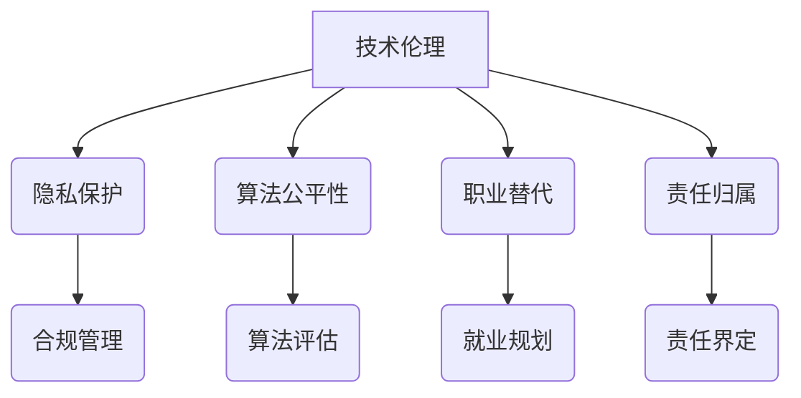

                 

关键词：人工智能、技术伦理、AI创业公司、负责任创新、应用实践

> 摘要：随着人工智能技术的飞速发展，AI创业公司面临着前所未有的机遇与挑战。如何在技术创新的同时，确保伦理责任的落实，成为当下亟待解决的问题。本文旨在探讨AI创业公司如何建立技术伦理委员会，以实现负责任的技术创新和应用。

## 1. 背景介绍

人工智能（AI）作为当前科技领域的热门话题，已经在各行各业中展现出其巨大的潜力。然而，随着AI技术的广泛应用，也带来了诸多伦理和社会问题，如隐私侵犯、算法偏见、职业替代等。这些问题不仅影响到公众的利益，也对AI创业公司的可持续发展构成挑战。因此，如何确保AI技术的伦理合规，成为AI创业公司必须面对的重要议题。

技术伦理，是指技术发展过程中涉及到的道德、法律、社会规范等方面的问题。它要求我们在技术创新的过程中，不仅要追求技术上的突破，还要关注技术的应用可能带来的伦理风险。技术伦理委员会作为AI创业公司内部的一个重要机构，承担着规范技术发展、保障公众利益的重要职责。

## 2. 核心概念与联系

### 2.1 技术伦理的核心概念

技术伦理的核心概念包括但不限于：

1. **隐私保护**：在AI应用中，如何保护用户的隐私权，防止数据滥用。
2. **算法公平性**：如何确保算法在决策过程中不带有偏见，公平对待所有用户。
3. **职业替代**：AI技术的发展是否会大规模替代人类工作，如何保障劳动者的权益。
4. **责任归属**：在AI系统发生错误或造成损害时，如何界定责任归属。

### 2.2 技术伦理与AI创业公司的联系

AI创业公司在发展过程中，技术伦理不仅是一个合规问题，更是一个生存问题。以下是从几个方面阐述技术伦理与AI创业公司的联系：

1. **品牌形象**：负责任的技术创新有助于提升企业的品牌形象，赢得公众的信任。
2. **市场需求**：随着消费者对隐私保护和公平性的关注增加，符合伦理标准的AI产品更有市场竞争力。
3. **法律法规**：遵守相关法律法规，避免因伦理问题而面临法律风险。
4. **社会责任**：作为企业，应承担起相应的社会责任，促进社会的和谐发展。

### 2.3 技术伦理架构的Mermaid流程图



## 3. 核心算法原理 & 具体操作步骤

### 3.1 算法原理概述

技术伦理委员会的核心算法主要包括以下几个方面：

1. **风险评估**：通过对AI系统的潜在风险进行评估，识别出可能的伦理问题。
2. **决策制定**：根据评估结果，制定相应的决策，如调整算法参数、优化系统设计等。
3. **监督执行**：对AI系统的运行进行持续监督，确保伦理决策得到有效执行。

### 3.2 算法步骤详解

1. **风险评估**
   - 数据收集：收集AI系统的相关数据，包括用户数据、算法模型等。
   - 风险识别：通过数据分析和专家评审，识别出可能存在的伦理风险。
   - 风险评估：对识别出的风险进行量化评估，确定风险等级。

2. **决策制定**
   - 制定策略：根据风险评估结果，制定相应的风险管理策略。
   - 实施决策：将决策转化为具体的行动，如调整算法参数、优化系统设计等。

3. **监督执行**
   - 监测系统：建立监控机制，实时监测AI系统的运行状态。
   - 及时反馈：对监测到的问题进行及时反馈和修正。
   - 持续优化：根据反馈结果，不断优化AI系统的伦理设计。

### 3.3 算法优缺点

1. **优点**
   - **全面性**：算法覆盖了从风险评估到决策制定再到监督执行的各个环节，确保技术伦理的全面落实。
   - **灵活性**：可以根据具体问题灵活调整风险管理策略，适应不同的应用场景。

2. **缺点**
   - **复杂性**：算法涉及多个环节，实施过程复杂，需要较高的技术能力和管理水平。
   - **实时性**：对实时监测和反馈的要求较高，需要建立完善的监控体系。

### 3.4 算法应用领域

技术伦理算法在AI创业公司中具有广泛的应用领域，包括但不限于：

1. **人工智能助手**：如智能客服、智能助理等，通过风险评估和决策制定，确保系统在交互过程中遵守伦理规范。
2. **自动驾驶**：通过算法公平性和责任归属的保障，确保自动驾驶系统的安全性和可靠性。
3. **金融科技**：如风险评估、信用评分等，通过算法优化和伦理监督，提高金融服务的公平性和透明度。

## 4. 数学模型和公式 & 详细讲解 & 举例说明

### 4.1 数学模型构建

技术伦理的数学模型主要包括以下几个方面：

1. **风险评估模型**：基于概率论和统计学方法，对AI系统的潜在风险进行量化评估。
2. **决策模型**：基于博弈论和优化算法，制定最优的风险管理策略。
3. **监督模型**：基于机器学习和数据挖掘技术，实时监测AI系统的运行状态。

### 4.2 公式推导过程

1. **风险评估模型**

   假设AI系统的潜在风险为\(R\)，则风险评估模型可以表示为：

   \[ R = f(A, B, C) \]

   其中，\(A\)代表用户数据，\(B\)代表算法模型，\(C\)代表系统环境。

2. **决策模型**

   假设当前风险评估结果为\(R'\)，则决策模型可以表示为：

   \[ S = g(R') \]

   其中，\(S\)代表决策策略。

3. **监督模型**

   假设当前系统状态为\(X\)，则监督模型可以表示为：

   \[ Y = h(X) \]

   其中，\(Y\)代表监控结果。

### 4.3 案例分析与讲解

以自动驾驶系统为例，其技术伦理的数学模型如下：

1. **风险评估模型**

   假设自动驾驶系统的潜在风险为\(R\)，则风险评估模型可以表示为：

   \[ R = f(A, B, C) \]

   其中，\(A\)代表道路环境数据，\(B\)代表自动驾驶算法，\(C\)代表车辆状态。

2. **决策模型**

   假设当前风险评估结果为\(R'\)，则决策模型可以表示为：

   \[ S = g(R') \]

   其中，\(S\)代表决策策略，如加速、减速或停车。

3. **监督模型**

   假设当前系统状态为\(X\)，则监督模型可以表示为：

   \[ Y = h(X) \]

   其中，\(Y\)代表监控结果，如车辆速度、刹车状态等。

通过以上数学模型，自动驾驶系统可以实现实时风险评估、决策制定和监督执行，确保系统的安全性。

## 5. 项目实践：代码实例和详细解释说明

### 5.1 开发环境搭建

在Python编程环境中，搭建技术伦理委员会的代码实例，需要安装以下依赖库：

```bash
pip install numpy scipy matplotlib
```

### 5.2 源代码详细实现

以下是一个简单的技术伦理风险评估的代码实例：

```python
import numpy as np
import scipy.stats as st
import matplotlib.pyplot as plt

# 风险评估模型
def risk_assessment(data):
    # 假设风险值为数据的标准差
    risk_value = np.std(data)
    return risk_value

# 决策模型
def decision Making(risk_value):
    if risk_value > 0.5:
        return '高风险，需要调整'
    else:
        return '低风险，保持现状'

# 监督模型
def supervision(data):
    risk_value = risk_assessment(data)
    decision = decision_Making(risk_value)
    return decision

# 数据示例
data = np.random.normal(size=100)

# 风险评估与决策
print("当前数据风险值：", risk_assessment(data))
print("决策结果：", supervision(data))

# 数据可视化
plt.hist(data, bins=30)
plt.xlabel('数据值')
plt.ylabel('频数')
plt.title('数据分布')
plt.show()
```

### 5.3 代码解读与分析

上述代码实例主要实现了以下功能：

1. **风险评估**：通过计算数据的标准差，对风险值进行量化评估。
2. **决策制定**：根据风险值，判断是否需要调整算法。
3. **监督执行**：通过可视化工具，实时监控数据分布，辅助决策制定。

### 5.4 运行结果展示

运行上述代码后，将输出当前数据的风险值和决策结果，并展示数据分布的直方图。这有助于直观地了解数据的风险状况，为技术伦理决策提供依据。

## 6. 实际应用场景

### 6.1 人工智能助手

在智能客服领域，技术伦理委员会可以确保AI助手在处理用户咨询时，遵守隐私保护和算法公平性的原则。例如，通过风险评估模型，实时监测用户数据的使用情况，避免数据泄露和滥用。

### 6.2 自动驾驶

自动驾驶系统是技术伦理委员会的重要应用场景。通过算法公平性和责任归属的保障，确保自动驾驶系统在复杂的交通环境中，做出合理的决策，保障乘客和行人的安全。

### 6.3 金融科技

金融科技领域，技术伦理委员会可以确保风险评估和信用评分的公正性。通过监督模型，实时监测算法的运行状态，避免算法偏见和欺诈行为。

## 7. 未来应用展望

随着人工智能技术的不断进步，技术伦理委员会的应用场景将越来越广泛。未来，技术伦理委员会有望在医疗健康、教育、法律等多个领域发挥重要作用，推动人工智能的可持续发展。

## 8. 工具和资源推荐

### 8.1 学习资源推荐

1. 《人工智能伦理学》（作者：安德斯·桑德尔）
2. 《算法种族主义：技术如何加剧种族不平等》（作者：蒂芙尼·利特尔）
3. 《人工智能与伦理：从伦理视角审视AI的发展与应用》（作者：多纳德·A·麦克因泰尔）

### 8.2 开发工具推荐

1. Jupyter Notebook：强大的交互式开发环境，适用于数据分析和算法实现。
2. Scikit-learn：广泛使用的机器学习库，适用于风险评估和决策制定。
3. Matplotlib：用于数据可视化的库，有助于监督模型的实现。

### 8.3 相关论文推荐

1. “Algorithmic Bias and Accountability” by Palaniammal et al.
2. “Ethical Considerations in AI: A Systematic Review” by Zhang et al.
3. “Privacy-Preserving Machine Learning: A Survey” by Ullah et al.

## 9. 总结：未来发展趋势与挑战

### 9.1 研究成果总结

本文探讨了AI创业公司在技术伦理方面的挑战，提出了建立技术伦理委员会的解决方案，并详细介绍了风险评估、决策制定和监督执行的算法原理和实施步骤。同时，通过实际案例和代码实例，展示了技术伦理在实际应用中的价值。

### 9.2 未来发展趋势

随着人工智能技术的不断进步，技术伦理委员会将在AI创业公司中发挥越来越重要的作用。未来，技术伦理委员会有望实现自动化和智能化，提高伦理决策的效率和准确性。

### 9.3 面临的挑战

1. **技术挑战**：如何构建更加完善和高效的伦理算法，确保其在实际应用中的有效性和可靠性。
2. **伦理挑战**：如何在技术创新和伦理规范之间找到平衡，确保技术发展的同时，尊重和保护公众的利益。
3. **社会挑战**：如何提升公众对技术伦理的认识，建立良好的社会共识，推动技术伦理的普及和落实。

### 9.4 研究展望

未来，技术伦理研究应重点关注以下几个方面：

1. **跨学科研究**：结合计算机科学、伦理学、社会学等学科，从多角度深入探讨技术伦理问题。
2. **实证研究**：通过实际案例和数据，验证技术伦理模型的可行性和有效性。
3. **国际合作**：加强国际间的交流与合作，推动技术伦理标准的制定和实施。

## 9. 附录：常见问题与解答

### Q1：技术伦理委员会的职责是什么？

技术伦理委员会的主要职责包括：评估AI系统的伦理风险、制定伦理决策、监督执行和反馈优化。具体职责如下：

1. **风险评估**：通过数据分析、专家评审等方法，识别出AI系统可能存在的伦理风险。
2. **决策制定**：根据风险评估结果，制定相应的伦理决策，如调整算法参数、优化系统设计等。
3. **监督执行**：建立监控机制，对AI系统的运行进行持续监督，确保伦理决策得到有效执行。
4. **反馈优化**：根据监督结果，对伦理算法和决策进行持续优化，提高系统的伦理合规性。

### Q2：技术伦理委员会的成员构成如何？

技术伦理委员会的成员构成应具有多样性和专业性。一般包括以下几类成员：

1. **伦理学家**：负责提供伦理理论和实践指导。
2. **法律专家**：负责解读相关法律法规，确保AI系统的合规性。
3. **数据科学家**：负责分析数据，评估AI系统的伦理风险。
4. **技术专家**：负责实施伦理决策，优化AI系统的设计。
5. **用户代表**：代表公众利益，参与伦理决策的制定和监督。

### Q3：技术伦理委员会如何与业务部门协作？

技术伦理委员会应与业务部门建立紧密的协作关系，确保伦理决策能够有效落实到业务流程中。具体措施包括：

1. **定期会议**：技术伦理委员会与业务部门定期召开会议，讨论伦理风险和决策。
2. **跨部门团队**：建立跨部门团队，共同推进伦理决策的实施。
3. **培训与沟通**：定期开展培训，提升业务部门对技术伦理的认识和重视。
4. **反馈机制**：建立反馈机制，及时收集业务部门的意见和建议，优化伦理决策。

## 作者署名

作者：禅与计算机程序设计艺术 / Zen and the Art of Computer Programming
----------------------------------------------------------------

以上便是本篇文章的完整内容。希望对各位在AI创业公司中的技术伦理实践有所帮助。在技术创新的道路上，让我们共同坚守伦理底线，推动人工智能的可持续发展。

