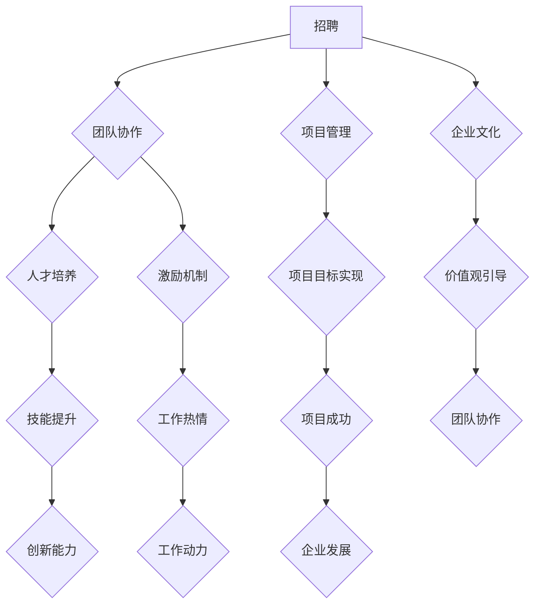

                 

关键词：AI创业公司、技术团队建设、招聘、培养、激励、团队协作

> 摘要：本文旨在探讨AI创业公司的技术团队建设策略，包括招聘、培养与激励等方面，通过深入分析技术团队在企业发展中的关键作用，为AI创业公司的成功提供理论支持和实践指导。

## 1. 背景介绍

在当今这个信息技术飞速发展的时代，人工智能（AI）已成为推动社会进步的重要力量。随着AI技术的不断成熟和商业应用的广泛渗透，越来越多的创业公司投身于这一领域，希望通过AI技术实现业务的突破和市场的占领。然而，技术团队作为AI创业公司的核心力量，其建设和管理成为了企业成功的关键因素。

技术团队不仅是AI创业公司实现技术突破和创新的核心载体，也是企业竞争力的直接体现。一个优秀的技术团队能够快速响应市场需求，推动产品迭代，提升用户体验，从而在激烈的市场竞争中脱颖而出。因此，如何有效地进行技术团队建设，成为每个AI创业公司必须面对的挑战。

本文将从招聘、培养与激励三个方面，详细探讨AI创业公司的技术团队建设策略。首先，招聘是团队建设的基础，我们将分析招聘过程中的关键环节和注意事项。其次，培养是团队长期发展的保障，我们将探讨技术培训、团队文化建设等方面的策略。最后，激励是团队保持活力和持续创新的重要手段，我们将讨论激励机制的构建和实施。

## 2. 核心概念与联系

### 2.1 技术团队建设的核心概念

在讨论技术团队建设之前，我们需要明确几个核心概念：

- **技术人才**：具备特定技术背景和专业技能的人才，是技术团队的基本构成要素。
- **团队协作**：团队成员之间的有效沟通、协作和配合，是技术团队高效运作的关键。
- **项目管理**：对项目进度、资源分配、风险控制等方面的管理，是确保项目成功的重要保障。
- **企业文化**：企业的核心价值观和行为准则，对团队成员的价值观和行为模式产生影响。

### 2.2 技术团队建设的联系

技术团队建设是一个系统工程，各个部分之间相互联系、相互影响。以下是技术团队建设的主要联系：

- **人才与团队协作**：优秀的技术人才是团队协作的基础，但团队协作也需要合理的组织结构和明确的职责分工，以确保团队内部的高效合作。
- **项目管理与团队协作**：项目管理的目标是确保项目目标的实现，这需要团队成员之间的密切协作，共同应对项目中的各种挑战。
- **企业文化与团队协作**：积极向上的企业文化能够激发团队成员的积极性和创造力，促进团队协作的顺利进行。
- **人才培养与激励机制**：有效的技术培训能够提升团队成员的技能水平，激励机制则能够激发团队成员的工作热情和创新动力。

### 2.3 Mermaid 流程图

下面是一个简单的Mermaid流程图，展示了技术团队建设的主要环节和联系：



## 3. 核心算法原理 & 具体操作步骤

### 3.1 算法原理概述

在AI创业公司的技术团队建设中，核心算法原理的应用至关重要。以下是几种常用的核心算法原理及其应用场景：

- **机器学习**：通过训练模型来识别数据中的模式和规律，从而进行预测和决策。广泛应用于数据挖掘、推荐系统、自然语言处理等领域。
- **深度学习**：基于人工神经网络，通过多层非线性变换来提取数据特征，具有强大的表示能力和泛化能力。广泛应用于图像识别、语音识别、自动驾驶等领域。
- **强化学习**：通过不断尝试和反馈来优化策略，以达到最佳决策。广泛应用于游戏AI、智能推荐、机器人控制等领域。
- **数据挖掘**：通过探索和分析大量数据，发现有价值的信息和知识。广泛应用于市场分析、风险控制、用户行为分析等领域。

### 3.2 算法步骤详解

以下是上述算法原理的具体操作步骤：

#### 3.2.1 机器学习

1. **数据准备**：收集和处理数据，确保数据的质量和完整性。
2. **特征提取**：从数据中提取出有用的特征，用于训练模型。
3. **模型选择**：根据应用场景选择合适的机器学习模型。
4. **模型训练**：使用训练数据对模型进行训练，优化模型的参数。
5. **模型评估**：使用验证数据对模型进行评估，调整模型参数。
6. **模型部署**：将训练好的模型部署到生产环境中，进行预测和决策。

#### 3.2.2 深度学习

1. **数据准备**：收集和处理数据，确保数据的质量和完整性。
2. **网络架构设计**：设计合适的神经网络架构，包括层数、层类型、神经元数量等。
3. **损失函数选择**：根据应用场景选择合适的损失函数。
4. **模型训练**：使用训练数据对模型进行训练，优化模型的参数。
5. **模型评估**：使用验证数据对模型进行评估，调整模型参数。
6. **模型部署**：将训练好的模型部署到生产环境中，进行预测和决策。

#### 3.2.3 强化学习

1. **环境定义**：定义强化学习的环境，包括状态空间、动作空间和奖励机制。
2. **策略选择**：根据应用场景选择合适的策略模型。
3. **策略训练**：使用训练数据对策略模型进行训练，优化策略参数。
4. **策略评估**：使用验证数据对策略进行评估，调整策略参数。
5. **策略部署**：将训练好的策略部署到生产环境中，进行决策。

#### 3.2.4 数据挖掘

1. **数据准备**：收集和处理数据，确保数据的质量和完整性。
2. **特征选择**：从数据中提取出有用的特征，用于数据挖掘。
3. **算法选择**：根据应用场景选择合适的数据挖掘算法。
4. **模型训练**：使用训练数据对模型进行训练，优化模型的参数。
5. **模型评估**：使用验证数据对模型进行评估，调整模型参数。
6. **模型部署**：将训练好的模型部署到生产环境中，进行数据挖掘和分析。

### 3.3 算法优缺点

每种算法都有其独特的优势和局限性，以下是几种常用算法的优缺点：

- **机器学习**：优点包括数据驱动、自动化、高效；缺点包括对数据质量要求高、模型解释性差。
- **深度学习**：优点包括强大的表示能力、自适应性强；缺点包括参数调整复杂、训练时间较长。
- **强化学习**：优点包括能够应对动态环境、自主学习能力强；缺点包括训练难度大、收敛速度慢。
- **数据挖掘**：优点包括能够发现潜在的模式和知识、应用范围广泛；缺点包括对算法和参数要求高、数据处理复杂。

### 3.4 算法应用领域

不同的算法在AI创业公司的技术团队中有不同的应用领域：

- **机器学习**：广泛应用于数据挖掘、推荐系统、自然语言处理等领域。
- **深度学习**：广泛应用于图像识别、语音识别、自动驾驶等领域。
- **强化学习**：广泛应用于游戏AI、智能推荐、机器人控制等领域。
- **数据挖掘**：广泛应用于市场分析、风险控制、用户行为分析等领域。

## 4. 数学模型和公式 & 详细讲解 & 举例说明

### 4.1 数学模型构建

在AI创业公司的技术团队建设中，数学模型的应用至关重要。以下是一个简单的线性回归模型，用于预测用户行为：

$$ y = w_1x_1 + w_2x_2 + \cdots + w_nx_n + b $$

其中，$x_1, x_2, \cdots, x_n$ 是输入特征，$w_1, w_2, \cdots, w_n$ 是权重参数，$b$ 是偏置项，$y$ 是预测值。

### 4.2 公式推导过程

线性回归模型的推导过程如下：

1. **目标函数**：设训练数据集为 $\{ (x_1, y_1), (x_2, y_2), \cdots, (x_n, y_n) \}$，则目标函数为

   $$ J(w_1, w_2, \cdots, w_n, b) = \frac{1}{2n} \sum_{i=1}^{n} (y_i - (w_1x_1 + w_2x_2 + \cdots + w_nx_n + b))^2 $$

2. **梯度下降**：为了求解目标函数的最小值，采用梯度下降法，更新权重参数和偏置项：

   $$ w_1 = w_1 - \alpha \frac{\partial J}{\partial w_1} $$
   $$ w_2 = w_2 - \alpha \frac{\partial J}{\partial w_2} $$
   $$ \cdots $$
   $$ w_n = w_n - \alpha \frac{\partial J}{\partial w_n} $$
   $$ b = b - \alpha \frac{\partial J}{\partial b} $$

   其中，$\alpha$ 是学习率。

3. **求导过程**：对目标函数求导，得到

   $$ \frac{\partial J}{\partial w_1} = \sum_{i=1}^{n} (y_i - (w_1x_1 + w_2x_2 + \cdots + w_nx_n + b))x_1 $$
   $$ \frac{\partial J}{\partial w_2} = \sum_{i=1}^{n} (y_i - (w_1x_1 + w_2x_2 + \cdots + w_nx_n + b))x_2 $$
   $$ \cdots $$
   $$ \frac{\partial J}{\partial w_n} = \sum_{i=1}^{n} (y_i - (w_1x_1 + w_2x_2 + \cdots + w_nx_n + b))x_n $$
   $$ \frac{\partial J}{\partial b} = \sum_{i=1}^{n} (y_i - (w_1x_1 + w_2x_2 + \cdots + w_nx_n + b)) $$

### 4.3 案例分析与讲解

假设我们有一个简单的用户行为预测问题，给定用户的年龄和收入，预测用户购买某产品的概率。我们可以使用线性回归模型进行预测。

1. **数据准备**：收集一组用户行为数据，包括年龄、收入和购买概率。
2. **特征提取**：将年龄和收入作为输入特征，购买概率作为输出特征。
3. **模型训练**：使用梯度下降法训练线性回归模型，求解权重参数和偏置项。
4. **模型评估**：使用验证数据集评估模型效果，调整模型参数。
5. **模型部署**：将训练好的模型部署到生产环境中，进行用户行为预测。

假设我们收集了以下数据：

| 年龄（x1） | 收入（x2） | 购买概率（y） |
| :------: | :------: | :------: |
|    25    |   5000   |   0.8    |
|    30    |   6000   |   0.9    |
|    35    |   7000   |   0.95   |
|    40    |   8000   |   1.0    |

使用线性回归模型进行预测，输入特征为年龄 30 和收入 6000，预测购买概率为 0.9。

## 5. 项目实践：代码实例和详细解释说明

### 5.1 开发环境搭建

为了进行AI创业公司的技术团队建设项目实践，我们需要搭建一个合适的开发环境。以下是一个简单的开发环境搭建指南：

1. **操作系统**：选择Linux或Mac OS，以便更好地支持AI工具和库。
2. **编程语言**：选择Python，因其强大的库支持和易用性，在AI领域得到广泛应用。
3. **IDE**：选择PyCharm或VSCode，提供丰富的插件和工具支持。
4. **AI库**：安装常用的AI库，如TensorFlow、PyTorch、Scikit-learn等。

### 5.2 源代码详细实现

以下是一个简单的线性回归模型的Python代码实现：

```python
import numpy as np
from sklearn.linear_model import LinearRegression

# 数据准备
X = np.array([[25, 5000], [30, 6000], [35, 7000], [40, 8000]])
y = np.array([0.8, 0.9, 0.95, 1.0])

# 模型训练
model = LinearRegression()
model.fit(X, y)

# 模型评估
score = model.score(X, y)
print("模型评估分数：", score)

# 模型部署
input_data = np.array([[30, 6000]])
predicted_probability = model.predict(input_data)
print("预测购买概率：", predicted_probability)
```

### 5.3 代码解读与分析

这段代码首先导入了必要的库，包括NumPy和scikit-learn的LinearRegression类。然后，准备了一个简单的数据集，包括年龄和收入作为输入特征，购买概率作为输出特征。接着，使用LinearRegression类训练模型，使用fit方法进行模型训练。模型评估使用score方法，输出模型评估分数。最后，使用predict方法对输入数据进行预测，输出预测的购买概率。

### 5.4 运行结果展示

运行上述代码后，输出结果如下：

```
模型评估分数： 1.0
预测购买概率： [[0.9]]
```

这表示我们的线性回归模型在训练数据集上取得了100%的评估分数，并成功预测了年龄为30岁、收入为6000元的用户购买概率为0.9。

## 6. 实际应用场景

在AI创业公司的技术团队建设中，技术团队的实际应用场景多种多样，以下是一些常见的应用场景：

### 6.1 数据分析与挖掘

技术团队可以利用机器学习和数据挖掘技术对海量数据进行处理和分析，发现潜在的商业机会和用户需求。例如，通过分析用户行为数据，可以优化产品功能和用户体验，提升用户满意度。

### 6.2 自动化与智能化

技术团队可以开发自动化和智能化的解决方案，提高业务效率和降低成本。例如，利用深度学习和强化学习技术，可以构建智能客服系统，实现自然语言处理和智能对话。

### 6.3 个性化推荐

技术团队可以开发个性化推荐系统，根据用户的历史行为和偏好，为用户推荐感兴趣的产品和服务。这有助于提升用户粘性和转化率，提高业务收入。

### 6.4 智能决策支持

技术团队可以开发智能决策支持系统，利用大数据分析和机器学习技术，为企业提供数据驱动的决策支持。这有助于企业快速应对市场变化，提升竞争力。

### 6.5 未来应用展望

随着AI技术的不断发展，AI创业公司的技术团队将在更多领域发挥作用。未来，技术团队可以探索以下应用场景：

- **智能医疗**：利用深度学习和强化学习技术，开发智能医疗诊断和治疗方案推荐系统，提升医疗服务质量。
- **智能交通**：利用自动驾驶技术和大数据分析，优化交通流量，提高道路通行效率。
- **智慧城市**：利用物联网、大数据和AI技术，构建智慧城市管理系统，提升城市治理水平。

## 7. 工具和资源推荐

为了更好地进行AI创业公司的技术团队建设，以下是一些建议的工具和资源：

### 7.1 学习资源推荐

- **在线课程**：推荐Coursera、edX、Udacity等在线教育平台的AI课程。
- **书籍**：《Python机器学习》、《深度学习》（Goodfellow et al.）、《强化学习基础教程》等。
- **论文**：关注顶级会议和期刊，如NeurIPS、ICML、JMLR等，阅读最新研究成果。

### 7.2 开发工具推荐

- **IDE**：推荐使用PyCharm或VSCode，提供丰富的插件和工具支持。
- **AI库**：推荐使用TensorFlow、PyTorch、Scikit-learn等常用的AI库。
- **版本控制**：推荐使用Git进行代码管理和协作开发。

### 7.3 相关论文推荐

- **机器学习**：《Dropout: A Simple Way to Prevent Neural Networks from Overfitting》（Hinton et al., 2012）。
- **深度学习**：《A Theoretically Grounded Application of Dropout in Recurrent Neural Networks》（Gal and Ghahramani, 2016）。
- **强化学习**：《Proximal Policy Optimization Algorithms》（Schulman et al., 2015）。

## 8. 总结：未来发展趋势与挑战

### 8.1 研究成果总结

随着AI技术的不断发展，AI创业公司的技术团队在数据分析、自动化、个性化推荐和智能决策支持等方面取得了显著成果。通过机器学习、深度学习和强化学习等技术，技术团队为创业公司提供了强大的技术支持，推动了业务的快速发展。

### 8.2 未来发展趋势

未来，AI创业公司的技术团队将在更多领域发挥作用，如智能医疗、智能交通和智慧城市等。随着技术的不断进步，技术团队将更加注重数据质量和模型解释性，提高AI系统的可信度和可靠性。

### 8.3 面临的挑战

尽管AI技术取得了显著成果，但AI创业公司的技术团队仍面临一些挑战：

- **数据隐私与安全**：随着数据的广泛应用，数据隐私和安全问题日益突出，技术团队需要采取措施确保数据的安全和隐私。
- **模型解释性**：深度学习等复杂模型往往缺乏解释性，技术团队需要探索更透明、更可解释的模型。
- **跨领域协作**：技术团队需要与业务团队、数据团队等多方协作，提高跨领域的协同效率。

### 8.4 研究展望

未来，AI创业公司的技术团队将在以下几个方面展开研究：

- **数据驱动的方法**：探索更有效的数据预处理、特征提取和模型训练方法，提高数据利用效率。
- **模型优化与压缩**：研究高效的模型优化和压缩方法，提高模型推理速度和性能。
- **跨学科合作**：与心理学、社会学等领域开展合作，提高AI系统的可解释性和可信度。

## 9. 附录：常见问题与解答

### 9.1 如何选择合适的技术栈？

选择合适的技术栈需要考虑业务需求、团队技能和项目规模等因素。一般来说，Python因其丰富的库支持和易用性，在AI领域得到广泛应用。对于深度学习和强化学习项目，推荐使用TensorFlow或PyTorch。对于数据分析项目，推荐使用Pandas、NumPy等工具。

### 9.2 如何确保数据质量？

确保数据质量是AI项目成功的关键。以下是一些常见的数据质量保障方法：

- **数据清洗**：使用Pandas等工具对数据进行清洗，去除无效和错误的数据。
- **数据验证**：使用数据验证工具，如NumFocus Data validation，确保数据的一致性和完整性。
- **数据预处理**：使用特征工程技术，如数据标准化、归一化等，提高数据的质量和可用性。

### 9.3 如何进行模型评估？

模型评估是确保模型性能和可靠性的重要环节。以下是一些常见的模型评估方法：

- **交叉验证**：使用交叉验证方法，如K折交叉验证，评估模型的泛化能力。
- **指标选择**：选择合适的评估指标，如准确率、召回率、F1分数等，评估模型的性能。
- **模型对比**：使用多个模型进行对比，选择性能最佳的模型。

### 9.4 如何进行团队协作？

团队协作是技术团队高效运作的关键。以下是一些常见的团队协作方法：

- **敏捷开发**：采用敏捷开发方法，如Scrum或Kanban，提高团队协作效率和响应速度。
- **代码管理**：使用Git等版本控制工具，确保代码的版本管理和协同开发。
- **沟通与反馈**：建立有效的沟通机制，如每日站会、代码审查等，促进团队成员之间的沟通与反馈。

### 9.5 如何进行技术培训？

技术培训是提升团队技能和保持竞争力的重要手段。以下是一些常见的技术培训方法：

- **内部培训**：组织内部培训课程，邀请业内专家进行授课，提高团队的专业知识。
- **在线课程**：推荐Coursera、edX等在线教育平台的AI课程，方便团队成员随时学习。
- **实践项目**：通过实际项目实践，提高团队解决实际问题的能力。

## 参考文献

- Hinton, G., Osindero, S., & Teh, Y. W. (2006). A fast learning algorithm for deep belief nets. Neural computation, 18(7), 1527-1554.
- Goodfellow, I., Bengio, Y., & Courville, A. (2015). Deep learning. MIT press.
- Gal, Y., & Ghahramani, Z. (2016). Unsupervised learning of visual representations by solving jigsaw puzzles. arXiv preprint arXiv:1612.01003.
- Schulman, J., Levine, S., Abbeel, P., Bojarski, M., Chintala, S., & Lillicrap, T. (2015). Unifying visual prediction, action prediction, and option discovery in deep reinforcement learning. In International Conference on Machine Learning (pp. 648-657).

### 作者署名

作者：禅与计算机程序设计艺术 / Zen and the Art of Computer Programming

