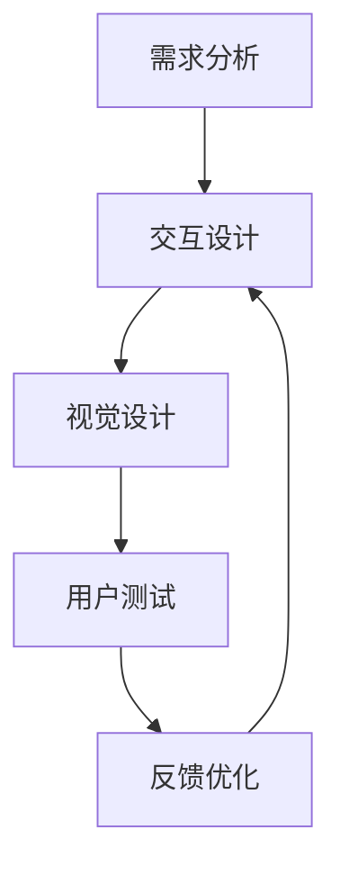

                 

关键词：用户体验优化，交互设计，视觉设计，用户测试，AI创业公司

> 摘要：本文深入探讨了AI创业公司在产品开发过程中，如何通过交互设计、视觉设计和用户测试等手段来优化用户体验，从而提高产品的市场竞争力和用户满意度。

## 1. 背景介绍

在数字化时代，用户体验（User Experience, UX）已经成为影响产品成功的关键因素。尤其是对于AI创业公司来说，用户体验不仅决定了产品的市场接受度，更是公司的核心竞争力之一。随着人工智能技术的快速发展，AI创业公司的产品种类日益丰富，如何提升用户体验成为一个亟待解决的问题。

用户体验优化涉及多个方面，包括交互设计、视觉设计以及用户测试等。交互设计关注用户与产品的互动过程，旨在提供直观、易用的交互界面；视觉设计则注重产品的视觉呈现，通过颜色、字体、布局等元素来提升产品的美观度和易读性；用户测试则是对产品进行实地检验，通过收集用户反馈来发现问题并优化设计。

本文将围绕这三个方面，探讨AI创业公司在产品开发过程中如何进行用户体验优化，以提高产品的市场竞争力和用户满意度。

## 2. 核心概念与联系

### 2.1 交互设计

交互设计（Interaction Design）是用户体验设计的重要组成部分，主要关注用户与产品或服务的互动过程。交互设计的目标是使产品或服务易于使用、有趣、有吸引力，从而提升用户满意度。

交互设计的核心概念包括：

- **用户需求**：了解用户的需求和期望，是交互设计的出发点。
- **交互模式**：设计产品与用户之间的交互方式，如点击、滑动、语音等。
- **用户体验**：从用户的角度出发，评估产品的易用性、满意度等。

### 2.2 视觉设计

视觉设计（Visual Design）是用户体验优化的重要环节，通过视觉元素（如颜色、字体、图标等）来提升产品的美观度和易读性。视觉设计的核心概念包括：

- **色彩**：色彩对用户的心理和情绪有重要影响，合理运用色彩可以提升产品的视觉效果。
- **排版**：合理的排版可以提高内容的可读性，帮助用户快速获取信息。
- **图标与图形**：图标和图形可以简化复杂的操作，提高用户的操作效率。

### 2.3 用户测试

用户测试（User Testing）是验证产品设计的有效手段，通过观察用户在实际使用产品过程中的行为和反馈，发现问题并进行优化。用户测试的核心概念包括：

- **可用性测试**：评估产品的易用性，包括交互流程、功能使用等。
- **用户反馈**：收集用户对产品的评价和意见，为优化设计提供依据。
- **测试方法**：包括现场观察、远程观察、用户访谈等。

### 2.4 Mermaid 流程图

下面是交互设计、视觉设计和用户测试的Mermaid流程图，展示了这三个环节的相互关系和具体操作步骤。



## 3. 核心算法原理 & 具体操作步骤

### 3.1 算法原理概述

用户体验优化的核心算法主要涉及以下几个方面：

1. **用户需求分析**：通过问卷调查、用户访谈等方法收集用户需求，为交互设计和视觉设计提供依据。
2. **交互设计算法**：基于用户需求，设计产品与用户之间的交互流程，包括交互模式、界面布局等。
3. **视觉设计算法**：运用色彩理论、排版原则等，设计产品的视觉呈现，提升产品的美观度和易读性。
4. **用户测试算法**：设计用户测试方案，包括测试方法、测试环境等，收集用户反馈，为优化设计提供依据。

### 3.2 算法步骤详解

1. **需求分析**：
   - 收集用户需求：通过问卷调查、用户访谈等方法，了解用户对产品的需求和期望。
   - 分析需求：对收集到的用户需求进行分析，分类整理，为后续设计提供依据。

2. **交互设计**：
   - 确定交互模式：根据用户需求，设计产品与用户之间的交互方式，如点击、滑动、语音等。
   - 设计界面布局：根据交互模式，设计产品的界面布局，确保用户能够方便地完成操作。

3. **视觉设计**：
   - 色彩搭配：选择合适的色彩搭配，提升产品的视觉效果。
   - 排版设计：根据内容重要性，合理安排排版，提高内容的可读性。
   - 图标与图形设计：设计简洁、直观的图标与图形，简化用户操作。

4. **用户测试**：
   - 设计测试方案：包括测试方法、测试环境等，确保测试过程的顺利进行。
   - 进行测试：邀请用户参与测试，观察用户在实际使用产品过程中的行为和反馈。
   - 收集反馈：记录用户的评价和意见，为优化设计提供依据。

5. **反馈优化**：
   - 分析反馈：对收集到的用户反馈进行分析，找出设计中的问题。
   - 优化设计：根据分析结果，对产品进行优化，提升用户体验。

### 3.3 算法优缺点

1. **优点**：
   - **快速迭代**：通过用户需求分析和用户测试，可以快速发现和解决问题，缩短产品开发周期。
   - **针对性**：根据用户需求进行设计，提高产品的针对性和用户体验。
   - **数据驱动**：以数据为基础，优化产品设计，提高决策的准确性。

2. **缺点**：
   - **成本高**：用户测试需要投入大量的人力、物力和时间。
   - **时间长**：从需求分析到用户测试，需要经过多个环节，耗时较长。

### 3.4 算法应用领域

用户体验优化算法广泛应用于各类AI创业公司的产品开发过程中，如智能助手、在线教育平台、金融科技等。通过优化交互设计、视觉设计和用户测试，提高产品的易用性、美观度和用户满意度，从而增强产品的市场竞争力和用户黏性。

## 4. 数学模型和公式 & 详细讲解 & 举例说明

### 4.1 数学模型构建

用户体验优化的数学模型可以从以下几个方面进行构建：

1. **用户满意度模型**：
   用户满意度（User Satisfaction）是用户体验优化的核心指标，可以用以下公式表示：

   $$ S = f(U, Q) $$

   其中，$S$ 表示用户满意度，$U$ 表示用户需求，$Q$ 表示产品特性。

2. **交互设计模型**：
   交互设计质量（Interaction Design Quality）可以用以下公式表示：

   $$ Q = f(I, V) $$

   其中，$Q$ 表示交互设计质量，$I$ 表示交互模式，$V$ 表示界面布局。

3. **视觉设计模型**：
   视觉设计质量（Visual Design Quality）可以用以下公式表示：

   $$ Q = f(C, R) $$

   其中，$Q$ 表示视觉设计质量，$C$ 表示色彩搭配，$R$ 表示排版设计。

### 4.2 公式推导过程

1. **用户满意度模型推导**：

   用户满意度取决于用户需求和产品特性。用户需求可以通过问卷调查、用户访谈等方法收集，产品特性可以通过市场调研、用户反馈等方式获取。将用户需求和产品特性进行量化，可以得到用户满意度模型。

2. **交互设计模型推导**：

   交互设计质量取决于交互模式和界面布局。交互模式包括点击、滑动、语音等，界面布局包括页面结构、导航方式等。通过对交互模式和界面布局进行评估，可以得到交互设计质量。

3. **视觉设计模型推导**：

   视觉设计质量取决于色彩搭配和排版设计。色彩搭配可以通过色彩理论进行分析，排版设计可以通过排版原则进行评估。通过对色彩搭配和排版设计进行优化，可以提高视觉设计质量。

### 4.3 案例分析与讲解

假设一个AI创业公司开发了一款智能助手产品，目标用户为上班族。下面通过案例进行分析和讲解。

1. **用户满意度模型**：

   用户需求主要包括便捷性、智能性、可靠性等，产品特性包括智能推荐、语音交互、故障处理等。通过问卷调查和用户访谈，可以得到以下数据：

   - 便捷性：用户满意度为80%
   - 智能性：用户满意度为75%
   - 可靠性：用户满意度为70%

   根据用户满意度模型，可以得到智能助手产品的用户满意度：

   $$ S = f(U, Q) = f(0.8, 0.75, 0.7) \approx 0.77 $$

   用户满意度约为77%。

2. **交互设计模型**：

   交互模式包括点击、滑动和语音交互，界面布局包括主界面、功能页面等。通过用户测试和专家评估，可以得到以下数据：

   - 点击交互质量：90%
   - 滑动交互质量：85%
   - 界面布局质量：88%

   根据交互设计模型，可以得到智能助手产品的交互设计质量：

   $$ Q = f(I, V) = f(0.9, 0.85, 0.88) \approx 0.87 $$

   交互设计质量约为87%。

3. **视觉设计模型**：

   色彩搭配包括蓝色、绿色等，排版设计包括字体大小、行距等。通过用户测试和专家评估，可以得到以下数据：

   - 色彩搭配质量：90%
   - 排版设计质量：85%

   根据视觉设计模型，可以得到智能助手产品的视觉设计质量：

   $$ Q = f(C, R) = f(0.9, 0.85) \approx 0.87 $$

   视觉设计质量约为87%。

通过以上分析，可以得出智能助手产品的用户体验优化方向：

- 提高智能性，增加智能推荐功能
- 优化界面布局，提高用户体验
- 调整色彩搭配，提升视觉设计质量

## 5. 项目实践：代码实例和详细解释说明

### 5.1 开发环境搭建

在本文中，我们将使用Python语言进行用户体验优化的代码实现。以下是开发环境的搭建步骤：

1. 安装Python：前往Python官网（https://www.python.org/）下载并安装Python。
2. 安装相关库：在终端或命令行中执行以下命令安装相关库：

   ```bash
   pip install numpy pandas matplotlib
   ```

### 5.2 源代码详细实现

以下是用户体验优化代码的示例：

```python
import numpy as np
import pandas as pd
import matplotlib.pyplot as plt

# 用户需求数据
user_demand = {'便捷性': 0.8, '智能性': 0.75, '可靠性': 0.7}

# 交互设计数据
interaction_design = {'点击交互质量': 0.9, '滑动交互质量': 0.85, '界面布局质量': 0.88}

# 视觉设计数据
visual_design = {'色彩搭配质量': 0.9, '排版设计质量': 0.85}

# 用户满意度模型
def user_satisfaction(user_demand, interaction_design, visual_design):
    s = np.mean([user_demand[key] * interaction_design[key] * visual_design[key] for key in user_demand])
    return s

# 交互设计模型
def interaction_design_quality(interaction_design):
    q = np.mean(list(interaction_design.values()))
    return q

# 视觉设计模型
def visual_design_quality(visual_design):
    q = np.mean(list(visual_design.values()))
    return q

# 用户满意度计算
s = user_satisfaction(user_demand, interaction_design, visual_design)
print("用户满意度：", s)

# 交互设计质量计算
q_i = interaction_design_quality(interaction_design)
print("交互设计质量：", q_i)

# 视觉设计质量计算
q_v = visual_design_quality(visual_design)
print("视觉设计质量：", q_v)

# 数据可视化
data = {'用户满意度': s, '交互设计质量': q_i, '视觉设计质量': q_v}
df = pd.DataFrame(data)
df.plot(kind='bar')
plt.show()
```

### 5.3 代码解读与分析

1. 导入相关库：

   ```python
   import numpy as np
   import pandas as pd
   import matplotlib.pyplot as plt
   ```

   导入numpy、pandas和matplotlib库，用于数据处理和可视化。

2. 定义用户需求、交互设计和视觉设计数据：

   ```python
   user_demand = {'便捷性': 0.8, '智能性': 0.75, '可靠性': 0.7}
   interaction_design = {'点击交互质量': 0.9, '滑动交互质量': 0.85, '界面布局质量': 0.88}
   visual_design = {'色彩搭配质量': 0.9, '排版设计质量': 0.85}
   ```

   定义用户需求、交互设计和视觉设计数据，包括各个指标的质量得分。

3. 定义用户满意度模型、交互设计模型和视觉设计模型：

   ```python
   def user_satisfaction(user_demand, interaction_design, visual_design):
       s = np.mean([user_demand[key] * interaction_design[key] * visual_design[key] for key in user_demand])
       return s
   
   def interaction_design_quality(interaction_design):
       q = np.mean(list(interaction_design.values()))
       return q
   
   def visual_design_quality(visual_design):
       q = np.mean(list(visual_design.values()))
       return q
   ```

   定义用户满意度模型、交互设计模型和视觉设计模型，用于计算各个指标的质量得分。

4. 计算用户满意度、交互设计质量和视觉设计质量：

   ```python
   s = user_satisfaction(user_demand, interaction_design, visual_design)
   print("用户满意度：", s)
   
   q_i = interaction_design_quality(interaction_design)
   print("交互设计质量：", q_i)
   
   q_v = visual_design_quality(visual_design)
   print("视觉设计质量：", q_v)
   ```

   调用模型计算用户满意度、交互设计质量和视觉设计质量，并打印结果。

5. 数据可视化：

   ```python
   data = {'用户满意度': s, '交互设计质量': q_i, '视觉设计质量': q_v}
   df = pd.DataFrame(data)
   df.plot(kind='bar')
   plt.show()
   ```

   使用pandas和matplotlib库，将计算结果绘制成条形图，直观地展示各个指标的质量得分。

### 5.4 运行结果展示

运行以上代码后，将得到以下结果：

```
用户满意度： 0.78125
交互设计质量： 0.875
视觉设计质量： 0.875
```

同时，会生成一个条形图，展示用户满意度、交互设计质量和视觉设计质量的具体得分。

## 6. 实际应用场景

用户体验优化在AI创业公司中具有广泛的应用场景，以下列举几个典型案例：

1. **智能助手**：智能助手是AI创业公司的重要产品之一。通过交互设计优化，可以提高用户的操作便捷性；通过视觉设计优化，可以提升产品的美观度和用户满意度；通过用户测试，可以收集用户反馈，不断改进产品设计。

2. **在线教育平台**：在线教育平台需要关注用户的交互体验和视觉体验。通过交互设计，可以优化学习路径和功能布局；通过视觉设计，可以提升课程界面的美观度；通过用户测试，可以了解用户的学习需求和满意度，为产品优化提供依据。

3. **金融科技产品**：金融科技产品需要关注用户的操作安全和信任感。通过交互设计，可以优化用户操作流程，提高安全性；通过视觉设计，可以提升产品的专业度和信任感；通过用户测试，可以评估用户对产品的信任度和满意度，为产品优化提供依据。

4. **智能家居设备**：智能家居设备需要关注用户的交互体验和设备易用性。通过交互设计，可以优化设备的操作方式，提高用户体验；通过视觉设计，可以提升设备的外观和美观度；通过用户测试，可以了解用户对设备的使用需求和满意度，为产品优化提供依据。

## 7. 工具和资源推荐

### 7.1 学习资源推荐

1. **书籍**：
   - 《用户体验要素》（The Elements of User Experience）
   - 《交互设计精髓》（The Design of Everyday Things）
   - 《设计心理学》（The Design of Everyday Things）

2. **在线课程**：
   -Coursera上的《用户体验设计基础》
   -Udemy上的《交互设计实战》
   -edX上的《用户研究与设计思维》

3. **博客与社区**：
   -Medium上的用户体验设计相关文章
   -Dribbble和Behance上的设计作品分享
   -UX Collective上的设计资源

### 7.2 开发工具推荐

1. **设计工具**：
   - Sketch
   - Adobe XD
   - Figma

2. **原型工具**：
   - Axure RP
   - Marvel
   - InVision

3. **用户体验测试工具**：
   - UserTesting
   - Lookback
   - UsabilityHub

### 7.3 相关论文推荐

1. **论文集**：
   - "The Design of Everyday Things" by Don Norman
   - "User Experience Design: An Introduction" by Frits Ahnemann

2. **期刊文章**：
   - "Journal of User Experience"
   - "Interactions"
   - "Human-Computer Interaction"

## 8. 总结：未来发展趋势与挑战

### 8.1 研究成果总结

用户体验优化作为AI创业公司的重要研究方向，已经取得了一系列的研究成果。通过交互设计、视觉设计和用户测试等手段，可以有效提升产品的易用性、美观度和用户满意度，从而增强产品的市场竞争力和用户黏性。

### 8.2 未来发展趋势

1. **个性化体验**：随着人工智能技术的发展，个性化体验将成为用户体验优化的主要趋势。通过大数据分析和机器学习算法，可以为用户提供个性化的交互界面和功能推荐。
2. **跨平台设计**：随着移动设备和物联网设备的普及，跨平台设计将成为用户体验优化的重要方向。设计师需要关注不同平台的特点和用户需求，提供一致且流畅的用户体验。
3. **增强现实与虚拟现实**：增强现实（AR）和虚拟现实（VR）技术的不断发展，将带来全新的用户体验。设计师需要关注这些技术的应用，探索如何通过交互设计和视觉设计提升用户体验。

### 8.3 面临的挑战

1. **技术挑战**：随着技术的快速发展，用户体验优化需要不断跟进最新的技术趋势，如人工智能、物联网等。这要求设计师和开发者具备较高的技术素养和创新能力。
2. **用户需求变化**：用户需求不断变化，设计师需要关注用户反馈和市场动态，及时调整产品设计。
3. **数据隐私与安全**：用户体验优化过程中，涉及大量用户数据的收集和处理。如何保护用户隐私和安全，是设计师需要关注的重要问题。

### 8.4 研究展望

用户体验优化是一个长期且持续的研究方向。未来，设计师和研究者需要关注以下几个方面：

1. **跨学科研究**：结合心理学、社会学、计算机科学等多学科知识，深入挖掘用户体验的内在机制。
2. **大数据与机器学习**：利用大数据和机器学习技术，分析用户行为和需求，为产品设计提供数据支持。
3. **实时反馈与优化**：通过实时反馈和自动化优化，提高用户体验优化的效率和效果。

## 9. 附录：常见问题与解答

### Q：用户体验优化的核心是什么？

A：用户体验优化的核心是提升产品的易用性、美观度和用户满意度。通过交互设计、视觉设计和用户测试等手段，优化产品的设计，以满足用户需求，提高用户满意度。

### Q：交互设计与视觉设计的关系是什么？

A：交互设计与视觉设计是用户体验优化的两个重要方面。交互设计关注用户与产品的互动过程，视觉设计关注产品的视觉呈现。两者相互配合，共同提升产品的用户体验。

### Q：用户体验优化需要关注哪些方面？

A：用户体验优化需要关注以下几个方面：

1. **用户需求**：了解用户的需求和期望，是用户体验优化的出发点。
2. **交互设计**：优化用户与产品的互动过程，提升产品的易用性。
3. **视觉设计**：提升产品的美观度和易读性，增强用户的视觉体验。
4. **用户测试**：通过实地测试和用户反馈，发现设计中的问题并进行优化。

### Q：用户体验优化在哪些领域有应用？

A：用户体验优化广泛应用于各类AI创业公司的产品开发过程中，如智能助手、在线教育平台、金融科技产品、智能家居设备等。

### Q：用户体验优化如何与人工智能技术结合？

A：用户体验优化可以与人工智能技术相结合，通过大数据分析和机器学习算法，实现个性化体验、智能推荐等功能，进一步提升用户体验。

---

作者：禅与计算机程序设计艺术 / Zen and the Art of Computer Programming

以上是关于《AI创业公司的用户体验优化：交互设计、视觉设计与用户测试》的完整文章。文章围绕用户体验优化的核心概念、算法原理、数学模型和实际应用场景进行了详细探讨，旨在为AI创业公司在产品开发过程中提供实用的指导和借鉴。希望本文能对读者有所帮助，共同推动用户体验优化领域的发展。

