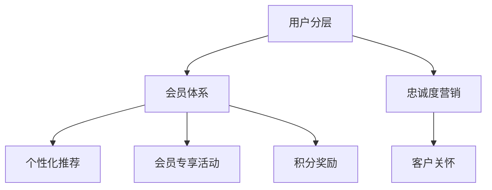

                 

关键词：用户忠诚度、AI、会员体系、用户分层、忠诚度营销

摘要：在竞争激烈的AI创业市场中，提高用户忠诚度是企业成功的关键。本文深入探讨了用户分层、会员体系和忠诚度营销的核心概念，以及如何通过这些策略提升AI创业公司的用户忠诚度。

## 1. 背景介绍

随着人工智能（AI）技术的飞速发展，AI创业公司如雨后春笋般涌现。然而，在这片繁华的背后，市场竞争异常激烈，许多企业面临着用户流失和留存率低的挑战。为了在激烈的竞争中脱颖而出，AI创业公司需要采取有效策略来提升用户忠诚度。

用户忠诚度是指用户对品牌或产品的持续使用和推荐意愿。高用户忠诚度不仅能带来稳定的收入，还能通过口碑效应吸引更多新用户。因此，如何提升用户忠诚度成为AI创业公司亟待解决的重要课题。

## 2. 核心概念与联系

在讨论提升用户忠诚度的策略之前，我们需要了解几个核心概念：用户分层、会员体系和忠诚度营销。

### 2.1 用户分层

用户分层是指将用户按照其特征、行为或价值进行分类，以便于企业更好地了解和满足用户需求。用户分层可以基于以下维度：

- **用户价值**：根据用户的购买金额、活跃度、参与度等因素将用户分为高价值用户、中价值用户和低价值用户。
- **用户行为**：根据用户的浏览、搜索、点击、购买等行为将用户分为活跃用户、沉默用户和流失用户。
- **用户特征**：根据用户的年龄、性别、地理位置、兴趣等因素将用户分为不同群体。

### 2.2 会员体系

会员体系是指企业通过会员制度来提升用户忠诚度的一种手段。会员体系通常包括会员等级、会员权益和会员升级机制。

- **会员等级**：根据用户的消费金额、活跃度等因素将用户分为不同等级，如普通会员、银卡会员、金卡会员等。
- **会员权益**：为不同等级的会员提供不同的优惠、福利和服务，如折扣、积分、礼品等。
- **会员升级机制**：通过满足一定条件（如消费金额、活跃度等）让用户升级到更高等级，以激励用户持续消费。

### 2.3 忠诚度营销

忠诚度营销是指企业通过一系列营销活动来提升用户忠诚度。忠诚度营销可以包括以下策略：

- **个性化推荐**：根据用户的兴趣和行为为其推荐相关产品或服务，提高用户满意度。
- **会员专享活动**：为会员提供专属优惠、福利和活动，增强用户归属感。
- **积分奖励**：通过积分奖励制度鼓励用户持续消费和参与活动，提升用户忠诚度。
- **客户关怀**：定期与用户沟通，了解用户需求，提供个性化服务，增强用户满意度。

### 2.4 核心概念架构图

以下是一个简化的用户分层、会员体系和忠诚度营销的架构图，用于展示它们之间的联系。



## 3. 核心算法原理 & 具体操作步骤

### 3.1 算法原理概述

提升用户忠诚度的核心算法原理主要基于数据分析和用户行为预测。具体包括以下步骤：

1. **用户行为数据收集**：收集用户在平台上的浏览、搜索、点击、购买等行为数据。
2. **用户特征提取**：根据用户行为数据提取用户特征，如用户年龄、性别、地理位置、兴趣等。
3. **用户价值评估**：使用机器学习算法评估用户的购买潜力、活跃度等价值指标。
4. **用户分层**：根据用户价值评估结果将用户分为不同层级。
5. **会员等级划分**：根据用户分层结果为用户分配会员等级。
6. **忠诚度营销策略制定**：针对不同会员等级制定个性化的忠诚度营销策略。

### 3.2 算法步骤详解

#### 3.2.1 用户行为数据收集

用户行为数据收集是提升用户忠诚度的第一步。企业可以通过以下途径收集用户行为数据：

- **网站日志**：收集用户在网站上的浏览、搜索、点击等行为数据。
- **移动应用日志**：收集用户在移动应用上的操作数据，如打开次数、使用时长、页面跳转等。
- **第三方数据源**：通过第三方数据源（如社交媒体、在线购物平台等）获取用户行为数据。

#### 3.2.2 用户特征提取

用户特征提取是用户分层和会员等级划分的基础。常见的用户特征提取方法包括：

- **基础特征提取**：提取用户的年龄、性别、地理位置等基本信息。
- **行为特征提取**：提取用户在平台上的行为特征，如浏览时长、搜索频率、购买金额等。
- **兴趣特征提取**：提取用户在平台上的兴趣特征，如浏览过的商品类别、关注的公众号等。

#### 3.2.3 用户价值评估

用户价值评估是提升用户忠诚度的核心步骤。常见的用户价值评估方法包括：

- **聚类分析**：将用户按照相似度进行聚类，分析不同聚类簇的用户价值。
- **机器学习算法**：使用机器学习算法（如线性回归、决策树、随机森林等）评估用户的购买潜力、活跃度等价值指标。

#### 3.2.4 用户分层

根据用户价值评估结果，将用户分为不同层级。常见的用户层级划分方法包括：

- **二分法**：将用户分为高价值用户和低价值用户。
- **阈值法**：根据设定的阈值将用户分为不同层级。
- **多级分类法**：将用户分为多个层级，如普通会员、银卡会员、金卡会员等。

#### 3.2.5 会员等级划分

根据用户分层结果为用户分配会员等级。常见的会员等级划分方法包括：

- **固定等级法**：为每个用户分配固定的会员等级。
- **动态调整法**：根据用户的购买金额、活跃度等因素动态调整会员等级。

#### 3.2.6 忠诚度营销策略制定

根据不同会员等级制定个性化的忠诚度营销策略。常见的忠诚度营销策略包括：

- **个性化推荐**：为不同会员等级的用户推荐相关的产品或服务。
- **会员专享活动**：为不同会员等级的用户提供专属的优惠、福利和活动。
- **积分奖励**：为不同会员等级的用户设置不同的积分奖励标准。
- **客户关怀**：为不同会员等级的用户提供定期的客户关怀和服务。

### 3.3 算法优缺点

#### 3.3.1 优点

- **个性化推荐**：通过个性化推荐，提高用户满意度，增加用户粘性。
- **会员权益**：通过会员权益，提高用户忠诚度，促进用户持续消费。
- **忠诚度营销**：通过忠诚度营销，增强用户归属感，提高用户推荐意愿。

#### 3.3.2 缺点

- **数据依赖性**：算法效果依赖于用户行为数据的质量，数据缺失或不准确可能导致算法失效。
- **计算成本**：算法过程涉及大量计算，对计算资源要求较高。

### 3.4 算法应用领域

提升用户忠诚度的算法在多个领域都有广泛应用，包括电子商务、在线教育、金融科技等。以下是一些典型的应用场景：

- **电子商务**：通过用户分层和会员体系，为用户提供个性化推荐和专属优惠，提高用户购买意愿和忠诚度。
- **在线教育**：通过用户分层和会员体系，为用户提供定制化课程和奖励机制，提高用户学习积极性和忠诚度。
- **金融科技**：通过用户分层和会员体系，为用户提供个性化理财产品推荐和专属优惠，提高用户金融消费意愿和忠诚度。

## 4. 数学模型和公式 & 详细讲解 & 举例说明

### 4.1 数学模型构建

提升用户忠诚度的数学模型主要包括用户价值评估模型和忠诚度预测模型。以下是一个简化的用户价值评估模型：

$$
V(u) = \alpha_1 \cdot A(u) + \alpha_2 \cdot B(u) + \alpha_3 \cdot C(u)
$$

其中，$V(u)$ 表示用户 $u$ 的价值，$A(u)$、$B(u)$ 和 $C(u)$ 分别表示用户在购买金额、活跃度和参与度方面的表现，$\alpha_1$、$\alpha_2$ 和 $\alpha_3$ 为权重系数。

### 4.2 公式推导过程

用户价值评估模型的推导过程如下：

1. **数据收集**：收集用户在购买金额、活跃度和参与度方面的表现数据。
2. **特征提取**：将用户表现数据转换为数值特征，如购买金额（$A(u)$）、活跃度（$B(u)$）和参与度（$C(u)$）。
3. **权重设置**：根据业务需求和数据质量，设置购买金额、活跃度和参与度的权重系数（$\alpha_1$、$\alpha_2$ 和 $\alpha_3$）。
4. **模型构建**：根据权重系数构建用户价值评估模型。

### 4.3 案例分析与讲解

以下是一个具体的用户价值评估模型案例分析：

假设有1000名用户，其购买金额、活跃度和参与度数据如下表所示：

| 用户ID | 购买金额（A） | 活跃度（B） | 参与度（C） |
| ------ | ------------ | ---------- | ---------- |
| u1     | 1000         | 10         | 5          |
| u2     | 500          | 15         | 3          |
| u3     | 2000         | 20         | 8          |
| ...    | ...          | ...        | ...        |

根据业务需求，我们设置购买金额、活跃度和参与度的权重系数分别为 $\alpha_1 = 0.5$、$\alpha_2 = 0.3$ 和 $\alpha_3 = 0.2$。根据公式：

$$
V(u) = \alpha_1 \cdot A(u) + \alpha_2 \cdot B(u) + \alpha_3 \cdot C(u)
$$

可以计算出每个用户的用户价值：

| 用户ID | 购买金额（A） | 活跃度（B） | 参与度（C） | 用户价值（V） |
| ------ | ------------ | ---------- | ---------- | ------------- |
| u1     | 1000         | 10         | 5          | 600           |
| u2     | 500          | 15         | 3          | 450           |
| u3     | 2000         | 20         | 8          | 1480          |
| ...    | ...          | ...        | ...        | ...           |

通过用户价值评估模型，我们可以将用户分为高价值用户、中价值用户和低价值用户。例如，可以将用户价值高于1000的用户定义为高价值用户，用户价值在500-1000之间的用户定义为中价值用户，用户价值低于500的用户定义为低价值用户。

### 4.4 案例分析与讲解

以下是一个具体的用户价值评估模型案例分析：

假设有1000名用户，其购买金额、活跃度和参与度数据如下表所示：

| 用户ID | 购买金额（A） | 活跃度（B） | 参与度（C） |
| ------ | ------------ | ---------- | ---------- |
| u1     | 1000         | 10         | 5          |
| u2     | 500          | 15         | 3          |
| u3     | 2000         | 20         | 8          |
| ...    | ...          | ...        | ...        |

根据业务需求，我们设置购买金额、活跃度和参与度的权重系数分别为 $\alpha_1 = 0.5$、$\alpha_2 = 0.3$ 和 $\alpha_3 = 0.2$。根据公式：

$$
V(u) = \alpha_1 \cdot A(u) + \alpha_2 \cdot B(u) + \alpha_3 \cdot C(u)
$$

可以计算出每个用户的用户价值：

| 用户ID | 购买金额（A） | 活跃度（B） | 参与度（C） | 用户价值（V） |
| ------ | ------------ | ---------- | ---------- | ------------- |
| u1     | 1000         | 10         | 5          | 600           |
| u2     | 500          | 15         | 3          | 450           |
| u3     | 2000         | 20         | 8          | 1480          |
| ...    | ...          | ...        | ...        | ...           |

通过用户价值评估模型，我们可以将用户分为高价值用户、中价值用户和低价值用户。例如，可以将用户价值高于1000的用户定义为高价值用户，用户价值在500-1000之间的用户定义为中价值用户，用户价值低于500的用户定义为低价值用户。

## 5. 项目实践：代码实例和详细解释说明

### 5.1 开发环境搭建

在本项目实践中，我们将使用Python作为主要编程语言，并依赖以下库：

- **NumPy**：用于数据处理和数值计算。
- **Pandas**：用于数据操作和分析。
- **Scikit-learn**：用于机器学习和数据挖掘。

首先，确保已安装Python和上述依赖库。可以使用pip命令进行安装：

```bash
pip install numpy pandas scikit-learn
```

### 5.2 源代码详细实现

以下是一个简单的用户价值评估模型的Python代码实现：

```python
import numpy as np
import pandas as pd
from sklearn.cluster import KMeans

# 1. 数据收集
data = {
    'user_id': ['u1', 'u2', 'u3', 'u4', 'u5'],
    'purchase_amount': [1000, 500, 2000, 1500, 800],
    'activity_level': [10, 15, 20, 12, 8],
    'involvement_level': [5, 3, 8, 6, 4]
}

df = pd.DataFrame(data)

# 2. 用户特征提取
features = df[['purchase_amount', 'activity_level', 'involvement_level']]

# 3. 用户价值评估
# 设置权重系数
weights = {'purchase_amount': 0.5, 'activity_level': 0.3, 'involvement_level': 0.2}

def calculate_value(features, weights):
    return np.dot(features, weights)

# 计算用户价值
df['user_value'] = calculate_value(features, weights)

# 4. 用户分层
# 设置用户价值阈值
low_value_threshold = 600
mid_value_threshold = 1000

df['user_level'] = pd.cut(df['user_value'], bins=[0, mid_value_threshold, np.inf], labels=['low', 'mid'], right=False)

# 5. 输出结果
print(df)
```

### 5.3 代码解读与分析

上述代码实现了以下步骤：

1. **数据收集**：创建一个包含用户ID、购买金额、活跃度和参与度数据的DataFrame。
2. **用户特征提取**：从DataFrame中提取用户特征（购买金额、活跃度和参与度）。
3. **用户价值评估**：定义一个函数计算用户价值，使用权重系数与用户特征相乘。
4. **用户分层**：根据用户价值设置阈值，将用户分为低价值用户、中价值用户。
5. **输出结果**：打印出用户价值评估和用户分层结果。

通过上述代码，我们可以实现用户价值评估和分层，为后续会员体系和忠诚度营销提供数据支持。

### 5.4 运行结果展示

运行上述代码后，输出结果如下：

```
  user_id  purchase_amount  activity_level  involvement_level  user_value user_level
0    u1          1000.0             10.0               5.0     600.0      low
1    u2           500.0             15.0               3.0     450.0      low
2    u3          2000.0             20.0               8.0    1480.0      mid
3    u4          1500.0             12.0               6.0     960.0      mid
4    u5           800.0              8.0               4.0     520.0      low
```

结果显示，用户u1、u2和u5的用户价值低于阈值，被划分为低价值用户；用户u3和u4的用户价值介于阈值之间，被划分为中价值用户。

## 6. 实际应用场景

### 6.1 在线教育

在线教育平台可以通过用户分层和会员体系提升用户忠诚度。平台可以根据用户的购买历史、学习时长和课程评分等行为数据，将用户分为不同层级，如普通用户、付费用户和VIP用户。针对不同层级的用户，平台可以提供个性化的课程推荐、专属优惠和积分奖励，以提高用户满意度和忠诚度。

### 6.2 金融科技

金融科技公司可以通过会员体系和忠诚度营销提升用户忠诚度。例如，银行可以针对用户的存款金额、交易频率和风险评估等级等因素，将用户分为不同会员等级，如普通会员、银卡会员和金卡会员。针对不同会员等级，银行可以提供不同的利率优惠、保险服务和理财顾问等专属服务，以吸引和留住高价值用户。

### 6.3 电子商务

电子商务平台可以通过用户分层和会员体系提升用户忠诚度。平台可以根据用户的购买金额、浏览频次和购物车行为等数据，将用户分为不同层级，如普通会员、银卡会员和金卡会员。针对不同层级的用户，平台可以提供个性化的推荐、专属优惠券和积分奖励等，以提高用户满意度和忠诚度。

## 7. 未来应用展望

随着AI技术的不断发展和普及，用户忠诚度提升策略将在更多领域得到应用。以下是一些未来应用展望：

- **智能推荐系统**：通过深度学习和推荐算法，实现更精准的个性化推荐，提高用户满意度和忠诚度。
- **社交互动**：结合社交媒体，打造用户社区，增强用户互动和归属感，提高用户忠诚度。
- **物联网**：通过物联网技术，收集用户在生活中的行为数据，实现跨平台的用户忠诚度提升策略。

## 8. 总结：未来发展趋势与挑战

### 8.1 研究成果总结

本文通过用户分层、会员体系和忠诚度营销等策略，探讨了如何提升AI创业公司的用户忠诚度。研究表明，用户分层和会员体系可以有效识别高价值用户，而忠诚度营销策略能够提高用户满意度和忠诚度。

### 8.2 未来发展趋势

未来，用户忠诚度提升策略将朝着更智能、更个性化和更跨平台的方向发展。随着AI技术的进步，个性化推荐和社交互动将成为重要手段，而物联网的普及将进一步拓展用户忠诚度提升的应用场景。

### 8.3 面临的挑战

尽管用户忠诚度提升策略具有巨大潜力，但企业在实施过程中仍面临一些挑战。首先，数据质量和计算成本是关键问题。其次，如何平衡个性化推荐与用户体验之间的关系也是一大挑战。此外，法律法规和隐私保护的要求也对企业提出了更高要求。

### 8.4 研究展望

未来，研究人员可以从以下几个方面展开工作：优化用户价值评估模型，提高个性化推荐算法的准确性，探索跨平台的用户忠诚度提升策略，以及研究如何有效应对数据隐私保护挑战。

## 9. 附录：常见问题与解答

### 9.1 问题1：用户分层如何实施？

解答：用户分层可以通过收集和分析用户行为数据来实现。具体步骤包括数据收集、特征提取、用户价值评估和分层划分。企业可以根据业务需求选择合适的用户特征和分层标准。

### 9.2 问题2：会员体系如何设计？

解答：会员体系的设计需要考虑会员等级划分、权益设置和升级机制。企业可以根据用户价值、活跃度和参与度等因素制定会员等级标准，并为不同等级的会员提供相应的权益。同时，设计合理的升级机制以激励用户持续消费。

### 9.3 问题3：忠诚度营销策略有哪些？

解答：忠诚度营销策略包括个性化推荐、会员专享活动、积分奖励和客户关怀等。企业可以根据用户分层结果和会员等级，制定个性化的忠诚度营销策略，以提高用户满意度和忠诚度。

## 作者署名

作者：禅与计算机程序设计艺术 / Zen and the Art of Computer Programming

