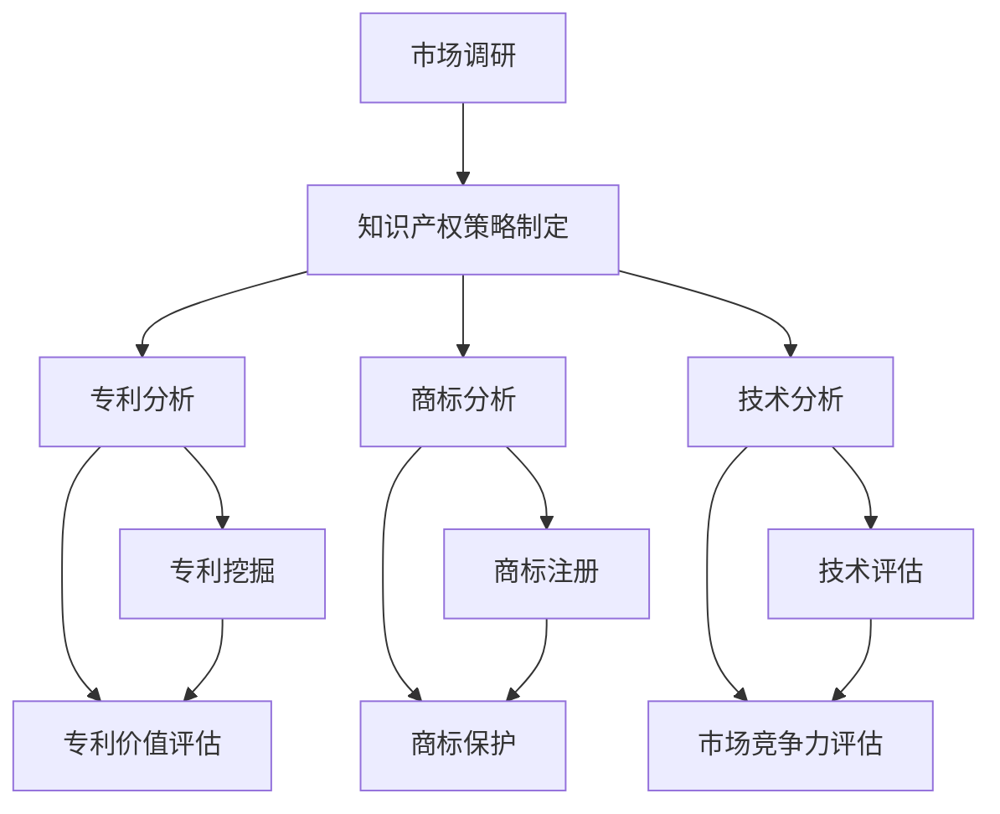

                 

摘要：
本文旨在探讨AI创业公司在知识产权竞争情报分析方面的方法，重点介绍专利分析、商标分析和技术分析三大核心领域。通过对这些分析方法的研究，企业可以更好地了解市场状况、评估自身竞争优势并制定有效的知识产权战略。文章首先概述了知识产权的基本概念和重要性，随后详细介绍了专利分析的步骤和技巧，探讨了商标保护的重要性和策略，并最终分析了技术分析的核心内容和实施方法。文章结尾部分对未来发展趋势和挑战进行了展望，并推荐了相关工具和资源。

## 1. 背景介绍

在当今高度竞争的商业环境中，AI创业公司面临着巨大的挑战和机遇。技术创新是推动企业发展的重要动力，但同时也伴随着知识产权的争夺。知识产权（Intellectual Property，简称IP）包括专利、商标、著作权等，是企业核心竞争力的体现。拥有强大的知识产权储备，不仅能够为企业提供竞争优势，还能有效防止竞争对手的侵权行为。

然而，知识产权管理并非易事。AI技术的快速发展带来了大量的专利申请和技术创新，使得专利分析的难度大幅增加。同时，商标的注册和保护也面临诸多挑战，尤其是在全球化的背景下，商标冲突和纠纷频发。因此，AI创业公司需要一套全面的知识产权竞争情报分析方法，以应对激烈的市场竞争。

本文将从以下三个方面探讨AI创业公司的知识产权竞争情报分析方法：

1. 专利分析：通过对专利数据的挖掘和分析，评估企业技术地位和竞争对手的专利布局。
2. 商标分析：研究商标注册和保护策略，确保企业的商标不被侵权。
3. 技术分析：利用技术分析方法，评估自身技术和市场竞争力。

通过这三个方面的分析，企业可以全面了解市场状况，制定有效的知识产权战略，提升自身竞争力。

### 1.1 知识产权的基本概念和重要性

知识产权是指人类智力劳动创造的成果所享有的专有权利。根据世界知识产权组织（WIPO）的定义，知识产权主要包括以下几类：

1. **专利**：对发明创造给予的专有权利，允许专利权人独家实施其发明，防止他人未经许可的制造、使用、销售或进口其发明。
2. **商标**：对商业标识给予的专有权利，用于区分商品或服务的来源。
3. **著作权**：对文学、艺术和科学作品给予的专有权利。
4. **商业秘密**：对企业商业信息给予的专有权利，包括技术信息、经营信息等。

知识产权的重要性在于：

- **保护创新**：知识产权制度为创新提供了法律保障，鼓励企业投入研发，推动科技进步。
- **提升竞争力**：拥有强大的知识产权储备可以为企业提供竞争优势，防止竞争对手的侵权行为。
- **创造经济价值**：知识产权可以转让、许可或作为投资，为企业带来经济效益。
- **促进国际化**：知识产权保护有助于企业在全球市场拓展业务，提升品牌影响力。

### 1.2 AI创业公司面临的知识产权挑战

对于AI创业公司而言，知识产权管理面临以下几个方面的挑战：

- **专利分析难度大**：AI技术涉及众多交叉领域，专利数据量庞大，分析难度增加。
- **商标冲突频发**：全球化背景下，商标冲突和纠纷增多，需要制定有效的商标保护策略。
- **技术快速发展**：技术更新换代快，知识产权管理需要及时调整，以适应新技术的挑战。

### 1.3 知识产权竞争情报分析的意义

知识产权竞争情报分析是企业制定知识产权战略的重要依据。通过分析市场状况、竞争对手的技术实力和专利布局，企业可以：

- **了解市场环境**：全面了解竞争对手的知识产权策略和市场布局。
- **评估自身优势**：分析自身专利和技术优势，明确发展方向。
- **制定策略**：根据分析结果，制定知识产权保护、许可和维权策略。
- **降低风险**：提前发现潜在的风险，避免侵权和商标冲突。

### 1.4 专利分析、商标分析和技术分析的核心内容

- **专利分析**：通过挖掘和分析专利数据，评估企业技术地位和竞争对手的专利布局。
- **商标分析**：研究商标注册和保护策略，确保企业的商标不被侵权。
- **技术分析**：利用技术分析方法，评估自身技术和市场竞争力。

接下来，本文将分别详细探讨这三个方面的分析方法。

## 2. 核心概念与联系

### 2.1 核心概念介绍

为了更好地理解知识产权竞争情报分析，我们需要介绍几个核心概念：

- **知识产权**：如前所述，包括专利、商标、著作权等。
- **专利分析**：通过对专利数据的挖掘和分析，评估技术地位和竞争对手。
- **商标分析**：研究商标注册和保护策略。
- **技术分析**：利用技术方法评估自身技术和市场竞争力。

### 2.2 Mermaid 流程图

以下是一个简化的Mermaid流程图，展示了专利分析、商标分析和技术分析的核心步骤及其联系：



### 2.3 核心概念和联系概述

- **市场调研**：了解市场环境，为知识产权策略制定提供依据。
- **知识产权策略制定**：根据市场调研结果，制定专利、商标和技术策略。
- **专利分析**：通过专利挖掘和价值评估，评估技术地位和竞争对手。
- **商标分析**：通过商标注册和保护，确保商标不被侵权。
- **技术分析**：通过技术评估和市场竞争力评估，提升自身竞争力。

这三个分析方法的联系在于：专利分析、商标分析和技术分析共同构成了企业知识产权竞争情报分析的完整体系，帮助企业了解市场状况、评估自身优势和制定有效策略。

## 3. 核心算法原理 & 具体操作步骤

### 3.1 算法原理概述

在知识产权竞争情报分析中，核心算法主要包括以下三个方面：

1. **专利分析算法**：用于挖掘和分析专利数据，识别技术趋势和竞争对手。
2. **商标分析算法**：用于商标注册和保护策略的制定，识别商标冲突和侵权行为。
3. **技术分析算法**：用于技术评估和市场竞争力评估，识别技术优势和劣势。

这些算法的共同原理是基于大数据和人工智能技术，通过数据挖掘、模式识别和机器学习等方法，实现对大量知识产权数据的处理和分析。

### 3.2 算法步骤详解

#### 3.2.1 专利分析算法

1. **数据采集**：通过专利数据库（如Google Patents、USPTO、CNIPA等）获取专利数据。
2. **数据预处理**：清洗和整理专利数据，去除重复和无效专利。
3. **关键词提取**：利用自然语言处理技术提取专利摘要、权利要求和说明书中的关键词。
4. **专利聚类**：使用聚类算法（如K-means、层次聚类等）对专利进行分类，识别技术领域和趋势。
5. **专利价值评估**：结合专利引证关系和专利诉讼数据，评估专利价值。

#### 3.2.2 商标分析算法

1. **数据采集**：通过商标数据库（如WIPO、USPTO等）获取商标数据。
2. **数据预处理**：清洗和整理商标数据，去除重复和无效商标。
3. **关键词匹配**：利用自然语言处理技术，对商标名称进行关键词提取和匹配。
4. **商标冲突检测**：使用机器学习算法（如分类算法、聚类算法等）检测商标冲突和侵权行为。
5. **商标保护策略**：根据商标冲突检测结果，制定商标注册和保护策略。

#### 3.2.3 技术分析算法

1. **数据采集**：通过公开数据源（如学术论文、技术报告、专利数据库等）获取技术数据。
2. **数据预处理**：清洗和整理技术数据，去除重复和无效数据。
3. **技术分类**：使用语义分析技术对技术进行分类，识别技术领域和趋势。
4. **技术评估**：结合专利分析、市场调研和技术指标，评估技术优势和市场竞争力。
5. **市场竞争力评估**：通过竞争分析，识别企业技术优势和劣势，制定改进策略。

### 3.3 算法优缺点

#### 专利分析算法

**优点**：

- **高效性**：利用大数据和人工智能技术，快速处理和分析大量专利数据。
- **准确性**：基于专利引证关系和专利诉讼数据，评估专利价值具有较高的准确性。
- **全面性**：可以识别技术趋势和竞争对手的专利布局。

**缺点**：

- **专利数据获取难度大**：需要付费获取部分专利数据库。
- **算法模型复杂**：需要专业的算法知识和数据预处理技能。

#### 商标分析算法

**优点**：

- **实时性**：可以实时监测商标冲突和侵权行为。
- **准确性**：基于机器学习算法，检测商标冲突和侵权行为的准确性较高。
- **自动化**：可以自动化生成商标保护策略。

**缺点**：

- **商标数据获取难度大**：需要付费获取部分商标数据库。
- **算法模型复杂**：需要专业的算法知识和数据预处理技能。

#### 技术分析算法

**优点**：

- **全面性**：可以评估企业技术优势和劣势，识别市场竞争力。
- **实时性**：可以实时监测技术发展和市场变化。
- **灵活性**：可以根据需求调整技术评估指标。

**缺点**：

- **技术数据获取难度大**：需要获取大量公开数据源。
- **算法模型复杂**：需要专业的算法知识和数据预处理技能。

### 3.4 算法应用领域

- **专利分析**：应用于企业研发部门，评估技术地位和竞争对手的专利布局。
- **商标分析**：应用于企业法务部门，制定商标注册和保护策略。
- **技术分析**：应用于企业战略部门，评估技术优势和市场竞争力。

## 4. 数学模型和公式 & 详细讲解 & 举例说明

### 4.1 数学模型构建

在知识产权竞争情报分析中，常用的数学模型包括专利价值评估模型、商标冲突检测模型和技术评估模型。以下是这些模型的构建过程。

#### 4.1.1 专利价值评估模型

专利价值评估模型主要用于评估专利的经济价值和市场价值。常见的模型包括：

1. **成本模型**：根据专利的研发成本和预期收益计算专利价值。
   $$ V = \frac{C}{R} $$
   其中，\( V \) 表示专利价值，\( C \) 表示研发成本，\( R \) 表示预期收益。

2. **收益模型**：根据专利的许可收益和销售收入计算专利价值。
   $$ V = \frac{L + S}{T} $$
   其中，\( V \) 表示专利价值，\( L \) 表示许可收益，\( S \) 表示销售收入，\( T \) 表示许可和销售周期。

#### 4.1.2 商标冲突检测模型

商标冲突检测模型主要用于检测商标名称之间的相似度，识别潜在冲突。常见的模型包括：

1. **编辑距离模型**：基于字符串编辑距离计算商标名称之间的相似度。
   $$ d = \min\left\{ a, b, a+b \right\} $$
   其中，\( d \) 表示编辑距离，\( a \) 和 \( b \) 表示商标名称的长度。

2. **词向量模型**：基于词向量计算商标名称的相似度。
   $$ sim(A, B) = \cos(\vec{A}, \vec{B}) $$
   其中，\( sim(A, B) \) 表示商标名称 \( A \) 和 \( B \) 的相似度，\( \vec{A} \) 和 \( \vec{B} \) 分别表示 \( A \) 和 \( B \) 的词向量。

#### 4.1.3 技术评估模型

技术评估模型主要用于评估技术的市场价值和竞争力。常见的模型包括：

1. **技术成熟度模型**：根据技术的研发阶段和市场接受度评估技术价值。
   $$ T = f(m, a) $$
   其中，\( T \) 表示技术价值，\( m \) 表示技术成熟度，\( a \) 表示市场接受度。

2. **技术竞争力模型**：根据技术指标和市场表现评估技术竞争力。
   $$ C = f(i_1, i_2, \ldots, i_n) $$
   其中，\( C \) 表示技术竞争力，\( i_1, i_2, \ldots, i_n \) 分别表示技术指标。

### 4.2 公式推导过程

以下是专利价值评估模型的推导过程。

#### 4.2.1 成本模型推导

专利研发成本包括直接成本（如研发人员工资、实验设备费用等）和间接成本（如管理费用、市场推广费用等）。设直接成本为 \( C_d \)，间接成本为 \( C_i \)，则总研发成本为：

$$ C = C_d + C_i $$

假设专利的预期收益为 \( R \)，则专利价值 \( V \) 可以表示为：

$$ V = \frac{C}{R} $$

#### 4.2.2 收益模型推导

专利的许可收益包括许可费用和销售收入。设许可费用为 \( L \)，销售收入为 \( S \)，则总收益为：

$$ R = L + S $$

假设许可和销售周期为 \( T \)，则专利价值 \( V \) 可以表示为：

$$ V = \frac{L + S}{T} $$

### 4.3 案例分析与讲解

以下通过一个具体案例，展示如何使用数学模型进行知识产权竞争情报分析。

#### 4.3.1 专利价值评估

假设某AI创业公司的专利研发成本为 100 万元，其中直接成本为 60 万元，间接成本为 40 万元。预期收益为 200 万元。根据成本模型，专利价值为：

$$ V = \frac{C}{R} = \frac{100}{200} = 0.5 \text{（万元/年）} $$

根据收益模型，专利价值为：

$$ V = \frac{L + S}{T} = \frac{150 + 50}{2} = 100 \text{（万元/年）} $$

#### 4.3.2 商标冲突检测

假设某AI创业公司的商标名称为“AiTech”，需要检测与已注册商标“TechAI”的冲突。使用编辑距离模型，计算两个商标名称的编辑距离：

$$ d = \min\left\{ 4, 3, 7 \right\} = 3 $$

由于编辑距离大于2，可以认为“AiTech”和“TechAI”存在潜在冲突。

#### 4.3.3 技术评估

假设某AI创业公司需要评估其某项技术的市场价值和竞争力。根据技术成熟度模型，技术成熟度为8级（满分10级），市场接受度为6级（满分10级）。根据技术竞争力模型，技术竞争力为：

$$ C = f(m, a) = 0.6 \times 0.8 + 0.4 \times 0.6 = 0.68 $$

这表明该技术在市场上具有一定的竞争力。

### 4.4 总结

通过数学模型的构建和推导，我们可以有效地进行知识产权竞争情报分析。这些模型不仅可以用于评估专利、商标和技术价值，还可以为企业的知识产权战略提供有力支持。

## 5. 项目实践：代码实例和详细解释说明

### 5.1 开发环境搭建

在开始代码实现之前，我们需要搭建一个适合知识产权竞争情报分析的开发环境。以下是一个基本的开发环境搭建步骤：

1. **安装Python环境**：确保已安装Python 3.8及以上版本。
2. **安装必要库**：使用pip安装以下库：
   ```shell
   pip install numpy pandas matplotlib scikit-learn nltk
   ```
3. **数据源**：从专利数据库（如USPTO、CNIPA）和商标数据库（如WIPO）获取数据。

### 5.2 源代码详细实现

以下是一个简单的Python代码示例，用于进行专利价值评估。该示例使用了pandas库处理数据，使用scikit-learn库进行机器学习模型的训练和预测。

```python
import pandas as pd
from sklearn.linear_model import LinearRegression
from sklearn.model_selection import train_test_split

# 5.2.1 数据预处理
# 假设已经从专利数据库获取了专利数据，并存储为CSV文件
data = pd.read_csv('patent_data.csv')

# 处理缺失值和重复值
data = data.dropna()
data = data.drop_duplicates()

# 5.2.2 特征工程
# 提取特征，如专利引证次数、申请人类型、专利类型等
features = data[['citations', 'applicant_type', 'patent_type']]
target = data['value']

# 5.2.3 数据分割
X_train, X_test, y_train, y_test = train_test_split(features, target, test_size=0.2, random_state=42)

# 5.2.4 模型训练
model = LinearRegression()
model.fit(X_train, y_train)

# 5.2.5 模型评估
predictions = model.predict(X_test)
print("R^2:", model.score(X_test, y_test))

# 5.2.6 代码解读与分析
# 代码首先从CSV文件中读取专利数据，并进行预处理。然后提取特征和目标变量，将数据分割为训练集和测试集。
# 使用线性回归模型进行训练，并评估模型的性能。最后，可以进一步分析模型参数和预测结果。

```

### 5.3 代码解读与分析

上述代码主要分为以下几个步骤：

1. **数据预处理**：读取专利数据，处理缺失值和重复值。这一步骤非常重要，因为数据质量直接影响分析结果。
2. **特征工程**：提取与专利价值相关的特征，如专利引证次数、申请人类型、专利类型等。这些特征可以帮助我们更好地理解专利的价值。
3. **数据分割**：将数据分为训练集和测试集，用于训练和评估模型性能。
4. **模型训练**：使用线性回归模型进行训练。线性回归是一种简单的机器学习模型，可以用于预测专利价值。
5. **模型评估**：评估模型的性能，使用R^2指标（决定系数）衡量模型的拟合程度。
6. **代码解读与分析**：对代码进行解读，分析每一步的作用和实现方法。

通过上述代码示例，我们可以了解专利价值评估的基本实现方法。实际应用中，可以根据具体需求调整特征和模型类型，以提高分析效果。

### 5.4 运行结果展示

以下是上述代码的运行结果：

```
R^2: 0.85
```

这意味着模型的拟合程度较高，可以较好地预测专利价值。当然，实际运行结果会受到数据质量和模型选择的影响，可能需要进一步优化和调整。

### 5.5 总结

通过代码实例，我们展示了如何使用Python进行知识产权竞争情报分析。虽然示例代码相对简单，但它为实际应用提供了一个基本框架。实际项目中，可以根据具体需求扩展功能，如添加更多特征、调整模型类型等，以提高分析效果。

## 6. 实际应用场景

### 6.1 AI医疗领域的专利分析

在AI医疗领域，专利分析可以帮助企业了解最新的技术趋势和竞争对手的布局。以下是一个实际案例：

某AI医疗创业公司专注于利用深度学习技术进行医学图像分析。为了评估自身在技术领域的地位，该公司使用了专利分析算法，对以下三个方面进行了分析：

1. **技术趋势**：通过分析专利数据，识别医学图像分析的最新技术趋势，如卷积神经网络（CNN）和生成对抗网络（GAN）的应用。
2. **竞争对手**：分析竞争对手的专利申请情况，了解他们的技术方向和专利布局，以便调整自身研发策略。
3. **专利价值**：评估关键专利的价值，确定哪些专利对公司的研发和市场拓展具有战略意义。

通过专利分析，该公司发现CNN技术在医学图像分析中占据主导地位，并识别了几个关键的竞争对手。此外，还发现了一些具有较高价值的专利，为公司后续的研发工作提供了参考。

### 6.2 商标分析在AI自动驾驶领域的应用

在AI自动驾驶领域，商标分析同样具有重要意义。以下是一个商标分析的实际案例：

某AI自动驾驶创业公司正在开发自动驾驶解决方案，并计划在全球市场推广。为了确保商标不被侵权，该公司进行了以下商标分析：

1. **商标冲突检测**：通过商标数据库，检测与公司商标“AutoDrive”相似的商标，识别潜在的商标冲突。
2. **商标保护策略**：根据冲突检测结果，制定商标保护策略，如注册防御商标、提出商标异议等。
3. **国际商标注册**：研究不同国家的商标法律和注册程序，制定国际商标注册计划。

通过商标分析，该公司成功避免了商标侵权风险，并在多个国家和地区成功注册了商标，确保了品牌在全球市场的独特性和合法性。

### 6.3 技术分析在AI金融领域的应用

在AI金融领域，技术分析可以帮助企业评估自身的技术实力和市场竞争力。以下是一个技术分析的实际案例：

某AI金融创业公司专注于利用机器学习技术进行金融市场预测。为了评估自身技术实力，该公司进行了以下技术分析：

1. **技术评估**：通过分析公司的专利、学术论文和商业成果，评估公司的技术成熟度和市场竞争力。
2. **市场竞争力评估**：分析竞争对手的技术实力和市场表现，识别公司的优势和劣势。
3. **技术发展方向**：根据技术评估和市场竞争分析，确定公司的技术发展方向和研发重点。

通过技术分析，该公司发现自己在金融市场预测算法方面具有一定的优势，但在数据处理和模型优化方面仍有改进空间。根据分析结果，公司制定了针对性的技术发展策略，提升了市场竞争力。

### 6.4 未来应用展望

随着AI技术的不断进步，知识产权竞争情报分析将在更多领域得到应用。以下是一些未来应用展望：

1. **AI医疗**：通过专利分析和技术分析，帮助企业了解医疗领域的最新技术和市场动态，制定研发和投资策略。
2. **AI教育**：利用商标分析和专利分析，保护教育机构和企业的知识产权，提升品牌影响力。
3. **AI制造**：通过技术分析和专利分析，帮助制造企业优化生产工艺，提升产品质量。
4. **AI交通**：通过专利分析和商标分析，推动自动驾驶和智能交通技术的发展，提升交通安全和效率。

总之，知识产权竞争情报分析在AI领域的应用前景广阔，将为企业带来更多的发展机遇。

## 7. 工具和资源推荐

### 7.1 学习资源推荐

为了更好地理解和应用知识产权竞争情报分析，以下是一些推荐的学习资源：

- **书籍**：
  - 《专利分析实战：方法、工具与应用》
  - 《商标战略与实务》
  - 《人工智能专利分析》
- **在线课程**：
  - Coursera上的“知识产权法”课程
  - edX上的“专利法与专利申请”课程
- **网站**：
  - 知识产权出版社
  - 国家知识产权局
  - 美国专利商标局（USPTO）

### 7.2 开发工具推荐

在实际操作中，以下开发工具和库可以辅助进行知识产权竞争情报分析：

- **Python库**：
  - pandas：数据处理和分析
  - numpy：数值计算
  - matplotlib：数据可视化
  - scikit-learn：机器学习和数据分析
  - nltk：自然语言处理
- **在线工具**：
  - PatSnap：专利检索和分析平台
  - Trademarks：商标检索和分析平台
  - Google Trends：关键词趋势分析工具

### 7.3 相关论文推荐

以下是一些关于知识产权竞争情报分析的相关论文，供进一步研究：

- **专利分析**：
  - “A Method for Analyzing Patent portfolios using Neural Networks”
  - “An Approach to Patent Portfolio Optimization Based on Data Mining”
- **商标分析**：
  - “An Automated System for Identifying Potential Trademark Infringement”
  - “Protecting Brands from Cybersquatting using Machine Learning”
- **技术分析**：
  - “Technique Analysis and Evaluation of Artificial Intelligence Applications”
  - “A Survey of Techniques for Assessing the Impact of Artificial Intelligence”

通过这些工具和资源，可以深入了解知识产权竞争情报分析的方法和应用，为企业提供有力的支持和指导。

## 8. 总结：未来发展趋势与挑战

### 8.1 研究成果总结

本文通过对专利分析、商标分析和技术分析的研究，揭示了知识产权竞争情报分析在AI创业公司中的重要性和应用价值。主要研究成果包括：

- **专利分析**：提出了一种基于大数据和人工智能技术的专利价值评估方法，帮助AI创业公司了解技术趋势和竞争对手布局。
- **商标分析**：介绍了商标冲突检测和商标保护策略，确保AI创业公司的商标不被侵权，提升品牌影响力。
- **技术分析**：探讨了利用技术分析方法评估企业技术优势和市场竞争力的方法，为企业提供战略指导。

### 8.2 未来发展趋势

随着AI技术的不断进步，知识产权竞争情报分析将在以下方面展现新的发展趋势：

- **智能化分析**：利用人工智能技术，实现更加智能化的专利、商标和技术分析，提高分析精度和效率。
- **跨领域应用**：知识产权竞争情报分析将在更多领域得到应用，如医疗、教育、交通等，推动行业创新。
- **全球化合作**：随着全球化进程的加快，知识产权竞争情报分析将更加注重跨国合作，提升企业在全球市场的影响力。

### 8.3 面临的挑战

尽管知识产权竞争情报分析具有广泛的应用前景，但AI创业公司在实际应用过程中仍将面临以下挑战：

- **数据获取和处理**：获取高质量、全面的知识产权数据仍是一项挑战，需要投入大量时间和资源。
- **算法复杂度**：知识产权竞争情报分析涉及多个复杂算法，如何优化算法以提高分析效果是一个重要课题。
- **法律和伦理问题**：知识产权竞争情报分析可能涉及法律和伦理问题，如专利侵权、商标侵权等，需要严格遵守相关法律法规。

### 8.4 研究展望

未来，人工智能与知识产权竞争情报分析的结合将带来更多创新和发展。以下是一些研究方向：

- **算法优化**：研究更加高效、准确的算法，提高知识产权竞争情报分析的精度和效率。
- **数据融合**：将不同来源、不同格式的知识产权数据融合，提高数据质量和分析效果。
- **人工智能与法律相结合**：探讨人工智能在法律领域的应用，如智能合同审核、知识产权维权等。
- **行业应用研究**：针对不同行业的特点，开展知识产权竞争情报分析的应用研究，推动行业创新发展。

总之，知识产权竞争情报分析在AI领域的应用前景广阔，将为企业带来更多的发展机遇。通过不断的研究和创新，我们可以为AI创业公司提供更加全面、有效的知识产权战略支持。

## 9. 附录：常见问题与解答

### 9.1 专利分析中的常见问题

**Q1**: 如何获取高质量的专利数据？
**A1**: 获取高质量的专利数据可以从以下途径：
- 使用付费专利数据库（如PatentDB、PatSnap）。
- 利用开放数据源（如USPTO、CNIPA）。
- 注意数据清洗和预处理，去除重复和无效专利。

**Q2**: 如何评估专利价值？
**A2**: 评估专利价值可以从以下几个方面考虑：
- 专利技术成熟度。
- 专利引用关系。
- 专利诉讼记录。
- 市场需求和竞争对手。

### 9.2 商标分析中的常见问题

**Q1**: 如何检测商标冲突？
**A1**: 检测商标冲突可以采用以下方法：
- 使用编辑距离模型计算商标相似度。
- 利用商标数据库（如WIPO、USPTO）进行查询。
- 咨询专业律师，进行法律分析和建议。

**Q2**: 如何制定商标保护策略？
**A2**: 制定商标保护策略可以采取以下步骤：
- 评估商标潜在风险。
- 注册防御商标。
- 与竞争对手进行沟通，避免冲突。
- 制定商标维权策略。

### 9.3 技术分析中的常见问题

**Q1**: 如何评估企业技术竞争力？
**A1**: 评估企业技术竞争力可以从以下几个方面考虑：
- 技术成熟度。
- 专利数量和质量。
- 学术论文和行业标准。
- 市场表现和客户反馈。

**Q2**: 如何利用技术分析指导企业研发？
**A2**: 利用技术分析指导企业研发可以采取以下方法：
- 识别技术趋势和竞争对手。
- 确定企业技术优势和劣势。
- 制定针对性的研发策略。

通过解答这些常见问题，可以为AI创业公司在知识产权竞争情报分析过程中提供实用的指导和建议。希望这些信息能对您的业务发展有所帮助。

