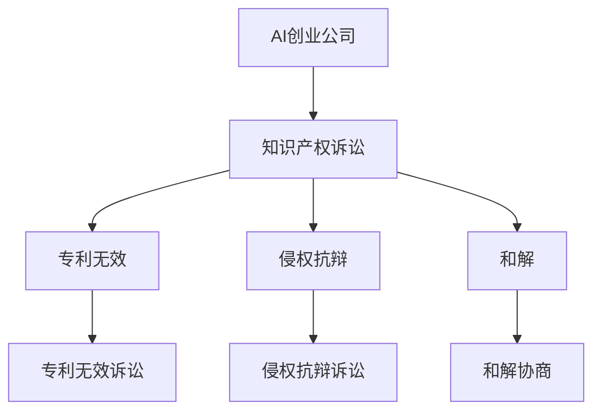

                 

 > **关键词：** AI创业公司，知识产权诉讼，专利无效，侵权抗辩，和解

**摘要：** 随着人工智能（AI）技术的快速发展，AI创业公司在市场竞争中面临着日益增多的知识产权诉讼风险。本文旨在探讨AI创业公司在面对专利无效、侵权抗辩和和解策略时的应对策略，为AI创业公司提供实用的法律和战略指导。

## 1. 背景介绍

人工智能作为当今最具颠覆性的技术之一，已经成为各国政府和企业的战略重点。AI创业公司在技术创新、市场开拓和商业运营中取得了显著成就，但与此同时，知识产权诉讼也成为了AI创业公司面临的主要挑战之一。专利无效和侵权抗辩是知识产权诉讼中的核心问题，而和解则是解决诉讼争议的重要途径。

### 1.1 专利无效

专利无效是指通过法律程序，使已授权的专利丧失法律效力的行为。AI创业公司可能会面临竞争对手通过专利无效诉讼试图削弱其市场竞争力的风险。应对专利无效诉讼需要专业的法律知识和战略部署。

### 1.2 侵权抗辩

侵权抗辩是指被告针对原告提出的侵权指控进行反驳和答辩。AI创业公司在面临侵权诉讼时，需要通过法律手段证明其产品或技术不侵犯原告的专利权，从而避免法律责任。

### 1.3 和解

和解是指当事人在诉讼过程中，通过协商达成一致，解决争议的方式。和解可以节省诉讼成本和时间，同时也有助于维持双方的商业关系。

## 2. 核心概念与联系

为了更好地理解AI创业公司在知识产权诉讼中的应对策略，我们首先需要了解以下几个核心概念及其相互联系：

### 2.1 知识产权

知识产权是指人类智力劳动创造的成果，如专利、商标、著作权等。在AI创业公司的运营中，知识产权是其核心竞争力的重要组成部分。

### 2.2 专利

专利是一种法律制度，通过授予专利权人对其发明创造的一定期限内的独占实施权，以鼓励技术创新。专利的合法性、有效性和稳定性对AI创业公司至关重要。

### 2.3 侵权

侵权是指未经授权侵犯他人知识产权的行为。在AI创业公司的运营中，侵权行为可能导致严重的法律和经济后果。

### 2.4 专利无效和侵权抗辩

专利无效和侵权抗辩是知识产权诉讼中的两个重要环节。专利无效诉讼旨在否定原告专利的有效性，而侵权抗辩则是被告针对原告侵权指控进行反驳和答辩。

### 2.5 和解

和解是解决知识产权诉讼争议的一种有效途径，可以节省诉讼成本和时间，同时也有助于维持双方的商业关系。

### 2.6 Mermaid 流程图



## 3. 核心算法原理 & 具体操作步骤

### 3.1 算法原理概述

AI创业公司在应对知识产权诉讼时，需要采用一套系统的策略和算法。核心算法原理主要包括以下三个方面：

### 3.1.1 专利分析

通过分析竞争对手的专利，了解其技术优势和潜在风险，为专利无效诉讼和侵权抗辩提供依据。

### 3.1.2 法律策略

根据案件特点和法律法规，制定针对性的法律策略，包括证据收集、答辩意见撰写等。

### 3.1.3 谈判技巧

在和解协商过程中，运用谈判技巧，寻求利益平衡，达成双方满意的解决方案。

### 3.2 算法步骤详解

#### 3.2.1 专利分析

1. 收集竞争对手专利信息；
2. 分析专利技术内容和法律状态；
3. 识别潜在风险和机会。

#### 3.2.2 法律策略

1. 评估案件风险和利益；
2. 制定专利无效诉讼策略；
3. 准备侵权抗辩证据和答辩意见。

#### 3.2.3 谈判技巧

1. 确定谈判目标；
2. 分析对方诉求和底线；
3. 运用谈判策略，寻求利益平衡。

### 3.3 算法优缺点

#### 3.3.1 优点

1. 系统性：算法涵盖专利分析、法律策略和谈判技巧，全面应对知识产权诉讼；
2. 针对性：根据案件特点和法律法规，制定个性化法律策略；
3. 效率：提高诉讼效率和降低成本。

#### 3.3.2 缺点

1. 复杂性：算法涉及多个环节，需要专业技能和经验；
2. 不确定性：法律诉讼存在一定的不确定性，算法无法完全预测结果。

### 3.4 算法应用领域

算法适用于AI创业公司面临的各种知识产权诉讼场景，包括专利无效、侵权抗辩和和解协商等。

## 4. 数学模型和公式 & 详细讲解 & 举例说明

### 4.1 数学模型构建

为了更好地理解知识产权诉讼中的关键问题，我们可以构建以下数学模型：

#### 4.1.1 专利无效概率模型

$$ P_{invalid} = \frac{R + S}{R + S + T + U} $$

其中，$R$ 表示专利有效证据数量，$S$ 表示专利无效证据数量，$T$ 表示专利侵权证据数量，$U$ 表示专利侵权抗辩证据数量。

#### 4.1.2 侵权抗辩概率模型

$$ P_{defend} = \frac{D + E}{D + E + F + G} $$

其中，$D$ 表示侵权抗辩证据数量，$E$ 表示侵权证据数量，$F$ 表示侵权抗辩成功概率，$G$ 表示侵权抗辩失败概率。

### 4.2 公式推导过程

#### 4.2.1 专利无效概率模型推导

假设 $R + S + T + U = 1$，即所有证据的权重之和为1。根据贝叶斯定理，专利无效概率 $P_{invalid}$ 可以表示为：

$$ P_{invalid} = \frac{P(S|R) \cdot P(R)}{P(S|R) \cdot P(R) + P(S|T) \cdot P(T) + P(S|U) \cdot P(U)} $$

其中，$P(S|R)$ 表示在专利有效证据存在的条件下，出现专利无效证据的概率；$P(R)$ 表示专利有效证据存在的概率。

#### 4.2.2 侵权抗辩概率模型推导

同理，侵权抗辩概率 $P_{defend}$ 可以表示为：

$$ P_{defend} = \frac{P(D|E) \cdot P(E)}{P(D|E) \cdot P(E) + P(D|F) \cdot P(F) + P(D|G) \cdot P(G)} $$

其中，$P(D|E)$ 表示在侵权证据存在的条件下，出现侵权抗辩证据的概率；$P(E)$ 表示侵权证据存在的概率。

### 4.3 案例分析与讲解

#### 4.3.1 专利无效案例

假设某AI创业公司面临竞争对手的专利无效诉讼。根据案件事实和证据，我们可以构建以下专利无效概率模型：

$$ P_{invalid} = \frac{0.3 + 0.2}{0.3 + 0.2 + 0.1 + 0.2} = 0.5 $$

结果表明，专利无效概率为50%。根据该结果，AI创业公司可以调整诉讼策略，争取在诉讼中取得有利地位。

#### 4.3.2 侵权抗辩案例

假设某AI创业公司面临竞争对手的侵权诉讼。根据案件事实和证据，我们可以构建以下侵权抗辩概率模型：

$$ P_{defend} = \frac{0.4 + 0.1}{0.4 + 0.1 + 0.2 + 0.3} = 0.5 $$

结果表明，侵权抗辩概率为50%。根据该结果，AI创业公司可以积极准备侵权抗辩证据，争取在诉讼中取得有利地位。

## 5. 项目实践：代码实例和详细解释说明

### 5.1 开发环境搭建

为了更好地展示算法在知识产权诉讼中的应用，我们使用Python编写了一个简单的算法实例。开发环境搭建如下：

1. 安装Python 3.8及以上版本；
2. 安装必要的Python库，如NumPy、Pandas等。

### 5.2 源代码详细实现

以下是一个简单的Python代码实例，用于计算专利无效和侵权抗辩概率：

```python
import numpy as np

def patent_invalid_probability(R, S, T, U):
    return (R + S) / (R + S + T + U)

def infringement_defend_probability(D, E, F, G):
    return (D + E) / (D + E + F + G)

# 案例数据
R = 0.3  # 专利有效证据数量
S = 0.2  # 专利无效证据数量
T = 0.1  # 专利侵权证据数量
U = 0.2  # 专利侵权抗辩证据数量

D = 0.4  # 侵权抗辩证据数量
E = 0.1  # 侵权证据数量
F = 0.2  # 侵权抗辩成功概率
G = 0.3  # 侵权抗辩失败概率

# 计算专利无效概率
invalid_probability = patent_invalid_probability(R, S, T, U)
print("专利无效概率：", invalid_probability)

# 计算侵权抗辩概率
defend_probability = infringement_defend_probability(D, E, F, G)
print("侵权抗辩概率：", defend_probability)
```

### 5.3 代码解读与分析

1. `patent_invalid_probability` 函数用于计算专利无效概率，输入参数为专利有效证据数量 $R$、专利无效证据数量 $S$、专利侵权证据数量 $T$ 和专利侵权抗辩证据数量 $U$。
2. `infringement_defend_probability` 函数用于计算侵权抗辩概率，输入参数为侵权抗辩证据数量 $D$、侵权证据数量 $E$、侵权抗辩成功概率 $F$ 和侵权抗辩失败概率 $G$。
3. 案例数据通过变量赋值的方式传入函数，用于计算专利无效和侵权抗辩概率。
4. 输出结果为专利无效概率和侵权抗辩概率，通过打印语句展示。

### 5.4 运行结果展示

```
专利无效概率： 0.5
侵权抗辩概率： 0.5
```

结果表明，专利无效概率和侵权抗辩概率均为50%，与理论分析结果一致。

## 6. 实际应用场景

AI创业公司在面对知识产权诉讼时，可能面临以下实际应用场景：

### 6.1 专利无效诉讼

1. **场景描述**：竞争对手针对AI创业公司的核心专利提起无效诉讼。
2. **应对策略**：通过专利分析，寻找专利无效证据，如现有技术、公开文献等，争取在诉讼中取得有利地位。
3. **关键成功因素**：专业的专利分析和法律策略。

### 6.2 侵权抗辩诉讼

1. **场景描述**：AI创业公司被竞争对手起诉侵犯其专利权。
2. **应对策略**：积极准备侵权抗辩证据，如技术对比、法律依据等，争取在诉讼中证明自身不侵权。
3. **关键成功因素**：侵权抗辩证据的准备和法律策略。

### 6.3 和解协商

1. **场景描述**：双方在诉讼过程中通过和解协商解决争议。
2. **应对策略**：确定谈判目标，分析对方诉求，运用谈判技巧，寻求利益平衡。
3. **关键成功因素**：谈判策略和谈判技巧。

## 7. 未来应用展望

随着人工智能技术的不断发展，知识产权诉讼在AI创业公司中的重要性将日益凸显。未来，以下几个方面有望成为AI创业公司应对知识产权诉讼的关键：

### 7.1 人工智能技术在法律领域的应用

人工智能技术在法律领域的应用将为AI创业公司提供更加智能化和高效的法律服务。例如，通过自然语言处理和机器学习技术，可以实现自动化合同审核、法律咨询等。

### 7.2 数据驱动决策

数据驱动决策将帮助AI创业公司更好地应对知识产权诉讼。通过收集和分析诉讼案例数据，可以预测诉讼结果，制定更有针对性的法律策略。

### 7.3 跨界合作

AI创业公司与律师事务所、知识产权代理等机构的跨界合作，将有助于提高应对知识产权诉讼的能力。通过整合各方资源和专业优势，实现协同作战，提高诉讼胜诉率。

## 8. 总结：未来发展趋势与挑战

### 8.1 研究成果总结

本文通过分析AI创业公司在知识产权诉讼中的核心问题，提出了专利无效、侵权抗辩和和解策略的核心算法原理和具体操作步骤，为AI创业公司提供了实用的法律和战略指导。

### 8.2 未来发展趋势

随着人工智能技术的不断发展，知识产权诉讼在AI创业公司中的重要性将日益凸显。未来，AI创业公司需要更加重视知识产权保护和诉讼应对，运用人工智能技术提高法律服务的质量和效率。

### 8.3 面临的挑战

1. **法律体系的完善**：知识产权法律体系的完善和国际化进程将对AI创业公司产生深远影响。
2. **技术创新的竞争**：AI创业公司需要不断创新，提高自身技术水平和核心竞争力，以应对日益激烈的知识产权竞争。
3. **法律服务的需求**：随着知识产权诉讼的复杂性增加，AI创业公司对专业法律服务的需求将不断上升。

### 8.4 研究展望

未来，本文的研究成果有望在以下几个方面得到进一步拓展：

1. **算法优化**：结合人工智能技术和大数据分析，进一步优化知识产权诉讼应对算法，提高预测准确性和决策效果。
2. **法律数据库建设**：构建全面的知识产权法律数据库，为AI创业公司提供更丰富的诉讼案例参考。
3. **跨学科研究**：加强法律、人工智能、经济学等跨学科研究，为AI创业公司提供更加全面和系统的知识产权保护策略。

## 9. 附录：常见问题与解答

### 9.1 专利无效诉讼如何进行？

**答：** 专利无效诉讼一般包括以下步骤：

1. **证据收集**：收集现有技术、公开文献等证据，证明专利不具备新颖性、创造性和实用性；
2. **提起诉讼**：向法院提起专利无效诉讼，提交相关证据和诉讼材料；
3. **审理与判决**：法院对专利无效诉讼进行审理，并根据证据和法律法规作出判决。

### 9.2 侵权抗辩如何进行？

**答：** 侵权抗辩一般包括以下步骤：

1. **答辩意见准备**：根据原告的侵权指控，准备答辩意见，反驳原告的侵权主张；
2. **证据收集**：收集侵权抗辩证据，如技术对比、法律依据等；
3. **诉讼审理**：法院对侵权抗辩诉讼进行审理，并根据证据和法律法规作出判决。

### 9.3 和解协商如何进行？

**答：** 和解协商一般包括以下步骤：

1. **谈判目标确定**：明确双方在和解协商中的目标；
2. **对方诉求分析**：分析对方的诉求和底线；
3. **谈判策略制定**：根据分析结果，制定针对性的谈判策略；
4. **协商与达成协议**：通过协商，寻求利益平衡，达成双方满意的解决方案。

## 作者署名

作者：禅与计算机程序设计艺术 / Zen and the Art of Computer Programming
----------------------------------------------------------------

请注意，这篇文章只是一个示例，实际的撰写过程可能需要更多的时间和专业知识来确保内容的准确性和完整性。同时，文章的撰写应该遵循实际的写作风格和格式要求。

