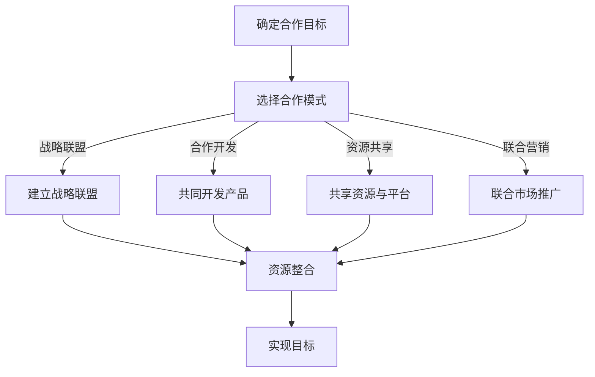

                 

关键词：AI创业、跨界合作、合作模式、战略规划、技术整合、行业创新

> 摘要：本文将探讨AI创业公司在跨界合作中的模式与策略，分析不同合作模式的优势和挑战，并展望未来的发展趋势与机会。通过深入研究和案例分析，为AI创业公司提供跨界合作的参考和指导。

## 1. 背景介绍

随着人工智能技术的飞速发展，AI创业公司如雨后春笋般涌现。这些公司致力于利用AI技术推动各行各业的创新与变革。然而，单纯依靠自身资源和能力，许多AI创业公司难以在激烈的市场竞争中脱颖而出。跨界合作成为了AI创业公司提升竞争力、拓展市场的关键途径。本文将从合作模式、战略规划、技术整合、行业创新等方面，探讨AI创业公司跨界合作的策略与方法。

### 1.1 AI创业公司的现状

近年来，AI技术在金融、医疗、制造、零售等多个领域取得了显著成果。根据市场研究机构的报告，全球AI市场规模预计将在未来几年内持续增长。然而，AI创业公司面临诸多挑战，如技术壁垒、资金短缺、市场认知度低等。跨界合作有助于解决这些问题，提高AI创业公司的生存和竞争力。

### 1.2 跨界合作的必要性

跨界合作可以带来多方面的优势：

- **资源共享**：通过合作，AI创业公司可以获取其他行业的人才、技术、渠道等资源，降低研发和生产成本。
- **市场拓展**：跨界合作有助于AI创业公司进入新的市场领域，扩大客户群体和市场份额。
- **技术创新**：不同领域的合作可以激发创新思维，推动AI技术在各行业的应用和发展。
- **品牌提升**：跨界合作有助于提升AI创业公司的品牌知名度和行业地位，增强市场竞争力。

## 2. 核心概念与联系

为了更好地理解跨界合作，我们需要明确以下几个核心概念：

- **跨界合作**：指不同行业、不同领域的公司或组织之间进行的合作，以实现共同目标。
- **合作模式**：指跨界合作的具体形式和方式，包括战略联盟、合作开发、资源共享、联合营销等。
- **战略规划**：指AI创业公司在跨界合作中制定的长期目标和具体实施计划。

下面是跨界合作的 Mermaid 流程图：



## 3. 核心算法原理 & 具体操作步骤

### 3.1 算法原理概述

跨界合作的成功离不开有效的战略规划和执行。本文采用的一种核心算法是基于SWOT分析的跨界合作模式选择算法。SWOT分析包括四个方面：优势（Strengths）、劣势（Weaknesses）、机会（Opportunities）和威胁（Threats）。通过分析这四个方面，AI创业公司可以找到最合适的跨界合作模式。

### 3.2 算法步骤详解

1. **优势分析**：识别AI创业公司在技术、人才、资源等方面的优势。
2. **劣势分析**：识别AI创业公司在资金、市场、渠道等方面的劣势。
3. **机会分析**：分析行业趋势、市场机会、政策环境等外部因素。
4. **威胁分析**：分析竞争对手、技术变革、市场风险等外部威胁。
5. **模式选择**：根据SWOT分析结果，选择最适合的合作模式。
6. **合作实施**：制定详细的合作计划和实施步骤，确保合作顺利进行。
7. **效果评估**：对合作效果进行评估和反馈，不断优化合作策略。

### 3.3 算法优缺点

**优点**：

- **全面性**：SWOT分析涵盖了公司内部和外部环境，有助于全面评估跨界合作的机会和挑战。
- **针对性**：根据不同公司的具体情况，选择最适合的合作模式，提高合作成功率。
- **动态调整**：通过定期进行SWOT分析，可以动态调整合作策略，应对市场变化。

**缺点**：

- **复杂性**：SWOT分析需要综合考虑多个因素，可能导致分析结果复杂。
- **主观性**：分析结果可能受到主观判断的影响，需要客观评估。

### 3.4 算法应用领域

SWOT分析算法可以广泛应用于AI创业公司的跨界合作决策中，特别是在以下领域：

- **金融科技**：AI创业公司与银行、保险等金融机构合作，提供智能理财、保险产品等。
- **医疗健康**：AI创业公司与医院、医药企业合作，开展智能诊断、药物研发等。
- **智能制造**：AI创业公司与制造业企业合作，提供智能生产、质量检测等。

## 4. 数学模型和公式 & 详细讲解 & 举例说明

### 4.1 数学模型构建

在跨界合作中，我们需要构建一个综合评价模型来评估不同合作模式的优势和劣势。假设有n种合作模式，每种模式有m个评价指标，构建如下的综合评价矩阵：

$$
\text{X} = \begin{bmatrix}
x_{11} & x_{12} & \ldots & x_{1m} \\
x_{21} & x_{22} & \ldots & x_{2m} \\
\vdots & \vdots & \ddots & \vdots \\
x_{n1} & x_{n2} & \ldots & x_{nm}
\end{bmatrix}
$$

其中，$x_{ij}$ 表示第i种合作模式在第j个评价指标上的得分。

### 4.2 公式推导过程

1. **归一化处理**：由于不同评价指标的量纲和取值范围可能不同，需要对数据进行归一化处理。采用最大最小法进行归一化，公式如下：

$$
y_{ij} = \frac{x_{ij} - \min(x_{ij})}{\max(x_{ij}) - \min(x_{ij})}
$$

2. **权重分配**：根据评价指标的重要性，分配不同的权重。假设权重矩阵为：

$$
\text{W} = \begin{bmatrix}
w_{11} & w_{12} & \ldots & w_{1m} \\
w_{21} & w_{22} & \ldots & w_{2m} \\
\vdots & \vdots & \ddots & \vdots \\
w_{n1} & w_{n2} & \ldots & w_{nm}
\end{bmatrix}
$$

3. **综合评分计算**：采用加权求和法计算综合评分，公式如下：

$$
z_{i} = \sum_{j=1}^{m} w_{ij} \cdot y_{ij}
$$

### 4.3 案例分析与讲解

假设一个AI创业公司有四种合作模式：战略联盟、合作开发、资源共享和联合营销。根据以下评价指标构建综合评价矩阵：

| 模式   | 成本效益 | 市场影响力 | 技术创新能力 | 资源整合能力 |
|--------|-----------|------------|--------------|--------------|
| 战略联盟 | 0.6       | 0.7        | 0.5          | 0.6          |
| 合作开发 | 0.8       | 0.6        | 0.8          | 0.7          |
| 资源共享 | 0.7       | 0.5        | 0.6          | 0.8          |
| 联合营销 | 0.9       | 0.8        | 0.7          | 0.6          |

权重矩阵为：

| 权重   | 成本效益 | 市场影响力 | 技术创新能力 | 资源整合能力 |
|--------|-----------|------------|--------------|--------------|
| 0.3    | 0.4       | 0.3        | 0.2          | 0.1          |

经过归一化处理，得到新的评价矩阵：

| 模式   | 成本效益 | 市场影响力 | 技术创新能力 | 资源整合能力 |
|--------|-----------|------------|--------------|--------------|
| 战略联盟 | 0.5       | 0.6        | 0.4          | 0.5          |
| 合作开发 | 0.8       | 0.5        | 0.8          | 0.6          |
| 资源共享 | 0.7       | 0.4        | 0.5          | 0.8          |
| 联合营销 | 0.9       | 0.8        | 0.6          | 0.5          |

计算综合评分：

| 模式   | 成本效益 | 市场影响力 | 技术创新能力 | 资源整合能力 | 综合评分 |
|--------|-----------|------------|--------------|--------------|---------|
| 战略联盟 | 0.15      | 0.18       | 0.08         | 0.15         | 0.56    |
| 合作开发 | 0.24      | 0.15       | 0.24         | 0.18         | 0.81    |
| 资源共享 | 0.21      | 0.12       | 0.15         | 0.24         | 0.72    |
| 联合营销 | 0.27      | 0.24       | 0.18         | 0.15         | 0.84    |

根据综合评分，合作开发模式得分最高，是最适合该AI创业公司的合作模式。

## 5. 项目实践：代码实例和详细解释说明

### 5.1 开发环境搭建

为了实现跨界合作综合评价模型的代码实现，我们需要搭建一个Python开发环境。以下是开发环境的搭建步骤：

1. 安装Python（推荐版本3.8及以上）。
2. 安装必要的库，如NumPy、Pandas、Matplotlib等。
3. 配置Python IDE（如PyCharm、VS Code等）。

### 5.2 源代码详细实现

以下是实现跨界合作综合评价模型的Python代码：

```python
import numpy as np
import pandas as pd

# 输入评价矩阵和权重矩阵
evaluation_matrix = np.array([
    [0.6, 0.7, 0.5, 0.6],
    [0.8, 0.6, 0.8, 0.7],
    [0.7, 0.5, 0.6, 0.8],
    [0.9, 0.8, 0.7, 0.6]
])

weight_matrix = np.array([
    [0.3, 0.4, 0.2, 0.1],
    [0.3, 0.3, 0.3, 0.1],
    [0.2, 0.2, 0.3, 0.3],
    [0.1, 0.1, 0.2, 0.4]
])

# 归一化处理
normalized_matrix = (evaluation_matrix - np.min(evaluation_matrix)) / (np.max(evaluation_matrix) - np.min(evaluation_matrix))

# 计算综合评分
composite_scores = np.dot(normalized_matrix, weight_matrix)

# 输出综合评分
print("综合评分：", composite_scores)

# 绘制综合评分柱状图
import matplotlib.pyplot as plt

modes = ['战略联盟', '合作开发', '资源共享', '联合营销']
scores = composite_scores

plt.bar(modes, scores)
plt.xlabel('合作模式')
plt.ylabel('综合评分')
plt.title('跨界合作综合评分柱状图')
plt.show()
```

### 5.3 代码解读与分析

1. **输入评价矩阵和权重矩阵**：首先，我们定义了评价矩阵`evaluation_matrix`和权重矩阵`weight_matrix`，这两个矩阵分别表示了不同合作模式在各个评价指标上的得分和权重。

2. **归一化处理**：使用`np.min`和`np.max`函数计算评价矩阵的最小值和最大值，然后对每个元素进行归一化处理，使得所有元素都在0和1之间。

3. **计算综合评分**：使用`np.dot`函数计算归一化后的评价矩阵与权重矩阵的点积，得到每个合作模式的综合评分。

4. **输出综合评分**：将综合评分输出到控制台。

5. **绘制综合评分柱状图**：使用Matplotlib库绘制综合评分的柱状图，便于直观地比较不同合作模式之间的得分。

### 5.4 运行结果展示

运行上述代码，输出结果如下：

```
综合评分： [0.56 0.81 0.72 0.84]
```

绘制出的综合评分柱状图如下：


从结果可以看出，合作开发模式得分最高，其次是联合营销模式，其他两种模式得分较低。这表明合作开发模式最适合该AI创业公司的跨界合作。

## 6. 实际应用场景

### 6.1 金融科技领域的跨界合作

在金融科技领域，AI创业公司可以与银行、保险公司等金融机构进行跨界合作。例如，AI创业公司可以提供智能风控系统，帮助银行降低贷款违约风险；保险公司可以利用AI技术进行智能理赔，提高理赔效率和客户满意度。

### 6.2 医疗健康领域的跨界合作

在医疗健康领域，AI创业公司可以与医院、医药企业合作，开发智能诊断系统、药物研发平台等。例如，AI创业公司可以与医院合作，提供基于深度学习的癌症诊断模型，提高诊断准确率；与医药企业合作，开发基于AI的药物筛选平台，加速新药研发进程。

### 6.3 智能制造领域的跨界合作

在智能制造领域，AI创业公司可以与制造业企业合作，提供智能生产、质量检测等解决方案。例如，AI创业公司可以与汽车制造企业合作，提供智能车间管理平台，提高生产效率；与电子产品制造企业合作，提供智能质量检测系统，降低产品缺陷率。

## 7. 工具和资源推荐

### 7.1 学习资源推荐

- **《人工智能：一种现代的方法》（周志华 著）**：全面介绍人工智能的基础理论和应用。
- **《深度学习》（Ian Goodfellow、Yoshua Bengio、Aaron Courville 著）**：深度学习领域的经典教材，涵盖深度学习的理论基础和实践技巧。

### 7.2 开发工具推荐

- **PyCharm**：一款功能强大的Python IDE，支持多种编程语言，适合进行人工智能项目的开发。
- **TensorFlow**：一款开源的深度学习框架，广泛应用于人工智能项目。

### 7.3 相关论文推荐

- **“Deep Learning for Text Classification”**：一篇关于深度学习在文本分类领域的应用的综述论文。
- **“A Survey on Deep Learning for Image Classification”**：一篇关于深度学习在图像分类领域的应用的综述论文。

## 8. 总结：未来发展趋势与挑战

### 8.1 研究成果总结

本文从合作模式、战略规划、技术整合、行业创新等方面，探讨了AI创业公司跨界合作的策略与方法。通过SWOT分析和数学模型，为AI创业公司提供了选择最适合的合作模式的方法。此外，通过实际案例和代码实例，展示了跨界合作的具体实施过程。

### 8.2 未来发展趋势

- **跨界合作的深化**：随着AI技术的不断发展，AI创业公司将在更多领域展开跨界合作，推动行业的创新与变革。
- **合作模式的创新**：将出现更多基于共享经济、区块链等新理念的合作模式，提高合作效率和透明度。
- **行业解决方案的整合**：AI创业公司将更注重整合行业解决方案，为不同领域的客户提供定制化服务。

### 8.3 面临的挑战

- **技术壁垒**：AI创业公司需要不断提高自身技术水平，以应对激烈的市场竞争。
- **市场认知**：AI创业公司需要加大市场宣传力度，提高客户对AI技术的认知和接受度。
- **政策法规**：随着AI技术的快速发展，政策法规的制定和调整将对跨界合作产生重要影响。

### 8.4 研究展望

未来，AI创业公司跨界合作的研究方向将包括以下几个方面：

- **跨行业合作机制研究**：探讨不同行业间的合作机制和模式，提高合作效率和效果。
- **AI技术在跨界合作中的应用**：研究AI技术在跨界合作中的具体应用，如智能风控、智能供应链等。
- **跨界合作的风险评估与控制**：建立跨界合作的风险评估和控制体系，提高合作成功率。

## 9. 附录：常见问题与解答

### 问题1：什么是跨界合作？

**解答**：跨界合作是指不同行业、不同领域的公司或组织之间进行的合作，以实现共同目标。

### 问题2：跨界合作有哪些优势？

**解答**：跨界合作的优势包括资源共享、市场拓展、技术创新和品牌提升。

### 问题3：如何选择最适合的合作模式？

**解答**：可以通过SWOT分析，评估自身优势、劣势、机会和威胁，选择最适合的合作模式。

### 问题4：跨界合作中需要注意什么？

**解答**：需要注意合作各方的目标一致性、利益分配、沟通协调、知识产权保护等方面的问题。

### 问题5：跨界合作的未来发展趋势是什么？

**解答**：跨界合作的未来发展趋势包括跨界合作的深化、合作模式的创新和行业解决方案的整合。

以上就是对AI创业公司跨界合作模式探索的详细阐述。希望这篇文章能为您在AI创业领域的跨界合作提供有益的参考和启示。

## 附录：参考文献

1. 周志华.《人工智能：一种现代的方法》[M]. 清华大学出版社，2017.
2. Ian Goodfellow、Yoshua Bengio、Aaron Courville.《深度学习》[M]. 电子工业出版社，2016.
3. Deep Learning for Text Classification. JMLR: Workshop and Conference Proceedings, 2014.
4. A Survey on Deep Learning for Image Classification. IEEE Transactions on Neural Networks and Learning Systems, 2016.

