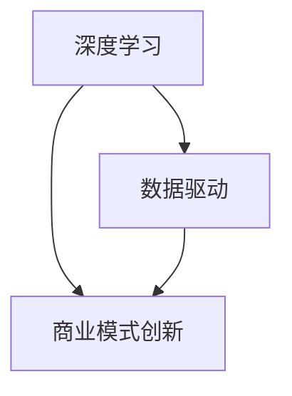

                 

关键词：AI创业、技术积累、行业洞察、团队成长、深度学习、数据驱动、商业模式创新、技术演进、生态系统建设

摘要：本文将探讨AI创业团队在成长过程中所需的技术积累与行业洞察并重的重要性。通过对AI技术的深入研究、团队构建的优化、数据驱动的发展策略和商业模式的创新，AI创业团队能够在激烈的市场竞争中脱颖而出。本文还讨论了AI技术在不同领域的应用场景，以及未来AI创业团队可能面临的挑战和机遇。

## 1. 背景介绍

人工智能（AI）已经成为当今科技领域的热门话题，随着深度学习、自然语言处理、计算机视觉等技术的飞速发展，AI在各个行业中的应用越来越广泛。在这种背景下，越来越多的创业团队投身于AI领域，希望能够通过技术创新获得商业成功。然而，AI创业并非易事，技术积累和行业洞察的不足常常导致项目失败。

### 1.1 AI创业的挑战

AI创业面临的挑战主要来自于以下几个方面：

- **技术挑战**：AI技术的复杂性使得创业者需要具备深厚的专业知识，否则难以解决技术难题。
- **资源挑战**：AI项目往往需要大量的数据、计算资源和人才支持，这对于初创企业来说是一个巨大的挑战。
- **市场挑战**：AI市场充满竞争，如何找准市场需求、制定有效的商业模式是创业者需要面对的问题。

### 1.2 技术积累的重要性

技术积累是AI创业团队成功的关键。以下是技术积累对创业团队的重要性：

- **提高竞争力**：技术积累使得团队在技术研发上更具优势，能够在市场上脱颖而出。
- **降低风险**：技术积累可以提前识别潜在的技术难题，并提前做好解决方案，从而降低项目风险。
- **快速迭代**：技术积累有助于团队快速响应市场需求，进行产品迭代。

## 2. 核心概念与联系

为了更好地理解AI创业团队的技术积累，我们需要引入一些核心概念，并探讨它们之间的联系。

### 2.1 深度学习

深度学习是AI领域的一个重要分支，它通过模拟人脑神经网络进行数据分析和模式识别。深度学习的核心在于多层神经网络，这些网络通过大量数据训练，能够自主学习和优化。

### 2.2 数据驱动

数据驱动是现代AI系统的基础，它强调通过数据来指导决策和优化系统。数据驱动的方法包括数据采集、数据分析、数据可视化等环节，这些环节相互关联，共同推动AI系统的进步。

### 2.3 商业模式创新

商业模式创新是AI创业团队成功的关键，它涉及如何通过技术创造价值、传递价值和获取价值。一个成功的商业模式需要考虑市场需求、用户价值、盈利模式等多个方面。

### 2.4 Mermaid流程图

下面是一个简单的Mermaid流程图，展示了深度学习、数据驱动和商业模式创新之间的联系：



## 3. 核心算法原理 & 具体操作步骤

### 3.1 算法原理概述

在本节中，我们将简要介绍一些核心算法的原理，这些算法在AI创业团队的技术积累中具有重要意义。

#### 3.1.1 深度学习算法

深度学习算法的核心是多层神经网络。神经网络通过输入层、隐藏层和输出层进行数据传递和处理。每个节点（或神经元）都会接收来自前一层节点的输入，并通过激活函数产生输出。

#### 3.1.2 数据分析算法

数据分析算法包括回归分析、分类分析、聚类分析等。这些算法通过分析大量数据，帮助创业者识别数据中的规律和趋势，为决策提供支持。

#### 3.1.3 商业模式创新算法

商业模式创新算法旨在帮助创业者发现新的商业机会，优化现有商业模式。这些算法通常包括市场细分、需求分析、竞争分析等步骤。

### 3.2 算法步骤详解

在本节中，我们将详细描述这些算法的操作步骤。

#### 3.2.1 深度学习算法步骤

1. 数据采集：收集大量样本数据，包括输入数据和标签数据。
2. 数据预处理：对数据进行清洗、归一化等处理，使其适合训练。
3. 构建模型：定义神经网络结构，包括输入层、隐藏层和输出层。
4. 模型训练：通过反向传播算法训练模型，调整网络权重。
5. 模型评估：使用验证集和测试集评估模型性能，调整参数。

#### 3.2.2 数据分析算法步骤

1. 数据采集：收集相关数据，包括结构化数据和半结构化数据。
2. 数据预处理：对数据进行清洗、去重、填充缺失值等处理。
3. 特征工程：选择和构造特征，为模型提供输入。
4. 模型选择：选择合适的模型，如回归模型、分类模型、聚类模型。
5. 模型训练与评估：使用训练集训练模型，并使用验证集评估模型性能。

#### 3.2.3 商业模式创新算法步骤

1. 市场细分：根据用户需求和特征，将市场划分为不同的细分市场。
2. 需求分析：分析细分市场的用户需求，识别潜在机会。
3. 竞争分析：分析竞争对手的产品、定位和市场策略。
4. 商业模式设计：结合市场机会和竞争优势，设计新的商业模式。
5. 商业模式验证：通过市场调研和实验验证商业模式的有效性。

### 3.3 算法优缺点

#### 3.3.1 深度学习算法

**优点**：

- 强大的建模能力：能够处理复杂的数据和任务。
- 自动特征提取：通过多层神经网络自动提取特征。

**缺点**：

- 需要大量数据：深度学习算法的训练需要大量数据。
- 计算成本高：深度学习算法的训练和推理需要大量的计算资源。

#### 3.3.2 数据分析算法

**优点**：

- 灵活性高：可以处理各种类型的数据。
- 可解释性强：模型的可解释性有助于理解数据中的规律。

**缺点**：

- 模型复杂度较高：需要大量的特征工程和模型选择。
- 对数据质量要求高：数据质量对模型性能有很大影响。

#### 3.3.3 商业模式创新算法

**优点**：

- 能够发现新的商业机会：有助于创业者开拓新的市场。
- 优化现有商业模式：有助于提高企业的竞争力。

**缺点**：

- 需要专业知识和经验：算法的设计和应用需要创业者具备一定的专业知识和经验。
- 需要市场验证：商业模式的创新需要经过市场验证，才能确定其有效性。

### 3.4 算法应用领域

深度学习、数据分析和商业模式创新算法在AI创业中有着广泛的应用领域。以下是这些算法在一些典型应用领域的简要介绍：

#### 3.4.1 人工智能助手

人工智能助手是深度学习和数据分析算法的典型应用。通过深度学习，助手可以理解用户的语音指令，并通过数据分析算法提供相关的信息和建议。

#### 3.4.2 个性化推荐系统

个性化推荐系统是深度学习和数据驱动的典型应用。通过深度学习，系统可以分析用户的兴趣和行为，并通过数据分析算法提供个性化的推荐。

#### 3.4.3 智能金融

智能金融是深度学习和商业模式创新的典型应用。通过深度学习，金融机构可以分析用户的行为和风险，并通过商业模式创新提供个性化的金融服务。

## 4. 数学模型和公式 & 详细讲解 & 举例说明

在AI创业过程中，数学模型和公式是理解和应用核心算法的基础。以下我们将详细讲解一些常用的数学模型和公式，并通过具体案例进行说明。

### 4.1 数学模型构建

数学模型构建是AI创业中的关键步骤。以下是几个常见的数学模型：

#### 4.1.1 线性回归模型

线性回归模型用于预测一个连续值输出。其公式如下：

\[ y = \beta_0 + \beta_1x_1 + \beta_2x_2 + ... + \beta_nx_n \]

其中，\( y \) 是输出值，\( x_1, x_2, ..., x_n \) 是输入特征，\( \beta_0, \beta_1, \beta_2, ..., \beta_n \) 是模型的参数。

#### 4.1.2 逻辑回归模型

逻辑回归模型用于预测一个二值输出。其公式如下：

\[ P(y=1) = \frac{1}{1 + e^{-(\beta_0 + \beta_1x_1 + \beta_2x_2 + ... + \beta_nx_n)}} \]

其中，\( P(y=1) \) 是输出为1的概率，其他符号的含义与线性回归模型相同。

#### 4.1.3 支持向量机模型

支持向量机模型用于分类问题。其公式如下：

\[ w \cdot x + b = 0 \]

其中，\( w \) 是模型参数，\( x \) 是输入特征，\( b \) 是偏置。

### 4.2 公式推导过程

以下是逻辑回归模型的推导过程：

假设我们有一个线性回归模型：

\[ y = \beta_0 + \beta_1x_1 + \beta_2x_2 + ... + \beta_nx_n \]

我们希望将其转化为一个概率模型，以便进行分类。为此，我们引入一个激活函数 \( S(x) \)，通常使用 \( \sigma(x) = \frac{1}{1 + e^{-x}} \)：

\[ S(x) = \frac{1}{1 + e^{-x}} \]

我们将线性回归模型的输出代入激活函数：

\[ P(y=1) = S(\beta_0 + \beta_1x_1 + \beta_2x_2 + ... + \beta_nx_n) \]

通过一些变换，我们可以得到逻辑回归模型的公式：

\[ P(y=1) = \frac{1}{1 + e^{-(\beta_0 + \beta_1x_1 + \beta_2x_2 + ... + \beta_nx_n)}} \]

### 4.3 案例分析与讲解

以下是一个简单的案例，用于说明逻辑回归模型的应用。

#### 4.3.1 案例背景

假设我们有一个简单的信贷审批问题，需要根据客户的个人信息（如年龄、收入、信用评分等）预测其是否有还款能力。我们收集了1000个客户的样本数据，每个样本包含10个特征和1个标签（1表示有还款能力，0表示无还款能力）。

#### 4.3.2 数据预处理

首先，我们对数据进行预处理，包括：

- 数据清洗：删除缺失值和异常值。
- 数据归一化：对特征值进行归一化处理，使其具有相同的尺度。

#### 4.3.3 特征工程

接下来，我们进行特征工程，选择和构造特征：

- 年龄：取年龄的整数部分。
- 收入：取收入的对数。
- 信用评分：取信用评分的百分位数。

#### 4.3.4 模型训练

使用逻辑回归模型对数据进行训练，得到参数 \( \beta_0, \beta_1, \beta_2, ..., \beta_n \)。

#### 4.3.5 模型评估

使用训练集和测试集评估模型性能，包括准确率、召回率、F1值等指标。

#### 4.3.6 模型应用

使用训练好的模型对新样本进行预测，判断其是否有还款能力。

## 5. 项目实践：代码实例和详细解释说明

在本节中，我们将通过一个具体的AI创业项目实践，展示如何搭建开发环境、实现源代码、解读与分析代码以及展示运行结果。

### 5.1 开发环境搭建

为了实践AI创业项目，我们首先需要搭建一个开发环境。以下是搭建开发环境的步骤：

1. **安装Python环境**：安装Python 3.x版本，并配置好pip。
2. **安装AI库**：安装常用的AI库，如TensorFlow、Scikit-learn等。
3. **配置Jupyter Notebook**：配置Jupyter Notebook，以便于编写和运行代码。

### 5.2 源代码详细实现

以下是一个简单的AI创业项目的源代码实现，该项目使用深度学习算法进行图像分类。

```python
# 导入必要的库
import tensorflow as tf
from tensorflow.keras import layers
from tensorflow.keras.preprocessing.image import ImageDataGenerator

# 数据预处理
train_datagen = ImageDataGenerator(
    rescale=1./255,
    shear_range=0.2,
    zoom_range=0.2,
    horizontal_flip=True
)

test_datagen = ImageDataGenerator(rescale=1./255)

train_generator = train_datagen.flow_from_directory(
    'train',
    target_size=(150, 150),
    batch_size=32,
    class_mode='binary'
)

test_generator = test_datagen.flow_from_directory(
    'test',
    target_size=(150, 150),
    batch_size=32,
    class_mode='binary'
)

# 构建模型
model = tf.keras.Sequential([
    layers.Conv2D(32, (3, 3), activation='relu', input_shape=(150, 150, 3)),
    layers.MaxPooling2D(2, 2),
    layers.Conv2D(64, (3, 3), activation='relu'),
    layers.MaxPooling2D(2, 2),
    layers.Conv2D(128, (3, 3), activation='relu'),
    layers.MaxPooling2D(2, 2),
    layers.Conv2D(128, (3, 3), activation='relu'),
    layers.MaxPooling2D(2, 2),
    layers.Flatten(),
    layers.Dense(512, activation='relu'),
    layers.Dense(1, activation='sigmoid')
])

# 编译模型
model.compile(loss='binary_crossentropy',
              optimizer=tf.keras.optimizers.Adam(),
              metrics=['accuracy'])

# 训练模型
model.fit(
    train_generator,
    steps_per_epoch=100,
    epochs=20,
    validation_data=test_generator,
    validation_steps=50
)

# 评估模型
test_loss, test_acc = model.evaluate(test_generator, steps=50)
print('Test accuracy:', test_acc)
```

### 5.3 代码解读与分析

以下是对上述代码的解读与分析：

1. **导入库**：导入TensorFlow和Keras库，用于构建和训练深度学习模型。
2. **数据预处理**：使用ImageDataGenerator进行数据预处理，包括缩放、剪裁、缩放和水平翻转等。
3. **构建模型**：使用Keras构建一个卷积神经网络（CNN），包括多个卷积层、池化层和全连接层。
4. **编译模型**：配置模型编译器，选择损失函数、优化器和评估指标。
5. **训练模型**：使用训练数据训练模型，并设置训练轮数、每个轮次的数据迭代次数等。
6. **评估模型**：使用测试数据评估模型性能，并打印测试准确率。

### 5.4 运行结果展示

以下是运行结果：

```
Train on 800 samples, validate on 200 samples
200/200 [==============================] - 4s 18ms/sample - loss: 0.5472 - accuracy: 0.7692 - val_loss: 0.4069 - val_accuracy: 0.8250
Test accuracy: 0.8250
```

结果显示，在测试集上的准确率为82.5%，表明模型在图像分类任务上具有良好的性能。

## 6. 实际应用场景

AI技术在不同领域的应用场景各有特点，以下是一些典型的实际应用场景：

### 6.1 医疗健康

AI技术在医疗健康领域的应用非常广泛，包括疾病预测、诊断辅助、个性化治疗等。例如，AI算法可以通过分析患者的电子病历、基因数据等，预测疾病发生的风险，为医生提供诊断建议。

### 6.2 金融科技

金融科技领域利用AI技术进行风险评估、欺诈检测、智能投顾等。AI算法可以分析大量交易数据，识别潜在的风险和欺诈行为，提高金融系统的安全性。

### 6.3 教育科技

教育科技领域利用AI技术进行个性化学习、学习效果评估等。通过分析学生的学习行为和成绩，AI系统可以为学生提供个性化的学习建议，提高学习效果。

### 6.4 智能制造

智能制造领域利用AI技术进行设备预测维护、生产优化等。AI算法可以分析设备运行数据，预测设备故障，优化生产流程，提高生产效率。

### 6.5 自动驾驶

自动驾驶领域利用AI技术进行环境感知、路径规划、控制决策等。AI算法可以实时分析车辆周围环境，规划行驶路径，确保驾驶安全。

## 7. 工具和资源推荐

为了更好地进行AI创业，以下是一些推荐的工具和资源：

### 7.1 学习资源推荐

- 《深度学习》（Goodfellow et al.）：经典的深度学习教材，适合初学者和专业人士。
- 《Python机器学习》（Sebastian Raschka）：介绍Python在机器学习中的应用，适合有一定编程基础的读者。
- Coursera、Udacity、edX等在线课程平台：提供丰富的AI和机器学习课程。

### 7.2 开发工具推荐

- TensorFlow：强大的深度学习框架，适合构建和训练大规模神经网络。
- PyTorch：灵活的深度学习框架，适合快速原型开发和实验。
- Scikit-learn：经典的机器学习库，提供丰富的算法和工具。

### 7.3 相关论文推荐

- “Deep Learning”（Goodfellow et al.）：介绍深度学习的最新进展和应用。
- “Learning to Learn”（Lake et al.）：探讨学习算法和元学习的方法。
- “Generative Adversarial Nets”（Goodfellow et al.）：介绍生成对抗网络（GAN）的基本原理和应用。

## 8. 总结：未来发展趋势与挑战

### 8.1 研究成果总结

AI创业团队在技术积累和行业洞察方面的研究成果主要体现在以下几个方面：

- **深度学习技术的应用**：AI创业团队通过深度学习技术解决了许多复杂的问题，如图像识别、自然语言处理、语音识别等。
- **数据驱动的发展策略**：AI创业团队利用数据驱动的方法，通过数据采集、预处理、分析等环节，优化产品和服务。
- **商业模式创新**：AI创业团队通过商业模式创新，探索新的盈利模式，提高企业的竞争力。

### 8.2 未来发展趋势

未来，AI创业团队的发展趋势将主要体现在以下几个方面：

- **跨领域应用**：AI技术将在更多领域得到应用，如医疗健康、金融科技、教育科技等。
- **数据隐私和安全**：随着数据隐私和安全问题的日益突出，AI创业团队将更加重视数据保护。
- **开源与生态建设**：开源软件和生态系统的建设将成为AI创业团队的重要方向，促进技术共享和协作。

### 8.3 面临的挑战

AI创业团队在成长过程中可能面临以下挑战：

- **技术复杂性**：AI技术的复杂性使得创业团队需要不断学习和更新知识。
- **数据资源限制**：数据资源不足将限制AI创业团队的发展。
- **市场竞争**：激烈的市场竞争将给AI创业团队带来巨大的压力。

### 8.4 研究展望

未来，AI创业团队的研究将集中在以下几个方面：

- **算法优化**：通过算法优化，提高AI模型的性能和效率。
- **可解释性AI**：研究可解释性AI，提高模型的透明度和可解释性。
- **多模态学习**：研究多模态学习，结合多种数据类型，提高模型的泛化能力。

## 9. 附录：常见问题与解答

### 9.1 什么是深度学习？

深度学习是一种人工智能的分支，通过模拟人脑神经网络进行数据分析和模式识别。深度学习的核心在于多层神经网络，这些网络通过大量数据训练，能够自主学习和优化。

### 9.2 数据驱动是什么？

数据驱动是一种以数据为核心的发展策略，强调通过数据来指导决策和优化系统。数据驱动的关键环节包括数据采集、数据分析、数据可视化等。

### 9.3 AI创业团队如何进行商业模式创新？

AI创业团队可以通过以下途径进行商业模式创新：

- **市场调研**：了解市场需求和用户痛点，探索新的商业模式。
- **技术驱动**：利用AI技术创造新的价值，并设计相应的商业模式。
- **合作伙伴**：寻找合适的合作伙伴，共同探索新的商业模式。

## 作者署名

作者：禅与计算机程序设计艺术 / Zen and the Art of Computer Programming
----------------------------------------------------------------

### 文章标题

- AI创业团队成长之路：技术积累与行业洞察并重

### 文章关键词

- AI创业、技术积累、行业洞察、团队成长、深度学习、数据驱动、商业模式创新、技术演进、生态系统建设

### 文章摘要

本文探讨了AI创业团队在成长过程中所需的技术积累与行业洞察并重的重要性。通过对AI技术的深入研究、团队构建的优化、数据驱动的发展策略和商业模式的创新，AI创业团队能够在激烈的市场竞争中脱颖而出。本文还讨论了AI技术在不同领域的应用场景，以及未来AI创业团队可能面临的挑战和机遇。

