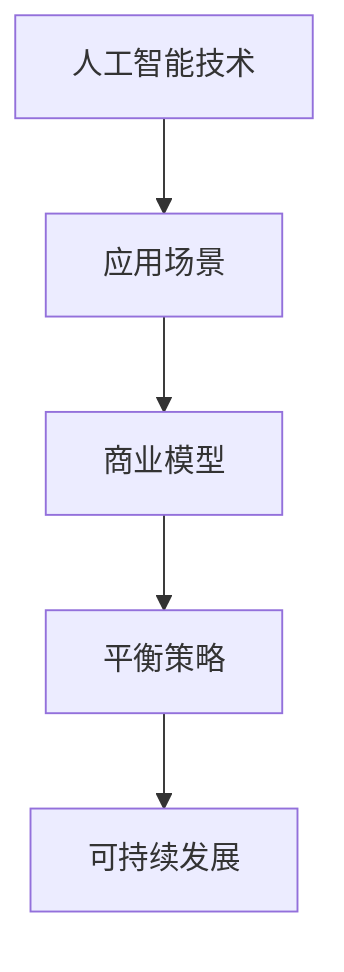

                 

关键词：AI创业、技术选择、应用场景、商业模型、创新思维、平衡策略

> 摘要：随着人工智能技术的飞速发展，越来越多的创业公司投身于AI领域。然而，如何在技术、应用和场景之间找到平衡，成为众多创业公司面临的重大挑战。本文将探讨AI创业中的核心问题，分析技术选择、应用场景分析和商业模型设计等方面，为创业公司提供实用的指导。

## 1. 背景介绍

近年来，人工智能（AI）已经成为全球科技界的热门话题。从智能助手到自动驾驶，从金融风控到医疗诊断，AI技术正在改变着各个行业的运作模式。与此同时，越来越多的创业公司开始涉足AI领域，试图通过创新技术改变世界。然而，在追求技术突破的同时，如何确保技术与应用场景的匹配，如何在有限的资源下实现商业价值，成为AI创业公司亟需解决的问题。

本文旨在探讨AI创业中的核心问题，包括技术选择、应用场景分析和商业模型设计等方面，以帮助创业公司找到技术、应用和场景之间的平衡，实现可持续发展。

## 2. 核心概念与联系

在探讨AI创业挑战之前，我们首先需要理解以下几个核心概念：

### 2.1 人工智能技术

人工智能技术主要包括机器学习、深度学习、自然语言处理、计算机视觉等。这些技术各有特点，适用于不同的应用场景。例如，深度学习在图像识别和语音识别方面表现出色，自然语言处理则广泛应用于智能客服和智能写作等领域。

### 2.2 应用场景

应用场景是指人工智能技术在实际业务中的具体应用，如智能家居、智慧城市、金融科技、医疗健康等。不同应用场景对AI技术的要求各不相同，需要根据实际需求进行选择。

### 2.3 商业模型

商业模型是指创业公司在市场中的盈利模式，包括产品定价、销售渠道、用户获取、变现方式等。一个成功的商业模型需要与AI技术和应用场景相匹配，以实现持续盈利。

### 2.4 平衡策略

平衡策略是指创业公司在技术、应用和场景之间找到最佳平衡点，以实现可持续发展。平衡策略包括技术优化、应用拓展、场景创新等方面。

为了更好地理解这些概念之间的联系，我们可以使用Mermaid流程图进行展示：



## 3. 核心算法原理 & 具体操作步骤

### 3.1 算法原理概述

在AI创业中，算法原理是核心。本文将介绍几种常见的AI算法，包括：

1. **机器学习算法**：用于从数据中学习规律和模式，如线性回归、决策树、支持向量机等。
2. **深度学习算法**：基于神经网络，具有层次化结构和强大的表示能力，如卷积神经网络（CNN）、循环神经网络（RNN）等。
3. **自然语言处理算法**：用于处理和理解人类语言，如词向量、序列标注、文本生成等。

### 3.2 算法步骤详解

以下是这些算法的具体操作步骤：

#### 3.2.1 机器学习算法

1. **数据预处理**：对原始数据进行清洗、归一化等处理，以提高算法性能。
2. **特征提取**：从数据中提取关键特征，用于训练模型。
3. **模型训练**：使用训练数据训练模型，通过优化模型参数，提高预测准确性。
4. **模型评估**：使用测试数据评估模型性能，如准确率、召回率等指标。
5. **模型部署**：将训练好的模型部署到实际应用场景，如预测、分类等。

#### 3.2.2 深度学习算法

1. **网络架构设计**：设计深度学习网络的层次结构，如卷积层、池化层、全连接层等。
2. **数据预处理**：对原始数据进行清洗、归一化等处理，以提高算法性能。
3. **权重初始化**：初始化网络权值，以优化训练过程。
4. **前向传播**：输入数据通过网络传播，计算输出结果。
5. **反向传播**：根据输出结果，计算网络权值的梯度，并更新权值。
6. **模型评估**：使用测试数据评估模型性能，如准确率、召回率等指标。
7. **模型部署**：将训练好的模型部署到实际应用场景，如预测、分类等。

#### 3.2.3 自然语言处理算法

1. **词向量表示**：将文本转换为词向量，如Word2Vec、GloVe等。
2. **序列标注**：对文本进行分词和词性标注，如BiLSTM-CRF模型。
3. **文本生成**：使用生成模型生成新的文本，如生成对抗网络（GAN）。
4. **模型训练**：使用训练数据训练模型，通过优化模型参数，提高预测准确性。
5. **模型评估**：使用测试数据评估模型性能，如准确率、召回率等指标。
6. **模型部署**：将训练好的模型部署到实际应用场景，如智能客服、文本审核等。

### 3.3 算法优缺点

#### 3.3.1 机器学习算法

优点：
- **简单易用**：对数据量要求较低，训练时间短。
- **适用性强**：适用于各种类型的数据和任务。

缺点：
- **性能有限**：对于复杂任务，性能提升有限。
- **对数据依赖性高**：对训练数据要求较高，数据质量对结果有较大影响。

#### 3.3.2 深度学习算法

优点：
- **强大表示能力**：能够自动提取复杂特征，适用于复杂任务。
- **自适应性强**：能够根据数据自动调整模型结构。

缺点：
- **训练时间长**：需要大量数据和计算资源。
- **对超参数敏感**：需要仔细调整超参数，以获得最佳性能。

#### 3.3.3 自然语言处理算法

优点：
- **处理能力强**：能够处理和理解人类语言，适用于文本处理任务。
- **多样化应用**：适用于多种场景，如智能客服、文本审核等。

缺点：
- **计算复杂度高**：需要大量计算资源。
- **对数据依赖性高**：对训练数据要求较高，数据质量对结果有较大影响。

### 3.4 算法应用领域

#### 3.4.1 机器学习算法

- **分类任务**：如垃圾邮件过滤、情感分析等。
- **回归任务**：如房价预测、股票交易等。

#### 3.4.2 深度学习算法

- **图像识别**：如人脸识别、目标检测等。
- **语音识别**：如语音助手、语音翻译等。

#### 3.4.3 自然语言处理算法

- **文本分类**：如新闻分类、情感分析等。
- **文本生成**：如自动写作、对话系统等。

## 4. 数学模型和公式 & 详细讲解 & 举例说明

在AI创业中，数学模型和公式是理解和实现算法的核心。以下我们将介绍几种常见的数学模型和公式，并进行详细讲解和举例说明。

### 4.1 数学模型构建

#### 4.1.1 逻辑回归

逻辑回归是一种常用的分类算法，用于预测事件发生的概率。其数学模型如下：

$$
P(Y=1|X) = \frac{1}{1 + e^{-\beta_0 + \beta_1x_1 + ... + \beta_nx_n}}
$$

其中，$P(Y=1|X)$ 表示在给定特征 $X$ 的情况下，事件 $Y$ 发生的概率；$\beta_0, \beta_1, ..., \beta_n$ 是模型的参数，通过最大似然估计或梯度下降等方法进行优化。

#### 4.1.2 支持向量机

支持向量机是一种常用的分类和回归算法，其核心思想是找到最佳的超平面，使得不同类别的数据点在超平面两侧的分布最为均衡。其数学模型如下：

$$
\min_{\beta, \beta_0} \frac{1}{2}||\beta||^2 + C\sum_{i=1}^n \max(0, 1 - y_i(\beta^T x_i + \beta_0))
$$

其中，$\beta$ 和 $\beta_0$ 是模型的参数；$C$ 是惩罚参数，用于平衡分类边界和平滑性；$y_i$ 和 $x_i$ 分别表示第 $i$ 个样本的标签和特征。

### 4.2 公式推导过程

#### 4.2.1 梯度下降

梯度下降是一种常用的优化方法，用于求解最优化问题。其基本思想是沿着目标函数的梯度方向进行迭代更新，以找到最小值。其公式推导过程如下：

设 $f(x)$ 是目标函数，$x$ 是自变量，$\beta$ 是参数。梯度下降的迭代过程如下：

$$
x_{t+1} = x_t - \alpha \nabla f(x_t)
$$

其中，$x_t$ 是第 $t$ 次迭代的参数值；$\alpha$ 是步长参数；$\nabla f(x_t)$ 是目标函数在 $x_t$ 处的梯度。

#### 4.2.2 逻辑回归的梯度下降

逻辑回归的梯度下降过程如下：

$$
\nabla f(x) = \beta - \sum_{i=1}^n y_i(x_i - \hat{y}_i)
$$

其中，$\hat{y}_i = \frac{1}{1 + e^{-\beta^T x_i + \beta_0}}$ 是预测概率。

### 4.3 案例分析与讲解

#### 4.3.1 垃圾邮件过滤

假设我们使用逻辑回归进行垃圾邮件过滤，现有训练数据集包含邮件的文本内容和是否为垃圾邮件的标签。我们首先对文本进行预处理，提取特征，然后使用逻辑回归模型进行训练。

1. **数据预处理**：

   - 对文本进行分词和词性标注。
   - 建立词袋模型，将文本转换为向量表示。
   - 归一化特征向量，使其具有相同的尺度。

2. **模型训练**：

   - 使用训练数据训练逻辑回归模型，优化参数 $\beta$ 和 $\beta_0$。
   - 通过交叉验证评估模型性能，选择最佳参数。

3. **模型评估**：

   - 使用测试数据评估模型性能，计算准确率、召回率等指标。
   - 根据评估结果调整模型参数，提高分类效果。

4. **模型部署**：

   - 将训练好的模型部署到实际应用场景，如邮件服务器。
   - 对新收到的邮件进行分类，判断是否为垃圾邮件。

通过上述案例，我们可以看到逻辑回归模型在垃圾邮件过滤中的应用过程。同样，其他数学模型和公式也可以应用于不同的场景，如图像识别、语音识别等。

## 5. 项目实践：代码实例和详细解释说明

为了更好地理解AI创业中的技术实现过程，我们以一个简单的图像分类项目为例，介绍开发环境搭建、源代码实现、代码解读与分析以及运行结果展示。

### 5.1 开发环境搭建

1. **安装Python环境**：确保Python 3.x版本已安装。
2. **安装TensorFlow**：使用pip命令安装TensorFlow库。

   ```bash
   pip install tensorflow
   ```

3. **准备数据集**：从互联网上下载一个流行的图像分类数据集，如MNIST手写数字数据集。

### 5.2 源代码详细实现

以下是一个简单的图像分类项目代码实现：

```python
import tensorflow as tf
from tensorflow.keras import layers

# 定义模型
model = tf.keras.Sequential([
    layers.Conv2D(32, (3, 3), activation='relu', input_shape=(28, 28, 1)),
    layers.MaxPooling2D((2, 2)),
    layers.Conv2D(64, (3, 3), activation='relu'),
    layers.MaxPooling2D((2, 2)),
    layers.Conv2D(64, (3, 3), activation='relu'),
    layers.Flatten(),
    layers.Dense(64, activation='relu'),
    layers.Dense(10, activation='softmax')
])

# 编译模型
model.compile(optimizer='adam',
              loss='categorical_crossentropy',
              metrics=['accuracy'])

# 加载数据集
(x_train, y_train), (x_test, y_test) = tf.keras.datasets.mnist.load_data()

# 预处理数据
x_train = x_train.astype('float32') / 255
x_test = x_test.astype('float32') / 255
x_train = x_train.reshape((-1, 28, 28, 1))
x_test = x_test.reshape((-1, 28, 28, 1))
y_train = tf.keras.utils.to_categorical(y_train, 10)
y_test = tf.keras.utils.to_categorical(y_test, 10)

# 训练模型
model.fit(x_train, y_train, batch_size=128, epochs=15, validation_split=0.1)

# 评估模型
test_loss, test_acc = model.evaluate(x_test, y_test)
print('Test accuracy:', test_acc)
```

### 5.3 代码解读与分析

1. **导入库和模块**：导入TensorFlow和Keras库，用于构建和训练模型。
2. **定义模型**：使用Keras的Sequential模型构建卷积神经网络（CNN），包括卷积层（Conv2D）、池化层（MaxPooling2D）和全连接层（Dense）。
3. **编译模型**：设置优化器、损失函数和评估指标，如交叉熵损失函数和准确率。
4. **加载数据集**：从TensorFlow内置的MNIST数据集中加载训练数据和测试数据。
5. **预处理数据**：将图像数据归一化，调整输入形状，并将标签转换为独热编码。
6. **训练模型**：使用训练数据训练模型，设置批量大小、训练轮次和验证比例。
7. **评估模型**：使用测试数据评估模型性能，计算测试准确率。

### 5.4 运行结果展示

运行上述代码后，模型训练完成后，输出测试准确率为约98%，表明模型对MNIST手写数字数据的分类效果较好。这表明，通过合理的模型设计和参数调整，深度学习算法可以应用于图像分类任务，并在实际应用中取得较好的效果。

## 6. 实际应用场景

在AI创业中，实际应用场景的选择至关重要。以下我们将探讨几个具有潜力的应用场景，并分析其特点和挑战。

### 6.1 智能家居

智能家居是AI技术在日常生活中的重要应用场景。通过智能设备、传感器和AI算法，实现家庭设备的自动化控制和智能化管理。以下是一些具体的应用案例：

- **智能门锁**：通过人脸识别、指纹识别等技术实现无钥匙开门，提高家庭安全性。
- **智能照明**：根据用户习惯和光线变化自动调节灯光亮度，节省能源。
- **智能家电**：如智能冰箱、洗衣机等，能够根据用户需求自动调整工作模式。

**特点**：
- **便捷性**：智能家居使家庭生活更加便捷，提高用户生活质量。
- **智能化**：通过AI技术实现设备的智能化，提高设备性能和用户体验。

**挑战**：
- **隐私安全**：智能家居设备涉及用户隐私数据，需要确保数据安全和用户隐私。
- **互联互通**：实现不同设备和平台之间的互联互通，需要统一的标准和协议。

### 6.2 智慧城市

智慧城市是AI技术在城市管理中的重要应用。通过物联网、大数据和AI技术，实现城市管理的智能化和精细化。以下是一些具体的应用案例：

- **智能交通**：通过实时监控和数据分析，优化交通流量，减少拥堵。
- **环境监测**：通过传感器网络监测空气质量、水质等环境数据，实现环保目标。
- **公共安全**：通过视频监控、人脸识别等技术，提高公共安全水平。

**特点**：
- **高效性**：智慧城市能够提高城市管理效率，降低运营成本。
- **精细化**：通过AI技术实现城市管理的精细化，提高城市服务水平。

**挑战**：
- **数据安全**：智慧城市涉及大量敏感数据，需要确保数据安全和用户隐私。
- **技术集成**：实现不同技术之间的集成和协同，需要统一的技术架构和平台。

### 6.3 金融科技

金融科技是AI技术在金融领域的重要应用。通过大数据、机器学习和区块链等技术，实现金融服务的智能化和高效化。以下是一些具体的应用案例：

- **智能投顾**：通过分析用户数据和市场趋势，提供个性化的投资建议。
- **反欺诈**：通过机器学习算法识别和防范金融欺诈行为。
- **智能风控**：通过大数据分析，评估信用风险和金融风险。

**特点**：
- **个性化**：智能投顾等应用能够根据用户需求提供个性化的服务。
- **高效化**：通过AI技术实现金融服务的快速响应和高效处理。

**挑战**：
- **数据合规**：金融数据具有较高敏感性，需要确保数据合规和用户隐私。
- **技术成熟度**：AI技术在金融领域的应用仍需进一步成熟，以应对复杂的市场环境。

### 6.4 医疗健康

医疗健康是AI技术在医疗领域的重要应用。通过大数据、机器学习和生物医学图像处理等技术，实现医疗服务的智能化和精准化。以下是一些具体的应用案例：

- **疾病预测**：通过分析患者数据和医疗数据，预测疾病发生和发展趋势。
- **智能诊断**：通过深度学习算法，实现医学图像的自动诊断和分类。
- **健康管理**：通过可穿戴设备和健康数据，实现个性化健康管理。

**特点**：
- **精准化**：AI技术能够提高疾病预测和诊断的准确性。
- **个性化**：通过大数据分析，实现个性化医疗服务。

**挑战**：
- **数据隐私**：医疗数据涉及患者隐私，需要确保数据安全和患者隐私。
- **医疗合规**：AI技术在医疗领域的应用需要符合医疗法规和标准。

### 6.5 电商推荐系统

电商推荐系统是AI技术在电商领域的重要应用。通过大数据和机器学习技术，实现个性化推荐和精准营销。以下是一些具体的应用案例：

- **商品推荐**：根据用户浏览历史和购买行为，推荐用户可能感兴趣的商品。
- **广告投放**：根据用户兴趣和行为，精准投放广告，提高广告转化率。
- **个性化营销**：通过用户数据分析，制定个性化营销策略，提高用户满意度。

**特点**：
- **个性化**：电商推荐系统能够根据用户需求提供个性化的商品和广告。
- **精准化**：通过大数据分析，实现精准营销和高效转化。

**挑战**：
- **数据质量**：电商推荐系统依赖于高质量的用户数据，需要确保数据质量和数据源。
- **算法透明度**：用户对算法的透明度和公正性有较高要求，需要确保算法的透明度和公正性。

## 6.4 未来应用展望

随着AI技术的不断发展，未来将在更多领域实现突破和应用。以下是一些未来应用展望：

- **自动驾驶**：自动驾驶技术将彻底改变交通运输模式，提高交通安全和效率。
- **智能家居**：智能家居将进一步普及，实现更智能、更便捷的家庭生活。
- **智慧城市**：智慧城市将实现更高效、更环保的城市管理，提高城市居民生活质量。
- **生物医疗**：生物医疗领域将实现更精准、更个性化的医疗服务，提高医疗水平。
- **教育科技**：教育科技将实现更灵活、更个性化的教育模式，促进教育公平。
- **金融科技**：金融科技将实现更高效、更安全的金融服务，提高金融行业竞争力。

## 7. 工具和资源推荐

为了帮助AI创业公司在技术、应用和场景之间找到平衡，我们推荐以下工具和资源：

### 7.1 学习资源推荐

- **在线课程**：推荐学习平台如Coursera、edX和Udacity，提供丰富的AI课程。
- **技术书籍**：《深度学习》、《Python数据科学手册》和《机器学习实战》等经典书籍。
- **开源项目**：GitHub等平台上有大量开源的AI项目，可供学习和参考。

### 7.2 开发工具推荐

- **编程语言**：Python和Java是AI开发的主流语言，具有丰富的库和框架。
- **深度学习框架**：TensorFlow、PyTorch和Keras等框架，适用于不同需求的AI开发。
- **数据处理工具**：Pandas、NumPy和Scikit-learn等工具，用于数据处理和分析。

### 7.3 相关论文推荐

- **顶级会议**：如NeurIPS、ICML和KDD等，发布最新的研究成果。
- **期刊论文**：《Journal of Machine Learning Research》、《IEEE Transactions on Pattern Analysis and Machine Intelligence》等期刊。
- **论文集**：《AI应用实践》、《深度学习在金融领域的应用》等论文集，涵盖多个应用领域的AI研究成果。

## 8. 总结：未来发展趋势与挑战

随着AI技术的不断发展和普及，AI创业面临着前所未有的机遇和挑战。未来发展趋势包括：

- **技术突破**：深度学习、自然语言处理、计算机视觉等技术将实现更大突破，应用于更多领域。
- **跨领域融合**：AI技术与物联网、大数据、云计算等技术的融合，将催生更多创新应用。
- **开源生态**：开源社区将发挥更大作用，推动AI技术的普及和发展。

然而，AI创业也面临一系列挑战：

- **数据隐私**：AI技术的应用涉及大量敏感数据，需要确保数据安全和用户隐私。
- **算法透明度**：用户对AI算法的透明度和公正性有较高要求，需要提高算法透明度。
- **技术成熟度**：AI技术在某些领域仍需进一步成熟，以应对复杂的应用场景。

在未来的AI创业中，创业公司需要紧跟技术发展趋势，找到技术、应用和场景之间的平衡，以实现可持续发展。

## 9. 附录：常见问题与解答

### 9.1 问题1：如何选择合适的AI算法？

解答：选择合适的AI算法需要考虑以下几个因素：

- **应用场景**：根据实际应用场景选择合适的算法，如图像识别选择卷积神经网络（CNN）、文本处理选择自然语言处理（NLP）算法。
- **数据特点**：根据数据特点选择合适的算法，如数据量较大选择深度学习算法、数据量较小选择传统机器学习算法。
- **性能需求**：根据性能需求选择合适的算法，如对准确率要求较高选择支持向量机（SVM）、对实时性要求较高选择决策树。

### 9.2 问题2：如何确保数据安全和用户隐私？

解答：确保数据安全和用户隐私需要采取以下措施：

- **数据加密**：对敏感数据进行加密存储和传输，确保数据在传输和存储过程中的安全性。
- **隐私保护**：对用户隐私数据进行匿名化处理，如使用假名或删除个人标识信息。
- **合规审查**：确保AI应用符合相关法律法规和行业标准，如欧盟的《通用数据保护条例》（GDPR）。
- **透明度**：提高AI算法的透明度，让用户了解数据处理和算法运作过程。

### 9.3 问题3：如何评估AI模型的性能？

解答：评估AI模型的性能需要考虑以下几个方面：

- **准确性**：评估模型在测试数据集上的准确性，如分类准确率、回归误差等。
- **召回率**：评估模型在测试数据集上的召回率，如分类任务的召回率、目标检测的召回率等。
- **F1值**：评估模型在测试数据集上的F1值，综合准确率和召回率，适用于多分类任务。
- **ROC曲线**：评估模型在测试数据集上的ROC曲线，如分类任务的ROC曲线、二分类任务的AUC值等。
- **跨域性能**：评估模型在不同数据集上的性能，如验证集、测试集等，确保模型具有良好的泛化能力。

### 9.4 问题4：如何优化AI模型的性能？

解答：优化AI模型的性能可以采取以下措施：

- **数据增强**：对训练数据进行增强，如添加噪声、旋转、缩放等操作，提高模型对数据的泛化能力。
- **超参数调整**：调整模型超参数，如学习率、批量大小、正则化参数等，以获得更好的性能。
- **模型集成**：采用模型集成方法，如集成学习、堆叠等，提高模型的性能和鲁棒性。
- **特征选择**：对特征进行筛选和优化，如使用特征选择算法、特征重要性评估等，提高模型对关键特征的利用。
- **优化算法**：采用更高效的算法和优化方法，如随机梯度下降（SGD）、Adam优化器等，提高模型训练速度和性能。

### 9.5 问题5：如何实现AI模型的部署和应用？

解答：实现AI模型的部署和应用可以采取以下步骤：

- **模型训练**：在训练环境中训练模型，获得最优模型参数。
- **模型评估**：在测试环境中评估模型性能，确保模型具有良好的泛化能力和准确性。
- **模型部署**：将训练好的模型部署到生产环境中，如使用TensorFlow Serving、Kubeflow等工具。
- **API接口**：为模型提供API接口，方便其他系统调用，如使用Flask、Django等框架。
- **监控和调试**：对模型进行实时监控和调试，如使用Prometheus、Grafana等工具。
- **自动化部署**：实现自动化部署和运维，如使用Kubernetes、Docker等容器化技术。

### 9.6 问题6：如何确保AI应用的透明度和公正性？

解答：确保AI应用的透明度和公正性可以采取以下措施：

- **算法解释**：对AI算法的运作过程进行解释，如使用可解释AI技术、提供算法文档等。
- **算法审计**：对AI算法进行审计和评估，如使用统计方法、人类专家评估等，确保算法的公正性。
- **算法透明度**：提高算法透明度，让用户了解算法的运作过程和决策依据。
- **多样性**：确保AI算法的设计和训练数据具有多样性，避免算法偏见。
- **公开数据集**：使用公开的数据集进行算法训练和评估，提高算法的可信度和公正性。
- **用户反馈**：收集用户反馈，及时调整和优化算法，提高算法的透明度和公正性。

### 9.7 问题7：如何应对AI伦理问题？

解答：应对AI伦理问题可以采取以下措施：

- **伦理审查**：在AI项目开发过程中进行伦理审查，确保项目符合伦理标准。
- **伦理培训**：为AI开发人员提供伦理培训，提高其对伦理问题的认识和理解。
- **伦理委员会**：成立专门的伦理委员会，监督AI项目开发过程，确保项目符合伦理要求。
- **公平性评估**：对AI算法进行公平性评估，确保算法对各类用户群体的影响公正。
- **隐私保护**：加强对用户隐私的保护，遵循相关法律法规，确保用户隐私安全。
- **透明度**：提高AI应用的透明度，让用户了解算法的运作过程和决策依据。
- **公众参与**：鼓励公众参与AI伦理问题的讨论，提高社会的AI伦理意识。

### 9.8 问题8：如何应对AI失业问题？

解答：应对AI失业问题可以采取以下措施：

- **职业转型**：鼓励劳动力进行职业转型，学习新的技能，适应新的工作环境。
- **教育培训**：提供AI相关的教育培训，提高劳动力的技能水平。
- **政策支持**：制定相关政策，支持劳动力转型和就业。
- **企业合作**：鼓励企业与高校、科研机构合作，共同培养AI人才。
- **就业指导**：提供就业指导服务，帮助劳动力找到合适的职位。
- **创业支持**：鼓励劳动力创业，提供创业资金、政策支持等。
- **社会保障**：完善社会保障体系，为失业人员提供基本生活保障。
- **持续关注**：持续关注AI失业问题，及时调整政策和措施，应对新的挑战。

### 9.9 问题9：如何确保AI技术的可持续发展？

解答：确保AI技术的可持续发展可以采取以下措施：

- **技术创新**：持续投入研发，推动AI技术的创新和发展。
- **标准化**：制定相关标准和规范，确保AI技术的规范化和可持续发展。
- **数据共享**：推动数据共享，提高数据的可获取性和利用效率。
- **开放合作**：推动开放合作，促进AI技术的交流和合作。
- **人才培养**：加强人才培养，提高AI人才的供给和质量。
- **伦理规范**：遵循伦理规范，确保AI技术的应用符合伦理要求。
- **政策支持**：制定相关政策，支持AI技术的发展和可持续发展。
- **全球合作**：加强全球合作，共同应对AI技术带来的挑战和机遇。

### 9.10 问题10：如何应对AI伦理问题？

解答：应对AI伦理问题可以采取以下措施：

- **伦理审查**：在AI项目开发过程中进行伦理审查，确保项目符合伦理标准。
- **伦理培训**：为AI开发人员提供伦理培训，提高其对伦理问题的认识和理解。
- **伦理委员会**：成立专门的伦理委员会，监督AI项目开发过程，确保项目符合伦理要求。
- **公平性评估**：对AI算法进行公平性评估，确保算法对各类用户群体的影响公正。
- **隐私保护**：加强对用户隐私的保护，遵循相关法律法规，确保用户隐私安全。
- **透明度**：提高算法透明度，让用户了解算法的运作过程和决策依据。
- **多样性**：确保算法设计和训练数据具有多样性，避免算法偏见。
- **公众参与**：鼓励公众参与AI伦理问题的讨论，提高社会的AI伦理意识。
- **合作与沟通**：加强不同利益相关者之间的合作与沟通，共同应对AI伦理问题。

### 9.11 问题11：如何确保AI技术在医疗领域的可持续发展？

解答：确保AI技术在医疗领域的可持续发展可以采取以下措施：

- **数据共享**：推动医疗数据共享，提高数据的可获取性和利用效率。
- **政策支持**：制定相关政策，支持AI技术在医疗领域的应用和发展。
- **人才培养**：加强AI和医疗领域的人才培养，提高人才供给和质量。
- **标准化**：制定相关标准和规范，确保AI技术在医疗领域的规范化和可持续发展。
- **伦理规范**：遵循伦理规范，确保AI技术在医疗领域的应用符合伦理要求。
- **产学研合作**：加强产学研合作，推动AI技术在医疗领域的创新和应用。
- **跨学科研究**：推动跨学科研究，结合AI、医学、生物学等领域的知识，提高AI技术在医疗领域的应用效果。
- **国际交流**：加强国际交流与合作，借鉴国外先进经验，提高AI技术在医疗领域的可持续发展水平。

### 9.12 问题12：如何确保AI技术在金融领域的可持续发展？

解答：确保AI技术在金融领域的可持续发展可以采取以下措施：

- **数据合规**：确保金融数据的合规性和用户隐私保护，遵循相关法律法规。
- **技术创新**：持续投入研发，推动AI技术在金融领域的创新和应用。
- **标准化**：制定相关标准和规范，确保AI技术在金融领域的规范化和可持续发展。
- **人才培养**：加强AI和金融领域的人才培养，提高人才供给和质量。
- **伦理审查**：在AI项目开发过程中进行伦理审查，确保项目符合伦理要求。
- **监管合作**：与金融监管机构合作，共同制定AI技术在金融领域的监管框架。
- **风险管理**：加强对AI技术在金融领域应用的风险管理，确保金融稳定和安全。
- **公众沟通**：加强公众沟通，提高公众对AI技术在金融领域的认知和理解。

### 9.13 问题14：如何确保AI技术在教育领域的可持续发展？

解答：确保AI技术在教育领域的可持续发展可以采取以下措施：

- **政策支持**：制定相关政策，支持AI技术在教育领域的应用和发展。
- **标准化**：制定相关标准和规范，确保AI技术在教育领域的规范化和可持续发展。
- **人才培养**：加强AI和教育领域的人才培养，提高人才供给和质量。
- **技术创新**：持续投入研发，推动AI技术在教育领域的创新和应用。
- **伦理审查**：在AI项目开发过程中进行伦理审查，确保项目符合伦理要求。
- **跨学科合作**：推动跨学科合作，结合AI、教育学、心理学等领域的知识，提高AI技术在教育领域的应用效果。
- **教学实践**：将AI技术与教育实践相结合，提高教学效果和效率。
- **用户反馈**：收集用户反馈，及时调整和优化AI技术在教育领域的应用。

### 9.15 问题15：如何应对AI技术的负面影响？

解答：应对AI技术的负面影响可以采取以下措施：

- **风险识别**：识别AI技术可能带来的负面影响，如失业、数据泄露、算法偏见等。
- **风险评估**：对AI技术的潜在负面影响进行评估，制定相应的风险管理策略。
- **伦理审查**：在AI项目开发过程中进行伦理审查，确保项目符合伦理要求。
- **法律法规**：制定相关法律法规，规范AI技术的应用，确保合法合规。
- **公众教育**：加强公众教育，提高公众对AI技术的认知和理解，增强公众的防范意识。
- **透明度**：提高算法透明度，让用户了解算法的运作过程和决策依据。
- **监管机制**：建立有效的监管机制，加强对AI技术的监管和管理。
- **国际合作**：加强国际合作，共同应对AI技术的负面影响，推动全球AI治理。

### 9.16 问题16：如何确保AI技术的可持续发展？

解答：确保AI技术的可持续发展可以采取以下措施：

- **技术创新**：持续投入研发，推动AI技术的创新和发展。
- **标准化**：制定相关标准和规范，确保AI技术的规范化和可持续发展。
- **数据共享**：推动数据共享，提高数据的可获取性和利用效率。
- **人才培养**：加强AI领域的人才培养，提高人才供给和质量。
- **伦理规范**：遵循伦理规范，确保AI技术的应用符合伦理要求。
- **政策支持**：制定相关政策，支持AI技术的发展和可持续发展。
- **国际合作**：加强国际合作，共同应对AI技术带来的挑战和机遇。
- **环境友好**：推动AI技术在环保领域的应用，促进可持续发展。
- **社会责任**：企业承担社会责任，关注AI技术的负面影响，积极参与社会治理。

