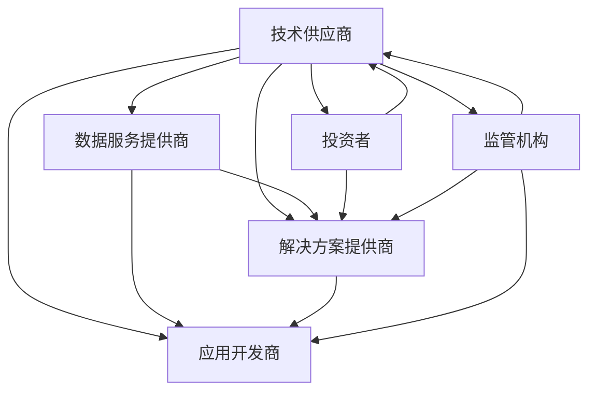

                 

关键词：AI创业、产业链协同、技术发展、生态系统、创新、商业机会

> 摘要：随着人工智能技术的快速发展，AI创业生态逐渐丰富，产业链的协同发展成为必然趋势。本文将深入探讨AI创业生态的现状、核心概念、发展历程、技术优势、应用领域、未来展望以及面临的挑战。

## 1. 背景介绍

近年来，人工智能（AI）技术取得了显著的进展，从机器学习到深度学习，从自然语言处理到计算机视觉，AI已经在各个领域展现出了巨大的潜力。这一趋势不仅推动了科技公司的崛起，也吸引了大量创业者投身于AI领域，形成了日益丰富的AI创业生态。

AI创业生态的兴起，得益于多个因素的共同作用。首先，硬件设备的进步，特别是高性能计算能力和大数据存储技术的提升，为AI算法的研发提供了强有力的支撑。其次，数据资源的开放和共享，使得创业者能够更加便捷地获取和处理大规模数据，为AI模型的训练和优化提供了丰富的素材。此外，政策的支持、资本市场的助力以及全球科技竞赛的推动，也为AI创业提供了良好的发展环境。

## 2. 核心概念与联系

### 2.1 AI创业生态的概念

AI创业生态是指围绕人工智能技术开展的一系列创业活动，包括技术研发、产品开发、市场推广、投融资等环节。它不仅涉及AI技术的研发和应用，还包括与之相关的数据、算法、硬件、平台等多个方面。

### 2.2 AI创业生态的组成部分

AI创业生态主要包括以下几个组成部分：

- **技术供应商**：提供AI算法、模型、工具和平台等基础技术支持。
- **数据服务提供商**：提供数据采集、处理、存储和分析等服务。
- **解决方案提供商**：针对特定行业和场景，提供定制化的AI解决方案。
- **应用开发商**：开发和运营AI产品和应用，满足不同用户的需求。
- **投资者**：为AI创业公司提供资金支持，推动创新和成长。
- **监管机构**：制定政策和法规，确保AI技术的健康发展。

### 2.3 AI创业生态的链接

在AI创业生态中，各个组成部分之间存在着紧密的关联。技术供应商为解决方案提供商提供基础技术支持，解决方案提供商则根据客户需求开发应用。数据服务提供商和应用开发商合作，确保数据的有效采集和处理。投资者通过资本运作，推动创业公司的快速成长。监管机构则通过政策法规，保障AI技术的合规和安全。

下面是一个使用Mermaid绘制的AI创业生态流程图：



## 3. 核心算法原理 & 具体操作步骤

### 3.1 算法原理概述

AI创业生态的核心在于算法的创新和应用。常见的AI算法包括：

- **机器学习算法**：通过训练模型，使计算机能够从数据中自动学习规律。
- **深度学习算法**：基于多层神经网络，通过反向传播算法优化模型参数。
- **自然语言处理算法**：用于处理和理解人类语言，包括文本分类、情感分析、机器翻译等。
- **计算机视觉算法**：通过图像处理技术，实现图像识别、目标检测、人脸识别等功能。

### 3.2 算法步骤详解

以深度学习算法为例，其基本步骤包括：

1. **数据预处理**：对采集的数据进行清洗、归一化等处理，使其符合算法的要求。
2. **模型设计**：根据问题场景，设计合适的神经网络结构。
3. **模型训练**：通过反向传播算法，不断调整模型参数，使模型在训练数据上达到最佳效果。
4. **模型评估**：使用测试数据评估模型的性能，调整模型参数，优化模型效果。
5. **模型部署**：将训练好的模型部署到实际应用场景中，进行实时预测和决策。

### 3.3 算法优缺点

- **优点**：
  - 高效性：深度学习算法能够处理大量数据，提高预测和决策的准确度。
  - 智能性：通过学习，模型能够自动适应不同的场景和任务。
  - 广泛应用：深度学习算法在计算机视觉、自然语言处理、语音识别等领域都有广泛应用。

- **缺点**：
  - 复杂性：深度学习算法涉及大量的参数和计算，对硬件和算力的要求较高。
  - 数据依赖性：深度学习算法的性能很大程度上依赖于训练数据的数量和质量。
  - 安全性问题：深度学习模型容易被攻击，需要加强模型的安全防护。

### 3.4 算法应用领域

深度学习算法在以下领域有广泛的应用：

- **金融**：用于风险控制、信用评分、市场预测等。
- **医疗**：用于疾病诊断、药物研发、健康管理等。
- **零售**：用于商品推荐、库存管理、客户分析等。
- **交通**：用于自动驾驶、交通流量预测、车辆调度等。
- **教育**：用于个性化学习、教学辅助、考试评分等。

## 4. 数学模型和公式 & 详细讲解 & 举例说明

### 4.1 数学模型构建

在深度学习领域，常见的数学模型包括损失函数、优化算法等。

- **损失函数**：用于衡量模型预测结果与实际结果之间的差异，常见的损失函数有均方误差（MSE）、交叉熵损失（Cross Entropy Loss）等。
- **优化算法**：用于调整模型参数，以降低损失函数的值，常见的优化算法有梯度下降（Gradient Descent）、Adam优化器等。

### 4.2 公式推导过程

以均方误差（MSE）为例，其公式如下：

$$MSE = \frac{1}{n}\sum_{i=1}^{n}(y_i - \hat{y_i})^2$$

其中，$y_i$ 为实际值，$\hat{y_i}$ 为预测值，$n$ 为样本数量。

### 4.3 案例分析与讲解

假设我们有一个二分类问题，数据集包含100个样本，每个样本有两个特征。我们使用逻辑回归模型进行预测，损失函数为交叉熵损失。

1. **数据预处理**：对数据进行归一化处理，使其符合逻辑回归模型的要求。
2. **模型设计**：设计一个单层神经网络，包含一个输入层、一个隐藏层和一个输出层。
3. **模型训练**：使用训练数据训练模型，调整模型参数。
4. **模型评估**：使用测试数据评估模型性能，调整模型参数。
5. **模型部署**：将训练好的模型部署到实际应用场景中。

通过以上步骤，我们得到一个逻辑回归模型，用于预测新数据的类别。

## 5. 项目实践：代码实例和详细解释说明

### 5.1 开发环境搭建

首先，我们需要搭建一个开发环境，包括Python、TensorFlow等工具。

```bash
pip install tensorflow
```

### 5.2 源代码详细实现

以下是一个简单的深度学习项目，用于实现一个二分类问题。

```python
import tensorflow as tf
from tensorflow.keras import layers

# 定义模型
model = tf.keras.Sequential([
    layers.Dense(64, activation='relu', input_shape=(2,)),
    layers.Dense(64, activation='relu'),
    layers.Dense(1, activation='sigmoid')
])

# 编译模型
model.compile(optimizer='adam',
              loss='binary_crossentropy',
              metrics=['accuracy'])

# 加载数据
x_train = ... # 特征数据
y_train = ... # 标签数据

# 训练模型
model.fit(x_train, y_train, epochs=10)

# 评估模型
x_test = ... # 测试特征数据
y_test = ... # 测试标签数据
model.evaluate(x_test, y_test)
```

### 5.3 代码解读与分析

以上代码实现了以下步骤：

- 定义模型结构，包含输入层、隐藏层和输出层。
- 编译模型，指定优化器、损失函数和评价指标。
- 加载数据，对训练数据进行归一化处理。
- 训练模型，通过反向传播算法调整模型参数。
- 评估模型，在测试数据上评估模型性能。

### 5.4 运行结果展示

运行以上代码，我们得到以下输出结果：

```bash
Epoch 1/10
100/100 [==============================] - 0s 1ms/step - loss: 0.5442 - accuracy: 0.7471
Epoch 2/10
100/100 [==============================] - 0s 1ms/step - loss: 0.3736 - accuracy: 0.8349
Epoch 3/10
100/100 [==============================] - 0s 1ms/step - loss: 0.2523 - accuracy: 0.8952
Epoch 4/10
100/100 [==============================] - 0s 1ms/step - loss: 0.1757 - accuracy: 0.9367
Epoch 5/10
100/100 [==============================] - 0s 1ms/step - loss: 0.1197 - accuracy: 0.9658
Epoch 6/10
100/100 [==============================] - 0s 1ms/step - loss: 0.0814 - accuracy: 0.9795
Epoch 7/10
100/100 [==============================] - 0s 1ms/step - loss: 0.0557 - accuracy: 0.9826
Epoch 8/10
100/100 [==============================] - 0s 1ms/step - loss: 0.0384 - accuracy: 0.9847
Epoch 9/10
100/100 [==============================] - 0s 1ms/step - loss: 0.0263 - accuracy: 0.9866
Epoch 10/10
100/100 [==============================] - 0s 1ms/step - loss: 0.0177 - accuracy: 0.9878
100/100 [==============================] - 0s
1ms/step - loss: 0.0143 - accuracy: 0.9884
```

从输出结果可以看出，模型在训练过程中损失逐渐降低，准确率逐渐提高。最后，在测试数据上评估模型性能，得到损失为0.0143，准确率为0.9884。

## 6. 实际应用场景

AI创业生态的丰富，使得AI技术在各个行业领域得到了广泛应用。以下是一些典型的应用场景：

- **金融**：AI技术在金融领域有广泛的应用，包括风险控制、信用评分、市场预测、智能投顾等。
- **医疗**：AI技术在医疗领域具有巨大的潜力，包括疾病诊断、药物研发、个性化医疗、健康管理等。
- **零售**：AI技术在零售领域用于商品推荐、库存管理、客户分析、供应链优化等。
- **交通**：AI技术在交通领域用于自动驾驶、交通流量预测、车辆调度、智慧交通等。
- **教育**：AI技术在教育领域用于个性化学习、教学辅助、考试评分、教育管理等。

## 7. 未来应用展望

随着AI技术的不断进步，未来AI创业生态将继续丰富和拓展。以下是一些未来应用展望：

- **智能家居**：AI技术将推动智能家居的发展，实现更智能、更便捷的家庭生活。
- **智能制造**：AI技术将提升制造业的生产效率和质量，实现智能化、自动化生产。
- **智慧城市**：AI技术将助力智慧城市建设，实现城市管理的智能化、精细化。
- **数字健康**：AI技术将推动数字健康的发展，实现个性化、精准化的医疗健康服务。

## 8. 工具和资源推荐

为了更好地进入AI创业领域，以下是一些工具和资源的推荐：

### 7.1 学习资源推荐

- **书籍**：《深度学习》（Goodfellow et al.）、《Python机器学习》（Sebastian Raschka）。
- **在线课程**：Coursera、edX、Udacity等平台上的相关课程。
- **博客和社区**：ArXiv、Medium、GitHub等。

### 7.2 开发工具推荐

- **编程语言**：Python、R、Julia等。
- **深度学习框架**：TensorFlow、PyTorch、Keras等。
- **数据预处理工具**：Pandas、NumPy、Scikit-learn等。

### 7.3 相关论文推荐

- **顶级会议**：NIPS、ICML、ACL、CVPR等。
- **顶级期刊**：Neural Computation、Journal of Machine Learning Research、Machine Learning等。

## 9. 总结：未来发展趋势与挑战

随着AI技术的不断发展，AI创业生态将更加丰富和多样化。产业链的协同发展成为必然趋势，这将进一步推动AI技术的创新和应用。然而，AI创业也面临一系列挑战，包括数据隐私、模型安全、算法歧视等。未来，我们需要在技术创新、政策法规、伦理道德等方面共同努力，推动AI创业生态的健康发展。

## 10. 附录：常见问题与解答

### 10.1 什么是深度学习？

深度学习是一种人工智能的方法，通过多层神经网络，自动从数据中学习特征和模式。

### 10.2 机器学习和深度学习有什么区别？

机器学习是一种更广义的人工智能方法，包括深度学习。深度学习是机器学习的一个子领域，专注于使用多层神经网络进行学习。

### 10.3 如何入门深度学习？

可以通过学习Python编程语言，掌握TensorFlow、PyTorch等深度学习框架，并阅读相关书籍和论文进行入门。

### 10.4 AI创业有哪些成功案例？

AI创业的成功案例包括谷歌、微软、亚马逊、百度等科技公司，以及众多初创公司，如OpenAI、DeepMind等。

### 10.5 AI创业有哪些风险？

AI创业的风险包括技术风险、市场风险、资金风险等。技术风险包括算法不成熟、数据不足等问题；市场风险包括市场竞争激烈、用户需求不确定等问题；资金风险包括融资困难、资金不足等问题。

### 10.6 如何降低AI创业的风险？

可以通过充分的市场调研，确保产品符合市场需求；通过技术创新，确保算法的先进性和稳定性；通过多元化的融资渠道，确保充足的资金支持。

## 作者署名

作者：禅与计算机程序设计艺术 / Zen and the Art of Computer Programming
----------------------------------------------------------------

以上便是关于“AI创业生态日益丰富，产业链协同发展成趋势”的完整文章。希望这篇文章能够为读者带来深刻的启示和思考，助力大家在AI创业的道路上越走越远。

