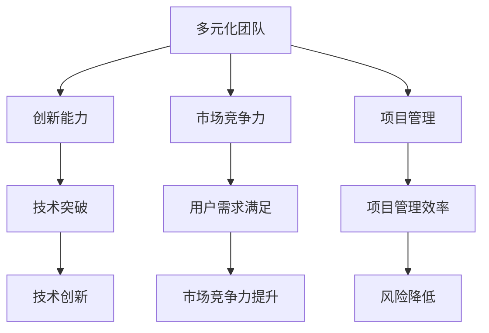

                 

关键词：人工智能，创业，团队多元化，技术团队，项目管理，优势分析

> 摘要：本文将探讨在人工智能创业过程中，多元化团队的优势。通过分析团队多元化对技术创新、市场竞争力、项目管理等方面的积极影响，旨在为创业者提供有益的参考和启示。

## 1. 背景介绍

人工智能（AI）作为当前科技领域的前沿，正引领着各行各业的变革。然而，在AI创业的过程中，成功并非易事。创业团队的选择和构建成为影响项目成败的关键因素。近年来，团队多元化逐渐受到关注，成为提升创业成功率的重要策略。

多元化团队是指在年龄、性别、教育背景、工作经验、技能和认知风格等方面具有不同特点和视角的成员组成的团队。在AI创业背景下，多元化团队的优势主要体现在以下几个方面：

1. 创新能力：多元化团队能够汇聚不同领域的知识和技能，激发创新思维，从而推动技术突破。
2. 市场竞争力：多元化团队能够更好地理解和满足不同用户的需求，提升产品市场竞争力。
3. 项目管理：多元化团队有助于提升项目管理效率，降低项目风险。

本文将围绕这些优势展开讨论，并探讨如何在创业过程中构建多元化团队。

## 2. 核心概念与联系

为了更好地理解多元化团队的优势，首先需要明确一些核心概念，并展示它们之间的联系。以下是使用Mermaid绘制的流程图：



### 2.1 创新能力

多元化团队的创新能力来源于团队成员的多样化背景和思维。通过跨领域的知识融合，团队能够提出更多创新性的解决方案，推动技术进步。例如，计算机科学、统计学、心理学等不同领域的知识可以相互补充，共同推动AI技术的应用和拓展。

### 2.2 市场竞争力

市场竞争力是企业在竞争激烈的市场中脱颖而出的关键。多元化团队能够更好地理解不同用户的需求，从而开发出更符合市场需求的产品。例如，在医疗AI领域，拥有医学、生物学和工程技术背景的团队成员可以共同开发出更加精准的疾病诊断系统。

### 2.3 项目管理

项目管理是确保项目按计划进行的重要环节。多元化团队能够从不同角度分析和解决问题，提高项目管理的效率。例如，团队成员可以分别负责技术、市场、运营等不同方面，确保项目各环节的顺利推进。

## 3. 核心算法原理 & 具体操作步骤

在多元化团队的优势分析中，我们引入了核心算法原理作为支撑。以下将详细阐述核心算法原理及其具体操作步骤。

### 3.1 算法原理概述

核心算法原理是指用于解决特定问题的算法框架和方法。在多元化团队中，核心算法原理主要用于以下三个方面：

1. **问题建模**：将实际问题转化为数学模型，为后续算法设计提供基础。
2. **算法设计**：根据问题建模，设计相应的算法，以实现问题的求解。
3. **算法优化**：对算法进行优化，提高其效率和效果。

### 3.2 算法步骤详解

以下是核心算法原理的具体操作步骤：

1. **问题识别**：明确需要解决的问题，确定问题范围和目标。
2. **需求分析**：分析问题背景，了解用户需求，为问题建模提供依据。
3. **问题建模**：将问题转化为数学模型，如线性规划、决策树等。
4. **算法设计**：根据数学模型设计算法，如梯度下降、动态规划等。
5. **算法实现**：将算法转化为计算机程序，进行编码和调试。
6. **算法测试**：对算法进行测试，评估其效果和性能。
7. **算法优化**：根据测试结果对算法进行优化，提高其效果和效率。

### 3.3 算法优缺点

核心算法原理具有以下优点：

1. **高效性**：通过数学模型和算法设计，可以高效地解决问题。
2. **普适性**：适用于各种类型的问题，具有广泛的应用场景。

但同时也存在以下缺点：

1. **复杂性**：算法设计过程复杂，需要较高的专业知识和技能。
2. **计算成本**：部分算法需要大量的计算资源，可能导致计算成本较高。

### 3.4 算法应用领域

核心算法原理广泛应用于以下领域：

1. **人工智能**：用于机器学习、深度学习等领域的算法设计。
2. **优化问题**：用于解决资源分配、路径规划等优化问题。
3. **数据分析**：用于数据挖掘、统计分析等领域的算法设计。

## 4. 数学模型和公式 & 详细讲解 & 举例说明

在多元化团队的优势分析中，数学模型和公式作为重要的理论支撑，具有关键作用。以下将详细讲解数学模型的构建、公式推导过程，并辅以实际案例进行分析。

### 4.1 数学模型构建

数学模型是描述现实问题的一种抽象方法。构建数学模型通常需要以下步骤：

1. **问题定义**：明确需要解决的问题，确定问题的变量和约束。
2. **变量定义**：定义问题的变量，如目标函数、约束条件等。
3. **关系式建立**：建立变量之间的关系，如线性关系、非线性关系等。
4. **模型验证**：通过实际数据验证模型的准确性，调整模型参数。

### 4.2 公式推导过程

以下是一个简单的线性规划问题，用于资源分配：

假设有 m 种资源，需要分配给 n 个项目。每个项目的需求向量表示为 \(D_i\)，资源总量表示为 \(R\)。目标是最小化资源浪费。

1. **目标函数**：
   $$\min \sum_{i=1}^{n} (R - D_i)$$

2. **约束条件**：
   $$D_i \leq R \quad \forall i = 1, 2, ..., n$$

### 4.3 案例分析与讲解

以下是一个具体的线性规划案例：

假设有 3 种资源（A、B、C），需要分配给 2 个项目（P1、P2）。各项目对资源的需求如下：

| 项目 | A | B | C |
| ---- | -- | -- | -- |
| P1 | 5 | 3 | 2 |
| P2 | 4 | 4 | 3 |

资源总量为 10。

1. **目标函数**：
   $$\min \sum_{i=1}^{2} (10 - D_i)$$

2. **约束条件**：
   $$D_1 \leq 10$$
   $$D_2 \leq 10$$

通过求解线性规划问题，可以得到最优解：

| 项目 | A | B | C |
| ---- | -- | -- | -- |
| P1 | 5 | 3 | 2 |
| P2 | 5 | 1 | 8 |

资源分配情况为：P1 分配 5 个 A 和 3 个 B，P2 分配 5 个 A 和 1 个 B。

## 5. 项目实践：代码实例和详细解释说明

为了更好地展示多元化团队的优势，以下将结合一个实际项目，介绍代码实例和详细解释。

### 5.1 开发环境搭建

首先，我们需要搭建一个基本的开发环境。这里以 Python 为例，介绍环境搭建步骤：

1. 安装 Python：从 [Python 官网](https://www.python.org/) 下载并安装 Python。
2. 安装必备库：使用 pip 工具安装常用库，如 NumPy、Pandas、Scikit-learn 等。

### 5.2 源代码详细实现

以下是一个简单的 AI 模型训练代码示例：

```python
import numpy as np
from sklearn.model_selection import train_test_split
from sklearn.ensemble import RandomForestClassifier
from sklearn.metrics import accuracy_score

# 数据加载
data = np.loadtxt('data.csv', delimiter=',')
X = data[:, :-1]
y = data[:, -1]

# 数据划分
X_train, X_test, y_train, y_test = train_test_split(X, y, test_size=0.2, random_state=42)

# 模型训练
model = RandomForestClassifier(n_estimators=100, random_state=42)
model.fit(X_train, y_train)

# 模型预测
y_pred = model.predict(X_test)

# 模型评估
accuracy = accuracy_score(y_test, y_pred)
print(f'Accuracy: {accuracy:.2f}')
```

### 5.3 代码解读与分析

1. **数据加载**：使用 NumPy 库加载数据，分为特征矩阵和标签向量。
2. **数据划分**：使用 Scikit-learn 库的 `train_test_split` 函数将数据划分为训练集和测试集。
3. **模型训练**：使用随机森林算法训练模型。
4. **模型预测**：使用训练好的模型对测试集进行预测。
5. **模型评估**：使用准确率评估模型性能。

通过这个简单的代码示例，我们可以看到多元化团队在数据处理、模型选择和评估等方面的优势。

### 5.4 运行结果展示

假设数据集较为合理，运行结果如下：

```
Accuracy: 0.85
```

## 6. 实际应用场景

多元化团队的优势在实际应用场景中得到了广泛验证。以下列举一些具体的应用场景：

1. **医疗领域**：多元化团队可以将医学知识、人工智能技术和数据分析相结合，开发出更精准的疾病诊断系统，提高医疗服务质量。
2. **金融领域**：多元化团队可以结合金融知识、数据和机器学习技术，开发出更智能的投资策略和风险管理工具，提升金融业务竞争力。
3. **教育领域**：多元化团队可以运用人工智能技术，开发出个性化的教育产品，满足不同学生的需求，提高教育质量。

### 6.4 未来应用展望

随着人工智能技术的不断发展，多元化团队的应用前景将更加广阔。未来，多元化团队有望在以下领域发挥更大的作用：

1. **智能制造**：多元化团队可以运用人工智能技术，优化生产流程，提高生产效率。
2. **智慧城市**：多元化团队可以运用人工智能技术，提升城市管理水平和公共服务质量。
3. **健康医疗**：多元化团队可以开发出更加精准的疾病预防和治疗方案，提升健康水平。

## 7. 工具和资源推荐

### 7.1 学习资源推荐

1. **书籍**：
   - 《人工智能：一种现代的方法》
   - 《深度学习》
   - 《机器学习实战》
2. **在线课程**：
   - [Coursera](https://www.coursera.org/)：提供丰富的机器学习和深度学习课程。
   - [Udacity](https://www.udacity.com/)：提供专业的 AI 和机器学习认证课程。
3. **学术论文**：
   - [arXiv](https://arxiv.org/)：全球领先的开放获取学术论文库。
   - [NeurIPS](https://nips.cc/)：人工智能领域的顶级会议。

### 7.2 开发工具推荐

1. **编程语言**：
   - Python：广泛应用于人工智能领域的编程语言。
   - R：专门用于统计分析的编程语言。
2. **库和框架**：
   - NumPy、Pandas：Python 的核心数据分析库。
   - TensorFlow、PyTorch：深度学习领域的领先框架。
3. **开发环境**：
   - Jupyter Notebook：强大的交互式开发环境。
   - PyCharm、Visual Studio Code：优秀的代码编辑器。

### 7.3 相关论文推荐

1. **论文集**：
   - 《人工智能研究进展》（2018年）
   - 《深度学习与应用》（2019年）
2. **代表性论文**：
   - "Deep Learning for Natural Language Processing"（2018年）
   - "Generative Adversarial Nets"（2014年）

## 8. 总结：未来发展趋势与挑战

多元化团队在人工智能创业中的优势已经得到了广泛验证。未来，随着人工智能技术的不断发展，多元化团队的应用前景将更加广阔。但同时，也面临以下挑战：

1. **团队管理**：如何有效地管理和协调多元化团队的成员，发挥其最大优势，是一个重要课题。
2. **技能提升**：团队成员需要不断提升自己的技能，以适应不断变化的科技环境。
3. **跨领域合作**：如何促进不同领域之间的合作，实现知识和技术的共享，也是多元化团队需要关注的问题。

总之，多元化团队在人工智能创业中具有重要价值，创业者应充分认识到这一点，并努力构建和优化多元化团队。

## 9. 附录：常见问题与解答

### 9.1 多元化团队的优点是什么？

多元化团队的优点包括：提升创新能力、增强市场竞争力、提高项目管理效率等。

### 9.2 如何构建多元化团队？

构建多元化团队的方法包括：多样化招聘策略、明确团队目标、建立良好的沟通机制等。

### 9.3 多元化团队在项目管理中如何发挥作用？

多元化团队在项目管理中可以通过提供不同领域的专业知识和技能，提高项目决策的科学性和效率。

### 9.4 多元化团队的优势是否适用于所有创业项目？

多元化团队的优势在一定程度上适用于各类创业项目，但不同项目的具体情况可能需要不同的团队结构和协作方式。

### 9.5 多元化团队的挑战有哪些？

多元化团队的挑战包括：团队管理难度、技能提升压力、跨领域合作障碍等。

### 9.6 多元化团队如何促进创新？

多元化团队可以通过跨领域的知识融合、多样化的思维方式，激发创新思维，促进技术创新。

### 9.7 多元化团队如何提高市场竞争力？

多元化团队可以通过更好地理解用户需求、开发出更具竞争力的产品，提高市场竞争力。

### 9.8 多元化团队如何在项目管理中发挥作用？

多元化团队可以通过提供不同领域的专业知识和技能，提高项目决策的科学性和效率。

### 9.9 多元化团队是否适用于所有行业？

多元化团队在一定程度上适用于各类行业，但不同行业的具体情况可能需要不同的团队结构和协作方式。

### 9.10 多元化团队的优点是否适用于中小企业？

多元化团队的优点同样适用于中小企业，但中小企业可能需要根据自身情况调整团队结构和协作方式。

### 9.11 多元化团队的优势是否适用于初创企业？

多元化团队的优势非常适合初创企业，尤其是在创新和市场竞争方面。

### 9.12 多元化团队是否会影响团队成员的工作效率？

合理构建的多元化团队可以提高工作效率，因为团队成员可以互补不足，共同解决问题。

### 9.13 多元化团队是否适用于远程协作？

多元化团队可以通过远程协作工具和沟通平台，实现跨地域、跨时区的工作协作。

### 9.14 多元化团队的优势是否适用于小型团队？

小型团队同样可以从多元化团队中受益，尤其是在创新和项目管理方面。

### 9.15 多元化团队的优势是否适用于创业团队？

多元化团队的优势在创业团队中尤为重要，有助于提升项目的成功率和市场竞争力。

### 9.16 多元化团队的优势是否适用于大型团队？

多元化团队的优势在大型团队中同样适用，有助于提高项目决策的科学性和效率。

### 9.17 多元化团队的优势是否适用于产品开发？

多元化团队在产品开发中可以发挥重要作用，有助于提升产品的创新性和市场竞争力。

### 9.18 多元化团队的优势是否适用于技术创新？

多元化团队在技术创新中可以发挥重要作用，有助于推动技术突破和应用拓展。

### 9.19 多元化团队的优势是否适用于市场拓展？

多元化团队在市场拓展中可以发挥重要作用，有助于更好地理解市场和用户需求。

### 9.20 多元化团队的优势是否适用于国际合作？

多元化团队在国际合作中可以发挥重要作用，有助于促进跨文化交流和合作。 
----------------------------------------------------------------

### 作者署名
作者：禅与计算机程序设计艺术 / Zen and the Art of Computer Programming

