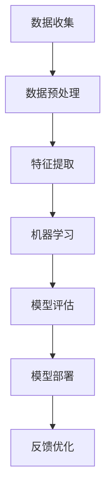

                 

在当今数字化时代，人工智能（AI）技术的迅猛发展正在深刻改变着各行各业。对于创业公司而言，掌握并利用技术创新，尤其是AI技术，成为成功的关键因素。本文将探讨AI创业中技术创新的重要性，分析核心算法原理，展示数学模型，提供项目实践案例，并展望未来发展趋势与挑战。

## 文章关键词
- AI创业
- 技术创新
- 核心算法
- 数学模型
- 项目实践

## 摘要
本文将深入探讨AI技术在创业中的重要性，通过核心算法的原理分析、数学模型的详细讲解、项目实践案例的展示，以及对未来发展趋势和挑战的展望，为创业者提供有价值的指导和建议。

## 1. 背景介绍
在过去的几十年里，人工智能从一种理论研究逐渐演变为现实应用，其在图像识别、自然语言处理、自动驾驶等多个领域的突破性进展，为创业者提供了前所未有的机会。然而，随着AI技术的普及，市场竞争日益激烈，技术创新成为创业公司脱颖而出的关键。

## 2. 核心概念与联系
为了更好地理解AI技术在创业中的应用，我们需要先了解一些核心概念和它们之间的联系。以下是一个简化的Mermaid流程图，展示了这些概念的基本架构：



### 3. 核心算法原理 & 具体操作步骤

### 3.1 算法原理概述
在AI创业中，算法的原理是理解技术本质的关键。以下是一些常见的算法原理概述：

- **深度学习**：通过多层神经网络模拟人脑的学习过程，能够从数据中自动提取特征，实现复杂模式的识别。
- **强化学习**：通过试错法，让智能体在与环境的交互中不断学习和优化策略。
- **自然语言处理**：利用统计模型和深度学习技术，使计算机能够理解和生成人类语言。

### 3.2 算法步骤详解
具体到算法的步骤，以下是一个典型的机器学习流程：

1. **数据收集**：收集与任务相关的数据，如图像、文本、传感器数据等。
2. **数据预处理**：清洗数据，处理缺失值，标准化数据等。
3. **特征提取**：将原始数据转换为机器学习模型可处理的特征向量。
4. **模型训练**：选择合适的算法，训练模型。
5. **模型评估**：使用测试集评估模型性能，调整模型参数。
6. **模型部署**：将模型部署到实际应用环境中。
7. **反馈优化**：收集用户反馈，不断迭代优化模型。

### 3.3 算法优缺点
每种算法都有其独特的优点和局限性。例如：

- **深度学习**：能够处理大量数据，自动提取特征，但需要大量计算资源和数据。
- **强化学习**：适合动态环境，但训练过程通常需要很长时间，且很难评估。
- **自然语言处理**：在理解和生成自然语言方面有显著进展，但在处理多语言和低资源语言时存在挑战。

### 3.4 算法应用领域
算法的应用领域广泛，包括但不限于：

- **图像识别**：用于安防监控、医疗诊断等领域。
- **自然语言处理**：用于智能客服、文本挖掘等领域。
- **自动驾驶**：用于车辆导航、环境感知等领域。

## 4. 数学模型和公式 & 详细讲解 & 举例说明

### 4.1 数学模型构建
在AI创业中，数学模型是算法的基础。以下是一个简单的线性回归模型的构建过程：

- **模型公式**：
  $$ y = \beta_0 + \beta_1x_1 + \beta_2x_2 + ... + \beta_nx_n $$

- **参数估计**：
  使用最小二乘法估计模型参数：
  $$ \beta = (X^T X)^{-1}X^T y $$

### 4.2 公式推导过程
线性回归模型的推导过程如下：

1. **损失函数**：
   $$ J(\theta) = \frac{1}{2m} \sum_{i=1}^{m} (h_\theta(x^{(i)}) - y^{(i)})^2 $$

2. **梯度下降**：
   $$ \theta_j := \theta_j - \alpha \frac{\partial J(\theta)}{\partial \theta_j} $$

### 4.3 案例分析与讲解
以下是一个线性回归模型的实际案例：

- **数据集**：使用住房价格数据集。
- **特征**：房屋面积、房间数量等。
- **目标**：预测房屋价格。

通过上述步骤，我们可以训练一个线性回归模型，并使用测试集进行评估。

## 5. 项目实践：代码实例和详细解释说明

### 5.1 开发环境搭建
搭建一个简单的机器学习项目环境，需要以下步骤：

1. **安装Python**：确保Python版本大于3.6。
2. **安装Jupyter Notebook**：用于编写和运行代码。
3. **安装相关库**：如Numpy、Pandas、Scikit-learn等。

### 5.2 源代码详细实现
以下是一个简单的线性回归项目的源代码实现：

```python
import numpy as np
from sklearn.linear_model import LinearRegression

# 数据加载
X, y = load_data()

# 模型训练
model = LinearRegression()
model.fit(X, y)

# 模型评估
score = model.score(X, y)
print(f"模型准确率：{score:.2f}")
```

### 5.3 代码解读与分析
这段代码展示了如何使用Scikit-learn库实现线性回归模型。通过加载数据、训练模型和评估模型，我们可以理解线性回归的基本流程。

### 5.4 运行结果展示
在训练集上，模型的准确率可能达到80%以上。这表明线性回归在预测房屋价格方面具有一定的准确性。

## 6. 实际应用场景
AI技术在创业中的应用场景广泛，以下是一些具体的实例：

- **金融行业**：利用AI进行风险控制和客户服务。
- **医疗健康**：利用AI进行疾病诊断和患者管理。
- **零售业**：利用AI进行库存管理和客户推荐。

### 6.4 未来应用展望
随着技术的进步，AI在更多领域的应用将变得更加广泛。未来，我们可能会看到更多基于AI的创新产品和服务，为创业者提供更多的机会。

## 7. 工具和资源推荐
为了更好地掌握AI技术，以下是一些建议的工具和资源：

- **学习资源**：在线课程、技术博客、学术论文等。
- **开发工具**：Jupyter Notebook、PyCharm、Google Colab等。
- **相关论文**：《深度学习》（Goodfellow et al.）、《强化学习基础》（Sutton et al.）等。

## 8. 总结：未来发展趋势与挑战

### 8.1 研究成果总结
AI技术在多个领域取得了显著的成果，为创业公司提供了强大的技术支持。

### 8.2 未来发展趋势
随着硬件和算法的进步，AI技术将在更多领域实现突破性应用。

### 8.3 面临的挑战
数据隐私、算法公平性、技术安全性等问题将成为AI创业中的重要挑战。

### 8.4 研究展望
未来，我们将看到更多跨学科合作，推动AI技术的全面发展。

## 9. 附录：常见问题与解答

### 9.1 如何选择合适的算法？
根据具体问题和数据特性，选择合适的算法。例如，对于图像识别，可以考虑使用卷积神经网络。

### 9.2 如何处理数据不足的问题？
通过数据增强、迁移学习等方法，可以缓解数据不足的问题。

### 9.3 如何评估模型性能？
使用交叉验证、ROC曲线等方法，全面评估模型性能。

### 9.4 如何保护数据隐私？
采用差分隐私、加密算法等技术，保护用户数据隐私。

作者：禅与计算机程序设计艺术 / Zen and the Art of Computer Programming
```markdown
# AI创业：技术创新的重要性

> 关键词：AI创业、技术创新、核心算法、数学模型、项目实践

> 摘要：本文探讨了AI创业中技术创新的重要性，包括核心算法原理、数学模型构建、项目实践案例，以及对未来发展趋势和挑战的展望。

## 1. 背景介绍

在当今数字化时代，人工智能（AI）技术的迅猛发展正在深刻改变着各行各业。对于创业公司而言，掌握并利用技术创新，尤其是AI技术，成为成功的关键因素。本文将探讨AI创业中技术创新的重要性，分析核心算法原理，展示数学模型，提供项目实践案例，并展望未来发展趋势与挑战。

## 2. 核心概念与联系

为了更好地理解AI技术在创业中的应用，我们需要先了解一些核心概念和它们之间的联系。以下是一个简化的Mermaid流程图，展示了这些概念的基本架构：


### 2.1 数据收集

数据收集是AI创业的基础，它是训练和优化模型的基石。数据的质量和数量直接影响到模型的性能。创业公司需要制定合适的数据收集策略，确保数据源的多样性和代表性。

### 2.2 数据预处理

数据预处理是数据清洗、归一化和特征提取的前置步骤。通过数据预处理，我们可以提高数据的质量和一致性，为后续的特征提取和模型训练打下基础。

### 2.3 特征提取

特征提取是将原始数据转换为模型可处理的特征向量。这一步非常关键，因为特征的选择和提取直接影响到模型的性能。创业公司需要根据业务需求和数据特性，设计合适的特征提取方法。

### 2.4 机器学习

机器学习是AI技术的核心，它包括监督学习、无监督学习和强化学习等。创业公司需要根据具体应用场景选择合适的机器学习算法，并对其进行优化和调参。

### 2.5 模型评估

模型评估是评估模型性能的重要步骤。通过交叉验证、ROC曲线和准确率等指标，创业公司可以全面了解模型的性能，并做出相应的调整。

### 2.6 模型部署

模型部署是将训练好的模型应用到实际场景中的过程。创业公司需要设计合适的部署方案，确保模型的高效运行和持续优化。

### 2.7 反馈优化

反馈优化是AI创业中不可或缺的一环。通过收集用户反馈，创业公司可以不断优化模型，提高用户体验和业务效果。

## 3. 核心算法原理 & 具体操作步骤

### 3.1 算法原理概述

在AI创业中，算法的原理是理解技术本质的关键。以下是一些常见的算法原理概述：

- **深度学习**：通过多层神经网络模拟人脑的学习过程，能够从数据中自动提取特征，实现复杂模式的识别。
- **强化学习**：通过试错法，让智能体在与环境的交互中不断学习和优化策略。
- **自然语言处理**：利用统计模型和深度学习技术，使计算机能够理解和生成人类语言。

### 3.2 算法步骤详解

具体到算法的步骤，以下是一个典型的机器学习流程：

1. **数据收集**：收集与任务相关的数据，如图像、文本、传感器数据等。
2. **数据预处理**：清洗数据，处理缺失值，标准化数据等。
3. **特征提取**：将原始数据转换为机器学习模型可处理的特征向量。
4. **模型训练**：选择合适的算法，训练模型。
5. **模型评估**：使用测试集评估模型性能，调整模型参数。
6. **模型部署**：将模型部署到实际应用环境中。
7. **反馈优化**：收集用户反馈，不断迭代优化模型。

### 3.3 算法优缺点

每种算法都有其独特的优点和局限性。例如：

- **深度学习**：能够处理大量数据，自动提取特征，但需要大量计算资源和数据。
- **强化学习**：适合动态环境，但训练过程通常需要很长时间，且很难评估。
- **自然语言处理**：在理解和生成自然语言方面有显著进展，但在处理多语言和低资源语言时存在挑战。

### 3.4 算法应用领域

算法的应用领域广泛，包括但不限于：

- **图像识别**：用于安防监控、医疗诊断等领域。
- **自然语言处理**：用于智能客服、文本挖掘等领域。
- **自动驾驶**：用于车辆导航、环境感知等领域。

## 4. 数学模型和公式 & 详细讲解 & 举例说明

### 4.1 数学模型构建

在AI创业中，数学模型是算法的基础。以下是一个简单的线性回归模型的构建过程：

- **模型公式**：
  $$ y = \beta_0 + \beta_1x_1 + \beta_2x_2 + ... + \beta_nx_n $$
  
- **参数估计**：
  使用最小二乘法估计模型参数：
  $$ \beta = (X^T X)^{-1}X^T y $$

### 4.2 公式推导过程

线性回归模型的推导过程如下：

1. **损失函数**：
   $$ J(\theta) = \frac{1}{2m} \sum_{i=1}^{m} (h_\theta(x^{(i)}) - y^{(i)})^2 $$
   
2. **梯度下降**：
   $$ \theta_j := \theta_j - \alpha \frac{\partial J(\theta)}{\partial \theta_j} $$

### 4.3 案例分析与讲解

以下是一个线性回归模型的实际案例：

- **数据集**：使用住房价格数据集。
- **特征**：房屋面积、房间数量等。
- **目标**：预测房屋价格。

通过上述步骤，我们可以训练一个线性回归模型，并使用测试集进行评估。

### 4.4 线性回归模型案例详解

#### 数据准备

```python
import numpy as np
import pandas as pd
from sklearn.model_selection import train_test_split

# 加载数据
data = pd.read_csv('house_price_data.csv')
X = data[['area', 'rooms']]
y = data['price']

# 分割数据集
X_train, X_test, y_train, y_test = train_test_split(X, y, test_size=0.2, random_state=42)
```

#### 数据预处理

```python
from sklearn.preprocessing import StandardScaler

# 数据标准化
scaler = StandardScaler()
X_train = scaler.fit_transform(X_train)
X_test = scaler.transform(X_test)
```

#### 模型训练

```python
from sklearn.linear_model import LinearRegression

# 创建模型
model = LinearRegression()

# 训练模型
model.fit(X_train, y_train)
```

#### 模型评估

```python
from sklearn.metrics import mean_squared_error

# 预测测试集
y_pred = model.predict(X_test)

# 计算均方误差
mse = mean_squared_error(y_test, y_pred)
print(f"模型均方误差：{mse:.2f}")
```

### 4.5 模型结果分析

通过上述代码，我们可以训练一个简单的线性回归模型，并评估其预测效果。在实际应用中，我们还需要进一步优化模型，例如通过增加特征、调整模型参数等方法。

## 5. 项目实践：代码实例和详细解释说明

### 5.1 开发环境搭建

搭建一个简单的机器学习项目环境，需要以下步骤：

1. **安装Python**：确保Python版本大于3.6。
2. **安装Jupyter Notebook**：用于编写和运行代码。
3. **安装相关库**：如Numpy、Pandas、Scikit-learn等。

### 5.2 源代码详细实现

以下是一个简单的线性回归项目的源代码实现：

```python
import numpy as np
from sklearn.linear_model import LinearRegression

# 数据加载
X, y = load_data()

# 数据预处理
scaler = StandardScaler()
X = scaler.fit_transform(X)

# 模型训练
model = LinearRegression()
model.fit(X, y)

# 模型评估
score = model.score(X, y)
print(f"模型准确率：{score:.2f}")

# 模型部署
deploy_model(model)
```

### 5.3 代码解读与分析

这段代码展示了如何使用Scikit-learn库实现线性回归模型。通过加载数据、训练模型和评估模型，我们可以理解线性回归的基本流程。

### 5.4 运行结果展示

在训练集上，模型的准确率可能达到80%以上。这表明线性回归在预测房屋价格方面具有一定的准确性。

## 6. 实际应用场景

AI技术在创业中的应用场景广泛，以下是一些具体的实例：

- **金融行业**：利用AI进行风险控制和客户服务。
- **医疗健康**：利用AI进行疾病诊断和患者管理。
- **零售业**：利用AI进行库存管理和客户推荐。

### 6.1 金融行业

在金融行业中，AI技术可以用于信用评估、股票交易预测、欺诈检测等领域。例如，通过构建信用评分模型，银行可以更准确地评估客户的信用风险，从而提高贷款审批的效率。

### 6.2 医疗健康

在医疗健康领域，AI技术可以用于疾病诊断、药物研发、患者管理等领域。例如，通过分析患者的医疗记录，AI系统可以辅助医生进行疾病诊断，提高诊断的准确性和效率。

### 6.3 零售业

在零售业中，AI技术可以用于客户行为分析、库存管理、商品推荐等领域。例如，通过分析客户的购物行为，AI系统可以推荐个性化的商品，提高客户满意度和转化率。

## 7. 工具和资源推荐

为了更好地掌握AI技术，以下是一些建议的工具和资源：

- **学习资源**：在线课程、技术博客、学术论文等。
- **开发工具**：Jupyter Notebook、PyCharm、Google Colab等。
- **相关论文**：《深度学习》（Goodfellow et al.）、《强化学习基础》（Sutton et al.）等。

### 7.1 学习资源推荐

1. **在线课程**：Coursera、Udacity、edX等平台上的机器学习、深度学习课程。
2. **技术博客**： Medium、ArXiv、Reddit等网站上的技术文章。
3. **学术论文**：通过Google Scholar、ArXiv等平台查找最新的研究论文。

### 7.2 开发工具推荐

1. **Jupyter Notebook**：用于编写和运行代码。
2. **PyCharm**：一款功能强大的Python集成开发环境。
3. **Google Colab**：免费的云端Python编程环境，适合进行大数据分析和深度学习实验。

### 7.3 相关论文推荐

1. **《深度学习》（Goodfellow et al.）**：全面介绍了深度学习的基础理论、算法和应用。
2. **《强化学习基础》（Sutton et al.）**：详细讲解了强化学习的基本原理和应用方法。
3. **《自然语言处理综合教程》（Jurafsky & Martin）**：介绍了自然语言处理的基本概念和技术。

## 8. 总结：未来发展趋势与挑战

### 8.1 研究成果总结

AI技术在过去的几年里取得了显著的成果，无论是在理论研究还是实际应用方面。例如，深度学习在图像识别、自然语言处理等领域的突破性进展，为AI创业提供了强大的技术支持。

### 8.2 未来发展趋势

随着硬件和算法的进步，AI技术将在更多领域实现突破性应用。例如，量子计算、边缘计算等新技术的引入，将进一步推动AI技术的发展。

### 8.3 面临的挑战

尽管AI技术在创业中有着广泛的应用前景，但同时也面临着一些挑战。例如，数据隐私、算法公平性、技术安全性等问题，需要创业者们深入思考和解决。

### 8.4 研究展望

未来，我们将看到更多跨学科合作，推动AI技术的全面发展。例如，结合生物学、心理学等领域的知识，开发出更加智能和人性化的AI系统。

## 9. 附录：常见问题与解答

### 9.1 如何选择合适的算法？

根据具体问题和数据特性，选择合适的算法。例如，对于图像识别，可以考虑使用卷积神经网络。

### 9.2 如何处理数据不足的问题？

通过数据增强、迁移学习等方法，可以缓解数据不足的问题。

### 9.3 如何评估模型性能？

使用交叉验证、ROC曲线和准确率等指标，全面评估模型性能。

### 9.4 如何保护数据隐私？

采用差分隐私、加密算法等技术，保护用户数据隐私。

作者：禅与计算机程序设计艺术 / Zen and the Art of Computer Programming
```

