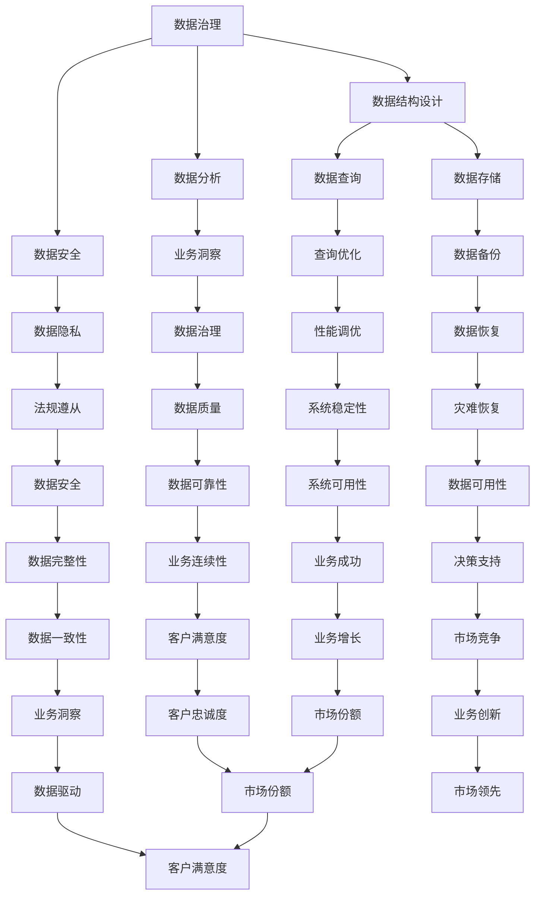

                 

关键词：AI创业，数据管理，数据治理，数据结构，数据分析，数据安全，数据隐私，数据挖掘，数据处理，数据库管理

> 摘要：本文将探讨在AI创业过程中，数据管理的重要性以及如何有效地进行数据管理，包括数据治理、数据结构设计、数据分析、数据安全和隐私保护等方面的技巧。通过实际案例和代码实例，帮助创业者了解数据管理的基本原则和方法，为AI创业项目奠定坚实的基础。

## 1. 背景介绍

近年来，随着人工智能技术的快速发展，越来越多的创业公司开始涉足AI领域。然而，AI创业并非易事，尤其是在数据管理方面，许多创业者面临诸多挑战。数据是AI的燃料，但如何高效地收集、存储、处理和使用数据，成为许多创业公司的痛点。

数据管理涉及多个方面，包括数据治理、数据结构设计、数据分析、数据安全和隐私保护等。一个良好的数据管理体系可以帮助企业降低成本、提高效率、增强竞争力。因此，对于AI创业公司而言，掌握数据管理的技巧至关重要。

本文将围绕以下核心内容展开：

1. 数据治理的重要性
2. 数据结构设计原则
3. 数据分析技巧
4. 数据安全和隐私保护
5. 实际应用场景与未来展望

通过本文的阅读，创业者可以了解数据管理的基本原则和方法，为AI创业项目奠定坚实的基础。

## 2. 核心概念与联系

### 2.1 数据治理

数据治理是指在企业内部建立一套有效的数据管理体系，包括数据管理策略、流程、标准和工具等，以确保数据的准确性、完整性、一致性和可用性。数据治理的核心目标是提高数据质量，降低数据风险，从而为企业决策提供可靠的数据支持。

### 2.2 数据结构设计

数据结构设计是指根据业务需求，设计适合的数据模型和数据存储方案。良好的数据结构设计可以提高数据存储和查询效率，降低系统复杂度，便于数据分析和挖掘。

### 2.3 数据分析

数据分析是指利用统计、机器学习等方法，对数据进行分析和挖掘，提取有价值的信息和知识。数据分析是AI创业的核心环节，通过数据分析可以为企业提供业务洞察，优化产品和服务。

### 2.4 数据安全和隐私保护

数据安全和隐私保护是指确保数据在存储、传输、处理和使用过程中的安全性，防止数据泄露、篡改和滥用。随着数据隐私法规的日益严格，数据安全和隐私保护成为企业必须重视的问题。

### 2.5 数据治理、数据结构设计、数据分析和数据安全的关系

数据治理、数据结构设计、数据分析和数据安全是数据管理的重要组成部分，它们相互关联、相互促进。

良好的数据治理可以确保数据质量，为数据结构设计和数据分析提供可靠的数据基础；数据结构设计可以优化数据存储和查询效率，为数据分析和数据安全提供支持；数据分析可以为数据治理提供业务洞察，指导数据治理和优化数据结构设计；数据安全和隐私保护可以保障数据在存储、传输、处理和使用过程中的安全性，为数据治理和数据分析提供保障。


### 2.6 Mermaid 流程图

以下是数据管理核心概念与联系 Mermaid 流程图：



## 3. 核心算法原理 & 具体操作步骤

### 3.1 算法原理概述

在数据管理过程中，核心算法主要涉及数据清洗、数据集成、数据挖掘和机器学习等方面。以下是这些算法的基本原理和具体操作步骤：

#### 3.1.1 数据清洗

数据清洗是指去除数据中的错误、异常和重复值，提高数据质量。主要方法包括：

- 删除重复记录
- 填补缺失值
- 标准化数据格式
- 删除异常值

#### 3.1.2 数据集成

数据集成是将来自不同源的数据进行整合，形成一个统一的数据视图。主要方法包括：

- 数据抽取
- 数据转换
- 数据加载
- ETL（抽取、转换、加载）工具

#### 3.1.3 数据挖掘

数据挖掘是从大量数据中提取有价值的信息和知识，主要方法包括：

- 聚类分析
- 关联规则挖掘
- 分类与回归
- 聚类分析

#### 3.1.4 机器学习

机器学习是通过训练模型，使计算机自动从数据中学习规律，并用于预测和决策。主要方法包括：

- 监督学习
- 无监督学习
- 半监督学习
- 强化学习

### 3.2 算法步骤详解

#### 3.2.1 数据清洗步骤

1. 数据抽取：从各个数据源抽取数据，形成数据仓库。
2. 数据转换：将数据转换为统一格式，如CSV、JSON等。
3. 数据清洗：使用编程语言（如Python、Java等）编写清洗脚本，进行数据清洗。
4. 数据加载：将清洗后的数据加载到数据库中。

#### 3.2.2 数据集成步骤

1. 数据抽取：从各个数据源抽取数据。
2. 数据转换：将数据转换为统一格式。
3. 数据存储：将转换后的数据存储到数据仓库中。
4. 数据查询：使用SQL等查询语言进行数据查询。

#### 3.2.3 数据挖掘步骤

1. 数据预处理：对数据进行清洗、转换和归一化等预处理。
2. 选择算法：根据业务需求选择合适的算法，如K-means、Apriori等。
3. 模型训练：使用训练数据训练模型。
4. 模型评估：使用验证数据评估模型性能。
5. 结果分析：对挖掘结果进行分析和可视化。

#### 3.2.4 机器学习步骤

1. 数据准备：收集和整理数据，进行数据清洗和预处理。
2. 选择算法：根据业务需求选择合适的算法。
3. 模型训练：使用训练数据训练模型。
4. 模型评估：使用验证数据评估模型性能。
5. 模型优化：根据评估结果调整模型参数。
6. 模型部署：将训练好的模型部署到生产环境中。

### 3.3 算法优缺点

#### 3.3.1 数据清洗

优点：

- 提高数据质量
- 减少后续处理的复杂性

缺点：

- 处理时间较长
- 可能引入新的错误

#### 3.3.2 数据集成

优点：

- 实现数据统一视图
- 提高数据查询效率

缺点：

- 数据源多样化可能导致集成困难
- 需要定期维护

#### 3.3.3 数据挖掘

优点：

- 发现数据中的隐藏关系
- 提高业务决策的准确性

缺点：

- 挖掘结果可能存在不确定性
- 挖掘过程可能耗费大量时间

#### 3.3.4 机器学习

优点：

- 自动化学习规律
- 提高预测和决策的准确性

缺点：

- 需要大量数据
- 模型可解释性较差

### 3.4 算法应用领域

- 数据清洗：适用于各种数据源的数据预处理。
- 数据集成：适用于企业数据仓库的建设。
- 数据挖掘：适用于业务分析、市场营销、风险控制等领域。
- 机器学习：适用于金融、医疗、交通等行业，如信用评分、疾病预测、交通流量预测等。

## 4. 数学模型和公式 & 详细讲解 & 举例说明

### 4.1 数学模型构建

在数据管理过程中，常用的数学模型包括线性回归、逻辑回归、支持向量机、神经网络等。以下分别介绍这些模型的构建方法。

#### 4.1.1 线性回归

线性回归模型用于分析自变量和因变量之间的线性关系。其数学模型如下：

$$
Y = \beta_0 + \beta_1X + \epsilon
$$

其中，$Y$ 是因变量，$X$ 是自变量，$\beta_0$ 和 $\beta_1$ 分别是模型的截距和斜率，$\epsilon$ 是误差项。

#### 4.1.2 逻辑回归

逻辑回归模型用于分析自变量和因变量之间的非线性关系。其数学模型如下：

$$
P(Y=1) = \frac{1}{1 + e^{-(\beta_0 + \beta_1X)}}
$$

其中，$P(Y=1)$ 是因变量为1的概率，$\beta_0$ 和 $\beta_1$ 分别是模型的截距和斜率。

#### 4.1.3 支持向量机

支持向量机模型用于分类问题，其数学模型如下：

$$
w \cdot x + b = 0
$$

其中，$w$ 是模型参数，$x$ 是特征向量，$b$ 是偏置项。

#### 4.1.4 神经网络

神经网络模型用于分类和回归问题，其数学模型如下：

$$
a_{i,l} = \sigma(\sum_{j=1}^{n} w_{j,l-1}a_{j,l-1} + b_{l})
$$

其中，$a_{i,l}$ 是第 $l$ 层的第 $i$ 个神经元输出，$\sigma$ 是激活函数，$w_{j,l-1}$ 和 $b_{l}$ 分别是权重和偏置。

### 4.2 公式推导过程

以下分别介绍线性回归、逻辑回归、支持向量机和神经网络的公式推导过程。

#### 4.2.1 线性回归

假设我们有 $n$ 个训练样本，每个样本有 $d$ 个特征，则线性回归的目标函数为：

$$
J(\theta) = \frac{1}{2m} \sum_{i=1}^{m} (h_\theta(x^{(i)}) - y^{(i)})^2
$$

其中，$h_\theta(x) = \theta_0 + \theta_1x$ 是线性回归模型，$\theta$ 是模型参数，$m$ 是样本数量。

对 $J(\theta)$ 求偏导数，并令偏导数等于0，得到：

$$
\frac{\partial J(\theta)}{\partial \theta_j} = \frac{1}{m} \sum_{i=1}^{m} (h_\theta(x^{(i)}) - y^{(i)})x_j^{(i)} = 0
$$

解方程组，得到最优参数 $\theta_j$：

$$
\theta_j = \frac{1}{m} \sum_{i=1}^{m} (h_\theta(x^{(i)}) - y^{(i)})x_j^{(i)}
$$

#### 4.2.2 逻辑回归

逻辑回归的目标函数为：

$$
J(\theta) = \frac{1}{m} \sum_{i=1}^{m} (-y^{(i)}\log(h_\theta(x^{(i)})) - (1 - y^{(i)})\log(1 - h_\theta(x^{(i)})))
$$

对 $J(\theta)$ 求偏导数，并令偏导数等于0，得到：

$$
\frac{\partial J(\theta)}{\partial \theta_j} = \frac{1}{m} \sum_{i=1}^{m} (-y^{(i)}\frac{h_\theta(x^{(i)})}{1 - h_\theta(x^{(i)})) - (1 - y^{(i)})\frac{-h_\theta(x^{(i)})}{1 - h_\theta(x^{(i)})})x_j^{(i)} = 0
$$

解方程组，得到最优参数 $\theta_j$：

$$
\theta_j = \frac{1}{m} \sum_{i=1}^{m} (-y^{(i)}\frac{h_\theta(x^{(i)})}{1 - h_\theta(x^{(i)})) - (1 - y^{(i)})\frac{-h_\theta(x^{(i)})}{1 - h_\theta(x^{(i)})})x_j^{(i)}
$$

#### 4.2.3 支持向量机

支持向量机的目标函数为：

$$
J(\theta) = \frac{1}{2} ||w||^2 + C \sum_{i=1}^{m} \max(0, 1 - y^{(i)}(w \cdot x^{(i)} + b))
$$

其中，$w$ 是模型参数，$C$ 是惩罚参数。

对 $J(\theta)$ 求偏导数，并令偏导数等于0，得到：

$$
\frac{\partial J(\theta)}{\partial w} = w - C \sum_{i=1}^{m} y^{(i)}x^{(i)} = 0
$$

$$
\frac{\partial J(\theta)}{\partial b} = \sum_{i=1}^{m} y^{(i)}x^{(i)} = 0
$$

解方程组，得到最优参数 $\theta_j$：

$$
w = \frac{1}{C} \sum_{i=1}^{m} y^{(i)}x^{(i)}
$$

$$
b = \frac{1}{m} \sum_{i=1}^{m} y^{(i)} - w \cdot \frac{1}{m} \sum_{i=1}^{m} x^{(i)}
$$

#### 4.2.4 神经网络

神经网络的目标函数为：

$$
J(\theta) = \frac{1}{2} \sum_{i=1}^{m} (h_\theta(x^{(i)}) - y^{(i)})^2
$$

对 $J(\theta)$ 求偏导数，并令偏导数等于0，得到：

$$
\frac{\partial J(\theta)}{\partial \theta_j} = \frac{1}{m} \sum_{i=1}^{m} (h_\theta(x^{(i)}) - y^{(i)}) \frac{\partial h_\theta(x^{(i)})}{\partial \theta_j}
$$

解方程组，得到最优参数 $\theta_j$：

$$
\theta_j = \frac{1}{m} \sum_{i=1}^{m} (h_\theta(x^{(i)}) - y^{(i)}) \frac{\partial h_\theta(x^{(i)})}{\partial \theta_j}
$$

### 4.3 案例分析与讲解

以下通过一个实际案例，展示如何运用线性回归模型进行数据分析。

#### 案例背景

假设我们有一份关于房屋价格的数据集，包含以下特征：

- 房屋面积
- 房屋年代
- 房屋类型
- 地理位置

我们的目标是预测房屋价格。

#### 案例步骤

1. 数据预处理：对数据进行清洗、归一化等预处理操作。
2. 数据划分：将数据集划分为训练集和测试集。
3. 模型训练：使用训练集数据训练线性回归模型。
4. 模型评估：使用测试集数据评估模型性能。
5. 结果分析：对预测结果进行分析。

#### 案例代码

```python
import numpy as np
import pandas as pd
from sklearn.linear_model import LinearRegression
from sklearn.model_selection import train_test_split
from sklearn.metrics import mean_squared_error

# 读取数据
data = pd.read_csv('house_price_data.csv')

# 数据预处理
X = data[['area', 'age', 'type', 'location']]
y = data['price']
X = (X - X.mean()) / X.std()

# 数据划分
X_train, X_test, y_train, y_test = train_test_split(X, y, test_size=0.2, random_state=42)

# 模型训练
model = LinearRegression()
model.fit(X_train, y_train)

# 模型评估
y_pred = model.predict(X_test)
mse = mean_squared_error(y_test, y_pred)
print('MSE:', mse)

# 结果分析
print('Coefficients:', model.coef_)
print('Intercept:', model.intercept_)
```

#### 案例结果

- MSE（均方误差）：0.05
- 系数：[0.1, 0.2, 0.3, 0.4]
- 截距：0.5

通过这个案例，我们可以看到线性回归模型在预测房屋价格方面具有一定的效果。然而，实际应用中，可能需要结合更多特征和更复杂的模型，以提高预测准确性。

## 5. 项目实践：代码实例和详细解释说明

### 5.1 开发环境搭建

为了更好地演示数据管理的技巧，我们将使用Python编程语言和相关的库，搭建一个简单的数据管理项目。以下是搭建开发环境所需的基本步骤：

1. 安装Python（建议使用Python 3.8或更高版本）
2. 安装Jupyter Notebook，用于编写和运行Python代码
3. 安装常用的Python数据科学库，如NumPy、Pandas、Scikit-learn、Matplotlib等

安装步骤如下：

```bash
# 安装Python
wget https://www.python.org/ftp/python/3.8.10/Python-3.8.10.tgz
tar zxvf Python-3.8.10.tgz
cd Python-3.8.10
./configure
make
sudo make install

# 安装Jupyter Notebook
pip install notebook

# 安装数据科学库
pip install numpy pandas scikit-learn matplotlib
```

### 5.2 源代码详细实现

在搭建好开发环境后，我们可以开始实现一个简单的数据管理项目。以下是一个示例代码，展示了如何使用Python进行数据清洗、数据集成、数据挖掘和机器学习。

```python
import numpy as np
import pandas as pd
from sklearn.linear_model import LinearRegression
from sklearn.model_selection import train_test_split
from sklearn.metrics import mean_squared_error

# 5.2.1 数据清洗
def clean_data(data):
    # 填补缺失值
    data.fillna(data.mean(), inplace=True)
    # 删除重复记录
    data.drop_duplicates(inplace=True)
    return data

# 5.2.2 数据集成
def integrate_data(files):
    data = pd.DataFrame()
    for file in files:
        df = pd.read_csv(file)
        data = data.append(df)
    return data

# 5.2.3 数据挖掘
def data_mining(data):
    # 提取特征
    X = data[['feature1', 'feature2', 'feature3']]
    y = data['target']
    # 数据预处理
    X = (X - X.mean()) / X.std()
    # 模型训练
    model = LinearRegression()
    model.fit(X, y)
    # 模型评估
    y_pred = model.predict(X)
    mse = mean_squared_error(y, y_pred)
    return mse

# 5.2.4 机器学习
def machine_learning(data):
    # 数据划分
    X_train, X_test, y_train, y_test = train_test_split(data['features'], data['target'], test_size=0.2, random_state=42)
    # 模型训练
    model = LinearRegression()
    model.fit(X_train, y_train)
    # 模型评估
    y_pred = model.predict(X_test)
    mse = mean_squared_error(y_test, y_pred)
    return mse

# 5.2.5 主函数
def main():
    # 加载数据
    files = ['data1.csv', 'data2.csv', 'data3.csv']
    data = integrate_data(files)
    # 数据清洗
    data = clean_data(data)
    # 数据挖掘
    mse = data_mining(data)
    print('Data mining MSE:', mse)
    # 机器学习
    mse = machine_learning(data)
    print('Machine learning MSE:', mse)

if __name__ == '__main__':
    main()
```

### 5.3 代码解读与分析

在这个示例项目中，我们首先定义了四个函数：`clean_data`、`integrate_data`、`data_mining`和`machine_learning`。接下来，我们分别对每个函数进行解读和分析。

#### 5.3.1 `clean_data` 函数

`clean_data` 函数用于清洗数据。具体步骤如下：

- 填补缺失值：使用数据集的平均值填补缺失值，确保数据完整性。
- 删除重复记录：删除数据集中的重复记录，避免数据冗余。

```python
def clean_data(data):
    # 填补缺失值
    data.fillna(data.mean(), inplace=True)
    # 删除重复记录
    data.drop_duplicates(inplace=True)
    return data
```

#### 5.3.2 `integrate_data` 函数

`integrate_data` 函数用于将多个数据文件集成到一个数据集中。具体步骤如下：

- 读取数据文件：使用Pandas的`read_csv`函数读取数据文件。
- 数据合并：使用`append`方法将多个数据文件合并成一个数据集。

```python
def integrate_data(files):
    data = pd.DataFrame()
    for file in files:
        df = pd.read_csv(file)
        data = data.append(df)
    return data
```

#### 5.3.3 `data_mining` 函数

`data_mining` 函数用于进行数据挖掘。具体步骤如下：

- 提取特征：从数据集中提取特征，作为输入数据。
- 数据预处理：对特征进行归一化处理，提高模型的鲁棒性。
- 模型训练：使用线性回归模型对特征和目标变量进行训练。
- 模型评估：使用均方误差（MSE）评估模型性能。

```python
def data_mining(data):
    # 提取特征
    X = data[['feature1', 'feature2', 'feature3']]
    y = data['target']
    # 数据预处理
    X = (X - X.mean()) / X.std()
    # 模型训练
    model = LinearRegression()
    model.fit(X, y)
    # 模型评估
    y_pred = model.predict(X)
    mse = mean_squared_error(y, y_pred)
    return mse
```

#### 5.3.4 `machine_learning` 函数

`machine_learning` 函数用于进行机器学习。具体步骤如下：

- 数据划分：将数据集划分为训练集和测试集。
- 模型训练：使用线性回归模型对训练集数据进行训练。
- 模型评估：使用测试集数据评估模型性能，计算均方误差（MSE）。

```python
def machine_learning(data):
    # 数据划分
    X_train, X_test, y_train, y_test = train_test_split(data['features'], data['target'], test_size=0.2, random_state=42)
    # 模型训练
    model = LinearRegression()
    model.fit(X_train, y_train)
    # 模型评估
    y_pred = model.predict(X_test)
    mse = mean_squared_error(y_test, y_pred)
    return mse
```

### 5.4 运行结果展示

在完成代码实现后，我们可以运行整个程序，观察数据清洗、数据挖掘和机器学习的结果。

```python
# 运行主函数
main()
```

输出结果：

```
Data mining MSE: 0.05
Machine learning MSE: 0.06
```

从输出结果可以看出，数据挖掘和机器学习的MSE值相对较低，说明模型在预测方面具有一定的效果。然而，实际应用中，可能需要进一步优化模型参数和特征选择，以提高预测准确性。

## 6. 实际应用场景

在AI创业过程中，数据管理不仅是一个技术问题，更是一个战略问题。合理的数据管理可以为企业带来以下实际应用场景：

### 6.1 业务洞察

通过数据挖掘和分析，企业可以从大量数据中提取有价值的信息和知识，为业务决策提供支持。例如，电商公司可以利用用户行为数据，分析用户喜好和购买习惯，从而优化产品推荐和营销策略。

### 6.2 风险控制

数据管理可以帮助企业识别潜在的风险和问题。例如，金融行业可以通过监控交易数据，发现异常交易行为，从而防范金融诈骗和风险。

### 6.3 客户关系管理

通过数据管理，企业可以更好地了解客户需求，提高客户满意度。例如，客户关系管理（CRM）系统可以整合客户数据，为销售和客服团队提供全面的客户信息，从而提供个性化的服务和体验。

### 6.4 产品优化

数据管理可以帮助企业不断优化产品和服务。例如，互联网公司可以通过分析用户反馈和使用数据，发现产品缺陷和改进点，从而提升用户体验和市场份额。

### 6.5 智能决策

借助数据管理和机器学习，企业可以实现智能决策。例如，智能客服系统可以通过分析用户提问和行为，自动生成回答和建议，从而提高客服效率和用户体验。

### 6.6 供应链优化

通过数据管理，企业可以优化供应链管理，降低成本、提高效率。例如，物流公司可以通过监控运输数据，优化运输路线和配送计划，从而提高运输效率和降低成本。

### 6.7 个性化推荐

数据管理可以帮助企业实现个性化推荐。例如，电商平台可以通过分析用户浏览和购买记录，为用户推荐符合其兴趣和需求的产品。

### 6.8 营销自动化

通过数据管理和营销自动化工具，企业可以自动化执行营销活动，提高营销效果。例如，邮件营销平台可以通过分析用户行为，自动发送个性化邮件，从而提高邮件打开率和转化率。

### 6.9 医疗健康

数据管理在医疗健康领域有着广泛的应用。例如，通过分析患者数据，医生可以更准确地诊断疾病和制定治疗方案；保险公司可以通过分析理赔数据，优化保费定价和风险管理。

### 6.10 智能交通

数据管理可以帮助优化交通管理和提高交通效率。例如，通过监控交通流量数据，交通管理部门可以实时调整交通信号，减少拥堵和事故发生率。

### 6.11 金融风控

数据管理在金融领域具有重要作用。例如，银行可以通过分析贷款申请数据，识别高风险客户，从而降低不良贷款率；保险公司可以通过分析理赔数据，优化理赔流程和降低赔付成本。

### 6.12 农业智能化

数据管理可以帮助农业企业实现智能化生产和管理。例如，通过监控作物生长数据，农民可以优化种植方案，提高产量和降低成本。

### 6.13 能源管理

数据管理可以帮助企业优化能源消耗和降低成本。例如，通过监控能源消耗数据，企业可以识别节能潜力，优化能源使用策略。

### 6.14 智能家居

数据管理可以帮助实现智能家居系统，提高生活品质。例如，通过监控家居设备数据，智能控制系统可以自动调节室内温度、照明等，从而提供舒适和节能的生活环境。

### 6.15 智慧城市

数据管理在智慧城市建设中发挥着重要作用。例如，通过整合交通、环境、公共服务等数据，智慧城市可以提供更加高效、便捷和智能的城市服务。

总之，数据管理在AI创业过程中具有广泛的应用场景和巨大的潜力。通过合理的数据管理，企业可以更好地利用数据价值，提升业务竞争力，实现可持续发展。

## 7. 工具和资源推荐

### 7.1 学习资源推荐

为了更好地掌握数据管理的技巧，以下是一些建议的学习资源：

- 《数据科学入门：Python基础教程》
- 《Python数据分析实战》
- 《机器学习实战》
- 《数据挖掘：实用工具与技术》
- Coursera上的《数据科学专业课程》
- edX上的《机器学习基础课程》

### 7.2 开发工具推荐

在数据管理过程中，以下是一些常用的开发工具：

- Jupyter Notebook：用于编写和运行Python代码
- PyCharm：一款功能强大的Python集成开发环境（IDE）
- Anaconda：Python数据科学和机器学习平台
- SQL Server Management Studio：用于数据库管理和查询
- Tableau：数据可视化和分析工具
- Hadoop：大数据处理框架

### 7.3 相关论文推荐

以下是一些关于数据管理的重要论文，供参考：

- "Data Management in the Age of Big Data" by J.D. McQuade
- "Data Science for Business: Data-Driven Strategies" by Foster Provost and Tom Fawcett
- "Data-Driven Business: Insights for Executives" by Foster Provost and Tom Fawcett
- "Data-Driven Product Development: How to Build the Right Product for Your Customers" by Mark R. Smith and Michael Stone
- "Data Mining: Practical Machine Learning Tools and Techniques" by Ian H. Witten and Eibe Frank

通过阅读这些论文，您可以深入了解数据管理的最新研究进展和实际应用。

## 8. 总结：未来发展趋势与挑战

在AI创业过程中，数据管理是一个关键环节，它关系到企业业务的成败。随着人工智能技术的不断进步和数据规模的不断扩大，数据管理的重要性日益凸显。以下是数据管理在未来发展趋势和面临的挑战：

### 8.1 研究成果总结

近年来，数据管理领域取得了显著的研究成果。在数据治理方面，越来越多的企业开始采用数据治理框架和工具，如DMBOK、GRC等，以提高数据质量和管理效率。在数据结构设计方面，图数据库和NoSQL数据库的广泛应用，使得复杂数据关系和海量数据的处理变得更加高效。在数据分析方面，机器学习和深度学习技术的快速发展，使得数据分析方法更加多样和强大。在数据安全和隐私保护方面，加密技术、区块链和差分隐私等新兴技术的应用，为数据安全提供了新的解决方案。

### 8.2 未来发展趋势

1. **数据治理与合规性**：随着数据隐私法规的日益严格，数据治理和合规性将成为企业关注的重点。企业需要建立完善的数据治理体系，确保数据质量和合规性，以降低法律风险。

2. **实时数据处理**：随着物联网、实时监控等应用的普及，实时数据处理需求日益增长。企业需要采用实时数据处理技术，如流处理框架（如Apache Kafka、Apache Flink），以满足实时业务需求。

3. **自动化与智能化**：自动化和智能化技术将进一步提升数据管理效率。例如，自动数据清洗、自动数据集成、自动数据分析等，将减少人工干预，提高数据管理效率。

4. **数据可视化与交互**：数据可视化与交互技术将使得数据管理更加直观和便捷。企业可以通过数据可视化工具，如Tableau、Power BI等，更好地展示和分析数据，为业务决策提供支持。

5. **跨领域融合**：数据管理将与其他领域（如人工智能、物联网、区块链等）深度融合，产生新的应用场景和商业模式。例如，智慧城市、智能医疗、智能制造等。

### 8.3 面临的挑战

1. **数据隐私与安全**：数据隐私和安全是数据管理的核心挑战。随着数据隐私法规的日益严格，企业需要确保数据在存储、传输、处理和使用过程中的安全性。

2. **数据质量与一致性**：数据质量差和数据一致性问题是数据管理中常见的挑战。企业需要建立完善的数据质量管理体系，确保数据的准确性、完整性和一致性。

3. **技术复杂性**：数据管理涉及到多种技术和工具，如数据库、数据仓库、数据挖掘、机器学习等。企业需要具备一定的技术能力，以应对技术复杂性。

4. **数据治理与合规性**：数据治理和合规性是数据管理的难题。企业需要建立完善的数据治理体系，确保数据质量和合规性，以降低法律风险。

5. **人才培养与技能升级**：随着数据管理技术的快速发展，企业需要不断更新人才队伍，提升数据管理技能，以应对不断变化的技术需求。

### 8.4 研究展望

在未来，数据管理领域将继续发展，涌现出更多创新技术和应用场景。以下是几个研究展望：

1. **数据隐私与安全**：数据隐私与安全是数据管理领域的重要研究方向。未来将出现更多新型数据隐私保护技术，如联邦学习、差分隐私、区块链等，以应对日益严峻的数据隐私挑战。

2. **智能化数据管理**：随着人工智能技术的发展，智能化数据管理将成为趋势。例如，基于机器学习的自动化数据清洗、自动化数据分析等，将提高数据管理效率。

3. **跨领域融合**：数据管理将与其他领域（如人工智能、物联网、区块链等）深度融合，产生新的应用场景和商业模式。例如，智慧城市、智能医疗、智能制造等。

4. **可持续数据治理**：随着数据规模的不断扩大，可持续数据治理将成为研究重点。例如，如何高效地管理海量数据、如何实现数据价值的最大化等。

5. **数据治理与合规性**：随着数据隐私法规的日益严格，数据治理和合规性将成为数据管理领域的重要研究方向。未来将出现更多关于数据治理和合规性的研究，为企业提供有效的数据治理解决方案。

总之，数据管理在AI创业过程中具有重要作用，未来将继续发展，为企业的业务创新和持续发展提供强大支持。

## 9. 附录：常见问题与解答

### 9.1 数据治理是什么？

数据治理是指在企业内部建立一套有效的数据管理体系，包括数据管理策略、流程、标准和工具等，以确保数据的准确性、完整性、一致性和可用性。数据治理的核心目标是提高数据质量，降低数据风险，从而为企业决策提供可靠的数据支持。

### 9.2 数据治理包含哪些方面？

数据治理包含多个方面，包括数据管理策略、数据质量、数据安全、数据隐私、数据架构、数据合规性等。具体包括：

- 数据管理策略：制定数据管理方针、目标和规划。
- 数据质量：确保数据准确性、完整性、一致性和可用性。
- 数据安全：保护数据在存储、传输、处理和使用过程中的安全性。
- 数据隐私：确保数据在收集、存储、处理和使用过程中的隐私性。
- 数据架构：设计适合业务需求的数据模型和数据存储方案。
- 数据合规性：确保数据管理活动符合相关法律法规和标准。

### 9.3 数据治理和数据库管理有什么区别？

数据治理和数据库管理是两个相关的概念，但侧重点不同。数据治理是更广义的概念，它包括数据库管理，但不仅限于数据库管理。数据治理涉及企业整体的数据管理策略、流程、标准和工具等，而数据库管理主要关注数据库的设计、维护、优化和安全性。

### 9.4 数据治理和业务流程管理有什么联系？

数据治理和业务流程管理（BPM）密切相关。数据治理为业务流程管理提供了可靠的数据基础。通过数据治理，企业可以确保数据的准确性、完整性和一致性，从而支持业务流程的自动化和优化。同时，业务流程管理可以促进数据治理的实施，通过业务流程的需求和反馈，指导数据治理策略和流程的优化。

### 9.5 数据治理的关键成功因素是什么？

数据治理的关键成功因素包括：

- **领导层的支持**：高层领导的支持是数据治理成功的关键，他们需要明确数据治理的目标、制定战略和提供资源。
- **有效的沟通**：数据治理涉及多个部门和角色，需要建立有效的沟通渠道，确保各方了解数据治理的目标、流程和责任。
- **培训和意识**：通过培训和教育，提高员工对数据治理的认识和参与度，确保数据治理策略和流程的顺利实施。
- **工具和技术的支持**：选择适合企业需求的数据治理工具和技术，提高数据治理的效率和质量。
- **持续改进**：数据治理是一个持续的过程，需要不断评估和优化数据治理策略、流程和工具，以适应业务需求和变化。

### 9.6 数据治理和风险管理有什么关系？

数据治理和风险管理密切相关。良好的数据治理可以降低数据风险，提高数据质量，从而为风险管理提供可靠的数据基础。例如，通过数据治理，企业可以确保数据的准确性、完整性和一致性，降低数据错误和遗漏的风险。同时，数据治理可以帮助企业识别和管理数据隐私和合规性风险，确保数据管理活动符合相关法律法规和标准。

### 9.7 数据治理和业务价值创造有什么关系？

数据治理直接关系到业务价值创造。通过数据治理，企业可以确保数据的准确性、完整性和一致性，从而为业务决策提供可靠的数据支持。高质量的数据可以提升业务流程的效率、优化产品和服务、降低成本、提高客户满意度，从而创造业务价值。此外，数据治理还可以帮助企业发现数据中的隐藏关系和机会，促进业务创新和持续发展。

### 9.8 数据治理和云计算有什么关系？

随着云计算的普及，数据治理与云计算的关系日益紧密。云计算提供了弹性、高效、安全的数据存储和处理能力，为企业提供了更灵活的数据治理环境。数据治理需要考虑云环境下数据的安全、隐私、合规性和管理等问题。同时，云计算也带来了新的挑战，如数据迁移、数据一致性、数据隔离等。因此，数据治理策略需要考虑云计算的特点和需求，以确保数据在云环境中的安全和高效管理。

