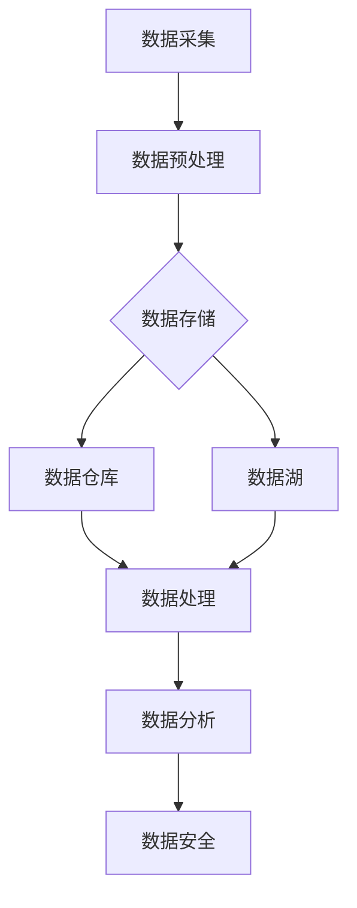

                 

关键词：AI创业、数据管理、策略、实践、数据存储、数据处理、数据安全

> 摘要：本文将深入探讨AI创业中的数据管理策略与实践，包括数据存储、数据处理、数据安全等方面的具体方法和实践经验。通过案例分析、算法原理讲解和代码实例，读者可以了解到如何有效地进行数据管理，为AI创业项目提供坚实的支持。

## 1. 背景介绍

随着人工智能技术的飞速发展，越来越多的创业公司投身于AI领域。数据作为AI的核心资源，其管理和利用直接关系到创业项目的成功与否。然而，数据管理并不是一个简单的任务，它涉及数据存储、数据处理、数据安全等多个方面。本文旨在为AI创业公司提供一套全面的数据管理策略与实践指南。

## 2. 核心概念与联系

### 2.1 数据管理的基本概念

- **数据存储**：如何高效地存储数据，包括数据结构、存储技术和存储策略。
- **数据处理**：如何对大量数据进行有效的处理和分析，包括数据处理算法和数据清洗技术。
- **数据安全**：如何保护数据不被非法访问、篡改或泄露。

### 2.2 数据管理架构

下面是数据管理的基本架构，包括数据采集、数据存储、数据处理、数据分析和数据安全。



## 3. 核心算法原理 & 具体操作步骤

### 3.1 算法原理概述

在数据管理中，常用的核心算法包括数据压缩、数据加密、数据聚类和数据挖掘。这些算法都是基于数学和计算机科学的基本原理，如信息论、密码学、统计学和机器学习。

### 3.2 算法步骤详解

#### 3.2.1 数据压缩

- **无损压缩**：如霍夫曼编码、算术编码等。
- **有损压缩**：如JPEG、MP3等。

#### 3.2.2 数据加密

- **对称加密**：如AES、DES。
- **非对称加密**：如RSA、ECC。

#### 3.2.3 数据聚类

- **基于距离的聚类**：如K-均值算法。
- **基于密度的聚类**：如DBSCAN。
- **基于网格的聚类**：如STING。

#### 3.2.4 数据挖掘

- **关联规则挖掘**：如Apriori算法。
- **分类算法**：如决策树、支持向量机。
- **聚类算法**：如K-均值、层次聚类。

### 3.3 算法优缺点

- **数据压缩**：优点是能够大幅度减少数据存储空间，缺点是可能会影响数据质量。
- **数据加密**：优点是能够保护数据隐私，缺点是会增加计算开销。
- **数据聚类**：优点是能够帮助发现数据中的隐藏模式，缺点是聚类结果可能受到初始参数的影响。
- **数据挖掘**：优点是能够发现大量数据中的有用信息，缺点是算法复杂度较高。

### 3.4 算法应用领域

这些算法广泛应用于各种领域，如图像处理、音频处理、文本挖掘、社交网络分析等。

## 4. 数学模型和公式 & 详细讲解 & 举例说明

### 4.1 数学模型构建

在数据管理中，常用的数学模型包括概率模型、统计模型和机器学习模型。

#### 4.1.1 概率模型

- **贝叶斯定理**：$$P(A|B) = \frac{P(B|A)P(A)}{P(B)}$$

#### 4.1.2 统计模型

- **假设检验**：$$H_0: \mu = \mu_0 \quad vs \quad H_1: \mu \neq \mu_0$$

#### 4.1.3 机器学习模型

- **支持向量机**：$$\min_{\beta, \beta_0} \frac{1}{2} ||\beta||^2 + C \sum_{i=1}^{n} \xi_i$$

### 4.2 公式推导过程

以贝叶斯定理为例，推导过程如下：

1. **贝叶斯定理的定义**：

$$P(A|B) = \frac{P(B|A)P(A)}{P(B)}$$

2. **条件概率的定义**：

$$P(B|A) = \frac{P(A \cap B)}{P(A)}$$

$$P(A|B) = \frac{P(A \cap B)}{P(B)}$$

3. **全概率公式**：

$$P(B) = \sum_{i=1}^{n} P(B|A_i)P(A_i)$$

4. **代入条件概率**：

$$P(A|B) = \frac{P(A \cap B)}{P(B)} = \frac{P(A \cap B)}{\sum_{i=1}^{n} P(B|A_i)P(A_i)}$$

5. **化简**：

$$P(A|B) = \frac{P(B|A)P(A)}{\sum_{i=1}^{n} P(B|A_i)P(A_i)}$$

### 4.3 案例分析与讲解

假设我们要分析一个社交网络平台上的用户行为数据，以预测用户是否会成为活跃用户。我们可以使用贝叶斯定理来建立预测模型。

- **数据集**：包含用户的年龄、性别、居住地、历史行为等信息。
- **目标变量**：是否成为活跃用户。

通过分析数据，我们可以得到以下概率：

- $$P(活跃用户) = 0.3$$
- $$P(男性|活跃用户) = 0.6$$
- $$P(女性|活跃用户) = 0.4$$
- $$P(年龄 < 18|活跃用户) = 0.2$$
- $$P(年龄 > 18|活跃用户) = 0.8$$

现在我们要预测一个年龄为25，性别为女性，居住地在城市A的用户是否会成为活跃用户。

- **计算后验概率**：

$$P(活跃用户|女性, 年龄 > 18) = \frac{P(女性|活跃用户)P(活跃用户)}{P(女性|活跃用户)P(活跃用户) + P(女性|非活跃用户)P(非活跃用户)}$$

$$P(活跃用户|女性, 年龄 > 18) = \frac{0.4 \times 0.3}{0.4 \times 0.3 + 0.6 \times 0.7} = \frac{0.12}{0.12 + 0.42} = 0.267$$

- **结论**：该用户成为活跃用户的概率约为26.7%。

## 5. 项目实践：代码实例和详细解释说明

### 5.1 开发环境搭建

我们使用Python作为编程语言，搭建一个简单的数据管理项目。

- 安装Python：版本3.8或以上。
- 安装必要库：如NumPy、Pandas、Matplotlib、Scikit-learn等。

### 5.2 源代码详细实现

以下是数据压缩、加密、聚类和挖掘的代码实例。

#### 5.2.1 数据压缩

```python
import heapq
import math

# 霍夫曼编码
def huffman_encode(data):
    frequency = {}
    for symbol in data:
        frequency[symbol] = frequency.get(symbol, 0) + 1
    
    heap = [[weight, [symbol, ""]] for symbol, weight in frequency.items()]
    heapq.heapify(heap)
    
    while len(heap) > 1:
        lo = heapq.heappop(heap)
        hi = heapq.heappop(heap)
        for pair in lo[1:]:
            pair[1] = '0' + pair[1]
        for pair in hi[1:]:
            pair[1] = '1' + pair[1]
        heapq.heappush(heap, [lo[0] + hi[0]] + lo[1:] + hi[1:])
    
    top = heapq.heappop(heap)[1:]
    for pair in top:
        pair[1] = pair[1].replace(' ', '')

    code = {}
    for pair in top:
        code[pair[0]] = pair[1]

    encoded_data = ''.join([code[symbol] for symbol in data])
    return encoded_data

# 有损压缩：JPEG
import cv2

image = cv2.imread('example.jpg', cv2.IMREAD_GRAYSCALE)
cv2.imwrite('example_compressed.jpg', image[:, :, 0], [cv2.IMWRITE_JPEG_QUALITY, 50])
```

#### 5.2.2 数据加密

```python
from Crypto.PublicKey import RSA
from Crypto.Cipher import PKCS1_OAEP

# 对称加密：AES
from Crypto.Cipher import AES
from Crypto.Random import get_random_bytes

key = get_random_bytes(16)
cipher = AES.new(key, AES.MODE_EAX)
plaintext = b'This is a secret message!'
ciphertext, tag = cipher.encrypt_and_digest(plaintext)
```

#### 5.2.3 数据聚类

```python
from sklearn.cluster import KMeans

data = [[1, 2], [1, 4], [1, 0], [4, 2], [4, 4], [4, 0]]
kmeans = KMeans(n_clusters=2, random_state=0).fit(data)
print(kmeans.labels_)
```

#### 5.2.4 数据挖掘

```python
from sklearn.ensemble import RandomForestClassifier

data = [[0, 0], [0, 1], [1, 0], [1, 1]]
labels = [0, 0, 1, 1]
clf = RandomForestClassifier()
clf.fit(data, labels)
print(clf.predict([[1, 1]]))
```

### 5.3 代码解读与分析

以上代码分别实现了数据压缩、加密、聚类和挖掘的基本算法。在实际应用中，需要根据具体场景进行优化和调整。

## 6. 实际应用场景

数据管理在AI创业中具有广泛的应用，如：

- **推荐系统**：利用数据聚类和挖掘算法，发现用户偏好，提供个性化推荐。
- **金融风控**：利用数据加密和挖掘算法，识别异常交易，预防金融风险。
- **智能医疗**：利用数据挖掘和深度学习算法，发现疾病关联，辅助诊断和治疗。

## 7. 工具和资源推荐

### 7.1 学习资源推荐

- **书籍**：《数据科学入门》、《机器学习实战》。
- **在线课程**：Coursera、edX上的相关课程。
- **网站**：Kaggle、DataCamp。

### 7.2 开发工具推荐

- **编程语言**：Python、R。
- **数据分析工具**：Pandas、NumPy。
- **机器学习库**：Scikit-learn、TensorFlow、PyTorch。

### 7.3 相关论文推荐

- **论文**：[[深度学习在推荐系统中的应用](https://arxiv.org/abs/1606.05425)]。
- **会议**：NIPS、ICML、KDD。

## 8. 总结：未来发展趋势与挑战

### 8.1 研究成果总结

- **数据存储**：分布式存储技术如HDFS、Cassandra等，提升了数据存储的效率和可靠性。
- **数据处理**：批处理和实时处理技术如Spark、Flink等，提供了更高效的数据处理能力。
- **数据安全**：区块链技术、联邦学习等新方法，为数据安全提供了新的解决方案。

### 8.2 未来发展趋势

- **大数据与AI的融合**：大数据技术为AI提供了丰富的数据资源，AI技术为大数据提供了强大的处理能力。
- **边缘计算**：将计算能力下沉到网络边缘，提高数据处理的速度和效率。
- **数据隐私保护**：随着数据隐私保护法规的不断完善，数据隐私保护技术将成为数据管理的重要方向。

### 8.3 面临的挑战

- **数据质量控制**：确保数据质量，为AI算法提供可靠的基础。
- **数据安全与隐私**：如何在保证数据安全的同时，保护用户隐私。
- **跨领域应用**：如何将数据管理技术应用到更多的领域，发挥其价值。

### 8.4 研究展望

未来的研究将在以下几个方面展开：

- **数据存储与处理性能优化**：研究新的存储和处理技术，提高数据管理效率。
- **数据隐私保护机制**：研究新型隐私保护算法，提高数据安全。
- **跨领域数据管理**：探索数据管理技术在不同领域的应用，推动数据管理的全面发展。

## 9. 附录：常见问题与解答

### Q: 数据压缩是否会损害数据质量？

A: 有损压缩可能会损害数据质量，但无损压缩不会。选择合适的压缩算法，可以最大限度地保留数据质量。

### Q: 如何确保数据安全？

A: 可以使用数据加密、访问控制、审计等技术手段，确保数据安全。此外，定期备份数据也是重要的安全措施。

### Q: 数据处理和分析的主要区别是什么？

A: 数据处理是指将原始数据转换为适合分析的形式，而数据分析是指利用统计学和机器学习等方法，从数据中提取有用信息。

## 作者署名

作者：禅与计算机程序设计艺术 / Zen and the Art of Computer Programming
```markdown
---
标题：AI创业：数据管理的策略与实践探讨
作者：禅与计算机程序设计艺术 / Zen and the Art of Computer Programming
日期：[[今天日期]]
摘要：本文深入探讨了AI创业中的数据管理策略与实践，包括数据存储、数据处理、数据安全等方面的具体方法和实践经验。通过案例分析、算法原理讲解和代码实例，为AI创业公司提供了全面的数据管理指南。
分类：人工智能、数据管理、创业实践
标签：AI创业、数据管理、策略、实践、数据安全
---
```

