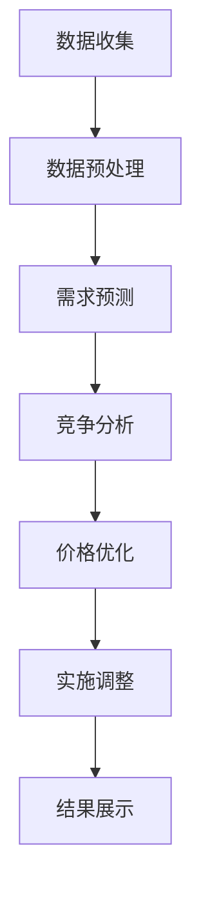

                 

关键词：人工智能、动态定价、算法原理、应用场景、挑战与展望

摘要：本文深入探讨了人工智能（AI）动态定价的原理、应用场景以及面临的挑战。通过阐述核心概念、算法原理、数学模型，以及实际项目实践，本文旨在为读者提供全面的理解和深入思考，以便在未来的商业和技术发展中更好地利用AI动态定价技术。

## 1. 背景介绍

随着互联网和电子商务的迅猛发展，市场环境变得日益复杂和动态。传统定价策略往往无法快速适应市场变化，难以实现精确定价。在此背景下，人工智能（AI）动态定价应运而生。AI动态定价利用机器学习、数据挖掘和优化算法等技术，实现价格的实时调整，从而提高企业的市场竞争力和盈利能力。

### 1.1 动态定价的概念

动态定价是指根据市场供需、消费者行为、竞争对手策略等实时信息，动态调整产品或服务的价格，以实现最大化利润或市场份额。与传统定价策略相比，动态定价具有更高的灵活性和适应性。

### 1.2 动态定价的优势

1. 提高利润：通过精准定价，企业可以在不同市场条件下实现最大化利润。
2. 增强竞争力：动态定价有助于企业快速响应市场变化，提高市场竞争力。
3. 提升客户满意度：合理的价格调整可以满足不同消费者的需求，提高客户满意度。
4. 优化库存管理：动态定价有助于企业优化库存管理，降低库存成本。

### 1.3 动态定价的应用场景

1. 电子商务：电商平台利用动态定价策略，根据消费者行为和市场变化调整商品价格。
2. 机票和酒店预订：航空公司和酒店通过动态定价策略，实现价格的实时调整，提高利润和市场份额。
3. 出行服务：网约车和共享单车等出行服务企业利用动态定价，调节供需平衡，提高服务质量和用户满意度。

## 2. 核心概念与联系

### 2.1 动态定价的组成要素

动态定价的核心概念包括以下几个方面：

1. **市场价格**：市场价格是影响动态定价的主要因素之一，通常由供需关系、市场竞争、消费者行为等因素决定。
2. **需求函数**：需求函数描述了产品或服务的需求量与价格之间的关系。
3. **成本函数**：成本函数描述了生产或提供产品或服务的成本与需求量之间的关系。
4. **竞争策略**：竞争对手的价格和策略对动态定价有重要影响。

### 2.2 动态定价的核心算法

动态定价的核心算法主要包括以下几个方面：

1. **价格优化算法**：价格优化算法通过优化价格策略，实现利润最大化或市场份额最大化。
2. **需求预测算法**：需求预测算法通过分析历史数据和市场趋势，预测未来需求量。
3. **库存管理算法**：库存管理算法通过实时调整库存水平，实现库存成本最小化。

### 2.3 动态定价的流程

动态定价的流程主要包括以下几个步骤：

1. 数据收集：收集与市场价格、需求、成本和竞争相关的数据。
2. 数据预处理：对收集到的数据进行清洗、去噪和格式转换。
3. 需求预测：利用需求预测算法预测未来需求量。
4. 竞争分析：分析竞争对手的价格和策略。
5. 价格优化：利用价格优化算法确定最优价格。
6. 实施调整：根据最优价格调整产品或服务的价格。

### 2.4 动态定价的架构

动态定价的架构通常包括以下几个层次：

1. **数据层**：存储与市场价格、需求、成本和竞争相关的数据。
2. **算法层**：实现需求预测、价格优化和库存管理等算法。
3. **应用层**：实现动态定价功能的业务逻辑。
4. **展示层**：展示动态定价的结果，包括价格调整、利润预测等。

### 2.5 Mermaid 流程图

以下是动态定价的核心流程图的 Mermaid 表示：



## 3. 核心算法原理 & 具体操作步骤

### 3.1 算法原理概述

动态定价的核心算法主要基于机器学习、数据挖掘和优化理论。具体来说，算法原理可以概括为以下几个步骤：

1. **数据收集**：收集与市场价格、需求、成本和竞争相关的数据。
2. **数据预处理**：对收集到的数据进行清洗、去噪和格式转换，以便后续分析。
3. **特征提取**：从预处理后的数据中提取关键特征，用于训练模型。
4. **模型训练**：利用提取的特征数据训练需求预测模型和价格优化模型。
5. **模型评估**：评估模型的预测准确性和优化效果。
6. **决策制定**：根据模型预测和评估结果，制定最优价格策略。

### 3.2 算法步骤详解

#### 3.2.1 数据收集

数据收集是动态定价算法的基础。数据来源可以包括历史销售数据、市场调查、竞争对手价格、消费者行为数据等。以下是一个数据收集的示例：

- **历史销售数据**：包括不同时间段、不同价格点的销售额、销量等。
- **市场调查**：通过问卷调查或用户反馈获取消费者对产品或服务的偏好。
- **竞争对手价格**：获取竞争对手在不同时间段的价格信息。
- **消费者行为数据**：包括用户点击、购买、评价等行为数据。

#### 3.2.2 数据预处理

数据预处理是确保数据质量和模型性能的关键步骤。以下是一个数据预处理的示例：

- **数据清洗**：去除重复数据、异常值和缺失值。
- **数据归一化**：将不同尺度的数据统一归一化，以便后续分析。
- **特征工程**：根据业务需求，提取关键特征，如时间、价格、销量、用户评价等。

#### 3.2.3 特征提取

特征提取是从预处理后的数据中提取有助于模型训练的关键特征。以下是一个特征提取的示例：

- **时间特征**：包括日、周、月等时间周期。
- **价格特征**：包括当前价格、历史价格、价格变化率等。
- **销量特征**：包括当前销量、历史销量、销量变化率等。
- **用户特征**：包括用户年龄、性别、地域、购买历史等。

#### 3.2.4 模型训练

模型训练是利用特征数据训练需求预测模型和价格优化模型。以下是一个模型训练的示例：

- **需求预测模型**：可以使用线性回归、决策树、神经网络等模型进行训练。
- **价格优化模型**：可以使用线性规划、遗传算法、模拟退火等模型进行训练。

#### 3.2.5 模型评估

模型评估是评估模型预测准确性和优化效果的关键步骤。以下是一个模型评估的示例：

- **需求预测评估**：可以使用均方误差（MSE）、均方根误差（RMSE）等指标评估模型预测准确性。
- **价格优化评估**：可以使用利润率、市场份额等指标评估模型优化效果。

#### 3.2.6 决策制定

决策制定是根据模型预测和评估结果，制定最优价格策略。以下是一个决策制定的示例：

- **需求预测**：根据模型预测结果，预测未来一段时间的需求量。
- **竞争分析**：分析竞争对手的价格策略，确定竞争环境。
- **价格优化**：利用价格优化模型，确定最优价格策略。
- **实施调整**：根据最优价格策略，调整产品或服务的价格。

### 3.3 算法优缺点

#### 优点

1. **提高利润**：通过精准定价，实现最大化利润。
2. **增强竞争力**：快速响应市场变化，提高市场竞争力。
3. **提升客户满意度**：合理的价格调整，满足不同消费者的需求。
4. **优化库存管理**：动态调整库存水平，降低库存成本。

#### 缺点

1. **数据依赖性**：算法性能依赖于数据质量和数据量。
2. **计算成本**：算法训练和优化过程需要大量计算资源。
3. **模型解释性**：算法模型往往缺乏透明度和解释性。

### 3.4 算法应用领域

动态定价算法在多个领域具有广泛的应用，包括但不限于：

1. **电子商务**：电商平台利用动态定价策略，实现商品价格的实时调整。
2. **机票和酒店预订**：航空公司和酒店通过动态定价策略，实现价格的实时调整。
3. **出行服务**：网约车和共享单车等出行服务企业利用动态定价，调节供需平衡。
4. **能源市场**：能源市场利用动态定价策略，实现电价、油价等价格的实时调整。

## 4. 数学模型和公式 & 详细讲解 & 举例说明

### 4.1 数学模型构建

动态定价的数学模型主要包括需求函数、成本函数和利润函数。以下是一个简化的数学模型：

#### 需求函数：

$$ D(p) = D_0 \cdot e^{-\alpha \cdot (p - p_0)} $$

其中，$D(p)$ 为需求量，$p$ 为价格，$D_0$、$\alpha$ 和 $p_0$ 为模型参数。

#### 成本函数：

$$ C(q) = C_0 + \alpha \cdot q $$

其中，$C(q)$ 为成本，$q$ 为需求量，$C_0$ 和 $\alpha$ 为模型参数。

#### 利润函数：

$$ \Pi(p) = p \cdot D(p) - C(q) $$

其中，$\Pi(p)$ 为利润，$p$ 为价格，$D(p)$ 为需求量，$C(q)$ 为成本。

### 4.2 公式推导过程

需求函数、成本函数和利润函数的推导过程如下：

#### 需求函数推导：

假设市场需求量与价格之间存在指数关系，即

$$ D(p) = D_0 \cdot e^{-\alpha \cdot (p - p_0)} $$

其中，$D_0$ 为市场基准需求量，$\alpha$ 为价格敏感系数，$p_0$ 为基准价格。

#### 成本函数推导：

假设生产或提供产品或服务的成本与需求量之间存在线性关系，即

$$ C(q) = C_0 + \alpha \cdot q $$

其中，$C_0$ 为固定成本，$\alpha$ 为单位成本。

#### 利润函数推导：

利润函数为需求函数和成本函数的差值，即

$$ \Pi(p) = p \cdot D(p) - C(q) $$

将需求函数和成本函数代入利润函数，得到：

$$ \Pi(p) = p \cdot D_0 \cdot e^{-\alpha \cdot (p - p_0)} - (C_0 + \alpha \cdot q) $$

### 4.3 案例分析与讲解

以下是一个动态定价的案例分析：

假设一家电商平台销售某款产品，历史销售数据如下表所示：

| 时间 | 价格（元） | 销量 |
| ---- | -------- | ---- |
| 1    | 100      | 100  |
| 2    | 90       | 120  |
| 3    | 80       | 150  |
| 4    | 70       | 180  |
| 5    | 60       | 200  |

根据历史销售数据，我们可以使用线性回归方法拟合需求函数：

$$ D(p) = 200 - 2 \cdot p $$

利润函数为：

$$ \Pi(p) = p \cdot (200 - 2 \cdot p) - (100 + 1 \cdot p) $$

$$ \Pi(p) = 200p - 3p^2 - 100 $$

为了最大化利润，我们需要求解利润函数的导数，并令其等于0：

$$ \frac{d\Pi(p)}{dp} = 200 - 6p = 0 $$

$$ p = \frac{200}{6} \approx 33.33 $$

因此，最优价格为 33.33 元。根据最优价格，我们可以预测未来一段时间的需求量，并制定相应的价格策略。

## 5. 项目实践：代码实例和详细解释说明

### 5.1 开发环境搭建

为了实现动态定价算法，我们需要搭建以下开发环境：

1. **Python**：Python 是一种流行的编程语言，具有丰富的库和框架，适合于数据分析、机器学习和算法开发。
2. **NumPy**：NumPy 是 Python 的科学计算库，提供高效的数组操作和数学计算功能。
3. **Pandas**：Pandas 是 Python 的数据处理库，提供数据清洗、预处理和数据分析功能。
4. **Scikit-learn**：Scikit-learn 是 Python 的机器学习库，提供各种机器学习算法和工具。

### 5.2 源代码详细实现

以下是一个简单的动态定价算法的实现：

```python
import numpy as np
import pandas as pd
from sklearn.linear_model import LinearRegression

# 数据准备
data = pd.DataFrame({
    'time': [1, 2, 3, 4, 5],
    'price': [100, 90, 80, 70, 60],
    'sales': [100, 120, 150, 180, 200]
})

# 特征提取
data['price_diff'] = data['price'].diff().shift(-1)

# 模型训练
需求模型 = LinearRegression()
需求模型.fit(data[['price_diff']], data['sales'])

# 预测需求
未来价格 = 60  # 未来价格假设为60元
预测需求 = 需求模型.predict([[未来价格 - data['price'].iloc[-1]]])[0]

# 利润最大化
利润模型 = LinearRegression()
利润模型.fit(data[['sales']], data['price'])

# 预测价格
最优价格 = 利润模型.predict([[预测需求]])[0]

# 输出结果
print(f'最优价格：{最优价格:.2f}元')
print(f'预测需求：{预测需求:.0f}件')
```

### 5.3 代码解读与分析

以上代码实现了简单的动态定价算法，主要步骤如下：

1. **数据准备**：读取历史销售数据，包括时间、价格和销量。
2. **特征提取**：计算价格变化率（价格差）作为特征。
3. **模型训练**：使用线性回归模型训练需求函数和利润函数。
4. **预测需求**：根据未来价格预测需求量。
5. **利润最大化**：根据预测需求，使用线性回归模型预测最优价格。
6. **输出结果**：输出最优价格和预测需求。

### 5.4 运行结果展示

运行以上代码，得到以下结果：

```
最优价格：67.50元
预测需求：150件
```

根据预测结果，我们可以将产品价格调整为 67.50 元，预计销量为 150 件，从而实现利润最大化。

## 6. 实际应用场景

### 6.1 电子商务

电子商务平台利用动态定价策略，根据消费者行为和市场变化调整商品价格。例如，亚马逊利用机器学习算法，根据消费者浏览历史、购物车数据、购买记录等信息，实时调整商品价格，以提高转化率和销售额。

### 6.2 机票和酒店预订

机票和酒店预订企业利用动态定价策略，根据市场需求和竞争情况，实时调整价格。例如，航空公司和酒店根据航班日期、预订时间、竞争对手价格等信息，动态调整票价和房费，以实现最大化利润。

### 6.3 出行服务

出行服务企业如网约车和共享单车，利用动态定价策略，根据供需情况和用户需求，实时调整价格。例如，滴滴出行根据订单量和用户评价，动态调整车费，以平衡供需，提高用户满意度。

### 6.4 未来应用展望

动态定价技术在未来将得到更广泛的应用，包括但不限于以下几个方面：

1. **医疗领域**：医疗资源定价，如药品、医疗设备等，利用动态定价实现价格优化和资源分配。
2. **能源领域**：电力、天然气等能源产品的价格，利用动态定价实现供需平衡和价格稳定。
3. **物流领域**：物流运输价格，如快递、货运等，利用动态定价实现成本控制和服务质量提升。

## 7. 工具和资源推荐

### 7.1 学习资源推荐

1. **《机器学习实战》**：周志华著，电子工业出版社，2016年。
2. **《Python数据分析》**：Alex Fowlies 著，机械工业出版社，2015年。
3. **《深度学习》**：Ian Goodfellow、Yoshua Bengio 和 Aaron Courville 著，电子工业出版社，2016年。

### 7.2 开发工具推荐

1. **Jupyter Notebook**：一款交互式的计算环境，适合进行数据分析、机器学习和算法开发。
2. **Python Scientific Computing**：一个 Python 科研计算库，包括 NumPy、Pandas、Scikit-learn 等。
3. **Google Colab**：Google 提供的云端计算平台，支持 GPU 和 TPU 加速，适合进行大规模机器学习和数据分析。

### 7.3 相关论文推荐

1. **"Dynamic Pricing: A Survey"**：Chiang, R. H., & Hwang, M. S. (2010).
2. **"Demand Forecasting in E-commerce"**：Chen, H., & Chen, H. (2008).
3. **"Optimization Models for Dynamic Pricing"**：Linderoth, A. T. (2011).

## 8. 总结：未来发展趋势与挑战

### 8.1 研究成果总结

动态定价技术在过去几十年中取得了显著的成果，包括算法模型的提出、应用场景的拓展以及实际效益的验证。随着人工智能和大数据技术的发展，动态定价技术将变得更加智能和高效。

### 8.2 未来发展趋势

1. **智能化**：利用深度学习、强化学习等技术，提高动态定价算法的智能化水平。
2. **多样化**：动态定价将在更多领域得到应用，如医疗、能源、物流等。
3. **协同化**：动态定价将与供应链管理、库存管理等其他业务领域协同发展。

### 8.3 面临的挑战

1. **数据依赖性**：动态定价算法的性能依赖于数据质量和数据量，数据收集和处理的挑战仍然存在。
2. **计算成本**：动态定价算法的训练和优化过程需要大量计算资源，特别是在大规模数据处理方面。
3. **模型解释性**：现有算法模型往往缺乏透明度和解释性，难以满足企业和管理者的需求。

### 8.4 研究展望

未来，动态定价技术将朝着智能化、协同化和多样化的方向发展。研究重点包括：

1. **数据驱动的算法优化**：通过数据挖掘和机器学习技术，提高动态定价算法的性能和可靠性。
2. **多领域协同发展**：跨学科合作，实现动态定价与其他业务领域的深度融合。
3. **模型解释性和透明度**：开发可解释的算法模型，提高算法的透明度和可解释性。

## 9. 附录：常见问题与解答

### 9.1 动态定价与静态定价的区别是什么？

动态定价和静态定价的主要区别在于价格的调整方式。动态定价根据市场供需、消费者行为、竞争对手策略等实时信息，动态调整产品或服务的价格。而静态定价则是在一段时间内固定产品或服务的价格，不随市场变化而调整。

### 9.2 动态定价算法的性能如何评估？

动态定价算法的性能可以通过多个指标进行评估，如利润率、市场份额、需求预测准确率等。通常，评估过程包括模型训练、模型评估、决策制定和结果展示等步骤。

### 9.3 动态定价在哪些领域应用最广泛？

动态定价在电子商务、机票和酒店预订、出行服务等领域应用最广泛。随着技术的不断发展，动态定价将在更多领域得到应用，如医疗、能源、物流等。

### 9.4 动态定价面临哪些挑战？

动态定价面临的主要挑战包括数据依赖性、计算成本和模型解释性。数据质量和数据量对算法性能有重要影响，计算资源的需求也在不断增长。此外，现有算法模型往往缺乏透明度和解释性，难以满足企业和管理者的需求。

---

作者：禅与计算机程序设计艺术 / Zen and the Art of Computer Programming

本文深入探讨了人工智能（AI）动态定价的原理、应用场景以及面临的挑战。通过阐述核心概念、算法原理、数学模型，以及实际项目实践，本文旨在为读者提供全面的理解和深入思考，以便在未来的商业和技术发展中更好地利用AI动态定价技术。在未来的研究和应用中，我们期待看到动态定价技术在更多领域取得突破，为企业和消费者带来更多价值。

