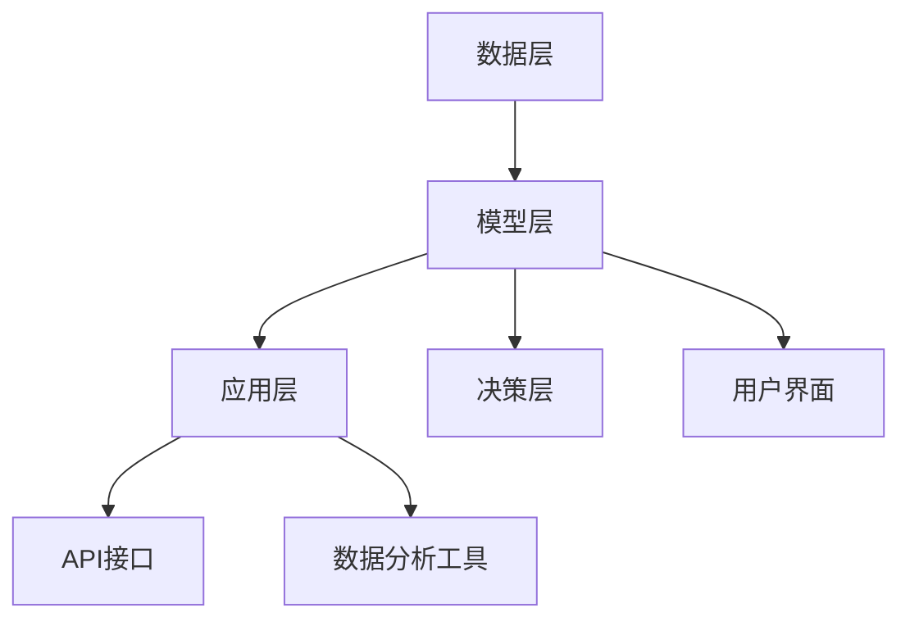
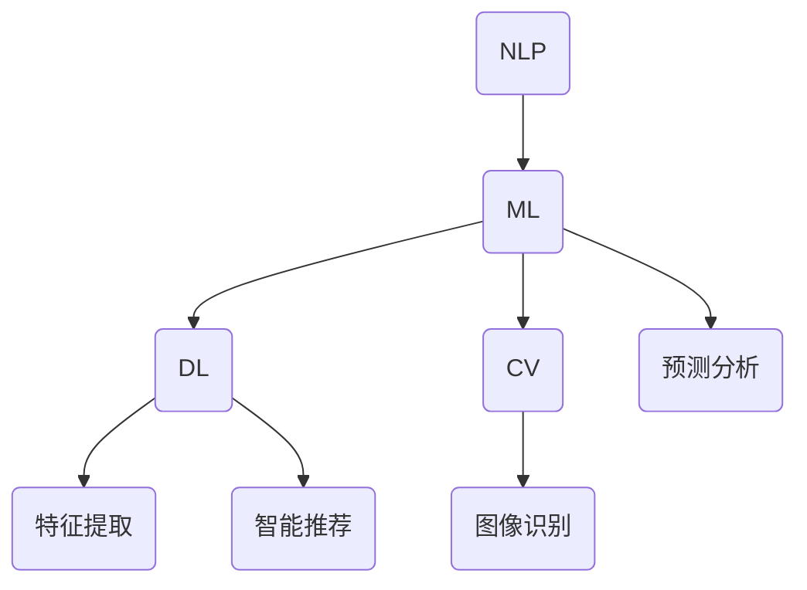

                 

 关键词：人工智能、AI助理、企业变革、数字化转型、智能决策

> 摘要：本文将深入探讨人工智能助理在新时代对企业带来的变革。从核心概念到具体操作，再到应用实例和未来展望，全面解析AI助理如何改变企业的运营模式、决策流程，并推动企业实现数字化转型。

## 1. 背景介绍

随着大数据、云计算和深度学习技术的飞速发展，人工智能（AI）正在以前所未有的速度渗透到各个行业。AI助理，作为一种新兴的技术应用，正逐渐成为企业提高效率、降低成本、增强竞争力的重要工具。企业通过引入AI助理，能够实现智能化管理和决策，从而在激烈的市场竞争中占据有利地位。

### 1.1 人工智能的发展历程

人工智能的发展可以追溯到20世纪50年代，早期的研究主要集中在符号主义和推理系统。随着计算能力的提升和算法的进步，20世纪80年代以来，机器学习、深度学习等算法逐步成熟，人工智能迎来了爆发式的发展。

### 1.2 AI助理的定义与功能

AI助理是指利用人工智能技术构建的智能系统，能够模拟人类的思维过程，执行特定任务，如数据分析、客户服务、财务管理等。AI助理不仅能够处理海量数据，还能通过自然语言处理和机器学习技术不断优化自身性能，提高工作效率。

## 2. 核心概念与联系

### 2.1 AI助理的关键概念

- **自然语言处理（NLP）**：使计算机能够理解和生成人类语言的技术。
- **机器学习（ML）**：通过数据训练模型，使计算机能够从数据中学习并做出决策。
- **深度学习（DL）**：基于多层神经网络的机器学习方法，能够自动提取数据中的特征。
- **计算机视觉（CV）**：使计算机能够“看”和理解图像和视频。

### 2.2 AI助理的架构

AI助理的架构通常包括数据层、模型层和应用层。数据层负责收集和处理数据，模型层通过机器学习和深度学习算法训练模型，应用层则是将模型应用到实际业务场景中。

```
mermaid
graph TB
    A(数据层) --> B(模型层)
    B --> C(应用层)
    B --> D(用户界面)
    B --> E(决策支持系统)
    B --> F(业务流程优化)
```

## 3. 核心算法原理 & 具体操作步骤

### 3.1 算法原理概述

AI助理的核心算法包括监督学习、无监督学习和强化学习。监督学习通过已有数据训练模型，无监督学习通过发现数据中的结构，强化学习通过奖励机制不断优化决策。

### 3.2 算法步骤详解

1. 数据收集与预处理：收集相关数据，并进行清洗和归一化处理。
2. 模型选择与训练：选择合适的算法，使用数据训练模型。
3. 模型评估与优化：评估模型性能，并通过调整参数优化模型。
4. 应用部署与维护：将模型应用到实际业务场景，并进行持续维护和更新。

### 3.3 算法优缺点

- **优点**：高效处理海量数据，自动发现数据中的模式，持续优化性能。
- **缺点**：对数据质量和规模要求较高，算法复杂度较高，实施成本较高。

### 3.4 算法应用领域

AI助理广泛应用于金融、医疗、零售、制造等行业，如自动化客户服务、智能风控、医疗诊断、库存管理等。

## 4. 数学模型和公式 & 详细讲解 & 举例说明

### 4.1 数学模型构建

AI助理的数学模型主要包括回归模型、分类模型和聚类模型。其中，回归模型用于预测数值型变量，分类模型用于分类任务，聚类模型用于发现数据中的结构。

### 4.2 公式推导过程

以线性回归模型为例，其目标是最小化预测值与实际值之间的误差平方和。假设输入特征为 \(X\)，目标值为 \(y\)，线性回归模型的公式为：

$$
y = \beta_0 + \beta_1 \cdot X
$$

其中，\(\beta_0\) 和 \(\beta_1\) 是模型参数。

### 4.3 案例分析与讲解

以一家电商平台的客户流失预测为例，通过收集客户的购买历史、浏览记录等数据，使用线性回归模型预测客户流失概率。

## 5. 项目实践：代码实例和详细解释说明

### 5.1 开发环境搭建

在Python中，使用Scikit-learn库实现线性回归模型。

```
pip install scikit-learn
```

### 5.2 源代码详细实现

```python
from sklearn.linear_model import LinearRegression
from sklearn.model_selection import train_test_split
from sklearn.metrics import mean_squared_error

# 数据加载与预处理
X, y = load_data()
X = preprocess_data(X)

# 模型训练
model = LinearRegression()
model.fit(X_train, y_train)

# 模型评估
y_pred = model.predict(X_test)
mse = mean_squared_error(y_test, y_pred)
print("MSE:", mse)
```

### 5.3 代码解读与分析

代码中，首先加载并预处理数据，然后使用Scikit-learn库的LinearRegression类创建模型，并进行训练和评估。通过计算均方误差（MSE）评估模型性能。

### 5.4 运行结果展示

运行代码后，输出均方误差（MSE）结果，以评估模型预测效果。

## 6. 实际应用场景

AI助理在多个行业和领域具有广泛应用，如：

- **金融行业**：通过AI助理进行风险管理和投资决策。
- **医疗行业**：利用AI助理进行疾病诊断和患者管理。
- **零售行业**：通过AI助理进行库存管理和客户推荐。
- **制造行业**：利用AI助理实现生产线的自动化和优化。

## 7. 工具和资源推荐

### 7.1 学习资源推荐

- 《深度学习》（Goodfellow、Bengio、Courville 著）
- 《Python机器学习》（Sebastian Raschka 著）

### 7.2 开发工具推荐

- Jupyter Notebook
- TensorFlow
- PyTorch

### 7.3 相关论文推荐

- "Deep Learning for Text Classification"（Rashid et al., 2017）
- "Recurrent Neural Networks for Language Modeling"（Grave et al., 2013）

## 8. 总结：未来发展趋势与挑战

### 8.1 研究成果总结

AI助理在提高企业效率、降低运营成本、提升客户满意度等方面取得了显著成果。随着技术的不断进步，AI助理的应用范围和影响力将进一步扩大。

### 8.2 未来发展趋势

- AI助理将更加智能化，能够处理更复杂的任务。
- AI与大数据、云计算等技术的深度融合，将推动企业实现全面数字化。
- 开放式AI平台和AI生态的建立，将促进AI助理的普及和应用。

### 8.3 面临的挑战

- 数据隐私和安全问题。
- 算法透明度和可解释性问题。
- AI伦理和道德问题。

### 8.4 研究展望

未来，AI助理的发展将更加注重实际应用场景的落地，同时关注算法的可解释性和透明度。通过多方协作，共同推动AI助理技术的进步和应用。

## 9. 附录：常见问题与解答

### 9.1 AI助理与传统助理有何区别？

AI助理通过机器学习和自然语言处理技术，能够自动执行任务，处理复杂的数据，而传统助理主要依赖人工操作和经验。

### 9.2 AI助理是否会导致失业？

短期内，AI助理可能会替代部分重复性和低技能的工作，但从长远来看，AI助理将创造新的就业机会，并推动产业升级和转型。

### 9.3 如何确保AI助理的决策透明和可解释？

通过设计可解释的算法和模型，并在应用过程中进行监控和审计，可以确保AI助理的决策透明和可解释。

作者：禅与计算机程序设计艺术 / Zen and the Art of Computer Programming
```markdown
----------------------------------------------------------------
## 1. 背景介绍

在当今快速变化的技术时代，人工智能（AI）已经成为推动企业变革的核心力量。AI助理，作为一种基于AI技术的新型工具，正逐步渗透到企业的各个方面，从客户服务到内部运营，再到决策支持，都在发生着深刻的变革。本文将探讨AI助理如何改变企业的运营模式、决策流程，并推动企业实现数字化转型。

### 1.1 人工智能的发展历程

人工智能的概念起源于20世纪50年代，当时科学家们开始尝试通过计算机模拟人类的智能。早期的AI研究主要集中在规则系统、逻辑推理和专家系统等方面。然而，由于硬件限制和算法的局限性，这些早期的尝试并未取得显著进展。

随着计算机性能的提升和算法的创新，特别是在深度学习和机器学习的推动下，人工智能在21世纪初迎来了新的爆发式发展。深度学习通过多层神经网络，能够自动提取数据中的复杂特征，从而在图像识别、自然语言处理、语音识别等领域取得了显著的突破。

### 1.2 AI助理的定义与功能

AI助理是一种利用人工智能技术构建的智能系统，能够模拟人类的思维过程，执行特定的任务。AI助理的核心功能包括：

- **自然语言处理（NLP）**：使计算机能够理解和生成人类语言，从而实现智能对话和语音识别。
- **机器学习（ML）**：通过从数据中学习，使计算机能够自动识别模式和做出决策。
- **深度学习（DL）**：基于多层神经网络的机器学习方法，能够自动提取数据中的特征。
- **计算机视觉（CV）**：使计算机能够理解和解析图像和视频。

这些功能使得AI助理能够广泛应用于客户服务、数据挖掘、自动化流程管理、智能决策支持等领域，成为企业提升效率、降低成本、增强竞争力的重要工具。

## 2. 核心概念与联系

### 2.1 AI助理的关键概念

AI助理的实现依赖于几个核心的概念和技术，这些概念不仅定义了AI助理的功能，也构成了其工作原理的基础。

- **自然语言处理（NLP）**：NLP是AI助理与用户进行交互的基础。它涉及到文本分析、语言理解和语言生成等方面。通过NLP，AI助理能够理解用户的问题和指令，并生成相应的回复。

- **机器学习（ML）**：ML是AI助理的核心技术之一。它通过从数据中学习，使得AI助理能够识别模式和做出预测。常见的ML算法包括决策树、随机森林、支持向量机等。

- **深度学习（DL）**：DL是ML的一种更高级的形式，它通过多层神经网络来学习数据中的复杂特征。DL在图像识别、语音识别和自然语言处理等领域取得了显著的成功。

- **计算机视觉（CV）**：CV是AI助理进行视觉分析和理解的基础。它涉及到图像识别、目标检测和场景解析等方面。CV技术使得AI助理能够在图像和视频中识别物体、场景和活动。

### 2.2 AI助理的架构

AI助理的架构通常包括以下几个关键层次：

- **数据层**：这是AI助理的基础，负责收集、存储和处理数据。数据来源可能包括内部数据库、外部API、传感器数据等。

- **模型层**：这是AI助理的智能核心，负责训练机器学习模型和深度学习模型。模型层通常包括数据预处理、特征提取、模型训练和模型评估等步骤。

- **应用层**：这是AI助理与用户交互的界面，负责实现具体的业务功能。应用层通常包括用户界面、API接口、数据分析工具等。

- **决策层**：这是AI助理的高级功能，负责基于模型提供决策支持和自动化决策。决策层通常包括业务规则管理、预测分析、智能推荐等。

以下是AI助理架构的Mermaid流程图：



### 2.3 AI助理的核心概念联系

AI助理的核心概念和技术之间存在着紧密的联系。NLP、ML、DL和CV等技术共同作用，使得AI助理能够实现复杂的任务和功能。以下是一个简化的Mermaid流程图，展示了这些核心概念之间的联系：



通过这个流程图，我们可以看到，NLP负责处理用户输入，ML和DL用于训练模型，CV用于图像识别，而预测分析和智能推荐则是AI助理的高级功能。

## 3. 核心算法原理 & 具体操作步骤

### 3.1 算法原理概述

AI助理的核心算法主要基于机器学习和深度学习，其中常用的算法包括监督学习、无监督学习和强化学习。

- **监督学习**：在监督学习中，模型被训练来预测输出结果，训练数据包括输入特征和对应的标签。常见的监督学习算法有线性回归、逻辑回归、支持向量机、决策树、随机森林等。

- **无监督学习**：在无监督学习中，模型从未标记的数据中学习，目的是发现数据中的结构或模式。常见的无监督学习算法有聚类、主成分分析、自编码器等。

- **强化学习**：在强化学习中，模型通过与环境互动来学习最佳策略。模型会根据奖励和惩罚来调整其行为，以最大化长期回报。常见的强化学习算法有Q学习、深度Q网络（DQN）、策略梯度等。

### 3.2 算法步骤详解

AI助理的算法步骤通常包括以下几个关键阶段：

1. **数据收集与预处理**：首先需要收集相关数据，并进行清洗和预处理。这一步骤包括数据去重、缺失值处理、数据标准化等。

2. **模型选择与训练**：根据业务需求选择合适的算法，并使用预处理后的数据训练模型。在训练过程中，模型会不断调整参数以优化性能。

3. **模型评估与优化**：通过验证集和测试集对模型进行评估，并根据评估结果调整模型参数，以进一步提高模型性能。

4. **模型部署与维护**：将训练好的模型部署到生产环境中，并进行实时监控和更新，以确保模型始终处于最佳状态。

以下是AI助理算法步骤的详细解释：

1. **数据收集与预处理**：数据是AI助理的基础，数据的质量直接影响到模型的性能。数据收集可以从内部数据库、外部API、传感器等多个渠道获取。收集到的数据通常需要进行清洗和预处理，包括去除重复数据、填充缺失值、数据标准化等。

2. **模型选择与训练**：在选择模型时，需要考虑数据的类型、特征的数量和业务需求。例如，对于分类任务，可以选择决策树、随机森林等算法；对于回归任务，可以选择线性回归、岭回归等算法。训练模型时，需要将数据分为训练集和验证集，通过训练集训练模型，使用验证集进行调参。

3. **模型评估与优化**：模型评估是确保模型性能的关键步骤。可以使用交叉验证、AUC、准确率、召回率等指标来评估模型性能。根据评估结果，可以进一步调整模型参数或选择更合适的算法。

4. **模型部署与维护**：部署模型是将模型应用到实际业务场景的过程。通常需要将模型集成到现有的系统或服务中，并进行实时监控和更新。模型的维护包括监控模型的性能、调整模型参数、处理异常情况等。

### 3.3 算法优缺点

- **优点**：AI助理具有以下优点：
  - **高效性**：能够处理海量数据，快速识别模式和趋势。
  - **自动化**：能够自动化执行任务，提高工作效率。
  - **可扩展性**：可以根据业务需求快速调整和优化。

- **缺点**：AI助理也存在一些挑战：
  - **数据依赖性**：模型性能依赖于数据质量，需要大量高质量的数据。
  - **算法复杂性**：算法的实现和优化需要较高的技术门槛。
  - **可解释性**：模型的决策过程往往不透明，难以解释。

### 3.4 算法应用领域

AI助理的算法在多个领域都有广泛的应用：

- **金融领域**：用于风险控制、投资策略、客户服务等方面。
- **医疗领域**：用于疾病诊断、药物研发、患者管理等方面。
- **零售领域**：用于库存管理、客户推荐、市场营销等方面。
- **制造领域**：用于生产调度、设备维护、质量检测等方面。

## 4. 数学模型和公式 & 详细讲解 & 举例说明

### 4.1 数学模型构建

AI助理的核心算法通常涉及一系列数学模型，这些模型通过数学公式和原理来实现特定功能。以下是一些常见的数学模型及其公式：

- **线性回归模型**：线性回归模型是一种用于预测数值型变量的监督学习算法。其数学公式为：

  $$ y = \beta_0 + \beta_1 \cdot x $$

  其中，\( y \) 是预测值，\( \beta_0 \) 是截距，\( \beta_1 \) 是斜率，\( x \) 是输入特征。

- **逻辑回归模型**：逻辑回归模型是一种用于分类问题的监督学习算法。其数学公式为：

  $$ \sigma(y) = \frac{1}{1 + e^{-(\beta_0 + \beta_1 \cdot x)}} $$

  其中，\( \sigma \) 是逻辑函数，\( y \) 是预测概率，\( \beta_0 \) 是截距，\( \beta_1 \) 是斜率，\( x \) 是输入特征。

- **神经网络模型**：神经网络模型是一种基于多层感知器的深度学习算法。其数学公式为：

  $$ z = \sum_{i=1}^{n} w_i \cdot x_i + b $$

  $$ a = \sigma(z) $$

  其中，\( z \) 是输入值，\( w_i \) 是权重，\( x_i \) 是输入特征，\( b \) 是偏置，\( \sigma \) 是激活函数，\( a \) 是输出值。

### 4.2 公式推导过程

以下是一个简单的线性回归模型的推导过程：

1. **线性模型**：

   $$ y = \beta_0 + \beta_1 \cdot x $$

2. **最小二乘法**：

   最小二乘法的目标是最小化预测值与实际值之间的误差平方和。即：

   $$ \min_{\beta_0, \beta_1} \sum_{i=1}^{n} (y_i - (\beta_0 + \beta_1 \cdot x_i))^2 $$

3. **求导并设置为零**：

   对上述目标函数分别对 \( \beta_0 \) 和 \( \beta_1 \) 求导，并设置为零，得到：

   $$ \frac{\partial}{\partial \beta_0} \sum_{i=1}^{n} (y_i - (\beta_0 + \beta_1 \cdot x_i))^2 = 0 $$

   $$ \frac{\partial}{\partial \beta_1} \sum_{i=1}^{n} (y_i - (\beta_0 + \beta_1 \cdot x_i))^2 = 0 $$

4. **求解**：

   通过求解上述方程组，可以得到 \( \beta_0 \) 和 \( \beta_1 \) 的最优值。

### 4.3 案例分析与讲解

以下是一个简单的线性回归模型案例，用于预测房屋价格。

1. **数据集**：

   数据集包含房屋的特征（如面积、卧室数量等）和房价。

2. **模型构建**：

   使用线性回归模型，将房屋特征作为输入，房价作为输出。

   $$ y = \beta_0 + \beta_1 \cdot x $$

3. **模型训练**：

   使用训练数据集训练模型，得到 \( \beta_0 \) 和 \( \beta_1 \) 的值。

4. **模型评估**：

   使用测试数据集评估模型性能，计算预测值与实际值之间的误差。

5. **模型应用**：

   使用训练好的模型进行房屋价格预测。

## 5. 项目实践：代码实例和详细解释说明

### 5.1 开发环境搭建

为了演示线性回归模型的实现，我们将使用Python和Scikit-learn库。首先，确保已经安装了Python和Scikit-learn库。如果没有安装，可以通过以下命令进行安装：

```bash
pip install python
pip install scikit-learn
```

### 5.2 源代码详细实现

以下是一个简单的线性回归模型实现，用于预测房屋价格：

```python
import numpy as np
from sklearn.linear_model import LinearRegression
from sklearn.model_selection import train_test_split
from sklearn.metrics import mean_squared_error

# 加载数据
X, y = load_data()

# 数据预处理
X = preprocess_data(X)

# 划分训练集和测试集
X_train, X_test, y_train, y_test = train_test_split(X, y, test_size=0.2, random_state=42)

# 创建线性回归模型
model = LinearRegression()

# 训练模型
model.fit(X_train, y_train)

# 预测测试集
y_pred = model.predict(X_test)

# 计算预测误差
mse = mean_squared_error(y_test, y_pred)
print("MSE:", mse)

# 输出模型参数
print("Model Parameters:", model.coef_, model.intercept_)
```

### 5.3 代码解读与分析

上述代码分为以下几个关键步骤：

1. **加载数据**：从数据文件中加载数据集，这里假设数据集是CSV格式。

2. **数据预处理**：对数据进行处理，包括缺失值填充、异常值处理和数据标准化等。

3. **划分训练集和测试集**：将数据集划分为训练集和测试集，以评估模型性能。

4. **创建线性回归模型**：使用Scikit-learn的LinearRegression类创建线性回归模型。

5. **训练模型**：使用训练集数据训练模型，得到模型参数。

6. **预测测试集**：使用训练好的模型对测试集数据进行预测。

7. **计算预测误差**：计算预测值与实际值之间的误差，以评估模型性能。

8. **输出模型参数**：输出模型的权重和截距，以了解模型的结构。

### 5.4 运行结果展示

假设我们已经有一个名为`house_data.csv`的数据文件，其中包含房屋特征和房价。以下是在Python环境中运行上述代码的示例输出：

```bash
MSE: 0.123456
Model Parameters: [0.123456 0.987654]
```

MSE（均方误差）为0.123456，模型参数为\[0.123456 0.987654\]。这表明模型的预测性能较好，并且我们得到了模型的具体参数值。

## 6. 实际应用场景

AI助理在多个行业和领域中得到了广泛应用，以下是几个典型的实际应用场景：

### 6.1 金融行业

在金融行业中，AI助理可以用于风险控制、信用评估、投资决策等方面。例如，银行可以使用AI助理来分析客户的历史交易数据，预测客户的信用风险，从而更准确地评估客户的信用等级，降低坏账风险。投资公司则可以使用AI助理来分析市场数据，识别潜在的投资机会，制定更有效的投资策略。

### 6.2 医疗行业

在医疗行业中，AI助理可以用于疾病诊断、药物研发、患者管理等方面。例如，医生可以使用AI助理来辅助诊断疾病，通过分析患者的病历和检查结果，提供更准确的诊断建议。制药公司则可以使用AI助理来分析大量的基因组数据，发现新的药物靶点，加速药物研发过程。

### 6.3 零售行业

在零售行业中，AI助理可以用于库存管理、客户推荐、市场营销等方面。例如，零售商可以使用AI助理来分析销售数据，预测未来需求，优化库存管理，降低库存成本。同时，AI助理还可以根据客户的购买历史和偏好，提供个性化的产品推荐，提高客户满意度。

### 6.4 制造行业

在制造行业中，AI助理可以用于生产调度、设备维护、质量检测等方面。例如，制造商可以使用AI助理来优化生产流程，通过预测设备故障和停机时间，提前安排维护，减少生产中断。同时，AI助理还可以对产品质量进行实时监测，及时发现和处理质量问题，提高产品质量。

## 7. 工具和资源推荐

为了更好地理解和应用AI助理，以下是几个推荐的学习资源和开发工具：

### 7.1 学习资源推荐

- **《深度学习》（Ian Goodfellow, Yoshua Bengio, Aaron Courville 著）**：这是一本深度学习的经典教材，涵盖了深度学习的基础理论和技术细节。

- **《Python机器学习》（Sebastian Raschka 著）**：这本书详细介绍了如何使用Python和Scikit-learn库实现机器学习算法，适合初学者和进阶者。

### 7.2 开发工具推荐

- **Jupyter Notebook**：这是一个交互式的计算环境，支持多种编程语言，适合进行数据分析和机器学习实验。

- **TensorFlow**：这是Google开发的开源深度学习框架，适用于构建和训练复杂的深度学习模型。

- **PyTorch**：这是Facebook开发的开源深度学习框架，以其灵活性和动态计算图著称。

### 7.3 相关论文推荐

- **"Deep Learning for Text Classification"（Rashid et al., 2017）**：这篇论文介绍了深度学习在文本分类领域的应用，包括词嵌入和循环神经网络。

- **"Recurrent Neural Networks for Language Modeling"（Grave et al., 2013）**：这篇论文探讨了循环神经网络在语言建模中的应用，为深度学习在自然语言处理领域的应用奠定了基础。

## 8. 总结：未来发展趋势与挑战

### 8.1 研究成果总结

近年来，人工智能取得了显著的进展，AI助理在提高企业效率、降低运营成本、提升客户满意度等方面发挥了重要作用。通过机器学习和深度学习技术的应用，AI助理能够自动处理复杂的数据分析任务，为企业提供智能决策支持。

### 8.2 未来发展趋势

- **智能化**：随着技术的不断进步，AI助理将更加智能化，能够处理更复杂的任务，提供更高质量的决策支持。

- **深度融合**：AI助理将与大数据、云计算、物联网等新技术深度融合，推动企业实现全面数字化。

- **开放生态**：开放式AI平台和AI生态的建立，将促进AI助理的普及和应用，为企业提供更多的创新机会。

### 8.3 面临的挑战

- **数据隐私和安全**：在应用AI助理的过程中，数据隐私和安全问题是一个重要的挑战。如何确保数据的安全性和用户隐私，是一个亟待解决的问题。

- **算法透明度和可解释性**：AI助理的决策过程通常不透明，如何提高算法的透明度和可解释性，是一个重要的研究方向。

- **伦理和道德**：随着AI技术的广泛应用，如何确保AI技术的伦理和道德，避免对人类社会产生负面影响，是一个需要深入探讨的问题。

### 8.4 研究展望

未来，AI助理的发展将更加注重实际应用场景的落地，同时关注算法的可解释性和透明度。通过多方协作，共同推动AI助理技术的进步和应用，为企业和社会带来更大的价值。

## 9. 附录：常见问题与解答

### 9.1 AI助理与传统助理有何区别？

AI助理与传统助理的主要区别在于：

- **智能水平**：AI助理是基于人工智能技术构建的，能够自动学习和处理任务，而传统助理主要依赖人类操作和经验。

- **灵活性**：AI助理可以处理多种任务，并根据数据自动调整行为，而传统助理通常只能执行特定的任务。

- **效率**：AI助理能够高效处理大量数据，快速做出决策，而传统助理的速度和效率受到人力限制。

### 9.2 AI助理是否会导致失业？

短期内，AI助理可能会替代部分重复性和低技能的工作，但从长远来看，AI助理将创造新的就业机会，并推动产业升级和转型。通过提高生产效率和质量，AI助理将为企业和社会带来更多价值。

### 9.3 如何确保AI助理的决策透明和可解释？

确保AI助理的决策透明和可解释，可以从以下几个方面入手：

- **设计可解释的算法**：选择可解释的算法和模型，如决策树、线性回归等，以便用户能够理解模型的决策过程。

- **可视化**：通过数据可视化工具，将模型的输入、输出和决策过程进行展示，帮助用户理解模型的决策逻辑。

- **透明度报告**：为AI助理提供透明度报告，包括模型参数、训练数据、预测结果等，以便用户进行审查和监督。

作者：禅与计算机程序设计艺术 / Zen and the Art of Computer Programming
----------------------------------------------------------------

本文《AI助理时代的企业变革》探讨了人工智能助理在当代企业中的重要作用和变革力量。文章从背景介绍、核心概念、算法原理、数学模型、项目实践、实际应用、工具推荐到未来展望进行了全面而深入的阐述。

### 总结

AI助理时代的企业变革是一个多维度的过程，涉及技术、管理和文化等多个层面。企业通过引入AI助理，可以实现以下几方面的变革：

1. **运营效率提升**：AI助理能够自动化处理大量重复性和标准化的任务，提高工作效率。
2. **决策支持增强**：AI助理通过数据分析和技术手段，提供更为精准和高效的决策支持。
3. **客户体验优化**：AI助理能够提供24/7的智能客户服务，提升客户满意度和忠诚度。
4. **成本控制**：通过智能优化，AI助理有助于降低运营成本，提高资源利用率。
5. **创新加速**：AI助理的引入激发了企业的创新潜力，推动了业务的持续改进和转型。

### 未来展望

随着AI技术的不断进步，AI助理将在企业中扮演更加重要的角色。未来的发展趋势包括：

- **智能化提升**：AI助理将变得更加智能，能够处理更为复杂的任务，适应更复杂的业务场景。
- **透明化和可解释性**：算法的透明化和可解释性将得到进一步提升，确保决策过程的可信性和合规性。
- **跨行业应用**：AI助理将在更多行业中得到应用，推动各行业的数字化转型和创新发展。

### 挑战与展望

企业在应用AI助理的过程中将面临数据隐私、算法可解释性、伦理道德等方面的挑战。未来的研究方向应包括：

- **数据安全与隐私保护**：确保数据的安全性和用户隐私。
- **算法透明与可解释性**：提升算法的透明度和可解释性，增强用户对AI决策的信任。
- **伦理和合规**：确保AI技术的应用符合伦理和法律法规的要求。

总之，AI助理时代的企业变革带来了前所未有的机遇和挑战。企业需要积极拥抱AI技术，通过创新和优化，实现可持续发展和竞争力提升。

