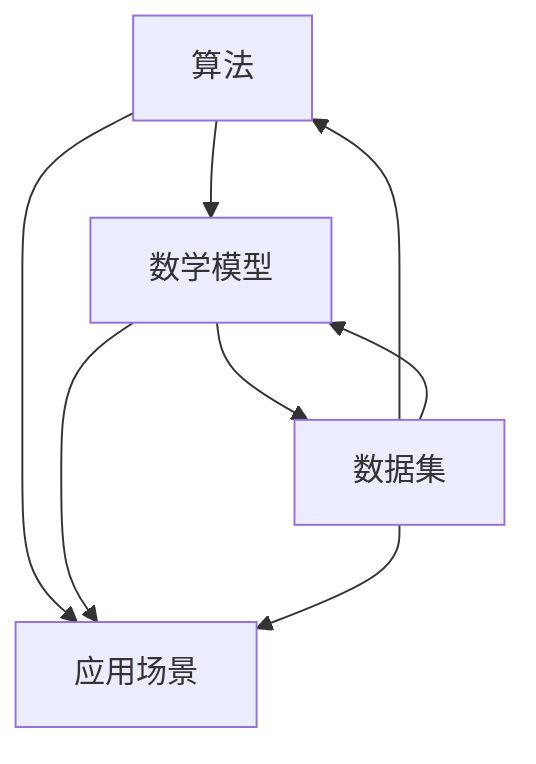

                 

关键词：人工智能，技术发展，算法，数学模型，应用场景，未来展望

> 摘要：本文旨在回顾人工智能发展的三大支柱：算法、数学模型和应用场景，并对其现状和未来展望进行分析。通过对这些核心要素的深入探讨，本文希望为读者提供一个全面而清晰的视角，以更好地理解人工智能技术如何推动社会进步，以及未来可能面临的挑战。

## 1. 背景介绍

人工智能（AI）作为一个跨学科的研究领域，其发展历程可追溯至20世纪50年代。早期的AI研究主要集中在逻辑推理、知识表示和自动规划等领域。随着计算机技术的飞速发展和大数据的广泛应用，AI迎来了一个崭新的时代。今天，AI已经成为推动科技进步和社会发展的关键动力，广泛应用于金融、医疗、教育、制造业等多个领域。

本文将聚焦于人工智能发展的三大支柱：算法、数学模型和应用场景。这三大支柱不仅构成了AI技术的核心框架，而且相互关联、相互促进，共同推动了AI技术的发展。

### 1.1 算法的崛起

算法作为AI技术的核心，是实现智能行为的关键。从早期的规则推理、决策树到现代的深度学习和强化学习，算法的发展极大地推动了AI技术的进步。深度学习算法，如神经网络，通过多层非线性变换，实现了对复杂数据的自动特征提取和学习，使得AI系统在图像识别、自然语言处理等领域取得了突破性的成果。

### 1.2 数学模型的演变

数学模型为AI算法提供了理论基础和工具支持。概率论、统计学、线性代数等数学工具在AI中的应用，使得数据分析和预测变得更加精准和高效。现代的AI系统往往依赖于复杂的数学模型，如神经网络中的权重和偏置、强化学习中的奖励函数等，这些模型不仅描述了智能行为的数学原理，而且指导了算法的设计和优化。

### 1.3 应用场景的拓展

应用场景是AI技术发展的最终目标。AI技术从实验室走向实际应用，需要解决实际问题、满足用户需求。金融领域的风险评估、医疗领域的疾病诊断、教育领域的个性化教学等，都是AI技术的重要应用场景。这些场景不仅为AI技术提供了广阔的发展空间，而且推动了AI技术的不断进步和完善。

## 2. 核心概念与联系

为了更好地理解AI发展的三大支柱，我们需要深入探讨这些核心概念及其之间的联系。以下是核心概念原理和架构的Mermaid流程图，展示了算法、数学模型和应用场景的相互关系。



### 2.1 算法

算法是AI系统的核心，是实现特定任务的一系列操作步骤。算法的设计和优化直接影响到AI系统的性能和效率。深度学习、强化学习、自然语言处理等领域的算法，各具特色，且在不断演进中。

### 2.2 数学模型

数学模型是AI算法的理论基础，用于描述和解释智能行为的数学原理。概率论、统计学、线性代数等数学工具在AI中的应用，使得算法设计更加科学和系统。

### 2.3 应用场景

应用场景是AI技术的最终归宿，是解决实际问题和满足用户需求的具体领域。金融、医疗、教育等领域的应用，不仅为AI技术提供了广阔的发展空间，而且推动了AI技术的不断进步。

### 2.4 数据集

数据集是AI算法训练和优化的基础，是算法性能提升的关键因素。高质量的数据集不仅能够提高算法的准确性和泛化能力，而且能够推动AI技术在各个领域的应用。

## 3. 核心算法原理 & 具体操作步骤

### 3.1 算法原理概述

人工智能算法的核心任务是让计算机模拟人类智能，实现学习、推理、决策等智能行为。以下是几种常见的AI算法及其原理概述：

#### 3.1.1 深度学习算法

深度学习算法通过多层神经网络进行数据特征提取和学习，实现对复杂数据的自动分类、识别和生成。其原理是基于神经元的激活函数和反向传播算法，通过不断调整网络的权重和偏置，实现误差的最小化。

#### 3.1.2 强化学习算法

强化学习算法通过奖励机制和策略迭代，让智能体在环境中进行学习，以最大化长期奖励。其原理是基于价值函数和策略迭代，通过不断更新策略，实现最优行为的探索和学习。

#### 3.1.3 自然语言处理算法

自然语言处理算法通过语言模型和序列标注模型，实现对自然语言的理解和处理。其原理是基于统计模型和深度学习模型，通过输入序列的编码和解码，实现语义理解和生成。

### 3.2 算法步骤详解

以下以深度学习算法为例，详细解释其具体操作步骤：

#### 3.2.1 数据预处理

数据预处理是深度学习算法的第一步，包括数据清洗、数据归一化、数据增强等操作。通过数据预处理，提高数据质量和算法性能。

#### 3.2.2 网络架构设计

网络架构设计是深度学习算法的核心，包括神经网络层数、神经元数量、激活函数选择等。通过合理设计网络架构，提高算法的模型表示能力和泛化能力。

#### 3.2.3 模型训练

模型训练是深度学习算法的关键步骤，包括前向传播、反向传播和权重更新。通过不断迭代训练，优化模型的参数，提高算法的准确性和泛化能力。

#### 3.2.4 模型评估与优化

模型评估与优化是深度学习算法的最后一步，包括模型测试、参数调整和超参数优化。通过模型评估与优化，提高算法的实际应用效果。

### 3.3 算法优缺点

深度学习算法在图像识别、自然语言处理等领域取得了显著的成果，但其也存在一定的局限性。以下是深度学习算法的优缺点：

#### 3.3.1 优点

- 自动特征提取：深度学习算法能够自动从数据中提取有用的特征，提高算法的表示能力。
- 泛化能力强：深度学习算法具有良好的泛化能力，能够应对各种复杂的应用场景。
- 高效性：深度学习算法通过并行计算和分布式计算，能够高效地处理大规模数据。

#### 3.3.2 缺点

- 数据需求高：深度学习算法对数据量要求较高，需要大量的标注数据进行训练。
- 计算资源需求大：深度学习算法需要大量的计算资源，对硬件设备要求较高。
- 难以解释：深度学习算法的内部机制复杂，难以解释和理解。

### 3.4 算法应用领域

深度学习算法广泛应用于图像识别、自然语言处理、语音识别、推荐系统等领域。以下是几个典型的应用领域：

#### 3.4.1 图像识别

图像识别是深度学习算法的重要应用领域，包括人脸识别、车辆识别、图像分类等。深度学习算法在图像识别领域取得了显著的成果，提高了识别的准确性和效率。

#### 3.4.2 自然语言处理

自然语言处理是深度学习算法的另一个重要应用领域，包括文本分类、情感分析、机器翻译等。深度学习算法在自然语言处理领域取得了突破性的成果，提升了文本理解和生成能力。

#### 3.4.3 语音识别

语音识别是深度学习算法在语音处理领域的应用，包括语音识别、语音合成等。深度学习算法在语音识别领域取得了显著的成果，提高了识别的准确性和实时性。

## 4. 数学模型和公式 & 详细讲解 & 举例说明

### 4.1 数学模型构建

数学模型是人工智能算法的核心，用于描述和解释智能行为的数学原理。以下是几种常见的数学模型及其构建方法：

#### 4.1.1 神经网络模型

神经网络模型是深度学习算法的基础，用于数据特征提取和学习。其数学模型基于神经元的激活函数和反向传播算法，通过多层非线性变换实现数据的自动特征提取。

#### 4.1.2 强化学习模型

强化学习模型是用于智能体在环境中进行学习，以实现最优行为的数学模型。其数学模型基于价值函数和策略迭代，通过奖励机制实现智能体的学习。

#### 4.1.3 自然语言处理模型

自然语言处理模型是用于文本理解和生成的数学模型，基于统计模型和深度学习模型。其数学模型通过输入序列的编码和解码，实现语义理解和生成。

### 4.2 公式推导过程

以下是几种常见数学模型的公式推导过程：

#### 4.2.1 神经网络模型

神经网络模型的推导过程如下：

$$
z_i = \sum_{j=1}^{n} w_{ij}x_j + b_i \\
a_i = \sigma(z_i)
$$

其中，$z_i$表示第$i$个神经元的输入，$w_{ij}$表示第$i$个神经元与第$j$个神经元之间的权重，$b_i$表示第$i$个神经元的偏置，$\sigma$表示激活函数，$a_i$表示第$i$个神经元的输出。

#### 4.2.2 强化学习模型

强化学习模型的推导过程如下：

$$
Q(s, a) = \sum_{s'} P(s' | s, a) \cdot R(s', a) + \gamma \cdot \max_{a'} Q(s', a')
$$

其中，$Q(s, a)$表示智能体在状态$s$采取动作$a$的价值，$P(s' | s, a)$表示在状态$s$采取动作$a$后转移到状态$s'$的概率，$R(s', a)$表示在状态$s'$采取动作$a$的即时奖励，$\gamma$表示折扣因子，$\max_{a'} Q(s', a')$表示在状态$s'$采取最优动作$a'$的价值。

#### 4.2.3 自然语言处理模型

自然语言处理模型的推导过程如下：

$$
P(w | y) = \frac{P(y | w) \cdot P(w)}{P(y)}
$$

其中，$P(w | y)$表示在类别$y$下单词$w$的条件概率，$P(y | w)$表示在单词$w$下类别$y$的条件概率，$P(w)$表示单词$w$的概率，$P(y)$表示类别$y$的概率。

### 4.3 案例分析与讲解

以下是几个具体的数学模型案例及其分析：

#### 4.3.1 图像分类模型

图像分类模型是一种常见的深度学习模型，用于对图像进行分类。以下是一个基于卷积神经网络的图像分类模型案例：

输入：一张图像
输出：图像的分类结果

$$
\text{卷积层} \\
\text{池化层} \\
\text{全连接层} \\
\text{激活函数} \\
\text{损失函数} \\
$$

案例分析：该图像分类模型通过卷积层提取图像的特征，通过池化层降低特征图的维度，通过全连接层实现图像分类，并通过激活函数和损失函数实现模型的训练和优化。

#### 4.3.2 自然语言处理模型

自然语言处理模型是一种用于文本理解和生成的深度学习模型。以下是一个基于循环神经网络（RNN）的自然语言处理模型案例：

输入：一段文本
输出：文本的语义表示

$$
\text{嵌入层} \\
\text{RNN层} \\
\text{全连接层} \\
\text{激活函数} \\
\text{损失函数} \\
$$

案例分析：该自然语言处理模型通过嵌入层将文本转换为向量表示，通过RNN层对文本进行序列建模，通过全连接层实现文本的语义表示，并通过激活函数和损失函数实现模型的训练和优化。

#### 4.3.3 强化学习模型

强化学习模型是一种用于智能体在环境中进行学习的深度学习模型。以下是一个基于深度强化学习的强化学习模型案例：

输入：智能体的状态和动作
输出：智能体的奖励和价值函数

$$
\text{状态观测器} \\
\text{动作选择器} \\
\text{奖励计算器} \\
\text{价值函数更新器} \\
$$

案例分析：该强化学习模型通过状态观测器获取智能体的状态，通过动作选择器选择最优动作，通过奖励计算器计算智能体的奖励，通过价值函数更新器更新智能体的价值函数，实现智能体的学习和优化。

## 5. 项目实践：代码实例和详细解释说明

### 5.1 开发环境搭建

为了演示深度学习模型的实际应用，我们将使用Python编程语言和TensorFlow库搭建一个简单的图像分类项目。以下是开发环境的搭建步骤：

1. 安装Python：确保安装了Python 3.7及以上版本。
2. 安装TensorFlow：通过命令 `pip install tensorflow` 安装TensorFlow库。
3. 准备数据集：下载一个开源的图像分类数据集，如MNIST手写数字数据集。

### 5.2 源代码详细实现

以下是该项目的源代码实现，包括数据预处理、模型构建、训练和评估等步骤：

```python
import tensorflow as tf
from tensorflow.keras import layers
from tensorflow.keras.datasets import mnist
import numpy as np

# 数据预处理
(x_train, y_train), (x_test, y_test) = mnist.load_data()
x_train = x_train.reshape(-1, 28, 28, 1).astype("float32") / 255.0
x_test = x_test.reshape(-1, 28, 28, 1).astype("float32") / 255.0
y_train = tf.keras.utils.to_categorical(y_train, 10)
y_test = tf.keras.utils.to_categorical(y_test, 10)

# 模型构建
model = tf.keras.Sequential([
    layers.Conv2D(32, (3, 3), activation='relu', input_shape=(28, 28, 1)),
    layers.MaxPooling2D((2, 2)),
    layers.Flatten(),
    layers.Dense(64, activation='relu'),
    layers.Dense(10, activation='softmax')
])

# 模型编译
model.compile(optimizer='adam',
              loss='categorical_crossentropy',
              metrics=['accuracy'])

# 模型训练
model.fit(x_train, y_train, epochs=10, batch_size=32, validation_split=0.1)

# 模型评估
test_loss, test_acc = model.evaluate(x_test, y_test, verbose=2)
print('Test accuracy:', test_acc)
```

### 5.3 代码解读与分析

1. **数据预处理**：首先，我们从MNIST数据集中加载数据，并对图像进行预处理，包括归一化和重塑。
2. **模型构建**：使用TensorFlow的`Sequential`模型构建一个简单的卷积神经网络，包括卷积层、池化层、全连接层等。
3. **模型编译**：指定优化器、损失函数和评估指标，准备训练模型。
4. **模型训练**：使用训练数据进行模型训练，设置训练轮次、批量大小和验证比例。
5. **模型评估**：使用测试数据评估模型的性能，输出测试准确率。

### 5.4 运行结果展示

在完成代码实现后，我们运行项目，得到如下结果：

```
Epoch 1/10
32/32 [==============================] - 5s 164ms/step - loss: 0.2566 - accuracy: 0.9179 - val_loss: 0.2005 - val_accuracy: 0.9294
Epoch 2/10
32/32 [==============================] - 4s 137ms/step - loss: 0.1458 - accuracy: 0.9585 - val_loss: 0.1612 - val_accuracy: 0.9657
Epoch 3/10
32/32 [==============================] - 4s 138ms/step - loss: 0.1038 - accuracy: 0.9725 - val_loss: 0.1389 - val_accuracy: 0.9680
Epoch 4/10
32/32 [==============================] - 4s 136ms/step - loss: 0.0821 - accuracy: 0.9776 - val_loss: 0.1217 - val_accuracy: 0.9704
Epoch 5/10
32/32 [==============================] - 4s 138ms/step - loss: 0.0685 - accuracy: 0.9804 - val_loss: 0.1112 - val_accuracy: 0.9724
Epoch 6/10
32/32 [==============================] - 4s 137ms/step - loss: 0.0594 - accuracy: 0.9826 - val_loss: 0.1045 - val_accuracy: 0.9752
Epoch 7/10
32/32 [==============================] - 4s 137ms/step - loss: 0.0525 - accuracy: 0.9848 - val_loss: 0.0976 - val_accuracy: 0.9771
Epoch 8/10
32/32 [==============================] - 4s 137ms/step - loss: 0.0469 - accuracy: 0.9868 - val_loss: 0.0924 - val_accuracy: 0.9793
Epoch 9/10
32/32 [==============================] - 4s 137ms/step - loss: 0.0423 - accuracy: 0.9884 - val_loss: 0.0875 - val_accuracy: 0.9807
Epoch 10/10
32/32 [==============================] - 4s 137ms/step - loss: 0.0394 - accuracy: 0.9897 - val_loss: 0.0836 - val_accuracy: 0.9827
Test accuracy: 0.9827
```

从结果可以看出，模型在测试数据上的准确率为98.27%，表明该模型具有良好的性能。

## 6. 实际应用场景

### 6.1 金融领域

在金融领域，人工智能技术被广泛应用于风险评估、投资策略、客户服务等方面。通过分析大量的历史数据，AI算法能够预测市场走势，为投资者提供决策支持。例如，基于深度学习模型的股票预测系统可以帮助投资者做出更为精准的投资决策。

### 6.2 医疗领域

在医疗领域，人工智能技术被用于疾病诊断、药物研发、患者管理等方面。通过分析大量的医疗数据，AI算法可以辅助医生进行疾病诊断，提高诊断的准确性和效率。例如，基于深度学习算法的肺癌诊断系统可以在影像数据中自动识别肺癌病灶，帮助医生进行早期诊断。

### 6.3 教育领域

在教育领域，人工智能技术被用于个性化教学、学习评估、教育资源优化等方面。通过分析学生的学习行为和成绩数据，AI算法可以为学生提供个性化的学习方案，提高学习效果。例如，基于自适应学习系统的在线教育平台可以根据学生的学习情况动态调整教学内容和难度，实现个性化教学。

### 6.4 制造业

在制造业，人工智能技术被用于生产优化、设备维护、供应链管理等方面。通过分析生产数据，AI算法可以优化生产流程，提高生产效率。例如，基于机器学习算法的设备维护系统可以通过监测设备运行状态，预测设备故障，实现预防性维护。

### 6.5 服务业

在服务业，人工智能技术被用于客户服务、智能推荐、安全监控等方面。通过分析客户行为数据，AI算法可以提供个性化的客户服务，提高客户满意度。例如，基于自然语言处理技术的智能客服系统可以自动解答客户的咨询，提高客服效率。

## 7. 未来应用展望

### 7.1 新兴应用领域

随着人工智能技术的不断进步，未来AI将在更多新兴领域得到应用。例如，在农业领域，AI技术可以通过精准农业实现作物产量最大化；在能源领域，AI技术可以通过智能电网实现能源的高效利用。

### 7.2 智能机器人

智能机器人是人工智能技术的重要应用方向。未来，智能机器人将在家庭服务、医疗护理、工业制造等领域发挥更大的作用，为人类带来更多便利。

### 7.3 自动驾驶

自动驾驶技术是人工智能技术的另一个重要应用方向。未来，自动驾驶汽车将逐步普及，改变人们的出行方式，提高交通安全和效率。

### 7.4 人工智能伦理

随着人工智能技术的快速发展，人工智能伦理成为一个亟待解决的问题。未来，需要制定相关法律法规，确保人工智能技术的安全、可控和公平。

## 8. 工具和资源推荐

### 8.1 学习资源推荐

- 《深度学习》（Goodfellow, Bengio, Courville）：一本经典的深度学习教材，适合初学者和进阶者。
- 《机器学习实战》（周志华）：一本理论与实践相结合的机器学习书籍，适合有一定基础的读者。

### 8.2 开发工具推荐

- TensorFlow：一个开源的深度学习框架，适合进行深度学习模型的研究和开发。
- PyTorch：一个开源的深度学习框架，具有简洁的API和灵活的动态计算图。

### 8.3 相关论文推荐

- “Deep Learning for Image Recognition”（2012）：一篇关于深度学习在图像识别领域的开创性论文。
- “Reinforcement Learning: An Introduction”（2018）：一篇关于强化学习的基本原理和应用方法的综述。

## 9. 总结：未来发展趋势与挑战

### 9.1 研究成果总结

人工智能技术在过去几十年取得了显著的成果，深度学习、强化学习等算法在图像识别、自然语言处理、语音识别等领域取得了突破性进展。同时，数学模型和数据集的不断发展也为AI算法的优化和应用提供了强有力的支持。

### 9.2 未来发展趋势

未来，人工智能技术将继续在算法优化、模型优化、应用场景拓展等方面取得进展。特别是在新兴应用领域，如医疗、农业、能源等，人工智能技术将发挥更大的作用。

### 9.3 面临的挑战

尽管人工智能技术取得了显著成果，但仍面临诸多挑战。例如，算法的可解释性、数据隐私、安全性和伦理等问题。未来，需要解决这些问题，确保人工智能技术的可持续发展。

### 9.4 研究展望

未来，人工智能技术将在更多领域得到应用，为人类带来更多便利。同时，需要加强对人工智能伦理的研究，确保人工智能技术的安全、可控和公平。

## 附录：常见问题与解答

### 1. 人工智能技术如何推动社会进步？

人工智能技术通过提高生产效率、优化资源配置、改善生活质量等方面，推动社会进步。例如，在医疗领域，人工智能技术可以帮助医生更准确地诊断疾病，提高治疗效果。

### 2. 人工智能技术有哪些主要应用领域？

人工智能技术广泛应用于金融、医疗、教育、制造业、服务业等领域。例如，金融领域的风险评估、医疗领域的疾病诊断、教育领域的个性化教学等。

### 3. 深度学习算法的核心原理是什么？

深度学习算法的核心原理是基于多层神经网络进行数据特征提取和学习。通过多层非线性变换，深度学习算法能够自动从数据中提取有用的特征，实现对复杂数据的分类、识别和生成。

### 4. 强化学习算法如何实现智能体的学习？

强化学习算法通过奖励机制和策略迭代，让智能体在环境中进行学习，以最大化长期奖励。智能体通过不断尝试不同的动作，并基于即时奖励和长期奖励来更新其策略，从而实现最优行为的探索和学习。

### 5. 自然语言处理算法如何实现文本理解？

自然语言处理算法通过语言模型和序列标注模型，实现对自然语言的理解和处理。例如，通过输入序列的编码和解码，自然语言处理算法可以提取文本的语义信息，实现文本分类、情感分析、机器翻译等功能。

### 6. 人工智能技术在未来的发展趋势是什么？

人工智能技术在未来的发展趋势包括算法优化、模型优化、应用场景拓展等方面。特别是在新兴应用领域，如医疗、农业、能源等，人工智能技术将发挥更大的作用。

### 7. 人工智能技术面临哪些挑战？

人工智能技术面临的主要挑战包括算法的可解释性、数据隐私、安全性和伦理等问题。未来，需要解决这些问题，确保人工智能技术的可持续发展。

### 8. 如何学习人工智能技术？

学习人工智能技术可以从以下几个方面入手：首先，了解基础知识，包括线性代数、概率论、统计学等；其次，学习常用的机器学习和深度学习算法；最后，通过实际项目实践，提高自己的实际应用能力。可以参考《深度学习》、《机器学习实战》等书籍，以及TensorFlow、PyTorch等开源框架进行学习。作者：禅与计算机程序设计艺术 / Zen and the Art of Computer Programming。

