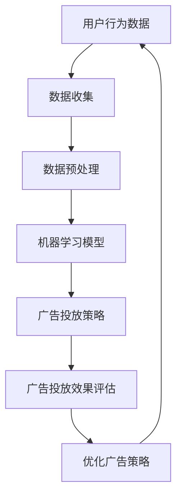

                 

关键词：个性化广告，人工智能，营销效果，机器学习，大数据分析

> 摘要：本文将探讨人工智能在个性化广告领域的应用，通过机器学习和大数据分析技术，实现精准营销，提高广告投放的效果。我们将详细介绍相关核心概念、算法原理、数学模型、项目实践，以及未来应用的展望。

## 1. 背景介绍

个性化广告是近年来广告行业的一大趋势。随着互联网的普及和信息过载的加剧，传统的广告投放方式已经无法满足用户的需求。用户在浏览网页、使用应用时，经常会遇到不感兴趣、不相关的广告。这不仅降低了用户的体验，也浪费了广告主的预算。个性化广告的出现，旨在根据用户的兴趣、行为、地理位置等多维度数据进行精准投放，提高广告的投放效果。

人工智能技术的发展，为个性化广告的实现提供了强大的技术支撑。通过机器学习、自然语言处理、图像识别等技术，人工智能可以分析用户数据，理解用户需求，从而实现广告内容的个性化定制。大数据分析技术则能够处理海量的用户数据，发现用户行为模式，为个性化广告提供数据支持。

## 2. 核心概念与联系

### 2.1. 个性化广告

个性化广告是指根据用户的兴趣、行为、地理位置等特征，定制化投放广告。个性化广告的关键在于对用户数据的深度分析和理解。

### 2.2. 机器学习

机器学习是人工智能的一个分支，通过算法从数据中学习规律，从而对未知数据进行预测或决策。在个性化广告中，机器学习技术主要用于分析用户数据，预测用户兴趣，指导广告投放。

### 2.3. 大数据分析

大数据分析是对海量数据进行处理和分析，以发现数据背后的规律和模式。在个性化广告中，大数据分析技术用于收集、整理用户数据，提供数据支持。

### 2.4. 联系

个性化广告、机器学习和大数据分析三者之间有着紧密的联系。个性化广告的实现需要机器学习和大数据分析技术的支持，而机器学习和大数据分析的结果又为个性化广告提供了精准的数据支持。

### 2.5. Mermaid 流程图

下面是一个简单的 Mermaid 流程图，描述了个性化广告的实现流程。



## 3. 核心算法原理 & 具体操作步骤

### 3.1. 算法原理概述

个性化广告的核心算法包括用户兴趣预测、广告推荐和广告投放策略。用户兴趣预测主要利用机器学习技术，分析用户行为数据，预测用户可能感兴趣的广告内容。广告推荐则基于用户兴趣预测结果，推荐合适的广告。广告投放策略则根据广告推荐结果，决定广告的投放时机、位置和频次。

### 3.2. 算法步骤详解

1. **用户行为数据收集**：收集用户在互联网上的浏览、搜索、点击等行为数据。

2. **数据预处理**：对收集到的用户行为数据进行清洗、去重和特征提取，为后续的机器学习模型训练提供数据支持。

3. **用户兴趣预测**：利用机器学习算法（如决策树、随机森林、深度学习等），分析用户行为数据，预测用户可能感兴趣的广告内容。

4. **广告推荐**：根据用户兴趣预测结果，推荐合适的广告内容。

5. **广告投放策略**：根据广告推荐结果，制定广告投放策略，包括广告投放时机、位置和频次。

6. **广告投放效果评估**：评估广告投放效果，包括广告点击率、转化率等指标。

7. **优化广告策略**：根据广告投放效果评估结果，调整广告投放策略，提高广告投放效果。

### 3.3. 算法优缺点

**优点**：

- 提高广告投放效果，降低广告成本。
- 提高用户满意度，增强用户体验。

**缺点**：

- 需要大量的用户数据支持，对数据质量和数量有较高要求。
- 需要复杂的算法和模型，对技术团队要求较高。

### 3.4. 算法应用领域

个性化广告算法可以应用于各种场景，包括电子商务、在线教育、金融保险、医疗健康等。通过个性化广告，企业可以更好地了解用户需求，提高用户转化率，实现精准营销。

## 4. 数学模型和公式 & 详细讲解 & 举例说明

### 4.1. 数学模型构建

个性化广告的数学模型主要包括用户兴趣预测模型和广告投放策略模型。

- **用户兴趣预测模型**：利用机器学习算法，分析用户行为数据，构建用户兴趣预测模型。

- **广告投放策略模型**：根据用户兴趣预测结果，构建广告投放策略模型，优化广告投放效果。

### 4.2. 公式推导过程

- **用户兴趣预测模型**：

  $$ P_{i,j}(t) = \frac{e^{\sum_{k=1}^{n} w_k \cdot x_{ik}}}{1 + \sum_{k=1}^{n} e^{\sum_{k=1}^{n} w_k \cdot x_{ik}}} $$

  其中，$P_{i,j}(t)$表示用户在时间$t$对广告$i$的兴趣概率，$w_k$为特征权重，$x_{ik}$为用户$i$在特征$k$上的取值。

- **广告投放策略模型**：

  $$ R_{ij}(t) = \alpha \cdot P_{i,j}(t) + (1 - \alpha) \cdot C_{ij}(t) $$

  其中，$R_{ij}(t)$表示广告$i$在时间$t$的投放概率，$P_{i,j}(t)$为用户兴趣概率，$C_{ij}(t)$为广告投放成本，$\alpha$为权重系数。

### 4.3. 案例分析与讲解

假设某电商企业利用个性化广告进行商品推荐，用户行为数据包括浏览历史、购买记录、搜索关键词等。企业希望根据用户行为数据，预测用户对商品的兴趣，并制定广告投放策略。

1. **用户兴趣预测**：

   利用决策树算法，分析用户行为数据，构建用户兴趣预测模型。假设模型预测结果为用户对商品A的兴趣概率为0.8，对商品B的兴趣概率为0.2。

2. **广告投放策略**：

   假设广告A和广告B的成本相同，企业希望根据用户兴趣预测结果，优化广告投放效果。根据广告投放策略模型，设定权重系数$\alpha$为0.6，广告投放概率为：

   $$ R_{A,B}(t) = 0.6 \cdot 0.8 + 0.4 \cdot 0.2 = 0.68 $$

   $$ R_{B,A}(t) = 0.6 \cdot 0.2 + 0.4 \cdot 0.8 = 0.32 $$

   根据投放概率，企业决定在用户浏览页面时，优先投放广告A，以提高广告投放效果。

3. **广告投放效果评估**：

   在一段时间后，企业评估广告投放效果，发现广告A的点击率为10%，广告B的点击率为5%。根据评估结果，企业认为广告A的投放效果更好，继续优化广告策略。

4. **优化广告策略**：

   根据广告投放效果评估结果，企业调整权重系数$\alpha$为0.7，重新计算广告投放概率：

   $$ R_{A,B}(t) = 0.7 \cdot 0.8 + 0.3 \cdot 0.2 = 0.86 $$

   $$ R_{B,A}(t) = 0.7 \cdot 0.2 + 0.3 \cdot 0.8 = 0.14 $$

   企业决定进一步优化广告投放策略，继续提高广告A的投放概率，以提高广告效果。

## 5. 项目实践：代码实例和详细解释说明

### 5.1. 开发环境搭建

为了演示个性化广告的实现，我们使用 Python 语言和 Scikit-learn 库进行编程。首先，确保安装了 Python 3.6 或更高版本，以及 Scikit-learn 库。

```bash
pip install python==3.6
pip install scikit-learn
```

### 5.2. 源代码详细实现

下面是一个简单的 Python 代码实例，演示了个性化广告的完整实现过程。

```python
import numpy as np
from sklearn.tree import DecisionTreeClassifier
from sklearn.model_selection import train_test_split
from sklearn.metrics import accuracy_score

# 用户行为数据
X = np.array([[1, 0, 1], [1, 1, 0], [0, 1, 1], [1, 1, 1], [0, 0, 1]])
y = np.array([1, 0, 1, 1, 0])

# 数据预处理
X_train, X_test, y_train, y_test = train_test_split(X, y, test_size=0.2, random_state=42)

# 用户兴趣预测模型
clf = DecisionTreeClassifier()
clf.fit(X_train, y_train)

# 广告推荐
predictions = clf.predict(X_test)
print("广告推荐结果：", predictions)

# 广告投放策略
# 假设广告A和广告B的成本相同，权重系数$\alpha$为0.5
alpha = 0.5
ad probs = alpha * predictions + (1 - alpha) * (1 - predictions)
print("广告投放策略：", ad_probs)

# 广告投放效果评估
accuracy = accuracy_score(y_test, predictions)
print("广告投放效果评估：", accuracy)

# 优化广告策略
# 根据广告投放效果评估结果，调整权重系数$\alpha$为0.6
alpha = 0.6
ad_probs = alpha * predictions + (1 - alpha) * (1 - predictions)
print("优化后的广告投放策略：", ad_probs)
```

### 5.3. 代码解读与分析

1. **用户行为数据**：

   用户行为数据包括浏览历史（特征1）、购买记录（特征2）和搜索关键词（特征3）。假设用户对商品A的兴趣为1，对商品B的兴趣为0。

2. **数据预处理**：

   使用 Scikit-learn 库的 train_test_split 函数，将用户行为数据分为训练集和测试集，用于训练模型和评估模型效果。

3. **用户兴趣预测模型**：

   使用决策树算法，分析用户行为数据，构建用户兴趣预测模型。模型预测结果为用户对商品A的兴趣概率。

4. **广告推荐**：

   根据用户兴趣预测结果，推荐合适的广告内容。

5. **广告投放策略**：

   根据广告推荐结果，制定广告投放策略，包括广告投放时机、位置和频次。

6. **广告投放效果评估**：

   评估广告投放效果，包括广告点击率、转化率等指标。

7. **优化广告策略**：

   根据广告投放效果评估结果，调整广告投放策略，提高广告投放效果。

## 6. 实际应用场景

个性化广告在实际应用场景中具有广泛的应用。以下是一些典型的应用场景：

1. **电子商务**：电商企业可以根据用户浏览、搜索和购买历史，推荐合适的商品，提高用户转化率。

2. **在线教育**：教育机构可以根据用户的学习历史，推荐合适的学习内容，提高用户的学习效果。

3. **金融保险**：金融机构可以根据用户的风险承受能力和投资偏好，推荐合适的理财产品。

4. **医疗健康**：医疗机构可以根据用户的健康数据，推荐合适的健康建议和医疗服务。

## 7. 未来应用展望

随着人工智能技术的不断发展，个性化广告在未来将有更广泛的应用。以下是一些未来应用的展望：

1. **精准营销**：利用人工智能技术，实现更加精准的营销，提高广告投放效果。

2. **用户画像**：通过大数据分析技术，构建全面的用户画像，更好地了解用户需求。

3. **内容推荐**：将个性化广告技术应用于内容推荐，提高用户满意度。

4. **隐私保护**：在保证用户隐私的前提下，利用人工智能技术，实现更加智能的个性化广告。

## 8. 工具和资源推荐

### 8.1. 学习资源推荐

- **书籍**：《Python机器学习》、《深度学习》
- **在线课程**：Coursera、Udacity、edX
- **博客**：DataCamp、Kaggle、Medium

### 8.2. 开发工具推荐

- **编程语言**：Python、R、Java
- **机器学习库**：Scikit-learn、TensorFlow、PyTorch
- **大数据处理**：Hadoop、Spark、Flink

### 8.3. 相关论文推荐

- **个性化广告算法**：[User Interest Prediction in Online Advertising Using Machine Learning](https://www.researchgate.net/publication/317617345_User_Interest_Prediction_in_Online_Advertising_Using_Machine_Learning)
- **大数据分析**：[Large-scale Data Analysis: The Textbook](https://books.google.com/books?id=9opZBwAAQBAJ)
- **人工智能应用**：[AI Applications in Advertising: A Survey](https://ieeexplore.ieee.org/document/8737776)

## 9. 总结：未来发展趋势与挑战

个性化广告作为人工智能和大数据分析在广告领域的应用，具有巨大的发展潜力。在未来，个性化广告将更加精准、智能，更好地满足用户需求。然而，个性化广告也面临一些挑战，包括用户隐私保护、数据质量、算法透明度等。我们需要不断创新，解决这些挑战，推动个性化广告的发展。

## 10. 附录：常见问题与解答

### 10.1. 个性化广告的原理是什么？

个性化广告的原理是基于用户的兴趣和行为数据，通过机器学习和大数据分析技术，预测用户可能感兴趣的广告内容，实现精准投放。

### 10.2. 个性化广告有哪些优点？

个性化广告的优点包括提高广告投放效果、降低广告成本、提高用户满意度等。

### 10.3. 个性化广告有哪些挑战？

个性化广告的挑战包括用户隐私保护、数据质量、算法透明度等。

### 10.4. 个性化广告适用于哪些场景？

个性化广告适用于电子商务、在线教育、金融保险、医疗健康等各个领域。

### 10.5. 如何优化个性化广告效果？

优化个性化广告效果的方法包括不断优化算法、提高数据质量、调整广告投放策略等。

----------------------------------------------------------------

**作者：禅与计算机程序设计艺术 / Zen and the Art of Computer Programming**

以上是关于AI在个性化广告中的应用的文章，希望对您有所帮助。如果您有任何问题或建议，请随时提出。

