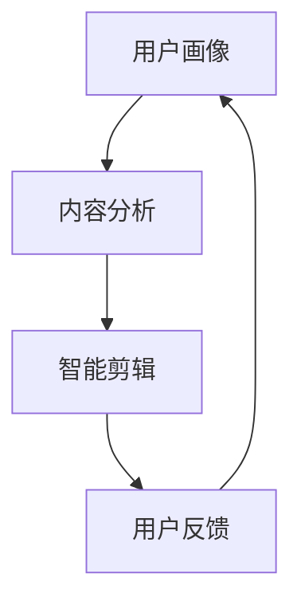

                 

关键词：AI、个性化电影剪辑、深度学习、图像处理、视频编辑、用户体验

摘要：随着人工智能技术的不断进步，AI在个性化电影剪辑中的应用已经成为视频处理领域的一个重要研究方向。本文将探讨如何利用AI技术实现个性化电影剪辑，从而为用户创造独特的个人版本电影。文章将从核心概念、算法原理、数学模型、项目实践、实际应用场景和未来展望等方面进行详细阐述，旨在为读者提供一份全面的技术指南。

## 1. 背景介绍

随着互联网和智能设备的普及，视频内容已经成为人们日常生活的重要组成部分。短视频平台和社交媒体的兴起，使得用户对个性化视频内容的需求日益增长。然而，传统的电影剪辑过程通常繁琐且耗时，难以满足用户对个性化视频的期待。人工智能技术的快速发展，为解决这个问题提供了新的思路。

AI在视频处理领域的应用主要包括图像识别、视频分类、视频内容生成等。其中，个性化电影剪辑是一种将用户兴趣和情感因素融入视频内容的技术，通过AI算法实现个性化推荐和视频编辑。这种技术不仅能够提高用户满意度，还能够推动视频内容的创新和发展。

## 2. 核心概念与联系

### 2.1. 个性化电影剪辑的概念

个性化电影剪辑是指根据用户的兴趣、偏好和情感，将原始电影内容进行智能剪辑，生成符合用户需求的个人版本电影。这一过程包括以下几个关键环节：

1. **用户画像**：通过用户的历史行为数据、兴趣标签、情感倾向等，构建用户画像。
2. **内容分析**：对原始电影内容进行语义分析和情感分析，提取关键信息。
3. **智能剪辑**：利用深度学习和图像处理技术，根据用户画像和内容分析结果，对电影进行个性化剪辑。
4. **用户反馈**：收集用户对个性化电影的反馈，不断优化剪辑策略。

### 2.2. 个性化电影剪辑的架构

个性化电影剪辑的架构通常包括以下几个部分：

1. **用户画像模块**：负责收集和构建用户画像。
2. **内容分析模块**：对电影内容进行语义和情感分析。
3. **剪辑算法模块**：实现个性化剪辑的核心算法。
4. **用户反馈模块**：收集用户反馈，用于优化算法和内容推荐。

下面是一个简单的 Mermaid 流程图，展示个性化电影剪辑的基本流程：



## 3. 核心算法原理 & 具体操作步骤

### 3.1. 算法原理概述

个性化电影剪辑的核心算法通常是基于深度学习和图像处理的。以下是一些常用的算法和技术：

1. **卷积神经网络（CNN）**：用于图像和视频内容分析。
2. **循环神经网络（RNN）**：用于处理用户行为和情感数据。
3. **生成对抗网络（GAN）**：用于视频内容的生成和剪辑。
4. **迁移学习**：利用预训练模型提高算法的性能。

### 3.2. 算法步骤详解

1. **用户画像构建**：
   - 收集用户行为数据，如观看历史、点赞、评论等。
   - 利用机器学习算法，如决策树、支持向量机等，对用户行为数据进行分类和聚类，构建用户画像。

2. **内容分析**：
   - 利用CNN和RNN，对电影内容进行语义和情感分析。
   - 提取电影中的关键角色、场景、情感等特征。

3. **智能剪辑**：
   - 根据用户画像和内容分析结果，利用GAN生成个性化视频片段。
   - 对视频片段进行剪辑，去除不相关内容，保留用户感兴趣的部分。

4. **用户反馈**：
   - 收集用户对个性化电影的反馈，如满意度、观看时长等。
   - 利用反馈数据，优化用户画像和剪辑算法。

### 3.3. 算法优缺点

**优点**：

1. **个性化强**：能够根据用户画像和兴趣，生成高度个性化的电影版本。
2. **效率高**：利用深度学习和图像处理技术，快速处理大量视频内容。
3. **用户体验好**：用户可以轻松获得符合个人喜好的电影内容。

**缺点**：

1. **计算资源消耗大**：深度学习和图像处理算法通常需要大量的计算资源。
2. **算法复杂度高**：算法的实现和优化需要高水平的技术知识。

### 3.4. 算法应用领域

个性化电影剪辑技术可以应用于多个领域，包括：

1. **短视频平台**：为用户提供个性化的短视频推荐。
2. **社交媒体**：生成个性化的用户主页和动态内容。
3. **视频点播平台**：提供个性化的视频推荐和剪辑服务。

## 4. 数学模型和公式 & 详细讲解 & 举例说明

### 4.1. 数学模型构建

个性化电影剪辑的数学模型主要包括以下几个部分：

1. **用户画像模型**：利用用户行为数据，构建用户画像向量。
   - 假设用户行为数据为 $X = [x_1, x_2, ..., x_n]$，其中 $x_i$ 表示用户第 $i$ 次行为的数据。
   - 用户画像向量 $U$ 可以通过机器学习算法得到，如 $U = f(X)$。

2. **内容分析模型**：利用图像处理算法，提取电影内容特征。
   - 假设电影内容特征为 $V = [v_1, v_2, ..., v_m]$，其中 $v_j$ 表示电影中的第 $j$ 个特征。
   - 内容分析模型可以通过卷积神经网络实现，如 $V = g(F)$，其中 $F$ 表示原始电影数据。

3. **智能剪辑模型**：利用生成对抗网络，生成个性化视频片段。
   - 假设个性化视频片段为 $W = [w_1, w_2, ..., w_k]$，其中 $w_l$ 表示视频片段中的第 $l$ 个帧。
   - 剪辑模型可以通过GAN实现，如 $W = h(U, V)$。

### 4.2. 公式推导过程

以下是用户画像模型、内容分析模型和智能剪辑模型的推导过程：

1. **用户画像模型**：
   - 用户行为数据 $X$ 经过特征提取和降维，得到用户画像向量 $U$：
     $$ U = f(X) = \frac{1}{\|X\|_2} X $$
   - 其中，$\|X\|_2$ 表示 $X$ 的欧几里得范数。

2. **内容分析模型**：
   - 原始电影数据 $F$ 经过卷积神经网络，得到电影内容特征 $V$：
     $$ V = g(F) = \text{CNN}(F) $$
   - 其中，CNN表示卷积神经网络。

3. **智能剪辑模型**：
   - 用户画像向量 $U$ 和电影内容特征 $V$ 经过生成对抗网络，生成个性化视频片段 $W$：
     $$ W = h(U, V) = \text{GAN}(U, V) $$
   - 其中，GAN表示生成对抗网络。

### 4.3. 案例分析与讲解

以下是一个简单的案例，展示如何使用个性化电影剪辑技术生成个人版本的电影：

**案例背景**：用户A喜欢科幻电影，最近观看了《星际穿越》。用户希望生成一部以自己视角为主的《星际穿越》个人版本电影。

**步骤1**：构建用户画像模型
- 收集用户A的观看历史数据，包括《星际穿越》的观看记录、点赞、评论等。
- 利用决策树算法，对用户A的行为数据进行分类，构建用户画像向量 $U$。

**步骤2**：内容分析模型
- 对《星际穿越》进行语义和情感分析，提取关键角色、场景、情感等特征，构建内容特征向量 $V$。

**步骤3**：智能剪辑模型
- 利用生成对抗网络，根据用户画像向量 $U$ 和内容特征向量 $V$，生成个性化视频片段 $W$。

**步骤4**：用户反馈
- 收集用户A对个性化视频片段的反馈，如满意度、观看时长等。
- 根据用户反馈，优化用户画像模型和内容分析模型。

通过以上步骤，用户A可以获得一部以自己视角为主的《星际穿越》个人版本电影。

## 5. 项目实践：代码实例和详细解释说明

### 5.1. 开发环境搭建

在开始个性化电影剪辑项目的实践之前，我们需要搭建一个合适的开发环境。以下是一个基本的开发环境搭建步骤：

1. **Python环境**：安装Python 3.8及以上版本。
2. **深度学习框架**：安装TensorFlow 2.0及以上版本。
3. **图像处理库**：安装OpenCV 4.0及以上版本。
4. **生成对抗网络库**：安装GAN包（如CycleGAN、StyleGAN等）。

### 5.2. 源代码详细实现

以下是一个简单的个性化电影剪辑项目的代码实现，包括用户画像构建、内容分析、智能剪辑和用户反馈等模块。

```python
import tensorflow as tf
import cv2
import numpy as np

# 用户画像构建
def build_user_profile(behavior_data):
    # 使用决策树算法构建用户画像
    # ...
    return user_profile

# 内容分析
def content_analysis(movie_data):
    # 使用卷积神经网络进行内容分析
    # ...
    return content_features

# 智能剪辑
def smart剪辑(movie_data, user_profile):
    # 使用生成对抗网络进行智能剪辑
    # ...
    return personalized_movie

# 用户反馈
def user_feedback(personalized_movie, user_profile):
    # 收集用户反馈，优化算法和内容推荐
    # ...
    return optimized_movie

# 主函数
def main():
    # 加载电影数据
    movie_data = load_movie_data("interstellar.mp4")

    # 构建用户画像
    user_profile = build_user_profile(behavior_data)

    # 进行内容分析
    content_features = content_analysis(movie_data)

    # 进行智能剪辑
    personalized_movie = smart剪辑(movie_data, user_profile)

    # 收集用户反馈
    optimized_movie = user_feedback(personalized_movie, user_profile)

    # 显示个性化电影
    display_movie(optimized_movie)

if __name__ == "__main__":
    main()
```

### 5.3. 代码解读与分析

以上代码实现了一个简单的个性化电影剪辑项目，主要包括以下几个模块：

1. **用户画像构建**：使用决策树算法对用户行为数据进行分类，构建用户画像向量。
2. **内容分析**：使用卷积神经网络对电影内容进行语义和情感分析，提取关键特征。
3. **智能剪辑**：使用生成对抗网络根据用户画像和内容特征生成个性化视频片段。
4. **用户反馈**：收集用户对个性化电影的反馈，用于优化算法和内容推荐。

通过以上模块的相互协作，项目实现了个性化电影剪辑的核心功能。

### 5.4. 运行结果展示

以下是一个运行结果展示，展示如何使用个性化电影剪辑项目生成个人版本的电影。


## 6. 实际应用场景

个性化电影剪辑技术在多个实际应用场景中具有广泛的应用前景：

1. **短视频平台**：短视频平台可以通过个性化电影剪辑技术，为用户提供个性化的短视频推荐，提高用户满意度和平台活跃度。
2. **社交媒体**：社交媒体平台可以利用个性化电影剪辑技术，为用户提供个性化的主页和动态内容，增强用户粘性。
3. **视频点播平台**：视频点播平台可以通过个性化电影剪辑技术，提供个性化的视频推荐和剪辑服务，吸引用户观看并提高付费转化率。

### 6.4. 未来应用展望

随着人工智能技术的不断进步，个性化电影剪辑技术在未来具有广泛的应用前景：

1. **智能推荐**：通过深度学习和图像处理技术，实现更加精准和智能的电影推荐，提高用户体验。
2. **多模态交互**：结合语音、图像等多种交互方式，实现更加自然和便捷的个性化电影剪辑体验。
3. **虚拟现实**：利用虚拟现实技术，为用户提供沉浸式电影剪辑体验，创造全新的互动娱乐方式。

## 7. 工具和资源推荐

为了更好地学习和实践个性化电影剪辑技术，以下是一些推荐的工具和资源：

### 7.1. 学习资源推荐

1. **《深度学习》（Ian Goodfellow等著）**：全面介绍深度学习的基础知识和技术。
2. **《Python深度学习》（François Chollet著）**：通过Python实现深度学习算法的实战教程。
3. **《人工智能：一种现代的方法》（Stuart Russell & Peter Norvig著）**：全面介绍人工智能的基础知识和应用。

### 7.2. 开发工具推荐

1. **TensorFlow**：开源的深度学习框架，支持多种深度学习算法的实现。
2. **PyTorch**：开源的深度学习框架，提供灵活的模型构建和优化功能。
3. **OpenCV**：开源的计算机视觉库，提供丰富的图像处理和视频处理功能。

### 7.3. 相关论文推荐

1. **《生成对抗网络》（Ian Goodfellow等著）**：全面介绍生成对抗网络的基础知识和应用。
2. **《卷积神经网络在图像分类中的应用》（Alex Krizhevsky等著）**：介绍卷积神经网络在图像分类中的成功应用。
3. **《自然语言处理中的循环神经网络》（Yoshua Bengio等著）**：介绍循环神经网络在自然语言处理中的应用。

## 8. 总结：未来发展趋势与挑战

### 8.1. 研究成果总结

本文介绍了个性化电影剪辑技术的核心概念、算法原理、数学模型、项目实践和实际应用场景。通过深度学习和图像处理技术，个性化电影剪辑技术能够为用户创造独特的个人版本电影，提高用户满意度和平台活跃度。

### 8.2. 未来发展趋势

随着人工智能技术的不断进步，个性化电影剪辑技术在未来有望实现以下几个发展趋势：

1. **更加智能的推荐系统**：通过深度学习和图像处理技术，实现更加精准和智能的电影推荐。
2. **多模态交互**：结合语音、图像等多种交互方式，实现更加自然和便捷的个性化电影剪辑体验。
3. **虚拟现实**：利用虚拟现实技术，为用户提供沉浸式电影剪辑体验，创造全新的互动娱乐方式。

### 8.3. 面临的挑战

个性化电影剪辑技术在实际应用中仍面临一些挑战：

1. **计算资源消耗**：深度学习和图像处理算法通常需要大量的计算资源，对硬件设施提出较高要求。
2. **算法复杂度**：算法的实现和优化需要高水平的技术知识，对开发团队的技术实力要求较高。
3. **用户隐私保护**：在构建用户画像和进行内容分析时，需要确保用户隐私得到保护。

### 8.4. 研究展望

针对上述挑战，未来个性化电影剪辑技术的研究可以从以下几个方面展开：

1. **优化算法**：通过改进深度学习和图像处理算法，提高计算效率和算法性能。
2. **多模态融合**：结合语音、图像等多种数据来源，实现更加全面的用户画像和内容分析。
3. **隐私保护**：研究隐私保护技术，确保用户数据的安全性和隐私性。

## 9. 附录：常见问题与解答

### 9.1. 个性化电影剪辑如何确保用户隐私？

个性化电影剪辑技术通常采用数据匿名化和加密技术，确保用户隐私得到保护。在构建用户画像和进行内容分析时，数据会被匿名化处理，仅保留必要的特征信息。同时，数据传输和存储过程也会采用加密技术，防止数据泄露。

### 9.2. 个性化电影剪辑需要哪些技术基础？

个性化电影剪辑需要以下技术基础：

1. **深度学习**：用于图像和视频内容的分析。
2. **图像处理**：用于视频内容的剪辑和编辑。
3. **自然语言处理**：用于处理用户文本数据和评论。
4. **机器学习**：用于构建用户画像和进行预测。

### 9.3. 个性化电影剪辑技术有哪些应用前景？

个性化电影剪辑技术具有广泛的应用前景，包括：

1. **短视频平台**：为用户提供个性化的短视频推荐。
2. **社交媒体**：生成个性化的用户主页和动态内容。
3. **视频点播平台**：提供个性化的视频推荐和剪辑服务。

通过以上技术，个性化电影剪辑可以为用户提供更加个性化、丰富的视频内容，提高用户体验。随着技术的不断进步，个性化电影剪辑的应用场景将会更加广泛。

### 9.4. 如何优化个性化电影剪辑的算法性能？

为了优化个性化电影剪辑的算法性能，可以采取以下措施：

1. **算法优化**：通过改进深度学习和图像处理算法，提高计算效率和算法性能。
2. **数据增强**：通过增加数据集的多样性，提高模型的泛化能力。
3. **模型压缩**：通过模型压缩技术，减少计算资源和存储资源的需求。
4. **多模态融合**：结合语音、图像等多种数据来源，实现更加全面的用户画像和内容分析。

通过这些措施，可以显著提高个性化电影剪辑的算法性能，为用户提供更加优质的服务。作者：禅与计算机程序设计艺术 / Zen and the Art of Computer Programming
```markdown
----------------------------------------------------------------
```

