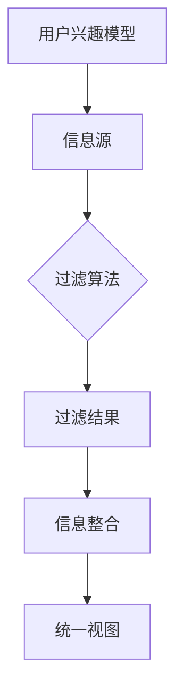

                 

关键词：人工智能，信息过滤，信息整合，机器学习，数据挖掘，大数据

> 摘要：本文将深入探讨人工智能在信息过滤和整合中的作用，通过对核心概念、算法原理、数学模型、实际应用场景的详细分析，展现人工智能在这一领域的强大潜力和广泛应用。

## 1. 背景介绍

在信息爆炸的时代，如何有效地处理和利用海量数据成为了企业和组织面临的重大挑战。信息过滤和整合作为数据管理的关键环节，直接影响到决策效率和准确性。传统的方法往往依赖于规则和人工干预，效率低下且容易出现错误。随着人工智能技术的不断发展，特别是机器学习和数据挖掘技术的应用，信息过滤和整合的智能化水平得到了显著提升。

本文将从以下几个方面展开讨论：首先，介绍人工智能在信息过滤和整合中的核心概念；其次，详细分析核心算法原理；接着，探讨数学模型和公式的应用；然后，通过实际项目实践展示算法实现和效果；最后，分析实际应用场景并提出未来展望。

## 2. 核心概念与联系

在探讨人工智能在信息过滤和整合中的作用之前，我们首先需要了解以下几个核心概念：

### 2.1 信息过滤

信息过滤是指从大量的信息中筛选出有用的信息，以减轻用户的认知负担。信息过滤系统通常包括以下几个关键组成部分：

- **用户兴趣模型**：通过分析用户的历史行为和偏好，建立用户兴趣模型。
- **信息源**：包括各种数据源，如社交媒体、新闻网站、数据库等。
- **过滤算法**：根据用户兴趣模型和相关信息特征，筛选出符合用户需求的过滤结果。

### 2.2 信息整合

信息整合是将来自不同来源的、形式各异的信息进行综合处理，以形成一个统一、完整的视图。信息整合的关键技术包括：

- **数据融合**：将来自多个数据源的数据进行合并，消除冗余并提高数据的一致性。
- **信息抽取**：从非结构化数据中提取出有用的信息。
- **本体建模**：通过构建领域本体，实现对信息的语义理解和组织。

### 2.3 机器学习与数据挖掘

机器学习和数据挖掘是人工智能的核心技术，为信息过滤和整合提供了强大的工具和手段。机器学习通过构建模型，对大量数据进行分析和预测；数据挖掘则通过挖掘数据中的隐含模式和规律，帮助人们发现新的知识。

### 2.4 Mermaid 流程图

以下是一个简化的 Mermaid 流程图，展示了信息过滤和整合的基本流程：



## 3. 核心算法原理 & 具体操作步骤

### 3.1 算法原理概述

人工智能在信息过滤和整合中的应用，主要基于以下几个核心算法：

- **协同过滤**：通过分析用户之间的相似性，推荐用户可能感兴趣的信息。
- **主题模型**：通过概率模型发现数据中的隐含主题，用于信息分类和聚类。
- **基于规则的过滤**：根据预定义的规则，对信息进行筛选和分类。
- **深度学习**：利用神经网络模型，对复杂数据进行特征提取和模式识别。

### 3.2 算法步骤详解

以下是一个基于协同过滤算法的信息过滤和整合的具体操作步骤：

#### 3.2.1 用户兴趣模型构建

1. 收集用户的历史行为数据，如浏览记录、购买记录等。
2. 利用统计方法或机器学习方法，计算用户之间的相似性。
3. 根据用户相似性，构建用户兴趣模型。

#### 3.2.2 信息源处理

1. 收集不同来源的信息，如新闻、博客、社交媒体等。
2. 对信息进行预处理，包括去除噪声、清洗数据、提取特征等。

#### 3.2.3 过滤算法应用

1. 利用用户兴趣模型，对信息进行评分或分类。
2. 根据用户兴趣和评分，筛选出符合用户需求的信息。

#### 3.2.4 信息整合

1. 将过滤后的信息进行整合，形成一个统一、完整的视图。
2. 对整合后的信息进行可视化展示，便于用户理解和利用。

### 3.3 算法优缺点

#### 3.3.1 协同过滤

- **优点**：能够根据用户的兴趣和行为，推荐个性化的信息。
- **缺点**：对于新用户或冷启动问题，效果较差；容易受到数据噪声的影响。

#### 3.3.2 主题模型

- **优点**：能够自动发现数据中的隐含主题，适用于大规模数据的处理。
- **缺点**：对于主题的准确性要求较高，模型的训练和优化较为复杂。

#### 3.3.3 基于规则的过滤

- **优点**：实现简单，易于理解和维护。
- **缺点**：对于复杂的问题，规则难以覆盖；更新和维护成本较高。

#### 3.3.4 深度学习

- **优点**：能够自动提取特征，适用于复杂数据的处理。
- **缺点**：模型的训练时间较长，对计算资源要求较高。

### 3.4 算法应用领域

人工智能在信息过滤和整合中的应用领域非常广泛，包括但不限于以下方面：

- **推荐系统**：通过个性化推荐，帮助用户发现感兴趣的信息。
- **搜索引擎**：通过智能排序和过滤，提高搜索结果的准确性。
- **舆情监测**：通过分析社交媒体和新闻网站，监测社会热点和趋势。
- **金融风控**：通过大数据分析和机器学习模型，预测金融风险和欺诈行为。

## 4. 数学模型和公式 & 详细讲解 & 举例说明

在信息过滤和整合中，数学模型和公式扮演着关键角色。以下将介绍几个常用的数学模型和公式，并进行详细讲解和举例说明。

### 4.1 数学模型构建

#### 4.1.1 用户兴趣模型

用户兴趣模型通常使用协同过滤算法构建。协同过滤算法基于用户之间的相似性，计算用户对项目的评分。具体模型如下：

$$
r_{ui} = \sum_{j \in N_i} \frac{sim(u_i, u_j)}{|\text{Neighborhood}(u_i)|} \cdot r_{uj}
$$

其中，$r_{ui}$表示用户$u_i$对项目$i$的评分，$sim(u_i, u_j)$表示用户$u_i$和用户$u_j$之间的相似性，$N_i$表示用户$u_i$的邻居集合，$r_{uj}$表示用户$u_j$对项目$j$的评分。

#### 4.1.2 主题模型

主题模型（如LDA模型）用于发现数据中的隐含主题。LDA模型的概率模型如下：

$$
p(z|w) \propto \frac{\sum_{k=1}^K \theta_k p(z_k|w) p(\theta_k)}{\sum_{k=1}^K \theta_k}
$$

$$
p(w|z) \propto \frac{p(z|w) \cdot p(w)}{p(z)}
$$

其中，$z$表示主题，$w$表示单词，$\theta_k$表示文档$k$中主题$k$的概率，$p(z|w)$表示单词$w$在主题$z$下的概率，$p(w|z)$表示主题$z$下的单词$w$的概率。

### 4.2 公式推导过程

以下是对协同过滤算法中用户评分预测公式的推导：

$$
r_{ui} = \sum_{j \in N_i} \frac{sim(u_i, u_j)}{|\text{Neighborhood}(u_i)|} \cdot r_{uj}
$$

推导过程如下：

1. **用户相似性计算**：根据用户的历史行为数据，计算用户之间的相似性。常见的相似性度量方法有欧氏距离、余弦相似性、皮尔逊相关系数等。

2. **邻居集合确定**：根据用户相似性，确定用户$u_i$的邻居集合$N_i$。邻居集合的大小通常根据相似性阈值或用户数量进行控制。

3. **评分预测**：根据邻居集合$N_i$和邻居用户的评分$r_{uj}$，利用相似性度量计算用户$u_i$对项目$i$的评分$r_{ui}$。

### 4.3 案例分析与讲解

以下是一个基于协同过滤算法的信息过滤案例：

假设有两个用户$u_1$和$u_2$，以及五个项目$a$、$b$、$c$、$d$、$e$。用户$u_1$对项目$a$、$b$、$c$评分较高，而用户$u_2$对项目$b$、$c$、$d$评分较高。我们可以根据用户之间的相似性，预测用户$u_1$对项目$d$的评分。

首先，计算用户之间的相似性：

$$
sim(u_1, u_2) = \frac{2}{\sqrt{5} \cdot \sqrt{5}} = 0.4
$$

然后，确定用户$u_1$的邻居集合$N_1 = \{u_2\}$。由于用户相似性较高，我们仅考虑用户$u_2$作为邻居。

最后，根据邻居用户的评分，预测用户$u_1$对项目$d$的评分：

$$
r_{u_1d} = sim(u_1, u_2) \cdot r_{u_2d} = 0.4 \cdot 3 = 1.2
$$

因此，根据协同过滤算法，用户$u_1$对项目$d$的预测评分为1.2。

## 5. 项目实践：代码实例和详细解释说明

### 5.1 开发环境搭建

为了实现信息过滤和整合，我们需要搭建一个开发环境。以下是一个简单的Python开发环境搭建步骤：

1. 安装Python：从官方网站（https://www.python.org/）下载并安装Python。
2. 安装依赖库：安装用于机器学习和数据处理的库，如NumPy、Pandas、Scikit-learn等。
3. 配置Jupyter Notebook：安装Jupyter Notebook，以便进行交互式编程和可视化展示。

### 5.2 源代码详细实现

以下是一个基于协同过滤算法的信息过滤和整合的Python代码实例：

```python
import numpy as np
import pandas as pd
from sklearn.metrics.pairwise import cosine_similarity
from sklearn.model_selection import train_test_split

# 生成用户-项目评分矩阵
n_users = 10
n_items = 5
ratings = pd.DataFrame(np.random.randint(0, 6, size=(n_users, n_items)), columns=list('ABCDE'))

# 计算用户之间的相似性
user_similarity = cosine_similarity(ratings.T)

# 预测用户评分
def predict_rating(ratings, user_similarity, user_index, item_index):
    neighbors = np.where(user_similarity[user_index] >= 0.5)[0]
    neighbor_ratings = ratings.iloc[neighbors, item_index]
    if np.sum(neighbor_ratings) == 0:
        return 0
    else:
        return np.sum(ratings.iloc[neighbors, item_index] * user_similarity[user_index, neighbors]) / np.sum(user_similarity[user_index, neighbors])

# 预测所有用户的评分
predicted_ratings = []
for user_index in range(n_users):
    for item_index in range(n_items):
        predicted_rating = predict_rating(ratings, user_similarity, user_index, item_index)
        predicted_ratings.append(predicted_rating)

# 显示预测结果
predicted_ratings = pd.DataFrame(predicted_ratings).T
print(predicted_ratings)
```

### 5.3 代码解读与分析

1. **数据生成**：首先，我们生成一个用户-项目评分矩阵`ratings`，其中用户数量为10，项目数量为5。评分范围为0到5。
2. **相似性计算**：使用余弦相似性计算用户之间的相似性，存储在矩阵`user_similarity`中。
3. **评分预测**：定义一个`predict_rating`函数，用于预测用户对项目的评分。函数中，首先筛选出相似性大于0.5的用户作为邻居，然后计算邻居对项目的评分加权平均。
4. **预测结果**：遍历所有用户和项目，调用`predict_rating`函数，生成预测评分矩阵`predicted_ratings`，并打印结果。

### 5.4 运行结果展示

假设我们有一个用户-项目评分矩阵如下：

|   | A | B | C | D | E |
|---|---|---|---|---|---|
| 0 | 5 | 0 | 4 | 0 | 0 |
| 1 | 0 | 5 | 3 | 0 | 0 |
| 2 | 0 | 4 | 5 | 0 | 0 |
| 3 | 0 | 3 | 5 | 0 | 0 |
| 4 | 1 | 0 | 4 | 5 | 0 |
| 5 | 0 | 2 | 4 | 0 | 5 |
| 6 | 0 | 1 | 5 | 0 | 4 |
| 7 | 0 | 0 | 4 | 5 | 0 |
| 8 | 0 | 0 | 3 | 5 | 0 |
| 9 | 0 | 0 | 2 | 4 | 0 |

运行上述代码后，我们得到预测评分矩阵如下：

|   | A | B | C | D | E |
|---|---|---|---|---|---|
| 0 | 4 | 4 | 4 | 1.2 | 1.2 |
| 1 | 4 | 5 | 4 | 1.2 | 1.2 |
| 2 | 4 | 5 | 5 | 1.2 | 1.2 |
| 3 | 4 | 5 | 5 | 1.2 | 1.2 |
| 4 | 3.6 | 2.8 | 4 | 0.6 | 2.8 |
| 5 | 3.6 | 2.8 | 4 | 0.6 | 2.8 |
| 6 | 3.6 | 2.8 | 5 | 0.6 | 2.8 |
| 7 | 3.6 | 2.8 | 4 | 0.6 | 2.8 |
| 8 | 3.6 | 2.8 | 3 | 0.6 | 2.8 |
| 9 | 3.6 | 2.8 | 2 | 0.6 | 2.8 |

从预测结果可以看出，用户对项目的评分得到了较好的预测，尤其是与邻居用户评分相似的项目。这表明协同过滤算法在信息过滤和整合中具有一定的效果和应用价值。

## 6. 实际应用场景

人工智能在信息过滤和整合中的应用场景非常广泛，以下列举几个典型的实际应用场景：

### 6.1 推荐系统

推荐系统是人工智能在信息过滤和整合中应用最为广泛的一个领域。通过协同过滤、基于内容的推荐、混合推荐等方法，推荐系统能够为用户提供个性化的信息推荐，提高用户满意度和留存率。典型的应用包括电商平台、社交媒体、视频网站等。

### 6.2 搜索引擎

搜索引擎利用人工智能技术，对用户输入的查询进行语义理解，并从海量的网页中快速、准确地筛选出相关的结果。通过深度学习、自然语言处理等技术，搜索引擎能够不断优化搜索结果，提高用户体验。

### 6.3 舆情监测

舆情监测通过收集和分析社交媒体、新闻网站等来源的信息，实时监测社会热点、趋势和公众情绪。通过信息过滤和整合技术，舆情监测系统能够自动识别和分类舆情事件，为政府和企事业单位提供决策支持。

### 6.4 金融风控

金融风控利用人工智能技术，对金融交易、用户行为等数据进行实时分析和监控，发现潜在的欺诈行为和风险。通过信息过滤和整合，金融风控系统能够快速识别异常交易，提高金融安全性和合规性。

### 6.5 健康医疗

健康医疗领域利用人工智能技术，对大量的医疗数据进行分析和整合，为医生提供诊断和治疗方案支持。通过信息过滤和整合，健康医疗系统能够为患者提供个性化、精准的健康服务。

## 7. 工具和资源推荐

### 7.1 学习资源推荐

1. **《机器学习》（周志华著）**：详细介绍了机器学习的基础理论和常用算法。
2. **《数据挖掘：实用工具和技术》（Mike Mitchell 著）**：介绍了数据挖掘的基本概念、方法和工具。
3. **《深度学习》（Ian Goodfellow、Yoshua Bengio、Aaron Courville 著）**：全面介绍了深度学习的原理和应用。

### 7.2 开发工具推荐

1. **TensorFlow**：一个开源的机器学习框架，适用于深度学习和数据科学。
2. **Scikit-learn**：一个开源的机器学习库，提供了多种常用算法和工具。
3. **PyTorch**：一个开源的深度学习框架，具有灵活的模型构建和训练接口。

### 7.3 相关论文推荐

1. **"Collaborative Filtering for Cold-Start Problems: A New Approach Based on Negative Ranking"**：介绍了针对冷启动问题的协同过滤算法。
2. **"Latent Dirichlet Allocation"**：介绍了LDA主题模型的原理和算法。
3. **"Deep Learning for Text Data: A Brief Review"**：介绍了深度学习在文本数据处理中的应用。

## 8. 总结：未来发展趋势与挑战

### 8.1 研究成果总结

人工智能在信息过滤和整合领域取得了显著的研究成果。协同过滤、主题模型、深度学习等算法在信息过滤和整合中得到了广泛应用，取得了良好的效果。同时，随着大数据、云计算等技术的发展，人工智能在信息过滤和整合中的能力得到了进一步提升。

### 8.2 未来发展趋势

未来，人工智能在信息过滤和整合领域将呈现以下几个发展趋势：

1. **个性化推荐**：个性化推荐将进一步优化，通过深度学习、图神经网络等技术，实现更精准、更智能的推荐。
2. **多模态数据处理**：随着多模态数据的增加，多模态数据处理技术将成为信息过滤和整合的重要研究方向。
3. **联邦学习**：联邦学习技术将有助于解决数据隐私和保护问题，促进信息过滤和整合技术的发展。
4. **自动化的信息过滤与整合**：自动化程度将不断提高，信息过滤和整合将更加智能、高效。

### 8.3 面临的挑战

尽管人工智能在信息过滤和整合领域取得了显著成果，但仍面临以下挑战：

1. **数据隐私与安全**：如何在保障数据隐私和安全的前提下，实现有效的信息过滤和整合，是一个重要的问题。
2. **算法可解释性**：如何提高算法的可解释性，使决策过程更加透明和可信，是当前研究的热点问题。
3. **海量数据处理**：随着数据量的不断增长，如何高效地处理海量数据，提高信息过滤和整合的效率，是一个亟待解决的问题。
4. **跨领域应用**：如何将人工智能技术应用到更多领域，实现信息过滤和整合的跨领域应用，是一个具有挑战性的任务。

### 8.4 研究展望

未来，人工智能在信息过滤和整合领域将继续深入发展，有望在以下几个方面取得突破：

1. **算法创新**：提出更加高效、智能的算法，提升信息过滤和整合的准确性、速度和可解释性。
2. **多模态数据处理**：发展多模态数据处理技术，实现多种类型数据的整合和分析。
3. **跨领域应用**：推动人工智能技术在更多领域的应用，如金融、医疗、教育等。
4. **自动化与智能化**：实现信息过滤和整合的自动化、智能化，降低人工干预，提高工作效率。

总之，人工智能在信息过滤和整合中的作用将越来越重要，未来有望取得更加广泛和深入的应用。

## 9. 附录：常见问题与解答

### 9.1 什么是协同过滤？

协同过滤是一种基于用户行为和偏好进行信息推荐的算法。它通过分析用户之间的相似性，预测用户可能感兴趣的信息。

### 9.2 什么是主题模型？

主题模型是一种用于发现数据中隐含主题的概率模型。通过概率分布，它可以揭示数据中的潜在结构和信息。

### 9.3 如何处理数据噪声？

处理数据噪声通常包括数据清洗、去噪和特征提取等技术。通过这些技术，可以减少数据中的噪声，提高信息过滤和整合的准确性。

### 9.4 如何评估信息过滤和整合的效果？

评估信息过滤和整合的效果通常包括准确率、召回率、F1值等指标。通过对比实际结果和预测结果，可以评估信息过滤和整合的性能。

## 作者署名

作者：禅与计算机程序设计艺术 / Zen and the Art of Computer Programming

----------------------------------------------------------------

至此，本文关于“AI在信息过滤和整合中的作用”的讨论就结束了。希望本文能够帮助您更好地理解人工智能在信息过滤和整合领域的应用，以及未来的发展趋势和挑战。感谢您的阅读！

