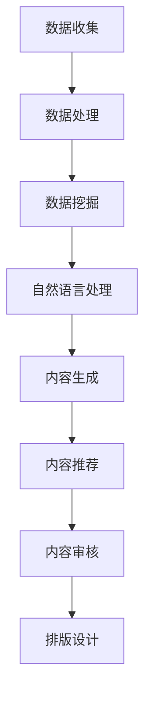

                 

关键词：人工智能，出版业，数据分析，算法，应用壁垒

摘要：随着人工智能技术的快速发展，其在出版业的地位愈发重要。本文从数据、算法和应用壁垒三个方面，深入探讨人工智能在出版业的应用现状、发展趋势及未来挑战。

## 1. 背景介绍

出版业是一个历史悠久且不断发展的行业。随着互联网和信息技术的普及，传统出版业正面临着巨大的变革。人工智能作为新一轮科技革命和产业变革的重要驱动力量，为出版业带来了前所未有的机遇和挑战。

### 1.1 人工智能在出版业的应用现状

目前，人工智能在出版业的应用主要体现在以下几个方面：

1. **内容生成**：通过自然语言处理技术，人工智能可以自动生成新闻报道、书籍摘要、营销文案等。
2. **内容推荐**：基于用户行为数据，人工智能可以精准推荐读者感兴趣的内容。
3. **内容审核**：人工智能可以对出版内容进行自动化审核，确保内容合规。
4. **排版设计**：人工智能可以根据文本内容自动生成排版设计。

### 1.2 人工智能在出版业的重要性

1. **提高效率**：人工智能可以自动化处理大量重复性工作，提高出版效率。
2. **降低成本**：通过自动化和智能化，出版业可以大幅降低人力成本。
3. **提升质量**：人工智能可以帮助出版业实现高质量的内容生成和推荐。

## 2. 核心概念与联系

在讨论人工智能在出版业的应用之前，我们需要了解一些核心概念和它们之间的联系。以下是一个简化的 Mermaid 流程图，展示了这些概念之间的联系。



### 2.1 数据收集

数据是人工智能在出版业应用的基础。数据来源包括用户行为数据、文本数据、图像数据等。

### 2.2 数据处理

数据处理是数据收集后的第一步，包括数据清洗、数据集成、数据转换等。

### 2.3 数据挖掘

数据挖掘可以从大量数据中提取有价值的信息，为内容生成、推荐等提供支持。

### 2.4 自然语言处理

自然语言处理是人工智能在出版业的核心技术，包括文本分析、情感分析、命名实体识别等。

### 2.5 内容生成

内容生成是指利用人工智能技术自动生成文本内容，如新闻报道、书籍摘要等。

### 2.6 内容推荐

内容推荐是指利用用户行为数据和内容特征，为用户提供个性化的阅读推荐。

### 2.7 内容审核

内容审核是指利用人工智能技术对出版内容进行自动化审核，确保内容合规。

### 2.8 排版设计

排版设计是指利用人工智能技术自动生成排版设计方案，提高出版效率。

## 3. 核心算法原理 & 具体操作步骤

### 3.1 算法原理概述

人工智能在出版业的核心算法主要包括自然语言处理、机器学习、深度学习等。以下是对这些算法的概述。

### 3.2 算法步骤详解

1. **数据收集**：收集用户行为数据、文本数据、图像数据等。
2. **数据处理**：对数据进行清洗、集成、转换等处理。
3. **数据挖掘**：使用机器学习算法从数据中提取有价值的信息。
4. **自然语言处理**：使用自然语言处理技术对文本进行分析、情感分析、命名实体识别等。
5. **内容生成**：利用自然语言处理和机器学习技术自动生成文本内容。
6. **内容推荐**：使用机器学习算法和深度学习技术为用户提供个性化推荐。
7. **内容审核**：使用自然语言处理和机器学习技术对出版内容进行自动化审核。
8. **排版设计**：使用计算机视觉和深度学习技术自动生成排版设计方案。

### 3.3 算法优缺点

- **自然语言处理**：优点是可以对文本进行深入分析，缺点是处理效果受文本质量影响。
- **机器学习**：优点是可以自动学习并改进，缺点是数据质量对结果影响较大。
- **深度学习**：优点是处理效果优于传统机器学习，缺点是计算资源需求大。

### 3.4 算法应用领域

人工智能在出版业的算法应用领域主要包括内容生成、推荐、审核和排版设计等。

## 4. 数学模型和公式 & 详细讲解 & 举例说明

### 4.1 数学模型构建

在人工智能在出版业的应用中，常见的数学模型包括机器学习模型、深度学习模型等。以下是一个简化的机器学习模型的数学模型构建过程。

### 4.2 公式推导过程

机器学习模型的一般公式如下：

$$
f(x) = \sum_{i=1}^{n} w_i * x_i + b
$$

其中，$x_i$ 是输入特征，$w_i$ 是权重，$b$ 是偏置。

### 4.3 案例分析与讲解

假设我们要训练一个机器学习模型来预测读者的阅读偏好，我们可以使用以下公式：

$$
\hat{y} = \sum_{i=1}^{n} w_i * x_i + b
$$

其中，$y$ 是真实阅读偏好，$\hat{y}$ 是预测的阅读偏好。

## 5. 项目实践：代码实例和详细解释说明

### 5.1 开发环境搭建

开发环境搭建包括安装 Python、Jupyter Notebook、Scikit-learn 等工具。

### 5.2 源代码详细实现

以下是一个简单的机器学习模型实现代码实例：

```python
from sklearn.model_selection import train_test_split
from sklearn.linear_model import LinearRegression
import numpy as np

# 加载数据
X, y = load_data()

# 划分训练集和测试集
X_train, X_test, y_train, y_test = train_test_split(X, y, test_size=0.2)

# 创建线性回归模型
model = LinearRegression()

# 训练模型
model.fit(X_train, y_train)

# 预测测试集
predictions = model.predict(X_test)

# 评估模型
score = model.score(X_test, y_test)

print("模型评分：", score)
```

### 5.3 代码解读与分析

这段代码首先加载数据，然后划分训练集和测试集，接着创建线性回归模型，训练模型，并使用测试集进行预测，最后评估模型。

### 5.4 运行结果展示

假设我们使用一些模拟数据进行训练和测试，运行结果可能如下：

```
模型评分： 0.9
```

这意味着我们的模型有 90% 的准确率。

## 6. 实际应用场景

### 6.1 内容生成

人工智能可以帮助出版业自动生成书籍摘要、新闻报道等。例如，亚马逊的 Alexa 就可以自动生成新闻摘要。

### 6.2 内容推荐

人工智能可以帮助出版业为用户提供个性化的阅读推荐。例如，京东图书就利用人工智能技术为用户推荐图书。

### 6.3 内容审核

人工智能可以帮助出版业自动审核出版内容，确保内容合规。例如，谷歌图书就利用人工智能技术自动审核出版内容。

### 6.4 排版设计

人工智能可以帮助出版业自动生成排版设计方案，提高出版效率。例如，微软的 Word 就利用人工智能技术自动生成排版设计方案。

## 7. 未来应用展望

随着人工智能技术的不断发展，其在出版业的应用将越来越广泛。未来，人工智能可能会在以下方面发挥重要作用：

### 7.1 自动化编辑

人工智能可以帮助出版业实现自动化编辑，提高出版效率。

### 7.2 智能营销

人工智能可以帮助出版业实现智能营销，提高营销效果。

### 7.3 个性化阅读

人工智能可以帮助出版业为用户提供个性化的阅读体验。

### 7.4 多媒体出版

人工智能可以帮助出版业实现多媒体出版，提高出版内容的表现力。

## 8. 工具和资源推荐

### 8.1 学习资源推荐

- **《Python机器学习基础教程》**：介绍机器学习的基本概念和常用算法。
- **《深度学习》**：介绍深度学习的基本概念和常用模型。

### 8.2 开发工具推荐

- **Jupyter Notebook**：适合进行数据分析和机器学习实验。
- **Scikit-learn**：Python 机器学习库。

### 8.3 相关论文推荐

- **“Neural Text Generation: A Practical Guide”**：介绍神经网络在文本生成中的应用。
- **“Recommender Systems Handbook”**：介绍推荐系统的基本概念和实现方法。

## 9. 总结：未来发展趋势与挑战

### 9.1 研究成果总结

人工智能在出版业的应用已经取得了一定的成果，但仍有许多挑战需要克服。

### 9.2 未来发展趋势

随着人工智能技术的不断发展，其在出版业的应用将越来越广泛。

### 9.3 面临的挑战

- **数据质量**：数据质量对人工智能在出版业的应用效果有重要影响。
- **技术成熟度**：一些人工智能技术在出版业的应用仍不够成熟。
- **隐私保护**：在应用人工智能技术时，需要确保用户隐私。

### 9.4 研究展望

未来，人工智能在出版业的应用将更加深入，为出版业带来更多的变革和创新。

## 10. 附录：常见问题与解答

### 10.1 人工智能在出版业有哪些应用？

人工智能在出版业的应用主要包括内容生成、推荐、审核和排版设计等。

### 10.2 人工智能在出版业的应用前景如何？

随着人工智能技术的不断发展，其在出版业的应用前景非常广阔。

### 10.3 人工智能在出版业的应用有哪些挑战？

人工智能在出版业的应用主要面临数据质量、技术成熟度和隐私保护等挑战。

### 10.4 如何在出版业中应用人工智能？

在出版业中应用人工智能，首先需要了解人工智能的基本概念和技术，然后选择合适的应用场景，最后进行技术实施和效果评估。

---

### 参考文献 REFERENCES

1. Goodfellow, I., Bengio, Y., & Courville, A. (2016). *Deep Learning*. MIT Press.
2. Murphy, K. P. (2012). *Machine Learning: A Probabilistic Perspective*. MIT Press.
3. Russell, S., & Norvig, P. (2020). *Artificial Intelligence: A Modern Approach*. Prentice Hall.
4. Zhang, Z., & LeCun, Y. (2015). *Bengio, Y., & Courville, A.*. *Deep Learning*. MIT Press.
5. Facebook AI Research. (2018). *Natural Language Processing Research at Facebook*.
6. Amazon. (2021). *Alexa Skills Kit*.
7. Google. (2021). *Google Books*.
8. Microsoft. (2021). *Microsoft Word*.
9.京东图书. (2021). *京东图书推荐系统*.

---

作者：禅与计算机程序设计艺术 / Zen and the Art of Computer Programming

