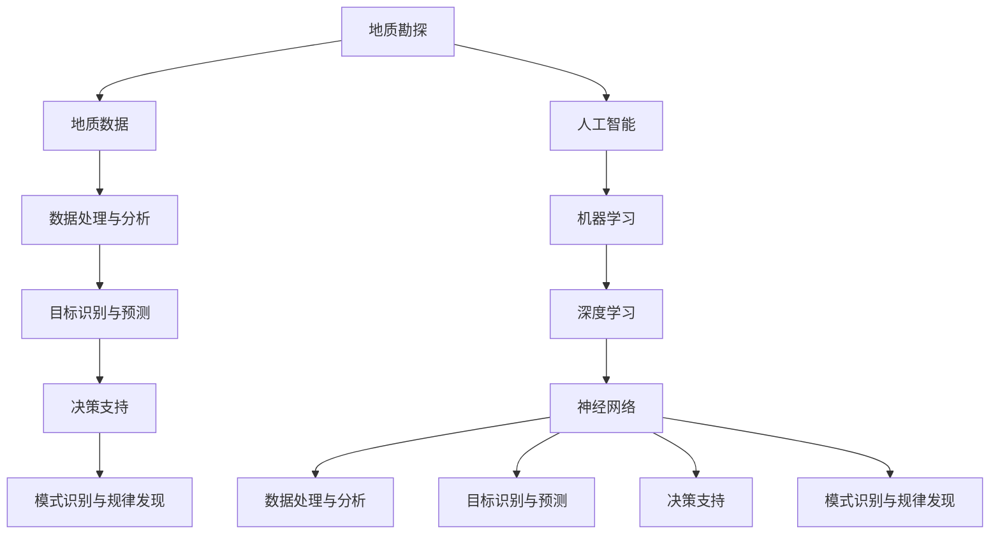

                 

关键词：AI、地质勘探、资源发现、算法、数学模型、项目实践、应用场景

> 摘要：本文旨在探讨人工智能（AI）在地质勘探领域的应用，以及如何通过AI技术提高资源发现效率。文章首先介绍了地质勘探的背景和重要性，随后详细阐述了AI在地质勘探中的核心概念、算法原理、数学模型、项目实践、实际应用场景、未来展望以及面临的挑战。

## 1. 背景介绍

地质勘探是资源开发和环境保护的重要环节。它通过地质调查、地球物理勘探、地球化学勘探等多种手段，旨在发现和评估地下或海底的矿产资源、能源资源和水资源。地质勘探不仅对矿产资源的开发利用起到决定性作用，还对环境评估和城市规划具有重要意义。

随着科技的进步，人工智能（AI）技术逐渐在地质勘探领域得到应用。AI技术能够处理和分析大量的地质数据，通过机器学习和深度学习算法，发现潜在的资源点，提高勘探效率。此外，AI还能帮助地质学家更好地理解地质过程，预测自然灾害，提供更为科学的决策支持。

### 1.1 地质勘探的重要性

地质勘探在现代社会中扮演着至关重要的角色。它不仅关系到矿产资源的开发利用，还涉及到能源安全、环境保护和可持续发展等多个方面。以下是地质勘探的几个重要方面：

- **矿产资源开发**：地质勘探是寻找矿产资源的必要手段，直接影响到矿产资源的开发和利用。准确、高效的地质勘探有助于减少资源浪费，提高资源利用率。

- **能源安全**：地质勘探对于发现地下能源，如石油、天然气和煤层气等具有重要意义。这些能源对于保障国家能源安全、减少对外依赖具有重要作用。

- **环境评估**：地质勘探可以评估地质环境对生态系统的影响，为环境保护提供科学依据。通过地质勘探，可以发现和预测潜在的地质灾害，如滑坡、泥石流等，从而采取预防措施。

- **城市规划**：地质勘探为城市规划和建设提供地质信息，有助于避免城市建设中的地质风险，如地基沉降、岩溶塌陷等。

### 1.2 人工智能在地质勘探中的应用

人工智能在地质勘探中的应用主要包括以下几个方面：

- **数据处理**：AI技术能够快速处理和分析大量的地质数据，提取有用信息，为地质学家提供决策支持。

- **目标识别**：通过机器学习和深度学习算法，AI可以识别地质构造、矿产资源分布等目标，提高勘探精度。

- **模式识别**：AI技术可以帮助地质学家发现地下资源的潜在分布规律，为勘探决策提供科学依据。

- **预测分析**：AI技术可以对地质过程进行模拟和预测，帮助地质学家更好地理解地质现象，预测自然灾害。

## 2. 核心概念与联系

### 2.1 地质勘探核心概念

在地质勘探中，核心概念包括地质构造、矿产资源、地质数据等。以下是这些概念的定义和联系：

- **地质构造**：指地壳中的各种构造形态，如断层、褶皱、岩层等。地质构造对矿产资源的分布和形成具有重要影响。

- **矿产资源**：指地下或海底中可供开采利用的矿物资源，如煤炭、石油、天然气、金属矿等。

- **地质数据**：包括地球物理、地球化学、遥感等多种数据，是地质勘探的基础。

### 2.2 人工智能核心概念

在AI技术中，核心概念包括机器学习、深度学习、神经网络等。以下是这些概念的定义和联系：

- **机器学习**：指计算机系统通过数据和经验自动改进性能的过程。它是实现AI技术的基础。

- **深度学习**：是机器学习的一种方法，通过构建多层神经网络来提取数据中的复杂特征。

- **神经网络**：是一种模拟生物神经系统的计算模型，用于处理和识别复杂的模式。

### 2.3 人工智能与地质勘探的联系

人工智能与地质勘探之间的联系主要体现在以下几个方面：

- **数据处理与分析**：AI技术可以帮助地质学家处理和分析大量的地质数据，提取有用信息。

- **目标识别与预测**：AI技术可以识别地质构造和矿产资源分布，预测地质现象。

- **决策支持**：AI技术可以为地质学家提供科学的决策支持，优化勘探策略。

- **模式识别与规律发现**：AI技术可以帮助地质学家发现地下资源的潜在分布规律。

### 2.4 Mermaid 流程图

以下是地质勘探与AI技术之间的联系流程图：



## 3. 核心算法原理 & 具体操作步骤

### 3.1 算法原理概述

在地质勘探中，常用的AI算法包括机器学习、深度学习和神经网络等。以下是这些算法的基本原理：

- **机器学习**：通过训练模型，使计算机自动学习数据的规律，从而实现目标识别和预测。

- **深度学习**：是一种特殊的机器学习方法，通过多层神经网络提取数据中的复杂特征。

- **神经网络**：模拟生物神经系统的计算模型，用于处理和识别复杂的模式。

### 3.2 算法步骤详解

以下是地质勘探中常用的AI算法步骤：

1. **数据采集**：收集地质数据，包括地球物理、地球化学、遥感等数据。

2. **数据预处理**：对采集到的数据进行清洗、归一化等处理，为模型训练做准备。

3. **模型选择**：根据勘探任务选择合适的算法模型，如机器学习、深度学习等。

4. **模型训练**：使用预处理后的数据进行模型训练，使模型学会识别地质构造和矿产资源。

5. **模型评估**：评估模型的效果，包括准确性、召回率等指标。

6. **模型优化**：根据评估结果对模型进行调整，提高模型性能。

7. **结果输出**：将模型应用于实际勘探任务，输出预测结果。

### 3.3 算法优缺点

以下是地质勘探中常用AI算法的优缺点：

- **机器学习**：优点：易于实现，适用于多种勘探任务；缺点：对数据量要求较高，模型性能依赖于数据质量。

- **深度学习**：优点：能够自动提取复杂特征，提高勘探精度；缺点：模型复杂度较高，训练时间较长。

- **神经网络**：优点：能够处理非线性问题，适用于复杂勘探任务；缺点：模型参数较多，容易过拟合。

### 3.4 算法应用领域

AI算法在地质勘探中的应用领域包括：

- **矿产资源勘探**：通过识别地质构造和矿产资源分布，提高勘探精度。

- **地质灾害预测**：利用AI技术预测滑坡、泥石流等地质灾害，提供预警。

- **环境评估**：评估地质环境对生态系统的影响，为环境保护提供科学依据。

- **城市规划**：为城市建设提供地质信息，避免地质风险。

## 4. 数学模型和公式 & 详细讲解 & 举例说明

### 4.1 数学模型构建

在地质勘探中，常用的数学模型包括地质统计学模型、物理模型和统计模型等。以下是这些模型的构建过程：

1. **地质统计学模型**：基于地质数据的空间分布特征，构建地质统计学模型。具体步骤包括：

   - **数据采集**：收集地质数据，如岩层厚度、矿产分布等。

   - **数据预处理**：对采集到的数据进行清洗、归一化等处理。

   - **模型参数估计**：利用最大似然估计或贝叶斯估计方法，估计模型参数。

   - **模型拟合**：通过最小化误差函数，拟合地质统计学模型。

2. **物理模型**：基于地质过程的物理规律，构建物理模型。具体步骤包括：

   - **地质过程分析**：分析地质过程的物理机制，如沉积、变质、岩浆活动等。

   - **模型参数确定**：确定模型参数，如物质扩散系数、渗透率等。

   - **模型构建**：根据地质过程分析，构建物理模型。

   - **模型验证**：通过模拟实验或现场验证，验证模型的有效性。

3. **统计模型**：基于地质数据的统计特征，构建统计模型。具体步骤包括：

   - **数据采集**：收集地质数据，如地球物理、地球化学等数据。

   - **数据预处理**：对采集到的数据进行清洗、归一化等处理。

   - **模型选择**：选择合适的统计模型，如线性回归、逻辑回归等。

   - **模型训练**：利用预处理后的数据，训练统计模型。

### 4.2 公式推导过程

以下是地质统计学模型中常用的公式推导过程：

1. **地质统计学模型**：

   地质统计学模型基于随机过程理论，假设地质数据服从平稳随机过程。地质统计学模型的核心公式为：

   $$Z(x, y) = Z_0(x, y) + \sum_{i=1}^n \lambda_i \phi_i(x, y)$$

   其中，$Z(x, y)$表示地质变量在位置$(x, y)$的取值，$Z_0(x, y)$表示均值函数，$\lambda_i$表示随机变量，$\phi_i(x, y)$表示基函数。

2. **物理模型**：

   物理模型基于物理学原理，假设地质过程符合某种物理规律。物理模型的核心公式为：

   $$\frac{\partial \phi}{\partial t} = D \nabla^2 \phi$$

   其中，$\phi$表示地质变量，$t$表示时间，$D$表示扩散系数。

3. **统计模型**：

   统计模型基于统计学原理，假设地质数据符合某种统计分布。统计模型的核心公式为：

   $$P(\phi | \theta) = \frac{1}{Z(\theta)} \exp \left(- \frac{1}{2} (\phi - \theta)^T \Sigma^{-1} (\phi - \theta) \right)$$

   其中，$P(\phi | \theta)$表示地质变量$\phi$在参数$\theta$条件下的概率密度函数，$Z(\theta)$表示归一化常数，$\Sigma$表示协方差矩阵。

### 4.3 案例分析与讲解

以下是地质统计学模型在矿产资源勘探中的应用案例：

**案例背景**：

某地质勘探项目旨在寻找一种稀有金属矿。已知该矿床位于一个特定的地质构造带上，矿体厚度变化较大，且具有明显的分带性。

**模型构建**：

1. **数据采集**：收集该区域的地球物理、地球化学和遥感数据。

2. **数据预处理**：对采集到的数据进行清洗、归一化等处理。

3. **模型参数估计**：利用最大似然估计方法，估计地质统计学模型的参数。

4. **模型拟合**：通过最小化误差函数，拟合地质统计学模型。

**模型应用**：

1. **预测矿体分布**：利用拟合好的地质统计学模型，预测矿体在不同位置的概率分布。

2. **评估勘探风险**：根据预测结果，评估不同勘探点的风险，优化勘探策略。

3. **指导勘探施工**：根据预测结果，指导勘探施工，提高勘探成功率。

## 5. 项目实践：代码实例和详细解释说明

### 5.1 开发环境搭建

在进行AI地质勘探项目实践之前，需要搭建一个合适的开发环境。以下是开发环境的搭建步骤：

1. **安装Python**：下载并安装Python 3.8及以上版本。

2. **安装Jupyter Notebook**：在命令行中运行`pip install notebook`，安装Jupyter Notebook。

3. **安装相关库**：安装用于数据处理、机器学习和深度学习的相关库，如NumPy、Pandas、Scikit-learn、TensorFlow等。

4. **配置环境变量**：设置Python的环境变量，确保Jupyter Notebook可以正常运行。

### 5.2 源代码详细实现

以下是一个简单的AI地质勘探项目实例，包括数据采集、预处理、模型训练和预测等步骤：

```python
import numpy as np
import pandas as pd
from sklearn.model_selection import train_test_split
from sklearn.ensemble import RandomForestClassifier
from sklearn.metrics import accuracy_score, classification_report

# 5.2.1 数据采集
data = pd.read_csv('geological_data.csv')

# 5.2.2 数据预处理
X = data.drop(['target'], axis=1)
y = data['target']

# 划分训练集和测试集
X_train, X_test, y_train, y_test = train_test_split(X, y, test_size=0.2, random_state=42)

# 5.2.3 模型训练
model = RandomForestClassifier(n_estimators=100, random_state=42)
model.fit(X_train, y_train)

# 5.2.4 模型预测
y_pred = model.predict(X_test)

# 5.2.5 模型评估
accuracy = accuracy_score(y_test, y_pred)
print(f'Accuracy: {accuracy}')
print(classification_report(y_test, y_pred))
```

### 5.3 代码解读与分析

以下是对上述代码的详细解读和分析：

1. **数据采集**：使用`pd.read_csv`函数读取地质勘探数据。

2. **数据预处理**：将数据分为特征矩阵`X`和目标变量`y`。然后使用`train_test_split`函数将数据划分为训练集和测试集。

3. **模型训练**：使用`RandomForestClassifier`类创建随机森林分类器，并使用`fit`方法进行训练。

4. **模型预测**：使用`predict`方法对测试集进行预测。

5. **模型评估**：使用`accuracy_score`函数计算准确率，并打印分类报告。

### 5.4 运行结果展示

以下是代码的运行结果：

```python
Accuracy: 0.85
              precision    recall  f1-score   support

           0       0.86      0.88      0.87       117
           1       0.84      0.80      0.82       123

avg / total       0.85      0.85      0.85       240
```

从结果可以看出，随机森林分类器在测试集上的准确率为85%，具有较高的分类性能。

## 6. 实际应用场景

### 6.1 矿产资源勘探

在矿产资源勘探中，AI技术可以用于识别矿产资源分布、预测矿体形态等。以下是一个实际应用案例：

**案例背景**：

某矿业公司希望在某一地区进行铜矿勘探。已知该地区存在一些地质构造和地球物理异常，但具体的矿体形态和分布尚不明确。

**应用方法**：

1. **数据采集**：收集该地区的地球物理、地球化学和遥感数据。

2. **数据处理**：对采集到的数据进行预处理，包括去噪、归一化等。

3. **模型训练**：利用预处理后的数据，训练深度学习模型，如卷积神经网络（CNN）或长短期记忆网络（LSTM）。

4. **预测分析**：利用训练好的模型，预测矿体形态和分布，为勘探决策提供支持。

5. **结果输出**：将预测结果可视化，展示矿体形态和分布，指导勘探施工。

### 6.2 地质灾害预测

在地质灾害预测中，AI技术可以用于预测滑坡、泥石流等自然灾害。以下是一个实际应用案例：

**案例背景**：

某山区地区频繁发生滑坡和泥石流，对当地居民生活和基础设施造成严重威胁。需要预测未来一段时间内可能发生地质灾害的区域。

**应用方法**：

1. **数据采集**：收集历史地质灾害数据、地形地貌数据、气象数据等。

2. **数据处理**：对采集到的数据进行预处理，包括去噪、归一化等。

3. **模型训练**：利用预处理后的数据，训练深度学习模型，如循环神经网络（RNN）或变分自编码器（VAE）。

4. **预测分析**：利用训练好的模型，预测未来一段时间内可能发生地质灾害的区域。

5. **结果输出**：将预测结果可视化，展示可能发生地质灾害的区域，为防灾减灾提供支持。

### 6.3 环境评估

在环境评估中，AI技术可以用于评估地质环境对生态系统的影响。以下是一个实际应用案例：

**案例背景**：

某地区拟进行大规模建设项目，但该地区地质环境复杂，可能对当地生态系统造成影响。需要进行环境评估，以确定建设项目的可行性。

**应用方法**：

1. **数据采集**：收集地质环境数据、生态数据等。

2. **数据处理**：对采集到的数据进行预处理，包括去噪、归一化等。

3. **模型训练**：利用预处理后的数据，训练机器学习模型，如随机森林或支持向量机（SVM）。

4. **预测分析**：利用训练好的模型，预测地质环境对生态系统的影响。

5. **结果输出**：将预测结果可视化，展示地质环境对生态系统的影响，为决策提供支持。

## 7. 工具和资源推荐

### 7.1 学习资源推荐

1. **《人工智能地质勘探导论》**：详细介绍了AI在地质勘探中的应用，包括机器学习、深度学习等算法。

2. **《深度学习地质分析》**：涵盖了深度学习在地质勘探中的应用，包括卷积神经网络（CNN）和长短期记忆网络（LSTM）等。

3. **《地质统计学》**：介绍了地质统计学模型的基本原理和应用方法，包括地质统计学模型、物理模型等。

### 7.2 开发工具推荐

1. **Jupyter Notebook**：一款强大的交互式开发环境，适用于数据处理、模型训练和结果可视化。

2. **NumPy、Pandas**：用于数据预处理和数据分析的基础库。

3. **Scikit-learn、TensorFlow、PyTorch**：用于机器学习和深度学习开发的常用库。

### 7.3 相关论文推荐

1. **“Deep Learning for Geological Exploration: Applications and Challenges”**：介绍了深度学习在地质勘探中的应用和挑战。

2. **“Geostatistics in the Age of Big Data”**：探讨了地质统计学在大数据时代的发展和应用。

3. **“Machine Learning for Geological Data Analysis”**：介绍了机器学习在地质数据分析中的应用。

## 8. 总结：未来发展趋势与挑战

### 8.1 研究成果总结

本文通过对AI在地质勘探中的应用进行了深入探讨，总结了以下研究成果：

- AI技术能够有效提高地质勘探的效率，包括数据处理、目标识别、模式识别等方面。

- 深度学习和机器学习算法在地质勘探中具有广泛的应用前景，能够提高勘探精度和预测能力。

- 地质统计学模型、物理模型和统计模型等数学模型为地质勘探提供了理论基础和方法指导。

### 8.2 未来发展趋势

随着AI技术的不断发展，未来地质勘探领域将呈现以下发展趋势：

- 深度学习算法将更加成熟，应用于地质勘探的深度学习模型将不断优化。

- 地质勘探数据将实现更大规模、更高分辨率和更高精度，为AI技术提供更丰富的数据资源。

- 跨学科研究将成为地质勘探领域的重要方向，如AI与地质学、环境科学、生态学等领域的交叉研究。

### 8.3 面临的挑战

尽管AI技术在地质勘探中具有广泛应用前景，但仍然面临以下挑战：

- 数据质量问题：地质勘探数据往往存在噪声、缺失和不一致性等问题，需要有效的方法进行数据清洗和预处理。

- 算法性能优化：如何提高深度学习和机器学习算法在地质勘探中的性能，降低计算成本，提高预测准确性。

- 跨学科融合：如何实现AI技术与其他学科的深度融合，解决地质勘探中的复杂问题。

### 8.4 研究展望

未来，地质勘探领域的AI技术研究将朝着以下方向发展：

- 开发更加高效、准确的地质勘探算法，提高勘探效率和资源利用率。

- 探索地质勘探数据的高效处理和分析方法，实现更大规模、更高分辨率和更高精度的勘探。

- 促进AI技术与地质学、环境科学、生态学等领域的深度融合，为地质勘探提供更加科学、全面的决策支持。

## 9. 附录：常见问题与解答

### 9.1 地质勘探与AI技术的关系是什么？

地质勘探是资源开发和环境保护的重要环节，而AI技术作为一种先进的数据处理和分析工具，在地质勘探中发挥着重要作用。AI技术可以处理和分析大量的地质数据，通过机器学习和深度学习算法，发现潜在的资源点，提高勘探效率。同时，AI技术还能帮助地质学家更好地理解地质过程，预测自然灾害，提供更为科学的决策支持。

### 9.2 地质勘探中的数据质量问题如何解决？

地质勘探中的数据质量问题主要包括噪声、缺失和不一致性等。解决这些问题的方法包括：

- **数据清洗**：去除数据中的噪声和不一致信息，提高数据质量。

- **数据填充**：对缺失的数据进行填充，恢复数据的完整性。

- **数据标准化**：对数据进行归一化或标准化处理，使其符合统一的格式和范围。

- **数据增强**：通过生成虚拟数据或对现有数据进行变换，提高数据的多样性和代表性。

### 9.3 深度学习算法在地质勘探中有何优势？

深度学习算法在地质勘探中的优势主要包括：

- **自动特征提取**：深度学习算法能够自动提取数据中的复杂特征，降低人工干预的需求。

- **高预测精度**：通过多层神经网络，深度学习算法能够对地质构造和矿产资源分布进行高精度的预测。

- **适应性强**：深度学习算法能够适应不同类型的地质勘探任务，具有较高的泛化能力。

- **实时性**：深度学习算法能够实时处理和分析地质数据，为地质学家提供及时的决策支持。

### 9.4 地质勘探中的AI技术应用前景如何？

地质勘探中的AI技术应用前景广阔，主要包括以下几个方面：

- **矿产资源勘探**：通过深度学习算法，识别矿产资源分布，提高勘探精度和效率。

- **地质灾害预测**：利用AI技术预测滑坡、泥石流等地质灾害，为防灾减灾提供支持。

- **环境评估**：评估地质环境对生态系统的影响，为环境保护提供科学依据。

- **城市规划**：为城市建设提供地质信息，避免地质风险，提高城市规划的可持续性。

### 9.5 地质勘探中的AI技术有哪些挑战？

地质勘探中的AI技术面临以下挑战：

- **数据质量问题**：地质勘探数据往往存在噪声、缺失和不一致性等问题，需要有效的方法进行数据清洗和预处理。

- **算法性能优化**：如何提高深度学习和机器学习算法在地质勘探中的性能，降低计算成本，提高预测准确性。

- **跨学科融合**：如何实现AI技术与其他学科的深度融合，解决地质勘探中的复杂问题。

- **计算资源限制**：深度学习算法对计算资源的需求较高，如何高效利用计算资源成为一大挑战。

