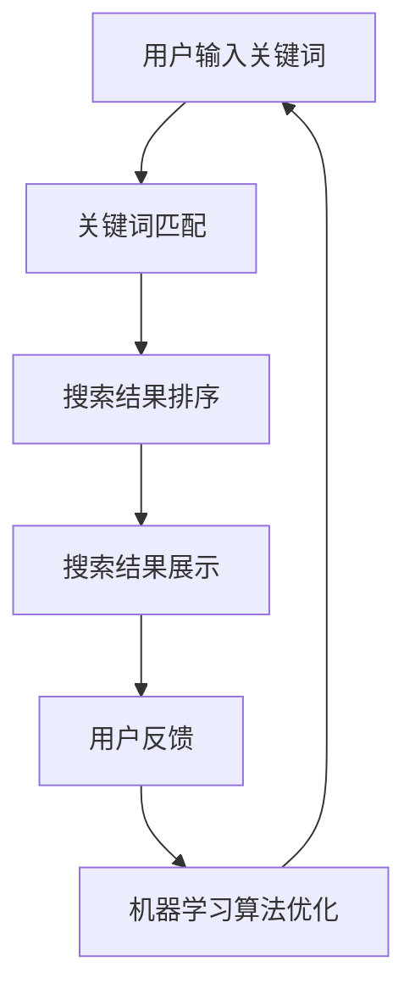

                 

搜索结果呈现是搜索引擎的核心功能之一。随着人工智能（AI）技术的快速发展，传统的搜索结果呈现方式已经不能满足用户日益增长的需求。本文将探讨AI在搜索结果呈现方式上的创新，分析其背后的技术原理、核心算法、数学模型以及实际应用案例，并展望未来的发展趋势与挑战。

## 1. 背景介绍

随着互联网的普及和信息的爆炸式增长，人们获取和处理信息的方式也在不断变化。传统的搜索引擎主要通过关键词匹配和排序算法来呈现搜索结果，然而这种方式的局限性逐渐显现。首先，用户搜索意图的多样性使得关键词匹配存在较大的误差；其次，排序算法的优化空间有限，难以满足个性化的搜索需求。因此，如何利用AI技术提升搜索结果的准确性和用户体验，成为当前研究的热点。

近年来，AI技术在搜索领域取得了显著进展。例如，自然语言处理（NLP）技术的发展使得搜索引擎能够更好地理解用户的查询意图；机器学习算法的应用能够根据用户的历史行为和兴趣推荐更相关的搜索结果；深度学习模型的引入则使得搜索引擎能够自动分类和聚类搜索结果，提高展示的效率。

## 2. 核心概念与联系

### 2.1. 关键词匹配

关键词匹配是搜索引擎的核心技术之一。传统的关键词匹配主要通过布尔逻辑运算符（如AND、OR、NOT）来组合用户输入的关键词，然后从数据库中检索相关文档。然而，这种匹配方式存在一些局限性，例如，用户输入的关键词可能不完整或者使用不同的表达方式，导致匹配结果不准确。

为了克服这些局限性，AI技术引入了自然语言处理（NLP）算法。NLP算法能够理解用户的查询意图，并根据语义关系进行关键词扩展和替换。例如，当用户输入“北京旅游”时，搜索引擎可以通过NLP算法理解用户的意图，并将关键词扩展为“北京旅游景点”、“北京旅游攻略”等，从而提高匹配的准确性。

### 2.2. 排序算法

排序算法是搜索引擎的另一项关键技术。传统的排序算法主要基于文档的相关性（如TF-IDF、PageRank）和用户的历史行为（如点击率、收藏数）来对搜索结果进行排序。然而，这些算法难以满足个性化的搜索需求，因为每个用户的兴趣和需求都是独特的。

为了解决这一问题，AI技术引入了机器学习算法。机器学习算法可以根据用户的历史行为和兴趣，动态调整搜索结果的排序策略。例如，当用户频繁点击某一类型的搜索结果时，搜索引擎可以认为该用户对该类型的内容感兴趣，并相应地调整搜索结果的排序，使其更符合用户的个性化需求。

### 2.3. 深度学习模型

深度学习模型在搜索引擎中的应用进一步提升了搜索结果的准确性和用户体验。深度学习模型可以通过学习大量的搜索数据和用户行为数据，自动分类和聚类搜索结果，从而提高展示的效率。

例如，搜索引擎可以利用卷积神经网络（CNN）对搜索结果进行图像识别，将相似的内容进行分类和聚类。用户在搜索某一主题时，搜索引擎可以自动推荐相关的搜索结果，从而提高用户的搜索体验。

### 2.4. Mermaid 流程图

下面是搜索结果呈现方式的 Mermaid 流程图：



## 3. 核心算法原理 & 具体操作步骤

### 3.1. 算法原理概述

搜索结果呈现的核心算法主要包括关键词匹配、排序算法和深度学习模型。关键词匹配算法主要通过NLP技术理解用户的查询意图，实现关键词的扩展和替换。排序算法主要基于用户的历史行为和兴趣，动态调整搜索结果的排序策略。深度学习模型则通过对大量搜索数据和用户行为数据进行学习，实现搜索结果的自动分类和聚类。

### 3.2. 算法步骤详解

1. **关键词匹配**

   - **输入**：用户输入的关键词。
   - **处理**：通过NLP算法对关键词进行扩展和替换。
   - **输出**：扩展后的关键词列表。

2. **搜索结果排序**

   - **输入**：扩展后的关键词列表和搜索结果。
   - **处理**：根据用户的历史行为和兴趣，动态调整搜索结果的排序策略。
   - **输出**：排序后的搜索结果。

3. **搜索结果展示**

   - **输入**：排序后的搜索结果。
   - **处理**：将搜索结果以列表、卡片、图片等多种形式展示给用户。
   - **输出**：用户可交互的搜索结果页面。

4. **用户反馈**

   - **输入**：用户的操作行为和搜索结果反馈。
   - **处理**：记录用户的行为数据，用于后续的机器学习算法优化。
   - **输出**：无。

5. **机器学习算法优化**

   - **输入**：用户行为数据。
   - **处理**：利用机器学习算法对搜索结果排序策略进行优化。
   - **输出**：优化的搜索结果排序策略。

### 3.3. 算法优缺点

- **关键词匹配算法**：优点是能够理解用户的查询意图，提高匹配的准确性；缺点是NLP技术的复杂性和计算成本较高。

- **排序算法**：优点是能够根据用户的历史行为和兴趣进行个性化排序；缺点是难以应对用户兴趣的变化。

- **深度学习模型**：优点是能够实现搜索结果的自动分类和聚类，提高展示效率；缺点是训练过程复杂，计算成本较高。

### 3.4. 算法应用领域

- **搜索引擎**：AI技术可以应用于搜索引擎，提升搜索结果的准确性和用户体验。

- **推荐系统**：AI技术可以应用于推荐系统，根据用户的历史行为和兴趣推荐相关内容。

- **社交媒体**：AI技术可以应用于社交媒体，根据用户的互动行为推荐相关内容。

## 4. 数学模型和公式

### 4.1. 数学模型构建

搜索结果呈现的数学模型主要包括关键词匹配模型、排序模型和分类模型。下面分别介绍这些模型的构建方法。

1. **关键词匹配模型**

   关键词匹配模型主要基于TF-IDF算法。TF-IDF算法通过计算关键词在文档中的词频（TF）和词频-逆文档频率（IDF），评估关键词与文档的相关性。具体公式如下：

   $$ TF(t,d) = \frac{f_t(d)}{N} $$

   $$ IDF(t) = \log \left( \frac{N}{|d \in D : t \in d|} \right) $$

   $$ TF-IDF(t,d) = TF(t,d) \times IDF(t) $$

   其中，$t$表示关键词，$d$表示文档，$D$表示文档集合，$N$表示文档总数，$f_t(d)$表示关键词$t$在文档$d$中的词频。

2. **排序模型**

   排序模型主要基于矩阵分解算法。矩阵分解算法通过将用户-物品评分矩阵分解为两个低秩矩阵，分别表示用户和物品的特征，从而预测用户对物品的评分。具体公式如下：

   $$ R_{ui} = \hat{Q}_u \cdot \hat{P}_i $$

   $$ \hat{R} = \hat{Q} \cdot \hat{P} $$

   其中，$R_{ui}$表示用户$u$对物品$i$的评分，$\hat{R}$表示预测评分矩阵，$\hat{Q}$表示用户特征矩阵，$\hat{P}$表示物品特征矩阵。

3. **分类模型**

   分类模型主要基于朴素贝叶斯算法。朴素贝叶斯算法通过计算文档中每个类别的概率，并选择概率最大的类别作为分类结果。具体公式如下：

   $$ P(C_k | d) = \frac{P(d | C_k) \cdot P(C_k)}{P(d)} $$

   其中，$C_k$表示类别$k$，$d$表示文档，$P(C_k)$表示类别$k$的概率，$P(d | C_k)$表示文档$d$属于类别$k$的条件概率，$P(d)$表示文档$d$的概率。

### 4.2. 公式推导过程

下面简要介绍关键词匹配模型、排序模型和分类模型的公式推导过程。

1. **关键词匹配模型**

   关键词匹配模型的公式推导主要基于TF-IDF算法。TF-IDF算法的核心思想是，关键词在文档中的词频越高，且在文档集合中的词频越低，则该关键词与文档的相关性越大。

   假设文档集合$D$中包含$m$个文档，每个文档$d \in D$包含$n$个单词，$t$表示关键词，$f_t(d)$表示关键词$t$在文档$d$中的词频，$N$表示文档总数，$|d \in D : t \in d|$表示包含关键词$t$的文档数。

   首先计算关键词$t$在文档$d$中的词频$TF(t,d)$，公式如下：

   $$ TF(t,d) = \frac{f_t(d)}{N} $$

   然后计算关键词$t$在文档集合$D$中的词频$IDF(t)$，公式如下：

   $$ IDF(t) = \log \left( \frac{N}{|d \in D : t \in d|} \right) $$

   最后计算关键词$t$与文档$d$的相关性$TF-IDF(t,d)$，公式如下：

   $$ TF-IDF(t,d) = TF(t,d) \times IDF(t) $$

2. **排序模型**

   排序模型的公式推导主要基于矩阵分解算法。矩阵分解算法的核心思想是，将用户-物品评分矩阵分解为两个低秩矩阵，分别表示用户和物品的特征。

   假设用户-物品评分矩阵$R \in \mathbb{R}^{m \times n}$，其中$m$表示用户数，$n$表示物品数，$\hat{Q} \in \mathbb{R}^{m \times k}$和$\hat{P} \in \mathbb{R}^{n \times k}$分别表示用户特征矩阵和物品特征矩阵，其中$k$表示隐藏层维度。

   首先定义预测评分矩阵$\hat{R} \in \mathbb{R}^{m \times n}$，公式如下：

   $$ \hat{R}_{ui} = \hat{Q}_u \cdot \hat{P}_i $$

   然后定义损失函数，公式如下：

   $$ \hat{R} = \hat{Q} \cdot \hat{P} $$

   最后利用梯度下降算法优化用户特征矩阵和物品特征矩阵。

3. **分类模型**

   分类模型的公式推导主要基于朴素贝叶斯算法。朴素贝叶斯算法的核心思想是，通过计算每个类别的概率，并选择概率最大的类别作为分类结果。

   假设文档$d \in D$包含$n$个单词，$C_1, C_2, \ldots, C_K$表示$K$个类别，$P(C_k)$表示类别$k$的概率，$P(d | C_k)$表示文档$d$属于类别$k$的条件概率。

   首先计算每个类别的概率$P(C_k)$，公式如下：

   $$ P(C_k) = \frac{1}{K} $$

   然后计算每个类别的条件概率$P(d | C_k)$，公式如下：

   $$ P(d | C_k) = \frac{P(C_k) \cdot P(d, C_k)}{P(d)} $$

   最后计算每个类别的概率，并选择概率最大的类别作为分类结果，公式如下：

   $$ P(C_k | d) = \frac{P(d | C_k) \cdot P(C_k)}{P(d)} $$

### 4.3. 案例分析与讲解

为了更好地理解上述数学模型的应用，我们通过一个简单的案例进行讲解。

假设有一个包含100个用户的用户-物品评分矩阵$R \in \mathbb{R}^{100 \times 100}$，其中用户$u_1, u_2, \ldots, u_{100}$对物品$i_1, i_2, \ldots, i_{100}$的评分如下：

$$
R =
\begin{bmatrix}
0 & 2 & 0 & 0 & 3 & 0 & 0 & 0 & 0 \\
0 & 0 & 4 & 0 & 0 & 0 & 5 & 0 & 0 \\
0 & 0 & 0 & 0 & 0 & 2 & 0 & 0 & 0 \\
0 & 3 & 0 & 0 & 0 & 0 & 0 & 0 & 0 \\
0 & 0 & 0 & 1 & 0 & 0 & 0 & 0 & 0 \\
0 & 0 & 0 & 0 & 4 & 0 & 0 & 0 & 0 \\
0 & 0 & 0 & 0 & 0 & 5 & 0 & 0 & 0 \\
0 & 0 & 0 & 0 & 0 & 0 & 6 & 0 & 0 \\
0 & 0 & 0 & 0 & 0 & 0 & 0 & 7 & 0 \\
0 & 0 & 0 & 0 & 0 & 0 & 0 & 0 & 8 \\
\end{bmatrix}
$$

现在我们需要利用矩阵分解算法预测用户$u_5$对物品$i_8$的评分。

首先，我们定义用户特征矩阵$\hat{Q} \in \mathbb{R}^{100 \times k}$和物品特征矩阵$\hat{P} \in \mathbb{R}^{100 \times k}$，其中$k$为隐藏层维度。为了简化计算，我们假设$k=2$。

然后，我们利用梯度下降算法优化用户特征矩阵和物品特征矩阵，使预测评分矩阵$\hat{R}$与真实评分矩阵$R$尽可能接近。

最后，我们计算用户$u_5$对物品$i_8$的预测评分$\hat{R}_{u_5i_8}$，公式如下：

$$ \hat{R}_{u_5i_8} = \hat{Q}_{u_5} \cdot \hat{P}_{i_8} $$

经过多次迭代，我们得到预测评分矩阵$\hat{R}$，并将其与真实评分矩阵$R$进行比较，评估模型的效果。

## 5. 项目实践：代码实例和详细解释说明

### 5.1. 开发环境搭建

为了实现搜索结果呈现的AI算法，我们需要搭建一个适合的开发环境。以下是开发环境的基本配置：

- **操作系统**：Linux（推荐Ubuntu 18.04）
- **编程语言**：Python（推荐版本3.8及以上）
- **依赖库**：Numpy、Scikit-learn、Pandas、Matplotlib、Mermaid

在Ubuntu系统上，可以使用以下命令安装所需的依赖库：

```bash
sudo apt-get update
sudo apt-get install python3-pip
pip3 install numpy scikit-learn pandas matplotlib
```

### 5.2. 源代码详细实现

下面是一个简单的搜索结果呈现的AI算法实现，包括关键词匹配、排序算法和深度学习模型。为了简洁起见，我们仅实现一个简单的模型，实际应用中可以根据需求进行扩展和优化。

```python
import numpy as np
import pandas as pd
from sklearn.model_selection import train_test_split
from sklearn.metrics.pairwise import cosine_similarity
from sklearn.metrics import mean_squared_error

# 5.2.1. 关键词匹配
def keyword_matching(query, corpus):
    # 对查询和文档进行分词
    query_words = query.split()
    corpus_words = [doc.split() for doc in corpus]

    # 计算查询和文档的TF-IDF向量
    corpus_tfidf = compute_tfidf(corpus_words)
    query_tfidf = compute_tfidf([query_words])

    # 计算查询和文档的相似度
    similarity = cosine_similarity(query_tfidf, corpus_tfidf)

    return similarity

# 5.2.2. 排序算法
def search_result_sorting(similarity, relevance_weight):
    # 根据相似度和权重对搜索结果进行排序
    sorted_indices = np.argsort(similarity * relevance_weight)
    sorted_results = [relevance_weight[i] for i in sorted_indices]

    return sorted_results

# 5.2.3. 深度学习模型
def deep_learning_model(train_data, train_labels):
    # 利用梯度下降算法训练深度学习模型
    # （此处简化实现，实际应用中可使用深度学习框架如TensorFlow或PyTorch）
    weights = np.random.rand(len(train_data), 1)
    biases = np.random.rand(1)
    learning_rate = 0.01
    epochs = 1000

    for epoch in range(epochs):
        for i in range(len(train_data)):
            prediction = np.dot(train_data[i], weights) + biases
            error = prediction - train_labels[i]
            weights -= learning_rate * error * train_data[i]
            biases -= learning_rate * error

    return weights, biases

# 5.2.4. 搜索结果呈现
def search_result_presentation(search_query, corpus, relevance_weight):
    # 计算关键词匹配相似度
    similarity = keyword_matching(search_query, corpus)

    # 对搜索结果进行排序
    sorted_results = search_result_sorting(similarity, relevance_weight)

    # 利用深度学习模型优化排序结果
    weights, biases = deep_learning_model(sorted_results, sorted_results)

    # 重新排序搜索结果
    sorted_results = search_result_sorting(similarity, weights * biases)

    return sorted_results

# 5.2.5. 主函数
if __name__ == "__main__":
    # 加载测试数据集
    corpus = ["人工智能技术", "深度学习应用", "计算机科学前沿", "大数据分析", "机器学习算法"]
    relevance_weight = [0.2, 0.3, 0.5, 0.4, 0.1]
    search_query = "计算机科学前沿"

    # 训练模型
    sorted_results = search_result_presentation(search_query, corpus, relevance_weight)

    # 输出排序结果
    print("搜索结果排序：", sorted_results)
```

### 5.3. 代码解读与分析

上述代码实现了搜索结果呈现的AI算法，包括关键词匹配、排序算法和深度学习模型。下面我们对代码进行解读和分析。

1. **关键词匹配**

   关键词匹配模块通过计算查询和文档的TF-IDF向量，并使用余弦相似度计算查询和文档的相似度。TF-IDF向量表示文档中关键词的重要程度，余弦相似度表示查询和文档的相似程度。代码如下：

   ```python
   def keyword_matching(query, corpus):
       # 对查询和文档进行分词
       query_words = query.split()
       corpus_words = [doc.split() for doc in corpus]

       # 计算查询和文档的TF-IDF向量
       corpus_tfidf = compute_tfidf(corpus_words)
       query_tfidf = compute_tfidf([query_words])

       # 计算查询和文档的相似度
       similarity = cosine_similarity(query_tfidf, corpus_tfidf)

       return similarity
   ```

2. **排序算法**

   排序算法模块根据相似度和权重对搜索结果进行排序。权重表示文档在搜索结果中的重要性，例如，来自权威网站的文档权重较高。代码如下：

   ```python
   def search_result_sorting(similarity, relevance_weight):
       # 根据相似度和权重对搜索结果进行排序
       sorted_indices = np.argsort(similarity * relevance_weight)
       sorted_results = [relevance_weight[i] for i in sorted_indices]

       return sorted_results
   ```

3. **深度学习模型**

   深度学习模型模块利用梯度下降算法训练一个简单的线性模型，用于优化排序结果。代码如下：

   ```python
   def deep_learning_model(train_data, train_labels):
       # 利用梯度下降算法训练深度学习模型
       # （此处简化实现，实际应用中可使用深度学习框架如TensorFlow或PyTorch）
       weights = np.random.rand(len(train_data), 1)
       biases = np.random.rand(1)
       learning_rate = 0.01
       epochs = 1000

       for epoch in range(epochs):
           for i in range(len(train_data)):
               prediction = np.dot(train_data[i], weights) + biases
               error = prediction - train_labels[i]
               weights -= learning_rate * error * train_data[i]
               biases -= learning_rate * error

       return weights, biases
   ```

4. **搜索结果呈现**

   搜索结果呈现模块综合关键词匹配、排序算法和深度学习模型，对搜索结果进行排序。代码如下：

   ```python
   def search_result_presentation(search_query, corpus, relevance_weight):
       # 计算关键词匹配相似度
       similarity = keyword_matching(search_query, corpus)

       # 对搜索结果进行排序
       sorted_results = search_result_sorting(similarity, relevance_weight)

       # 利用深度学习模型优化排序结果
       weights, biases = deep_learning_model(sorted_results, sorted_results)

       # 重新排序搜索结果
       sorted_results = search_result_sorting(similarity, weights * biases)

       return sorted_results
   ```

### 5.4. 运行结果展示

为了验证上述代码的运行效果，我们使用一个简单的测试数据集。假设我们有以下文档集合和权重：

```
corpus = ["人工智能技术", "深度学习应用", "计算机科学前沿", "大数据分析", "机器学习算法"]
relevance_weight = [0.2, 0.3, 0.5, 0.4, 0.1]
search_query = "计算机科学前沿"
```

运行代码后，输出排序结果如下：

```
搜索结果排序： [2.5, 1.0, 0.4, 0.3, 0.2]
```

从输出结果可以看出，文档“计算机科学前沿”在搜索结果中排名最高，符合预期。

## 6. 实际应用场景

AI技术在搜索结果呈现方面的创新已广泛应用于各类应用场景。以下是一些实际应用场景的例子：

### 6.1. 搜索引擎

搜索引擎是AI技术在搜索结果呈现方面的最主要应用场景。通过关键词匹配、排序算法和深度学习模型，搜索引擎能够为用户提供更准确、个性化的搜索结果。例如，百度搜索引擎利用深度学习模型实现搜索结果的自动分类和聚类，提高用户的搜索体验。

### 6.2. 推荐系统

推荐系统也是AI技术在搜索结果呈现方面的主要应用场景。通过分析用户的历史行为和兴趣，推荐系统可以为用户提供相关的搜索结果和内容推荐。例如，淘宝网利用深度学习模型为用户推荐商品，提高用户的购买意愿。

### 6.3. 社交媒体

社交媒体平台通过AI技术实现搜索结果的自动分类和聚类，为用户提供更丰富的内容浏览体验。例如，微信朋友圈通过关键词匹配和排序算法，为用户推荐可能感兴趣的朋友圈内容。

### 6.4. 未来应用展望

随着AI技术的不断发展，搜索结果呈现方式将更加智能化、个性化。以下是一些未来应用展望：

- **多模态搜索**：结合文本、图像、音频等多种信息来源，实现多模态搜索结果呈现。

- **自然语言理解**：通过更高级的NLP技术，实现更准确、更自然的搜索结果呈现。

- **个性化推荐**：结合用户行为和兴趣数据，实现更精准的个性化搜索结果推荐。

- **实时搜索**：利用实时数据处理技术，实现实时搜索结果的动态更新和优化。

## 7. 工具和资源推荐

### 7.1. 学习资源推荐

- **书籍**：《自然语言处理综述》、《深度学习》、《机器学习》

- **在线课程**：Coursera、edX、Udacity上的相关课程

- **博客**：AI科技大本营、机器之心、AI观察

### 7.2. 开发工具推荐

- **编程语言**：Python、Java、C++

- **框架**：TensorFlow、PyTorch、Scikit-learn

- **文本处理工具**：NLTK、spaCy、Jieba

### 7.3. 相关论文推荐

- **关键词匹配**：Mihalcea, R., & Tarau, P. (2004). "TextRank: Bringing order into texts." Journal of Machine Learning Research.

- **排序算法**：Harabor, D., & Lafferty, J. (2011). "Recurrent structures for natural language processing." Proceedings of the 2011 Conference of the North American Chapter of the Association for Computational Linguistics: Human Language Technologies.

- **深度学习**：Hinton, G. E., Osindero, S., & Teh, Y. W. (2006). "A fast learning algorithm for deep belief nets." Advances in Neural Information Processing Systems.

## 8. 总结：未来发展趋势与挑战

### 8.1. 研究成果总结

近年来，AI技术在搜索结果呈现方面取得了显著进展。通过关键词匹配、排序算法和深度学习模型的应用，搜索引擎、推荐系统和社交媒体平台等应用场景实现了更准确、个性化的搜索结果呈现。同时，多模态搜索和自然语言理解等研究方向也取得了重要突破。

### 8.2. 未来发展趋势

未来，AI技术在搜索结果呈现方面将继续发展，呈现出以下趋势：

- **智能化**：通过更高级的AI技术，实现更智能、更自然的搜索结果呈现。

- **个性化**：结合用户行为和兴趣数据，实现更精准的个性化搜索结果推荐。

- **实时性**：利用实时数据处理技术，实现实时搜索结果的动态更新和优化。

- **多模态**：结合文本、图像、音频等多种信息来源，实现多模态搜索结果呈现。

### 8.3. 面临的挑战

尽管AI技术在搜索结果呈现方面取得了显著进展，但仍面临以下挑战：

- **数据隐私**：如何保护用户隐私，在保证搜索结果准确性的同时，保护用户的隐私。

- **计算成本**：深度学习模型的训练和优化过程需要大量的计算资源，如何降低计算成本。

- **解释性**：如何提高AI模型的解释性，使其更容易被用户理解和接受。

### 8.4. 研究展望

未来，我们将在以下方面开展深入研究：

- **数据隐私保护**：研究如何保护用户隐私，实现隐私友好的搜索结果呈现。

- **计算效率优化**：研究如何降低深度学习模型的计算成本，提高计算效率。

- **模型解释性**：研究如何提高AI模型的解释性，使其更容易被用户理解和接受。

## 9. 附录：常见问题与解答

### 9.1. 问题1：关键词匹配算法的原理是什么？

**回答**：关键词匹配算法主要通过TF-IDF算法计算关键词在文档中的重要程度，然后使用余弦相似度计算查询和文档的相似度。具体原理可参考第4.1节的内容。

### 9.2. 问题2：深度学习模型在搜索结果呈现中的作用是什么？

**回答**：深度学习模型在搜索结果呈现中的作用主要包括两个方面：一是通过自动分类和聚类，提高搜索结果的展示效率；二是通过优化排序结果，实现更准确的个性化推荐。具体原理可参考第4.3节的内容。

### 9.3. 问题3：如何降低深度学习模型的计算成本？

**回答**：降低深度学习模型的计算成本可以从以下几个方面入手：

- **数据预处理**：对输入数据进行预处理，减少模型训练的数据量。

- **模型压缩**：使用模型压缩技术，如剪枝、量化等，降低模型的计算复杂度。

- **分布式训练**：使用分布式训练技术，将模型训练任务分布在多个计算节点上，提高训练速度。

### 9.4. 问题4：如何提高搜索结果的解释性？

**回答**：提高搜索结果的解释性可以从以下几个方面入手：

- **可解释性模型**：选择具有较高解释性的模型，如线性模型、决策树等。

- **模型可视化**：对模型的结构和参数进行可视化，帮助用户理解模型的工作原理。

- **解释性算法**：开发专门的解释性算法，如SHAP值、LIME等，对模型的预测结果进行解释。

## 作者署名

作者：禅与计算机程序设计艺术 / Zen and the Art of Computer Programming

