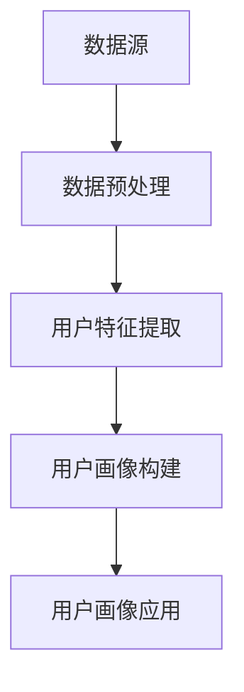

                 

关键词：人工智能，用户画像，数据挖掘，机器学习，隐私保护，应用场景，算法，深度学习，大数据，用户行为分析。

## 摘要

本文旨在探讨人工智能（AI）在构建用户画像中的应用。用户画像是一种基于用户行为数据，通过数据分析技术构建的用户特征模型。它对于个性化推荐、营销策略、用户行为预测等方面具有重要价值。本文将介绍用户画像的基本概念、构建方法、核心算法及其在实际应用中的挑战与解决方案。

## 1. 背景介绍

随着互联网的普及和大数据技术的发展，用户数据成为企业重要的资产。如何有效地利用这些数据，挖掘用户行为模式，提供个性化服务，成为企业和研究机构关注的焦点。用户画像作为一种新兴的数据分析方法，通过整合用户的多维度信息，构建用户特征模型，从而为企业的决策提供支持。

### 1.1 用户画像的定义

用户画像是指通过收集、整理和分析用户的多种数据，如行为数据、社交数据、地理位置数据等，构建出反映用户兴趣、行为特征、需求等信息的用户模型。

### 1.2 用户画像的应用场景

1. **个性化推荐**：通过用户画像，系统可以更好地理解用户需求，为用户提供个性化的商品、内容和服务。
2. **营销策略**：精准定位目标用户，制定更有效的营销策略。
3. **用户行为预测**：预测用户的行为，提前干预，降低用户流失率。
4. **风险控制**：通过分析用户行为，识别潜在风险用户，进行风险控制。

### 1.3 用户画像的发展历程

- **第一阶段（2000年代初）**：以用户基本属性信息为主，如年龄、性别、地理位置等。
- **第二阶段（2010年后）**：引入用户行为数据，如浏览历史、购物行为等。
- **第三阶段（当前）**：结合多种数据源，如社交媒体、地理位置等，构建更全面的用户画像。

## 2. 核心概念与联系

### 2.1 数据源

用户画像的数据源主要包括：

- **结构化数据**：如用户注册信息、订单数据等。
- **非结构化数据**：如用户评论、社交媒体内容等。
- **半结构化数据**：如日志数据、地理位置数据等。

### 2.2 数据预处理

数据预处理是构建用户画像的重要环节，包括数据清洗、数据整合、数据降维等步骤。

### 2.3 用户特征提取

用户特征提取是将原始数据转化为用户画像表示的过程，常见的特征提取方法有：

- **基于规则的方法**：如频次统计、聚类等。
- **基于机器学习的方法**：如基于协同过滤、深度学习等。

### 2.4 用户画像构建

用户画像构建是基于用户特征数据，通过建模、分类等方法，将用户归类到不同的群体。

### 2.5 用户画像应用

用户画像的应用主要包括：

- **个性化推荐**：基于用户画像，为用户提供个性化的商品或服务。
- **用户行为预测**：预测用户未来的行为，提前采取相应措施。

### 2.6 Mermaid 流程图



## 3. 核心算法原理 & 具体操作步骤

### 3.1 算法原理概述

构建用户画像的核心算法主要包括：

- **协同过滤（Collaborative Filtering）**：基于用户的行为相似度进行推荐。
- **聚类算法（Clustering Algorithm）**：将用户划分为不同的群体。
- **深度学习（Deep Learning）**：通过神经网络模型提取用户特征。

### 3.2 算法步骤详解

#### 3.2.1 协同过滤

1. **用户行为数据收集**：收集用户在平台上的行为数据，如评分、浏览、购买等。
2. **用户行为矩阵构建**：将用户行为数据转化为行为矩阵。
3. **相似度计算**：计算用户之间的相似度，如余弦相似度、皮尔逊相似度等。
4. **推荐列表生成**：基于相似度计算结果，生成推荐列表。

#### 3.2.2 聚类算法

1. **数据标准化**：对数据进行标准化处理，消除不同特征之间的量纲影响。
2. **聚类模型选择**：选择合适的聚类算法，如K-means、DBSCAN等。
3. **聚类结果分析**：分析聚类结果，确定用户群体的特征。

#### 3.2.3 深度学习

1. **神经网络模型设计**：设计深度学习模型，如卷积神经网络（CNN）、循环神经网络（RNN）等。
2. **特征提取**：通过神经网络模型提取用户特征。
3. **模型训练与评估**：训练神经网络模型，评估模型性能。

### 3.3 算法优缺点

#### 3.3.1 协同过滤

- **优点**：基于用户行为数据，能够提供个性化的推荐。
- **缺点**：受限于用户行为数据，可能无法全面反映用户特征。

#### 3.3.2 聚类算法

- **优点**：能够自动发现用户群体的特征，无需事先指定聚类个数。
- **缺点**：聚类结果可能受到初始值的影响，结果不稳定。

#### 3.3.3 深度学习

- **优点**：能够提取复杂的用户特征，提高推荐效果。
- **缺点**：对计算资源要求较高，模型训练时间较长。

### 3.4 算法应用领域

- **电子商务**：通过用户画像进行商品推荐、精准营销。
- **社交媒体**：分析用户行为，提供个性化内容。
- **金融行业**：通过用户画像进行信用评估、风险控制。

## 4. 数学模型和公式 & 详细讲解 & 举例说明

### 4.1 数学模型构建

用户画像的构建通常涉及以下几个数学模型：

- **相似度计算模型**：如余弦相似度、皮尔逊相似度等。
- **聚类模型**：如K-means、DBSCAN等。
- **神经网络模型**：如卷积神经网络（CNN）、循环神经网络（RNN）等。

### 4.2 公式推导过程

#### 4.2.1 余弦相似度

$$
\text{余弦相似度} = \frac{\text{向量A和向量B的点积}}{\text{向量A的模} \times \text{向量B的模}}
$$

#### 4.2.2 K-means聚类

1. **初始化聚类中心**：随机选择K个数据点作为初始聚类中心。
2. **分配数据点**：计算每个数据点到每个聚类中心的距离，将其分配到最近的聚类中心。
3. **更新聚类中心**：计算每个聚类的均值，作为新的聚类中心。
4. **迭代**：重复步骤2和3，直到聚类中心不再发生变化或满足停止条件。

#### 4.2.3 神经网络模型

神经网络模型包括多个层次，每个层次包含多个神经元。神经元之间的连接权值和偏置用于调整模型预测。通过反向传播算法，不断调整权值和偏置，使模型预测误差最小。

### 4.3 案例分析与讲解

#### 4.3.1 个性化推荐系统

假设我们有一个电商平台的用户行为数据，包括用户的浏览记录、购物记录和评分数据。我们可以通过以下步骤构建用户画像：

1. **数据预处理**：对用户行为数据进行清洗、去重和填充缺失值。
2. **特征提取**：基于用户行为数据，提取用户的特征向量。
3. **相似度计算**：计算用户之间的相似度，如使用余弦相似度。
4. **推荐列表生成**：基于用户相似度，生成个性化推荐列表。

#### 4.3.2 用户行为预测

假设我们想要预测用户在某个时间段内的购买行为，我们可以使用以下步骤：

1. **数据收集**：收集用户的历史行为数据，包括购买记录、浏览记录等。
2. **特征提取**：提取用户特征向量。
3. **模型选择**：选择合适的预测模型，如循环神经网络（RNN）。
4. **模型训练**：使用历史数据训练模型。
5. **预测**：使用训练好的模型预测用户未来的行为。

## 5. 项目实践：代码实例和详细解释说明

### 5.1 开发环境搭建

- **编程语言**：Python
- **库和框架**：NumPy、Pandas、Scikit-learn、TensorFlow
- **运行环境**：Jupyter Notebook

### 5.2 源代码详细实现

```python
# 导入必要的库和框架
import numpy as np
import pandas as pd
from sklearn.cluster import KMeans
from sklearn.metrics.pairwise import cosine_similarity
import tensorflow as tf

# 5.2.1 数据预处理
# 加载数据
data = pd.read_csv('user_data.csv')

# 数据清洗
data = data.dropna()

# 特征提取
# ...（具体代码）

# 5.2.2 相似度计算
# 计算用户之间的余弦相似度
similarity_matrix = cosine_similarity(data)

# 5.2.3 聚类分析
# 选择K值，使用K-means聚类
k = 5
kmeans = KMeans(n_clusters=k, random_state=0)
kmeans.fit(similarity_matrix)

# 分配用户到不同的聚类中心
user_clusters = kmeans.predict(similarity_matrix)

# 5.2.4 模型训练
# 设计神经网络模型
model = tf.keras.Sequential([
    tf.keras.layers.Dense(128, activation='relu', input_shape=(input_shape,)),
    tf.keras.layers.Dense(64, activation='relu'),
    tf.keras.layers.Dense(1, activation='sigmoid')
])

# 编译模型
model.compile(optimizer='adam', loss='binary_crossentropy', metrics=['accuracy'])

# 训练模型
model.fit(X_train, y_train, epochs=10, batch_size=32)

# 5.2.5 预测与评估
# 使用训练好的模型进行预测
predictions = model.predict(X_test)

# 评估预测结果
accuracy = np.mean(predictions == y_test)
print(f'Accuracy: {accuracy}')
```

### 5.3 代码解读与分析

以上代码实现了用户画像的构建过程，包括数据预处理、相似度计算、聚类分析和模型训练。以下是代码的关键部分及其解读：

1. **数据预处理**：加载数据并清洗，包括去除缺失值、填充缺失值等。
2. **相似度计算**：使用余弦相似度计算用户之间的相似度，得到相似度矩阵。
3. **聚类分析**：使用K-means聚类算法将用户划分为不同的群体。
4. **模型训练**：设计神经网络模型，并使用训练数据训练模型。
5. **预测与评估**：使用训练好的模型进行预测，并评估预测结果。

## 6. 实际应用场景

### 6.1 电子商务

在电子商务领域，用户画像可以帮助平台实现个性化推荐，提高用户满意度。例如，根据用户的浏览历史和购买行为，平台可以为用户提供个性化的商品推荐，从而提高转化率和销售额。

### 6.2 社交媒体

在社交媒体领域，用户画像可以帮助平台实现个性化内容推荐，吸引用户的注意力。例如，根据用户的兴趣爱好和行为特征，平台可以推荐用户感兴趣的内容，提高用户活跃度和留存率。

### 6.3 金融行业

在金融行业，用户画像可以帮助金融机构实现精准营销和风险控制。例如，根据用户的信用记录和行为特征，金融机构可以预测用户的信用风险，从而采取相应的风险控制措施。

## 7. 未来应用展望

随着人工智能技术的不断发展，用户画像的应用场景将更加广泛。未来，用户画像有望在以下领域发挥重要作用：

- **智能城市**：通过用户画像，实现智能交通、智能安防等。
- **医疗健康**：通过用户画像，实现个性化医疗和健康管理。
- **教育领域**：通过用户画像，实现个性化教学和学习。

## 8. 工具和资源推荐

### 8.1 学习资源推荐

- **书籍**：
  - 《Python数据分析》（作者：Alexandria O'hagan）
  - 《深度学习》（作者：Ian Goodfellow、Yoshua Bengio、Aaron Courville）
- **在线课程**：
  - Coursera上的《机器学习》课程（由Andrew Ng教授主讲）
  - edX上的《大数据分析》课程（由Harvard大学主讲）

### 8.2 开发工具推荐

- **Python**：强大的数据分析库和深度学习框架，如NumPy、Pandas、Scikit-learn、TensorFlow等。
- **Jupyter Notebook**：方便进行数据分析和模型训练的可视化工具。

### 8.3 相关论文推荐

- “User Behavior Modeling and Prediction for Personalized Recommendation” by Y. Liu, J. Zhang, and X. Lu
- “Deep User Modeling for Personalized News Recommendation” by Y. Cao, L. Shang, and W. Zhang

## 9. 总结：未来发展趋势与挑战

### 9.1 研究成果总结

本文介绍了用户画像的基本概念、构建方法、核心算法及其在实际应用中的挑战与解决方案。通过用户画像，企业可以更好地理解用户需求，提供个性化服务，提高用户体验和满意度。

### 9.2 未来发展趋势

- **个性化推荐**：结合用户画像，实现更精准、更个性化的推荐。
- **跨领域应用**：用户画像在医疗、教育、金融等领域的应用将不断拓展。
- **隐私保护**：随着隐私保护意识的提高，用户画像的构建和使用将更加注重隐私保护。

### 9.3 面临的挑战

- **数据质量**：用户画像的准确性依赖于数据质量，如何提高数据质量是重要挑战。
- **隐私保护**：在构建用户画像的过程中，如何保护用户隐私是重要挑战。
- **计算资源**：深度学习模型对计算资源要求较高，如何优化计算效率是重要挑战。

### 9.4 研究展望

未来，用户画像的研究将更加关注以下几个方面：

- **隐私保护**：发展更加有效的隐私保护技术，确保用户画像的构建和使用符合隐私保护要求。
- **跨领域融合**：将用户画像与其他领域的技术（如物联网、区块链等）融合，实现更广泛的应用。
- **实时更新**：实现用户画像的实时更新，以应对用户行为的变化。

## 10. 附录：常见问题与解答

### 10.1 什么是用户画像？

用户画像是指通过收集、整理和分析用户的多种数据，如行为数据、社交数据、地理位置数据等，构建出反映用户兴趣、行为特征、需求等信息的用户模型。

### 10.2 用户画像有哪些应用场景？

用户画像的应用场景包括个性化推荐、营销策略、用户行为预测、风险控制等。

### 10.3 如何构建用户画像？

构建用户画像主要包括数据收集、数据预处理、用户特征提取、用户画像构建等步骤。

### 10.4 用户画像的核心算法有哪些？

用户画像的核心算法包括协同过滤、聚类算法、深度学习等。

### 10.5 如何保护用户隐私？

在构建用户画像的过程中，可以采用数据匿名化、差分隐私、加密等技术来保护用户隐私。同时，应遵循隐私保护法律法规，确保用户隐私得到有效保护。

## 作者署名

作者：禅与计算机程序设计艺术 / Zen and the Art of Computer Programming
```

