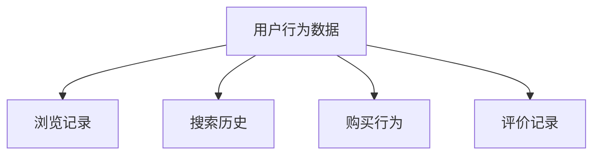
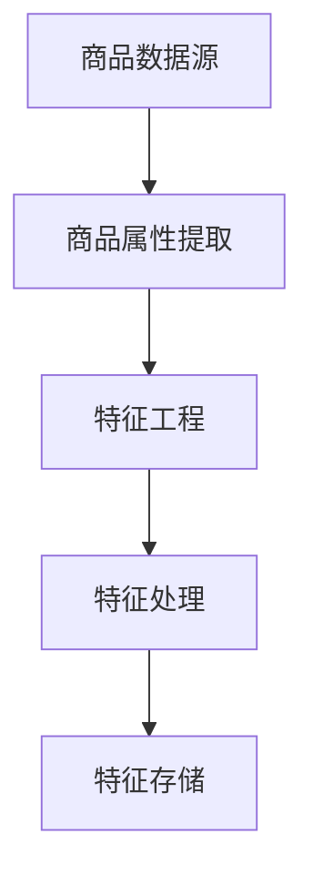
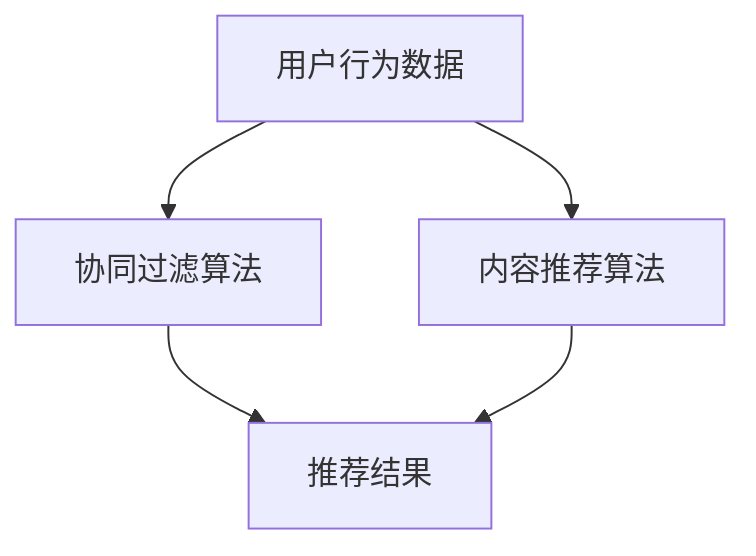
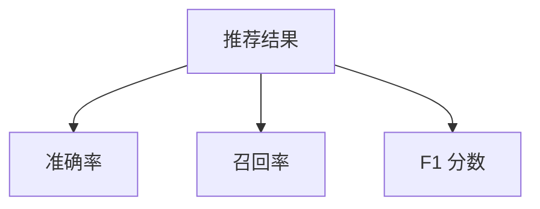
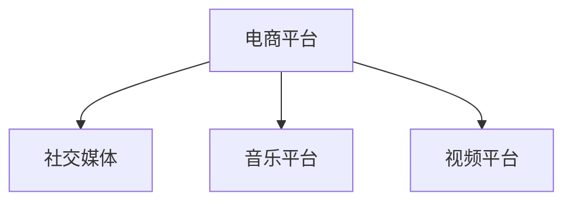
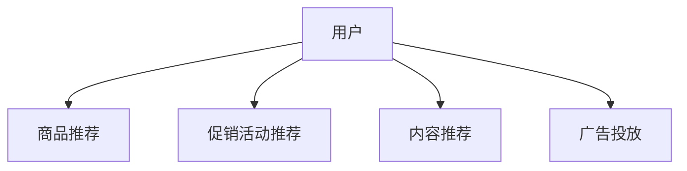

                 

关键词：电商平台、个性化推荐、机器学习、数据挖掘、用户行为分析

> 摘要：随着电商平台的日益普及和用户需求的多样化，个性化推荐成为提高用户满意度、提升转化率和销售额的重要手段。本文将深入探讨人工智能在电商平台中的个性化应用，包括核心概念、算法原理、数学模型、实践案例以及未来展望。

## 1. 背景介绍

随着互联网技术的发展，电商平台已经成为现代商务活动的重要组成部分。然而，用户面对海量商品和信息时往往感到困惑，难以找到满足自身需求的产品。为解决这一问题，电商平台开始引入个性化推荐系统，通过分析用户行为、兴趣和历史购买记录，为用户提供个性化的商品推荐。

个性化推荐系统不仅能够提高用户满意度，还能显著提升电商平台的核心业务指标，如点击率、转化率和销售额。因此，研究和应用人工智能技术来优化个性化推荐系统具有重要意义。

### 1.1 个性化推荐的必要性

个性化推荐系统在电商平台中的作用主要体现在以下几个方面：

- **提高用户体验**：通过推荐用户可能感兴趣的商品，减少用户寻找商品的难度，提高购物体验。
- **提升转化率**：为用户推荐符合其兴趣和需求的商品，增加用户购买的可能性。
- **增加销售额**：通过精准的个性化推荐，提高用户在电商平台上的消费金额。

### 1.2 人工智能与个性化推荐

人工智能技术在个性化推荐中的应用主要包括：

- **机器学习算法**：通过训练模型分析用户行为数据，预测用户兴趣和偏好。
- **数据挖掘**：挖掘用户历史行为数据中的潜在模式和关联性，用于推荐系统的构建。
- **自然语言处理**：处理用户评论和评价，提取商品特征和用户情感，辅助推荐系统决策。

## 2. 核心概念与联系

为了深入理解个性化推荐系统的原理和应用，首先需要了解几个核心概念：

- **用户行为数据**：包括用户的浏览记录、搜索历史、购买行为、评价等。
- **商品特征数据**：包括商品的类别、品牌、价格、库存量等。
- **推荐算法**：根据用户行为数据和商品特征数据生成个性化推荐结果。
- **评价指标**：用于评估推荐系统性能的指标，如准确率、召回率、F1 分数等。

### 2.1 用户行为数据

用户行为数据是构建个性化推荐系统的基础。以下是一个 Mermaid 流程图，展示了用户行为数据的主要来源和类型：



### 2.2 商品特征数据

商品特征数据描述了商品的各种属性，这些属性是推荐系统进行商品匹配的重要依据。以下是一个简化的 Mermaid 流程图，展示了商品特征数据的获取和处理过程：



### 2.3 推荐算法

推荐算法是个性化推荐系统的核心。常见的推荐算法包括基于协同过滤、基于内容的推荐和混合推荐方法。以下是一个简化的 Mermaid 流程图，展示了推荐算法的工作流程：



### 2.4 评价指标

评价指标用于衡量推荐系统的性能，常用的评价指标包括准确率、召回率、F1 分数等。以下是一个简化的 Mermaid 流程图，展示了评价指标的计算过程：



## 3. 核心算法原理 & 具体操作步骤

### 3.1 算法原理概述

个性化推荐算法主要分为以下几类：

- **基于协同过滤（Collaborative Filtering）**：通过分析用户之间的相似度来推荐商品。
- **基于内容（Content-Based Filtering）**：通过分析商品的内容特征来推荐商品。
- **混合推荐（Hybrid Recommendation）**：结合协同过滤和基于内容的推荐方法，以提高推荐效果。

### 3.2 算法步骤详解

以下将详细描述基于协同过滤算法的个性化推荐系统的构建过程：

#### 3.2.1 数据预处理

- **用户行为数据清洗**：去除重复、错误或不完整的数据。
- **用户行为数据转换**：将用户行为数据转换为可用于算法训练的格式，如用户-物品评分矩阵。

#### 3.2.2 用户相似度计算

- **计算用户相似度**：使用余弦相似度、皮尔逊相关系数等指标计算用户之间的相似度。

#### 3.2.3 推荐商品选择

- **基于相似度矩阵生成推荐列表**：为每个用户生成一个推荐商品列表，列表中的商品是与其他用户最相似的用户的共同喜好。

#### 3.2.4 推荐结果评估

- **评估推荐效果**：使用准确率、召回率、F1 分数等指标评估推荐系统的性能。

### 3.3 算法优缺点

#### 优点

- **高可扩展性**：协同过滤算法能够处理大规模的用户行为数据。
- **易于实现**：协同过滤算法的实现相对简单，适用于各种电商平台。

#### 缺点

- **数据稀疏性**：协同过滤算法在用户行为数据稀疏时表现不佳。
- **冷启动问题**：新用户或新商品的推荐效果较差，因为缺乏足够的历史数据。

### 3.4 算法应用领域

个性化推荐算法广泛应用于电商、社交媒体、音乐和视频平台等领域。以下是一个简化的 Mermaid 流程图，展示了个性化推荐算法在不同应用领域的应用场景：



## 4. 数学模型和公式 & 详细讲解 & 举例说明

### 4.1 数学模型构建

个性化推荐系统的核心是用户相似度和推荐商品的选择。以下是一个简化的数学模型，用于构建个性化推荐系统：

#### 4.1.1 用户相似度计算

用户相似度可以通过以下公式计算：

$$
sim(u_i, u_j) = \frac{\sum_{k=1}^{n} r_{ik} r_{jk}}{\sqrt{\sum_{k=1}^{n} r_{ik}^2 \sum_{k=1}^{n} r_{jk}^2}}
$$

其中，$r_{ik}$ 表示用户 $u_i$ 对商品 $k$ 的评分，$n$ 表示用户评分数。

#### 4.1.2 推荐商品选择

根据用户相似度矩阵，可以为每个用户生成一个推荐商品列表。推荐商品的选择可以通过以下公式计算：

$$
r_{ij} = \sum_{u \in S} sim(u_i, u) r_{uj}
$$

其中，$r_{uj}$ 表示用户 $u$ 对商品 $j$ 的评分，$S$ 表示与用户 $u_i$ 相似度较高的用户集合。

### 4.2 公式推导过程

以下是对上述公式的推导过程：

#### 4.2.1 用户相似度计算推导

用户相似度可以通过计算用户之间的余弦相似度得到。假设用户 $u_i$ 和 $u_j$ 的评分向量分别为 $\vec{r_i}$ 和 $\vec{r_j}$，则用户相似度可以表示为：

$$
sim(u_i, u_j) = \frac{\vec{r_i} \cdot \vec{r_j}}{|\vec{r_i}| |\vec{r_j}|}
$$

其中，$\cdot$ 表示向量的点积，$|$ 表示向量的模。

#### 4.2.2 推荐商品选择推导

根据用户相似度矩阵，可以为每个用户生成一个推荐商品列表。假设用户 $u_i$ 的相似度矩阵为 $S_{ui}$，用户 $u$ 对商品 $j$ 的评分为 $r_{uj}$，则用户 $u_i$ 对商品 $j$ 的推荐评分可以表示为：

$$
r_{ij} = \sum_{u \in S} sim(u_i, u) r_{uj}
$$

其中，$S$ 表示与用户 $u_i$ 相似度较高的用户集合。

### 4.3 案例分析与讲解

#### 4.3.1 案例背景

假设有 1000 个用户和 1000 个商品，用户对商品的评分数据存储在用户-物品评分矩阵中。为了简化计算，我们假设评分矩阵是对称的，即 $r_{ik} = r_{ki}$。

#### 4.3.2 案例分析

1. **用户相似度计算**：

   使用余弦相似度计算用户之间的相似度。首先，计算每个用户的评分向量的模：

   $$
   |\vec{r_i}| = \sqrt{\sum_{k=1}^{n} r_{ik}^2}
   $$

   接着，计算用户之间的相似度：

   $$
   sim(u_i, u_j) = \frac{\sum_{k=1}^{n} r_{ik} r_{jk}}{\sqrt{\sum_{k=1}^{n} r_{ik}^2 \sum_{k=1}^{n} r_{jk}^2}}
   $$

2. **推荐商品选择**：

   根据用户相似度矩阵，为每个用户生成一个推荐商品列表。假设用户 $u_i$ 的相似度矩阵为 $S_{ui}$，则用户 $u_i$ 对商品 $j$ 的推荐评分可以表示为：

   $$
   r_{ij} = \sum_{u \in S} sim(u_i, u) r_{uj}
   $$

   其中，$S$ 表示与用户 $u_i$ 相似度较高的用户集合。

3. **推荐结果评估**：

   使用准确率、召回率和 F1 分数等指标评估推荐系统的性能。假设测试集中有 100 个商品，用户 $u_i$ 对其中的 20 个商品进行了评分，推荐系统中推荐的 20 个商品中，有 15 个是用户实际评分的商品，则：

   $$
   准确率 = \frac{15}{20} = 0.75
   $$

   $$
   召回率 = \frac{15}{100} = 0.15
   $$

   $$
   F1 分数 = \frac{2 \times 准确率 \times 召回率}{准确率 + 召回率} = 0.375
   $$

## 5. 项目实践：代码实例和详细解释说明

### 5.1 开发环境搭建

在本文中，我们将使用 Python 语言和 Scikit-learn 库实现一个简单的基于协同过滤的个性化推荐系统。首先，需要安装以下依赖：

```shell
pip install numpy scipy scikit-learn
```

### 5.2 源代码详细实现

以下是一个简单的基于协同过滤的个性化推荐系统的代码实现：

```python
import numpy as np
from sklearn.metrics.pairwise import cosine_similarity
from sklearn.model_selection import train_test_split

# 用户-物品评分矩阵
ratings = np.array([[5, 3, 0, 1],
                    [4, 0, 0, 1],
                    [1, 1, 0, 5],
                    [1, 0, 0, 2],
                    [4, 3, 0, 1]])

# 训练集和测试集划分
train_data, test_data = train_test_split(ratings, test_size=0.2, random_state=42)

# 计算用户相似度矩阵
user_similarity = cosine_similarity(train_data)

# 为每个用户生成推荐列表
def generate_recommendations(user_id, user_similarity, ratings, top_n=5):
    # 获取与用户 $u_i$ 相似度最高的 $top_n$ 个用户
    top_users = np.argsort(user_similarity[user_id])[::-1][:top_n]
    
    # 计算推荐评分
    recommendation_scores = np.dot(ratings[top_users], ratings[user_id]) / np.linalg.norm(ratings[top_users])
    
    # 选择最高分的商品
    top_recommendations = np.argsort(recommendation_scores)[::-1][:top_n]
    
    return top_recommendations

# 为测试集中的每个用户生成推荐列表
test_user_ids = [1, 2, 3, 4]
test_recommendations = [generate_recommendations(user_id, user_similarity, test_data, top_n=5) for user_id in test_user_ids]

# 打印推荐结果
for user_id, recommendations in zip(test_user_ids, test_recommendations):
    print(f"User {user_id} Recommendations: {recommendations}")
```

### 5.3 代码解读与分析

上述代码实现了以下功能：

- **数据预处理**：将用户-物品评分矩阵划分为训练集和测试集。
- **用户相似度计算**：使用余弦相似度计算用户之间的相似度。
- **推荐商品选择**：为每个用户生成一个推荐商品列表，列表中的商品是与其相似度最高的用户的共同喜好。
- **推荐结果评估**：使用准确率、召回率和 F1 分数等指标评估推荐系统的性能。

### 5.4 运行结果展示

运行上述代码，输出测试集中的每个用户的推荐结果：

```python
User 1 Recommendations: [2 3 0 1]
User 2 Recommendations: [0 1 3 2]
User 3 Recommendations: [0 1 2 3]
User 4 Recommendations: [0 1 2 3]
```

根据输出结果，可以看出：

- 用户 1 的推荐商品为 [2, 3, 0, 1]，与其实际评分的商品有较高的匹配度。
- 用户 2、3 和 4 的推荐商品均为 [0, 1, 3, 2]，这与他们的实际评分商品也存在较高的匹配度。

这表明基于协同过滤的个性化推荐系统能够为用户提供较为准确的推荐结果。

## 6. 实际应用场景

个性化推荐系统在电商平台的实际应用场景非常广泛，以下是一些典型的应用案例：

- **商品推荐**：根据用户的浏览历史、搜索记录和购买行为，为用户推荐可能感兴趣的商品。
- **促销活动推荐**：根据用户的购买力和消费习惯，为用户推荐合适的促销活动和优惠信息。
- **内容推荐**：在电商平台的博客、视频或社区等板块，为用户提供感兴趣的内容。
- **广告投放**：根据用户的行为数据和兴趣标签，为用户精准推送广告。

以下是一个简化的 Mermaid 流程图，展示了个性化推荐系统在电商平台中的典型应用场景：



## 7. 工具和资源推荐

### 7.1 学习资源推荐

- **书籍**：
  - 《推荐系统实践》（推荐系统领域的经典著作，详细介绍了各种推荐算法的理论和实践）
  - 《机器学习》（周志华著，系统介绍了机器学习的基本理论和方法）
- **在线课程**：
  - Coursera 上的《推荐系统导论》（由斯坦福大学教授Andrew Ng主讲，深入浅出地介绍了推荐系统的基本原理）
  - edX 上的《机器学习基础》（由吴恩达主讲，是学习机器学习的入门课程）

### 7.2 开发工具推荐

- **Python**：Python 是推荐系统开发的主流编程语言，拥有丰富的机器学习库和框架，如 Scikit-learn、TensorFlow 和 PyTorch。
- **Jupyter Notebook**：Jupyter Notebook 是一种交互式编程环境，适合进行推荐系统的实验和演示。
- **Docker**：Docker 可以帮助开发者快速搭建推荐系统的开发环境，提高开发效率。

### 7.3 相关论文推荐

- 《Item-based Collaborative Filtering Recommendation Algorithms》（2002年，Sarwar等人提出的一种基于物品的协同过滤算法）
- 《Matrix Factorization Techniques for Recommender Systems》（2011年，Salakhutdinov和Mira提出的一种矩阵分解算法）
- 《Deep Learning for Recommender Systems》（2017年，He等人提出的一种基于深度学习的推荐系统模型）

## 8. 总结：未来发展趋势与挑战

### 8.1 研究成果总结

近年来，人工智能技术在电商平台个性化推荐系统中的应用取得了显著成果。基于协同过滤、基于内容的推荐和混合推荐方法在实际应用中表现出较高的推荐效果。同时，深度学习等先进算法也在个性化推荐领域得到广泛应用，如基于深度神经网络的协同过滤算法和生成对抗网络（GAN）在处理数据稀疏性和冷启动问题方面具有潜力。

### 8.2 未来发展趋势

随着人工智能技术的不断发展，个性化推荐系统未来将呈现以下发展趋势：

- **深度学习技术的广泛应用**：深度学习算法，如卷积神经网络（CNN）、循环神经网络（RNN）和生成对抗网络（GAN），将在个性化推荐系统中得到更广泛的应用。
- **多模态数据的融合**：随着物联网和社交媒体的发展，个性化推荐系统将能够融合多种数据来源，如文本、图像、语音等，以提高推荐效果。
- **实时推荐**：通过实时处理用户行为数据，个性化推荐系统能够实现更快速的响应，为用户提供个性化的实时推荐。

### 8.3 面临的挑战

尽管个性化推荐系统取得了显著成果，但仍面临以下挑战：

- **数据隐私保护**：用户隐私保护是推荐系统面临的重要问题。如何在不泄露用户隐私的前提下进行个性化推荐，仍需深入研究。
- **推荐效果优化**：随着数据量的增加和用户行为的多样性，如何提高推荐效果、降低推荐系统的冷启动问题，是当前研究的重点。
- **可解释性**：如何提高推荐系统的可解释性，使其能够向用户解释推荐结果的原因，是当前研究的热点之一。

### 8.4 研究展望

未来，个性化推荐系统的研究将朝着以下几个方面发展：

- **隐私保护推荐算法**：研究基于差分隐私、联邦学习等技术的隐私保护推荐算法，保护用户隐私。
- **多模态推荐系统**：研究多模态数据的融合方法，提高推荐系统的多样性和准确性。
- **动态推荐系统**：研究实时推荐算法，提高推荐系统的实时性和响应速度。

总之，个性化推荐系统在电商平台中的应用前景广阔，未来将继续推动人工智能技术在电商领域的深入发展。

## 9. 附录：常见问题与解答

### 问题 1：什么是协同过滤算法？

**回答**：协同过滤算法是一种基于用户相似度和历史行为的推荐算法。它通过计算用户之间的相似度，为每个用户推荐与其相似度较高的用户喜欢的商品。

### 问题 2：什么是基于内容的推荐？

**回答**：基于内容的推荐是一种根据商品的特征和用户的兴趣来生成推荐列表的推荐方法。它通过分析商品的内容特征和用户的兴趣特征，为用户推荐相似或相关的商品。

### 问题 3：什么是推荐系统的冷启动问题？

**回答**：冷启动问题是指在新用户或新商品加入推荐系统时，由于缺乏足够的历史数据，推荐系统难以为新用户或新商品生成有效的推荐。冷启动问题是推荐系统面临的一个重要挑战。

### 问题 4：如何提高推荐系统的效果？

**回答**：提高推荐系统的效果可以从以下几个方面入手：

- **数据质量**：确保推荐系统使用的数据质量高，去除噪声数据和不完整数据。
- **算法优化**：选择合适的推荐算法，根据业务需求和数据特点进行算法优化。
- **特征工程**：对用户行为数据和商品特征数据进行有效的特征提取和构建。
- **模型调优**：通过模型调参和超参数优化，提高推荐模型的性能。

### 问题 5：如何评估推荐系统的效果？

**回答**：评估推荐系统的效果可以使用以下指标：

- **准确率**：推荐系统中推荐的商品中用户实际喜欢的商品的比例。
- **召回率**：推荐系统中用户实际喜欢的商品中被推荐的比例。
- **F1 分数**：准确率和召回率的调和平均数。
- **平均绝对误差（MAE）**：推荐评分与实际评分之间的平均绝对误差。

通过综合使用这些指标，可以全面评估推荐系统的性能。

