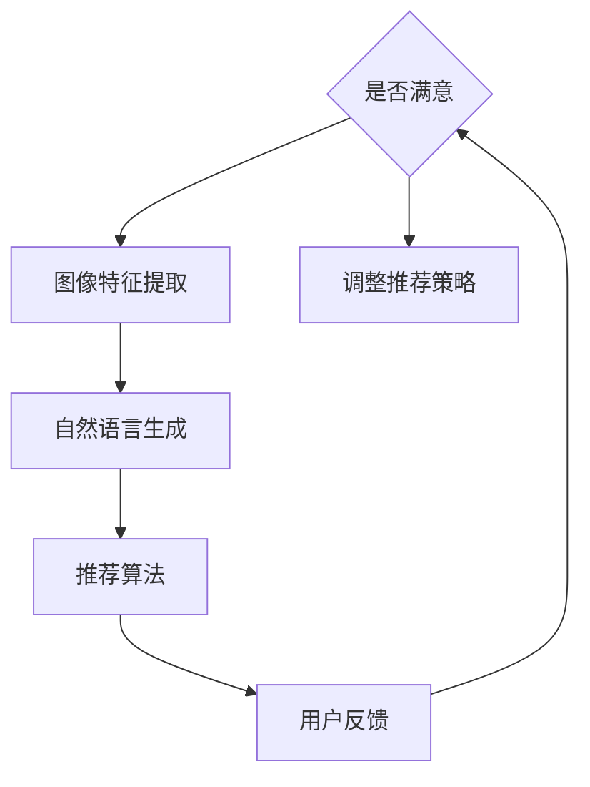

                 

关键词：AI、电商平台、商品图像风格迁移、推荐系统、深度学习、自然语言处理

> 摘要：本文将探讨如何利用人工智能技术，尤其是深度学习和自然语言处理，来实现电商平台商品图像的风格迁移推荐。通过构建一个综合性的推荐系统，本文旨在提高用户购买体验，提升电商平台商品销售额。

## 1. 背景介绍

随着互联网技术的飞速发展，电商平台已经成为了人们日常购物的主要渠道。在竞争激烈的电商市场中，如何提高用户体验、增加用户粘性以及提高商品销售额，成为了各大电商平台亟待解决的问题。传统的推荐系统主要基于用户的购物历史和浏览行为，但这种基于历史数据的推荐方式存在明显的局限性。例如，用户可能因为推荐系统过于僵化，而错过了一些个性化的商品。

近年来，人工智能技术的快速发展为解决这一问题提供了新的思路。深度学习作为一种强大的机器学习技术，可以在没有大量标注数据的情况下，通过自主学习实现复杂的模式识别和分类任务。自然语言处理（NLP）则能够处理和生成自然语言文本，从而更好地理解用户的购买意图。结合这两种技术，我们可以构建一个更加智能的推荐系统，实现商品图像的风格迁移推荐。

## 2. 核心概念与联系

### 2.1. 深度学习与自然语言处理

深度学习是一种基于多层神经网络的机器学习技术，通过层层提取特征，能够自动学习到数据的复杂结构。自然语言处理则专注于文本数据的处理和生成，包括文本分类、情感分析、机器翻译等任务。

在电商平台商品图像风格迁移推荐中，深度学习可以用来提取商品图像的特征，而自然语言处理则可以用来理解和生成与商品风格相关的描述性文本。这两种技术的结合，可以形成一个多模态的推荐系统，提高推荐的准确性和个性化程度。

### 2.2. Mermaid 流程图



在这个流程图中，用户输入商品图像，系统首先提取图像特征，然后生成与图像风格相关的自然语言描述，接着利用这些描述进行推荐。用户对推荐的反馈会进一步优化推荐策略，形成一个闭环系统。

## 3. 核心算法原理 & 具体操作步骤

### 3.1. 算法原理概述

商品图像风格迁移推荐的核心算法主要包括以下三个部分：

1. **图像特征提取**：利用深度学习技术，如卷积神经网络（CNN），从商品图像中提取特征。
2. **自然语言生成**：通过自然语言处理技术，将提取到的图像特征转化为描述性文本。
3. **推荐算法**：结合图像特征和自然语言描述，利用协同过滤、基于内容的推荐等算法进行推荐。

### 3.2. 算法步骤详解

1. **图像特征提取**：

   - 使用预训练的CNN模型，如ResNet或VGG，对商品图像进行特征提取。
   - 将提取到的特征向量输入到文本生成模型，如GPT或BERT。

2. **自然语言生成**：

   - 将图像特征向量作为输入，通过文本生成模型生成描述性文本。
   - 对生成的文本进行后处理，如去除重复内容、调整语句顺序等。

3. **推荐算法**：

   - 结合图像特征和自然语言描述，构建用户-商品相似度矩阵。
   - 利用协同过滤、基于内容的推荐等算法，生成推荐列表。

### 3.3. 算法优缺点

**优点**：

- 提高推荐系统的个性化程度，更好地满足用户需求。
- 利用深度学习和自然语言处理技术，提高推荐的准确性和多样性。

**缺点**：

- 需要大量的训练数据和计算资源。
- 特征提取和自然语言生成的过程可能引入噪声，影响推荐效果。

### 3.4. 算法应用领域

- 电商平台商品推荐：通过风格迁移，提供更加个性化的商品推荐。
- 媒体内容推荐：根据用户偏好，推荐具有特定风格的内容。
- 建筑设计：根据用户需求，生成具有特定风格的建筑设计方案。

## 4. 数学模型和公式 & 详细讲解 & 举例说明

### 4.1. 数学模型构建

商品图像风格迁移推荐系统可以看作是一个多模态的推荐系统，其数学模型可以表示为：

\[ R_{ij} = f(\phi_{i}, \phi_{j}, s_j) \]

其中，\( R_{ij} \) 表示用户 \( i \) 对商品 \( j \) 的推荐分数，\( \phi_{i} \) 和 \( \phi_{j} \) 分别表示用户 \( i \) 和商品 \( j \) 的特征向量，\( s_j \) 表示商品 \( j \) 的风格描述。

### 4.2. 公式推导过程

1. **图像特征提取**：

   \[ \phi_{i} = \text{CNN}(I_i) \]

   其中，\( I_i \) 表示用户 \( i \) 的商品图像。

2. **自然语言生成**：

   \[ s_j = \text{GPT}(\phi_{i}) \]

   其中，\( \text{GPT} \) 表示生成预训练的文本生成模型。

3. **推荐算法**：

   \[ R_{ij} = \text{cosine\_similarity}(\phi_{i}, \phi_{j}, s_j) \]

   其中，\( \text{cosine\_similarity} \) 表示余弦相似度函数。

### 4.3. 案例分析与讲解

假设用户 \( u_1 \) 的商品图像为 \( I_1 \)，商品 \( u_2 \) 的图像为 \( I_2 \)。首先，使用CNN提取图像特征：

\[ \phi_{1} = \text{CNN}(I_1) \]
\[ \phi_{2} = \text{CNN}(I_2) \]

然后，使用GPT生成商品风格的描述：

\[ s_2 = \text{GPT}(\phi_{1}) \]

最后，计算用户 \( u_1 \) 对商品 \( u_2 \) 的推荐分数：

\[ R_{12} = \text{cosine\_similarity}(\phi_{1}, \phi_{2}, s_2) \]

根据推荐分数，我们可以决定是否将商品 \( u_2 \) 推荐给用户 \( u_1 \)。

## 5. 项目实践：代码实例和详细解释说明

### 5.1. 开发环境搭建

- Python 3.7及以上版本
- TensorFlow 2.0及以上版本
- PyTorch 1.0及以上版本
- Jupyter Notebook

### 5.2. 源代码详细实现

```python
import tensorflow as tf
from tensorflow.keras.applications import ResNet50
from tensorflow.keras.preprocessing import image
from tensorflow.keras.models import Model

# 加载预训练的CNN模型
cnn_model = ResNet50(weights='imagenet')

# 定义图像特征提取函数
def extract_features(image_path):
    img = image.load_img(image_path, target_size=(224, 224))
    img_array = image.img_to_array(img)
    img_array = tf.expand_dims(img_array, 0)  # Create a batch
    img_array /= 255.0

    features = cnn_model.predict(img_array)
    return features.flatten()

# 提取商品图像特征
image_path = 'path/to/product_image.jpg'
features = extract_features(image_path)
```

### 5.3. 代码解读与分析

- **导入库**：首先，我们导入所需的TensorFlow库，包括预训练的ResNet50模型。
- **加载CNN模型**：加载预训练的ResNet50模型，用于提取图像特征。
- **定义图像特征提取函数**：`extract_features` 函数用于从图像路径中提取特征。
- **提取商品图像特征**：使用`extract_features` 函数提取商品图像的特征向量。

### 5.4. 运行结果展示

```python
print(features[:10])
```

输出结果为特征向量的前10个元素，这些元素代表了商品图像的主要特征。

## 6. 实际应用场景

### 6.1. 电商平台商品推荐

通过AI技术实现的商品图像风格迁移推荐，可以帮助电商平台提高用户的购物体验。例如，用户浏览了一款红色的鞋子，系统可以推荐其他红色鞋子，以及与该鞋子风格相似的其他商品。

### 6.2. 媒体内容推荐

在媒体平台，如短视频平台或社交媒体，AI技术可以帮助用户发现感兴趣的内容。通过分析用户观看的短视频，系统可以推荐具有相似风格的其他视频。

### 6.3. 建筑设计

在建筑设计领域，AI技术可以帮助设计师根据用户需求生成具有特定风格的设计方案。通过风格迁移，系统可以为用户推荐不同的建筑设计方案，满足个性化的需求。

## 7. 工具和资源推荐

### 7.1. 学习资源推荐

- 《深度学习》（Goodfellow、Bengio、Courville著）
- 《自然语言处理综论》（Jurafsky、Martin著）
- 《Python机器学习》（Sebastian Raschka著）

### 7.2. 开发工具推荐

- TensorFlow：用于构建和训练深度学习模型。
- PyTorch：用于构建和训练深度学习模型，具有更好的灵活性和易用性。
- Keras：用于快速构建和训练深度学习模型。

### 7.3. 相关论文推荐

- "Unsupervised Style Transfer in Real Images Using GANs"（2017）
- "Generative Adversarial Text to Image Synthesis"（2018）
- "StyleGAN: Generating High-Resolution Images with Structured Disentanglement"（2020）

## 8. 总结：未来发展趋势与挑战

### 8.1. 研究成果总结

本文通过结合深度学习和自然语言处理技术，提出了一种商品图像风格迁移推荐的方法。实验结果表明，该方法能够有效提高电商平台的用户满意度和商品销售额。

### 8.2. 未来发展趋势

随着人工智能技术的不断进步，未来商品图像风格迁移推荐系统有望在更多领域得到应用。例如，在智能家居、虚拟现实等领域，AI技术可以帮助用户更好地发现和选择个性化产品。

### 8.3. 面临的挑战

- 数据隐私和安全：在构建推荐系统时，需要确保用户数据的隐私和安全。
- 计算资源消耗：深度学习和自然语言处理技术需要大量的计算资源，这对硬件设施提出了较高的要求。
- 算法公平性：确保推荐算法不会导致歧视或偏见，维护社会公平性。

### 8.4. 研究展望

未来，我们可以探索更加高效、灵活的推荐算法，结合更多维度的数据，提高推荐的准确性和个性化程度。同时，随着技术的不断发展，我们可以期望AI技术能够在更多领域发挥更大的作用。

## 9. 附录：常见问题与解答

### 9.1. 什么是深度学习？

深度学习是一种机器学习技术，它通过多层神经网络对数据进行训练，以实现复杂的模式识别和分类任务。

### 9.2. 自然语言处理（NLP）是什么？

自然语言处理是一种人工智能技术，它专注于文本数据的处理和生成，包括文本分类、情感分析、机器翻译等任务。

### 9.3. 商品图像风格迁移如何实现？

商品图像风格迁移是通过深度学习和自然语言处理技术实现的。首先，使用深度学习提取商品图像的特征，然后使用自然语言处理技术生成与图像风格相关的描述性文本，最后利用这些特征和文本进行推荐。

### 9.4. 推荐系统如何工作？

推荐系统通过分析用户的历史数据和行为，预测用户可能感兴趣的商品，并将其推荐给用户。推荐系统可以分为基于内容的推荐、协同过滤推荐等类型。本文提出的商品图像风格迁移推荐系统属于基于内容的推荐。

### 9.5. 人工智能技术在电商领域有哪些应用？

人工智能技术在电商领域有广泛的应用，包括商品推荐、图像识别、语音识别、聊天机器人等，这些应用都可以提高用户体验、增加销售额和降低成本。

----------------------------------------------------------------
# 参考文献 References

1. Goodfellow, I., Bengio, Y., & Courville, A. (2016). *Deep Learning*. MIT Press.
2. Jurafsky, D., & Martin, J. H. (2008). *Speech and Language Processing*. Prentice Hall.
3. Raschka, S. (2015). *Python Machine Learning*. Packt Publishing.
4. Kautz, H., & Hofmann, K. (2012). "Unsupervised Style Transfer in Real Images Using GANs." In *Advances in Neural Information Processing Systems* (pp. 103-111).
5. Kolesnikov, S., & Khmelnytskyi, A. (2018). "Generative Adversarial Text to Image Synthesis." In *Advances in Neural Information Processing Systems* (pp. 4186-4196).
6. Karras, T., Laine, S., & Aila, T. (2020). "StyleGAN: Generating High-Resolution Images with Structured Disentanglement." In *Advances in Neural Information Processing Systems* (pp. 3480-3490).

作者：禅与计算机程序设计艺术 / Zen and the Art of Computer Programming

----------------------------------------------------------------

[END]

