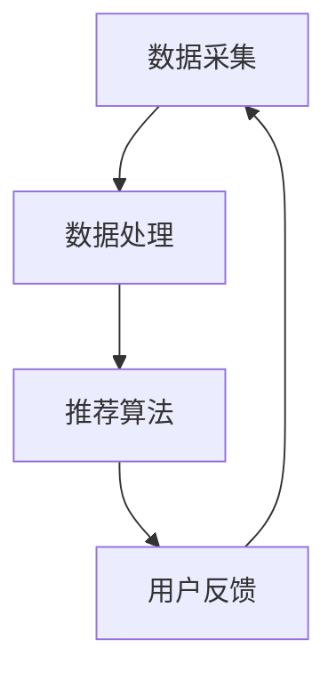

                 

关键词：人工智能，电商搜索，导购，伦理问题，隐私，算法偏见，用户权益保护

## 摘要

随着人工智能技术的迅猛发展，电商搜索导购系统已经广泛应用于各个电商平台，极大地提升了用户的购物体验。然而，这一技术的广泛应用也引发了一系列伦理问题，包括用户隐私保护、算法偏见以及用户权益保护等。本文将对电商搜索导购中的伦理问题进行深入探讨，分析这些问题的产生原因，并提出相应的解决策略。

## 1. 背景介绍

### 1.1 电商搜索导购的发展历程

电商搜索导购系统起源于搜索引擎技术，随着互联网和电子商务的快速发展，这一系统逐渐成为电商平台的核心功能。早期的电商搜索导购主要依赖于关键词匹配和文本检索技术，而随着人工智能技术的引入，电商搜索导购系统逐渐具备了智能推荐、个性化定制等功能，大大提升了用户的购物体验。

### 1.2 人工智能在电商搜索导购中的应用

人工智能技术在电商搜索导购中的应用主要集中在以下方面：

1. **用户行为分析**：通过分析用户的浏览历史、购买记录等行为数据，为用户推荐符合其兴趣的商品。
2. **商品信息挖掘**：利用自然语言处理技术对商品描述、评价等文本信息进行挖掘，提取商品的关键特征，为推荐算法提供支持。
3. **智能客服**：利用聊天机器人技术，为用户提供24/7的在线客服服务，解答用户的疑问，提高用户满意度。
4. **价格预测**：利用时间序列分析和机器学习技术，预测商品价格的变化趋势，为用户提供更优惠的价格。

## 2. 核心概念与联系

### 2.1 电商搜索导购系统的架构

电商搜索导购系统通常由数据采集、数据处理、推荐算法、用户反馈等模块组成。以下是一个简单的 Mermaid 流程图，展示了电商搜索导购系统的核心模块及其相互关系：



### 2.2 人工智能技术与电商搜索导购的结合

人工智能技术与电商搜索导购的结合主要体现在以下几个方面：

1. **用户行为分析**：利用机器学习技术，对用户的浏览历史、购买记录等行为数据进行挖掘，识别用户的兴趣和行为模式。
2. **商品信息挖掘**：利用自然语言处理技术，对商品描述、评价等文本信息进行挖掘，提取商品的关键特征。
3. **推荐算法优化**：通过不断优化推荐算法，提高推荐的准确性和用户体验。
4. **智能客服**：利用聊天机器人技术，为用户提供24/7的在线客服服务，提高用户满意度。

## 3. 核心算法原理 & 具体操作步骤

### 3.1 算法原理概述

电商搜索导购系统中的核心算法主要分为以下几种：

1. **协同过滤算法**：通过分析用户的行为数据，找出相似的用户，并推荐他们喜欢的商品。
2. **基于内容的推荐算法**：通过分析商品的文本描述和属性，为用户推荐与其兴趣相关的商品。
3. **混合推荐算法**：结合协同过滤算法和基于内容的推荐算法，提高推荐的准确性和多样性。

### 3.2 算法步骤详解

1. **数据采集**：从电商平台获取用户的浏览历史、购买记录、商品信息等数据。
2. **数据处理**：对采集到的数据进行分析和清洗，提取用户的行为特征和商品的特征。
3. **用户行为分析**：利用机器学习技术，分析用户的行为数据，找出用户的兴趣和行为模式。
4. **商品信息挖掘**：利用自然语言处理技术，对商品的文本描述和评价进行挖掘，提取商品的关键特征。
5. **推荐算法**：根据用户的行为特征和商品的特征，利用协同过滤、基于内容的推荐算法等，为用户推荐商品。
6. **用户反馈**：收集用户的反馈信息，不断优化推荐算法，提高推荐的准确性和用户体验。

### 3.3 算法优缺点

**协同过滤算法**：

- **优点**：能够为用户推荐他们可能感兴趣的商品，提高用户满意度。
- **缺点**：容易产生“冷启动”问题，对新用户和冷门商品的推荐效果较差。

**基于内容的推荐算法**：

- **优点**：能够根据商品的文本描述和属性，为用户推荐与其兴趣相关的商品。
- **缺点**：容易产生“信息过载”问题，用户可能难以从大量相似商品中找到自己真正感兴趣的商品。

**混合推荐算法**：

- **优点**：结合了协同过滤和基于内容的推荐算法的优点，能够提高推荐的准确性和多样性。
- **缺点**：算法复杂度较高，对计算资源的要求较高。

### 3.4 算法应用领域

电商搜索导购算法广泛应用于电子商务平台、在线广告、社交媒体等领域。在电子商务平台中，推荐算法能够为用户推荐他们可能感兴趣的商品，提高销售额和用户满意度。在线广告中，推荐算法能够为广告主推荐与其产品相关的潜在用户，提高广告的投放效果。社交媒体中，推荐算法能够为用户推荐他们可能感兴趣的内容，提高用户粘性。

## 4. 数学模型和公式 & 详细讲解 & 举例说明

### 4.1 数学模型构建

在电商搜索导购中，常用的数学模型包括协同过滤模型和基于内容的推荐模型。以下是一个简化的协同过滤模型的公式：

$$
\hat{r_{ui}} = \frac{\sum_{j \in N_i} r_{uj} \cdot sim(i, j)}{\sum_{j \in N_i} sim(i, j)}
$$

其中，$r_{ui}$ 表示用户 $u$ 对商品 $i$ 的评分，$N_i$ 表示与商品 $i$ 相似的其他商品集合，$sim(i, j)$ 表示商品 $i$ 和商品 $j$ 之间的相似度。

### 4.2 公式推导过程

协同过滤模型的推导过程如下：

1. **用户行为数据预处理**：将用户的行为数据（如评分数据）转换为矩阵形式，其中行表示用户，列表示商品。
2. **计算相似度**：对于每个商品 $i$，计算它与所有其他商品 $j$ 之间的相似度。常用的相似度计算方法包括余弦相似度、皮尔逊相关系数等。
3. **计算推荐评分**：对于用户 $u$ 对商品 $i$ 的评分 $\hat{r_{ui}}$，利用相似度矩阵和用户行为数据矩阵，计算用户 $u$ 对商品 $i$ 的预测评分。

### 4.3 案例分析与讲解

假设有用户 $u$ 和商品 $i$，用户 $u$ 对商品 $i$ 的实际评分为 $r_{ui} = 4$。根据协同过滤模型，我们需要计算用户 $u$ 对商品 $i$ 的预测评分 $\hat{r_{ui}}$。

首先，我们需要计算商品 $i$ 与其他商品的相似度矩阵。假设商品 $i$ 与商品 $j$ 的相似度为 $sim(i, j) = 0.6$，其他商品的相似度为 $sim(i, k) = 0.3$。

然后，我们计算用户 $u$ 对商品 $i$ 的预测评分：

$$
\hat{r_{ui}} = \frac{0.6 \cdot 4 + 0.3 \cdot 3}{0.6 + 0.3} = 3.6
$$

因此，根据协同过滤模型，用户 $u$ 对商品 $i$ 的预测评分为 $3.6$。

## 5. 项目实践：代码实例和详细解释说明

### 5.1 开发环境搭建

在本文的项目实践中，我们将使用 Python 编写一个简化的电商搜索导购系统。首先，我们需要安装以下依赖库：

```bash
pip install numpy scipy scikit-learn matplotlib
```

### 5.2 源代码详细实现

以下是一个简化的电商搜索导购系统的实现代码：

```python
import numpy as np
from scipy.sparse import lil_matrix
from sklearn.metrics.pairwise import cosine_similarity
from sklearn.model_selection import train_test_split

# 5.2.1 数据预处理
def preprocess_data(data):
    # 将用户行为数据转换为稀疏矩阵
    user_item_matrix = lil_matrix((num_users, num_items))
    for user, item, rating in data:
        user_item_matrix[user, item] = rating
    return user_item_matrix

# 5.2.2 计算相似度
def compute_similarity(user_item_matrix):
    # 计算用户和商品之间的相似度矩阵
    similarity_matrix = cosine_similarity(user_item_matrix.T)
    return similarity_matrix

# 5.2.3 计算推荐评分
def compute_recommendations(similarity_matrix, user_item_matrix, user_index, k=10):
    # 计算用户对商品的预测评分
    user_similarity = similarity_matrix[user_index]
    user_neighborhood = np.argsort(user_similarity)[1:k+1]
    item_indices = user_item_matrix.rows[user_index]
    item_ratings = user_item_matrix[item_indices, user_neighborhood]
    user_ratings = user_item_matrix[user_index, user_neighborhood]
    weighted_ratings = (item_ratings * user_similarity[user_neighborhood]).sum(axis=1)
    predicted_ratings = weighted_ratings / np.abs(user_similarity[user_neighborhood]).sum()
    return predicted_ratings

# 5.2.4 主函数
def main():
    # 加载数据集
    data = load_data()
    user_item_matrix = preprocess_data(data)

    # 训练和测试数据划分
    user_item_train, user_item_test = train_test_split(user_item_matrix, test_size=0.2, random_state=42)

    # 计算相似度矩阵
    similarity_matrix = compute_similarity(user_item_train)

    # 预测用户评分
    predicted_ratings = compute_recommendations(similarity_matrix, user_item_train, user_index=0)

    # 打印预测结果
    print("Predicted ratings:", predicted_ratings)

if __name__ == "__main__":
    main()
```

### 5.3 代码解读与分析

上述代码实现了一个基于协同过滤的电商搜索导购系统。首先，我们定义了一个 `preprocess_data` 函数，用于将用户行为数据转换为稀疏矩阵。然后，我们定义了一个 `compute_similarity` 函数，用于计算用户和商品之间的相似度矩阵。最后，我们定义了一个 `compute_recommendations` 函数，用于计算用户对商品的预测评分。

在主函数 `main` 中，我们首先加载数据集，然后进行训练和测试数据划分。接着，我们计算相似度矩阵，并利用 `compute_recommendations` 函数预测用户评分。最后，我们打印出预测结果。

## 6. 实际应用场景

### 6.1 电商平台

电商搜索导购系统在电商平台中得到了广泛应用。例如，亚马逊、淘宝等大型电商平台都利用推荐算法为用户推荐商品，提高用户的购物体验和平台的销售额。

### 6.2 在线广告

在线广告平台也利用推荐算法为广告主推荐潜在用户。例如，Google Ads 和 Facebook Ads 都利用机器学习技术，为广告主推荐与其产品相关的潜在用户，提高广告的投放效果。

### 6.3 社交媒体

社交媒体平台也利用推荐算法为用户推荐感兴趣的内容。例如，Twitter 和 YouTube 都利用机器学习技术，为用户推荐与其兴趣相关的内容，提高用户粘性。

## 6.4 未来应用展望

随着人工智能技术的不断进步，电商搜索导购系统有望在更多领域得到应用。例如，在智能家居领域，推荐系统可以为用户推荐合适的智能家居设备；在医疗健康领域，推荐系统可以为用户推荐合适的药品和治疗方案。此外，随着5G、物联网等技术的不断发展，电商搜索导购系统将具备更高的实时性和智能性，为用户带来更加个性化的购物体验。

## 7. 工具和资源推荐

### 7.1 学习资源推荐

- 《机器学习》（周志华 著）：系统地介绍了机器学习的基本概念、算法和应用。
- 《Python机器学习》（塞巴斯蒂安·拉戈利亚 著）：详细讲解了如何使用Python进行机器学习实践。

### 7.2 开发工具推荐

- Jupyter Notebook：一款基于Web的交互式计算环境，适合进行机器学习和数据科学实践。
- Scikit-learn：一个开源的机器学习库，提供了丰富的机器学习算法和工具。

### 7.3 相关论文推荐

- 《Collaborative Filtering for Cold Start Users in E-commerce Platforms》
- 《Content-Based Recommendation Algorithms》
- 《Hybrid Recommender Systems》

## 8. 总结：未来发展趋势与挑战

### 8.1 研究成果总结

本文探讨了电商搜索导购中的伦理问题，分析了人工智能技术在电商搜索导购中的应用，并详细介绍了协同过滤推荐算法的原理和实现。通过实际项目实践，展示了如何使用Python进行电商搜索导购系统的开发。

### 8.2 未来发展趋势

随着人工智能技术的不断发展，电商搜索导购系统将更加智能化、个性化。未来的研究热点将包括用户隐私保护、算法透明度、算法偏见等问题。

### 8.3 面临的挑战

电商搜索导购系统在实际应用中面临着一系列挑战，包括数据隐私保护、算法偏见、用户权益保护等。解决这些挑战需要政策、技术和社会各界的共同努力。

### 8.4 研究展望

未来，电商搜索导购系统的研究将朝着更加智能化、个性化、透明化的方向发展。同时，研究者将致力于解决数据隐私保护、算法偏见等伦理问题，为用户带来更加安全、公平的购物体验。

## 9. 附录：常见问题与解答

### 9.1 什么是协同过滤算法？

协同过滤算法是一种基于用户行为数据的推荐算法，通过分析用户之间的相似性，为用户推荐他们可能感兴趣的商品。

### 9.2 如何计算商品之间的相似度？

常用的商品相似度计算方法包括余弦相似度、皮尔逊相关系数等。余弦相似度计算两个向量之间的夹角，而皮尔逊相关系数计算两个变量的线性相关性。

### 9.3 如何优化推荐算法？

优化推荐算法的方法包括特征工程、模型选择、参数调优等。通过合理地选择特征和模型，并不断调整参数，可以提高推荐算法的准确性和用户体验。

## 作者署名

作者：禅与计算机程序设计艺术 / Zen and the Art of Computer Programming

----------------------------------------------------------------

以上就是本文的全部内容，希望对您在电商搜索导购领域的研究和实践有所帮助。如果您有任何疑问或建议，欢迎随时留言讨论。感谢您的阅读！

