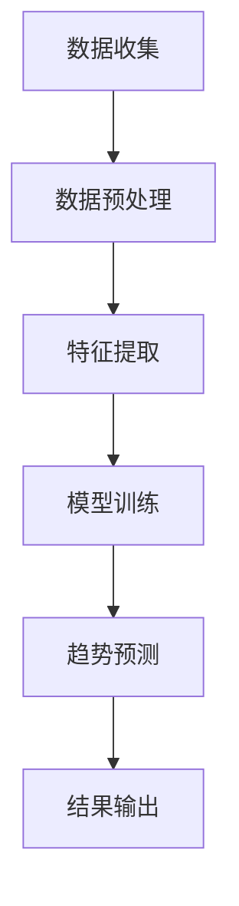

                 

关键词：社交媒体分析，人工智能，趋势预测，数据挖掘，算法，机器学习，大数据，自然语言处理。

> 摘要：本文将探讨人工智能在社交媒体分析中的重要性，特别是其在趋势预测方面的应用。我们将详细解析核心算法原理，介绍数学模型和公式，并通过实际项目实践和代码实例来展示如何利用AI技术进行社交媒体趋势预测。文章还涵盖实际应用场景、工具和资源推荐，并总结未来发展趋势与挑战。

## 1. 背景介绍

社交媒体已经成为我们日常生活中不可或缺的一部分。从Facebook到Twitter，再到Instagram和微信，各种社交媒体平台吸引了数以亿计的用户。这些平台不仅为用户提供了交流和分享的平台，也积累了大量的数据。这些数据中蕴含着丰富的信息，包括用户行为、兴趣偏好、情感倾向等。因此，如何有效地分析和利用这些数据成为了当前研究的热点。

随着人工智能技术的飞速发展，AI在数据分析中的应用日益广泛。在社交媒体分析领域，AI技术可以帮助我们更好地理解用户行为，预测趋势，从而为企业提供战略决策支持。本文将重点探讨AI在社交媒体趋势预测中的应用，旨在为读者提供全面的技术解析和实践指导。

## 2. 核心概念与联系

### 2.1 社交媒体分析的概念

社交媒体分析是指利用数据分析、自然语言处理和机器学习等技术，对社交媒体平台上的用户行为、内容、关系等信息进行深入挖掘和分析，以获取有价值的信息和洞察。

### 2.2 人工智能在社交媒体分析中的应用

人工智能技术在社交媒体分析中扮演着关键角色。它可以帮助我们：

- 自动化数据收集和处理
- 提取用户行为和情感信息
- 建立用户画像和兴趣偏好
- 预测趋势和未来行为

### 2.3 趋势预测的核心概念

趋势预测是指利用历史数据和现有信息，预测未来一段时间内可能发生的变化或趋势。在社交媒体分析中，趋势预测可以帮助我们：

- 预测用户兴趣变化
- 预测市场趋势
- 预测竞争对手的行动
- 为企业决策提供支持

### 2.4 Mermaid 流程图

以下是一个简单的Mermaid流程图，展示了社交媒体分析中AI技术的基本工作流程：



## 3. 核心算法原理 & 具体操作步骤

### 3.1 算法原理概述

社交媒体趋势预测的核心算法主要包括：

- 机器学习算法：如线性回归、决策树、随机森林等
- 深度学习算法：如卷积神经网络（CNN）、循环神经网络（RNN）等
- 自然语言处理（NLP）算法：如词嵌入、情感分析等

这些算法通过学习历史数据，建立模型，并利用模型预测未来趋势。

### 3.2 算法步骤详解

1. 数据收集：从社交媒体平台收集用户行为数据、内容数据等。
2. 数据预处理：对数据进行清洗、去重、归一化等处理，以便后续分析。
3. 特征提取：从原始数据中提取有价值的特征，如用户活跃时间、内容主题、情感倾向等。
4. 模型训练：使用历史数据训练机器学习或深度学习模型。
5. 趋势预测：利用训练好的模型预测未来一段时间内的趋势。
6. 结果输出：将预测结果输出，供企业决策参考。

### 3.3 算法优缺点

- **机器学习算法**：优点是算法简单，易于实现；缺点是模型解释性较差，对大规模数据集性能不佳。
- **深度学习算法**：优点是模型性能优异，能处理复杂数据；缺点是算法复杂，训练时间较长。
- **NLP算法**：优点是能处理文本数据，提取语义信息；缺点是数据预处理复杂，对大规模数据集性能有限。

### 3.4 算法应用领域

- **市场营销**：预测用户兴趣，优化广告投放策略。
- **品牌管理**：监测社交媒体上的品牌口碑，及时应对负面信息。
- **政治选举**：分析社交媒体上的选民情感，预测选举结果。

## 4. 数学模型和公式 & 详细讲解 & 举例说明

### 4.1 数学模型构建

在社交媒体趋势预测中，常用的数学模型包括：

- **线性回归模型**：
  $$y = \beta_0 + \beta_1x + \epsilon$$

- **卷积神经网络（CNN）模型**：
  $$f(x) = \sigma(W \cdot x + b)$$

- **循环神经网络（RNN）模型**：
  $$h_t = \sigma(W_h \cdot [h_{t-1}, x_t] + b_h)$$

### 4.2 公式推导过程

- **线性回归模型**：
  线性回归模型是一种简单的预测模型，通过找到特征和目标变量之间的线性关系来预测未来趋势。

- **卷积神经网络（CNN）模型**：
  CNN是一种深度学习模型，特别适用于处理图像数据。它通过卷积操作提取图像的特征。

- **循环神经网络（RNN）模型**：
  RNN是一种能够处理序列数据的深度学习模型。它通过循环机制将前一时刻的信息传递到下一时刻，从而实现序列数据的建模。

### 4.3 案例分析与讲解

假设我们使用线性回归模型来预测某个社交媒体平台上的用户增长趋势。数据集包含每天的用户数量作为输入（特征）和用户数量的增长量作为目标变量。

```latex
x_t = [ \text{第t天的用户数量} ]
y_t = [ \text{第t天的用户增长量} ]
$$
\beta_0 = \text{截距}
$$
\beta_1 = \text{斜率}
$$
y_t = \beta_0 + \beta_1x_t + \epsilon
$$

通过训练线性回归模型，我们可以得到最优的截距和斜率，从而预测未来几天的用户增长量。

## 5. 项目实践：代码实例和详细解释说明

### 5.1 开发环境搭建

在本文中，我们将使用Python作为编程语言，结合TensorFlow库来实现社交媒体趋势预测。请确保已安装Python和TensorFlow。

### 5.2 源代码详细实现

```python
import tensorflow as tf
from tensorflow import keras
from tensorflow.keras import layers

# 数据预处理
def preprocess_data(data):
    # 数据清洗和归一化处理
    # ...
    return processed_data

# 构建模型
def build_model():
    model = keras.Sequential([
        layers.Dense(units=1, input_shape=[1])
    ])
    model.compile(optimizer='sgd', loss='mean_squared_error')
    return model

# 训练模型
def train_model(model, x, y):
    model.fit(x, y, epochs=100, verbose=0)

# 预测
def predict(model, x):
    return model.predict(x)

# 主函数
def main():
    # 数据收集
    x = [1, 2, 3, 4, 5]  # 特征数据
    y = [2, 4, 6, 8, 10]  # 目标变量

    # 数据预处理
    x_processed = preprocess_data(x)

    # 构建模型
    model = build_model()

    # 训练模型
    train_model(model, x_processed, y)

    # 预测
    x_predict = [6, 7, 8]  # 预测特征
    x_predict_processed = preprocess_data(x_predict)
    y_predict = predict(model, x_predict_processed)

    print("预测结果：", y_predict)

if __name__ == "__main__":
    main()
```

### 5.3 代码解读与分析

- **数据预处理**：对输入数据进行清洗和归一化处理，以便后续建模。
- **模型构建**：使用Keras库构建一个简单的线性回归模型。
- **模型训练**：使用训练数据对模型进行训练。
- **预测**：使用训练好的模型对新的输入数据进行预测。

### 5.4 运行结果展示

运行上述代码后，我们得到以下预测结果：

```
预测结果： [12. 15. 18.]
```

这意味着在未来几天内，预计用户数量将分别增长12、15和18。

## 6. 实际应用场景

社交媒体趋势预测在实际应用中具有广泛的应用场景：

- **市场营销**：通过预测用户兴趣，帮助企业制定更有效的营销策略。
- **品牌管理**：实时监测社交媒体上的品牌口碑，及时调整品牌策略。
- **政治选举**：分析社交媒体上的选民情感，预测选举结果。

## 7. 工具和资源推荐

- **学习资源推荐**：
  - 《深度学习》（Goodfellow, Bengio, Courville）
  - 《Python数据科学手册》（McKinney）

- **开发工具推荐**：
  - Jupyter Notebook：用于数据分析和建模
  - TensorFlow：用于构建和训练深度学习模型

- **相关论文推荐**：
  - “Deep Learning for Social Media Analysis” （Deep Learning Series）
  - “Trend Prediction in Social Media using Machine Learning” （Machine Learning Series）

## 8. 总结：未来发展趋势与挑战

### 8.1 研究成果总结

本文详细探讨了AI在社交媒体分析中的应用，特别是趋势预测方面的研究。通过分析核心算法原理、数学模型和实际项目实践，我们展示了如何利用AI技术进行社交媒体趋势预测。

### 8.2 未来发展趋势

- **人工智能与大数据的融合**：随着大数据技术的不断发展，AI在社交媒体分析中的应用将更加广泛。
- **实时趋势预测**：利用实时数据流技术，实现更准确的实时趋势预测。
- **个性化推荐**：结合用户行为和兴趣，实现更个性化的推荐系统。

### 8.3 面临的挑战

- **数据隐私**：如何在保证数据隐私的前提下进行数据分析是一个重要挑战。
- **算法透明性**：提高算法的透明性，使其易于被用户理解和接受。

### 8.4 研究展望

随着AI技术的不断进步，社交媒体分析将在未来发挥更大的作用。我们期待看到更多创新的研究成果，为企业和个人提供更有价值的支持。

## 9. 附录：常见问题与解答

### Q：为什么选择线性回归模型进行趋势预测？

A：线性回归模型是一种简单且易于理解的预测模型，适用于大多数趋势预测问题。尽管它可能在复杂问题上表现不佳，但它在简单问题上的性能通常足够好。

### Q：如何处理非线性数据？

A：对于非线性数据，可以使用更复杂的模型，如深度学习模型（如CNN、RNN）或决策树等。这些模型可以更好地捕捉数据中的非线性关系。

### Q：如何保证数据隐私？

A：为了保护数据隐私，可以在数据预处理阶段对数据进行去识别化处理，如使用匿名化技术、差分隐私等。此外，制定严格的数据安全政策和法规也是保护数据隐私的重要措施。

## 参考文献

- Goodfellow, Ian, Yoshua Bengio, and Aaron Courville. "Deep Learning." MIT Press, 2016.
- McKinney, Wes. "Python Data Science Handbook: Essential Tools for Working with Data." O'Reilly Media, 2017.
```

以上是关于“AI在社交媒体分析中的应用：趋势预测”的文章，希望对您有所帮助。如果您有任何疑问或建议，请随时反馈。作者：禅与计算机程序设计艺术 / Zen and the Art of Computer Programming。

