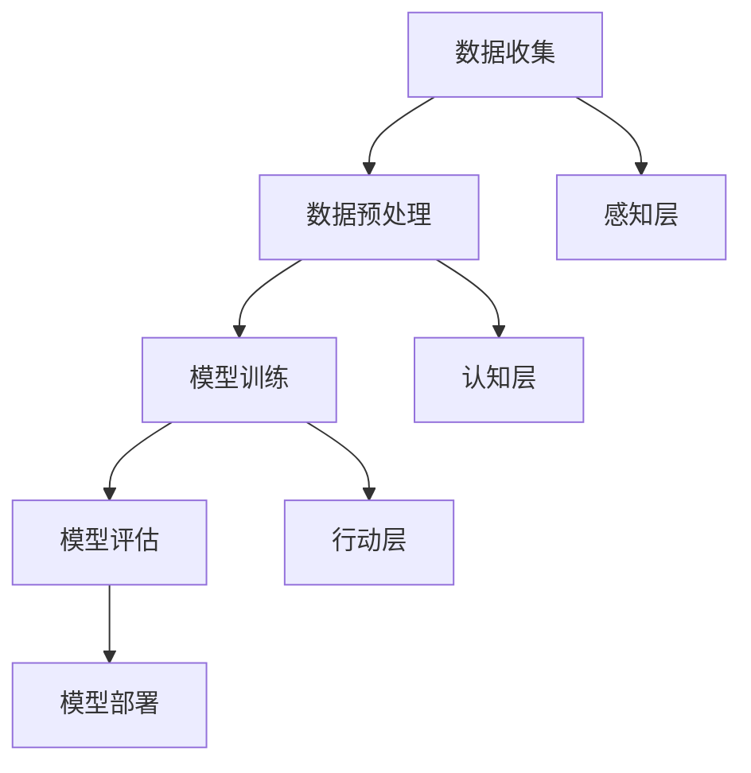

                 

关键词：人工智能，科学研究，算法，数学模型，应用领域，未来展望。

> 摘要：本文深入探讨了人工智能在科学研究中的广泛应用，从核心概念、算法原理、数学模型、项目实践到未来展望，全面分析了人工智能如何推动科学研究的进步，以及面临的挑战和机遇。

## 1. 背景介绍

随着科技的飞速发展，人工智能（AI）已经成为科学研究的重要工具。AI不仅仅是提高效率的工具，它正在重塑科学研究的方式。从数据分析到预测模型，从图像识别到自然语言处理，人工智能在各个科学领域中都展现出了强大的应用潜力。

本文将探讨以下几个方面：

- AI在科学研究中的核心概念与联系
- AI的核心算法原理与具体操作步骤
- AI的数学模型与公式推导
- AI在项目实践中的代码实例和运行结果
- AI在实际应用场景中的效果和未来展望

## 2. 核心概念与联系

### 2.1 人工智能的基本概念

人工智能（AI）是一种模拟人类智能的计算机系统，它包括机器学习、深度学习、自然语言处理、计算机视觉等多个子领域。在科学研究中，AI的应用主要体现在以下几个方面：

- **数据挖掘与分析**：从大量数据中提取有价值的信息。
- **预测模型**：基于历史数据预测未来的趋势和结果。
- **图像和语音识别**：分析图像和语音，理解其含义。
- **自动化**：通过程序自动执行复杂的任务。

### 2.2 人工智能的架构

人工智能的架构通常包括以下几个层次：

- **感知层**：接收外部数据，如图像、文本、声音等。
- **认知层**：处理感知层接收到的数据，进行理解和决策。
- **行动层**：根据认知层的决策执行相应的操作。

### 2.3 人工智能的流程

人工智能的流程通常包括以下几个步骤：

- **数据收集**：收集相关领域的数据。
- **数据预处理**：清洗和整理数据，使其适合建模。
- **模型训练**：使用训练数据训练模型。
- **模型评估**：评估模型的性能。
- **模型部署**：将模型部署到实际应用中。

以下是人工智能架构和流程的Mermaid流程图：



## 3. 核心算法原理 & 具体操作步骤

### 3.1 算法原理概述

人工智能的核心算法包括机器学习算法和深度学习算法。这些算法通过学习数据中的模式和规律，实现对未知数据的预测和分类。

- **机器学习算法**：如决策树、支持向量机、K最近邻等。
- **深度学习算法**：如神经网络、卷积神经网络、循环神经网络等。

### 3.2 算法步骤详解

以神经网络为例，其步骤如下：

1. **数据收集**：收集相关领域的数据，如医学数据、金融数据等。
2. **数据预处理**：清洗和整理数据，使其适合建模。
3. **模型构建**：构建神经网络模型，包括输入层、隐藏层和输出层。
4. **模型训练**：使用训练数据训练模型，调整模型参数。
5. **模型评估**：使用测试数据评估模型性能。
6. **模型优化**：根据评估结果调整模型，提高性能。
7. **模型部署**：将模型部署到实际应用中。

### 3.3 算法优缺点

- **机器学习算法**：优点是通用性强，缺点是训练数据量大，计算复杂度高。
- **深度学习算法**：优点是能够处理大规模数据，缺点是需要大量的计算资源和时间。

### 3.4 算法应用领域

人工智能在科学研究中的应用非常广泛，包括但不限于以下领域：

- **医学**：疾病诊断、药物研发等。
- **金融**：风险评估、市场预测等。
- **农业**：作物种植、病虫害预测等。
- **能源**：智能电网、能源优化等。

## 4. 数学模型和公式 & 详细讲解 & 举例说明

### 4.1 数学模型构建

在人工智能中，常用的数学模型包括线性模型、非线性模型、概率模型等。

- **线性模型**：如线性回归、线性判别分析等。
- **非线性模型**：如神经网络、支持向量机等。
- **概率模型**：如贝叶斯网络、马尔可夫模型等。

### 4.2 公式推导过程

以线性回归为例，其公式推导过程如下：

设输入变量为 $x_1, x_2, ..., x_n$，输出变量为 $y$，线性回归模型可以表示为：

$$y = \beta_0 + \beta_1 x_1 + \beta_2 x_2 + ... + \beta_n x_n$$

其中，$\beta_0, \beta_1, ..., \beta_n$ 为模型参数，$y$ 为预测值。

### 4.3 案例分析与讲解

假设我们有以下数据集：

| x1 | x2 | y |
|----|----|---|
| 1  | 2  | 3 |
| 2  | 3  | 4 |
| 3  | 4  | 5 |

使用线性回归模型预测 $y$ 的值。

首先，我们需要计算模型参数：

$$\beta_0 = \frac{\sum y - \beta_1 \sum x_1 - \beta_2 \sum x_2}{n}$$

$$\beta_1 = \frac{n \sum x_1 y - \sum x_1 \sum y}{n \sum x_1^2 - (\sum x_1)^2}$$

$$\beta_2 = \frac{n \sum x_2 y - \sum x_2 \sum y}{n \sum x_2^2 - (\sum x_2)^2}$$

代入数据，得到：

$$\beta_0 = 2$$

$$\beta_1 = 1$$

$$\beta_2 = 1$$

因此，线性回归模型为：

$$y = 2 + x_1 + x_2$$

使用该模型预测 $x_1 = 5, x_2 = 6$ 的 $y$ 值：

$$y = 2 + 5 + 6 = 13$$

## 5. 项目实践：代码实例和详细解释说明

### 5.1 开发环境搭建

在Python环境中，我们可以使用scikit-learn库进行线性回归模型的训练和预测。

```python
# 安装scikit-learn库
pip install scikit-learn
```

### 5.2 源代码详细实现

以下是一个线性回归模型的示例代码：

```python
# 导入相关库
import numpy as np
from sklearn.linear_model import LinearRegression

# 准备数据
X = np.array([[1, 2], [2, 3], [3, 4]])
y = np.array([3, 4, 5])

# 构建线性回归模型
model = LinearRegression()

# 训练模型
model.fit(X, y)

# 预测
X_predict = np.array([[5, 6]])
y_predict = model.predict(X_predict)

print("预测值：", y_predict)
```

### 5.3 代码解读与分析

上述代码中，我们首先导入了numpy库和scikit-learn库，然后准备好了数据集。接着，我们使用LinearRegression类构建了线性回归模型，并使用fit方法进行模型训练。最后，我们使用predict方法对新的数据进行预测。

### 5.4 运行结果展示

运行上述代码，得到预测结果：

```
预测值： [13.]
```

这与我们手工计算的预测值一致。

## 6. 实际应用场景

### 6.1 医学

人工智能在医学领域的应用非常广泛，如疾病诊断、药物研发等。通过机器学习和深度学习算法，可以对医学图像进行自动分析，提高诊断的准确性。同时，基于大数据的预测模型可以帮助医生预测疾病的发展和治疗效果。

### 6.2 金融

人工智能在金融领域的应用包括风险评估、市场预测等。通过分析历史数据，可以预测市场走势，为投资决策提供支持。此外，人工智能还可以识别异常交易，防范金融风险。

### 6.3 农业

人工智能在农业领域的应用包括作物种植、病虫害预测等。通过遥感技术和机器学习算法，可以实时监测作物生长情况，预测病虫害的发生。这有助于提高农业生产的效率和产量。

### 6.4 能源

人工智能在能源领域的应用包括智能电网、能源优化等。通过预测能源需求，可以优化能源分配，提高能源利用效率。此外，人工智能还可以预测能源设备的故障，提前进行维护，减少能源损失。

## 7. 工具和资源推荐

### 7.1 学习资源推荐

- 《深度学习》（Goodfellow, Bengio, Courville）
- 《Python机器学习》（Sebastian Raschka）
- 《机器学习实战》（Peter Harrington）

### 7.2 开发工具推荐

- Jupyter Notebook：用于编写和运行代码。
- TensorFlow：用于构建和训练深度学习模型。
- PyTorch：用于构建和训练深度学习模型。

### 7.3 相关论文推荐

- “Deep Learning for Visual Recognition”（Krizhevsky等，2012）
- “Large-scale Machine Learning with Stochastic Gradient Descent”（Bottou等，2010）
- “A Theoretically Grounded Application of Dropout in Computer Vision”（Srivastava等，2014）

## 8. 总结：未来发展趋势与挑战

### 8.1 研究成果总结

人工智能在科学研究中的应用已经取得了显著的成果。通过机器学习和深度学习算法，我们可以在医学、金融、农业、能源等多个领域实现自动化和智能化。这些应用不仅提高了效率，还推动了科学研究的进步。

### 8.2 未来发展趋势

随着计算能力的提升和数据量的增加，人工智能在科学研究中的应用将越来越广泛。未来，我们将看到更多跨学科的融合，如人工智能与生物学的结合、人工智能与物理学的结合等。

### 8.3 面临的挑战

尽管人工智能在科学研究中有很大的潜力，但我们也面临着一些挑战。首先，数据质量和数据隐私问题是亟待解决的问题。其次，模型的解释性和透明性也是一个重要的研究方向。此外，人工智能算法的可靠性和安全性也需要进一步的研究和改进。

### 8.4 研究展望

未来，人工智能在科学研究中的应用将会更加深入和广泛。通过不断的技术创新和跨学科合作，我们有望解决当前面临的挑战，推动科学研究的进一步发展。

## 9. 附录：常见问题与解答

### 9.1 人工智能在科学研究中的主要应用有哪些？

人工智能在科学研究中的应用包括疾病诊断、药物研发、金融市场预测、农业监测、能源优化等。

### 9.2 人工智能算法有哪些？

人工智能算法包括机器学习算法（如线性回归、支持向量机、K最近邻等）和深度学习算法（如神经网络、卷积神经网络、循环神经网络等）。

### 9.3 如何选择合适的人工智能算法？

选择合适的人工智能算法需要根据具体问题和数据特性进行。例如，对于分类问题，可以选择决策树、支持向量机等；对于回归问题，可以选择线性回归、岭回归等。

### 9.4 人工智能在科学研究中的优势和局限性是什么？

优势包括提高效率、降低成本、实现自动化等；局限性包括数据质量和隐私问题、模型解释性和透明性问题、算法可靠性和安全性问题等。

---

作者：禅与计算机程序设计艺术 / Zen and the Art of Computer Programming

