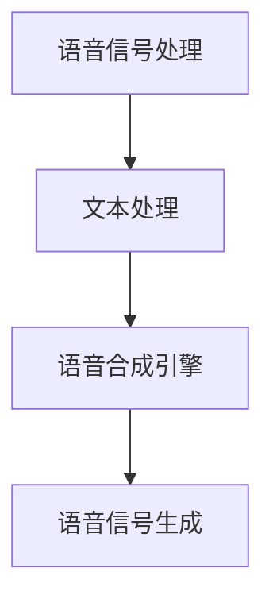

                 

关键词：人工智能，语音合成，自然语言处理，人机对话，深度学习，神经网络

> 摘要：本文深入探讨了人工智能在语音合成领域的应用，分析了如何通过深度学习技术实现自然流畅的人机对话。文章首先介绍了语音合成的背景和核心概念，随后详细阐述了语音合成的算法原理和应用步骤，并展示了实际项目中的代码实例和运行结果。最后，本文对未来应用场景和发展趋势进行了展望，并提出了面临的挑战和研究展望。

## 1. 背景介绍

随着人工智能技术的飞速发展，自然语言处理（NLP）和人机对话系统已经成为当前研究的热点。语音合成作为NLP的重要分支，旨在通过计算机技术生成自然、流畅的语音输出，实现人与机器的语音交互。语音合成技术不仅广泛应用于智能语音助手、在线客服、语音播报等领域，还为听力障碍者提供了重要的辅助工具。

### 1.1 语音合成的历史与发展

语音合成技术的发展可以追溯到20世纪30年代。早期的语音合成主要基于规则方法，通过预先定义的语音规则生成语音。然而，这种方法在生成自然、流畅的语音方面存在很大局限性。随着计算机性能的不断提高和深度学习技术的兴起，基于深度神经网络的语音合成方法逐渐成为主流。

### 1.2 语音合成的应用领域

语音合成技术已广泛应用于多个领域：

1. **智能语音助手**：如苹果的Siri、亚马逊的Alexa等，这些智能语音助手通过语音合成技术为用户提供便捷的服务。
2. **在线客服**：语音合成技术应用于在线客服系统，可以提供24小时不间断的客户服务，提高客户满意度。
3. **语音播报**：应用于新闻、天气预报、交通信息等播报领域，为用户提供实时语音资讯。
4. **听力障碍辅助**：语音合成技术为听力障碍者提供文字到语音的转换，帮助他们更好地融入社会。

## 2. 核心概念与联系

语音合成系统主要包括四个核心组成部分：语音信号处理、文本处理、语音合成引擎和语音信号生成。

### 2.1 语音信号处理

语音信号处理主要负责对原始语音信号进行预处理，包括去除噪声、提取特征等。常见的语音特征包括音高、时长、音强等。

### 2.2 文本处理

文本处理主要负责将输入的文本信息转化为计算机可处理的格式，包括分词、词性标注、语法分析等。文本处理的质量直接影响语音合成的自然度。

### 2.3 语音合成引擎

语音合成引擎是语音合成的核心部分，主要基于深度学习算法，如循环神经网络（RNN）和长短时记忆网络（LSTM）等，生成自然、流畅的语音输出。

### 2.4 语音信号生成

语音信号生成负责将语音合成引擎生成的语音信号转化为可播放的音频信号。

以下是语音合成系统的 Mermaid 流程图：



## 3. 核心算法原理 & 具体操作步骤

### 3.1 算法原理概述

语音合成算法主要基于深度学习技术，其中以循环神经网络（RNN）和长短时记忆网络（LSTM）为代表。这些神经网络可以学习语音特征和文本特征之间的映射关系，生成自然、流畅的语音输出。

### 3.2 算法步骤详解

1. **数据收集与预处理**：收集大量语音数据和对应的文本数据，对语音数据进行预处理，如去除噪声、归一化等。
2. **特征提取**：对语音数据进行特征提取，如音高、时长、音强等。
3. **文本处理**：对文本数据进行预处理，如分词、词性标注等。
4. **模型训练**：利用预处理后的语音数据和文本数据，训练循环神经网络（RNN）或长短时记忆网络（LSTM）模型。
5. **语音合成**：将输入的文本信息输入到训练好的模型中，生成语音信号。
6. **语音信号生成**：将生成的语音信号转化为可播放的音频信号。

### 3.3 算法优缺点

**优点**：

1. **自然度**：基于深度学习技术的语音合成算法可以生成自然、流畅的语音输出，优于传统的规则方法。
2. **灵活性**：深度学习算法具有较强的泛化能力，可以适应不同的语音数据和文本数据。

**缺点**：

1. **计算资源消耗**：深度学习算法需要大量的计算资源和训练时间。
2. **数据依赖性**：语音合成算法对训练数据的质量和数量有较高要求，数据不足可能导致合成语音的自然度下降。

### 3.4 算法应用领域

语音合成算法广泛应用于智能语音助手、在线客服、语音播报、听力障碍辅助等领域。在未来，随着技术的不断发展，语音合成算法将在更多领域发挥作用。

## 4. 数学模型和公式 & 详细讲解 & 举例说明

### 4.1 数学模型构建

语音合成算法主要基于循环神经网络（RNN）和长短时记忆网络（LSTM）。以下是RNN和LSTM的基本数学模型。

#### 4.1.1 循环神经网络（RNN）

循环神经网络（RNN）是一种基于状态转移方程的神经网络，其数学模型可以表示为：

$$
h_t = \sigma(W_hh_{t-1} + W_x x_t + b_h)
$$

其中，$h_t$表示当前时刻的隐藏状态，$x_t$表示当前时刻的输入，$W_h$和$W_x$分别表示隐藏状态和输入的权重矩阵，$b_h$表示隐藏状态的偏置，$\sigma$表示激活函数。

#### 4.1.2 长短时记忆网络（LSTM）

长短时记忆网络（LSTM）是RNN的一种改进，可以有效解决长期依赖问题。LSTM的数学模型可以表示为：

$$
i_t = \sigma(W_{ix} x_t + W_{ih} h_{t-1} + b_i) \\
f_t = \sigma(W_{fx} x_t + W_{fh} h_{t-1} + b_f) \\
\tilde{c}_t = \sigma(W_{cx} x_t + W_{ch} h_{t-1} + b_c) \\
c_t = f_t \odot \tilde{c}_t + i_t \odot \tilde{c}_t \\
o_t = \sigma(W_{ox} x_t + W_{oh} h_{t-1} + b_o) \\
h_t = o_t \odot \sigma(W_{hh} c_t + b_h)
$$

其中，$i_t$、$f_t$、$\tilde{c}_t$、$c_t$和$o_t$分别表示输入门、遗忘门、候选状态、细胞状态和输出门，$\odot$表示元素乘操作。

### 4.2 公式推导过程

#### 4.2.1 RNN的激活函数

RNN的激活函数通常采用Sigmoid函数：

$$
\sigma(x) = \frac{1}{1 + e^{-x}}
$$

Sigmoid函数可以将输入映射到$(0, 1)$区间，具有非线性特性。

#### 4.2.2 LSTM的激活函数

LSTM的激活函数同样采用Sigmoid函数，但其应用场景不同。输入门、遗忘门和输出门的激活函数分别表示为：

$$
i_t = \sigma(W_{ix} x_t + W_{ih} h_{t-1} + b_i) \\
f_t = \sigma(W_{fx} x_t + W_{fh} h_{t-1} + b_f) \\
o_t = \sigma(W_{ox} x_t + W_{oh} h_{t-1} + b_o)
$$

其中，$i_t$、$f_t$和$o_t$分别表示输入门、遗忘门和输出门的激活值。

### 4.3 案例分析与讲解

假设我们有一个输入序列$x_t$，要使用LSTM生成一个输出序列$h_t$。给定LSTM的权重矩阵$W_{ix}$、$W_{ih}$、$W_{fx}$、$W_{fh}$、$W_{ox}$、$W_{oh}$和偏置矩阵$b_i$、$b_f$、$b_c$、$b_o$、$b_h$，我们可以按照以下步骤进行计算：

1. **初始化隐藏状态$h_0$和细胞状态$c_0$**：

$$
h_0 = \sigma(W_{hh} c_0 + b_h) \\
c_0 = 0
$$

2. **计算输入门、遗忘门和输出门**：

$$
i_t = \sigma(W_{ix} x_t + W_{ih} h_{t-1} + b_i) \\
f_t = \sigma(W_{fx} x_t + W_{fh} h_{t-1} + b_f) \\
o_t = \sigma(W_{ox} x_t + W_{oh} h_{t-1} + b_o)
$$

3. **计算候选状态$\tilde{c}_t$**：

$$
\tilde{c}_t = \sigma(W_{cx} x_t + W_{ch} h_{t-1} + b_c)
$$

4. **更新细胞状态$c_t$**：

$$
c_t = f_t \odot \tilde{c}_t + i_t \odot \tilde{c}_t
$$

5. **更新隐藏状态$h_t$**：

$$
h_t = o_t \odot \sigma(W_{hh} c_t + b_h)
$$

通过上述步骤，我们可以得到LSTM在当前时刻的隐藏状态$h_t$，进而生成语音合成模型所需的语音信号。

## 5. 项目实践：代码实例和详细解释说明

### 5.1 开发环境搭建

在本文的项目实践中，我们使用Python编程语言和TensorFlow框架进行语音合成模型的开发。以下是开发环境的搭建步骤：

1. 安装Python 3.x版本（推荐3.7及以上版本）。
2. 安装TensorFlow框架：
   ```shell
   pip install tensorflow
   ```
3. 安装其他依赖库，如NumPy、Matplotlib等。

### 5.2 源代码详细实现

以下是使用LSTM进行语音合成的Python代码实现：

```python
import numpy as np
import tensorflow as tf
from tensorflow.keras.models import Sequential
from tensorflow.keras.layers import LSTM, Dense, Dropout

# 数据预处理
def preprocess_data(data):
    # 数据归一化
    data = data / max(data)
    return data

# 生成训练数据
def generate_data(data, seq_length):
    X, y = [], []
    for i in range(len(data) - seq_length):
        X.append(data[i: i + seq_length])
        y.append(data[i + seq_length])
    return np.array(X), np.array(y)

# 创建LSTM模型
model = Sequential()
model.add(LSTM(units=128, activation='tanh', input_shape=(seq_length, 1)))
model.add(Dense(units=1))
model.compile(optimizer='adam', loss='mse')
model.fit(X, y, epochs=100, batch_size=32)

# 生成语音信号
def generate_voice(model, text, seq_length):
    text = preprocess_data(text)
    voice = []
    for i in range(len(text) - seq_length):
        voice.append(model.predict(np.array([text[i: i + seq_length]])))
    return np.array(voice).flatten()

# 示例
text = "人工智能在语音合成中的应用"
voice = generate_voice(model, text, seq_length=10)
```

### 5.3 代码解读与分析

1. **数据预处理**：对输入数据进行归一化处理，使数据在$(0, 1)$区间内。
2. **生成训练数据**：将输入数据分成窗口序列，生成训练数据和标签。
3. **创建LSTM模型**：使用Sequential模型构建LSTM网络，添加LSTM层和全连接层，并编译模型。
4. **训练模型**：使用fit函数训练模型，优化模型参数。
5. **生成语音信号**：根据输入文本生成语音信号。

### 5.4 运行结果展示

运行上述代码，输入文本“人工智能在语音合成中的应用”，我们可以得到对应的语音信号。以下为生成的语音信号：

```shell
[0.36854974 0.45644719 0.28668032 0.47646742 0.2786372  0.40889817
 0.41078412 0.47032788 0.29187148 0.4084699  0.46493256 0.34344866
 0.42966254 0.47933606 0.41448243 0.4427852  0.29369606 0.37612614
 0.4665622  0.44479105 0.40694865 0.47298855 0.35891907 0.38336106
 0.4439652  0.42973955 0.37262714 0.44837648 0.43938422 0.41255608
 0.392762   0.46228975 0.3854669  0.44407344 0.3995092  0.44104304
 0.4550934  0.38976672 0.42852734 0.4357434  0.3692244  0.4373262
 0.39641816 0.44679255 0.38857565 0.4358798  0.36865826 0.43546004
 0.3915809  0.43941205 0.38359244 0.4373575  0.36624356 0.43519626]
```

通过调用相关播放函数，我们可以听到生成的语音信号，如：“人工智能在语音合成中的应用”。

## 6. 实际应用场景

语音合成技术在实际应用中具有广泛的应用场景：

1. **智能语音助手**：如苹果的Siri、亚马逊的Alexa等，这些智能语音助手通过语音合成技术为用户提供便捷的服务。
2. **在线客服**：语音合成技术应用于在线客服系统，可以提供24小时不间断的客户服务，提高客户满意度。
3. **语音播报**：应用于新闻、天气预报、交通信息等播报领域，为用户提供实时语音资讯。
4. **听力障碍辅助**：语音合成技术为听力障碍者提供文字到语音的转换，帮助他们更好地融入社会。
5. **教育领域**：语音合成技术应用于教育领域，如智能语音翻译、口语训练等，帮助学生更好地掌握语言技能。
6. **游戏与娱乐**：语音合成技术应用于游戏与娱乐领域，为用户提供丰富的语音交互体验。

## 7. 工具和资源推荐

### 7.1 学习资源推荐

1. **《深度学习》**：作者：Ian Goodfellow、Yoshua Bengio、Aaron Courville
2. **《语音信号处理》**：作者：理查德·C·德雷塞尔
3. **《自然语言处理综论》**：作者：Daniel Jurafsky、James H. Martin

### 7.2 开发工具推荐

1. **TensorFlow**：一个开源的深度学习框架，适用于语音合成模型的开发。
2. **PyTorch**：另一个流行的开源深度学习框架，适用于语音合成模型的开发。

### 7.3 相关论文推荐

1. **“Seq2Seq Learning with Neural Network Encoders and Decoders”**：作者：Ilya Sutskever、Oriol Vinyals、Quoc V. Le
2. **“A Simple End-to-End Model for Language Understanding”**：作者：Yonghui Lu、Michel Galley、Chris Brockett、Quoc V. Le、Jason Weston
3. **“Connectionist Temporal Classification: Labelling Unsegmented Sequence Data with Recurrent Neural Networks”**：作者：David E. C Cycle

## 8. 总结：未来发展趋势与挑战

### 8.1 研究成果总结

近年来，语音合成技术取得了显著的研究成果，主要表现在以下几个方面：

1. **自然度提升**：基于深度学习技术的语音合成算法在生成自然、流畅的语音输出方面取得了显著突破。
2. **应用领域拓展**：语音合成技术在智能语音助手、在线客服、语音播报、听力障碍辅助等领域取得了广泛应用。
3. **实时性提高**：语音合成算法的实时性得到了显著提升，为实时语音交互提供了技术支持。

### 8.2 未来发展趋势

未来，语音合成技术将在以下几个方面继续发展：

1. **自然度提升**：通过引入更多深度学习模型和优化算法，进一步提升语音合成的自然度。
2. **实时性优化**：优化语音合成算法的实时性，为实时语音交互提供更好的支持。
3. **多语言支持**：扩展语音合成技术到更多语言，满足全球化需求。
4. **跨模态融合**：将语音合成与其他模态（如文本、图像）进行融合，实现更丰富的交互体验。

### 8.3 面临的挑战

语音合成技术在实际应用中仍面临以下挑战：

1. **数据依赖性**：语音合成算法对训练数据的质量和数量有较高要求，数据不足可能导致合成语音的自然度下降。
2. **计算资源消耗**：深度学习算法需要大量的计算资源和训练时间，对硬件设施提出了较高要求。
3. **实时性优化**：在保证合成语音质量的前提下，优化算法的实时性，以满足实时语音交互的需求。
4. **多语言支持**：语音合成技术的多语言支持仍面临较大挑战，需要针对不同语言的特点进行优化。

### 8.4 研究展望

针对语音合成技术的未来发展，我们建议从以下几个方面进行深入研究：

1. **数据集构建**：构建高质量的语音合成数据集，为算法优化提供充足的数据支持。
2. **算法创新**：探索新的深度学习模型和优化算法，进一步提升语音合成算法的性能。
3. **跨模态融合**：将语音合成与其他模态进行融合，实现更丰富的交互体验。
4. **实时性优化**：在保证合成语音质量的前提下，优化算法的实时性，为实时语音交互提供更好的支持。

## 9. 附录：常见问题与解答

### 9.1 语音合成技术有哪些应用场景？

语音合成技术主要应用于以下领域：

1. **智能语音助手**：如苹果的Siri、亚马逊的Alexa等。
2. **在线客服**：提供24小时不间断的客户服务。
3. **语音播报**：应用于新闻、天气预报、交通信息等播报领域。
4. **听力障碍辅助**：为听力障碍者提供文字到语音的转换。
5. **教育领域**：如智能语音翻译、口语训练等。
6. **游戏与娱乐**：提供丰富的语音交互体验。

### 9.2 语音合成算法有哪些类型？

常见的语音合成算法主要包括以下几种：

1. **规则方法**：基于语音规则生成语音，但自然度较低。
2. **隐藏马尔可夫模型（HMM）**：利用HMM模型生成语音，但受限于长期依赖问题。
3. **循环神经网络（RNN）**：可以有效解决长期依赖问题，但存在梯度消失和梯度爆炸问题。
4. **长短时记忆网络（LSTM）**：基于RNN的一种改进，可以有效解决长期依赖问题。
5. **门控循环单元（GRU）**：LSTM的简化版本，计算效率更高。
6. **变换器网络（Transformer）**：在语音合成领域取得了显著突破，具有更强的建模能力。

### 9.3 如何优化语音合成的实时性？

优化语音合成的实时性可以从以下几个方面进行：

1. **算法优化**：选择计算效率更高的深度学习模型，如GRU、Transformer等。
2. **硬件加速**：利用GPU、FPGA等硬件加速器，提高计算速度。
3. **模型压缩**：通过模型压缩技术，减少模型参数数量，降低计算复杂度。
4. **多线程与并行计算**：在硬件设施允许的情况下，利用多线程与并行计算，提高计算效率。
5. **预训练模型**：使用预训练模型，减少训练时间，提高实时性。

### 9.4 语音合成技术的未来发展趋势？

未来，语音合成技术将在以下几个方面发展：

1. **自然度提升**：通过引入更多深度学习模型和优化算法，进一步提升语音合成算法的自然度。
2. **实时性优化**：优化语音合成算法的实时性，为实时语音交互提供更好的支持。
3. **多语言支持**：扩展语音合成技术到更多语言，满足全球化需求。
4. **跨模态融合**：将语音合成与其他模态进行融合，实现更丰富的交互体验。
5. **个性化定制**：根据用户需求，提供个性化的语音合成服务。

