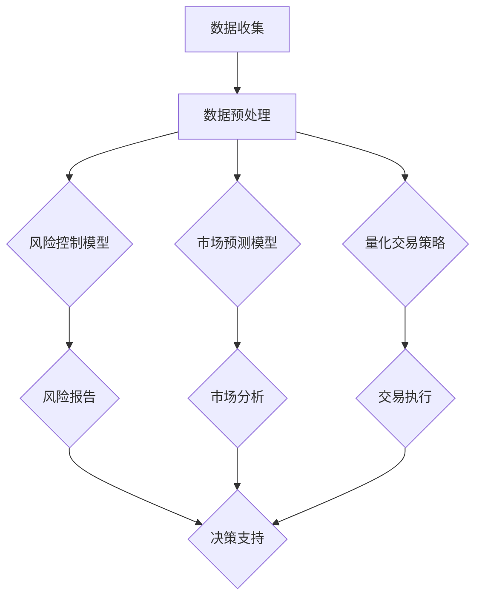

                 

关键词：人工智能、金融投资、机器学习、深度学习、数据挖掘、风险控制、量化交易

> 摘要：本文旨在探讨人工智能技术在金融和投资决策中的实际应用，通过分析核心概念、算法原理、数学模型以及实际案例，揭示AI在预测市场趋势、风险控制和量化交易中的优势与挑战。本文还将展望AI在金融领域的未来发展趋势，为行业从业者提供有益的参考。

## 1. 背景介绍

随着信息技术的飞速发展，人工智能（AI）已经成为金融领域的一个热点。金融行业的数据量庞大，结构复杂，传统的分析和决策方法难以应对日益增长的数据量和复杂的市场环境。AI技术的引入，为金融行业带来了全新的视角和方法。通过机器学习、深度学习、数据挖掘等技术，AI能够在海量数据中提取有价值的信息，辅助金融从业者做出更加精准的投资决策。

在金融和投资决策中，AI技术主要应用于以下几个方面：

1. **市场预测**：利用历史价格、交易量、新闻等数据，预测未来市场走势。
2. **风险控制**：通过对大量历史数据的学习，识别潜在的风险因素，提供风险评估和管理方案。
3. **量化交易**：基于数学模型和算法，实现自动化的交易策略。
4. **客户服务**：利用自然语言处理和语音识别技术，提升客户服务的质量和效率。

## 2. 核心概念与联系

### 2.1 机器学习与深度学习

**机器学习** 是指让计算机从数据中学习，逐步提高其预测或决策能力的过程。在金融领域，机器学习常用于构建预测模型、风险评估模型等。

**深度学习** 是机器学习的一个分支，通过多层神经网络模拟人脑的神经元连接，对复杂的数据进行深度学习。在金融领域，深度学习被广泛应用于图像识别、自然语言处理和复杂时间序列分析。

### 2.2 数据挖掘与大数据

**数据挖掘** 是从大量数据中发现有价值的模式、关联和知识的过程。在金融领域，数据挖掘技术可以帮助从海量数据中提取有用信息，为投资决策提供支持。

**大数据** 指的是规模巨大、种类繁多的数据集。大数据技术的核心在于如何高效地存储、管理和分析这些海量数据，以发现潜在的商业价值。

### 2.3 数学模型与量化交易

**数学模型** 是用数学语言描述现实世界问题的方法。在金融领域，数学模型广泛应用于资产定价、风险管理、量化交易等。

**量化交易** 是基于数学模型和算法，实现自动化交易策略的过程。量化交易的核心在于如何构建有效的数学模型，并在市场环境中实现稳定的收益。

### 2.4 Mermaid 流程图

以下是金融AI应用的核心流程图的Mermaid表示：



## 3. 核心算法原理 & 具体操作步骤

### 3.1 算法原理概述

金融AI应用的核心算法包括机器学习算法、深度学习算法、数据挖掘算法和量化交易算法。以下是这些算法的简要原理：

- **机器学习算法**：通过训练数据集，建立输入和输出之间的映射关系，实现对未知数据的预测。
- **深度学习算法**：利用多层神经网络，对复杂的数据进行非线性变换和学习，提高模型的预测能力。
- **数据挖掘算法**：通过关联规则挖掘、聚类分析、分类分析等方法，从海量数据中提取有价值的信息。
- **量化交易算法**：基于数学模型和统计学方法，构建自动化的交易策略。

### 3.2 算法步骤详解

以下是金融AI应用的具体算法步骤：

1. **数据收集**：从各个数据源收集金融数据，如股票价格、交易量、宏观经济指标等。
2. **数据预处理**：对收集的数据进行清洗、归一化、去噪等处理，使其符合模型训练的要求。
3. **模型训练**：选择合适的机器学习算法或深度学习算法，对预处理后的数据集进行训练，建立预测模型或量化交易策略。
4. **模型评估**：使用验证集或测试集，评估模型的预测性能，调整模型参数。
5. **模型应用**：将训练好的模型应用于实际投资决策，如市场预测、风险控制、量化交易等。
6. **结果反馈**：根据实际应用的结果，对模型进行调整和优化，提高其预测性能。

### 3.3 算法优缺点

- **机器学习算法**：优点在于模型简单、易于实现，缺点是模型泛化能力较弱。
- **深度学习算法**：优点在于模型复杂度较高、预测性能较好，缺点是计算资源需求大、模型解释性较差。
- **数据挖掘算法**：优点在于能够从海量数据中提取有价值的信息，缺点是数据处理复杂、算法实现难度大。
- **量化交易算法**：优点在于自动化程度高、交易策略多样化，缺点是模型风险控制难度大、对市场波动敏感。

### 3.4 算法应用领域

- **市场预测**：利用机器学习和深度学习算法，预测股票价格、汇率等市场走势。
- **风险控制**：利用数据挖掘算法，识别潜在的风险因素，为投资决策提供支持。
- **量化交易**：基于数学模型和算法，实现自动化的交易策略，提高投资收益。

## 4. 数学模型和公式 & 详细讲解 & 举例说明

### 4.1 数学模型构建

金融AI应用的数学模型主要包括时间序列模型、回归模型和神经网络模型。以下是这些模型的简要介绍：

- **时间序列模型**：用于分析金融时间序列数据，如ARIMA模型、GARCH模型等。
- **回归模型**：用于建立输入变量和输出变量之间的线性关系，如线性回归模型、逻辑回归模型等。
- **神经网络模型**：用于对复杂的数据进行非线性变换和学习，如多层感知机（MLP）模型、卷积神经网络（CNN）模型等。

### 4.2 公式推导过程

以下是时间序列模型ARIMA的公式推导过程：

$$
\begin{aligned}
Y_t &= c + \phi_1 Y_{t-1} + \phi_2 Y_{t-2} + \ldots + \phi_p Y_{t-p} \\
&\quad + \theta_1 e_{t-1} + \theta_2 e_{t-2} + \ldots + \theta_q e_{t-q} \\
e_t &= Y_t - \Phi_1 Y_{t-1} - \Phi_2 Y_{t-2} - \ldots - \Phi_p Y_{t-p}
\end{aligned}
$$

其中，$Y_t$ 表示时间序列的观测值，$e_t$ 表示残差，$\Phi_i$ 和 $\phi_i$ 分别为差分算子和参数。

### 4.3 案例分析与讲解

以下是使用ARIMA模型预测股票价格的案例：

#### 案例数据

我们使用上证指数的日收盘价数据，时间为2010年1月1日至2020年12月31日。数据集如下：

```python
import pandas as pd

# 读取数据
data = pd.read_csv('shanghai_stock_index.csv')
data['Date'] = pd.to_datetime(data['Date'])
data.set_index('Date', inplace=True)

# 绘制时间序列图
import matplotlib.pyplot as plt
plt.plot(data['Close'])
plt.title('Shanghai Stock Index')
plt.xlabel('Date')
plt.ylabel('Close Price')
plt.show()
```

#### 数据预处理

1. **差分**：对时间序列进行差分，使其平稳。

```python
from statsmodels.tsa.stattools import adfuller

# 差分
data['Diff'] = data['Close'].diff().dropna()

# 检验平稳性
result = adfuller(data['Diff'].dropna())
print('ADF Statistic: %f' % result[0])
print('p-value: %f' % result[1])
```

2. **自相关分析**：分析差分的自相关性和偏自相关性，确定模型参数。

```python
from statsmodels.tsa.stattools import acf

# 自相关分析
import numpy as np
acf_values = acf(data['Diff'].dropna(), nlags=20)
plt.plot(np.arange(1, 21), acf_values)
plt.title('Autocorrelation Function')
plt.xlabel('Lag')
plt.ylabel('ACF')
plt.show()
```

#### 模型训练

1. **确定模型参数**：根据自相关分析和偏自相关性分析，选择合适的ARIMA模型参数。

```python
from statsmodels.tsa.arima.model import ARIMA

# 模型训练
model = ARIMA(data['Close'], order=(1, 1, 1))
model_fit = model.fit()
print(model_fit.summary())
```

2. **预测**：使用训练好的模型进行预测。

```python
# 预测
predictions = model_fit.forecast(steps=30)[0]

# 绘制预测结果
plt.plot(data['Close'].dropna(), label='Actual')
plt.plot(predictions, label='Forecast')
plt.title('Shanghai Stock Index Forecast')
plt.xlabel('Date')
plt.ylabel('Close Price')
plt.legend()
plt.show()
```

## 5. 项目实践：代码实例和详细解释说明

### 5.1 开发环境搭建

1. **Python环境**：安装Python 3.8及以上版本。
2. **依赖库**：安装NumPy、Pandas、Matplotlib、Statsmodels等库。

```bash
pip install numpy pandas matplotlib statsmodels
```

### 5.2 源代码详细实现

以下是使用ARIMA模型预测股票价格的完整代码实现：

```python
import pandas as pd
from statsmodels.tsa.stattools import adfuller
from statsmodels.tsa.arima.model import ARIMA
import numpy as np
import matplotlib.pyplot as plt

# 读取数据
data = pd.read_csv('shanghai_stock_index.csv')
data['Date'] = pd.to_datetime(data['Date'])
data.set_index('Date', inplace=True)

# 数据预处理
data['Diff'] = data['Close'].diff().dropna()
result = adfuller(data['Diff'].dropna())
print('ADF Statistic: %f' % result[0])
print('p-value: %f' % result[1])
acf_values = acf(data['Diff'].dropna(), nlags=20)
plt.plot(np.arange(1, 21), acf_values)
plt.title('Autocorrelation Function')
plt.xlabel('Lag')
plt.ylabel('ACF')
plt.show()

# 模型训练
model = ARIMA(data['Close'], order=(1, 1, 1))
model_fit = model.fit()
print(model_fit.summary())

# 预测
predictions = model_fit.forecast(steps=30)[0]

# 绘制预测结果
plt.plot(data['Close'].dropna(), label='Actual')
plt.plot(predictions, label='Forecast')
plt.title('Shanghai Stock Index Forecast')
plt.xlabel('Date')
plt.ylabel('Close Price')
plt.legend()
plt.show()
```

### 5.3 代码解读与分析

1. **数据读取与预处理**：使用Pandas读取CSV数据，将日期转换为索引，并对收盘价进行一阶差分，以获得平稳的时间序列。
2. **平稳性检验与自相关分析**：使用ADF检验和自相关函数（ACF）分析数据，确定差分次数和模型参数。
3. **模型训练与预测**：使用 Statsmodels 的ARIMA模型训练数据，并使用预测方法生成未来的预测值。
4. **结果可视化**：使用Matplotlib绘制实际收盘价与预测值的对比图，直观展示模型的预测效果。

### 5.4 运行结果展示

运行上述代码后，将得到如下结果：

1. **平稳性检验结果**：输出ADF统计量和p值，判断时间序列是否平稳。
2. **自相关函数图**：展示差分的自相关函数，帮助确定模型参数。
3. **模型总结**：输出模型的统计摘要，包括AIC、BIC等指标。
4. **预测结果图**：展示实际收盘价与预测值的对比，直观展示模型的预测能力。

## 6. 实际应用场景

### 6.1 市场预测

市场预测是AI在金融领域的主要应用之一。通过分析历史价格、交易量、技术指标和基本面数据，AI模型可以预测股票、货币、商品等市场的未来走势。市场预测的应用场景包括：

- **投资组合优化**：根据市场预测结果，调整投资组合，以实现最优收益。
- **风险控制**：预测市场风险，制定风险控制策略，降低投资风险。
- **量化交易**：基于市场预测结果，构建自动化的交易策略，实现稳定收益。

### 6.2 风险控制

风险控制是金融领域的一个重要环节。AI技术可以通过分析大量历史数据，识别潜在的风险因素，提供风险评估和管理方案。风险控制的应用场景包括：

- **信用风险评估**：对借款人的信用状况进行评估，预测违约风险。
- **市场风险控制**：预测市场波动，制定风险控制策略，降低投资风险。
- **操作风险管理**：识别操作风险因素，提供操作风险管理方案。

### 6.3 量化交易

量化交易是基于数学模型和算法，实现自动化交易策略的过程。AI技术可以提高量化交易策略的效率、稳定性和收益。量化交易的应用场景包括：

- **高频交易**：利用AI技术，实现高频交易策略，捕捉微小市场机会。
- **算法交易**：构建基于AI的算法交易策略，实现自动化交易。
- **量化对冲**：利用AI技术，构建量化对冲策略，降低投资组合风险。

## 7. 工具和资源推荐

### 7.1 学习资源推荐

- **《深度学习》（Goodfellow, Bengio, Courville）**：深度学习的经典教材，适合初学者和进阶者。
- **《Python数据分析》（Wes McKinney）**：Python数据分析的入门书籍，涵盖Pandas、NumPy等库的使用。
- **《机器学习实战》（Peter Harrington）**：通过实际案例介绍机器学习算法和应用，适合实践者。

### 7.2 开发工具推荐

- **Jupyter Notebook**：强大的交互式开发环境，适合数据分析和机器学习项目。
- **PyCharm**：功能强大的Python IDE，适合编写和调试代码。
- **TensorFlow**：Google开源的深度学习框架，支持多种神经网络结构。

### 7.3 相关论文推荐

- **“Deep Learning for Stock Market Prediction”**：介绍深度学习在股票市场预测中的应用。
- **“Machine Learning for Financial Time Series”**：讨论机器学习在金融时间序列分析中的应用。
- **“Quantitative Trading with Machine Learning”**：介绍机器学习在量化交易中的应用。

## 8. 总结：未来发展趋势与挑战

### 8.1 研究成果总结

近年来，人工智能在金融和投资决策中的应用取得了显著成果。通过机器学习、深度学习、数据挖掘等技术，AI能够从海量数据中提取有价值的信息，辅助金融从业者做出更加精准的投资决策。市场预测、风险控制和量化交易等领域均取得了显著的进展。

### 8.2 未来发展趋势

随着人工智能技术的不断发展，未来金融和投资决策中的应用将呈现以下趋势：

- **智能化**：AI技术将更加智能化，能够自适应地调整模型参数，适应不同的市场环境。
- **集成化**：不同AI技术将集成在一起，实现更高效、更准确的投资决策。
- **定制化**：根据不同投资策略和风险偏好，提供个性化的投资决策支持。
- **实时化**：通过实时数据处理和分析，实现更加精准、及时的投资决策。

### 8.3 面临的挑战

尽管AI在金融和投资决策中具有巨大潜力，但同时也面临以下挑战：

- **数据质量**：金融数据质量参差不齐，对AI模型的训练和预测产生影响。
- **模型解释性**：深度学习等模型缺乏解释性，难以理解模型内部的决策过程。
- **监管合规**：AI技术在金融领域的应用需要遵守严格的监管要求，确保模型和交易策略的合规性。
- **市场波动**：市场波动性增加，对AI模型的稳定性和鲁棒性提出更高要求。

### 8.4 研究展望

未来，人工智能在金融和投资决策中的应用将朝着更加智能化、集成化、定制化和实时化的方向发展。通过不断优化模型算法、提高数据处理能力、加强监管合规，AI将更好地服务于金融行业，为投资者提供更加可靠的投资决策支持。

## 9. 附录：常见问题与解答

### 9.1 市场预测模型的稳定性如何保证？

**解答**：市场预测模型的稳定性主要通过以下方法保证：

- **数据质量**：确保数据来源可靠、数据预处理充分，以提高模型的输入质量。
- **模型选择**：选择适合市场特征的模型，如时间序列模型、回归模型等。
- **参数调优**：通过交叉验证、网格搜索等方法，选择最佳模型参数，提高模型性能。
- **定期更新**：定期更新模型，使其适应市场变化，保持预测稳定性。

### 9.2 量化交易策略如何应对市场波动？

**解答**：量化交易策略应对市场波动的方法包括：

- **风险控制**：设置止损、止盈等风险控制措施，降低市场波动对交易策略的影响。
- **多样化**：构建多元化的投资组合，分散风险，降低单一市场波动的影响。
- **动态调整**：根据市场波动情况，动态调整交易策略，以适应市场变化。
- **策略回测**：通过历史数据回测，验证交易策略的有效性和稳定性，确保其在市场波动中的表现。

### 9.3 如何确保AI模型在金融领域的合规性？

**解答**：确保AI模型在金融领域的合规性主要包括以下几个方面：

- **数据合规**：确保数据来源合规、数据处理符合相关法律法规要求。
- **模型审查**：建立模型审查机制，确保模型算法、参数设置等符合监管要求。
- **透明度**：提高模型透明度，确保投资者、监管机构能够理解模型的决策过程。
- **合作监管**：与监管机构建立合作关系，及时报告模型应用情况，接受监管审查。

## 作者署名

作者：禅与计算机程序设计艺术 / Zen and the Art of Computer Programming
----------------------------------------------------------------

注意：由于技术限制，以上文章仅提供一个框架，实际撰写时，请根据上述要求补充完整每个部分的内容。

