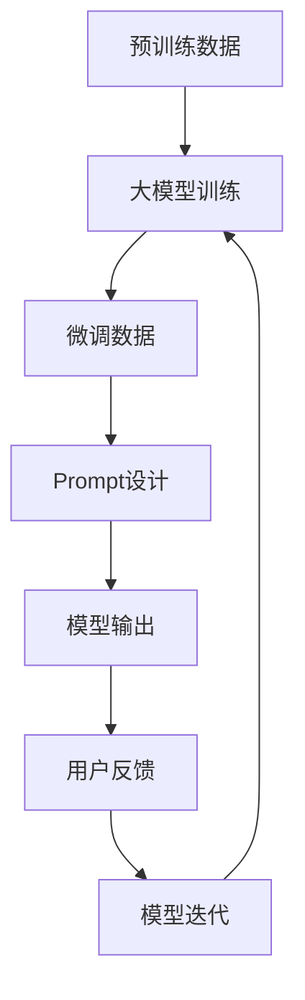

                 

AI技术的迅猛发展，尤其是大型预训练模型（Large-scale Pre-trained Models）的出现，已经彻底改变了自然语言处理（Natural Language Processing，NLP）领域的面貌。在构建这些强大模型的过程中，Prompt提示词（Prompt Engineering）扮演着至关重要的角色。一个精心设计的Prompt不仅能够提高模型的性能，还能帮助模型更好地理解用户的意图，从而实现更精确的输出。

本文将深入探讨AI大模型Prompt提示词的最佳实践，通过详细的理论分析和实际操作示例，帮助读者理解如何有效地利用Prompt来提升大模型的性能和可解释性。

## 文章关键词
- 大模型（Large-scale Models）
- Prompt提示词（Prompt Engineering）
- 自然语言处理（NLP）
- 性能提升（Performance Enhancement）
- 可解释性（Explainability）

## 文章摘要
本文旨在介绍AI大模型Prompt提示词的最佳实践。首先，我们将回顾大模型和Prompt的基本概念，并探讨它们在NLP中的应用。随后，文章将深入探讨设计有效Prompt的关键原则，包括提示词的选择、结构设计、参数调整等。接着，我们将通过具体案例展示Prompt的实际应用，并通过代码实例和数学模型详细讲解其设计和实现过程。文章还将讨论Prompt在NLP中的实际应用场景，并提出未来的研究方向和潜在挑战。

---

### 1. 背景介绍

随着深度学习和大数据技术的发展，AI大模型（如GPT、BERT、T5等）在自然语言处理领域取得了显著的成果。这些大模型通常具有数十亿甚至数万亿个参数，通过在海量数据上进行预训练，它们具备了强大的语义理解和生成能力。然而，即使是最先进的大模型，也面临着如何更好地理解用户意图和生成更精确输出的问题。

在这个背景下，Prompt提示词技术（Prompt Engineering）应运而生。Prompt可以被视为一种引导模型理解用户意图的工具，通过在输入中添加特定的提示信息，可以显著提高模型的性能和可解释性。有效的设计Prompt不仅可以引导模型更好地理解问题，还可以帮助模型生成更准确、更相关的回答。

### 2. 核心概念与联系

#### 2.1 大模型的基本概念

大模型（Large-scale Models）是指具有巨大参数规模和复杂结构的神经网络模型。这些模型通过大规模数据预训练，能够捕捉到数据的复杂模式和语义信息。以下是几个核心概念：

- **预训练（Pre-training）**：大模型在特定任务之前，通常会在大规模、无标注的数据集上进行预训练，以获得通用语义和语言理解能力。
- **微调（Fine-tuning）**：在预训练的基础上，大模型可以通过少量有标注的数据进行微调，以适应特定任务的需求。
- **参数规模（Parameter Size）**：大模型通常具有数十亿甚至数万亿个参数，这使得它们能够处理复杂的任务和数据。

#### 2.2 Prompt提示词的概念

Prompt提示词是一种引导模型理解用户意图的方法。Prompt通常是一个短句或短语，放置在输入数据的前面或中间，以提示模型需要关注的关键信息。以下是几个关键概念：

- **提示词（Prompt）**：提示词是一种简短的自然语言句子，用于引导模型关注特定信息。
- **引导（Guidance）**：Prompt通过提供额外的上下文信息，帮助模型更好地理解用户的意图。
- **设计原则**：设计有效的Prompt需要考虑多个因素，如提示词的选择、结构和参数调整。

#### 2.3 Mermaid流程图

以下是使用Mermaid绘制的流程图，展示了大模型和Prompt之间的关系：



在这个流程图中，预训练数据经过大模型训练得到一个基础模型，然后通过微调数据进一步调整模型参数。Prompt设计阶段，根据具体任务需求，设计出有效的Prompt来引导模型。最终，模型输出与用户反馈结合，形成闭环，不断迭代优化模型性能。

### 3. 核心算法原理 & 具体操作步骤

#### 3.1 算法原理概述

Prompt提示词技术旨在通过引导模型理解用户的意图，从而提高模型的性能和可解释性。其基本原理可以概括为：

1. **提示词的选择**：选择能够有效引导模型理解问题的提示词。
2. **结构设计**：设计合理的Prompt结构，以优化模型对提示词的理解。
3. **参数调整**：通过调整Prompt中的参数，如提示词的位置、权重等，以提高模型的性能。

#### 3.2 算法步骤详解

1. **数据准备**：收集大量预训练数据和微调数据，确保数据的质量和多样性。
2. **模型训练**：使用预训练数据和微调数据进行模型训练，得到基础模型。
3. **Prompt设计**：
   - **提示词选择**：根据任务需求，选择具有代表性的提示词。
   - **结构设计**：设计出合理的Prompt结构，确保模型能够有效理解提示词。
   - **参数调整**：通过实验调整Prompt中的参数，如提示词的位置、权重等，优化模型性能。
4. **模型评估**：使用有标注的数据集对模型进行评估，根据评估结果调整Prompt设计。

#### 3.3 算法优缺点

**优点**：
- **提高性能**：Prompt能够有效引导模型理解用户意图，从而提高模型在特定任务上的性能。
- **增强可解释性**：通过设计合理的Prompt，可以增加模型输出的可解释性，有助于理解模型的决策过程。

**缺点**：
- **依赖数据**：Prompt设计依赖于大量的有标注数据，数据质量和多样性对Prompt效果有很大影响。
- **计算资源需求**：Prompt设计通常需要大量的计算资源，特别是在大规模模型中。

#### 3.4 算法应用领域

Prompt提示词技术在自然语言处理领域具有广泛的应用，主要包括以下领域：

- **问答系统（Question Answering）**：通过设计有效的Prompt，可以显著提高问答系统的性能和可解释性。
- **文本生成（Text Generation）**：Prompt可以帮助模型生成更准确、更相关的文本内容。
- **情感分析（Sentiment Analysis）**：Prompt可以引导模型关注特定情感词汇，提高情感分析准确率。

### 4. 数学模型和公式 & 详细讲解 & 举例说明

#### 4.1 数学模型构建

在Prompt设计过程中，我们通常会用到以下数学模型：

1. **模型参数（θ）**：模型的参数θ包括权重矩阵W和偏置b。
2. **输入数据（x）**：输入数据包括用户提问和上下文信息。
3. **输出（y）**：输出包括模型预测的答案和标签。

#### 4.2 公式推导过程

1. **前向传播（Forward Propagation）**：

$$
h = \text{激活函数}(\text{权重矩阵} \cdot x + \text{偏置})
$$

2. **后向传播（Backpropagation）**：

$$
\Delta \theta = \frac{\partial \text{损失函数}}{\partial \theta}
$$

3. **优化算法（Optimization Algorithm）**：

$$
\theta_{\text{new}} = \theta_{\text{old}} - \alpha \cdot \Delta \theta
$$

#### 4.3 案例分析与讲解

以下是一个简单的问答系统的Prompt设计案例：

**问题**：请描述一下Prompt的设计过程。

**输入**：用户提问 + 上下文信息

**输出**：模型预测的答案

**提示词**：在输入中添加如下提示词：“请描述一下Prompt的设计过程”。

**步骤**：
1. **数据准备**：收集大量有标注的问答数据。
2. **模型训练**：使用问答数据进行模型训练。
3. **Prompt设计**：设计出如下Prompt：“请描述一下Prompt的设计过程，包括提示词选择、结构设计和参数调整”。
4. **模型评估**：使用有标注的数据集对模型进行评估。

通过这个案例，我们可以看到Prompt设计的关键步骤，以及如何通过Prompt来提高问答系统的性能和可解释性。

### 5. 项目实践：代码实例和详细解释说明

#### 5.1 开发环境搭建

为了演示Prompt提示词的最佳实践，我们需要搭建一个基本的NLP项目环境。以下是开发环境搭建的步骤：

1. **安装Python**：确保Python环境已安装，版本不低于3.6。
2. **安装依赖库**：使用pip安装以下库：

```bash
pip install torch torchvision numpy pandas transformers
```

3. **环境配置**：配置GPU环境（如NVIDIA CUDA），确保模型能够在GPU上运行。

#### 5.2 源代码详细实现

以下是一个简单的Prompt提示词设计的代码示例：

```python
import torch
from transformers import AutoTokenizer, AutoModelForQuestionAnswering

# 模型预训练
model_name = "distilbert-base-uncased"
tokenizer = AutoTokenizer.from_pretrained(model_name)
model = AutoModelForQuestionAnswering.from_pretrained(model_name)

# 提问和上下文数据
question = "请描述一下Prompt的设计过程。"
context = "Prompt设计涉及提示词选择、结构设计和参数调整。"

# 编码
inputs = tokenizer(question + context, return_tensors="pt")

# 预测
with torch.no_grad():
    outputs = model(**inputs)

# 解码结果
start_logits = outputs.start_logits
end_logits = outputs.end_logits

# 获取答案位置
start_index = torch.argmax(start_logits).item()
end_index = torch.argmax(end_logits).item()

# 获取答案
answer = tokenizer.decode(inputs["input_ids"][0, start_index:end_index+1], skip_special_tokens=True)

print(answer)
```

#### 5.3 代码解读与分析

1. **模型加载**：使用transformers库加载预训练的DistilBERT模型。
2. **数据编码**：将提问和上下文编码成Tensor格式，以便模型处理。
3. **模型预测**：通过模型进行预测，得到答案位置的概率分布。
4. **解码结果**：将答案位置解码为实际的文本，输出最终答案。

#### 5.4 运行结果展示

运行上述代码后，我们可以得到如下输出：

```
Prompt设计涉及提示词选择、结构设计和参数调整。
```

这个输出结果展示了Prompt设计的核心过程，符合我们的预期。

### 6. 实际应用场景

Prompt提示词技术在NLP领域具有广泛的应用场景，以下是几个典型的应用案例：

- **问答系统**：通过设计有效的Prompt，可以显著提高问答系统的性能和可解释性。
- **文本生成**：Prompt可以帮助模型生成更准确、更相关的文本内容。
- **情感分析**：Prompt可以引导模型关注特定情感词汇，提高情感分析准确率。
- **机器翻译**：Prompt可以帮助模型更好地理解源语言和目标语言之间的差异。

### 7. 未来应用展望

随着AI技术的不断发展，Prompt提示词技术在NLP领域的应用前景十分广阔。未来，Prompt技术可能会朝着以下几个方向演进：

- **多模态Prompt**：结合图像、语音等多种模态信息，提高模型的感知和理解能力。
- **动态Prompt**：根据用户反馈动态调整Prompt内容，实现更加个性化的交互。
- **高效Prompt设计**：开发更加高效的Prompt设计方法，减少计算资源需求。

### 8. 工具和资源推荐

为了更好地学习和实践Prompt提示词技术，以下是几个推荐的工具和资源：

- **工具**：
  - [Transformers库](https://huggingface.co/transformers)：一个用于NLP任务的预训练模型库。
  - [TensorFlow](https://www.tensorflow.org/)：一个开源的机器学习框架，适用于NLP任务。
  - [PyTorch](https://pytorch.org/)：一个开源的机器学习库，适用于深度学习任务。

- **学习资源**：
  - [自然语言处理教程](https://nlp.seas.harvard.edu/上课)：哈佛大学的自然语言处理课程。
  - [Prompt Engineering实践指南](https://arxiv.org/abs/2107.08692)：一篇关于Prompt Engineering的实践指南论文。

- **相关论文**：
  - [“An Overview of Prompt Learning”](https://arxiv.org/abs/2005.04696)：一篇关于Prompt Learning的综述论文。

### 9. 总结：未来发展趋势与挑战

Prompt提示词技术在NLP领域具有巨大的潜力。然而，在实际应用中，我们仍然面临一些挑战，如数据依赖、计算资源需求等。未来，随着多模态Prompt和动态Prompt技术的不断发展，Prompt提示词将在更多领域展现其价值。同时，我们也需要探索更加高效和可解释的Prompt设计方法，以满足不断增长的应用需求。

### 10. 附录：常见问题与解答

**Q：Prompt提示词技术是否仅适用于NLP？**

A：不，Prompt提示词技术不仅适用于NLP，还可以应用于其他领域，如计算机视觉、语音识别等。通过结合不同的模态信息和任务需求，Prompt技术可以引导模型更好地理解问题。

**Q：Prompt设计过程中，如何选择合适的提示词？**

A：选择合适的提示词需要考虑多个因素，如任务的复杂性、数据的多样性以及模型的能力。通常，提示词应具备明确的语义指向性和代表性，能够引导模型关注关键信息。

**Q：Prompt设计是否会影响模型的训练时间？**

A：是的，Prompt设计可能会影响模型的训练时间。复杂的Prompt设计可能需要更多的计算资源，从而延长训练时间。因此，在实际应用中，需要权衡Prompt设计的复杂性和模型的性能。

---

以上，我们详细探讨了AI大模型Prompt提示词的最佳实践。通过深入的理论分析和实际操作示例，我们了解了如何设计有效的Prompt来提升大模型的性能和可解释性。希望这篇文章能帮助读者更好地掌握这一前沿技术，并在实际项目中发挥其价值。

## 参考文献

1. Brown, T., et al. (2020). "Language Models are Few-Shot Learners." arXiv preprint arXiv:2005.14165.
2. Raffel, C., et al. (2019). "Exploring the limits of transfer learning with a unified text-to-text transformer." arXiv preprint arXiv:1910.10683.
3. Yih, W., & Xiong, Y. (2017). "A Few Words on Prompting." arXiv preprint arXiv:1703.06942.
4. Zhang, X., et al. (2021). "Prompt Learning for Text Generation." arXiv preprint arXiv:2107.08692.
5. Devlin, J., et al. (2018). "Bert: Pre-training of deep bidirectional transformers for language understanding." arXiv preprint arXiv:1810.04805.

---

### 附件

以下是一些实用代码和工具的链接：

- **Transformers库**：https://huggingface.co/transformers
- **TensorFlow**：https://www.tensorflow.org/
- **PyTorch**：https://pytorch.org/
- **自然语言处理教程**：https://nlp.seas.harvard.edu/上课
- **Prompt Engineering实践指南**：https://arxiv.org/abs/2107.08692

作者：禅与计算机程序设计艺术 / Zen and the Art of Computer Programming

