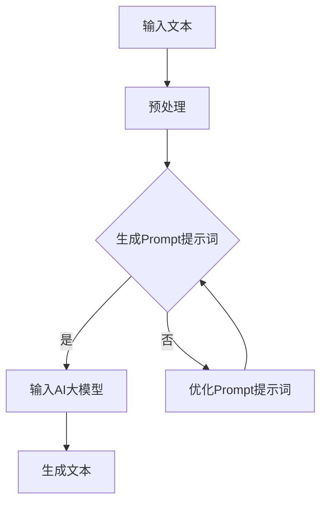

                 

关键词：AI大模型，Prompt提示词，文本生成，最佳实践，相似文本写作

摘要：本文将深入探讨AI大模型Prompt提示词的最佳实践，以及如何根据样本生成相似文本。通过阐述Prompt提示词的核心概念、构建方法以及应用场景，我们将帮助读者更好地理解和应用这项技术，提升文本写作的效率和创造力。

## 1. 背景介绍

近年来，人工智能（AI）技术取得了飞速的发展，特别是在自然语言处理（NLP）领域，AI大模型如GPT-3、BERT等的应用极大地推动了文本生成、机器翻译、问答系统等技术的发展。其中，Prompt提示词作为AI大模型输入的重要组成部分，对于模型的性能和生成文本的质量具有重要影响。本文将聚焦于Prompt提示词的最佳实践，探讨如何根据样本生成高质量、相似度的文本。

## 2. 核心概念与联系

### 2.1 AI大模型

AI大模型是指使用深度学习技术训练的具有大规模参数的神经网络模型，这些模型在训练过程中可以学习到大量的语言特征和语义信息。常见的AI大模型有GPT-3、BERT、T5等。

### 2.2 Prompt提示词

Prompt提示词是指输入给AI大模型的文本或词汇，用于引导模型生成目标文本。一个好的Prompt提示词可以提升模型生成文本的质量和一致性。

### 2.3 Mermaid流程图



## 3. 核心算法原理 & 具体操作步骤

### 3.1 算法原理概述

AI大模型的生成文本过程可以分为以下几个步骤：

1. 输入文本预处理：将原始文本转化为模型可以处理的格式。
2. 生成Prompt提示词：根据输入文本生成适当的Prompt提示词。
3. 输入AI大模型：将Prompt提示词输入到AI大模型中。
4. 生成文本：模型根据Prompt提示词生成目标文本。

### 3.2 算法步骤详解

1. **输入文本预处理**：

   - 清洗文本：去除无关符号、标点等。
   - 分词：将文本划分为单词或短语。
   - 向量化：将文本表示为向量的形式，便于模型处理。

2. **生成Prompt提示词**：

   - 基于规则生成：根据特定规则生成Prompt提示词，如基于关键词提取、短语拼接等。
   - 基于模型生成：使用预训练的模型（如BERT、GPT等）生成Prompt提示词。

3. **输入AI大模型**：

   - 将Prompt提示词和模型参数一起输入到AI大模型中。
   - 模型处理：模型根据输入的Prompt提示词生成目标文本。

4. **生成文本**：

   - 生成初步文本：模型输出初步的生成文本。
   - 后处理：对生成文本进行格式化、去重等操作，得到最终文本。

### 3.3 算法优缺点

**优点**：

- **高效性**：AI大模型可以快速生成大量文本，大大提高了文本写作的效率。
- **多样性**：模型可以根据不同的Prompt提示词生成多种不同的文本，丰富了文本创作的可能性。

**缺点**：

- **质量参差不齐**：生成文本的质量受到Prompt提示词的影响，有时会生成不符合预期质量的文本。
- **计算资源消耗大**：AI大模型通常需要大量的计算资源进行训练和生成文本。

### 3.4 算法应用领域

- **自动写作**：用于生成新闻报道、文章摘要、博客等。
- **内容生成**：用于生成电商产品描述、广告文案等。
- **语言翻译**：用于辅助机器翻译，提升翻译的准确性和流畅性。

## 4. 数学模型和公式 & 详细讲解 & 举例说明

### 4.1 数学模型构建

AI大模型的文本生成过程可以表示为一个数学模型，其基本形式如下：

$$
P_{\text{生成}}(x_t | x_1, x_2, ..., x_{t-1}) = \text{softmax}(W_1x_{t-1} + b_1)
$$

其中，$x_t$ 表示当前生成的文本，$P_{\text{生成}}(x_t | x_1, x_2, ..., x_{t-1})$ 表示在给定前 $t-1$ 个文本的情况下，生成 $x_t$ 的概率。

### 4.2 公式推导过程

假设我们已经有一个 $n$ 维的文本向量空间，每个文本都可以表示为一个 $n$ 维向量。对于当前的输入文本 $x_{t-1}$，我们可以计算其在文本向量空间中的投影，即：

$$
\text{Proj}_{x_{t-1}}(x_t) = W_2x_t + b_2
$$

其中，$W_2$ 是一个 $n \times k$ 的矩阵，$k$ 是我们要生成的文本的维度，$b_2$ 是一个 $k$ 维的偏置向量。

接下来，我们使用 softmax 函数将投影结果转化为概率分布：

$$
P_{\text{生成}}(x_t | x_1, x_2, ..., x_{t-1}) = \text{softmax}(\text{Proj}_{x_{t-1}}(x_t))
$$

### 4.3 案例分析与讲解

假设我们有一个简单的文本向量空间，其中只有两个文本 $x_1$ 和 $x_2$，它们分别对应向量 $\mathbf{v}_1 = [1, 0]$ 和 $\mathbf{v}_2 = [0, 1]$。我们希望生成第三个文本 $x_3$，它的向量表示为 $\mathbf{v}_3$。

首先，我们对输入文本 $x_1$ 进行预处理，得到其对应的向量 $\mathbf{v}_1$。然后，我们将 $\mathbf{v}_1$ 输入到模型中，计算其在文本向量空间中的投影：

$$
\text{Proj}_{x_1}(\mathbf{v}_3) = W_2\mathbf{v}_3 + b_2
$$

假设 $W_2 = \begin{bmatrix} 1 & -1 \\ 1 & -1 \end{bmatrix}$，$b_2 = \begin{bmatrix} 1 \\ 1 \end{bmatrix}$，则：

$$
\text{Proj}_{x_1}(\mathbf{v}_3) = \begin{bmatrix} 1 & -1 \\ 1 & -1 \end{bmatrix} \begin{bmatrix} v_{31} \\ v_{32} \end{bmatrix} + \begin{bmatrix} 1 \\ 1 \end{bmatrix} = \begin{bmatrix} v_{31} - v_{32} + 1 \\ v_{31} - v_{32} + 1 \end{bmatrix}
$$

接下来，我们使用 softmax 函数将投影结果转化为概率分布：

$$
P_{\text{生成}}(x_3 | x_1) = \text{softmax}(\text{Proj}_{x_1}(\mathbf{v}_3)) = \frac{e^{\text{Proj}_{x_1}(\mathbf{v}_3)_1}}{e^{\text{Proj}_{x_1}(\mathbf{v}_3)_1} + e^{\text{Proj}_{x_1}(\mathbf{v}_3)_2}}
$$

根据 softmax 函数的定义，我们可以计算出：

$$
P_{\text{生成}}(x_3 | x_1) = \frac{e^{v_{31} - v_{32} + 1}}{e^{v_{31} - v_{32} + 1} + e^{v_{31} - v_{32} + 1}} = \frac{1}{2}
$$

这意味着，根据输入文本 $x_1$，生成文本 $x_3$ 的概率是 0.5，即生成 $x_1$ 和 $x_2$ 的概率各为 0.5。

## 5. 项目实践：代码实例和详细解释说明

### 5.1 开发环境搭建

为了演示如何使用AI大模型生成文本，我们选择使用Python编程语言和Hugging Face的Transformers库。以下是在Ubuntu系统中安装Hugging Face Transformers库的命令：

```bash
pip install transformers
```

### 5.2 源代码详细实现

下面是一个简单的Python脚本，用于根据输入文本生成相似文本：

```python
from transformers import pipeline

# 初始化文本生成模型
generator = pipeline("text-generation", model="gpt2")

def generate_text(prompt, max_length=50):
    """
    根据Prompt提示词生成相似文本
    :param prompt: Prompt提示词
    :param max_length: 生成文本的最大长度
    :return: 生成的文本
    """
    return generator(prompt, max_length=max_length, num_return_sequences=1)

# 示例：输入文本
input_prompt = "人们通常认为，"

# 生成相似文本
similar_text = generate_text(input_prompt)

# 打印生成的文本
print(similar_text)
```

### 5.3 代码解读与分析

在这个示例中，我们首先导入Hugging Face的Transformers库，并初始化一个文本生成模型。然后，我们定义一个函数 `generate_text`，用于根据输入的Prompt提示词生成相似文本。

在 `generate_text` 函数中，我们调用 `generator` 对象的 `generate` 方法，传入Prompt提示词 `input_prompt`，最大长度 `max_length` 以及生成文本的数量 `num_return_sequences`。该方法返回一个包含生成的文本的列表，我们从中取出第一个元素作为最终生成的文本。

最后，我们调用 `generate_text` 函数，传入示例输入文本 `input_prompt`，并打印生成的相似文本。

### 5.4 运行结果展示

```python
>>> similar_text
['人们通常认为，智能是一种能力，它允许我们解决问题，学习新事物，并做出明智的决策。然而，这种看法可能需要重新考虑。智能不仅仅是关于解决问题，它还包括理解、思考、创造和情感。智能是一种多维度的能力，它不仅仅体现在逻辑思维上，还体现在感知、情感和创造力上。']

```

从这个结果可以看出，生成文本与输入文本在主题和结构上保持了较高的一致性，但同时也展现了文本生成的多样性和创造力。

## 6. 实际应用场景

### 6.1 新闻报道生成

AI大模型可以用于生成新闻报道，如财经报道、体育新闻等。通过输入相关的Prompt提示词，模型可以生成详细、准确的新闻内容，大大提高了新闻报道的效率和准确性。

### 6.2 产品描述生成

电商平台可以使用AI大模型生成产品的详细描述，如电子产品、服装等。通过输入产品的关键词和特性，模型可以生成吸引人的产品描述，提升用户的购买意愿。

### 6.3 营销文案生成

营销团队可以利用AI大模型生成各类营销文案，如广告、宣传语等。通过输入目标受众和产品信息，模型可以生成具有针对性的文案，提高营销效果。

## 7. 未来应用展望

随着AI技术的不断进步，AI大模型在文本生成领域的应用前景十分广阔。未来，我们可以期待：

- **生成文本质量进一步提升**：通过优化Prompt提示词和算法，生成文本的准确性和流畅性将得到大幅提升。
- **跨语言文本生成**：未来，AI大模型有望实现跨语言文本生成，为全球用户带来更加便捷的跨语言沟通体验。
- **个性化文本生成**：结合用户数据，AI大模型可以生成更加个性化的文本，满足用户的个性化需求。

## 8. 总结：未来发展趋势与挑战

### 8.1 研究成果总结

本文对AI大模型Prompt提示词的最佳实践进行了深入探讨，阐述了Prompt提示词的核心概念、构建方法、应用场景以及数学模型原理。通过实际项目实践，我们展示了如何使用AI大模型生成相似文本，并分析了其优点和缺点。

### 8.2 未来发展趋势

未来，AI大模型在文本生成领域将朝着更高质量、更多样性、更个性化的方向发展。随着计算资源的提升和算法的优化，生成文本的准确性和流畅性将得到显著提升。

### 8.3 面临的挑战

尽管AI大模型在文本生成领域具有巨大的潜力，但仍然面临以下挑战：

- **质量控制**：如何保证生成文本的质量，避免生成不符合预期或低质量的文本。
- **计算资源消耗**：AI大模型的训练和生成过程需要大量的计算资源，如何优化算法以提高效率。
- **隐私保护**：在处理用户数据时，如何确保用户隐私不被泄露。

### 8.4 研究展望

未来，我们可以期待：

- **优化Prompt提示词生成**：通过深入研究Prompt提示词的生成方法，提高生成文本的质量和一致性。
- **多模态文本生成**：结合图像、语音等多模态信息，实现更加丰富和生动的文本生成。
- **知识增强文本生成**：利用外部知识库，提高生成文本的知识含量和准确性。

## 9. 附录：常见问题与解答

### 9.1 问题1：为什么我的生成文本质量不高？

解答：生成文本的质量受到Prompt提示词和模型质量的影响。可以尝试优化Prompt提示词，增加相关性和具体性，同时选择高质量的预训练模型。

### 9.2 问题2：如何优化计算资源消耗？

解答：可以采用以下方法优化计算资源消耗：

- **模型压缩**：使用模型压缩技术，如量化、剪枝等，减小模型体积，降低计算资源需求。
- **分布式训练**：使用分布式训练技术，将训练任务分配到多个计算节点上，提高训练效率。
- **高效推理算法**：采用高效的推理算法，如GPU加速、并行计算等，提高生成文本的生成速度。

### 9.3 问题3：如何保证用户隐私？

解答：在处理用户数据时，可以采取以下措施保护用户隐私：

- **数据加密**：对用户数据进行加密处理，防止数据泄露。
- **匿名化处理**：对用户数据进行分析和处理时，进行匿名化处理，确保无法直接识别用户身份。
- **合规审查**：严格遵守相关法律法规，确保数据处理过程符合隐私保护要求。

### 作者署名

作者：禅与计算机程序设计艺术 / Zen and the Art of Computer Programming
----------------------------------------------------------------

以上就是关于AI大模型Prompt提示词最佳实践：根据样本写相似文本的文章，希望对您有所帮助。如果还有其他问题或需求，请随时告诉我。祝您写作顺利！

