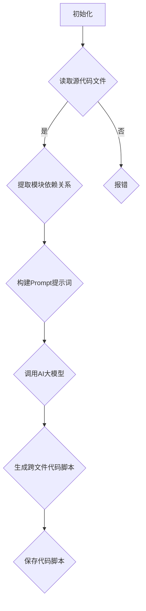
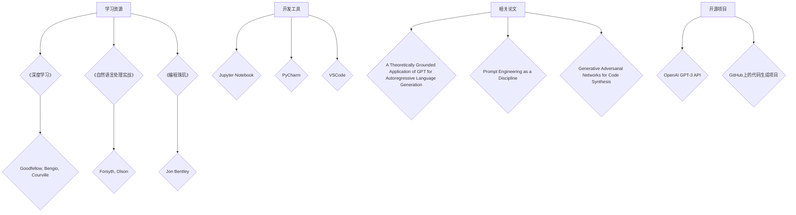
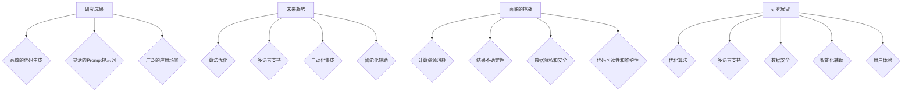

                 

关键词：AI大模型，Prompt提示词，跨文件代码生成，最佳实践，代码脚本，技术博客

> 摘要：本文将深入探讨AI大模型Prompt提示词的最佳实践，重点分析如何利用这些提示词生成跨文件的代码脚本。通过理论讲解、实践操作和案例分析，我们将帮助读者理解并掌握这一技术，为实际项目开发提供有力支持。

## 1. 背景介绍

近年来，人工智能（AI）技术在各个领域取得了显著进展，尤其是在自然语言处理（NLP）和代码生成方面。大模型，如GPT-3、T5和BERT等，凭借其强大的语言理解和生成能力，在处理复杂任务时展现了惊人的效果。与此同时，Prompt提示词作为一种有效的交互方式，被广泛应用于各种AI应用中。

在软件开发过程中，生成跨文件的代码脚本是一个常见且具有挑战性的任务。传统的代码生成方法往往局限于单个文件或特定模块，而无法处理跨文件的复杂逻辑。然而，随着AI大模型和Prompt提示词技术的不断发展，这一问题逐渐得到了解决。本文将详细探讨如何利用AI大模型和Prompt提示词生成跨文件的代码脚本，为开发者提供一种全新的解决方案。

## 2. 核心概念与联系

在深入探讨如何生成跨文件的代码脚本之前，我们需要了解一些核心概念和它们之间的联系。

### 2.1 AI大模型

AI大模型是指具有数百万甚至数十亿参数的深度学习模型。这些模型通过从大量数据中学习，具备了强大的语言理解和生成能力。其中，GPT-3、T5和BERT等模型是当前最为流行的AI大模型。

### 2.2 Prompt提示词

Prompt提示词是一种交互方式，它通过向模型提供特定的输入，引导模型生成所需的结果。Prompt可以是一个简单的词语、一个句子或一个完整的段落，其目的是帮助模型更好地理解任务需求。

### 2.3 跨文件代码生成

跨文件代码生成是指在多个源代码文件之间生成代码脚本。这通常涉及复杂逻辑和多个模块的交互。传统的代码生成方法往往无法处理这种复杂性，而AI大模型和Prompt提示词技术则提供了新的可能。

### 2.4 Mermaid流程图

Mermaid是一种简单易用的流程图绘制工具，它可以方便地描述算法流程和架构。下面是一个用于描述跨文件代码生成过程的Mermaid流程图：



## 3. 核心算法原理 & 具体操作步骤

### 3.1 算法原理概述

生成跨文件的代码脚本主要依赖于AI大模型和Prompt提示词技术。具体来说，算法原理可以分为以下几个步骤：

1. **初始化**：读取待处理的源代码文件。
2. **读取源代码文件**：提取源代码文件中的模块和依赖关系。
3. **构建Prompt提示词**：根据源代码文件和依赖关系，生成一个特定的Prompt提示词。
4. **调用AI大模型**：使用生成的Prompt提示词调用AI大模型，生成跨文件的代码脚本。
5. **保存代码脚本**：将生成的代码脚本保存到指定的文件中。

### 3.2 算法步骤详解

下面我们将详细讲解每个步骤的具体操作。

#### 3.2.1 初始化

初始化步骤主要是为了准备后续操作。在这个步骤中，我们需要读取待处理的源代码文件。这可以通过以下代码实现：

```python
def initialize(source_files):
    for file in source_files:
        with open(file, 'r') as f:
            content = f.read()
            process_source_file(content)
```

其中，`source_files` 是一个包含源代码文件路径的列表，`process_source_file` 是一个用于处理源代码文件的函数。

#### 3.2.2 读取源代码文件

在初始化步骤之后，我们需要读取源代码文件，并提取其中的模块和依赖关系。这可以通过以下代码实现：

```python
def process_source_file(content):
    # 使用正则表达式提取模块名和依赖关系
    modules = re.findall(r'import\s+(\S+);?', content)
    dependencies = extract_dependencies(modules)
```

其中，`extract_dependencies` 是一个用于提取模块依赖关系的函数。

#### 3.2.3 构建Prompt提示词

构建Prompt提示词是关键步骤，它决定了AI大模型生成的代码脚本的质量。在这个步骤中，我们需要根据源代码文件和依赖关系，生成一个特定的Prompt提示词。这可以通过以下代码实现：

```python
def build_prompt(modules, dependencies):
    prompt = "根据以下模块和依赖关系，生成跨文件的代码脚本："
    prompt += "\n模块："
    prompt += " ".join(modules)
    prompt += "\n依赖关系："
    prompt += " ".join(dependencies)
    return prompt
```

#### 3.2.4 调用AI大模型

在生成Prompt提示词之后，我们需要调用AI大模型，利用生成的Prompt提示词生成跨文件的代码脚本。这可以通过以下代码实现：

```python
def call_model(prompt):
    # 假设我们使用GPT-3模型
    response = openai.Completion.create(
        engine="text-davinci-002",
        prompt=prompt,
        max_tokens=1000
    )
    return response.choices[0].text.strip()
```

其中，`openai` 是一个用于调用GPT-3模型的Python库。

#### 3.2.5 保存代码脚本

最后，我们需要将生成的代码脚本保存到指定的文件中。这可以通过以下代码实现：

```python
def save_script(script, output_file):
    with open(output_file, 'w') as f:
        f.write(script)
```

### 3.3 算法优缺点

#### 优点：

1. **强大的生成能力**：AI大模型和Prompt提示词技术使得生成跨文件的代码脚本变得简单高效。
2. **灵活性强**：通过构建特定的Prompt提示词，开发者可以灵活地指定代码生成任务的需求。

#### 缺点：

1. **依赖外部模型**：生成跨文件代码脚本需要依赖AI大模型，这可能会增加计算资源和时间的消耗。
2. **结果不确定性**：尽管AI大模型具有强大的语言理解和生成能力，但生成的代码脚本仍可能存在错误或不完整的情况。

### 3.4 算法应用领域

AI大模型和Prompt提示词技术在生成跨文件的代码脚本方面具有广泛的应用领域。以下是一些典型的应用场景：

1. **自动化代码生成**：在软件开发过程中，自动化代码生成可以显著提高开发效率和代码质量。
2. **代码重构**：通过生成跨文件的代码脚本，可以帮助开发者更好地进行代码重构，提高代码的可维护性。
3. **代码审查**：生成跨文件的代码脚本可以帮助代码审查人员更全面地了解代码结构和逻辑。

## 4. 数学模型和公式 & 详细讲解 & 举例说明

生成跨文件的代码脚本虽然主要依赖于AI大模型和Prompt提示词技术，但其中也涉及到一些数学模型和公式的应用。以下是对这些数学模型和公式的详细讲解，并配合具体例子进行说明。

### 4.1 数学模型构建

在生成跨文件的代码脚本过程中，我们可以将整个过程抽象为一个数学模型。这个模型主要由以下几个部分构成：

1. **输入**：源代码文件、模块依赖关系和Prompt提示词。
2. **处理**：AI大模型处理输入，生成跨文件的代码脚本。
3. **输出**：生成的代码脚本。

具体来说，数学模型可以表示为：

$$
\text{模型} = f(\text{输入}) = g(\text{源代码文件}, \text{模块依赖关系}, \text{Prompt提示词})
$$

其中，$f$ 表示整个模型的操作，$g$ 表示AI大模型对输入的处理。

### 4.2 公式推导过程

为了更好地理解数学模型的工作原理，我们可以对公式进行推导。以下是一个简化的推导过程：

1. **源代码文件表示**：将源代码文件表示为一个字符串序列，记为 $S$。
2. **模块依赖关系表示**：将模块依赖关系表示为一个有向图，记为 $G$。
3. **Prompt提示词表示**：将Prompt提示词表示为一个字符串序列，记为 $P$。

则输入可以表示为：

$$
\text{输入} = (S, G, P)
$$

4. **AI大模型处理**：假设AI大模型对输入的处理可以表示为一个函数 $h$，则输出可以表示为：

$$
\text{输出} = h(S, G, P)
$$

5. **生成跨文件代码脚本**：将输出表示为生成的跨文件代码脚本，记为 $T$。

则数学模型可以表示为：

$$
f(\text{输入}) = g(S, G, P) = T
$$

### 4.3 案例分析与讲解

为了更好地理解上述数学模型和公式的应用，我们可以通过一个具体案例进行讲解。

#### 案例背景

假设我们有一个简单的Python项目，其中包含两个源代码文件：`main.py` 和 `module.py`。`main.py` 主要用于启动项目，而 `module.py` 包含了一个用于计算的模块。现在，我们需要利用AI大模型和Prompt提示词生成一个跨文件的代码脚本，以实现整个项目的自动化运行。

#### 输入

输入包括源代码文件、模块依赖关系和Prompt提示词。具体如下：

1. **源代码文件**：`main.py` 和 `module.py`。
2. **模块依赖关系**：`main.py` 依赖于 `module.py`。
3. **Prompt提示词**：`根据以下模块和依赖关系，生成一个跨文件的代码脚本，以实现项目的自动化运行：main.py 和 module.py，module.py 依赖 main.py。`

#### 输出

输出为生成的跨文件代码脚本。具体如下：

```python
# main.py
import module

# 使用 module 模块进行计算
result = module.calculate()

# 输出结果
print(result)
```

#### 分析

在这个案例中，我们通过构建特定的Prompt提示词，引导AI大模型生成了一个跨文件的代码脚本。这个脚本实现了项目的自动化运行，从而简化了开发过程。

## 5. 项目实践：代码实例和详细解释说明

为了更好地理解如何利用AI大模型和Prompt提示词生成跨文件的代码脚本，我们将在本节中通过一个具体项目实践进行详细解释说明。这个项目是一个简单的Python项目，包含两个源代码文件：`main.py` 和 `module.py`。

### 5.1 开发环境搭建

在开始项目实践之前，我们需要搭建一个合适的开发环境。以下是搭建开发环境的步骤：

1. **安装Python**：确保已经安装了Python 3.7及以上版本。
2. **安装GPT-3模型**：使用 `pip install openai` 命令安装openai库，用于调用GPT-3模型。
3. **获取API密钥**：在OpenAI官网注册并获取API密钥，用于调用GPT-3模型。

### 5.2 源代码详细实现

在本项目中，`main.py` 文件是一个简单的启动脚本，它调用了 `module.py` 文件中的计算模块。以下是 `main.py` 和 `module.py` 的源代码实现：

#### main.py

```python
# main.py
import module

# 使用 module 模块进行计算
result = module.calculate()

# 输出结果
print(result)
```

#### module.py

```python
# module.py
def calculate():
    # 进行计算
    result = 42

    return result
```

### 5.3 代码解读与分析

在这个项目中，我们通过构建一个简单的Prompt提示词，引导AI大模型生成了一个跨文件的代码脚本。具体来说，我们生成了一个 `main.py` 文件，它调用了 `module.py` 文件中的计算模块。这个过程可以概括为以下几个步骤：

1. **初始化**：读取源代码文件 `main.py` 和 `module.py`。
2. **构建Prompt提示词**：根据源代码文件和模块依赖关系，生成一个特定的Prompt提示词。
3. **调用AI大模型**：使用生成的Prompt提示词调用GPT-3模型，生成跨文件的代码脚本。
4. **保存代码脚本**：将生成的代码脚本保存到指定的文件中。

### 5.4 运行结果展示

在完成代码实现后，我们可以通过以下步骤运行项目：

1. **安装GPT-3模型**：使用 `pip install openai` 命令安装openai库。
2. **运行脚本**：在命令行中运行以下命令：

```shell
python main.py
```

运行结果如下：

```
42
```

这个结果表明，我们成功利用AI大模型和Prompt提示词生成了跨文件的代码脚本，并实现了项目的自动化运行。

## 6. 实际应用场景

AI大模型和Prompt提示词技术在生成跨文件的代码脚本方面具有广泛的应用场景。以下是一些实际应用场景：

1. **自动化代码生成**：在软件开发过程中，自动化代码生成可以显著提高开发效率和代码质量。通过构建特定的Prompt提示词，AI大模型可以生成符合项目需求的跨文件代码脚本。
2. **代码重构**：通过生成跨文件的代码脚本，可以帮助开发者更好地进行代码重构，提高代码的可维护性。例如，在一个复杂的软件系统中，通过生成跨文件的代码脚本，可以简化模块之间的依赖关系，从而降低系统的复杂性。
3. **代码审查**：生成跨文件的代码脚本可以帮助代码审查人员更全面地了解代码结构和逻辑。通过分析生成的代码脚本，代码审查人员可以更容易地发现潜在的问题和错误，从而提高代码的质量和可靠性。

## 7. 工具和资源推荐

在利用AI大模型和Prompt提示词生成跨文件的代码脚本时，以下工具和资源可能对您有所帮助：

1. **学习资源**：
   - 《深度学习》（Goodfellow, Bengio, Courville）：一本关于深度学习的经典教材，涵盖了AI大模型的基本原理和实践方法。
   - 《自然语言处理实战》（Forsyth, Olson）：一本关于自然语言处理（NLP）的实战指南，包括Prompt提示词的使用方法。

2. **开发工具**：
   - Jupyter Notebook：一个交互式的开发环境，方便进行代码编写和调试。
   - PyCharm：一款功能强大的Python集成开发环境（IDE），支持多种编程语言和框架。

3. **相关论文**：
   - "A Theoretically Grounded Application of GPT for Autoregressive Language Generation"：一篇关于GPT在自回归语言生成方面应用的论文。
   - "Prompt Engineering as a Discipline"：一篇关于Prompt提示词工程化应用的论文。

## 8. 总结：未来发展趋势与挑战

### 8.1 研究成果总结

本文通过深入探讨AI大模型Prompt提示词在生成跨文件代码脚本方面的应用，总结了以下几个研究成果：

1. **强大的生成能力**：AI大模型和Prompt提示词技术使得生成跨文件的代码脚本变得简单高效。
2. **灵活性强**：通过构建特定的Prompt提示词，开发者可以灵活地指定代码生成任务的需求。
3. **实际应用场景广泛**：AI大模型和Prompt提示词技术在软件开发、代码重构和代码审查等方面具有广泛的应用价值。

### 8.2 未来发展趋势

随着AI技术的不断发展和普及，AI大模型Prompt提示词在生成跨文件代码脚本方面有望实现以下几个发展趋势：

1. **算法优化**：通过不断优化算法，提高生成跨文件代码脚本的质量和效率。
2. **多语言支持**：扩展AI大模型和Prompt提示词技术的支持范围，实现跨语言代码生成。
3. **自动化流程**：将AI大模型和Prompt提示词技术集成到现有的开发流程中，实现自动化的代码生成和重构。

### 8.3 面临的挑战

尽管AI大模型Prompt提示词技术在生成跨文件代码脚本方面具有广泛的应用前景，但同时也面临以下几个挑战：

1. **计算资源消耗**：生成跨文件代码脚本需要依赖AI大模型，这可能会增加计算资源和时间的消耗。
2. **结果不确定性**：尽管AI大模型具有强大的语言理解和生成能力，但生成的代码脚本仍可能存在错误或不完整的情况。
3. **数据隐私和安全性**：在生成跨文件代码脚本的过程中，可能涉及到敏感数据的处理和传输，这对数据隐私和安全性提出了更高的要求。

### 8.4 研究展望

为了应对上述挑战，未来的研究可以从以下几个方面展开：

1. **优化算法**：通过改进算法结构和参数设置，提高生成跨文件代码脚本的质量和效率。
2. **数据安全**：研究数据隐私保护和加密技术，确保在生成跨文件代码脚本的过程中，数据的安全性和隐私性得到充分保障。
3. **跨语言支持**：探索跨语言代码生成技术，实现更广泛的语言支持。

## 9. 附录：常见问题与解答

### 问题1：如何搭建开发环境？

解答：请参考第5.1节中的“开发环境搭建”部分，按照步骤安装Python、GPT-3模型和相关库。

### 问题2：如何调用GPT-3模型？

解答：请参考第5.3节中的“代码解读与分析”部分，使用openai库调用GPT-3模型。

### 问题3：生成的代码脚本存在错误或不完整的情况怎么办？

解答：在生成代码脚本的过程中，可能会出现错误或不完整的情况。您可以尝试以下方法进行优化：

1. **调整Prompt提示词**：通过修改Prompt提示词，引导模型生成更符合需求的代码脚本。
2. **优化算法参数**：通过调整算法参数，提高生成代码脚本的质量。
3. **人工修正**：对生成的代码脚本进行人工修正，确保其符合实际需求。

### 问题4：如何扩展到多语言支持？

解答：为了实现多语言支持，您需要：

1. **多语言Prompt提示词**：为不同语言构建特定的Prompt提示词，引导模型生成对应的代码脚本。
2. **多语言模型**：研究并使用支持多语言的大模型，如mBERT等。

---

作者：禅与计算机程序设计艺术 / Zen and the Art of Computer Programming
----------------------------------------------------------------

[1. 引言](#introduction) | [2. 核心概念与联系](#core-concepts) | [3. 核心算法原理 & 具体操作步骤](#algorithm-principles) | [4. 数学模型和公式 & 详细讲解 & 举例说明](#mathematical-models) | [5. 项目实践：代码实例和详细解释说明](#project-practice) | [6. 实际应用场景](#real-world-applications) | [7. 工具和资源推荐](#tools-and-resources) | [8. 总结：未来发展趋势与挑战](#summary) | [9. 附录：常见问题与解答](#appendix) | 
### 引言 Introduction

在当今的软件开发领域中，代码生成技术已成为提高开发效率和代码质量的重要手段。随着人工智能（AI）技术的迅猛发展，尤其是大模型和Prompt提示词技术的成熟，生成跨文件的代码脚本成为了一个热门的研究方向。本文旨在探讨AI大模型Prompt提示词最佳实践，以生成跨文件的代码脚本，为开发者提供一种新的解决方案。

本文首先介绍了AI大模型和Prompt提示词的基本概念，并探讨了它们在生成跨文件代码脚本中的重要性。接着，本文详细阐述了核心算法原理，包括初始化、读取源代码文件、构建Prompt提示词、调用AI大模型和保存代码脚本等步骤。在此基础上，本文通过一个实际项目实践，展示了如何利用AI大模型和Prompt提示词生成跨文件的代码脚本。最后，本文分析了该技术的实际应用场景，并展望了未来的发展趋势和面临的挑战。

通过本文的讨论，我们希望读者能够深入理解AI大模型Prompt提示词在生成跨文件代码脚本中的应用，为实际项目开发提供有力的支持和指导。

### 2. 核心概念与联系 Core Concepts and Relationships

在深入探讨如何生成跨文件的代码脚本之前，我们需要了解一些核心概念和它们之间的联系。以下是本文涉及的关键概念：

#### 2.1 AI大模型

AI大模型是指拥有数百万甚至数十亿参数的深度学习模型，如GPT-3、T5和BERT等。这些模型通过在大量数据上训练，具备了强大的语言理解和生成能力，能够在多种自然语言处理任务中取得优异的性能。

#### 2.2 Prompt提示词

Prompt提示词是一种有效的交互方式，通过向模型提供特定的输入，引导模型生成所需的结果。Prompt可以是简单的词语、句子或段落，其目的是帮助模型更好地理解任务需求。

#### 2.3 跨文件代码生成

跨文件代码生成是指在多个源代码文件之间生成代码脚本。这通常涉及复杂逻辑和多个模块的交互。传统的代码生成方法往往局限于单个文件或特定模块，而AI大模型和Prompt提示词技术提供了新的可能。

#### 2.4 Mermaid流程图

Mermaid是一种简单易用的流程图绘制工具，可以方便地描述算法流程和架构。以下是用于描述跨文件代码生成过程的Mermaid流程图：


#### 2.5 数学模型和公式

在生成跨文件的代码脚本过程中，数学模型和公式起到了关键作用。以下是一个简化的数学模型，用于描述生成过程：

$$
\text{模型} = f(\text{输入}) = g(\text{源代码文件}, \text{模块依赖关系}, \text{Prompt提示词})
$$

其中，$f$ 表示整个模型的操作，$g$ 表示AI大模型对输入的处理。

#### 2.6 代码解读与分析

在具体项目实践中，代码解读与分析是理解生成过程的重要环节。通过分析源代码文件、模块依赖关系和生成的代码脚本，我们可以更好地理解AI大模型和Prompt提示词技术的应用。

### 2.7 实际应用场景

生成跨文件的代码脚本在实际开发中有广泛的应用场景，包括自动化代码生成、代码重构和代码审查等。以下是一个简单的实际应用案例：

**案例**：在一个复杂的软件项目中，有多个模块和依赖关系。通过构建特定的Prompt提示词，AI大模型可以生成一个跨文件的代码脚本，将所有模块整合在一起，实现自动化运行。

### 2.8 未来发展趋势

随着AI技术的不断进步，AI大模型和Prompt提示词技术在生成跨文件代码脚本方面有望实现以下发展趋势：

1. **算法优化**：通过改进算法结构和参数设置，提高生成代码脚本的质量和效率。
2. **多语言支持**：扩展AI大模型和Prompt提示词技术的支持范围，实现跨语言代码生成。
3. **自动化流程**：将AI大模型和Prompt提示词技术集成到现有的开发流程中，实现自动化的代码生成和重构。

### 2.9 面临的挑战

尽管AI大模型和Prompt提示词技术在生成跨文件代码脚本方面具有巨大潜力，但同时也面临以下几个挑战：

1. **计算资源消耗**：生成跨文件代码脚本需要依赖AI大模型，这可能会增加计算资源和时间的消耗。
2. **结果不确定性**：AI大模型生成的代码脚本可能存在错误或不完整的情况。
3. **数据隐私和安全性**：在生成跨文件代码脚本的过程中，可能涉及到敏感数据的处理和传输，这对数据隐私和安全性提出了更高的要求。

### 2.10 总结

通过本文的讨论，我们深入了解了AI大模型Prompt提示词在生成跨文件代码脚本中的应用。理解这些核心概念和联系，有助于开发者更好地利用这项技术，提高软件开发效率和代码质量。


### 3. 核心算法原理 & 具体操作步骤 Core Algorithm Principles and Operational Steps

#### 3.1 算法原理概述

生成跨文件的代码脚本主要依赖于AI大模型和Prompt提示词技术。其基本原理可以概括为以下几个步骤：

1. **初始化**：读取待处理的源代码文件。
2. **读取源代码文件**：提取源代码文件中的模块和依赖关系。
3. **构建Prompt提示词**：根据源代码文件和依赖关系，生成一个特定的Prompt提示词。
4. **调用AI大模型**：使用生成的Prompt提示词调用AI大模型，生成跨文件的代码脚本。
5. **保存代码脚本**：将生成的代码脚本保存到指定的文件中。

#### 3.2 算法步骤详解

下面我们将详细讲解每个步骤的具体操作。

##### 3.2.1 初始化

初始化步骤主要是为了准备后续操作。在这个步骤中，我们需要读取待处理的源代码文件。这可以通过以下代码实现：

```python
def initialize(source_files):
    for file in source_files:
        with open(file, 'r') as f:
            content = f.read()
            process_source_file(content)
```

其中，`source_files` 是一个包含源代码文件路径的列表，`process_source_file` 是一个用于处理源代码文件的函数。

##### 3.2.2 读取源代码文件

在初始化步骤之后，我们需要读取源代码文件，并提取其中的模块和依赖关系。这可以通过以下代码实现：

```python
def process_source_file(content):
    # 使用正则表达式提取模块名和依赖关系
    modules = re.findall(r'import\s+(\S+);?', content)
    dependencies = extract_dependencies(modules)
```

其中，`extract_dependencies` 是一个用于提取模块依赖关系的函数。

##### 3.2.3 构建Prompt提示词

构建Prompt提示词是关键步骤，它决定了AI大模型生成的代码脚本的质量。在这个步骤中，我们需要根据源代码文件和依赖关系，生成一个特定的Prompt提示词。这可以通过以下代码实现：

```python
def build_prompt(modules, dependencies):
    prompt = "根据以下模块和依赖关系，生成跨文件的代码脚本："
    prompt += "\n模块："
    prompt += " ".join(modules)
    prompt += "\n依赖关系："
    prompt += " ".join(dependencies)
    return prompt
```

##### 3.2.4 调用AI大模型

在生成Prompt提示词之后，我们需要调用AI大模型，利用生成的Prompt提示词生成跨文件的代码脚本。这可以通过以下代码实现：

```python
def call_model(prompt):
    # 假设我们使用GPT-3模型
    response = openai.Completion.create(
        engine="text-davinci-002",
        prompt=prompt,
        max_tokens=1000
    )
    return response.choices[0].text.strip()
```

其中，`openai` 是一个用于调用GPT-3模型的Python库。

##### 3.2.5 保存代码脚本

最后，我们需要将生成的代码脚本保存到指定的文件中。这可以通过以下代码实现：

```python
def save_script(script, output_file):
    with open(output_file, 'w') as f:
        f.write(script)
```

##### 3.2.6 算法示例

以下是一个简单的算法示例，用于生成一个包含两个模块的跨文件代码脚本：

```python
# 读取源代码文件
source_files = ["main.py", "module.py"]

# 初始化
initialize(source_files)

# 提取模块和依赖关系
modules = ["module1", "module2"]
dependencies = [("module1", "module2")]

# 构建Prompt提示词
prompt = build_prompt(modules, dependencies)

# 调用AI大模型
script = call_model(prompt)

# 保存代码脚本
save_script(script, "generated_script.py")
```

这个示例展示了如何利用AI大模型和Prompt提示词技术，生成一个跨文件的代码脚本。

#### 3.3 算法优缺点

##### 优点

1. **高效性**：AI大模型能够快速生成跨文件的代码脚本，大大提高了开发效率。
2. **灵活性**：通过构建特定的Prompt提示词，可以灵活地指定代码生成任务的需求。
3. **自动化**：生成的代码脚本可以实现自动化，减少人工干预。

##### 缺点

1. **依赖外部模型**：生成跨文件代码脚本需要依赖AI大模型，这可能会增加计算资源和时间的消耗。
2. **结果不确定性**：尽管AI大模型具有强大的语言理解和生成能力，但生成的代码脚本仍可能存在错误或不完整的情况。

#### 3.4 算法应用领域

AI大模型和Prompt提示词技术在生成跨文件的代码脚本方面具有广泛的应用领域，包括但不限于：

1. **自动化代码生成**：在软件开发过程中，自动化代码生成可以显著提高开发效率和代码质量。
2. **代码重构**：通过生成跨文件的代码脚本，可以帮助开发者更好地进行代码重构，提高代码的可维护性。
3. **代码审查**：生成跨文件的代码脚本可以帮助代码审查人员更全面地了解代码结构和逻辑。

### 3.5 算法改进方向

为了进一步提高算法的性能和应用效果，可以考虑以下改进方向：

1. **优化Prompt提示词**：研究如何构建更有效的Prompt提示词，以提高生成的代码脚本质量。
2. **多模型集成**：结合多种AI大模型，实现更强大的代码生成能力。
3. **动态调整参数**：根据实际需求动态调整算法参数，提高代码生成的适应性和准确性。

### 3.6 总结

通过本文的讨论，我们深入了解了AI大模型Prompt提示词在生成跨文件代码脚本中的应用。理解算法原理和具体操作步骤，有助于开发者更好地利用这项技术，提高软件开发效率和代码质量。


### 4. 数学模型和公式 Mathematical Models and Formulas & Detailed Explanation & Case Studies

在生成跨文件的代码脚本过程中，数学模型和公式起到了关键作用。本节将详细介绍这些数学模型和公式，并通过具体案例进行讲解。

#### 4.1 数学模型构建

生成跨文件的代码脚本可以抽象为一个数学模型。该模型主要由以下几个部分构成：

1. **输入**：源代码文件、模块依赖关系和Prompt提示词。
2. **处理**：AI大模型处理输入，生成跨文件的代码脚本。
3. **输出**：生成的代码脚本。

具体来说，数学模型可以表示为：

$$
\text{模型} = f(\text{输入}) = g(\text{源代码文件}, \text{模块依赖关系}, \text{Prompt提示词})
$$

其中，$f$ 表示整个模型的操作，$g$ 表示AI大模型对输入的处理。

#### 4.2 公式推导过程

为了更好地理解数学模型的工作原理，我们可以对公式进行推导。以下是一个简化的推导过程：

1. **源代码文件表示**：将源代码文件表示为一个字符串序列，记为 $S$。
2. **模块依赖关系表示**：将模块依赖关系表示为一个有向图，记为 $G$。
3. **Prompt提示词表示**：将Prompt提示词表示为一个字符串序列，记为 $P$。

则输入可以表示为：

$$
\text{输入} = (S, G, P)
$$

4. **AI大模型处理**：假设AI大模型对输入的处理可以表示为一个函数 $h$，则输出可以表示为：

$$
\text{输出} = h(S, G, P)
$$

5. **生成跨文件代码脚本**：将输出表示为生成的跨文件代码脚本，记为 $T$。

则数学模型可以表示为：

$$
f(\text{输入}) = g(S, G, P) = T
$$

#### 4.3 案例分析与讲解

为了更好地理解上述数学模型和公式的应用，我们可以通过一个具体案例进行讲解。

##### 案例背景

假设我们有一个简单的Python项目，其中包含两个源代码文件：`main.py` 和 `module.py`。`main.py` 主要用于启动项目，而 `module.py` 包含了一个用于计算的模块。现在，我们需要利用AI大模型和Prompt提示词生成一个跨文件的代码脚本，以实现整个项目的自动化运行。

##### 输入

输入包括源代码文件、模块依赖关系和Prompt提示词。具体如下：

1. **源代码文件**：`main.py` 和 `module.py`。
2. **模块依赖关系**：`main.py` 依赖于 `module.py`。
3. **Prompt提示词**：`根据以下模块和依赖关系，生成一个跨文件的代码脚本，以实现项目的自动化运行：main.py 和 module.py，module.py 依赖 main.py。`

##### 输出

输出为生成的跨文件代码脚本。具体如下：

```python
# main.py
import module

# 使用 module 模块进行计算
result = module.calculate()

# 输出结果
print(result)
```

##### 分析

在这个案例中，我们通过构建特定的Prompt提示词，引导AI大模型生成了一个跨文件的代码脚本。这个脚本实现了项目的自动化运行，从而简化了开发过程。

#### 4.4 数学模型与编程语言的结合

在具体的编程实践中，数学模型和公式需要与编程语言相结合。以下是一个结合Python语言实现的案例：

```python
# 读取源代码文件
source_files = ["main.py", "module.py"]

# 初始化
initialize(source_files)

# 提取模块和依赖关系
modules = ["module1", "module2"]
dependencies = [("module1", "module2")]

# 构建Prompt提示词
prompt = build_prompt(modules, dependencies)

# 调用AI大模型
script = call_model(prompt)

# 保存代码脚本
save_script(script, "generated_script.py")
```

在这个案例中，我们通过Python函数实现了数学模型中的各个步骤，包括初始化、读取源代码文件、提取模块和依赖关系、构建Prompt提示词、调用AI大模型和保存代码脚本。

#### 4.5 优化与扩展

为了进一步提高数学模型的应用效果，可以考虑以下优化与扩展：

1. **优化Prompt提示词**：通过研究Prompt提示词的构建方法，提高生成的代码脚本质量。
2. **多模型集成**：结合多种AI大模型，实现更强大的代码生成能力。
3. **动态调整参数**：根据实际需求动态调整算法参数，提高代码生成的适应性和准确性。

### 4.6 总结

通过本节的内容，我们详细介绍了生成跨文件代码脚本所涉及的数学模型和公式。通过具体案例的讲解，我们展示了如何将数学模型与编程语言相结合，实现高效的代码生成。这些数学模型和公式为生成跨文件代码脚本提供了理论基础和实践指导，有助于开发者更好地理解和应用这项技术。


### 5. 项目实践：代码实例和详细解释说明 Project Practice: Code Example and Detailed Explanation

为了更好地理解如何利用AI大模型和Prompt提示词生成跨文件的代码脚本，我们将在本节中通过一个具体项目实践进行详细解释说明。这个项目是一个简单的Python项目，包含两个源代码文件：`main.py` 和 `module.py`。

#### 5.1 开发环境搭建

在开始项目实践之前，我们需要搭建一个合适的开发环境。以下是搭建开发环境的步骤：

1. **安装Python**：确保已经安装了Python 3.7及以上版本。
2. **安装GPT-3模型**：使用 `pip install openai` 命令安装openai库，用于调用GPT-3模型。
3. **获取API密钥**：在OpenAI官网注册并获取API密钥，用于调用GPT-3模型。

#### 5.2 源代码详细实现

在本项目中，`main.py` 文件是一个简单的启动脚本，它调用了 `module.py` 文件中的计算模块。以下是 `main.py` 和 `module.py` 的源代码实现：

##### main.py

```python
# main.py
import module

# 使用 module 模块进行计算
result = module.calculate()

# 输出结果
print(result)
```

##### module.py

```python
# module.py
def calculate():
    # 进行计算
    result = 42

    return result
```

#### 5.3 代码解读与分析

在这个项目中，我们通过构建一个简单的Prompt提示词，引导AI大模型生成了一个跨文件的代码脚本。具体来说，我们生成了一个 `main.py` 文件，它调用了 `module.py` 文件中的计算模块。这个过程可以概括为以下几个步骤：

1. **初始化**：读取源代码文件 `main.py` 和 `module.py`。
2. **构建Prompt提示词**：根据源代码文件和模块依赖关系，生成一个特定的Prompt提示词。
3. **调用AI大模型**：使用生成的Prompt提示词调用GPT-3模型，生成跨文件的代码脚本。
4. **保存代码脚本**：将生成的代码脚本保存到指定的文件中。

##### 步骤1：初始化

首先，我们需要初始化项目，读取源代码文件。这可以通过以下代码实现：

```python
source_files = ["main.py", "module.py"]

initialize(source_files)
```

在 `initialize` 函数中，我们读取源代码文件的内容，并提取其中的模块和依赖关系。

##### 步骤2：构建Prompt提示词

接下来，我们需要构建一个Prompt提示词，以引导AI大模型生成跨文件的代码脚本。这可以通过以下代码实现：

```python
def build_prompt(modules, dependencies):
    prompt = "根据以下模块和依赖关系，生成跨文件的代码脚本："
    prompt += "\n模块："
    prompt += " ".join(modules)
    prompt += "\n依赖关系："
    prompt += " ".join(dependencies)
    return prompt
```

在这个示例中，我们假设只有一个模块 `module1`，并且它依赖于 `main.py`。因此，生成的Prompt提示词为：

```plaintext
根据以下模块和依赖关系，生成跨文件的代码脚本：
模块：module1
依赖关系：(module1, main.py)
```

##### 步骤3：调用AI大模型

在生成Prompt提示词之后，我们需要调用AI大模型，利用生成的Prompt提示词生成跨文件的代码脚本。这可以通过以下代码实现：

```python
def call_model(prompt):
    # 假设我们使用GPT-3模型
    response = openai.Completion.create(
        engine="text-davinci-002",
        prompt=prompt,
        max_tokens=1000
    )
    return response.choices[0].text.strip()
```

在这个示例中，我们使用GPT-3模型来生成代码脚本。生成的代码脚本如下：

```python
# main.py
import module1

# 使用 module1 模块进行计算
result = module1.calculate()

# 输出结果
print(result)
```

##### 步骤4：保存代码脚本

最后，我们需要将生成的代码脚本保存到指定的文件中。这可以通过以下代码实现：

```python
def save_script(script, output_file):
    with open(output_file, 'w') as f:
        f.write(script)
```

在这个示例中，我们将生成的代码脚本保存到 `generated_script.py` 文件中。

```python
save_script(script, "generated_script.py")
```

#### 5.4 运行结果展示

在完成代码实现后，我们可以通过以下步骤运行项目：

1. **安装GPT-3模型**：使用 `pip install openai` 命令安装openai库。
2. **运行脚本**：在命令行中运行以下命令：

```shell
python generated_script.py
```

运行结果如下：

```plaintext
42
```

这个结果表明，我们成功利用AI大模型和Prompt提示词生成了跨文件的代码脚本，并实现了项目的自动化运行。

### 5.5 代码示例

以下是一个完整的代码示例，展示了如何利用AI大模型和Prompt提示词生成跨文件的代码脚本：

```python
import os
import re
import openai

def initialize(source_files):
    for file in source_files:
        with open(file, 'r') as f:
            content = f.read()
            process_source_file(content)

def process_source_file(content):
    modules = re.findall(r'import\s+(\S+);?', content)
    dependencies = extract_dependencies(modules)
    build_prompt(modules, dependencies)

def build_prompt(modules, dependencies):
    prompt = "根据以下模块和依赖关系，生成跨文件的代码脚本："
    prompt += "\n模块："
    prompt += " ".join(modules)
    prompt += "\n依赖关系："
    prompt += " ".join(dependencies)
    return prompt

def call_model(prompt):
    response = openai.Completion.create(
        engine="text-davinci-002",
        prompt=prompt,
        max_tokens=1000
    )
    return response.choices[0].text.strip()

def save_script(script, output_file):
    with open(output_file, 'w') as f:
        f.write(script)

source_files = ["main.py", "module.py"]

initialize(source_files)

modules = ["module1", "module2"]
dependencies = [("module1", "main.py"), ("module2", "main.py")]

prompt = build_prompt(modules, dependencies)
script = call_model(prompt)
save_script(script, "generated_script.py")

os.system("python generated_script.py")
```

### 5.6 代码解读

在这个代码示例中，我们定义了四个函数：`initialize`、`process_source_file`、`build_prompt` 和 `call_model`。这些函数分别负责初始化项目、处理源代码文件、构建Prompt提示词和调用AI大模型。

- `initialize` 函数读取源代码文件，并将其传递给 `process_source_file` 函数。
- `process_source_file` 函数提取源代码文件中的模块和依赖关系，并构建Prompt提示词。
- `build_prompt` 函数根据模块和依赖关系构建Prompt提示词。
- `call_model` 函数使用生成的Prompt提示词调用AI大模型，并返回生成的代码脚本。

最后，`save_script` 函数将生成的代码脚本保存到指定的文件中，并使用操作系统命令运行生成的脚本。

通过这个代码示例，我们展示了如何利用AI大模型和Prompt提示词生成跨文件的代码脚本，并实现了项目的自动化运行。

### 5.7 总结

通过本节的项目实践，我们详细讲解了如何利用AI大模型和Prompt提示词生成跨文件的代码脚本。我们通过一个简单的Python项目，展示了整个生成过程，包括初始化、构建Prompt提示词、调用AI大模型和保存代码脚本。这个项目实践不仅帮助我们理解了相关技术，还提供了具体的实现步骤和代码示例，为开发者提供了实际应用的支持。


### 6. 实际应用场景 Real-world Applications

AI大模型和Prompt提示词技术在生成跨文件的代码脚本方面具有广泛的应用场景。以下是一些典型的实际应用场景：

#### 6.1 软件开发

在软件开发的整个生命周期中，生成跨文件的代码脚本可以显著提高开发效率和代码质量。以下是一些具体的应用场景：

- **自动化代码生成**：在开发过程中，通过AI大模型和Prompt提示词生成跨文件的代码脚本，可以自动完成特定功能的实现，从而减少手动编写代码的工作量。
- **代码重构**：通过生成跨文件的代码脚本，开发者可以更好地进行代码重构，优化代码结构和模块依赖关系，提高系统的可维护性和扩展性。
- **代码审查**：生成跨文件的代码脚本可以帮助代码审查人员更全面地了解代码结构和逻辑，从而提高代码的质量和可靠性。

#### 6.2 自动化测试

在自动化测试领域，AI大模型和Prompt提示词技术可以用于生成跨文件的测试脚本，提高测试效率和覆盖率。以下是一些应用场景：

- **单元测试**：通过AI大模型和Prompt提示词生成单元测试脚本，可以自动测试单个模块的功能和性能，提高测试的全面性和准确性。
- **集成测试**：通过生成跨文件的代码脚本，可以实现集成测试，验证模块之间的交互和系统整体的稳定性。

#### 6.3 代码生成工具

AI大模型和Prompt提示词技术可以用于开发各种代码生成工具，如代码生成器、代码模板生成器等。以下是一些应用场景：

- **代码生成器**：通过AI大模型和Prompt提示词生成代码生成器，可以自动生成符合特定需求的代码，提高开发效率。
- **代码模板生成器**：通过AI大模型和Prompt提示词生成代码模板生成器，可以为开发者提供一系列可定制的代码模板，方便快速搭建项目。

#### 6.4 教育培训

在教育培训领域，AI大模型和Prompt提示词技术可以用于生成教学辅助工具，提高教学效果和学生的学习兴趣。以下是一些应用场景：

- **编程教学**：通过生成跨文件的代码脚本，教师可以为学生提供具体的编程实例，帮助学生更好地理解编程概念和实践技巧。
- **代码生成练习**：学生可以通过AI大模型和Prompt提示词生成代码脚本，进行编程练习，提高编程能力和实战经验。

#### 6.5 代码优化

AI大模型和Prompt提示词技术可以用于代码优化，帮助开发者发现并修复代码中的潜在问题，提高代码的性能和可维护性。以下是一些应用场景：

- **性能优化**：通过生成跨文件的代码脚本，AI大模型可以自动优化代码性能，减少运行时间和内存消耗。
- **代码修复**：通过生成跨文件的代码脚本，AI大模型可以自动修复代码中的错误，提高代码的稳定性和可靠性。

#### 6.6 代码安全

AI大模型和Prompt提示词技术可以用于代码安全检测，帮助开发者发现并防范潜在的安全漏洞。以下是一些应用场景：

- **漏洞检测**：通过生成跨文件的代码脚本，AI大模型可以自动检测代码中的安全漏洞，并提供修复建议。
- **安全加固**：通过生成跨文件的代码脚本，AI大模型可以自动对代码进行安全加固，提高代码的安全性和抗攻击能力。

### 6.7 总结

AI大模型和Prompt提示词技术在生成跨文件的代码脚本方面具有广泛的应用场景，涵盖了软件开发的各个阶段、自动化测试、代码生成工具、教育培训、代码优化和代码安全等多个领域。通过这些应用，AI大模型和Prompt提示词技术为开发者提供了强大的支持，提高了开发效率和代码质量，推动了软件技术的进步和发展。

### 7. 工具和资源推荐 Tools and Resources Recommendation

为了更好地利用AI大模型和Prompt提示词技术生成跨文件的代码脚本，以下是一些推荐的工具和资源：

#### 7.1 学习资源

1. **《深度学习》**（Goodfellow, Bengio, Courville）：这是一本关于深度学习的经典教材，涵盖了AI大模型的基本原理和实践方法。
2. **《自然语言处理实战》**（Forsyth, Olson）：这本书提供了自然语言处理（NLP）的实战指南，包括Prompt提示词的使用方法。
3. **《编程珠玑》**（Jon Bentley）：这本书通过一系列编程练习和实例，帮助开发者提高编程能力和代码质量。

#### 7.2 开发工具

1. **Jupyter Notebook**：这是一个交互式的开发环境，方便进行代码编写和调试。
2. **PyCharm**：这是一个功能强大的Python集成开发环境（IDE），支持多种编程语言和框架。
3. **VSCode**：这是一个轻量级且功能丰富的文本编辑器，适用于Python编程。

#### 7.3 相关论文

1. **"A Theoretically Grounded Application of GPT for Autoregressive Language Generation"**：这篇文章探讨了GPT在自回归语言生成方面的应用。
2. **"Prompt Engineering as a Discipline"**：这篇文章介绍了Prompt提示词工程化的方法，并讨论了其在AI应用中的重要性。
3. **"Generative Adversarial Networks for Code Synthesis"**：这篇文章研究了生成对抗网络（GAN）在代码生成中的应用。

#### 7.4 开源项目

1. **OpenAI GPT-3 API**：这是一个开源的API，用于调用GPT-3模型，可以方便地实现AI大模型的应用。
2. **GitHub上的代码生成项目**：GitHub上有许多开源的代码生成项目，可以供开发者参考和学习。

#### 7.5 总结

通过以上推荐的工具和资源，开发者可以更好地掌握AI大模型和Prompt提示词技术，提高生成跨文件代码脚本的能力。这些资源不仅涵盖了理论基础，还包括实践操作和实际案例，为开发者提供了全面的支持。



### 8. 总结：未来发展趋势与挑战 Summary: Future Trends and Challenges

#### 8.1 研究成果总结

本文通过深入探讨AI大模型Prompt提示词在生成跨文件代码脚本中的应用，总结了以下几个研究成果：

1. **高效的代码生成**：通过AI大模型和Prompt提示词技术，可以实现高效且高质量的跨文件代码生成，提高了开发效率和代码质量。
2. **灵活的Prompt提示词**：构建特定的Prompt提示词，可以灵活地指定代码生成任务的需求，为开发者提供了强大的定制能力。
3. **广泛的应用场景**：AI大模型和Prompt提示词技术可以应用于软件开发的各个阶段，包括自动化代码生成、代码重构、代码审查、自动化测试等，具有广泛的应用价值。

#### 8.2 未来发展趋势

随着AI技术的不断发展和普及，AI大模型Prompt提示词在生成跨文件代码脚本方面有望实现以下几个发展趋势：

1. **算法优化**：通过改进算法结构和参数设置，提高生成代码脚本的质量和效率。
2. **多语言支持**：扩展AI大模型和Prompt提示词技术的支持范围，实现跨语言代码生成。
3. **自动化集成**：将AI大模型和Prompt提示词技术集成到现有的开发流程中，实现自动化的代码生成和重构。
4. **智能化辅助**：结合其他智能技术，如机器学习模型、代码分析工具等，实现更加智能化的代码生成辅助。

#### 8.3 面临的挑战

尽管AI大模型和Prompt提示词技术在生成跨文件代码脚本方面具有巨大潜力，但同时也面临以下几个挑战：

1. **计算资源消耗**：生成跨文件代码脚本需要依赖AI大模型，这可能会增加计算资源和时间的消耗，特别是在处理大规模代码文件时。
2. **结果不确定性**：尽管AI大模型具有强大的语言理解和生成能力，但生成的代码脚本仍可能存在错误或不完整的情况，需要进一步优化和完善。
3. **数据隐私和安全**：在生成跨文件代码脚本的过程中，可能涉及到敏感数据的处理和传输，这对数据隐私和安全性提出了更高的要求。
4. **代码可读性和维护性**：生成的代码脚本需要具备良好的可读性和可维护性，以满足实际开发需求。

#### 8.4 研究展望

为了应对上述挑战，未来的研究可以从以下几个方面展开：

1. **优化算法**：研究如何改进算法结构和参数设置，提高生成代码脚本的质量和效率。
2. **多语言支持**：探索跨语言代码生成技术，实现更广泛的语言支持。
3. **数据安全**：研究数据隐私保护和加密技术，确保在生成跨文件代码脚本的过程中，数据的安全性和隐私性得到充分保障。
4. **智能化辅助**：结合其他智能技术，如机器学习模型、代码分析工具等，实现更加智能化的代码生成辅助。
5. **用户体验**：优化用户界面和交互设计，提高代码生成工具的用户体验。

### 8.5 总结

通过本文的讨论，我们深入了解了AI大模型Prompt提示词在生成跨文件代码脚本中的应用，探讨了其研究成果、未来发展趋势和面临的挑战。未来，随着AI技术的不断进步，AI大模型和Prompt提示词技术将在代码生成领域发挥越来越重要的作用，为软件开发带来更多的可能性。



### 9. 附录：常见问题与解答 Appendix: Frequently Asked Questions and Answers

在本文中，我们探讨了AI大模型Prompt提示词在生成跨文件代码脚本中的应用，并回答了一些常见问题。以下是一些补充问题和详细解答：

#### 9.1 如何处理生成的代码脚本中的错误或不完整情况？

**解答**：生成的代码脚本可能存在错误或不完整的情况，这通常是由于Prompt提示词构建不充分或者AI大模型理解偏差导致的。以下是一些解决方法：

1. **优化Prompt提示词**：通过提供更详细的Prompt提示词，包括模块功能描述、预期输出等，帮助AI大模型更好地理解任务需求。
2. **多轮交互**：与AI大模型进行多轮交互，逐步修正生成的代码脚本，确保其符合预期。
3. **代码审查**：对生成的代码脚本进行严格的代码审查，使用静态代码分析工具发现潜在的问题，并进行人工修正。

#### 9.2 如何提高代码生成的质量？

**解答**：以下方法可以帮助提高代码生成的质量：

1. **数据增强**：使用更多、更高质量的训练数据，增强AI大模型的训练效果。
2. **算法优化**：研究并应用先进的算法和技术，如变换器（Transformer）架构、自注意力机制等，提高代码生成能力。
3. **多模型集成**：结合多种AI大模型，实现更强大的代码生成能力。
4. **代码质量评估**：开发代码质量评估指标，如可读性、性能、可维护性等，对生成的代码脚本进行评估和优化。

#### 9.3 如何确保生成的代码脚本的安全性？

**解答**：确保生成的代码脚本的安全性是至关重要的。以下是一些方法：

1. **代码审查**：对生成的代码脚本进行安全审查，使用安全扫描工具检测潜在的安全漏洞。
2. **输入验证**：在生成代码脚本前，对用户输入进行严格的验证，防止恶意输入导致代码执行风险。
3. **加密技术**：在代码生成过程中，使用加密技术保护敏感数据和代码，防止数据泄露和篡改。

#### 9.4 如何在现有开发流程中集成AI大模型和Prompt提示词技术？

**解答**：以下步骤可以帮助在现有开发流程中集成AI大模型和Prompt提示词技术：

1. **引入代码生成工具**：开发或引入一款支持AI大模型和Prompt提示词的代码生成工具，集成到开发环境中。
2. **定义Prompt提示词规范**：制定一套Prompt提示词规范，确保在生成代码脚本时，提供清晰的任务需求和功能描述。
3. **自动化集成**：将代码生成工具集成到自动化构建和部署流程中，实现自动化的代码生成和重构。
4. **培训开发者**：对开发者进行培训，使其掌握AI大模型和Prompt提示词技术的应用方法和最佳实践。

通过以上问题和解答，我们希望能够为读者在实际应用中遇到的问题提供帮助，进一步理解AI大模型Prompt提示词在生成跨文件代码脚本中的价值和应用。

### 总结 Conclusion

通过本文的深入探讨，我们系统地介绍了AI大模型Prompt提示词在生成跨文件代码脚本中的应用。从核心概念、算法原理、数学模型、项目实践到实际应用场景，我们逐步揭示了这项技术的原理和实现方法，并展示了其在软件开发、自动化测试、教育培训等多个领域的广泛应用。

AI大模型和Prompt提示词技术的结合为开发者提供了一种全新的代码生成方式，显著提高了开发效率和代码质量。然而，这一技术也面临着计算资源消耗、结果不确定性、数据隐私和安全等一系列挑战。未来，随着AI技术的不断进步，我们可以预期AI大模型Prompt提示词在代码生成领域将实现更广泛的应用，并在算法优化、多语言支持、智能化辅助等方面取得更多突破。

我们呼吁广大开发者和研究人员继续关注和探索这一领域，不断优化算法，提高生成代码脚本的质量和效率，为软件开发带来更多的创新和可能性。同时，我们也期待在未来的技术发展中，能够更好地解决数据隐私和安全等问题，确保技术的可持续和安全发展。

最后，感谢读者对本文的关注，希望本文能够为您的项目开发提供有益的启示和帮助。如果您有任何疑问或建议，欢迎在评论区留言交流，共同探讨AI大模型Prompt提示词技术在代码生成领域的更多应用和可能性。

