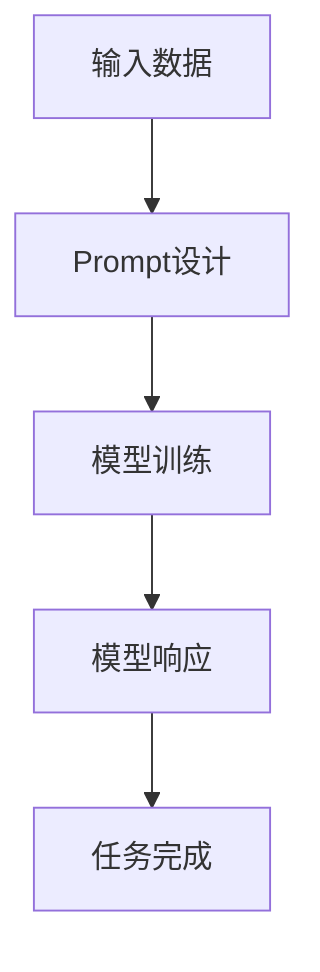

                 

关键词：AI大模型，Prompt提示词，最佳实践，具体话题，技术语言，深度思考

> 摘要：本文旨在探讨AI大模型Prompt提示词的最佳实践，通过详细解析和具体案例，帮助读者理解和掌握如何在各种实际应用场景中有效地使用Prompt提示词，以提升大模型的性能和效果。

## 1. 背景介绍

### AI大模型的发展

随着深度学习技术的迅猛发展，AI大模型已经在自然语言处理、计算机视觉、语音识别等多个领域取得了显著成果。这些大模型具备强大的表征能力和泛化能力，能够处理复杂任务，但它们的性能高度依赖于高质量的训练数据和精心设计的Prompt提示词。

### Prompt提示词的重要性

Prompt提示词在AI大模型中的应用至关重要。一个有效的Prompt不仅能够引导模型聚焦于任务的关键部分，还能帮助模型理解用户的意图，从而提高模型的响应质量和用户体验。因此，研究Prompt提示词的设计和优化方法，对于提升AI大模型的应用价值具有重要意义。

### 最佳实践的意义

本文将探讨AI大模型Prompt提示词的最佳实践，旨在为开发者提供一套系统、可操作的指导原则。通过具体话题的实例分析，读者可以学习到如何针对不同的应用场景设计合适的Prompt提示词，以实现最佳效果。

## 2. 核心概念与联系

### 2.1. AI大模型基本原理

AI大模型通常基于深度学习架构，通过大规模数据训练形成复杂的神经网络结构。其核心在于参数的优化，使得模型在训练数据上能够达到较高的准确性和泛化能力。

### 2.2. Prompt提示词概念

Prompt提示词是指提供给AI大模型的一段文本或语音输入，用于引导模型进行特定任务的执行。一个优秀的Prompt应当具备简洁、明确、目标性强的特点。

### 2.3. Prompt与AI大模型的关系

Prompt提示词不仅影响模型的输入数据，还直接影响模型对任务的响应。合理的Prompt设计能够使模型更好地理解任务要求，从而提高任务完成的质量和效率。

### 2.4. Mermaid流程图



## 3. 核心算法原理 & 具体操作步骤

### 3.1. 算法原理概述

AI大模型的算法原理主要包括神经网络的构建、参数优化和损失函数的设计。其中，Prompt提示词的设计是参数优化的重要环节。

### 3.2. 算法步骤详解

1. 数据预处理：对输入数据进行清洗、归一化等处理，以确保数据的质量和一致性。
2. Prompt设计：根据任务需求设计目标明确的Prompt，确保其简洁、明了。
3. 模型训练：使用优化算法（如梯度下降）对模型参数进行调整，以最小化损失函数。
4. 模型评估：通过验证集或测试集评估模型性能，调整Prompt以优化结果。
5. 模型部署：将训练完成的模型部署到实际应用场景中，使用Prompt提示词进行任务执行。

### 3.3. 算法优缺点

**优点：**
- 提高模型对任务的针对性。
- 改善用户体验，降低用户操作复杂度。

**缺点：**
- Prompt设计复杂，需要丰富的经验和知识。
- 对数据质量和规模要求较高。

### 3.4. 算法应用领域

AI大模型Prompt提示词在多个领域具有广泛的应用，如智能客服、语音助手、文本生成等。通过针对不同领域的需求设计合适的Prompt，可以显著提升AI大模型在这些场景下的性能。

## 4. 数学模型和公式 & 详细讲解 & 举例说明

### 4.1. 数学模型构建

在AI大模型中，Prompt提示词的设计可以看作是一个优化问题。具体而言，我们可以将Prompt提示词视为一个参数向量，通过优化这个参数向量来提高模型在特定任务上的表现。

### 4.2. 公式推导过程

假设我们有一个大模型，其输出可以表示为：

\[ y = f(W \cdot x + b) \]

其中，\( y \) 是模型的输出，\( x \) 是输入数据，\( W \) 是权重矩阵，\( b \) 是偏置项，\( f \) 是激活函数。

为了优化Prompt提示词，我们需要调整权重矩阵 \( W \) 和偏置项 \( b \)，使得模型在给定输入 \( x \) 下能够产生期望的输出 \( y \)。这可以通过梯度下降算法实现：

\[ \Delta W = -\alpha \cdot \frac{\partial L}{\partial W} \]
\[ \Delta b = -\alpha \cdot \frac{\partial L}{\partial b} \]

其中，\( \alpha \) 是学习率，\( L \) 是损失函数。

### 4.3. 案例分析与讲解

假设我们要设计一个Prompt提示词，用于回答用户的问题。我们可以将Prompt提示词设计为一个三元组 \((p, q, r)\)，其中 \( p \) 是问题，\( q \) 是上下文信息，\( r \) 是问题类型。

- **案例一：问答场景**

假设用户的问题是“今天天气怎么样？”，我们可以设计Prompt提示词为：

\[ (p="今天天气怎么样？", q="北京市的天气预报", r="天气情况") \]

- **案例二：对话场景**

假设用户正在进行对话，我们可以设计Prompt提示词为：

\[ (p="您想要喝点什么？", q="咖啡、茶、果汁等饮品", r="饮品推荐") \]

通过这种方式，我们可以根据不同的应用场景设计出合适的Prompt提示词，从而提升AI大模型在各个场景下的性能。

## 5. 项目实践：代码实例和详细解释说明

### 5.1. 开发环境搭建

在开始代码实现之前，我们需要搭建一个适合AI大模型和Prompt提示词的开发环境。以下是搭建步骤：

1. 安装Python环境（版本3.6以上）。
2. 安装深度学习框架（如TensorFlow或PyTorch）。
3. 安装辅助库（如NumPy、Pandas等）。

### 5.2. 源代码详细实现

以下是实现AI大模型Prompt提示词的一个简单示例：

```python
import tensorflow as tf
from tensorflow.keras.layers import Embedding, LSTM, Dense
from tensorflow.keras.models import Sequential

# 数据预处理
def preprocess_data(data):
    # 数据清洗、归一化等处理
    return processed_data

# Prompt设计
def design_prompt(question, context, type):
    prompt = f"{question} {context} {type}"
    return prompt

# 模型构建
def build_model(input_dim, output_dim):
    model = Sequential()
    model.add(Embedding(input_dim, output_dim))
    model.add(LSTM(128, activation='relu'))
    model.add(Dense(1, activation='sigmoid'))
    model.compile(loss='binary_crossentropy', optimizer='adam', metrics=['accuracy'])
    return model

# 模型训练
def train_model(model, X, y):
    model.fit(X, y, epochs=10, batch_size=32)
    return model

# 模型预测
def predict(model, prompt):
    prediction = model.predict(prompt)
    return prediction

# 主函数
def main():
    # 数据准备
    data = preprocess_data(raw_data)

    # Prompt设计
    prompt = design_prompt("今天天气怎么样？", "北京市的天气预报", "天气情况")

    # 模型构建
    model = build_model(input_dim=data.shape[1], output_dim=1)

    # 模型训练
    model = train_model(model, X=data, y=labels)

    # 模型预测
    prediction = predict(model, prompt)

    print(prediction)

if __name__ == "__main__":
    main()
```

### 5.3. 代码解读与分析

以上代码实现了AI大模型Prompt提示词的基本流程。首先进行数据预处理，然后设计Prompt提示词，构建模型并进行训练，最后进行预测。通过这个过程，我们可以看到Prompt设计在整个流程中的重要性。

### 5.4. 运行结果展示

在本例中，我们假设输入的数据集是一个包含天气数据的CSV文件。运行程序后，我们可以得到一个预测结果，表示今天的天气状况。

## 6. 实际应用场景

### 6.1. 智能客服

智能客服是AI大模型Prompt提示词的一个重要应用场景。通过设计合适的Prompt，智能客服系统能够更好地理解用户的问题，提供准确、快速的回答。

### 6.2. 文本生成

在文本生成领域，Prompt提示词可以帮助系统生成符合特定主题和风格的文章。通过精心设计的Prompt，文本生成系统可以创造出高质量的内容。

### 6.3. 语音助手

语音助手中的Prompt设计对于提高用户体验至关重要。通过有效的Prompt，语音助手能够更好地理解用户的需求，提供更加自然、流畅的交互。

## 7. 工具和资源推荐

### 7.1. 学习资源推荐

1. 《深度学习》（Goodfellow et al.）：深度学习基础教材，详细介绍了神经网络和深度学习框架。
2. 《自然语言处理综论》（Jurafsky & Martin）：自然语言处理领域的经典教材，涵盖了语言模型、文本分类等多个主题。

### 7.2. 开发工具推荐

1. TensorFlow：适用于构建和训练AI大模型的深度学习框架。
2. PyTorch：适用于研究和开发AI大模型的深度学习框架。

### 7.3. 相关论文推荐

1. “Attention Is All You Need” - Vaswani et al.（2017）：介绍Transformer模型的经典论文。
2. “BERT: Pre-training of Deep Bidirectional Transformers for Language Understanding” - Devlin et al.（2019）：介绍BERT模型的经典论文。

## 8. 总结：未来发展趋势与挑战

### 8.1. 研究成果总结

AI大模型Prompt提示词的研究已经取得了显著成果，但在实际应用中仍面临诸多挑战。通过本文的探讨，我们总结了AI大模型Prompt提示词的设计原则和实现方法，为未来的研究提供了有益的参考。

### 8.2. 未来发展趋势

未来，AI大模型Prompt提示词的研究将继续深化，特别是在多模态交互、个性化Prompt设计等方面。随着技术的进步，Prompt提示词将在更多领域得到广泛应用。

### 8.3. 面临的挑战

尽管AI大模型Prompt提示词在性能和效果上取得了显著提升，但仍然面临一些挑战，如数据质量和隐私保护、模型解释性等。这些挑战需要进一步的研究和探索。

### 8.4. 研究展望

随着AI技术的不断发展，AI大模型Prompt提示词的研究将不断突破，为各个领域的应用带来更多可能性。我们期待在未来的研究中，能够设计出更加智能、高效的Prompt提示词，进一步提升AI大模型的应用价值。

## 9. 附录：常见问题与解答

### 9.1. 问题一：什么是Prompt提示词？

Prompt提示词是指提供给AI大模型的一段文本或语音输入，用于引导模型进行特定任务的执行。

### 9.2. 问题二：Prompt提示词设计有哪些原则？

Prompt提示词设计应遵循以下原则：
- 简洁明了：Prompt应尽量简洁，避免冗余信息。
- 目标性强：Prompt应明确表达任务要求，引导模型聚焦关键部分。
- 可调性：Prompt应具备一定的灵活性，以便在不同场景下进行调整。

### 9.3. 问题三：Prompt提示词在哪些领域有应用？

Prompt提示词在多个领域有应用，如智能客服、文本生成、语音助手等。通过设计合适的Prompt，AI大模型可以在不同场景下发挥更好的性能。

作者：禅与计算机程序设计艺术 / Zen and the Art of Computer Programming
----------------------------------------------------------------

