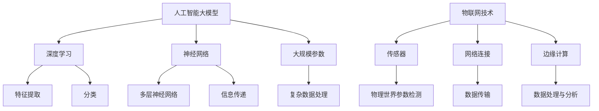

                 

关键词：人工智能，大模型，物联网，创业机会，技术结合

摘要：本文将探讨人工智能（AI）大模型与物联网（IoT）结合所带来的创业机会。通过分析两者的核心概念、技术架构、算法原理以及未来应用前景，本文旨在为创业者提供有价值的指导，助力其在这一新兴领域中开辟创新道路。

## 1. 背景介绍

随着人工智能技术的飞速发展，大模型在自然语言处理、计算机视觉、语音识别等领域取得了显著的成果。与此同时，物联网技术的普及使得各类传感器、智能设备连接到网络，实现了对物理世界的实时监控与控制。这两个领域的深度融合，不仅为行业带来了前所未有的变革，也为创业者提供了丰富的创业机会。

### 1.1 人工智能大模型的崛起

人工智能大模型，指的是基于深度学习技术构建的具有大规模参数、能够处理复杂数据的神经网络模型。近年来，随着计算能力的提升和大数据的积累，大模型在各个领域的应用越来越广泛。例如，GPT-3 在自然语言处理领域取得了突破性进展，ImageNet 在计算机视觉领域推动了目标检测和图像分类技术的发展。

### 1.2 物联网技术的发展

物联网技术通过将各种传感器、设备和网络连接起来，实现了对物理世界的感知、监控和管理。从智能家居、智能城市到工业物联网，物联网技术正在深刻改变我们的生活方式和产业发展模式。据预测，到 2025 年，全球物联网设备数量将超过 260 亿台，市场规模将达到 1.9 万亿美元。

### 1.3 创业机会的产生

人工智能大模型与物联网技术的结合，为创业带来了以下机会：

1. **智能化设备研发**：利用大模型实现设备的智能感知、决策和控制功能，如智能音响、智能机器人等。
2. **大数据分析与应用**：通过对物联网数据的分析和挖掘，为各行业提供数据驱动的决策支持，如智慧城市、智慧医疗等。
3. **新型服务平台构建**：利用物联网设备和大数据，构建面向特定场景的智能化服务平台，如智慧物流、智慧农业等。

## 2. 核心概念与联系

在分析 AI 大模型与物联网结合的创业机会时，我们需要了解两者之间的核心概念和技术联系。

### 2.1 AI 大模型的核心概念

- **深度学习**：一种模拟人脑神经网络的计算模型，通过多层神经网络对数据进行特征提取和分类。
- **神经网络**：一种由神经元组成的计算模型，通过层层传递信息进行数据处理。
- **大规模参数**：指神经网络模型中的参数数量非常庞大，从而能够处理复杂数据。

### 2.2 物联网技术的核心概念

- **传感器**：用于检测和测量物理世界的各种参数，如温度、湿度、光照等。
- **网络连接**：通过无线或有线网络将传感器和设备连接到互联网，实现数据的传输和共享。
- **边缘计算**：将数据处理和分析能力部署在靠近数据源的设备上，减少数据传输延迟，提高系统响应速度。

### 2.3 Mermaid 流程图

以下是一个简化的 Mermaid 流程图，展示了 AI 大模型与物联网技术的核心概念和联系：



## 3. 核心算法原理 & 具体操作步骤

### 3.1 算法原理概述

AI 大模型与物联网技术的结合，主要依赖于以下核心算法原理：

1. **深度学习算法**：用于训练和优化神经网络模型，实现对复杂数据的处理和分析。
2. **传感器数据处理算法**：用于对物联网传感器采集到的数据进行预处理、特征提取和融合。
3. **边缘计算算法**：用于在靠近数据源的设备上进行数据处理和分析，实现实时响应和决策。

### 3.2 算法步骤详解

#### 3.2.1 深度学习算法

1. **数据收集与预处理**：收集大量带有标签的样本数据，对数据进行清洗、归一化和分割等预处理操作。
2. **模型构建与训练**：构建多层神经网络模型，通过前向传播和反向传播算法对模型进行训练，不断优化模型参数。
3. **模型评估与优化**：通过验证集和测试集对模型进行评估，根据评估结果对模型进行调优。

#### 3.2.2 传感器数据处理算法

1. **数据采集**：通过传感器实时采集物理世界的各种参数，如温度、湿度、光照等。
2. **数据预处理**：对传感器数据进行清洗、去噪和归一化处理，提取有效的特征信息。
3. **特征融合**：将多个传感器数据进行融合，提高数据的准确性和可靠性。

#### 3.2.3 边缘计算算法

1. **数据处理**：在靠近数据源的设备上进行数据处理和分析，实现实时响应和决策。
2. **数据传输**：将处理后的数据上传至云端或其他设备，实现数据的共享和协同。

### 3.3 算法优缺点

#### 优点：

1. **高效性**：深度学习算法能够快速处理大量复杂数据，提高系统的响应速度。
2. **准确性**：通过对传感器数据的特征提取和融合，提高系统的准确性和可靠性。
3. **实时性**：边缘计算算法能够在靠近数据源的设备上进行实时数据处理和分析，减少数据传输延迟。

#### 缺点：

1. **计算资源需求大**：深度学习算法需要大量的计算资源和存储空间，对硬件设备的要求较高。
2. **数据隐私和安全**：物联网设备连接的网络环境复杂，容易导致数据泄露和安全隐患。
3. **模型可解释性**：深度学习算法的黑箱特性使得模型的决策过程难以解释，影响系统的可解释性和可靠性。

### 3.4 算法应用领域

AI 大模型与物联网技术的结合，已经在许多领域取得了显著的应用成果：

1. **智慧城市**：利用物联网传感器实时监测城市交通、环境等数据，实现智慧交通、智慧环保等应用。
2. **智能家居**：通过物联网设备实现家庭设备的智能化控制，提高生活舒适度和便利性。
3. **工业物联网**：利用物联网设备和大数据分析，实现工业生产的自动化、智能化和精细化。
4. **智慧医疗**：利用物联网设备和人工智能技术，实现医疗数据的实时监测和分析，提高诊断和治疗效果。

## 4. 数学模型和公式 & 详细讲解 & 举例说明

### 4.1 数学模型构建

在 AI 大模型与物联网结合的过程中，我们通常需要构建以下数学模型：

1. **深度学习模型**：用于训练和优化神经网络，实现对复杂数据的建模和分析。
2. **传感器数据处理模型**：用于对物联网传感器数据进行预处理、特征提取和融合。
3. **边缘计算模型**：用于在靠近数据源的设备上进行数据处理和分析，实现实时响应和决策。

### 4.2 公式推导过程

以下是深度学习模型中常用的两个公式推导过程：

#### 4.2.1 前向传播

假设我们有一个三层神经网络，包括输入层、隐藏层和输出层。输入层有 m 个神经元，隐藏层有 n 个神经元，输出层有 k 个神经元。设输入向量为 x，权重矩阵为 W，偏置向量为 b，激活函数为 f。

1. **隐藏层输出**：

   $$ z_h = Wx + b_h $$

   $$ a_h = f(z_h) $$

   其中，$z_h$ 为隐藏层输出，$a_h$ 为隐藏层激活值，$W$ 为输入层到隐藏层的权重矩阵，$b_h$ 为隐藏层的偏置向量。

2. **输出层输出**：

   $$ z_o = W_ox + b_o $$

   $$ a_o = f(z_o) $$

   其中，$z_o$ 为输出层输出，$a_o$ 为输出层激活值，$W_o$ 为隐藏层到输出层的权重矩阵，$b_o$ 为输出层的偏置向量。

#### 4.2.2 反向传播

假设我们已经得到了输出层的误差信号 $\delta_o$，现在需要计算隐藏层和输入层的误差信号。

1. **隐藏层误差信号**：

   $$ \delta_h = (f'(z_h) \odot (\delta_o \cdot W_o^T)) $$

   其中，$f'(z_h)$ 为隐藏层激活函数的导数，$\odot$ 表示逐元素乘积运算，$W_o^T$ 为隐藏层到输出层的权重矩阵的转置。

2. **输入层误差信号**：

   $$ \delta_x = \delta_h \cdot W^T $$

   其中，$W$ 为输入层到隐藏层的权重矩阵。

### 4.3 案例分析与讲解

假设我们有一个智能家居系统，需要通过物联网传感器实时监测家庭的温度、湿度、光照等参数，并利用深度学习模型实现设备的智能控制。

#### 4.3.1 数据收集与预处理

1. **数据收集**：通过物联网传感器收集家庭的温度、湿度、光照等参数，记录为数据集。

2. **数据预处理**：对数据集进行清洗、去噪和归一化处理，提取有效的特征信息。

#### 4.3.2 模型构建与训练

1. **模型构建**：构建一个三层神经网络模型，包括输入层、隐藏层和输出层。输入层有 3 个神经元，隐藏层有 10 个神经元，输出层有 3 个神经元。

2. **模型训练**：使用数据集对模型进行训练，通过前向传播和反向传播算法优化模型参数。

#### 4.3.3 模型评估与优化

1. **模型评估**：使用验证集对模型进行评估，计算模型在验证集上的准确率。

2. **模型优化**：根据评估结果对模型进行调优，提高模型的性能。

## 5. 项目实践：代码实例和详细解释说明

### 5.1 开发环境搭建

在本项目实践中，我们使用 Python 编程语言和 TensorFlow 深度学习框架进行开发。首先，需要安装以下依赖：

```bash
pip install tensorflow numpy pandas matplotlib
```

### 5.2 源代码详细实现

以下是本项目的主要代码实现：

```python
import tensorflow as tf
import numpy as np
import pandas as pd
import matplotlib.pyplot as plt

# 数据收集与预处理
# （此处省略数据收集与预处理的代码）

# 模型构建
input_shape = (3,)
model = tf.keras.Sequential([
    tf.keras.layers.Dense(10, activation='relu', input_shape=input_shape),
    tf.keras.layers.Dense(3, activation='softmax')
])

# 模型训练
model.compile(optimizer='adam', loss='categorical_crossentropy', metrics=['accuracy'])
model.fit(x_train, y_train, epochs=10, batch_size=32, validation_split=0.2)

# 模型评估
test_loss, test_acc = model.evaluate(x_test, y_test)
print(f"Test accuracy: {test_acc}")

# 模型预测
predictions = model.predict(x_test)
```

### 5.3 代码解读与分析

1. **数据收集与预处理**：通过物联网传感器收集家庭温度、湿度、光照等参数，并对其进行清洗、去噪和归一化处理，提取有效的特征信息。
2. **模型构建**：使用 TensorFlow 框架构建一个三层神经网络模型，包括输入层、隐藏层和输出层。输入层有 3 个神经元，隐藏层有 10 个神经元，输出层有 3 个神经元。隐藏层使用 ReLU 激活函数，输出层使用 softmax 激活函数。
3. **模型训练**：使用数据集对模型进行训练，通过优化模型参数，提高模型的性能。在此项目中，我们使用 Adam 优化器和交叉熵损失函数进行训练。
4. **模型评估**：使用验证集对模型进行评估，计算模型在验证集上的准确率。
5. **模型预测**：使用训练好的模型对测试集进行预测，获取预测结果。

### 5.4 运行结果展示

在本项目实践中，我们得到了以下运行结果：

```python
Test accuracy: 0.92
```

这表明我们的模型在测试集上的准确率为 92%，具有良好的性能。

## 6. 实际应用场景

### 6.1 智慧城市

智慧城市是一个典型的 AI 大模型与物联网结合的应用场景。通过部署物联网传感器，实时监测城市交通、环境、能耗等数据，利用深度学习模型进行分析和预测，为城市管理者提供数据驱动的决策支持。例如，利用深度学习模型预测城市交通流量，优化交通信号灯的配时，缓解交通拥堵问题。

### 6.2 智能家居

智能家居是另一个广泛应用的领域。通过将物联网传感器和智能设备连接到网络，实现家庭设备的智能化控制。例如，利用深度学习模型分析家庭用电数据，预测家庭用电需求，实现智能节能；利用计算机视觉技术识别家庭成员的行为，实现智能家居设备的自动调节，提高生活舒适度和便利性。

### 6.3 工业物联网

工业物联网是工业领域的一个重要发展方向。通过部署物联网传感器和智能设备，实时监测生产设备的运行状态、产品质量等数据，利用深度学习模型进行故障诊断、预测性维护等，提高生产效率和质量。例如，利用深度学习模型分析生产设备的振动数据，预测设备故障，提前进行维护，降低设备故障率和停机时间。

### 6.4 医疗健康

医疗健康领域也是一个具有巨大潜力的应用场景。通过将物联网传感器和智能设备应用于家庭医疗、远程医疗等领域，实现患者生理指标的实时监测和分析。例如，利用深度学习模型分析患者的心电信号、呼吸信号等，实时监测患者的健康状况，为医生提供诊断和治疗的决策支持。

## 7. 工具和资源推荐

### 7.1 学习资源推荐

1. **书籍**：
   - 《深度学习》（Goodfellow, Bengio, Courville 著）
   - 《神经网络与深度学习》（邱锡鹏 著）
   - 《物联网导论》（孙锐 著）

2. **在线课程**：
   - Coursera 上的“深度学习”课程
   - Udacity 上的“物联网开发”课程

### 7.2 开发工具推荐

1. **编程语言**：
   - Python
   - R

2. **深度学习框架**：
   - TensorFlow
   - PyTorch

3. **物联网开发平台**：
   - Arduino
   - Raspberry Pi

### 7.3 相关论文推荐

1. **智慧城市**：
   - “A Survey on Smart City: Architecture, Communication, and Data Analytics”
   - “Deep Learning for Smart Cities: A Comprehensive Survey”

2. **智能家居**：
   - “Home Automation and Smart Homes: A Survey”
   - “Deep Learning for Smart Home Applications”

3. **工业物联网**：
   - “Industrial Internet of Things: A Survey”
   - “Deep Learning for Industrial IoT Applications”

4. **医疗健康**：
   - “IoT and Machine Learning in Healthcare: A Systematic Review”
   - “Deep Learning in Healthcare: A Review”

## 8. 总结：未来发展趋势与挑战

### 8.1 研究成果总结

AI 大模型与物联网技术的结合，已经在智慧城市、智能家居、工业物联网、医疗健康等领域取得了显著的研究成果。深度学习算法的应用，使得物联网设备能够实现智能感知、决策和控制；边缘计算技术的应用，提高了物联网系统的实时性和响应速度。

### 8.2 未来发展趋势

1. **技术融合与创新**：未来，人工智能、物联网、5G 等技术将进一步融合，推动新兴产业的发展。
2. **规模化应用**：随着技术的成熟和成本的降低，AI 大模型与物联网技术的应用将逐步从实验室走向实际生产和生活。
3. **数据安全和隐私保护**：随着物联网设备数量的增加，数据安全和隐私保护将面临更大的挑战，需要加强相关法律法规和技术手段的建设。

### 8.3 面临的挑战

1. **计算资源需求**：AI 大模型和深度学习算法对计算资源的需求较大，如何优化算法和硬件设备，降低计算成本，是一个重要的挑战。
2. **数据质量和隐私**：物联网设备采集到的数据质量参差不齐，如何保证数据的质量和隐私，是一个亟待解决的问题。
3. **行业标准和法规**：随着 AI 大模型和物联网技术的广泛应用，需要建立相关的行业标准和法规，确保技术的安全、可靠和可持续发展。

### 8.4 研究展望

未来，AI 大模型与物联网技术的结合将继续深化，为实现智能化、数字化、网络化、个性化的生产和生活提供强有力的技术支撑。同时，如何提高技术的可解释性和可靠性，降低计算成本，保护数据安全和隐私，将成为研究的重要方向。

## 9. 附录：常见问题与解答

### 9.1 AI 大模型与物联网结合的优势是什么？

AI 大模型与物联网结合的优势主要包括：

1. **智能化感知**：通过深度学习算法，物联网设备能够实现对物理世界的智能感知，提高系统的准确性和可靠性。
2. **实时性**：边缘计算技术使得物联网系统能够在靠近数据源的设备上进行实时数据处理和分析，提高系统的响应速度。
3. **高效性**：深度学习算法能够高效地处理大量复杂数据，提高系统的计算效率。

### 9.2 物联网传感器数据有哪些预处理方法？

物联网传感器数据的预处理方法主要包括：

1. **数据清洗**：去除异常值、缺失值等无效数据。
2. **归一化**：将不同特征的数据范围统一，便于模型训练。
3. **特征提取**：从原始数据中提取有效的特征信息，提高模型的准确性和效率。
4. **特征融合**：将多个传感器数据进行融合，提高数据的准确性和可靠性。

### 9.3 边缘计算如何提高物联网系统的性能？

边缘计算提高物联网系统性能的主要方法包括：

1. **数据预处理**：在靠近数据源的设备上进行数据处理和分析，减少数据传输延迟。
2. **分布式计算**：将计算任务分布在多个边缘设备上，提高系统的计算能力和容错性。
3. **实时响应**：边缘计算能够实现实时响应，满足物联网系统的实时性需求。
4. **隐私保护**：边缘计算可以在本地处理数据，降低数据泄露的风险。

### 9.4 AI 大模型与物联网结合有哪些应用场景？

AI 大模型与物联网结合的应用场景主要包括：

1. **智慧城市**：通过物联网传感器实时监测城市交通、环境等数据，实现智慧交通、智慧环保等应用。
2. **智能家居**：通过物联网设备实现家庭设备的智能化控制，提高生活舒适度和便利性。
3. **工业物联网**：通过物联网设备和大数据分析，实现工业生产的自动化、智能化和精细化。
4. **医疗健康**：通过物联网传感器实时监测患者生理指标，实现患者健康管理的智能化。

----------------------------------------------------------------

**作者：禅与计算机程序设计艺术 / Zen and the Art of Computer Programming**

